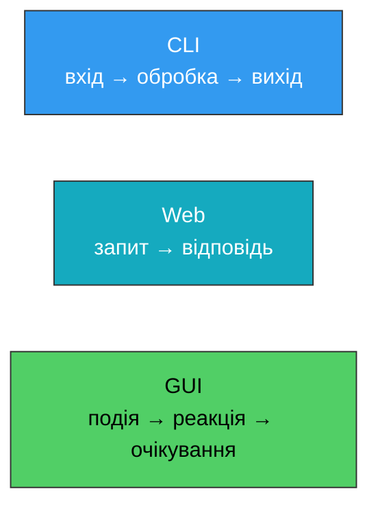
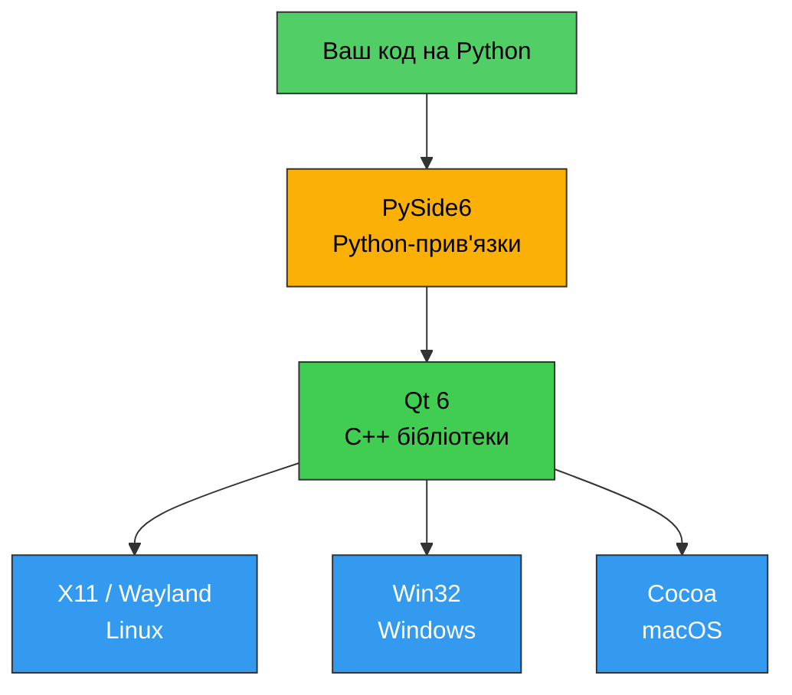
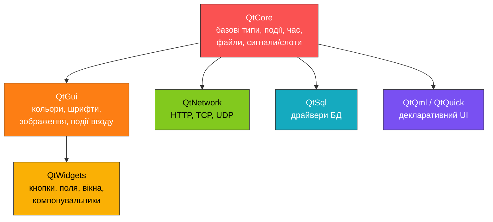
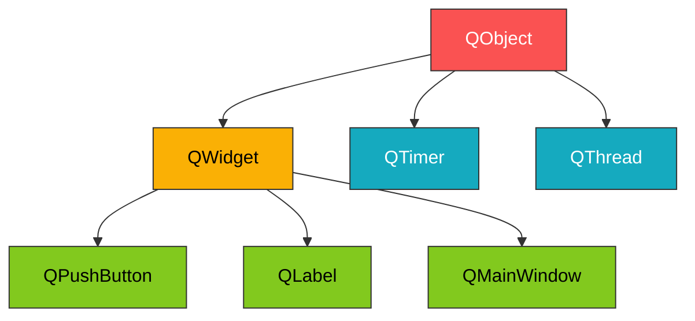
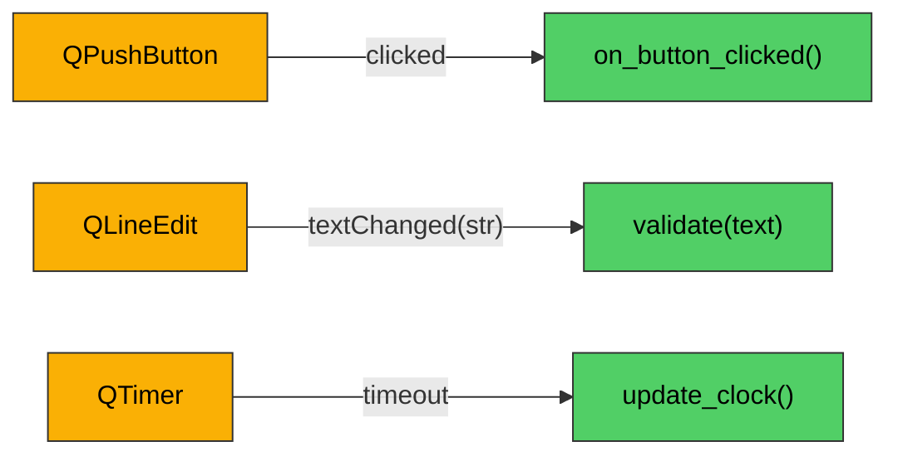
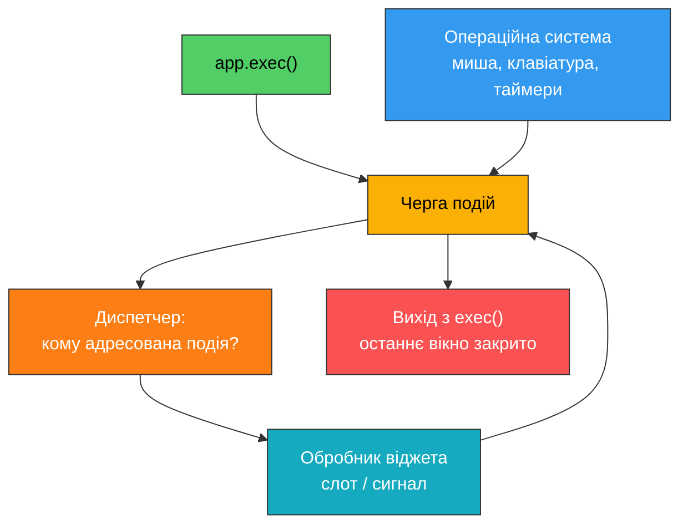

# 1. (Л) Вступ до PySide6 та архітектури Qt

## Зміст лекції

1. Що таке GUI-застосунок
2. Qt — що це і звідки взялося
3. PySide6 vs PyQt6: що обрати
4. Архітектура Qt: модулі
5. `QObject` — фундамент усього
6. Дерево об'єктів та управління пам'яттю
7. Сигнали та слоти
8. Цикл подій (event loop)
9. Qt Widgets vs Qt Quick (QML)
10. Встановлення PySide6 на Linux
11. Перший застосунок
12. Інструменти командного рядка

## Що таке GUI-застосунок

Досі ми писали програми двох типів:

- **CLI-застосунки** — читають аргументи та `stdin`, пишуть у `stdout`, завершуються.
- **Веб-сервіси** — приймають HTTP-запити, повертають відповіді, живуть у циклі обробки запитів.

**GUI-застосунок** (Graphical User Interface) відрізняється принципово: він не «виконується від початку до кінця». Після запуску він переходить у **нескінченний цикл очікування подій** — рухів миші, натискань клавіш, перемальовування вікна, таймерів, даних із мережі. Програма реагує на ці події і знову засинає.



Це означає зміну способу мислення: замість «що програма робить крок за кроком» ми описуємо «як програма реагує на те, що робить користувач».

## Qt — що це і звідки взялося

**Qt** (вимовляється «к'ют») — кросплатформний фреймворк, написаний на C++. Створений у 1991 році норвезькими розробниками Хааваром Нордом та Ейріком Чамб-Інґом, компанія Trolltech. Зараз розвивається The Qt Company.

Qt — це **не тільки GUI**. Це повноцінний фреймворк розробки застосунків:

- Віджети та графічний інтерфейс
- Робота з мережею (HTTP, TCP, UDP, SSL)
- Бази даних (SQL-драйвери)
- Багатопотоковість
- Робота з файлами, XML, JSON
- Мультимедіа, 3D-графіка, друк

На Qt написані KDE Plasma, VLC, OBS Studio, Telegram Desktop, Autodesk Maya, програмне забезпечення для автомобілів Mercedes-Benz та медичного обладнання.

Ключова властивість — **кросплатформність**: один код працює на Linux, Windows, macOS, Android, iOS та вбудованих системах. Qt сам звертається до нативного API конкретної системи.



## PySide6 vs PyQt6: що обрати

Qt написаний на C++. Щоб користуватись ним із Python, потрібні **прив'язки** (bindings) — шар, який транслює виклики Python у виклики C++.

Існує дві основні реалізації:

| | **PySide6** | **PyQt6** |
|---|---|---|
| Розробник | The Qt Company (офіційні) | Riverbank Computing |
| Ліцензія | LGPL v3 | GPL v3 або комерційна |
| Комерційне використання | Вільно, з дотриманням LGPL | Потребує купівлі ліцензії |
| API | Практично ідентичний | Практично ідентичний |

**Чому в курсі PySide6:**

- Це **офіційні** прив'язки від творців Qt — вони завжди актуальні до останньої версії Qt.
- Ліцензія LGPL дозволяє використовувати їх у закритих комерційних проєктах (за умови динамічного лінкування, що і відбувається за замовчуванням).

API двох бібліотек збігається на ~95%, тому знання PySide6 легко переноситься на PyQt6. Основні відмінності:

```python
# PySide6
from PySide6.QtCore import Signal, Slot

# PyQt6 — ті самі речі названі інакше
# from PyQt6.QtCore import pyqtSignal, pyqtSlot
```

!!! warning "Не змішуйте бібліотеки"
    Ніколи не встановлюйте PySide6 і PyQt6 в одне віртуальне середовище. Обидві завантажують власну копію бібліотек Qt, і застосунок падає з незрозумілими помилками.

## Архітектура Qt: модулі

Qt поділений на модулі. У PySide6 кожен модуль Qt — це окремий Python-пакет усередині `PySide6`.



**Ключові модулі:**

- **`QtCore`** — фундамент. Не містить нічого графічного. Тут живуть `QObject`, сигнали та слоти, цикл подій, таймери, робота з файлами (`QFile`), датами (`QDateTime`), потоками (`QThread`).
- **`QtGui`** — низькорівнева графіка: `QColor`, `QFont`, `QPixmap`, `QPainter`, події клавіатури та миші (`QKeyEvent`, `QMouseEvent`).
- **`QtWidgets`** — готові елементи інтерфейсу: `QPushButton`, `QLabel`, `QLineEdit`, `QMainWindow`, компонувальники (`QVBoxLayout`).
- **`QtNetwork`**, **`QtSql`**, **`QtCharts`**, **`QtMultimedia`** — спеціалізовані модулі.

Залежність між модулями односпрямована: `QtWidgets` потребує `QtGui`, який потребує `QtCore`. Зворотного напрямку немає — тому серверний код на `QtCore` можна писати без графічного середовища взагалі.

## `QObject` — фундамент усього

Майже кожен клас Qt успадковується від **`QObject`**. Це базовий клас, який дає три речі, недоступні звичайним Python-об'єктам:

1. **Сигнали та слоти** — механізм зв'язку між об'єктами.
2. **Дерево об'єктів** — автоматичне управління часом життя.
3. **Систему властивостей та подій.**



**`QWidget`** — це `QObject`, який уміє малювати себе на екрані та обробляти ввід користувача. Будь-який віджет без батька стає окремим вікном.

## Дерево об'єктів та управління пам'яттю

Кожен `QObject` може мати **батька** (parent) і будь-яку кількість **нащадків** (children). Правило просте:

> Коли об'єкт знищується, він автоматично знищує всіх своїх нащадків.

Це прийшло з C++, де немає збирача сміття, і залишилось у PySide6. Наслідок для нас: якщо віджет має батька, ми не мусимо тримати на нього посилання в Python — його «тримає» батько.

```python
from PySide6.QtCore import QObject


def print_tree(obj, depth=0):
    """Рекурсивно виводить дерево об'єктів з відступами."""
    print("  " * depth + obj.objectName())
    for child in obj.children():
        print_tree(child, depth + 1)


def main():
    # Кореневий об'єкт без батька
    window = QObject()
    window.setObjectName("window")

    # Батько передається першим аргументом конструктора
    toolbar = QObject(window)
    toolbar.setObjectName("toolbar")

    status_bar = QObject(window)
    status_bar.setObjectName("status_bar")

    save_button = QObject(toolbar)
    save_button.setObjectName("save_button")

    print_tree(window)

    # findChild шукає на будь-якій глибині, а не лише серед прямих нащадків
    found = window.findChild(QObject, "save_button")
    print("Found by name:", found.objectName())
    print("Its parent is:", found.parent().objectName())


if __name__ == "__main__":
    main()
```

Очікуваний вивід:

```
window
  toolbar
    save_button
  status_bar
Found by name: save_button
Its parent is: toolbar
```

!!! danger "Класична помилка початківця"
    Якщо створити віджет без батька і не зберегти на нього посилання в Python-змінній — збирач сміття Python знищить його, і вікно зникне одразу після появи. Далі ми побачимо, чому `window = MainWindow()` обов'язково присвоюється змінній.

## Сигнали та слоти

Це головна ідея Qt. Замість callback-функцій, які треба передавати вручну, Qt пропонує механізм **сигналів** та **слотів**.

- **Сигнал** — повідомлення, яке об'єкт «випромінює», коли з ним щось сталося (кнопку натиснуто, текст змінено, таймер спрацював).
- **Слот** — звичайна функція або метод, який викликається у відповідь.
- **`connect()`** — з'єднує їх.



Чому це краще за callback:

- Об'єкт, який випромінює сигнал, **не знає нічого** про того, хто його слухає. Це слабке зв'язування (loose coupling).
- Один сигнал можна підключити до **багатьох** слотів.
- Один слот може приймати сигнали від **багатьох** об'єктів.
- З'єднання можна розірвати в будь-який момент (`disconnect()`).
- Якщо об'єкт знищено — усі його з'єднання розриваються автоматично, без «висячих» вказівників.

### Власні сигнали

Сигнали не обмежені вбудованими. Ви оголошуєте власні як атрибути класу:

```python
from PySide6.QtCore import QObject, Signal


class Thermometer(QObject):
    # Оголошення сигналу з одним аргументом типу int.
    # Це атрибут КЛАСУ, а не екземпляра.
    temperature_changed = Signal(int)

    def __init__(self):
        super().__init__()
        self._value = 0

    def set_value(self, value):
        # Сигнал надсилаємо лише коли значення дійсно змінилось
        if value != self._value:
            self._value = value
            self.temperature_changed.emit(value)


def on_temperature_changed(value):
    print(f"Temperature is now {value} degrees")


def show_warning(value):
    if value > 30:
        print("WARNING: too hot!")


def main():
    sensor = Thermometer()

    # Один сигнал -> два слоти. Викликаються в порядку підключення.
    sensor.temperature_changed.connect(on_temperature_changed)
    sensor.temperature_changed.connect(show_warning)

    sensor.set_value(21)
    sensor.set_value(21)  # значення те саме - сигналу не буде
    sensor.set_value(35)


if __name__ == "__main__":
    main()
```

Вивід:

```
Temperature is now 21 degrees
Temperature is now 35 degrees
WARNING: too hot!
```

Зверніть увагу: цей приклад **не має графічного інтерфейсу і не потребує `QApplication`**. Сигнали та слоти живуть у `QtCore` і працюють самі по собі.

## Цикл подій (event loop)

Ви вже зустрічали цикл подій у `asyncio`. У Qt він влаштований на тій самій ідеї, але обслуговує події вікон.



Виклик `app.exec()` **блокує** виконання і не повертає керування, поки застосунок працює. Усередині нього Qt у нескінченному циклі:

1. Забирає наступну подію з черги (або спить, якщо черга порожня).
2. Визначає, якому об'єкту вона адресована.
3. Викликає відповідний обробник — і той може випромінити сигнал, який викличе ваш слот.
4. Повертається до кроку 1.

!!! warning "Головне правило GUI-програмування"
    Слот виконується **в тому самому потоці**, що й цикл подій. Поки ваш слот працює, цикл подій стоїть — вікно не перемальовується і не реагує на кліки. Тому жоден слот не повинен виконуватись довго: ніяких `time.sleep()`, довгих обчислень чи синхронних мережевих запитів. Як це обходити — тема наступних занять.

## Qt Widgets vs Qt Quick (QML)

Qt пропонує два підходи до побудови інтерфейсу.

**Qt Widgets** — класичний, імперативний. Ви створюєте об'єкти віджетів у коді Python, складаєте їх у компонувальники. Виглядає нативно для десктопної ОС.

**Qt Quick / QML** — декларативний. Інтерфейс описується мовою QML (схожа на JSON + JavaScript), логіка залишається в Python. Орієнтований на анімації, сенсорні екрани, мобільні застосунки.

| | Qt Widgets | Qt Quick (QML) |
|---|---|---|
| Мова опису UI | Python | QML |
| Вигляд | Нативний для ОС | Власний, кастомізований |
| Складні таблиці, форми | Дуже зручно | Складніше |
| Анімації, дотик | Обмежено | Сильна сторона |
| Апаратне прискорення | Ні (за замовчуванням) | Так |

У цьому курсі ми працюємо з **Qt Widgets** — вони простіші для старту, краще підходять для класичних десктопних застосунків і повністю описуються з Python.

## Встановлення PySide6 на Linux

### Крок 1. Перевірка версії Python

PySide6 потребує Python 3.9 або новішої версії. Рекомендую 3.11+.

```bash
python3 --version
```

### Крок 2. Системні залежності

PySide6 постачається як готові бінарні пакети (wheels), які вже містять бібліотеки Qt. Але Qt потребує системних бібліотек графічної підсистеми, яких у мінімальних інсталяціях Linux може не бути.

**Debian / Ubuntu / Linux Mint:**

```bash
sudo apt update
sudo apt install -y python3-venv python3-pip \
    libgl1 libegl1 libdbus-1-3 libxkbcommon-x11-0 \
    libxcb-cursor0 libxcb-icccm4 libxcb-image0 \
    libxcb-keysyms1 libxcb-randr0 libxcb-render-util0 \
    libxcb-shape0 libxcb-xinerama0 libxcb-xkb1
```

**Fedora / RHEL:**

```bash
sudo dnf install -y python3-pip \
    mesa-libGL mesa-libEGL dbus-libs libxkbcommon-x11 \
    xcb-util-cursor xcb-util-wm xcb-util-image \
    xcb-util-keysyms xcb-util-renderutil
```

**Arch Linux:**

```bash
sudo pacman -S --needed python-pip libglvnd libxkbcommon-x11 \
    xcb-util-cursor xcb-util-wm xcb-util-image \
    xcb-util-keysyms xcb-util-renderutil
```

!!! note "Якщо ви у графічному середовищі"
    На звичайному робочому столі (GNOME, KDE, XFCE) більшість цих бібліотек уже встановлені. Найчастіше бракує саме `libxcb-cursor0` — без нього Qt 6 не запускається під X11.

### Крок 3. Віртуальне середовище

Ніколи не встановлюйте PySide6 глобально через `pip` — це може конфліктувати з системними пакетами Qt.

```bash
mkdir ~/pyside-course && cd ~/pyside-course

python3 -m venv env
source env/bin/activate
```

Після активації в запрошенні терміналу з'явиться префікс `(env)`.

### Крок 4. Встановлення PySide6

```bash
pip install --upgrade pip
pip install PySide6
```

Пакет важить близько 100–200 МБ, бо містить у собі повний набір бібліотек Qt.

Зафіксуйте залежності проєкту:

```bash
pip freeze > requirements.txt
```

### Крок 5. Перевірка встановлення

Створіть файл `check_install.py`:

```python
import PySide6
from PySide6.QtCore import qVersion


def main():
    print("PySide6 version:", PySide6.__version__)
    print("Qt runtime version:", qVersion())


if __name__ == "__main__":
    main()
```

Запуск:

```bash
python3 check_install.py
```

Очікуваний вивід (номери версій можуть відрізнятись):

```
PySide6 version: 6.11.1
Qt runtime version: 6.11.1
```

Якщо це спрацювало — Python-частина працює. Тепер перевіримо графічну.

## Перший застосунок

Створіть файл `hello.py`:

```python
import sys

from PySide6.QtWidgets import QApplication, QLabel


def main():
    # QApplication керує циклом подій та ресурсами застосунку.
    # Має бути рівно один на процес і створений ДО будь-якого віджета.
    app = QApplication(sys.argv)

    # Віджет без батька автоматично стає окремим вікном
    label = QLabel("Hello, Qt!")
    label.setWindowTitle("First PySide6 App")
    label.resize(320, 120)

    # Віджети створюються прихованими - показуємо явно
    label.show()

    # exec() запускає цикл подій і блокує виконання,
    # поки не буде закрито останнє вікно
    sys.exit(app.exec())


if __name__ == "__main__":
    main()
```

```bash
python3 hello.py
```

Має з'явитись вікно з написом. Якщо з'явилось — установка повністю успішна.

### Розбір рядок за рядком

**`app = QApplication(sys.argv)`**
Об'єкт застосунку. Він ініціалізує графічну підсистему, читає системні налаштування (тему, шрифти, мову) і володіє чергою подій. `sys.argv` передається тому, що Qt розуміє власні аргументи командного рядка, наприклад `-style Fusion` або `-platform wayland`.

**`label = QLabel("Hello, Qt!")`**
`QLabel` — віджет для показу тексту або зображення. Батька не вказано, отже це вікно верхнього рівня.

**`label.show()`**
Позначає віджет як видимий. Реальна поява на екрані відбудеться вже всередині циклу подій.

**`sys.exit(app.exec())`**
`app.exec()` віддає керування циклу подій. Значення, яке він поверне після закриття вікна, стає кодом виходу процесу.

### Приклад із сигналом та слотом

Створіть файл `counter.py`:

```python
import sys

from PySide6.QtWidgets import (
    QApplication,
    QLabel,
    QPushButton,
    QVBoxLayout,
    QWidget,
)


class CounterWindow(QWidget):
    def __init__(self):
        super().__init__()

        self.setWindowTitle("Counter")
        self.clicks = 0

        self.label = QLabel("Clicks: 0")
        self.button = QPushButton("Click me")
        self.reset_button = QPushButton("Reset")

        # Компонувальник розміщує віджети вертикально
        # і сам перераховує їх розміри при зміні вікна
        layout = QVBoxLayout()
        layout.addWidget(self.label)
        layout.addWidget(self.button)
        layout.addWidget(self.reset_button)
        self.setLayout(layout)

        # З'єднання сигналів зі слотами.
        # Дужок після імені методу немає - передаємо саму функцію,
        # а не результат її виклику.
        self.button.clicked.connect(self.on_click)
        self.reset_button.clicked.connect(self.on_reset)

    def on_click(self):
        self.clicks += 1
        self.label.setText(f"Clicks: {self.clicks}")

    def on_reset(self):
        self.clicks = 0
        self.label.setText("Clicks: 0")


def main():
    app = QApplication(sys.argv)

    # Посилання зберігається у змінній window,
    # інакше збирач сміття знищить об'єкт і вікно зникне
    window = CounterWindow()
    window.resize(300, 150)
    window.show()

    sys.exit(app.exec())


if __name__ == "__main__":
    main()
```

Тут видно всі концепції лекції одночасно:

- `CounterWindow` успадковується від `QWidget`, отже є `QObject` — має сигнали та може мати нащадків.
- `self.label` і `self.button` отримують `CounterWindow` за батька автоматично, коли їх додано до компонувальника.
- `clicked` — вбудований сигнал `QPushButton`; `on_click` — наш слот.
- `app.exec()` крутить цикл подій, який і викликає слоти.

## Інструменти командного рядка

Разом із PySide6 встановлюються допоміжні утиліти. Вони доступні одразу після активації віртуального середовища:

```bash
pyside6-designer     # візуальний редактор форм, зберігає .ui (XML)
pyside6-uic form.ui -o ui_form.py    # .ui -> Python-код
pyside6-rcc res.qrc -o rc_res.py     # ресурси (іконки) -> Python-модуль
pyside6-lupdate      # витяг рядків для перекладу
pyside6-project      # управління проєктом Qt для Python
```

`pyside6-designer` дозволяє малювати вікно мишею замість написання коду. У цьому курсі ми спершу пишемо інтерфейс руками — так зрозуміліше, що саме відбувається, — а до Designer повернемось пізніше.


## Підсумок

- **Qt** — кросплатформний C++ фреймворк; **PySide6** — офіційні Python-прив'язки до нього під ліцензією LGPL.
- Qt поділений на модулі; `QtCore` — фундамент без графіки, `QtWidgets` — елементи інтерфейсу.
- **`QObject`** дає сигнали/слоти та дерево об'єктів з автоматичним управлінням часом життя.
- **Сигнали та слоти** замінюють callback і забезпечують слабке зв'язування компонентів.
- GUI-застосунок живе в **циклі подій**; довгі операції в слотах «підвішують» інтерфейс.
- На Linux достатньо `pip install PySide6` у venv плюс кілька системних бібліотек xcb.

## Корисні посилання

- [Документація Qt for Python (PySide6)](https://doc.qt.io/qtforpython-6/)
- [Довідник модулів PySide6](https://doc.qt.io/qtforpython-6/modules.html)
- [Огляд сигналів та слотів](https://doc.qt.io/qtforpython-6/tutorials/basictutorial/signals_and_slots.html)
- [Документація Qt 6 (C++, для деталей поведінки класів)](https://doc.qt.io/qt-6/)
- [Порівняння ліцензій Qt](https://www.qt.io/licensing/)

## Домашнє завдання

1. Налаштувати віртуальне середовище та встановити PySide6 за інструкцією вище.
2. Запустити `check_install.py`, `hello.py` та `counter.py`. Переконатись, що всі три працюють.
3. Прочитати розділ [Signals and Slots](https://doc.qt.io/qtforpython-6/tutorials/basictutorial/signals_and_slots.html) офіційної документації.
4. Модифікувати `counter.py`: додати третю кнопку, яка зменшує лічильник на одиницю, і зробити так, щоб лічильник не опускався нижче нуля.
