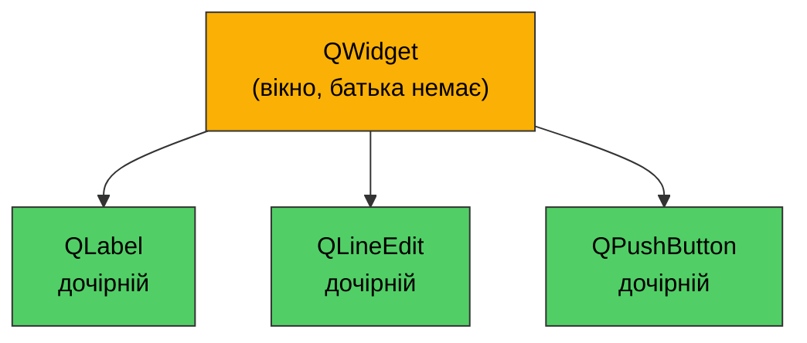
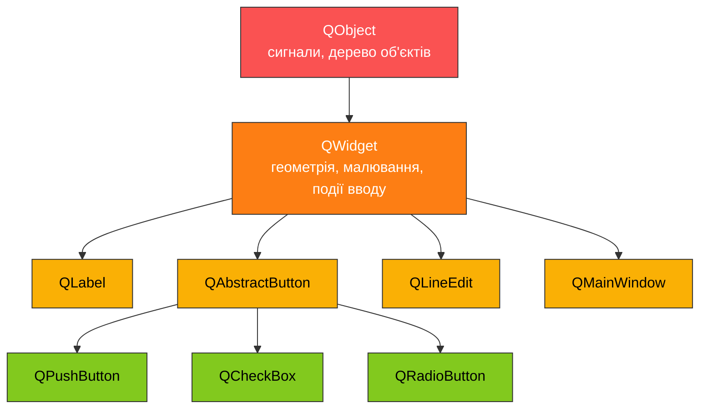
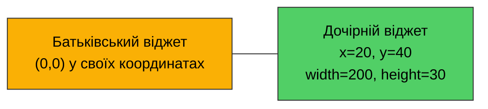
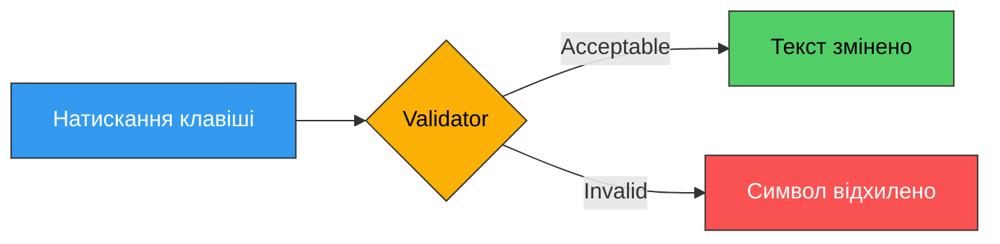

# 3. (Л) Базові віджети: QWidget, QPushButton, QLabel, QLineEdit

## Зміст лекції

1. Що таке віджет
2. `QWidget` — базовий клас усіх віджетів
3. Геометрія та розміри
4. Спільні властивості всіх віджетів
5. `QLabel` — показ тексту та зображень
6. `QPushButton` — кнопки та їхні сигнали
7. `QLineEdit` — однорядкове поле введення
8. Валідація введення
9. Компонувальники: мінімум, потрібний для роботи
10. Збірка: форма реєстрації
11. Типові помилки

## Що таке віджет

**Віджет** (widget, від *window gadget*) — прямокутна ділянка екрана, яка вміє дві речі:

1. **Малювати себе** — фон, рамку, текст, іконку.
2. **Обробляти події** — натискання миші, клавіші, отримання фокуса, зміну розміру.

Усе, що ви бачите у вікні застосунку Qt, — віджет. Саме вікно теж віджет. Кнопка всередині вікна — теж. Різниця лише в тому, чи має віджет батька.



!!! note "Правило вікна"
    Віджет **без батька** стає окремим вікном верхнього рівня з рамкою, заголовком і кнопками ОС.
    Віджет **із батьком** малюється всередині батька і обрізається його межами.

## `QWidget` — базовий клас усіх віджетів

`QWidget` успадковується від `QObject` і додає до нього все, що стосується екрана: координати, розмір, шрифт, курсор, видимість, фокус.



`QWidget` використовують двома способами:

- **Напряму** — як порожній контейнер, у який складають інші віджети (саме так ми робимо вікна).
- **Через успадкування** — коли потрібна власна поведінка або власне малювання.

Найпоширеніший шаблон у PySide6 — власний клас-нащадок `QWidget`, який у `__init__` створює дочірні віджети та з'єднує сигнали:

```python
import sys

from PySide6.QtWidgets import QApplication, QLabel, QVBoxLayout, QWidget


class MainWindow(QWidget):
    def __init__(self):
        super().__init__()  # обов'язково: ініціалізує C++-частину об'єкта

        self.setWindowTitle("Widget Basics")

        self.title = QLabel("Everything here is a widget")

        layout = QVBoxLayout()
        layout.addWidget(self.title)
        self.setLayout(layout)


def main():
    app = QApplication(sys.argv)

    window = MainWindow()
    window.resize(360, 120)
    window.show()

    sys.exit(app.exec())


if __name__ == "__main__":
    main()
```

!!! danger "`super().__init__()` не можна пропускати"
    Без цього виклику Python-об'єкт існує, а C++-об'єкт Qt — ні. Будь-який наступний виклик методу Qt завершиться помилкою типу `RuntimeError: '__init__' method of object's base class not called`.

## Геометрія та розміри

Кожен віджет має позицію відносно **батька** (для вікна — відносно екрана) і розмір.



Основні методи:

| Метод | Призначення |
|---|---|
| `resize(w, h)` | Задати розмір |
| `move(x, y)` | Задати позицію відносно батька |
| `setGeometry(x, y, w, h)` | Позиція і розмір одним викликом |
| `setFixedSize(w, h)` | Заборонити зміну розміру |
| `setMinimumSize(w, h)` / `setMaximumSize(w, h)` | Межі зміни розміру |
| `width()`, `height()`, `x()`, `y()` | Поточні значення |
| `sizeHint()` | Розмір, який віджет вважає для себе оптимальним |

```python
import sys

from PySide6.QtWidgets import QApplication, QLabel, QPushButton, QWidget


def main():
    app = QApplication(sys.argv)

    window = QWidget()
    window.setWindowTitle("Geometry")
    window.resize(400, 200)

    # Дочірні віджети без компонувальника розміщуються вручну.
    # Так робити незручно, але корисно один раз побачити.
    label = QLabel("Placed manually", window)
    label.move(20, 20)

    button = QPushButton("Button", window)
    button.setGeometry(20, 60, 150, 40)

    window.show()

    # Реальні розміри відомі лише ПІСЛЯ show(),
    # бо до цього моменту менеджер вікон ще не втручався
    print("window size:", window.width(), "x", window.height())
    print("button geometry:", button.geometry())
    print("label size hint:", label.sizeHint())

    sys.exit(app.exec())


if __name__ == "__main__":
    main()
```

Приблизний вивід:

```
window size: 400 x 200
button geometry: PySide6.QtCore.QRect(20, 60, 150, 40)
label size hint: PySide6.QtCore.QSize(97, 22)
```

!!! warning "Ручне позиціонування — тимчасовий інструмент"
    `move()` та `setGeometry()` жорстко прив'язують віджет до пікселів. При зміні розміру вікна, іншому шрифті або іншій мові інтерфейсу все «поїде». У реальних застосунках використовують **компонувальники** (див. нижче).

## Спільні властивості всіх віджетів

Оскільки всі віджети — нащадки `QWidget`, ці методи працюють для будь-якого з них.

| Метод | Що робить |
|---|---|
| `show()` / `hide()` | Показати / приховати |
| `setVisible(bool)` | Те саме одним викликом |
| `setEnabled(bool)` | Активний / неактивний (сірий, не реагує на ввід) |
| `setToolTip(text)` | Спливаюча підказка |
| `setWindowTitle(text)` | Заголовок (лише для вікон) |
| `setFocus()` | Передати фокус клавіатури |
| `setStyleSheet(css)` | Оформлення у синтаксисі, схожому на CSS |
| `setFont(font)` | Шрифт |
| `close()` | Закрити вікно |

```python
import sys

from PySide6.QtGui import QFont
from PySide6.QtWidgets import (
    QApplication,
    QLabel,
    QLineEdit,
    QPushButton,
    QVBoxLayout,
    QWidget,
)


class CommonProps(QWidget):
    def __init__(self):
        super().__init__()

        self.setWindowTitle("Common widget properties")

        self.label = QLabel("Styled label")
        self.label.setFont(QFont("Sans Serif", 16, QFont.Weight.Bold))
        self.label.setStyleSheet("color: #1971c2;")
        self.label.setToolTip("This label uses a custom font and color")

        self.field = QLineEdit()
        self.field.setPlaceholderText("Disabled field")
        self.field.setEnabled(False)

        self.toggle_button = QPushButton("Enable field")
        self.toggle_button.clicked.connect(self.on_toggle)

        layout = QVBoxLayout()
        layout.addWidget(self.label)
        layout.addWidget(self.field)
        layout.addWidget(self.toggle_button)
        self.setLayout(layout)

    def on_toggle(self):
        # isEnabled() повертає поточний стан, інвертуємо його
        enabled = not self.field.isEnabled()
        self.field.setEnabled(enabled)
        self.field.setPlaceholderText("Enabled field" if enabled else "Disabled field")
        self.toggle_button.setText("Disable field" if enabled else "Enable field")


def main():
    app = QApplication(sys.argv)

    window = CommonProps()
    window.resize(360, 180)
    window.show()

    sys.exit(app.exec())


if __name__ == "__main__":
    main()
```

## `QLabel` — показ тексту та зображень

`QLabel` — найпростіший віджет: він щось показує і не приймає введення.

### Текст

```python
label = QLabel("Plain text")
label.setText("New text")       # змінити
current = label.text()          # прочитати
```

### Вирівнювання

Вирівнювання задається прапорцями з перелічення `Qt.AlignmentFlag`:

```python
from PySide6.QtCore import Qt

label.setAlignment(Qt.AlignmentFlag.AlignCenter)
label.setAlignment(Qt.AlignmentFlag.AlignRight | Qt.AlignmentFlag.AlignVCenter)
```

Горизонтальні: `AlignLeft`, `AlignHCenter`, `AlignRight`, `AlignJustify`.
Вертикальні: `AlignTop`, `AlignVCenter`, `AlignBottom`.
`AlignCenter` = `AlignHCenter | AlignVCenter`.

### Форматований текст

`QLabel` розуміє підмножину HTML. Формат визначається автоматично, але його можна задати явно:

```python
label.setTextFormat(Qt.TextFormat.RichText)
label.setText("<b>Bold</b> and <i>italic</i> and <span style='color:red'>red</span>")
```

### Перенесення рядків

За замовчуванням довгий текст розтягує віджет у ширину. Щоб він переносився:

```python
label.setWordWrap(True)
```

### Зображення

```python
from PySide6.QtGui import QPixmap

label.setPixmap(QPixmap("photo.png"))
label.setScaledContents(True)   # масштабувати під розмір віджета
```

### Клікабельні посилання

```python
label.setText('<a href="https://doc.qt.io/qtforpython-6/">Qt for Python docs</a>')
label.setOpenExternalLinks(True)   # відкривати у браузері системи
```

Повний приклад:

```python
import sys

from PySide6.QtCore import Qt
from PySide6.QtWidgets import QApplication, QLabel, QVBoxLayout, QWidget


class LabelDemo(QWidget):
    def __init__(self):
        super().__init__()

        self.setWindowTitle("QLabel demo")

        plain = QLabel("Plain left-aligned text")

        centered = QLabel("Centered text")
        centered.setAlignment(Qt.AlignmentFlag.AlignCenter)

        rich = QLabel("<b>Bold</b>, <i>italic</i> and <u>underlined</u>")

        wrapped = QLabel(
            "This is a long line of text that demonstrates automatic word "
            "wrapping inside a QLabel when the widget is not wide enough."
        )
        wrapped.setWordWrap(True)

        link = QLabel('<a href="https://doc.qt.io/qtforpython-6/">PySide6 documentation</a>')
        link.setOpenExternalLinks(True)
        # Сигнал спрацьовує при кліку на посилання і передає його URL
        link.linkActivated.connect(self.on_link_activated)

        layout = QVBoxLayout()
        for widget in (plain, centered, rich, wrapped, link):
            layout.addWidget(widget)
        self.setLayout(layout)

    def on_link_activated(self, url):
        print("Link clicked:", url)


def main():
    app = QApplication(sys.argv)

    window = LabelDemo()
    window.resize(380, 220)
    window.show()

    sys.exit(app.exec())


if __name__ == "__main__":
    main()
```

## `QPushButton` — кнопки та їхні сигнали

`QPushButton` успадковується від `QAbstractButton`, звідки отримує чотири сигнали:

| Сигнал | Коли надсилається |
|---|---|
| `pressed()` | Кнопку миші натиснуто над кнопкою |
| `released()` | Кнопку миші відпущено |
| `clicked(bool checked)` | Натиснуто **і** відпущено в межах кнопки |
| `toggled(bool checked)` | Змінився стан кнопки-перемикача |

У 99% випадків потрібен саме `clicked`.

### Пастка: `clicked` передає аргумент

`clicked` завжди надсилає булеве значення `checked`. Для звичайної кнопки воно `False`, але воно **передається у слот**:

```python
def on_click(self):            # 0 параметрів - працює
    ...

def on_click(self, checked):   # 1 параметр - теж працює, отримає False
    ...
```

Проблема виникає, коли слот має інший змістовний параметр:

```python
# ПОМИЛКА: setText отримає False замість тексту
button.clicked.connect(self.label.setText)

# ПРАВИЛЬНО: lambda відкидає аргумент сигналу
button.clicked.connect(lambda: self.label.setText("Clicked"))
```

### Кнопка-перемикач

```python
button.setCheckable(True)
button.setChecked(True)        # початковий стан
button.toggled.connect(self.on_toggled)   # слот отримує bool
```

### Гарячі клавіші та вигляд за замовчуванням

```python
button.setShortcut("Ctrl+S")   # клавіатурне скорочення
button.setDefault(True)        # спрацьовує на Enter у діалозі
button.setText("&Save")        # Alt+S; символ S буде підкреслено
```

Повний приклад:

```python
import sys

from PySide6.QtWidgets import (
    QApplication,
    QLabel,
    QPushButton,
    QVBoxLayout,
    QWidget,
)


class ButtonDemo(QWidget):
    def __init__(self):
        super().__init__()

        self.setWindowTitle("QPushButton demo")
        self.counter = 0

        self.status = QLabel("Ready")

        self.normal_button = QPushButton("Normal button")
        self.normal_button.setToolTip("Increments the counter")
        self.normal_button.clicked.connect(self.on_normal_clicked)

        self.toggle_button = QPushButton("Toggle me")
        self.toggle_button.setCheckable(True)
        self.toggle_button.toggled.connect(self.on_toggled)

        self.shortcut_button = QPushButton("&Reset")
        self.shortcut_button.setShortcut("Ctrl+R")
        self.shortcut_button.setToolTip("Ctrl+R or Alt+R")
        self.shortcut_button.clicked.connect(self.on_reset)

        # lambda дозволяє передати у слот власні дані замість
        # аргументу сигналу clicked
        self.quit_button = QPushButton("Quit")
        self.quit_button.clicked.connect(lambda: self.close())

        layout = QVBoxLayout()
        layout.addWidget(self.status)
        layout.addWidget(self.normal_button)
        layout.addWidget(self.toggle_button)
        layout.addWidget(self.shortcut_button)
        layout.addWidget(self.quit_button)
        self.setLayout(layout)

    def on_normal_clicked(self):
        self.counter += 1
        self.status.setText(f"Clicks: {self.counter}")

    def on_toggled(self, checked):
        # Слот toggled отримує новий стан кнопки
        self.status.setText(f"Toggle is {'ON' if checked else 'OFF'}")
        self.normal_button.setEnabled(not checked)

    def on_reset(self):
        self.counter = 0
        self.status.setText("Ready")


def main():
    app = QApplication(sys.argv)

    window = ButtonDemo()
    window.resize(320, 220)
    window.show()

    sys.exit(app.exec())


if __name__ == "__main__":
    main()
```

## `QLineEdit` — однорядкове поле введення

`QLineEdit` приймає **один рядок** тексту. Для багаторядкового введення існує `QTextEdit`.

### Основні методи

| Метод | Призначення |
|---|---|
| `text()` | Отримати введений текст |
| `setText(s)` | Встановити текст програмно |
| `clear()` | Очистити |
| `setPlaceholderText(s)` | Сірий підказковий текст порожнього поля |
| `setMaxLength(n)` | Обмеження довжини |
| `setReadOnly(bool)` | Тільки читання (текст можна виділити й скопіювати) |
| `setEchoMode(mode)` | Режим показу символів |
| `selectAll()` | Виділити весь текст |

### Режими показу

```python
from PySide6.QtWidgets import QLineEdit

field.setEchoMode(QLineEdit.EchoMode.Normal)             # звичайний
field.setEchoMode(QLineEdit.EchoMode.Password)           # крапки
field.setEchoMode(QLineEdit.EchoMode.NoEcho)             # нічого не видно
field.setEchoMode(QLineEdit.EchoMode.PasswordEchoOnEdit) # видно лише під час набору
```

### Сигнали

| Сигнал | Коли надсилається |
|---|---|
| `textChanged(str)` | Текст змінився — і від користувача, і від `setText()` |
| `textEdited(str)` | Текст змінив **користувач** (не спрацьовує на `setText()`) |
| `returnPressed()` | Натиснуто Enter |
| `editingFinished()` | Enter або втрата фокуса **за умови валідного вмісту** |
| `cursorPositionChanged(int, int)` | Курсор перемістився |
| `selectionChanged()` | Змінилось виділення |

!!! tip "`textChanged` чи `textEdited`?"
    Якщо у слоті ви змінюєте текст того самого поля — беріть `textEdited`, інакше `setText()` усередині слота знову викличе слот і ви отримаєте нескінченну рекурсію.

Повний приклад:

```python
import sys

from PySide6.QtWidgets import (
    QApplication,
    QLabel,
    QLineEdit,
    QPushButton,
    QVBoxLayout,
    QWidget,
)


class LineEditDemo(QWidget):
    def __init__(self):
        super().__init__()

        self.setWindowTitle("QLineEdit demo")

        self.name_field = QLineEdit()
        self.name_field.setPlaceholderText("Enter your name")
        self.name_field.setMaxLength(30)
        self.name_field.textChanged.connect(self.on_name_changed)
        self.name_field.returnPressed.connect(self.on_return_pressed)

        self.password_field = QLineEdit()
        self.password_field.setPlaceholderText("Enter password")
        self.password_field.setEchoMode(QLineEdit.EchoMode.Password)

        self.show_password_button = QPushButton("Show password")
        self.show_password_button.setCheckable(True)
        self.show_password_button.toggled.connect(self.on_show_password)

        self.readonly_field = QLineEdit("Read-only value")
        self.readonly_field.setReadOnly(True)

        self.status = QLabel("Length: 0")

        layout = QVBoxLayout()
        layout.addWidget(self.name_field)
        layout.addWidget(self.password_field)
        layout.addWidget(self.show_password_button)
        layout.addWidget(self.readonly_field)
        layout.addWidget(self.status)
        self.setLayout(layout)

    def on_name_changed(self, text):
        # Слот отримує новий текст прямо з сигналу
        self.status.setText(f"Length: {len(text)}")

    def on_return_pressed(self):
        print("Submitted name:", self.name_field.text())

    def on_show_password(self, checked):
        mode = QLineEdit.EchoMode.Normal if checked else QLineEdit.EchoMode.Password
        self.password_field.setEchoMode(mode)
        self.show_password_button.setText("Hide password" if checked else "Show password")


def main():
    app = QApplication(sys.argv)

    window = LineEditDemo()
    window.resize(320, 220)
    window.show()

    sys.exit(app.exec())


if __name__ == "__main__":
    main()
```

## Валідація введення

Замість перевірки тексту вручну можна прикріпити до поля **валідатор** — він просто не дасть ввести неправильний символ.



Валідатори живуть у `QtGui`:

- **`QIntValidator(min, max)`** — цілі числа в діапазоні.
- **`QDoubleValidator(min, max, decimals)`** — дробові числа.
- **`QRegularExpressionValidator(regex)`** — довільний регулярний вираз.

```python
import sys

from PySide6.QtCore import QRegularExpression
from PySide6.QtGui import QIntValidator, QRegularExpressionValidator
from PySide6.QtWidgets import (
    QApplication,
    QFormLayout,
    QLabel,
    QLineEdit,
    QWidget,
)


class ValidationDemo(QWidget):
    def __init__(self):
        super().__init__()

        self.setWindowTitle("Input validation")

        # Приймає лише цілі числа від 1 до 120
        self.age_field = QLineEdit()
        self.age_field.setValidator(QIntValidator(1, 120, self))
        self.age_field.setPlaceholderText("1 - 120")

        # Латинські літери, цифри та підкреслення, 3-16 символів
        pattern = QRegularExpression(r"^[A-Za-z0-9_]{3,16}$")
        self.login_field = QLineEdit()
        self.login_field.setValidator(QRegularExpressionValidator(pattern, self))
        self.login_field.setPlaceholderText("3-16 latin chars")
        self.login_field.textChanged.connect(self.on_login_changed)

        self.status = QLabel("Login is not valid yet")

        # QFormLayout автоматично розміщує пару "підпис - поле"
        layout = QFormLayout()
        layout.addRow("Age:", self.age_field)
        layout.addRow("Login:", self.login_field)
        layout.addRow(self.status)
        self.setLayout(layout)

    def on_login_changed(self, text):
        # hasAcceptableInput() перевіряє, чи вміст повністю задовольняє валідатор
        if self.login_field.hasAcceptableInput():
            self.status.setText("Login is valid")
            self.status.setStyleSheet("color: green;")
        else:
            self.status.setText("Login is not valid yet")
            self.status.setStyleSheet("color: #c92a2a;")


def main():
    app = QApplication(sys.argv)

    window = ValidationDemo()
    window.resize(320, 140)
    window.show()

    sys.exit(app.exec())


if __name__ == "__main__":
    main()
```

!!! warning "Валідатор не гарантує повноти"
    Валідатор блокує лише **неможливі** символи. Проміжний стан (наприклад, порожнє поле або `ab` для правила «3–16 символів») він пропускає. Тому перед обробкою даних усе одно перевіряйте `hasAcceptableInput()`.

## Компонувальники: мінімум, потрібний для роботи

Компонувальник (layout) сам обчислює позиції та розміри дочірніх віджетів і перераховує їх при зміні розміру вікна. Детально — на наступній лекції, зараз потрібні три класи.

| Клас | Розміщення |
|---|---|
| `QVBoxLayout` | Вертикально, зверху вниз |
| `QHBoxLayout` | Горизонтально, зліва направо |
| `QFormLayout` | Двома колонками: підпис — поле |

```python
layout = QVBoxLayout()
layout.addWidget(widget)          # додати віджет
layout.addLayout(other_layout)    # вкласти інший компонувальник
layout.addStretch()               # «пружина», що з'їдає вільне місце
self.setLayout(layout)            # прикріпити до віджета
```

!!! note "Батьківство призначається автоматично"
    Коли ви викликаєте `layout.addWidget(button)`, а потім `self.setLayout(layout)`, Qt робить `self` батьком кнопки. Окремо викликати `button.setParent(self)` не потрібно.

## Збірка: форма реєстрації

Приклад, який поєднує всі чотири віджети лекції.

```python
import sys

from PySide6.QtCore import QRegularExpression, Qt
from PySide6.QtGui import QRegularExpressionValidator
from PySide6.QtWidgets import (
    QApplication,
    QFormLayout,
    QHBoxLayout,
    QLabel,
    QLineEdit,
    QPushButton,
    QVBoxLayout,
    QWidget,
)

MIN_PASSWORD_LENGTH = 8


class RegistrationForm(QWidget):
    def __init__(self):
        super().__init__()

        self.setWindowTitle("Registration")

        title = QLabel("Create an account")
        title.setAlignment(Qt.AlignmentFlag.AlignCenter)
        title.setStyleSheet("font-size: 18px; font-weight: bold;")

        # Логін: латиниця, цифри, підкреслення
        login_pattern = QRegularExpression(r"^[A-Za-z0-9_]{3,16}$")
        self.login_field = QLineEdit()
        self.login_field.setValidator(QRegularExpressionValidator(login_pattern, self))
        self.login_field.setPlaceholderText("3-16 latin chars")
        self.login_field.textChanged.connect(self.validate)

        self.email_field = QLineEdit()
        self.email_field.setPlaceholderText("user@example.com")
        self.email_field.textChanged.connect(self.validate)

        self.password_field = QLineEdit()
        self.password_field.setEchoMode(QLineEdit.EchoMode.Password)
        self.password_field.setPlaceholderText(f"at least {MIN_PASSWORD_LENGTH} chars")
        self.password_field.textChanged.connect(self.validate)

        self.repeat_field = QLineEdit()
        self.repeat_field.setEchoMode(QLineEdit.EchoMode.Password)
        self.repeat_field.setPlaceholderText("repeat password")
        self.repeat_field.textChanged.connect(self.validate)
        # Enter у останньому полі надсилає форму
        self.repeat_field.returnPressed.connect(self.on_submit)

        self.show_password_button = QPushButton("Show passwords")
        self.show_password_button.setCheckable(True)
        self.show_password_button.toggled.connect(self.on_show_passwords)

        self.status = QLabel("")
        self.status.setWordWrap(True)

        self.submit_button = QPushButton("Sign up")
        self.submit_button.setEnabled(False)
        self.submit_button.setDefault(True)
        self.submit_button.clicked.connect(self.on_submit)

        self.clear_button = QPushButton("Clear")
        self.clear_button.clicked.connect(self.on_clear)

        form = QFormLayout()
        form.addRow("Login:", self.login_field)
        form.addRow("Email:", self.email_field)
        form.addRow("Password:", self.password_field)
        form.addRow("Repeat:", self.repeat_field)

        buttons = QHBoxLayout()
        buttons.addWidget(self.clear_button)
        buttons.addStretch()  # відсуває Sign up до правого краю
        buttons.addWidget(self.submit_button)

        layout = QVBoxLayout()
        layout.addWidget(title)
        layout.addLayout(form)
        layout.addWidget(self.show_password_button)
        layout.addWidget(self.status)
        layout.addLayout(buttons)
        self.setLayout(layout)

        self.validate()

    def collect_errors(self):
        """Повертає список помилок форми. Порожній список - все гаразд."""
        errors = []

        if not self.login_field.hasAcceptableInput():
            errors.append("login must be 3-16 latin chars")

        email = self.email_field.text()
        if "@" not in email or "." not in email.split("@")[-1]:
            errors.append("email is not valid")

        password = self.password_field.text()
        if len(password) < MIN_PASSWORD_LENGTH:
            errors.append(f"password must be at least {MIN_PASSWORD_LENGTH} chars")

        if password != self.repeat_field.text():
            errors.append("passwords do not match")

        return errors

    def validate(self):
        errors = self.collect_errors()

        if errors:
            self.status.setText("; ".join(errors))
            self.status.setStyleSheet("color: #c92a2a;")
            self.submit_button.setEnabled(False)
        else:
            self.status.setText("All fields are valid")
            self.status.setStyleSheet("color: #2b8a3e;")
            self.submit_button.setEnabled(True)

    def on_show_passwords(self, checked):
        mode = QLineEdit.EchoMode.Normal if checked else QLineEdit.EchoMode.Password
        self.password_field.setEchoMode(mode)
        self.repeat_field.setEchoMode(mode)
        self.show_password_button.setText(
            "Hide passwords" if checked else "Show passwords"
        )

    def on_submit(self):
        # Кнопка може бути неактивною, а Enter усе одно натиснуто
        if self.collect_errors():
            return

        print("Registered:", self.login_field.text(), self.email_field.text())
        self.status.setText(f"Account '{self.login_field.text()}' created")
        self.status.setStyleSheet("color: #2b8a3e;")

    def on_clear(self):
        for field in (
            self.login_field,
            self.email_field,
            self.password_field,
            self.repeat_field,
        ):
            field.clear()

        self.login_field.setFocus()
        self.validate()


def main():
    app = QApplication(sys.argv)

    window = RegistrationForm()
    window.resize(420, 300)
    window.show()

    sys.exit(app.exec())


if __name__ == "__main__":
    main()
```

## Типові помилки

**1. Вікно з'являється і одразу зникає**

```python
def main():
    app = QApplication(sys.argv)
    MainWindow().show()      # ПОМИЛКА: посилання ніде не збережено
    sys.exit(app.exec())
```

Об'єкт без батька і без Python-посилання знищується збирачем сміття. Правильно: `window = MainWindow()`.

**2. Дужки після імені слота**

```python
button.clicked.connect(self.on_click())   # ПОМИЛКА: викликає метод одразу
button.clicked.connect(self.on_click)     # правильно: передає сам метод
```

**3. Слот отримує `False` замість очікуваного значення**

```python
button.clicked.connect(self.label.setText)              # ПОМИЛКА
button.clicked.connect(lambda: self.label.setText("!")) # правильно
```

**4. Порожнє вікно попри створені віджети**

```python
label = QLabel("Text")    # ПОМИЛКА: ні батька, ні компонувальника
```

Віджет треба або додати в компонувальник (`layout.addWidget(label)`), або створити з батьком (`QLabel("Text", self)`).

**5. Нескінченна рекурсія в `textChanged`**

```python
def on_text_changed(self, text):
    self.field.setText(text.upper())   # ПОМИЛКА: setText знову викличе слот
```

Використовуйте `textEdited` або тимчасово блокуйте сигнали через `field.blockSignals(True)`.

## Підсумок

- **`QWidget`** — базовий клас усіх елементів інтерфейсу; віджет без батька стає вікном.
- Геометрія задається через `resize`, `move`, `setGeometry`, `setFixedSize`, але у реальному коді розміщенням займаються **компонувальники**.
- **`QLabel`** показує текст (у тому числі HTML), зображення та посилання; введення не приймає.
- **`QPushButton`** дає сигнали `clicked`, `pressed`, `released`, `toggled`; `clicked` завжди передає у слот `bool`.
- **`QLineEdit`** — однорядкове поле з режимами показу, обмеженням довжини та сигналами `textChanged`, `textEdited`, `returnPressed`, `editingFinished`.
- **Валідатори** (`QIntValidator`, `QRegularExpressionValidator`) не дають ввести некоректні символи, але повноту вводу перевіряйте через `hasAcceptableInput()`.

## Корисні посилання

- [QWidget](https://doc.qt.io/qtforpython-6/PySide6/QtWidgets/QWidget.html)
- [QLabel](https://doc.qt.io/qtforpython-6/PySide6/QtWidgets/QLabel.html)
- [QPushButton](https://doc.qt.io/qtforpython-6/PySide6/QtWidgets/QPushButton.html)
- [QLineEdit](https://doc.qt.io/qtforpython-6/PySide6/QtWidgets/QLineEdit.html)
- [Qt Style Sheets — довідник синтаксису](https://doc.qt.io/qt-6/stylesheet-reference.html)
- [Галерея віджетів Qt](https://doc.qt.io/qt-6/gallery.html)

## Домашнє завдання

1. Запустити всі приклади лекції та переконатись, що вони працюють.
2. У прикладі `ButtonDemo` додати кнопку `Undo`, яка зменшує лічильник на одиницю, але не нижче нуля.
3. Написати застосунок `temperature.py`: поле введення для градусів Цельсія (лише числа, валідатор `QDoubleValidator`), кнопка `Convert` і `QLabel` з результатом у Фаренгейтах. Кнопка має бути неактивною, поки поле порожнє.
4. Додати до форми реєстрації поле `Confirm email` і відповідну перевірку збігу.
