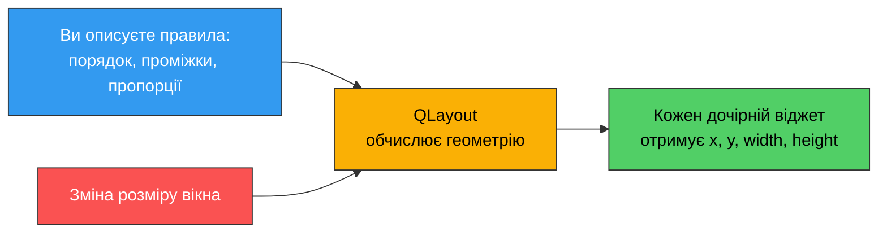
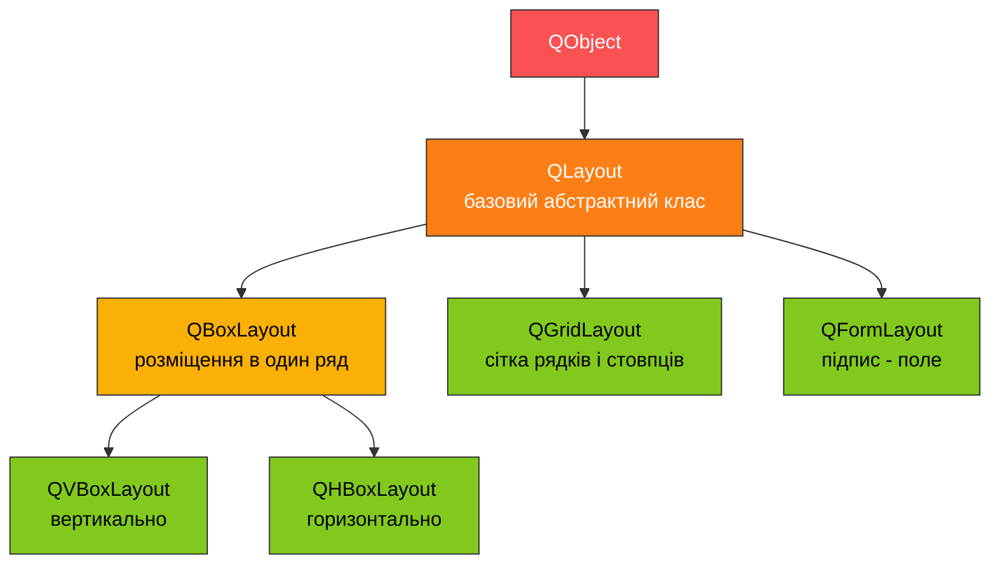
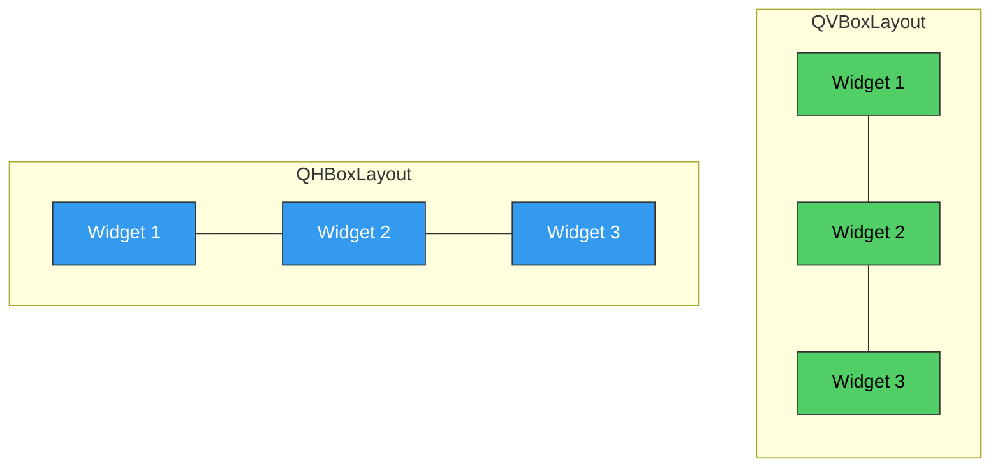

# 5. (Л) Менеджери компоновки: QVBoxLayout, QHBoxLayout, QGridLayout

## Зміст лекції

1. Навіщо потрібні компонувальники
2. Ієрархія класів `QLayout`
3. `QVBoxLayout` і `QHBoxLayout`: спільний API
4. Відступи та проміжки
5. Розтягування: `addStretch()` і stretch-фактори
6. Вирівнювання віджетів усередині компонувальника
7. Вкладені компонувальники
8. `QGridLayout`: розміщення за рядком і стовпцем
9. `QGridLayout`: об'єднання клітинок
10. `QGridLayout`: розтягування рядків і стовпців
11. Збірка: калькулятор на `QGridLayout`
12. Типові помилки
13. Підсумок

## Навіщо потрібні компонувальники

У [лекції 3](/ua/courses/programming-3sem/module1/03-basic-widgets-lecture/) ми вручну розставляли віджети через `move()` і `setGeometry()` і одразу побачили проблему: координати в пікселях жорстко прив'язані до конкретного розміру вікна. Змініть розмір вікна, шрифт або мову інтерфейсу — і все "поїде".

**Компонувальник (layout manager)** розв'язує цю задачу інакше: замість того щоб ви задавали координати, ви описуєте **правила розміщення** ("зверху вниз", "зліва направо", "у сітці"), а компонувальник сам обчислює `x`, `y`, `width`, `height` кожного дочірнього віджета — і перераховує їх щоразу, коли розмір вікна змінюється.



У лекції 3 ми побіжно користувались `QVBoxLayout`, `QHBoxLayout` і `QFormLayout`, аби зібрати робочий приклад. Ця лекція розбирає їхній API детально і додає третій, найгнучкіший компонувальник — `QGridLayout`.

## Ієрархія класів `QLayout`



`QVBoxLayout` і `QHBoxLayout` — це `QBoxLayout` із двома різними напрямками. Тому весь API, який ми зараз розберемо (`addWidget`, `addStretch`, `setSpacing`, `setContentsMargins`), спільний для обох.



## `QVBoxLayout` і `QHBoxLayout`: спільний API

| Метод | Призначення |
|---|---|
| `addWidget(widget, stretch=0, alignment=...)` | Додати віджет у кінець |
| `addLayout(layout, stretch=0)` | Вкласти інший компонувальник |
| `insertWidget(index, widget)` | Вставити віджет у конкретну позицію |
| `addStretch(stretch=1)` | Додати "пружину" — розтяжний порожній простір |
| `addSpacing(size)` | Додати фіксований проміжок у пікселях |
| `setSpacing(size)` | Однаковий проміжок між усіма сусідніми елементами |
| `setContentsMargins(left, top, right, bottom)` | Відступи від країв компонувальника до його вмісту |

```python
import sys

from PySide6.QtWidgets import QApplication, QLabel, QVBoxLayout, QWidget


class SpacingDemo(QWidget):
    def __init__(self):
        super().__init__()

        self.setWindowTitle("Spacing and margins")

        layout = QVBoxLayout()
        layout.setContentsMargins(30, 10, 30, 10)  # left, top, right, bottom
        layout.setSpacing(20)  # відстань між сусідніми рядками

        for i in range(1, 4):
            layout.addWidget(QLabel(f"Row {i}"))

        self.setLayout(layout)


def main():
    app = QApplication(sys.argv)

    window = SpacingDemo()
    window.resize(240, 220)
    window.show()

    sys.exit(app.exec())


if __name__ == "__main__":
    main()
```

!!! note "Значення за замовчуванням"
    Якщо `setContentsMargins()` і `setSpacing()` не викликати, Qt бере значення зі стилю поточної платформи (зазвичай близько 9-11 px). Це зроблено навмисно: застосунок виглядає "рідним" для ОС без ручного налаштування.

## Розтягування: `addStretch()` і stretch-фактори

Це дві різні речі, які часто плутають.

**`addStretch()`** додає в компонувальник невидимий елемент-"пружину", яка забирає собі усе вільне місце, що лишилось після розміщення звичайних віджетів.

```python
import sys

from PySide6.QtWidgets import (
    QApplication,
    QHBoxLayout,
    QLabel,
    QPushButton,
    QWidget,
)


class ToolbarDemo(QWidget):
    def __init__(self):
        super().__init__()

        self.setWindowTitle("addStretch demo")

        layout = QHBoxLayout()
        layout.addWidget(QLabel("File:"))
        layout.addWidget(QLabel("untitled.txt"))
        layout.addStretch()  # з'їдає весь вільний простір між лівою і правою групами
        layout.addWidget(QPushButton("Save"))
        layout.addWidget(QPushButton("Close"))

        self.setLayout(layout)


def main():
    app = QApplication(sys.argv)

    window = ToolbarDemo()
    window.resize(420, 60)
    window.show()

    sys.exit(app.exec())


if __name__ == "__main__":
    main()
```

Якщо розтягнути вікно ширше — весь додатковий простір піде саме в `addStretch()`, а не в написи чи кнопки. Місце виклику важливе: `addStretch()` перед першим віджетом притисне все праворуч, `addStretch()` між двома групами (як у прикладі) розсуне їх по краях.

**Stretch-фактор** — це інше: він задає, як **самі віджети** діляться вільним місцем **між собою**, коли воно є.

```python
import sys

from PySide6.QtWidgets import QApplication, QHBoxLayout, QPushButton, QWidget


class StretchFactorDemo(QWidget):
    def __init__(self):
        super().__init__()

        self.setWindowTitle("Stretch factors")

        layout = QHBoxLayout()
        # Другий аргумент addWidget - stretch-фактор.
        # Вільне місце ділиться між кнопками у пропорції 1 : 2 : 1.
        layout.addWidget(QPushButton("1 part"), 1)
        layout.addWidget(QPushButton("2 parts"), 2)
        layout.addWidget(QPushButton("1 part"), 1)

        self.setLayout(layout)


def main():
    app = QApplication(sys.argv)

    window = StretchFactorDemo()
    window.resize(520, 60)
    window.show()

    sys.exit(app.exec())


if __name__ == "__main__":
    main()
```

Той самий ефект можна отримати вже після того, як віджет доданий:

```python
layout.setStretchFactor(button, 2)
```

!!! tip "Коли який"
    `addStretch()` — коли потрібен **порожній проміжок**, що розтягується (притиснути щось до краю). Stretch-фактор в `addWidget()` — коли **самі елементи** мають рости й стискатись пропорційно один одному.

## Вирівнювання віджетів усередині компонувальника

За замовчуванням компонувальник розтягує віджет на всю виділену йому ділянку. Якщо потрібно, щоб віджет зберіг свій природний розмір (`sizeHint()`) і просто притиснувся до краю чи центру — передайте прапорець вирівнювання.

```python
import sys

from PySide6.QtCore import Qt
from PySide6.QtWidgets import QApplication, QLabel, QPushButton, QVBoxLayout, QWidget


class AlignmentDemo(QWidget):
    def __init__(self):
        super().__init__()

        self.setWindowTitle("Alignment inside layout")

        layout = QVBoxLayout()
        layout.addWidget(QLabel("Full-width label (default)"))

        # Без alignment кнопка розтягується на всю ширину компонувальника.
        # З alignment вона лишається свого природного розміру і центрується.
        centered_button = QPushButton("Centered, natural size")
        layout.addWidget(centered_button, 0, Qt.AlignmentFlag.AlignHCenter)

        right_button = QPushButton("Right aligned")
        layout.addWidget(right_button, 0, Qt.AlignmentFlag.AlignRight)

        self.setLayout(layout)


def main():
    app = QApplication(sys.argv)

    window = AlignmentDemo()
    window.resize(340, 160)
    window.show()

    sys.exit(app.exec())


if __name__ == "__main__":
    main()
```

## Вкладені компонувальники

Складні форми будують, вкладаючи прості компонувальники один в одного через `addLayout()`. Кожен рядок — окремий `QHBoxLayout`, усі рядки складені у спільний `QVBoxLayout`.

```python
import sys

from PySide6.QtWidgets import (
    QApplication,
    QHBoxLayout,
    QLabel,
    QLineEdit,
    QPushButton,
    QVBoxLayout,
    QWidget,
)


class NestedLayoutDemo(QWidget):
    def __init__(self):
        super().__init__()

        self.setWindowTitle("Nested layouts")

        login_row = QHBoxLayout()
        login_row.addWidget(QLabel("Login:"))
        login_row.addWidget(QLineEdit())

        password_row = QHBoxLayout()
        password_row.addWidget(QLabel("Password:"))
        password_row.addWidget(QLineEdit())

        buttons_row = QHBoxLayout()
        buttons_row.addStretch()
        buttons_row.addWidget(QPushButton("Cancel"))
        buttons_row.addWidget(QPushButton("Sign in"))

        root = QVBoxLayout()
        root.addLayout(login_row)
        root.addLayout(password_row)
        root.addLayout(buttons_row)
        self.setLayout(root)


def main():
    app = QApplication(sys.argv)

    window = NestedLayoutDemo()
    window.resize(320, 140)
    window.show()

    sys.exit(app.exec())


if __name__ == "__main__":
    main()
```

Той самий результат можна отримати через `QFormLayout` (лекція 3) — там простіше, коли рядків "підпис - поле" багато й вони однорідні. Вкладені `QHBoxLayout`/`QVBoxLayout` потрібні, коли рядки **різнорідні** (як `buttons_row` вище, де немає жодного підпису).

## `QGridLayout`: розміщення за рядком і стовпцем

`QGridLayout` розкладає віджети у невидиму таблицю. Кожен віджет отримує номер рядка та стовпця, нумерація з нуля.

```python
grid.addWidget(widget, row, column)
```

```python
import sys

from PySide6.QtWidgets import (
    QApplication,
    QGridLayout,
    QLabel,
    QLineEdit,
    QWidget,
)


class GridBasicsDemo(QWidget):
    def __init__(self):
        super().__init__()

        self.setWindowTitle("QGridLayout basics")

        grid = QGridLayout()
        grid.addWidget(QLabel("First name:"), 0, 0)
        grid.addWidget(QLineEdit(), 0, 1)
        grid.addWidget(QLabel("Last name:"), 1, 0)
        grid.addWidget(QLineEdit(), 1, 1)

        self.setLayout(grid)


def main():
    app = QApplication(sys.argv)

    window = GridBasicsDemo()
    window.resize(320, 120)
    window.show()

    sys.exit(app.exec())


if __name__ == "__main__":
    main()
```

Стовпці й рядки, у яких є хоч один віджет, автоматично отримують ширину/висоту, потрібну найбільшому елементу в них. Порожні клітинки (наприклад, `(2, 0)`, якщо такого виклику не було) просто не існують — `QGridLayout`, на відміну від HTML-таблиці, не вимагає заповнювати кожну клітинку.

## `QGridLayout`: об'єднання клітинок

Повний сигнатура методу приймає ще два необов'язкові параметри — скільки рядків і стовпців має зайняти віджет:

```python
grid.addWidget(widget, row, column, rowSpan, columnSpan)
```

```python
# Поле "Bio" розтягнуте на 2 рядки вниз, лишаючись в одному стовпці
grid.addWidget(bio_field, 2, 1, 2, 1)

# Підпис під формою розтягнутий на всю ширину (від стовпця 0 до останнього)
grid.addWidget(footer_label, 4, 0, 1, -1)
```

!!! tip "`-1` означає 'до кінця'"
    Замість того щоб рахувати точну кількість стовпців у сітці, можна передати `-1` як `columnSpan` (або `rowSpan`) — Qt розтягне елемент до останнього наявного рядка/стовпця.

!!! danger "Клітинки, що перекриваються"
    Якщо два виклики `addWidget()` претендують на одну й ту саму клітинку (наприклад, один віджет займає `(1, 0, 1, 2)`, а інший додано просто в `(1, 1)`), Qt не кидає помилку — він **малює їх один поверх одного**. Результат: один із віджетів "зникає" під іншим. Це найчастіша причина дивно поламаної сітки.

## `QGridLayout`: розтягування рядків і стовпців

`addStretch()` у `QGridLayout` не існує — у сітці немає єдиного "кінця", куди можна додати пружину. Замість цього рядки та стовпці розтягуються окремо, за номером:

```python
grid.setColumnStretch(0, 1)   # ліва колонка
grid.setColumnStretch(1, 3)   # права колонка займає утричі більше вільного місця
grid.setRowStretch(0, 1)
```

| Метод | Призначення |
|---|---|
| `setColumnStretch(column, stretch)` | Пропорція, з якою стовпець отримує вільну ширину |
| `setRowStretch(row, stretch)` | Те саме для висоти рядка |
| `setColumnMinimumWidth(column, width)` | Мінімальна ширина стовпця в пікселях |
| `setHorizontalSpacing(size)` / `setVerticalSpacing(size)` | Проміжки окремо по горизонталі й вертикалі |

## Збірка: калькулятор на `QGridLayout`

Приклад, що показує сітку в дії: кнопки цифр і операцій розкладені за координатами, дисплей і кнопка `C` розтягнуті на всю ширину через `columnSpan=-1`.

```python
import operator
import sys

from PySide6.QtCore import Qt
from PySide6.QtWidgets import (
    QApplication,
    QGridLayout,
    QLineEdit,
    QPushButton,
    QWidget,
)

BUTTONS = [
    ("7", 1, 0), ("8", 1, 1), ("9", 1, 2), ("/", 1, 3),
    ("4", 2, 0), ("5", 2, 1), ("6", 2, 2), ("*", 2, 3),
    ("1", 3, 0), ("2", 3, 1), ("3", 3, 2), ("-", 3, 3),
    ("0", 4, 0), (".", 4, 1), ("=", 4, 2), ("+", 4, 3),
]

OPERATORS = {
    "+": operator.add,
    "-": operator.sub,
    "*": operator.mul,
    "/": operator.truediv,
}


class CalculatorDemo(QWidget):
    def __init__(self):
        super().__init__()

        self.setWindowTitle("QGridLayout calculator")

        self._pending_value = None
        self._pending_op = None
        self._start_new_number = True

        self.display = QLineEdit("0")
        self.display.setReadOnly(True)
        self.display.setAlignment(Qt.AlignmentFlag.AlignRight)

        grid = QGridLayout()
        # rowSpan=1, columnSpan=-1: дисплей займає весь верхній рядок
        grid.addWidget(self.display, 0, 0, 1, -1)

        for text, row, col in BUTTONS:
            button = QPushButton(text)
            button.clicked.connect(lambda checked, t=text: self.on_button(t))
            grid.addWidget(button, row, col)

        clear_button = QPushButton("C")
        clear_button.clicked.connect(self.on_clear)
        grid.addWidget(clear_button, 5, 0, 1, -1)

        self.setLayout(grid)

    def on_button(self, text):
        if text.isdigit():
            self.on_digit(text)
        elif text == ".":
            self.on_dot()
        elif text == "=":
            self.on_equals()
        else:
            self.on_operator(text)

    def on_digit(self, digit):
        current = self.display.text()
        if self._start_new_number or current == "0":
            self.display.setText(digit)
            self._start_new_number = False
        else:
            self.display.setText(current + digit)

    def on_dot(self):
        if self._start_new_number:
            self.display.setText("0.")
            self._start_new_number = False
        elif "." not in self.display.text():
            self.display.setText(self.display.text() + ".")

    def on_operator(self, op):
        self._apply_pending()
        self._pending_value = float(self.display.text())
        self._pending_op = op
        self._start_new_number = True

    def on_equals(self):
        self._apply_pending()
        self._pending_op = None
        self._start_new_number = True

    def _apply_pending(self):
        if self._pending_op is None or self._pending_value is None:
            return

        current = float(self.display.text())
        try:
            result = OPERATORS[self._pending_op](self._pending_value, current)
        except ZeroDivisionError:
            self.display.setText("Error")
            self._pending_value = None
            self._pending_op = None
            self._start_new_number = True
            return

        self.display.setText(self._format(result))
        self._pending_value = result

    @staticmethod
    def _format(value):
        # Ціле число показуємо без ".0"
        if value == int(value):
            return str(int(value))
        return str(value)

    def on_clear(self):
        self.display.setText("0")
        self._pending_value = None
        self._pending_op = None
        self._start_new_number = True


def main():
    app = QApplication(sys.argv)

    window = CalculatorDemo()
    window.resize(240, 300)
    window.show()

    sys.exit(app.exec())


if __name__ == "__main__":
    main()
```

!!! note "Чому `checked, t=text` у лямбді"
    Кнопка створюється в циклі, і всі шістнадцять з'єднань мали б захопити ту саму змінну `text` з останньої ітерації, якби не `t=text`. Значення за замовчуванням аргументу обчислюється **один раз, у момент створення лямбди**, тому кожна кнопка запам'ятовує саме своє значення. `checked` потрібен першим, бо `clicked` завжди передає в слот булеве значення (див. лекцію 3).

## Типові помилки

**1. `setLayout()` викликано двічі**

```python
self.setLayout(QVBoxLayout())
...
self.setLayout(QGridLayout())   # ПОМИЛКА: QWidget вже має компонувальник
```

Qt виводить попередження `QWidget::setLayout: Attempting to set QLayout "" on ... , which already has a layout` і другий виклик ігнорується. У кожного віджета може бути лише один компонувальник верхнього рівня — вкладайте інші через `addLayout()`.

**2. `addStretch()` викликано в `QGridLayout`**

```python
grid = QGridLayout()
grid.addStretch()   # ПОМИЛКА: такого методу в QGridLayout немає
```

У сітці немає єдиного "кінця". Замість цього використовуйте `setColumnStretch()` / `setRowStretch()`.

**3. Клітинки сітки перекриваються**

Два віджети претендують на одну клітинку — один з них не помилка не викине, а просто буде намальований поверх іншого й "зникне" з вигляду. Причина завжди в неправильно порахованому `row`/`column`/`rowSpan`/`columnSpan`.

**4. Той самий екземпляр віджета додано у два компонувальники**

```python
label = QLabel("Status")
vbox_layout.addWidget(label)
hbox_layout.addWidget(label)   # НЕБАЖАНО: label переїжджає в hbox_layout
```

`addWidget()` автоматично робить батьком новий компонувальник — тому `label` мовчки зникає зі старого місця й з'являється в новому. Якщо потрібно показати той самий текст у двох місцях — створіть два окремих `QLabel`.

**5. Очікування, що `addStretch()` розтягне сам віджет**

```python
layout.addStretch()
layout.addWidget(button)   # кнопка лишається свого природного розміру, не росте
```

`addStretch()` розтягує **порожній простір**, а не сусідні віджети. Щоб ріс сам віджет, використовуйте stretch-фактор у `addWidget(widget, stretch)`.

## Підсумок

- Компонувальник обчислює геометрію дочірніх віджетів сам і перераховує її при зміні розміру вікна — так само працює `QVBoxLayout`, `QHBoxLayout` і `QGridLayout`, лише правило розкладки різне.
- `QVBoxLayout`/`QHBoxLayout` — це `QBoxLayout` з різним напрямком; спільний API: `addWidget`, `addLayout`, `addStretch`, `setSpacing`, `setContentsMargins`.
- `addStretch()` розтягує **порожній простір**; stretch-фактор в `addWidget(widget, stretch)` розподіляє вільне місце між **самими віджетами**.
- Компонувальники вкладаються один в одного через `addLayout()` — так будують форми з різнорідних рядків.
- `QGridLayout` розміщує віджети за `(row, column)`, а `rowSpan`/`columnSpan` (з `-1` як "до кінця") об'єднує клітинки. `setColumnStretch`/`setRowStretch` замінюють тут `addStretch()`.
- Клітинки, що перекриваються, і подвійний `addWidget()` того самого віджета в різних компонувальниках не кидають помилку — вони мовчки ламають вигляд вікна, тому за цим варто стежити самостійно.

## Корисні посилання

- [QBoxLayout](https://doc.qt.io/qtforpython-6/PySide6/QtWidgets/QBoxLayout.html)
- [QVBoxLayout](https://doc.qt.io/qtforpython-6/PySide6/QtWidgets/QVBoxLayout.html)
- [QHBoxLayout](https://doc.qt.io/qtforpython-6/PySide6/QtWidgets/QHBoxLayout.html)
- [QGridLayout](https://doc.qt.io/qtforpython-6/PySide6/QtWidgets/QGridLayout.html)
- [Basic Layouts — офіційний туторіал](https://doc.qt.io/qtforpython-6/tutorials/basictutorial/widgets.html)

## Домашнє завдання

1. Запустити всі приклади лекції та переконатись, що вони працюють.
2. У `ToolbarDemo` додати другий `addStretch()` між `Save` і `Close` та порівняти результат із варіантом лекції, де `addStretch()` лише один.
3. Переробити форму реєстрації `RegistrationForm` з лекції 3 так, щоб замість `QFormLayout` вона використовувала `QGridLayout`, зберігши ту саму валідацію.
4. У `CalculatorDemo` додати кнопку `Back`, яка видаляє останній введений символ з дисплея (якщо дисплей стає порожнім — показувати `"0"`).
