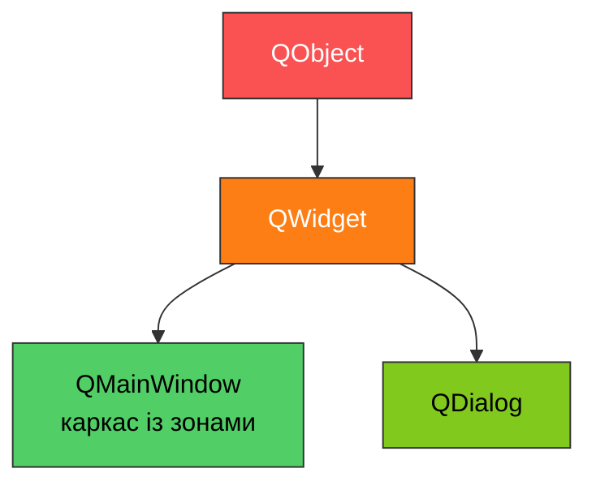
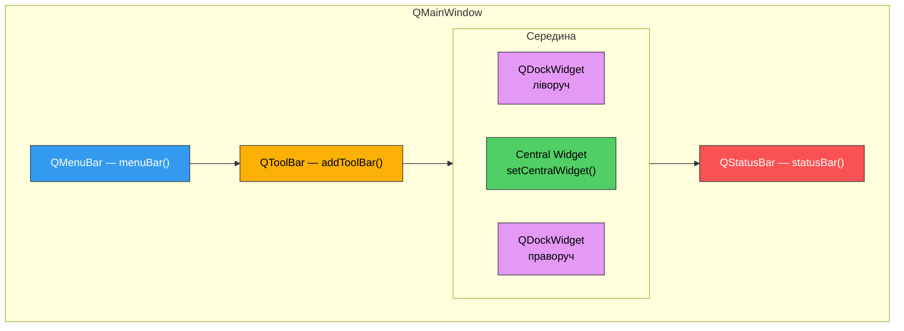
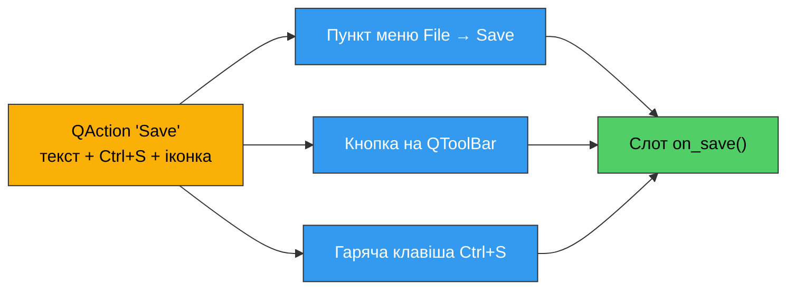

# 7. (Л) Головне вікно застосунку (QMainWindow). Структура головного вікна

## Зміст лекції

1. Чому `QWidget` як вікно — це замало
2. Структура `QMainWindow`
3. Центральний віджет
4. `QAction` — команда, а не кнопка
5. Меню: `QMenuBar` і `QMenu`
6. Панель інструментів `QToolBar`
7. Рядок стану `QStatusBar`
8. Прикріплювані панелі `QDockWidget`
9. Заголовок, іконка та розмір вікна
10. Перехоплення закриття: `closeEvent()`
11. Збереження стану вікна між запусками
12. Збірка: текстовий редактор
13. Типові помилки
14. Підсумок

## Чому `QWidget` як вікно — це замало

У [попередніх лекціях](/ua/courses/programming-3sem/module1/05-layouts-lecture/) вікном був звичайний `QWidget` без батька: ми клали в нього компонувальник і на цьому все закінчувалось. Для форми з трьох полів цього досить.

Але справжній застосунок має ще й **обрамлення**: меню зверху, панель з кнопками під ним, рядок стану внизу, іноді бічні панелі. Якби ми будували це на голому `QWidget`, довелось би вручну створювати `QVBoxLayout`, класти туди `QMenuBar`, потім `QToolBar`, потім вміст, потім `QStatusBar` — і самим слідкувати, щоб нічого не з'їхало.

`QMainWindow` — це готовий `QWidget`, у якому такий каркас **уже зібраний**. Вам лишається наповнити його зони вмістом.



`QMainWindow` успадковується від `QWidget`, тому все, що ви вже знаєте — `resize()`, `setWindowTitle()`, `show()`, сигнали, `setFont()` — працює і тут.

!!! note "Одне головне вікно на застосунок"
    `QMainWindow` розрахований на роль **головного** вікна. Для допоміжних вікон (налаштування, "Про програму", підтвердження) використовують `QDialog` — про нього буде окрема лекція.

## Структура `QMainWindow`

Вікно поділене на фіксовані зони. Кожна зона має свій метод-геттер і свій сеттер.



| Зона | Як отримати / додати | Обов'язкова |
|---|---|---|
| Рядок меню | `self.menuBar()` | ні |
| Панелі інструментів | `self.addToolBar(name)` | ні |
| Прикріплювані панелі | `self.addDockWidget(area, dock)` | ні |
| Центральний віджет | `self.setCentralWidget(widget)` | **так** |
| Рядок стану | `self.statusBar()` | ні |

Найважливіша особливість: **у `QMainWindow` не можна викликати `setLayout()`**. Компонувальник ставиться на центральний віджет, а не на саме вікно.

!!! danger "Найчастіша помилка новачка"
    ```python
    class Window(QMainWindow):
        def __init__(self):
            super().__init__()
            layout = QVBoxLayout()
            layout.addWidget(QLabel("Hello"))
            self.setLayout(layout)   # ПОМИЛКА: вікно лишиться порожнім
    ```
    `QMainWindow` уже має власний внутрішній компонувальник, який керує зонами. Ваш компонувальник просто проігнорується (у консоль піде попередження `QWidget::setLayout: Attempting to set QLayout ... which already has a layout`).

## Центральний віджет

Центральний віджет — це той єдиний віджет, який займає всю середину вікна. Зазвичай це або одразу робочий елемент (`QTextEdit`, `QTableWidget`), або порожній `QWidget`-контейнер, на який ви ставите компонувальник.

```python
import sys

from PySide6.QtWidgets import (
    QApplication,
    QLabel,
    QMainWindow,
    QPushButton,
    QVBoxLayout,
    QWidget,
)


class CentralWidgetDemo(QMainWindow):
    def __init__(self):
        super().__init__()

        self.setWindowTitle("Central widget")

        # Контейнер, на який ставимо компонувальник.
        container = QWidget()

        layout = QVBoxLayout()
        layout.addWidget(QLabel("This label lives inside the central widget"))
        layout.addWidget(QPushButton("Button"))
        layout.addStretch()
        container.setLayout(layout)

        # Компонувальник ставимо на container, а не на self.
        self.setCentralWidget(container)


def main():
    app = QApplication(sys.argv)

    window = CentralWidgetDemo()
    window.resize(420, 220)
    window.show()

    sys.exit(app.exec())


if __name__ == "__main__":
    main()
```

Якщо центрального віджета взагалі не поставити, середина вікна буде порожньою сірою ділянкою — меню й рядок стану при цьому працюватимуть.

!!! tip "Заміна центрального віджета"
    Повторний виклик `setCentralWidget()` замінює попередній віджет, і старий **видаляється** (Qt викликає для нього `deleteLater()`). Це зручний спосіб перемикати "екрани" застосунку, але зберігати посилання на видалений віджет і звертатись до нього після заміни не можна.

## `QAction` — команда, а не кнопка

Перш ніж робити меню, треба зрозуміти `QAction`. Одна й та сама команда — наприклад "Зберегти" — зазвичай доступна у трьох місцях: у меню, на панелі інструментів і через `Ctrl+S`. Було б неправильно писати три обробники.

`QAction` — це **абстрактна команда**: текст, іконка, гаряча клавіша, підказка й сигнал `triggered`. Ви створюєте її один раз і додаєте в скільки завгодно місць.



!!! warning "Звідки імпортувати"
    `QAction` живе в модулі `PySide6.QtGui`, а **не** в `QtWidgets`. У Qt5 він був у `QtWidgets`, тому в старих прикладах з інтернету імпорт інший — і в PySide6 такий код падає з `ImportError`.

| Метод / властивість | Призначення |
|---|---|
| `QAction(text, parent)` | Створити команду з написом |
| `setShortcut("Ctrl+S")` | Гаряча клавіша |
| `setStatusTip(text)` | Текст, що з'явиться в рядку стану при наведенні |
| `setToolTip(text)` | Спливаюча підказка |
| `setCheckable(True)` | Команда-перемикач (з галочкою) |
| `setEnabled(False)` | Зробити неактивною |
| `triggered` | Сигнал: команду виконано |
| `toggled` | Сигнал: стан перемикача змінився (для `checkable`) |

```python
import sys

from PySide6.QtGui import QAction, QKeySequence
from PySide6.QtWidgets import QApplication, QLabel, QMainWindow


class ActionDemo(QMainWindow):
    def __init__(self):
        super().__init__()

        self.setWindowTitle("QAction basics")

        self.label = QLabel("Press Ctrl+S or use the menu")
        self.setCentralWidget(self.label)

        save_action = QAction("Save", self)
        save_action.setShortcut(QKeySequence("Ctrl+S"))
        save_action.setStatusTip("Save the current document")
        save_action.triggered.connect(self.on_save)

        # Команда-перемикач: має стан "увімкнено / вимкнено".
        wrap_action = QAction("Word wrap", self)
        wrap_action.setCheckable(True)
        wrap_action.setChecked(True)
        wrap_action.toggled.connect(self.on_wrap_toggled)

        file_menu = self.menuBar().addMenu("File")
        file_menu.addAction(save_action)

        view_menu = self.menuBar().addMenu("View")
        view_menu.addAction(wrap_action)

        self.statusBar().showMessage("Ready")

    def on_save(self):
        self.label.setText("Saved!")

    def on_wrap_toggled(self, checked):
        # toggled передає новий стан перемикача
        state = "on" if checked else "off"
        self.label.setText(f"Word wrap: {state}")


def main():
    app = QApplication(sys.argv)

    window = ActionDemo()
    window.resize(420, 200)
    window.show()

    sys.exit(app.exec())


if __name__ == "__main__":
    main()
```

!!! note "Чому `self` як батько"
    `QAction(text, self)` робить вікно батьком команди. Це важливо не лише для звільнення пам'яті: гаряча клавіша працює тільки тоді, коли дія належить видимому віджету (або доданa в його меню/панель). Дія без батька, яку нікуди не додали, збереться складальником сміття Python і мовчки перестане працювати.

### Стандартні гарячі клавіші

Замість рядка `"Ctrl+S"` краще брати готову константу з `QKeySequence.StandardKey` — тоді на кожній платформі буде своя звична комбінація (на macOS це `Cmd+S`, а не `Ctrl+S`).

```python
save_action.setShortcut(QKeySequence.StandardKey.Save)
open_action.setShortcut(QKeySequence.StandardKey.Open)
quit_action.setShortcut(QKeySequence.StandardKey.Quit)
```

## Меню: `QMenuBar` і `QMenu`

`self.menuBar()` повертає рядок меню вікна — створюючи його при першому виклику. Далі:

- `menu_bar.addMenu("File")` → повертає `QMenu` (випадаюче меню);
- `menu.addAction(action)` → пункт меню;
- `menu.addSeparator()` → горизонтальна риска-роздільник;
- `menu.addMenu("Recent files")` → вкладене підменю.

```python
import sys

from PySide6.QtGui import QAction
from PySide6.QtWidgets import QApplication, QLabel, QMainWindow


class MenuDemo(QMainWindow):
    def __init__(self):
        super().__init__()

        self.setWindowTitle("Menus and submenus")

        self.label = QLabel("Choose a menu item")
        self.setCentralWidget(self.label)

        menu_bar = self.menuBar()

        file_menu = menu_bar.addMenu("File")
        file_menu.addAction(self._make_action("New", "Ctrl+N"))
        file_menu.addAction(self._make_action("Open", "Ctrl+O"))

        # Вкладене підменю всередині File
        recent_menu = file_menu.addMenu("Recent files")
        for name in ("report.txt", "notes.txt", "todo.txt"):
            recent_menu.addAction(self._make_action(name))

        file_menu.addSeparator()

        quit_action = QAction("Quit", self)
        quit_action.setShortcut("Ctrl+Q")
        quit_action.triggered.connect(self.close)  # close() є в кожного QWidget
        file_menu.addAction(quit_action)

        help_menu = menu_bar.addMenu("Help")
        help_menu.addAction(self._make_action("About"))

    def _make_action(self, text, shortcut=None):
        action = QAction(text, self)
        if shortcut is not None:
            action.setShortcut(shortcut)
        action.setStatusTip(f"Menu item: {text}")
        action.triggered.connect(lambda checked=False, t=text: self.on_action(t))
        return action

    def on_action(self, text):
        self.label.setText(f"Selected: {text}")


def main():
    app = QApplication(sys.argv)

    window = MenuDemo()
    window.resize(420, 200)
    window.show()

    sys.exit(app.exec())


if __name__ == "__main__":
    main()
```

!!! tip "`self.close()` вже є"
    `close()` — звичайний слот `QWidget`, тому пункт "Quit" не потребує власного методу: `quit_action.triggered.connect(self.close)`.

## Панель інструментів `QToolBar`

`self.addToolBar("Name")` створює панель і одразу прикріплює її під рядком меню. У панель кладуть **ті самі** `QAction`.

```python
import sys

from PySide6.QtCore import Qt
from PySide6.QtGui import QAction
from PySide6.QtWidgets import QApplication, QLabel, QMainWindow


class ToolBarDemo(QMainWindow):
    def __init__(self):
        super().__init__()

        self.setWindowTitle("QToolBar")

        self.label = QLabel("Toolbar demo")
        self.label.setAlignment(Qt.AlignmentFlag.AlignCenter)
        self.setCentralWidget(self.label)

        new_action = QAction("New", self)
        new_action.setStatusTip("Create a new document")
        new_action.triggered.connect(lambda: self.label.setText("New"))

        save_action = QAction("Save", self)
        save_action.setStatusTip("Save the document")
        save_action.triggered.connect(lambda: self.label.setText("Saved"))

        bold_action = QAction("Bold", self)
        bold_action.setCheckable(True)
        bold_action.toggled.connect(
            lambda checked: self.label.setText(f"Bold: {checked}")
        )

        toolbar = self.addToolBar("Main")
        toolbar.setMovable(False)  # заборонити користувачу перетягувати панель
        toolbar.addAction(new_action)
        toolbar.addAction(save_action)
        toolbar.addSeparator()
        toolbar.addAction(bold_action)

        # Ті самі дії — ще й у меню.
        file_menu = self.menuBar().addMenu("File")
        file_menu.addAction(new_action)
        file_menu.addAction(save_action)

        self.statusBar().showMessage("Ready")


def main():
    app = QApplication(sys.argv)

    window = ToolBarDemo()
    window.resize(460, 220)
    window.show()

    sys.exit(app.exec())


if __name__ == "__main__":
    main()
```

Зверніть увагу: `new_action` доданий і в панель, і в меню. Обробник один, стан (`setEnabled`, `setChecked`) синхронізується автоматично в обох місцях — це і є головна вигода `QAction`.

| Метод `QToolBar` | Призначення |
|---|---|
| `addAction(action)` | Кнопка з дії |
| `addWidget(widget)` | Довільний віджет на панелі (наприклад `QComboBox`) |
| `addSeparator()` | Вертикальна риска |
| `setMovable(False)` | Заборонити перетягування |
| `setToolButtonStyle(style)` | Показувати іконку, текст або обидва |

Панель можна прикріпити не лише зверху:

```python
self.addToolBar(Qt.ToolBarArea.LeftToolBarArea, toolbar)
```

Доступні зони: `TopToolBarArea`, `BottomToolBarArea`, `LeftToolBarArea`, `RightToolBarArea`.

## Рядок стану `QStatusBar`

`self.statusBar()` повертає (і при потребі створює) рядок стану внизу вікна. У нього пишуть двома способами.

**Тимчасове повідомлення** — `showMessage(text, timeout_ms)`. Воно перекриває весь рядок і зникає само:

```python
self.statusBar().showMessage("File saved", 3000)  # зникне через 3 секунди
```

**Постійний віджет** — `addPermanentWidget(widget)`. Такий віджет живе праворуч і не зникає:

```python
import sys

from PySide6.QtGui import QAction
from PySide6.QtWidgets import QApplication, QLabel, QMainWindow, QTextEdit


class StatusBarDemo(QMainWindow):
    def __init__(self):
        super().__init__()

        self.setWindowTitle("QStatusBar")

        self.editor = QTextEdit()
        self.editor.textChanged.connect(self.update_counter)
        self.setCentralWidget(self.editor)

        save_action = QAction("Save", self)
        save_action.setStatusTip("Save the document to disk")
        save_action.triggered.connect(self.on_save)
        self.menuBar().addMenu("File").addAction(save_action)

        # Постійний віджет праворуч у рядку стану.
        self.counter_label = QLabel("Chars: 0")
        self.statusBar().addPermanentWidget(self.counter_label)
        self.statusBar().showMessage("Ready")

    def update_counter(self):
        length = len(self.editor.toPlainText())
        self.counter_label.setText(f"Chars: {length}")

    def on_save(self):
        # Тимчасове повідомлення зникне саме через 2 секунди.
        self.statusBar().showMessage("Document saved", 2000)


def main():
    app = QApplication(sys.argv)

    window = StatusBarDemo()
    window.resize(520, 320)
    window.show()

    sys.exit(app.exec())


if __name__ == "__main__":
    main()
```

Запустіть приклад і наведіть мишу на пункт меню `Save` — у рядку стану з'явиться текст із `setStatusTip()`. Це працює автоматично, підключати нічого не треба.

## Прикріплювані панелі `QDockWidget`

`QDockWidget` — панель, яку користувач може перетягнути до іншого краю вікна, закрити або "відірвати" в окреме плаваюче вікно. Типове застосування: дерево файлів, список шарів, панель властивостей.

```python
import sys

from PySide6.QtCore import Qt
from PySide6.QtWidgets import (
    QApplication,
    QDockWidget,
    QListWidget,
    QMainWindow,
    QTextEdit,
)


class DockDemo(QMainWindow):
    def __init__(self):
        super().__init__()

        self.setWindowTitle("QDockWidget")

        self.editor = QTextEdit()
        self.setCentralWidget(self.editor)

        self.file_list = QListWidget()
        self.file_list.addItems(["report.txt", "notes.txt", "todo.txt"])
        self.file_list.currentTextChanged.connect(self.on_file_selected)

        dock = QDockWidget("Files", self)
        dock.setWidget(self.file_list)
        # Дозволяємо прикріплювати панель лише ліворуч або праворуч.
        dock.setAllowedAreas(
            Qt.DockWidgetArea.LeftDockWidgetArea
            | Qt.DockWidgetArea.RightDockWidgetArea
        )
        self.addDockWidget(Qt.DockWidgetArea.LeftDockWidgetArea, dock)

        # Готовий пункт меню, що ховає / показує панель.
        view_menu = self.menuBar().addMenu("View")
        view_menu.addAction(dock.toggleViewAction())

    def on_file_selected(self, name):
        self.editor.setPlainText(f"Content of {name}")


def main():
    app = QApplication(sys.argv)

    window = DockDemo()
    window.resize(640, 400)
    window.show()

    sys.exit(app.exec())


if __name__ == "__main__":
    main()
```

!!! tip "`toggleViewAction()`"
    Кожен `QDockWidget` уже має готову `QAction`, яка ховає й показує його — `dock.toggleViewAction()`. Вона `checkable` і синхронізована з реальним станом панелі. Те саме має і `QToolBar`.

Зони прикріплення: `LeftDockWidgetArea`, `RightDockWidgetArea`, `TopDockWidgetArea`, `BottomDockWidgetArea`.

## Заголовок, іконка та розмір вікна

Ці методи належать `QWidget`, тому працюють у будь-якому вікні, але для головного вікна вони особливо доречні.

| Метод | Призначення |
|---|---|
| `setWindowTitle(text)` | Текст у заголовку вікна |
| `setWindowIcon(QIcon(path))` | Іконка вікна та панелі задач |
| `resize(w, h)` | Початковий розмір |
| `setMinimumSize(w, h)` | Менше вікно зробити не вийде |
| `setMaximumSize(w, h)` | Обмеження зверху |
| `showMaximized()` | Показати розгорнутим на весь екран |
| `setWindowState(...)` | Згорнуте / розгорнуте / повноекранне |

```python
self.setWindowTitle("Text Editor - untitled.txt")
self.setMinimumSize(400, 300)
```

!!! note "Позначка незбережених змін"
    Загальноприйнята практика — додавати зірочку до заголовка, коли є незбережені зміни: `"untitled.txt*"`. У Qt для цього є спеціальний механізм: якщо поставити `self.setWindowTitle("untitled.txt[*]")` і викликати `self.setWindowModified(True)`, Qt сам підставить зірочку замість `[*]` (а на macOS — намалює крапку на кнопці закриття).

## Перехоплення закриття: `closeEvent()`

Коли користувач тисне на хрестик або викликає `close()`, Qt надсилає вікну **подію закриття**. Перевизначивши метод `closeEvent()`, ви можете виконати щось наостанок або взагалі скасувати закриття.

```python
import sys

from PySide6.QtWidgets import (
    QApplication,
    QMainWindow,
    QMessageBox,
    QTextEdit,
)


class CloseEventDemo(QMainWindow):
    def __init__(self):
        super().__init__()

        self.setWindowTitle("closeEvent demo")

        self._has_changes = False

        self.editor = QTextEdit()
        self.editor.textChanged.connect(self.on_text_changed)
        self.setCentralWidget(self.editor)

        self.statusBar().showMessage("Type something, then try to close the window")

    def on_text_changed(self):
        self._has_changes = True

    def closeEvent(self, event):
        # Метод викликається Qt автоматично при спробі закрити вікно.
        if not self._has_changes:
            event.accept()
            return

        answer = QMessageBox.question(
            self,
            "Unsaved changes",
            "The document has unsaved changes. Close anyway?",
            QMessageBox.StandardButton.Yes | QMessageBox.StandardButton.No,
        )

        if answer == QMessageBox.StandardButton.Yes:
            event.accept()  # дозволяємо закриття
        else:
            event.ignore()  # скасовуємо закриття, вікно лишається


def main():
    app = QApplication(sys.argv)

    window = CloseEventDemo()
    window.resize(520, 320)
    window.show()

    sys.exit(app.exec())


if __name__ == "__main__":
    main()
```

`event.accept()` дозволяє закриття, `event.ignore()` — скасовує його. Якщо не викликати нічого, подія за замовчуванням вважається прийнятою.

## Збереження стану вікна між запусками

Користувач розтягнув вікно, перетягнув панель ліворуч і закрив програму. При наступному запуску все має лишитись так само.

`QMainWindow` уміє серіалізувати розташування панелей у `QByteArray`:

- `saveState()` / `restoreState(data)` — позиції та видимість `QToolBar` і `QDockWidget`;
- `saveGeometry()` / `restoreGeometry(data)` — розмір і позиція самого вікна (метод `QWidget`).

Зберігати ці дані зручно через `QSettings` — клас, що сам обирає місце зберігання під платформу (файл у `~/.config` на Linux, реєстр на Windows).

```python
import sys

from PySide6.QtCore import Qt, QSettings
from PySide6.QtWidgets import (
    QApplication,
    QDockWidget,
    QListWidget,
    QMainWindow,
    QTextEdit,
)


class PersistentWindow(QMainWindow):
    def __init__(self):
        super().__init__()

        self.setWindowTitle("State is remembered between runs")

        # Перший аргумент - організація, другий - назва застосунку.
        # За цією парою QSettings знаходить свій файл налаштувань.
        self.settings = QSettings("KTBP", "PersistentWindowDemo")

        self.setCentralWidget(QTextEdit())

        items = QListWidget()
        items.addItems(["alpha", "beta", "gamma"])

        dock = QDockWidget("Items", self)
        # objectName обов'язковий: за ним saveState() впізнає панель.
        dock.setObjectName("items_dock")
        dock.setWidget(items)
        self.addDockWidget(Qt.DockWidgetArea.LeftDockWidgetArea, dock)

        toolbar = self.addToolBar("Main")
        toolbar.setObjectName("main_toolbar")

        view_menu = self.menuBar().addMenu("View")
        view_menu.addAction(dock.toggleViewAction())
        view_menu.addAction(toolbar.toggleViewAction())

        self.restore_settings()

    def restore_settings(self):
        geometry = self.settings.value("geometry")
        if geometry is not None:
            self.restoreGeometry(geometry)
        else:
            self.resize(640, 400)

        state = self.settings.value("window_state")
        if state is not None:
            self.restoreState(state)

    def closeEvent(self, event):
        self.settings.setValue("geometry", self.saveGeometry())
        self.settings.setValue("window_state", self.saveState())
        event.accept()


def main():
    app = QApplication(sys.argv)

    window = PersistentWindow()
    window.show()

    sys.exit(app.exec())


if __name__ == "__main__":
    main()
```

Запустіть, перетягніть панель праворуч, змініть розмір вікна, закрийте і запустіть знову — усе буде на місці.

!!! danger "`objectName` обов'язковий"
    `saveState()` запам'ятовує панелі **за їхнім `objectName`**. Якщо його не задати, Qt виведе попередження `QMainWindow::saveState(): 'objectName' not set for QToolBar ...`, і стан цієї панелі не відновиться.

## Збірка: текстовий редактор

Зберемо все разом: меню, панель інструментів, рядок стану, робота з файлами, перехоплення закриття.

```python
import sys
from pathlib import Path

from PySide6.QtGui import QAction, QKeySequence
from PySide6.QtWidgets import (
    QApplication,
    QFileDialog,
    QLabel,
    QMainWindow,
    QMessageBox,
    QTextEdit,
)


class TextEditor(QMainWindow):
    def __init__(self):
        super().__init__()

        self._current_path = None
        self._modified = False

        # Лічильник створюємо до підключення textChanged,
        # бо обробник одразу звертається до нього.
        self.position_label = QLabel("Chars: 0")
        self.statusBar().addPermanentWidget(self.position_label)
        self.statusBar().showMessage("Ready")

        self.editor = QTextEdit()
        self.editor.textChanged.connect(self.on_text_changed)
        self.setCentralWidget(self.editor)

        self._create_actions()
        self._create_menus()
        self._create_toolbar()

        self.setMinimumSize(480, 320)
        self.resize(720, 480)
        self.update_title()

    def _create_actions(self):
        self.new_action = QAction("New", self)
        self.new_action.setShortcut(QKeySequence.StandardKey.New)
        self.new_action.setStatusTip("Create an empty document")
        self.new_action.triggered.connect(self.on_new)

        self.open_action = QAction("Open...", self)
        self.open_action.setShortcut(QKeySequence.StandardKey.Open)
        self.open_action.setStatusTip("Open a text file")
        self.open_action.triggered.connect(self.on_open)

        self.save_action = QAction("Save", self)
        self.save_action.setShortcut(QKeySequence.StandardKey.Save)
        self.save_action.setStatusTip("Save the current document")
        self.save_action.triggered.connect(self.on_save)

        self.quit_action = QAction("Quit", self)
        self.quit_action.setShortcut(QKeySequence.StandardKey.Quit)
        self.quit_action.triggered.connect(self.close)

        self.wrap_action = QAction("Word wrap", self)
        self.wrap_action.setCheckable(True)
        self.wrap_action.setChecked(True)
        self.wrap_action.toggled.connect(self.on_wrap_toggled)

        self.about_action = QAction("About", self)
        self.about_action.triggered.connect(self.on_about)

    def _create_menus(self):
        menu_bar = self.menuBar()

        file_menu = menu_bar.addMenu("File")
        file_menu.addAction(self.new_action)
        file_menu.addAction(self.open_action)
        file_menu.addAction(self.save_action)
        file_menu.addSeparator()
        file_menu.addAction(self.quit_action)

        view_menu = menu_bar.addMenu("View")
        view_menu.addAction(self.wrap_action)

        help_menu = menu_bar.addMenu("Help")
        help_menu.addAction(self.about_action)

    def _create_toolbar(self):
        toolbar = self.addToolBar("Main")
        toolbar.setObjectName("main_toolbar")
        toolbar.addAction(self.new_action)
        toolbar.addAction(self.open_action)
        toolbar.addAction(self.save_action)

    def update_title(self):
        name = self._current_path.name if self._current_path else "untitled.txt"
        mark = "*" if self._modified else ""
        self.setWindowTitle(f"{name}{mark} - Text Editor")

    def on_text_changed(self):
        self._modified = True
        self.position_label.setText(f"Chars: {len(self.editor.toPlainText())}")
        self.update_title()

    def on_new(self):
        if not self.confirm_discard():
            return

        self.editor.clear()
        self._current_path = None
        self._modified = False
        self.update_title()
        self.statusBar().showMessage("New document", 2000)

    def on_open(self):
        if not self.confirm_discard():
            return

        path, _ = QFileDialog.getOpenFileName(
            self, "Open file", "", "Text files (*.txt);;All files (*)"
        )
        if not path:
            return

        try:
            text = Path(path).read_text(encoding="utf-8")
        except OSError as error:
            QMessageBox.critical(self, "Error", f"Cannot open file: {error}")
            return

        self.editor.setPlainText(text)
        self._current_path = Path(path)
        self._modified = False
        self.update_title()
        self.statusBar().showMessage(f"Opened {path}", 3000)

    def on_save(self):
        if self._current_path is None:
            path, _ = QFileDialog.getSaveFileName(
                self, "Save file", "untitled.txt", "Text files (*.txt);;All files (*)"
            )
            if not path:
                return False
            self._current_path = Path(path)

        try:
            self._current_path.write_text(
                self.editor.toPlainText(), encoding="utf-8"
            )
        except OSError as error:
            QMessageBox.critical(self, "Error", f"Cannot save file: {error}")
            return False

        self._modified = False
        self.update_title()
        self.statusBar().showMessage(f"Saved {self._current_path}", 3000)
        return True

    def on_wrap_toggled(self, checked):
        mode = (
            QTextEdit.LineWrapMode.WidgetWidth
            if checked
            else QTextEdit.LineWrapMode.NoWrap
        )
        self.editor.setLineWrapMode(mode)

    def on_about(self):
        QMessageBox.information(
            self,
            "About",
            "Text Editor\nA QMainWindow demo for the PySide6 course.",
        )

    def confirm_discard(self):
        """Повертає True, якщо можна продовжувати (втратити поточний текст)."""
        if not self._modified:
            return True

        answer = QMessageBox.question(
            self,
            "Unsaved changes",
            "The document has unsaved changes. Save them?",
            QMessageBox.StandardButton.Save
            | QMessageBox.StandardButton.Discard
            | QMessageBox.StandardButton.Cancel,
        )

        if answer == QMessageBox.StandardButton.Save:
            return self.on_save()
        if answer == QMessageBox.StandardButton.Discard:
            return True
        return False

    def closeEvent(self, event):
        if self.confirm_discard():
            event.accept()
        else:
            event.ignore()


def main():
    app = QApplication(sys.argv)

    window = TextEditor()
    window.show()

    sys.exit(app.exec())


if __name__ == "__main__":
    main()
```

Розберіть, як тут розділені обов'язки: `_create_actions()` створює команди, `_create_menus()` і `_create_toolbar()` лише розкладають **ті самі** об'єкти по зонах вікна. Додати команду в третє місце (наприклад, у контекстне меню) — це один рядок, а не копія обробника.

## Типові помилки

**1. `setLayout()` на `QMainWindow`**

```python
self.setLayout(QVBoxLayout())   # ПОМИЛКА: вікно лишиться порожнім
```

Компонувальник ставиться на центральний віджет: `container.setLayout(layout)` + `self.setCentralWidget(container)`.

**2. `QAction` імпортовано з `QtWidgets`**

```python
from PySide6.QtWidgets import QAction   # ПОМИЛКА в PySide6
from PySide6.QtGui import QAction       # правильно
```

**3. `QAction` без батька**

```python
action = QAction("Save")            # немає посилання, немає батька
action.setShortcut("Ctrl+S")
# ...і більше нікуди не додано - гаряча клавіша не працює
```

Дію треба або створити з батьком `QAction("Save", self)`, або додати у меню чи панель — інакше Python звільнить об'єкт і команда мовчки зникне.

**4. Забутий `objectName` при `saveState()`**

Панелі без `objectName` не відновлюються, а в консоль летить попередження. Задавайте `setObjectName()` кожному `QToolBar` і `QDockWidget`, стан яких зберігаєте.

**5. Звертання до центрального віджета після заміни**

```python
self.setCentralWidget(first_widget)
self.setCentralWidget(second_widget)
first_widget.setText("...")   # ПОМИЛКА: об'єкт уже видалено Qt
```

Заміна центрального віджета видаляє попередній. Тримати на нього посилання після цього не можна.

**6. `closeEvent()` без `event.accept()` / `event.ignore()` у всіх гілках**

Якщо в якійсь гілці ви не викликали жодного з них, подія вважається прийнятою — і вікно закриється, навіть коли ви цього не хотіли. Прописуйте обидві гілки явно.

## Підсумок

- `QMainWindow` — це `QWidget` із готовим каркасом: рядок меню, панелі інструментів, прикріплювані панелі, центральний віджет і рядок стану.
- На `QMainWindow` **не можна** викликати `setLayout()` — компонувальник ставиться на центральний віджет, який задають через `setCentralWidget()`.
- `QAction` (модуль `QtGui`) — абстрактна команда: текст, гаряча клавіша, підказка й сигнал `triggered`. Одну дію додають і в меню, і в панель — обробник лишається один.
- `self.menuBar()`, `self.addToolBar()`, `self.statusBar()` створюють свою зону при першому виклику; `addDockWidget()` додає бічну панель, а `dock.toggleViewAction()` дає готовий пункт меню для її показу/приховування.
- Рядок стану приймає тимчасові повідомлення (`showMessage`) і постійні віджети (`addPermanentWidget`); `setStatusTip()` дії показується там автоматично при наведенні.
- `closeEvent()` дозволяє перехопити закриття: `event.accept()` пропускає його, `event.ignore()` скасовує.
- `saveGeometry()`/`saveState()` разом із `QSettings` зберігають вигляд вікна між запусками — за умови, що кожній панелі задано `setObjectName()`.

## Корисні посилання

- [QMainWindow](https://doc.qt.io/qtforpython-6/PySide6/QtWidgets/QMainWindow.html)
- [QAction](https://doc.qt.io/qtforpython-6/PySide6/QtGui/QAction.html)
- [QMenuBar](https://doc.qt.io/qtforpython-6/PySide6/QtWidgets/QMenuBar.html)
- [QToolBar](https://doc.qt.io/qtforpython-6/PySide6/QtWidgets/QToolBar.html)
- [QStatusBar](https://doc.qt.io/qtforpython-6/PySide6/QtWidgets/QStatusBar.html)
- [QDockWidget](https://doc.qt.io/qtforpython-6/PySide6/QtWidgets/QDockWidget.html)
- [QSettings](https://doc.qt.io/qtforpython-6/PySide6/QtCore/QSettings.html)
- [Qt Application Main Window — офіційний огляд](https://doc.qt.io/qt-6/qtwidgets-mainwindows-application-example.html)

## Домашнє завдання

1. Запустити всі приклади лекції та переконатись, що вони працюють.
2. У `MenuDemo` додати меню `Edit` із пунктами `Cut`, `Copy`, `Paste` та стандартними гарячими клавішами з `QKeySequence.StandardKey`.
3. У `ToolBarDemo` перенести панель інструментів до лівого краю вікна (`Qt.ToolBarArea.LeftToolBarArea`) і додати пункт меню `View`, який ховає та показує її через `toggleViewAction()`.
4. У `TextEditor` додати дію `Save As...` (`Ctrl+Shift+S`), яка завжди питає нове ім'я файлу, і додати її в меню `File` після `Save`.
5. Доповнити `TextEditor` збереженням геометрії та стану вікна через `QSettings` (як у `PersistentWindow`), щоб при повторному запуску розмір вікна відновлювався.
