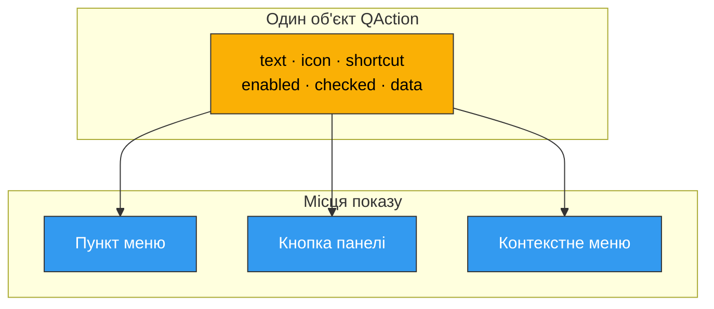
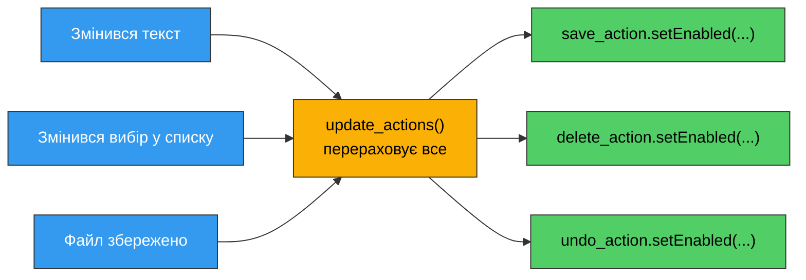
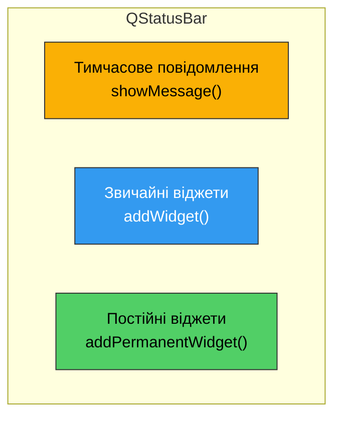

# 9. (Л) Меню, панелі інструментів і дії (QAction, QMenuBar, QToolBar, QStatusBar)

## Зміст лекції

1. Що вже є і що додаємо
2. `QAction` як носій стану і даних
3. Іконки для дій
4. Гарячі клавіші детальніше
5. Керування станом дій
6. `QActionGroup` — взаємовиключний вибір
7. Динамічні меню: список останніх файлів
8. Контекстні меню
9. `QToolBar` детальніше
10. Кнопка з випадаючим меню: `QToolButton`
11. `QStatusBar` детальніше
12. Збірка: застосунок з повним набором команд
13. Типові помилки
14. Підсумок

## Що вже є і що додаємо

У [лекції 7](/ua/courses/programming-3sem/module1/07-qmainwindow-lecture/) ми зібрали каркас головного вікна: `menuBar()`, `addToolBar()`, `statusBar()` і `QAction` як спільна команда для меню й панелі. Цього досить, щоб застосунок мав меню — але не досить, щоб він поводився як звичний користувачеві застосунок.

Порівняйте два тексти редактора:

| Наївна реалізація | Те, чого очікує користувач |
|---|---|
| Пункт `Paste` завжди активний | `Paste` сірий, поки буфер обміну порожній |
| Кнопки на панелі без іконок | Іконки, а підпис — за бажанням користувача |
| Правий клік нічого не робить | Правий клік дає контекстне меню з доречними командами |
| Меню `File` завжди однакове | У `File` є список останніх відкритих файлів |
| Режим перегляду — три окремі галочки | Три режими, з яких активний рівно один |

Ця лекція — саме про ці деталі. Центральна ідея лишається тією самою: **`QAction` — єдине джерело правди про команду**. Її текст, іконка, гаряча клавіша, доступність і стан перемикача живуть в одному об'єкті, а меню, панель інструментів і контекстне меню лише показують його.



Змінили `action.setEnabled(False)` — посіріли **всі три** місця одночасно. Саме тому стан ніколи не тримають у самій кнопці.

## `QAction` як носій стану і даних

Крім тексту й сигналу, `QAction` має повний набір властивостей, які Qt показує в інтерфейсі автоматично.

| Властивість | Метод | Де видно |
|---|---|---|
| Текст | `setText("Save")` | пункт меню, підпис кнопки |
| Текст для панелі | `setIconText("Save")` | тільки на `QToolBar` |
| Іконка | `setIcon(QIcon(...))` | меню й панель |
| Гаряча клавіша | `setShortcut(...)` | праворуч у меню |
| Підказка | `setToolTip("Save file")` | спливає над кнопкою |
| Підказка в рядку стану | `setStatusTip("Save the file to disk")` | `QStatusBar` при наведенні |
| Доступність | `setEnabled(False)` | сірий пункт, клік ігнорується |
| Видимість | `setVisible(False)` | пункт зникає зовсім |
| Перемикач | `setCheckable(True)` + `setChecked(...)` | галочка / втиснута кнопка |
| Довільні дані | `setData(value)` | ніде, це для програміста |

Найцікавіше тут — `setData()`. Воно дозволяє прив'язати до дії довільне значення Python і потім прочитати його в спільному обробнику через `self.sender()`.

```python
import sys

from PySide6.QtGui import QAction
from PySide6.QtWidgets import QApplication, QLabel, QMainWindow


class ActionDataDemo(QMainWindow):
    def __init__(self):
        super().__init__()

        self.setWindowTitle("QAction: data and properties")

        self.label = QLabel("Pick a zoom level from the View menu")
        self.setCentralWidget(self.label)

        view_menu = self.menuBar().addMenu("View")

        # Один обробник на всі пункти: значення живе всередині самої дії.
        for percent in (50, 100, 150, 200):
            action = QAction(f"Zoom {percent}%", self)
            action.setData(percent)
            action.setStatusTip(f"Set zoom level to {percent} percent")
            action.triggered.connect(self.on_zoom)
            view_menu.addAction(action)

        self.statusBar().showMessage("Ready")

    def on_zoom(self):
        # sender() повертає об'єкт, який надіслав сигнал, тобто саму QAction.
        action = self.sender()
        percent = action.data()
        self.label.setText(f"Zoom: {percent}%")
        self.statusBar().showMessage(f"Zoom changed to {percent}%", 2000)


def main():
    app = QApplication(sys.argv)

    window = ActionDataDemo()
    window.resize(440, 200)
    window.show()

    sys.exit(app.exec())


if __name__ == "__main__":
    main()
```

Без `setData()` довелось би або писати чотири майже однакові методи, або городити `lambda` із замиканням на змінну циклу — класичне джерело помилок.

!!! danger "У `setData()` кладіть прості значення"
    Дані проходять через тип Qt `QVariant`, і при цьому **список та словник Python копіюються**. Об'єкт, що повернувся з `data()`, — це вже інший об'єкт:

    ```python
    config = {"zoom": 100}
    action.setData(config)
    action.data() is config      # False - це копія
    action.data()["zoom"] = 150  # змінює копію, config лишається без змін
    ```

    Тому в `setData()` кладуть **ідентифікатор** — число, рядок, індекс у списку — і за ним знаходять справжній об'єкт у своїх структурах даних. Числа, рядки й булеві значення повертаються без сюрпризів. Те саме стосується `QListWidgetItem.setData()`.

!!! warning "`triggered` передає `checked`"
    Сигнал `triggered` має параметр — булеве значення `checked`. Для звичайної дії воно завжди `False`, але воно **є**, і Qt його передає. Тому `lambda` треба писати з першим параметром:

    ```python
    action.triggered.connect(lambda: self.open_file(path))            # спрацює, але
    action.triggered.connect(lambda checked=False: self.open_file(path))  # надійніше
    ```

    Якщо слот приймає рівно один аргумент, Qt мовчки передасть туди `checked` замість очікуваного вами значення — і ви отримаєте `True`/`False` там, де чекали рядок.

### Текст, підказка й `&` для мнемоніки

Символ `&` перед літерою робить її **мнемонікою**: у меню літера підкреслюється, і меню відкривається з клавіатури через `Alt`.

```python
file_menu = self.menuBar().addMenu("&File")   # Alt+F відкриє меню
save_action = QAction("&Save", self)          # потім S виконає команду
```

Якщо треба показати справжній амперсанд — подвойте його: `"Search && Replace"`.

!!! tip "`setToolTip()` за замовчуванням"
    Якщо не викликати `setToolTip()`, підказкою стає текст дії без `&`. Окремий `setToolTip()` варто задавати тоді, коли хочете розгорнутіше пояснення, ніж напис на кнопці.

## Іконки для дій

Іконка задається об'єктом `QIcon`. Взяти її можна з трьох джерел.

**1. Файл на диску** — найпростіший і найпередбачуваніший спосіб:

```python
action.setIcon(QIcon("icons/save.png"))
```

**2. Стандартна іконка поточного стилю** — Qt має вбудований набір, який працює на будь-якій платформі без жодних файлів:

```python
icon = self.style().standardIcon(QStyle.StandardPixmap.SP_DialogSaveButton)
```

**3. Системна тема іконок** — на Linux бере іконку з теми робочого столу за стандартним ім'ям:

```python
icon = QIcon.fromTheme("document-save")
```

Третій спосіб дає найкращий вигляд у системі користувача, але на машині без теми іконок повертає **порожню** `QIcon` — тому завжди задають запасний варіант другим аргументом.

```python
import sys

from PySide6.QtCore import QSize, Qt
from PySide6.QtGui import QAction, QIcon
from PySide6.QtWidgets import (
    QApplication,
    QLabel,
    QMainWindow,
    QStyle,
)


class IconDemo(QMainWindow):
    def __init__(self):
        super().__init__()

        self.setWindowTitle("Icons for actions")

        self.label = QLabel("Hover over the toolbar buttons")
        self.label.setAlignment(Qt.AlignmentFlag.AlignCenter)
        self.setCentralWidget(self.label)

        toolbar = self.addToolBar("Main")
        toolbar.setIconSize(QSize(24, 24))
        # Показувати і іконку, і текст під нею.
        toolbar.setToolButtonStyle(Qt.ToolButtonStyle.ToolButtonTextUnderIcon)

        specs = (
            ("New", "document-new", QStyle.StandardPixmap.SP_FileIcon),
            ("Open", "document-open", QStyle.StandardPixmap.SP_DirOpenIcon),
            ("Save", "document-save", QStyle.StandardPixmap.SP_DialogSaveButton),
            ("Delete", "edit-delete", QStyle.StandardPixmap.SP_TrashIcon),
        )

        for text, theme_name, standard in specs:
            # Спочатку пробуємо системну тему, інакше беремо іконку стилю Qt.
            fallback = self.style().standardIcon(standard)
            icon = QIcon.fromTheme(theme_name, fallback)

            action = QAction(icon, text, self)
            action.setStatusTip(f"{text} command")
            action.triggered.connect(self.on_action)
            toolbar.addAction(action)

        self.statusBar().showMessage("Ready")

    def on_action(self):
        self.label.setText(f"Triggered: {self.sender().text()}")


def main():
    app = QApplication(sys.argv)

    window = IconDemo()
    window.resize(480, 240)
    window.show()

    sys.exit(app.exec())


if __name__ == "__main__":
    main()
```

!!! note "Іконки в меню на різних платформах"
    Та сама `QAction` з іконкою на Linux і Windows покаже іконку і в меню, і на панелі. На macOS іконки в меню за традицією не показуються — це рішення платформи, а не помилка коду.

Список стандартних іконок великий (`SP_FileIcon`, `SP_DirIcon`, `SP_DialogOkButton`, `SP_BrowserReload`, `SP_MediaPlay`, `SP_ArrowLeft`, ...). Побачити їх усі можна цим фрагментом:

```python
import sys

from PySide6.QtWidgets import (
    QApplication,
    QGridLayout,
    QLabel,
    QScrollArea,
    QStyle,
    QWidget,
)


class StandardIconGallery(QWidget):
    def __init__(self):
        super().__init__()

        self.setWindowTitle("Standard Qt icons")

        content = QWidget()
        grid = QGridLayout()
        content.setLayout(grid)

        style = self.style()
        # StandardPixmap - це перелічення (enum), його можна обійти циклом.
        for index, pixmap_id in enumerate(QStyle.StandardPixmap):
            icon = style.standardIcon(pixmap_id)

            icon_label = QLabel()
            icon_label.setPixmap(icon.pixmap(24, 24))

            name_label = QLabel(pixmap_id.name)

            row, column = divmod(index, 3)
            grid.addWidget(icon_label, row, column * 2)
            grid.addWidget(name_label, row, column * 2 + 1)

        area = QScrollArea()
        area.setWidget(content)
        area.setWidgetResizable(True)

        layout = QGridLayout()
        layout.addWidget(area, 0, 0)
        self.setLayout(layout)


def main():
    app = QApplication(sys.argv)

    window = StandardIconGallery()
    window.resize(700, 500)
    window.show()

    sys.exit(app.exec())


if __name__ == "__main__":
    main()
```

## Гарячі клавіші детальніше

### Кілька комбінацій на одну дію

`setShortcut()` задає одну комбінацію, `setShortcuts()` — список:

```python
help_action.setShortcuts([QKeySequence("F1"), QKeySequence("Ctrl+?")])
```

Стандартні клавіші теж можуть мати кілька варіантів на платформі. `QKeySequence.keyBindings()` повертає їх усі:

```python
paste_action.setShortcuts(
    QKeySequence.keyBindings(QKeySequence.StandardKey.Paste)
)
```

### Область дії: `setShortcutContext()`

За замовчуванням гаряча клавіша спрацьовує, коли активне **вікно**, якому належить дія. Це можна змінити:

| Контекст | Коли працює |
|---|---|
| `Qt.ShortcutContext.WidgetShortcut` | лише коли віджет має фокус |
| `Qt.ShortcutContext.WidgetWithChildrenShortcut` | коли фокус у віджеті або його дочірніх |
| `Qt.ShortcutContext.WindowShortcut` | коли активне вікно (за замовчуванням) |
| `Qt.ShortcutContext.ApplicationShortcut` | коли активне будь-яке вікно застосунку |

```python
import sys

from PySide6.QtCore import Qt
from PySide6.QtGui import QAction, QKeySequence
from PySide6.QtWidgets import (
    QApplication,
    QLabel,
    QMainWindow,
    QTextEdit,
    QVBoxLayout,
    QWidget,
)


class ShortcutDemo(QMainWindow):
    def __init__(self):
        super().__init__()

        self.setWindowTitle("Shortcut contexts")

        self.log = QLabel("Try Ctrl+D, F5 and Ctrl+Shift+U")
        self.editor = QTextEdit()
        self.editor.setPlaceholderText("Ctrl+U works only while this box has focus")

        layout = QVBoxLayout()
        layout.addWidget(self.log)
        layout.addWidget(self.editor)

        container = QWidget()
        container.setLayout(layout)
        self.setCentralWidget(container)

        # Дія вікна: працює, поки активне це вікно.
        duplicate_action = QAction("Duplicate line", self)
        duplicate_action.setShortcut(QKeySequence("Ctrl+D"))
        duplicate_action.triggered.connect(lambda: self.report("Ctrl+D"))

        # Одна дія - дві комбінації.
        refresh_action = QAction("Refresh", self)
        refresh_action.setShortcuts(
            [QKeySequence("F5"), QKeySequence("Ctrl+R")]
        )
        refresh_action.triggered.connect(lambda: self.report("Refresh"))

        # Дія віджета: спрацьовує лише коли фокус у редакторі.
        upper_action = QAction("Uppercase", self.editor)
        upper_action.setShortcut(QKeySequence("Ctrl+U"))
        upper_action.setShortcutContext(Qt.ShortcutContext.WidgetShortcut)
        upper_action.triggered.connect(self.on_uppercase)
        self.editor.addAction(upper_action)

        edit_menu = self.menuBar().addMenu("&Edit")
        edit_menu.addAction(duplicate_action)
        edit_menu.addAction(refresh_action)
        edit_menu.addAction(upper_action)

    def report(self, name):
        self.log.setText(f"Triggered: {name}")

    def on_uppercase(self):
        self.editor.setPlainText(self.editor.toPlainText().upper())
        self.report("Ctrl+U (widget shortcut)")


def main():
    app = QApplication(sys.argv)

    window = ShortcutDemo()
    window.resize(520, 320)
    window.show()

    sys.exit(app.exec())


if __name__ == "__main__":
    main()
```

!!! danger "Конфлікт комбінацій"
    Якщо дві дії в одному вікні мають однакову комбінацію, Qt не може вибрати, яку викликати, — **жодна** не спрацює, а в консоль піде попередження `QAction::event: Ambiguous shortcut overload`. Побачили таке — шукайте дублікат.

## Керування станом дій

Дія, яку зараз не можна виконати, має бути **сірою**, а не мовчки нічого не робити. Наївний підхід — розкидати `setEnabled()` по всьому коду — швидко стає некерованим: легко забути одну з десяти точок, де стан змінюється.

Робочий підхід: один метод `update_actions()`, який перераховує стан **усіх** дій із поточного стану даних, і його виклик у кожній точці, де ці дані змінились.



```python
import sys

from PySide6.QtGui import QAction
from PySide6.QtWidgets import (
    QApplication,
    QListWidget,
    QMainWindow,
)


class EnabledStateDemo(QMainWindow):
    def __init__(self):
        super().__init__()

        self.setWindowTitle("Action state")

        self.list_widget = QListWidget()
        self.list_widget.addItems(["alpha", "beta", "gamma"])
        self.list_widget.currentRowChanged.connect(self.update_actions)
        self.setCentralWidget(self.list_widget)

        self.add_action = QAction("Add", self)
        self.add_action.triggered.connect(self.on_add)

        self.delete_action = QAction("Delete", self)
        self.delete_action.triggered.connect(self.on_delete)

        self.up_action = QAction("Move up", self)
        self.up_action.triggered.connect(self.on_move_up)

        self.clear_action = QAction("Clear all", self)
        self.clear_action.triggered.connect(self.on_clear)

        edit_menu = self.menuBar().addMenu("&Edit")
        toolbar = self.addToolBar("Edit")
        for action in (
            self.add_action,
            self.delete_action,
            self.up_action,
            self.clear_action,
        ):
            edit_menu.addAction(action)
            toolbar.addAction(action)

        self.statusBar().showMessage("Ready")
        self.update_actions()

    def update_actions(self):
        # Єдине місце, де вирішується доступність команд.
        row = self.list_widget.currentRow()
        has_items = self.list_widget.count() > 0
        has_selection = row >= 0

        self.delete_action.setEnabled(has_selection)
        self.up_action.setEnabled(has_selection and row > 0)
        self.clear_action.setEnabled(has_items)

    def on_add(self):
        count = self.list_widget.count()
        self.list_widget.addItem(f"item {count + 1}")
        self.update_actions()

    def on_delete(self):
        row = self.list_widget.currentRow()
        self.list_widget.takeItem(row)
        self.update_actions()

    def on_move_up(self):
        row = self.list_widget.currentRow()
        item = self.list_widget.takeItem(row)
        self.list_widget.insertItem(row - 1, item)
        self.list_widget.setCurrentRow(row - 1)
        self.update_actions()

    def on_clear(self):
        self.list_widget.clear()
        self.update_actions()


def main():
    app = QApplication(sys.argv)

    window = EnabledStateDemo()
    window.resize(420, 300)
    window.show()

    sys.exit(app.exec())


if __name__ == "__main__":
    main()
```

Виділіть перший рядок — `Move up` посіріє. Очистіть список — посіріють `Delete` і `Clear all`. Кнопки на панелі змінюються синхронно з меню, бо це **та сама** дія.

!!! tip "Готові дії редагування"
    `QTextEdit` уже має власні дії з правильною логікою доступності: `editor.createStandardContextMenu()` віддає готове меню `Undo/Redo/Cut/Copy/Paste/Select All`, а сигнали `copyAvailable`, `undoAvailable`, `redoAvailable` дозволяють керувати вашими власними діями без ручних перевірок.

## `QActionGroup` — взаємовиключний вибір

Коли з кількох перемикачів активним має бути рівно один (режим перегляду, мова, вирівнювання), не треба вручну знімати галочки з решти. Для цього є `QActionGroup` із модуля `QtGui`.

```python
import sys

from PySide6.QtGui import QAction, QActionGroup
from PySide6.QtWidgets import QApplication, QLabel, QMainWindow


class ActionGroupDemo(QMainWindow):
    def __init__(self):
        super().__init__()

        self.setWindowTitle("QActionGroup")

        self.label = QLabel("Current mode: List")
        self.setCentralWidget(self.label)

        view_menu = self.menuBar().addMenu("&View")
        toolbar = self.addToolBar("View")

        # Група робить перемикачі взаємовиключними.
        self.mode_group = QActionGroup(self)
        self.mode_group.setExclusive(True)
        self.mode_group.triggered.connect(self.on_mode_changed)

        for name in ("List", "Icons", "Details"):
            action = QAction(name, self)
            action.setCheckable(True)
            action.setData(name)
            self.mode_group.addAction(action)
            view_menu.addAction(action)
            toolbar.addAction(action)

        # Перша дія групи стає активною за замовчуванням.
        self.mode_group.actions()[0].setChecked(True)

    def on_mode_changed(self, action):
        # Сигнал групи приносить саме ту дію, яку обрали.
        self.label.setText(f"Current mode: {action.data()}")


def main():
    app = QApplication(sys.argv)

    window = ActionGroupDemo()
    window.resize(420, 200)
    window.show()

    sys.exit(app.exec())


if __name__ == "__main__":
    main()
```

Головна вигода: сигнал `triggered(QAction)` самої групи. Один обробник отримує обрану дію — не треба підключати кожну окремо.

| Метод `QActionGroup` | Призначення |
|---|---|
| `addAction(action)` | Додати дію до групи |
| `setExclusive(True)` | Активною може бути лише одна (за замовчуванням) |
| `checkedAction()` | Яка дія зараз обрана |
| `setEnabled(False)` | Вимкнути всю групу одним викликом |
| `triggered` | Сигнал з обраною `QAction` |

!!! note "Група не додає пункти в меню"
    `QActionGroup` — це логічний контейнер, а не візуальний. Дії все одно треба додати в меню чи панель самостійно; група лише стежить за їхнім взаємним станом.

## Динамічні меню: список останніх файлів

Деякі меню не можна побудувати один раз назавжди — їхній вміст залежить від стану застосунку. Класичний приклад: `File → Recent files`.

Є два підходи:

- **перебудовувати меню при кожному відкритті** — сигнал `aboutToShow` меню спрацьовує безпосередньо перед показом;
- **тримати фіксований набір дій** і лише міняти їхній текст та `visible`.

Перший спосіб простіший і його достатньо для навчальних задач.

```python
import sys

from PySide6.QtGui import QAction
from PySide6.QtWidgets import QApplication, QLabel, QMainWindow


MAX_RECENT = 5


class RecentFilesDemo(QMainWindow):
    def __init__(self):
        super().__init__()

        self.setWindowTitle("Dynamic menu")

        self._recent = []

        self.label = QLabel("Open some files, then check File -> Recent files")
        self.setCentralWidget(self.label)

        file_menu = self.menuBar().addMenu("&File")

        open_action = QAction("Open next demo file", self)
        open_action.setShortcut("Ctrl+O")
        open_action.triggered.connect(self.on_open)
        file_menu.addAction(open_action)

        self.recent_menu = file_menu.addMenu("Recent files")
        # Меню перебудовується щоразу перед показом.
        self.recent_menu.aboutToShow.connect(self.rebuild_recent_menu)

        file_menu.addSeparator()
        quit_action = QAction("Quit", self)
        quit_action.setShortcut("Ctrl+Q")
        quit_action.triggered.connect(self.close)
        file_menu.addAction(quit_action)

        self.statusBar().showMessage("Ready")
        self._counter = 0

    def on_open(self):
        self._counter += 1
        path = f"/home/user/documents/file_{self._counter}.txt"
        self.open_path(path)

    def open_path(self, path):
        self.label.setText(f"Opened: {path}")
        self.statusBar().showMessage(f"Opened {path}", 2000)
        self.remember(path)

    def remember(self, path):
        # Свіжий шлях завжди першим, без дублікатів, не довше за MAX_RECENT.
        if path in self._recent:
            self._recent.remove(path)
        self._recent.insert(0, path)
        del self._recent[MAX_RECENT:]

    def rebuild_recent_menu(self):
        self.recent_menu.clear()

        if not self._recent:
            empty = self.recent_menu.addAction("(empty)")
            empty.setEnabled(False)
            return

        for index, path in enumerate(self._recent, start=1):
            # &1, &2 ... дають швидкий доступ з клавіатури.
            action = QAction(f"&{index}  {path}", self)
            action.setData(path)
            action.triggered.connect(self.on_recent)
            self.recent_menu.addAction(action)

        self.recent_menu.addSeparator()
        clear_action = self.recent_menu.addAction("Clear list")
        clear_action.triggered.connect(self._recent.clear)

    def on_recent(self):
        self.open_path(self.sender().data())


def main():
    app = QApplication(sys.argv)

    window = RecentFilesDemo()
    window.resize(520, 220)
    window.show()

    sys.exit(app.exec())


if __name__ == "__main__":
    main()
```

Зверніть увагу на `self.recent_menu.clear()`: він видаляє попередні дії, тож старі об'єкти не накопичуються. І на `menu.addAction("Clear list")` — коротка форма, яка сама створює `QAction` і повертає її.

!!! warning "Не перебудовуйте меню всередині обробника його ж пункту"
    Видаляти дію в момент, коли Qt обробляє її `triggered`, небезпечно. Тому в прикладі `Clear list` лише очищає список Python, а меню перебудується наступного разу в `aboutToShow`.

## Контекстні меню

Контекстне меню — те, що з'являється за правим кліком. У Qt є три способи його зробити, від найпростішого до найгнучкішого.

### Спосіб 1: `ActionsContextMenu`

Найкоротший: додайте дії у сам віджет і скажіть Qt показувати їх за правим кліком.

```python
widget.setContextMenuPolicy(Qt.ContextMenuPolicy.ActionsContextMenu)
widget.addAction(copy_action)
widget.addAction(delete_action)
```

Меню будується автоматично зі списку `widget.actions()`. Підходить, коли набір команд фіксований.

### Спосіб 2: `CustomContextMenu` + сигнал

Дає повний контроль: ви самі будуєте `QMenu` в момент кліку і знаєте координати кліку.

```python
widget.setContextMenuPolicy(Qt.ContextMenuPolicy.CustomContextMenu)
widget.customContextMenuRequested.connect(self.show_menu)
```

### Спосіб 3: перевизначення `contextMenuEvent()`

Для власного класу-віджета. Метод отримує подію з готовими координатами.

Наступний приклад показує другий і третій способи поряд.

```python
import sys

from PySide6.QtCore import Qt
from PySide6.QtGui import QAction
from PySide6.QtWidgets import (
    QApplication,
    QHBoxLayout,
    QLabel,
    QListWidget,
    QMainWindow,
    QMenu,
    QWidget,
)


class ContextLabel(QLabel):
    # Віджет із власним контекстним меню через contextMenuEvent().

    def __init__(self, text):
        super().__init__(text)
        self.setAlignment(Qt.AlignmentFlag.AlignCenter)
        self.setStyleSheet("background: #eeeeee;")

    def contextMenuEvent(self, event):
        menu = QMenu(self)

        upper_action = menu.addAction("To upper case")
        lower_action = menu.addAction("To lower case")
        menu.addSeparator()
        reset_action = menu.addAction("Reset")

        # exec() блокує, доки користувач не обере пункт,
        # і повертає обрану дію (або None, якщо меню закрили).
        chosen = menu.exec(event.globalPos())

        if chosen is upper_action:
            self.setText(self.text().upper())
        elif chosen is lower_action:
            self.setText(self.text().lower())
        elif chosen is reset_action:
            self.setText("Right-click me")


class ContextMenuDemo(QMainWindow):
    def __init__(self):
        super().__init__()

        self.setWindowTitle("Context menus")

        self.list_widget = QListWidget()
        self.list_widget.addItems(["alpha", "beta", "gamma"])
        # Спосіб 2: власне меню за сигналом.
        self.list_widget.setContextMenuPolicy(
            Qt.ContextMenuPolicy.CustomContextMenu
        )
        self.list_widget.customContextMenuRequested.connect(self.show_list_menu)

        layout = QHBoxLayout()
        layout.addWidget(self.list_widget)
        layout.addWidget(ContextLabel("Right-click me"))

        container = QWidget()
        container.setLayout(layout)
        self.setCentralWidget(container)

        self.statusBar().showMessage("Right-click the list or the grey label")

    def show_list_menu(self, position):
        # position - координати в системі віджета, меню треба глобальні.
        item = self.list_widget.itemAt(position)

        menu = QMenu(self)

        add_action = QAction("Add item", self)
        add_action.triggered.connect(self.on_add)
        menu.addAction(add_action)

        rename_action = QAction("Rename", self)
        rename_action.triggered.connect(self.on_rename)
        # Пункти, що стосуються елемента, неактивні при кліку в порожнечу.
        rename_action.setEnabled(item is not None)
        menu.addAction(rename_action)

        remove_action = QAction("Remove", self)
        remove_action.triggered.connect(self.on_remove)
        remove_action.setEnabled(item is not None)
        menu.addSeparator()
        menu.addAction(remove_action)

        menu.exec(self.list_widget.mapToGlobal(position))

    def on_add(self):
        self.list_widget.addItem(f"item {self.list_widget.count() + 1}")

    def on_rename(self):
        item = self.list_widget.currentItem()
        item.setText(item.text() + " (renamed)")

    def on_remove(self):
        self.list_widget.takeItem(self.list_widget.currentRow())


def main():
    app = QApplication(sys.argv)

    window = ContextMenuDemo()
    window.resize(520, 300)
    window.show()

    sys.exit(app.exec())


if __name__ == "__main__":
    main()
```

!!! danger "`mapToGlobal()` обов'язковий"
    `customContextMenuRequested` передає координати **відносно віджета**, а `QMenu.exec()` чекає координати **екрана**. Без `mapToGlobal()` меню вискочить у лівому верхньому куті екрана.

`menu.exec(pos)` повертає обрану `QAction` або `None`. Тому можливі два стилі: підключати `triggered` до кожної дії (як у списку) або порівнювати результат `exec()` (як у мітці). Перший зручніший, коли дії створюються один раз, другий — коли меню одноразове.

## `QToolBar` детальніше

### Вигляд кнопок

`setToolButtonStyle()` керує тим, що видно на кнопці:

| Значення `Qt.ToolButtonStyle` | Вигляд |
|---|---|
| `ToolButtonIconOnly` | лише іконка (за замовчуванням) |
| `ToolButtonTextOnly` | лише текст |
| `ToolButtonTextBesideIcon` | текст праворуч від іконки |
| `ToolButtonTextUnderIcon` | текст під іконкою |
| `ToolButtonFollowStyle` | як прийнято в поточному стилі системи |

Розмір іконок задається окремо: `toolbar.setIconSize(QSize(32, 32))`.

### Довільні віджети на панелі

Крім кнопок, у панель можна покласти будь-який віджет — поле пошуку, випадаючий список масштабу, повзунок:

```python
toolbar.addWidget(QComboBox())
```

### Кілька панелей і перенесення рядка

`addToolBarBreak()` починає новий рядок панелей:

```python
self.addToolBar("Main")
self.addToolBarBreak()      # наступна панель буде під першою
self.addToolBar("Format")
```

### Готове меню керування панелями

`QMainWindow` уміє сам зібрати меню зі списком усіх панелей і доків — `self.createPopupMenu()`. Воно ж показується за правим кліком по будь-якій панелі.

```python
import sys

from PySide6.QtCore import QSize, Qt
from PySide6.QtGui import QAction
from PySide6.QtWidgets import (
    QApplication,
    QComboBox,
    QLabel,
    QLineEdit,
    QMainWindow,
    QStyle,
)


class ToolBarDemo(QMainWindow):
    def __init__(self):
        super().__init__()

        self.setWindowTitle("QToolBar in depth")

        self.label = QLabel("Toolbar playground")
        self.label.setAlignment(Qt.AlignmentFlag.AlignCenter)
        self.setCentralWidget(self.label)

        style = self.style()

        # --- Перша панель: кнопки з іконками ---
        main_bar = self.addToolBar("Main")
        main_bar.setObjectName("main_toolbar")
        main_bar.setIconSize(QSize(22, 22))
        main_bar.setToolButtonStyle(Qt.ToolButtonStyle.ToolButtonTextBesideIcon)
        main_bar.setMovable(False)

        icons = (
            ("New", QStyle.StandardPixmap.SP_FileIcon),
            ("Open", QStyle.StandardPixmap.SP_DirOpenIcon),
            ("Save", QStyle.StandardPixmap.SP_DialogSaveButton),
        )
        for text, pixmap_id in icons:
            action = QAction(style.standardIcon(pixmap_id), text, self)
            action.setStatusTip(f"{text} the document")
            action.triggered.connect(
                lambda checked=False, name=text: self.label.setText(name)
            )
            main_bar.addAction(action)

        # --- Друга панель у новому рядку: віджети ---
        self.addToolBarBreak()

        search_bar = self.addToolBar("Search")
        search_bar.setObjectName("search_toolbar")

        search_bar.addWidget(QLabel("Zoom: "))

        zoom_box = QComboBox()
        zoom_box.addItems(["50%", "100%", "150%", "200%"])
        zoom_box.setCurrentText("100%")
        zoom_box.currentTextChanged.connect(
            lambda value: self.label.setText(f"Zoom: {value}")
        )
        search_bar.addWidget(zoom_box)

        search_bar.addSeparator()

        search_field = QLineEdit()
        search_field.setPlaceholderText("Search...")
        search_field.setMaximumWidth(200)
        search_field.returnPressed.connect(
            lambda: self.label.setText(f"Search: {search_field.text()}")
        )
        search_bar.addWidget(search_field)

        # --- Меню керування панелями ---
        view_menu = self.menuBar().addMenu("&View")
        view_menu.addAction(main_bar.toggleViewAction())
        view_menu.addAction(search_bar.toggleViewAction())

        self.statusBar().showMessage("Right-click any toolbar to see the built-in menu")


def main():
    app = QApplication(sys.argv)

    window = ToolBarDemo()
    window.resize(620, 280)
    window.show()

    sys.exit(app.exec())


if __name__ == "__main__":
    main()
```

| Метод `QToolBar` | Призначення |
|---|---|
| `addAction(action)` | Кнопка з дії |
| `addWidget(widget)` | Довільний віджет |
| `addSeparator()` | Роздільник |
| `insertAction(before, action)` | Вставити перед іншою дією |
| `setMovable(False)` | Заборонити перетягування |
| `setFloatable(False)` | Заборонити відривати у плаваюче вікно |
| `setAllowedAreas(areas)` | Дозволені краї вікна |
| `setIconSize(QSize)` | Розмір іконок |
| `setToolButtonStyle(style)` | Іконка / текст / обидва |
| `toggleViewAction()` | Готова дія показати/сховати панель |
| `widgetForAction(action)` | Отримати `QToolButton`, створений для дії |

## Кнопка з випадаючим меню: `QToolButton`

Кнопки на панелі — це насправді об'єкти `QToolButton`, які Qt створює за вашими діями. Іноді потрібна кнопка з меню: "Створити" з вибором типу документа, "Скасувати" з історією.

Для цього створюють `QToolButton` вручну, вішають на нього `QMenu` і кладуть у панель через `addWidget()`.

| Режим `QToolButton.ToolButtonPopupMode` | Поведінка |
|---|---|
| `DelayedPopup` | меню з'являється, якщо тримати кнопку натиснутою |
| `MenuButtonPopup` | окрема стрілка праворуч відкриває меню, сама кнопка виконує дію |
| `InstantPopup` | будь-який клік відкриває меню, основної дії немає |

```python
import sys

from PySide6.QtCore import Qt
from PySide6.QtGui import QAction
from PySide6.QtWidgets import (
    QApplication,
    QLabel,
    QMainWindow,
    QMenu,
    QStyle,
    QToolButton,
)


class ToolButtonDemo(QMainWindow):
    def __init__(self):
        super().__init__()

        self.setWindowTitle("QToolButton with a menu")

        self.label = QLabel("Use the toolbar buttons")
        self.label.setAlignment(Qt.AlignmentFlag.AlignCenter)
        self.setCentralWidget(self.label)

        toolbar = self.addToolBar("Main")
        toolbar.setToolButtonStyle(Qt.ToolButtonStyle.ToolButtonTextBesideIcon)

        style = self.style()

        # --- Кнопка з основною дією + стрілкою меню ---
        new_action = QAction(
            style.standardIcon(QStyle.StandardPixmap.SP_FileIcon), "New", self
        )
        new_action.triggered.connect(lambda: self.report("New: text document"))

        new_menu = QMenu(self)
        for kind in ("Text document", "Spreadsheet", "Presentation"):
            action = new_menu.addAction(kind)
            action.setData(kind)
            action.triggered.connect(self.on_new_kind)

        new_button = QToolButton()
        new_button.setDefaultAction(new_action)
        new_button.setMenu(new_menu)
        new_button.setPopupMode(
            QToolButton.ToolButtonPopupMode.MenuButtonPopup
        )
        new_button.setToolButtonStyle(
            Qt.ToolButtonStyle.ToolButtonTextBesideIcon
        )
        toolbar.addWidget(new_button)

        toolbar.addSeparator()

        # --- Кнопка, що є лише меню ---
        export_menu = QMenu(self)
        for fmt in ("PDF", "PNG", "SVG"):
            action = export_menu.addAction(f"Export as {fmt}")
            action.setData(fmt)
            action.triggered.connect(self.on_export)

        export_button = QToolButton()
        export_button.setText("Export")
        export_button.setIcon(
            style.standardIcon(QStyle.StandardPixmap.SP_DialogSaveButton)
        )
        export_button.setMenu(export_menu)
        export_button.setPopupMode(
            QToolButton.ToolButtonPopupMode.InstantPopup
        )
        export_button.setToolButtonStyle(
            Qt.ToolButtonStyle.ToolButtonTextBesideIcon
        )
        toolbar.addWidget(export_button)

        self.statusBar().showMessage("Ready")

    def report(self, text):
        # Метод не можна назвати show(): це перевизначило б QWidget.show().
        self.label.setText(text)
        self.statusBar().showMessage(text, 2000)

    def on_new_kind(self):
        self.report(f"New: {self.sender().data()}")

    def on_export(self):
        self.report(f"Exporting to {self.sender().data()}")


def main():
    app = QApplication(sys.argv)

    window = ToolButtonDemo()
    window.resize(560, 260)
    window.show()

    sys.exit(app.exec())


if __name__ == "__main__":
    main()
```

!!! tip "`setDefaultAction()`"
    `button.setDefaultAction(action)` прив'язує кнопку до дії: текст, іконка, підказка й доступність беруться з дії, а клік викликає її `triggered`. Це той самий механізм, яким `QToolBar.addAction()` користується всередині.

## `QStatusBar` детальніше

Рядок стану має **три** зони, а не одну.



Різниця між `addWidget()` і `addPermanentWidget()` принципова: **тимчасове повідомлення перекриває звичайні віджети, але не перекриває постійні**. Тому індикатори, які мають бути видні завжди (позиція курсора, кодування, режим вставки), додають як постійні.

| Метод `QStatusBar` | Призначення |
|---|---|
| `showMessage(text, timeout=0)` | Тимчасове повідомлення; `0` — доки не приберуть |
| `clearMessage()` | Прибрати тимчасове повідомлення |
| `currentMessage()` | Поточний текст повідомлення |
| `addWidget(w, stretch=0)` | Віджет ліворуч (ховається під повідомленням) |
| `addPermanentWidget(w, stretch=0)` | Віджет праворуч (не ховається) |
| `removeWidget(w)` | Прибрати віджет (він лишається живим, просто ховається) |
| `setSizeGripEnabled(True)` | Куточок для зміни розміру вікна |
| `messageChanged` | Сигнал: текст повідомлення змінився |

```python
import sys

from PySide6.QtCore import Qt, QTimer
from PySide6.QtGui import QAction
from PySide6.QtWidgets import (
    QApplication,
    QLabel,
    QMainWindow,
    QProgressBar,
    QTextEdit,
)


class StatusBarDemo(QMainWindow):
    def __init__(self):
        super().__init__()

        self.setWindowTitle("QStatusBar in depth")

        self.editor = QTextEdit()
        self.editor.setPlainText("Type here and watch the status bar.")
        self.editor.cursorPositionChanged.connect(self.update_position)
        self.editor.textChanged.connect(self.update_counters)
        self.setCentralWidget(self.editor)

        status = self.statusBar()
        status.setSizeGripEnabled(True)

        # Звичайний віджет: його перекриє тимчасове повідомлення.
        self.hint_label = QLabel("Ready to edit")
        status.addWidget(self.hint_label)

        # Індикатор прогресу, схований до початку роботи.
        self.progress = QProgressBar()
        self.progress.setMaximumWidth(160)
        self.progress.setVisible(False)
        status.addPermanentWidget(self.progress)

        # Постійні віджети праворуч: їх видно завжди.
        self.chars_label = QLabel()
        self.position_label = QLabel()
        status.addPermanentWidget(self.chars_label)
        status.addPermanentWidget(self.position_label)

        # Реакція на зміну повідомлення: порожній рядок означає, що воно зникло.
        status.messageChanged.connect(self.on_message_changed)

        task_action = QAction("Run task", self)
        task_action.setStatusTip("Start a fake long-running task")
        task_action.triggered.connect(self.start_task)
        self.menuBar().addMenu("&Tools").addAction(task_action)

        self._timer = QTimer(self)
        self._timer.setInterval(120)
        self._timer.timeout.connect(self.on_tick)

        self.update_counters()
        self.update_position()

    def update_counters(self):
        text = self.editor.toPlainText()
        self.chars_label.setText(f"Chars: {len(text)}")

    def update_position(self):
        cursor = self.editor.textCursor()
        line = cursor.blockNumber() + 1
        column = cursor.columnNumber() + 1
        self.position_label.setText(f"Ln {line}, Col {column}")

    def on_message_changed(self, text):
        # Порожній text - повідомлення зникло, повертаємо звичайну підказку.
        if not text:
            self.hint_label.setText("Ready to edit")

    def start_task(self):
        self.progress.setValue(0)
        self.progress.setVisible(True)
        self.statusBar().showMessage("Task is running...")
        self._timer.start()

    def on_tick(self):
        value = self.progress.value() + 5
        self.progress.setValue(value)

        if value >= 100:
            self._timer.stop()
            self.progress.setVisible(False)
            self.statusBar().showMessage("Task finished", 3000)


def main():
    app = QApplication(sys.argv)

    window = StatusBarDemo()
    window.resize(640, 380)
    window.show()

    sys.exit(app.exec())


if __name__ == "__main__":
    main()
```

Наведіть мишу на пункт `Tools → Run task` — `Ready to edit` тимчасово зникне під текстом із `setStatusTip()`, а `Chars` і `Ln, Col` праворуч лишаться на місці. Це і є різниця між двома видами віджетів.

!!! note "Рядок стану — не місце для помилок"
    Повідомлення в `QStatusBar` легко пропустити: воно зникає само й не вимагає реакції. Про справжню помилку повідомляють через `QMessageBox`, а рядок стану лишають для нейтральних станів: "Saved", "Connected", "3 items selected".

## Збірка: застосунок з повним набором команд

Зберемо все в один застосунок — менеджер завдань. У ньому є:

- дії з іконками, гарячими клавішами й підказками в рядку стану;
- `QActionGroup` для фільтра списку;
- `QToolButton` з меню вибору пріоритету;
- контекстне меню списку;
- централізований `update_actions()`;
- рядок стану з тимчасовими повідомленнями й постійними лічильниками.

```python
import sys

from PySide6.QtCore import Qt
from PySide6.QtGui import QAction, QActionGroup, QIcon, QKeySequence
from PySide6.QtWidgets import (
    QApplication,
    QInputDialog,
    QLabel,
    QListWidget,
    QListWidgetItem,
    QMainWindow,
    QMenu,
    QMessageBox,
    QStyle,
    QToolButton,
)


PRIORITIES = ("Low", "Normal", "High")


class TaskBoard(QMainWindow):
    def __init__(self):
        super().__init__()

        self.setWindowTitle("Task Board")

        # Модель даних: звичайний список словників.
        self._tasks = [
            {"text": "Read the lecture", "done": True, "priority": "Normal"},
            {"text": "Run every example", "done": False, "priority": "High"},
            {"text": "Do the homework", "done": False, "priority": "Normal"},
        ]
        self._filter = "All"

        self.list_widget = QListWidget()
        self.list_widget.currentRowChanged.connect(self.update_actions)
        self.list_widget.itemDoubleClicked.connect(self.on_toggle_done)
        self.list_widget.setContextMenuPolicy(
            Qt.ContextMenuPolicy.CustomContextMenu
        )
        self.list_widget.customContextMenuRequested.connect(self.show_list_menu)
        self.setCentralWidget(self.list_widget)

        self._create_actions()
        self._create_menus()
        self._create_toolbar()
        self._create_status_bar()

        self.setMinimumSize(520, 360)
        self.resize(680, 440)
        self.refresh()

    # --- побудова інтерфейсу ---

    def _icon(self, theme_name, standard):
        # Іконка з теми системи, а якщо її немає - стандартна іконка стилю.
        return QIcon.fromTheme(theme_name, self.style().standardIcon(standard))

    def _create_actions(self):
        self.add_action = QAction(
            self._icon("list-add", QStyle.StandardPixmap.SP_FileDialogNewFolder),
            "&Add task",
            self,
        )
        self.add_action.setShortcut(QKeySequence("Ctrl+N"))
        self.add_action.setStatusTip("Create a new task")
        self.add_action.triggered.connect(self.on_add)

        self.rename_action = QAction("&Rename", self)
        self.rename_action.setShortcut(QKeySequence("F2"))
        self.rename_action.setStatusTip("Rename the selected task")
        self.rename_action.triggered.connect(self.on_rename)

        self.toggle_action = QAction(
            self._icon("dialog-ok", QStyle.StandardPixmap.SP_DialogApplyButton),
            "&Toggle done",
            self,
        )
        self.toggle_action.setShortcut(QKeySequence("Ctrl+Space"))
        self.toggle_action.setStatusTip("Mark the task as done or not done")
        self.toggle_action.triggered.connect(self.on_toggle_done)

        self.delete_action = QAction(
            self._icon("edit-delete", QStyle.StandardPixmap.SP_TrashIcon),
            "&Delete",
            self,
        )
        self.delete_action.setShortcut(QKeySequence.StandardKey.Delete)
        self.delete_action.setStatusTip("Delete the selected task")
        self.delete_action.triggered.connect(self.on_delete)

        self.clear_done_action = QAction("&Clear completed", self)
        self.clear_done_action.setStatusTip("Remove every completed task")
        self.clear_done_action.triggered.connect(self.on_clear_done)

        self.quit_action = QAction("&Quit", self)
        self.quit_action.setShortcut(QKeySequence.StandardKey.Quit)
        self.quit_action.triggered.connect(self.close)

        self.about_action = QAction("&About", self)
        self.about_action.triggered.connect(self.on_about)

        # Взаємовиключний фільтр.
        self.filter_group = QActionGroup(self)
        self.filter_group.setExclusive(True)
        self.filter_group.triggered.connect(self.on_filter_changed)

        for name in ("All", "Active", "Completed"):
            action = QAction(name, self)
            action.setCheckable(True)
            action.setData(name)
            action.setStatusTip(f"Show {name.lower()} tasks")
            self.filter_group.addAction(action)

        self.filter_group.actions()[0].setChecked(True)

    def _create_menus(self):
        menu_bar = self.menuBar()

        task_menu = menu_bar.addMenu("&Task")
        task_menu.addAction(self.add_action)
        task_menu.addAction(self.rename_action)
        task_menu.addAction(self.toggle_action)
        task_menu.addSeparator()
        task_menu.addAction(self.delete_action)
        task_menu.addAction(self.clear_done_action)
        task_menu.addSeparator()
        task_menu.addAction(self.quit_action)

        view_menu = menu_bar.addMenu("&View")
        for action in self.filter_group.actions():
            view_menu.addAction(action)

        help_menu = menu_bar.addMenu("&Help")
        help_menu.addAction(self.about_action)

    def _create_toolbar(self):
        toolbar = self.addToolBar("Main")
        toolbar.setObjectName("main_toolbar")
        toolbar.setMovable(False)
        toolbar.setToolButtonStyle(Qt.ToolButtonStyle.ToolButtonTextBesideIcon)

        # Кнопка "Add" з випадаючим меню пріоритетів.
        priority_menu = QMenu(self)
        for priority in PRIORITIES:
            action = priority_menu.addAction(f"Add {priority.lower()} priority")
            action.setData(priority)
            action.triggered.connect(self.on_add_with_priority)

        add_button = QToolButton()
        add_button.setDefaultAction(self.add_action)
        add_button.setMenu(priority_menu)
        add_button.setPopupMode(QToolButton.ToolButtonPopupMode.MenuButtonPopup)
        add_button.setToolButtonStyle(
            Qt.ToolButtonStyle.ToolButtonTextBesideIcon
        )
        toolbar.addWidget(add_button)

        toolbar.addAction(self.toggle_action)
        toolbar.addAction(self.delete_action)
        toolbar.addSeparator()

        for action in self.filter_group.actions():
            toolbar.addAction(action)

    def _create_status_bar(self):
        self.total_label = QLabel()
        self.done_label = QLabel()

        status = self.statusBar()
        status.addPermanentWidget(self.done_label)
        status.addPermanentWidget(self.total_label)
        status.showMessage("Ready")

    # --- дані та оновлення вигляду ---

    def visible_indexes(self):
        # Фільтр повертає позиції задач у self._tasks, а не самі задачі.
        if self._filter == "Active":
            return [i for i, task in enumerate(self._tasks) if not task["done"]]
        if self._filter == "Completed":
            return [i for i, task in enumerate(self._tasks) if task["done"]]
        return list(range(len(self._tasks)))

    def current_index(self):
        row = self.list_widget.currentRow()
        if row < 0:
            return None
        # У самому елементі списку лежить лише номер задачі.
        return self.list_widget.item(row).data(Qt.ItemDataRole.UserRole)

    def refresh(self, keep_index=None):
        self.list_widget.clear()

        for index in self.visible_indexes():
            task = self._tasks[index]
            mark = "[x]" if task["done"] else "[ ]"
            item = QListWidgetItem(
                f"{mark} {task['text']}  ({task['priority']})"
            )
            item.setData(Qt.ItemDataRole.UserRole, index)
            self.list_widget.addItem(item)

            if index == keep_index:
                self.list_widget.setCurrentItem(item)

        self.update_counters()
        self.update_actions()

    def update_counters(self):
        done = sum(1 for task in self._tasks if task["done"])
        self.total_label.setText(f"Total: {len(self._tasks)}")
        self.done_label.setText(f"Done: {done}")

    def update_actions(self):
        # Єдине місце, де вирішується доступність команд.
        has_selection = self.current_index() is not None
        has_done = any(task["done"] for task in self._tasks)

        self.rename_action.setEnabled(has_selection)
        self.toggle_action.setEnabled(has_selection)
        self.delete_action.setEnabled(has_selection)
        self.clear_done_action.setEnabled(has_done)

    # --- обробники команд ---

    def on_add(self):
        self.add_task("Normal")

    def on_add_with_priority(self):
        self.add_task(self.sender().data())

    def add_task(self, priority):
        text, accepted = QInputDialog.getText(
            self, "New task", f"Task text ({priority} priority):"
        )
        if not accepted or not text.strip():
            return

        self._tasks.append(
            {"text": text.strip(), "done": False, "priority": priority}
        )
        self.refresh(keep_index=len(self._tasks) - 1)
        self.statusBar().showMessage(f"Added: {text.strip()}", 2000)

    def on_rename(self):
        index = self.current_index()
        if index is None:
            return

        text, accepted = QInputDialog.getText(
            self, "Rename task", "New text:", text=self._tasks[index]["text"]
        )
        if not accepted or not text.strip():
            return

        self._tasks[index]["text"] = text.strip()
        self.refresh(keep_index=index)
        self.statusBar().showMessage("Task renamed", 2000)

    def on_toggle_done(self):
        index = self.current_index()
        if index is None:
            return

        task = self._tasks[index]
        task["done"] = not task["done"]
        # Після зміни стану задача може зникнути з поточного фільтра.
        self.refresh(keep_index=index)
        state = "done" if task["done"] else "active"
        self.statusBar().showMessage(f"Task marked as {state}", 2000)

    def on_delete(self):
        index = self.current_index()
        if index is None:
            return

        answer = QMessageBox.question(
            self,
            "Delete task",
            f"Delete '{self._tasks[index]['text']}'?",
            QMessageBox.StandardButton.Yes | QMessageBox.StandardButton.No,
        )
        if answer != QMessageBox.StandardButton.Yes:
            return

        del self._tasks[index]
        self.refresh()
        self.statusBar().showMessage("Task deleted", 2000)

    def on_clear_done(self):
        removed = [task for task in self._tasks if task["done"]]
        self._tasks = [task for task in self._tasks if not task["done"]]
        self.refresh()
        self.statusBar().showMessage(f"Removed {len(removed)} tasks", 2000)

    def on_filter_changed(self, action):
        self._filter = action.data()
        self.refresh()
        self.statusBar().showMessage(f"Filter: {self._filter}", 2000)

    def on_about(self):
        QMessageBox.information(
            self,
            "About",
            "Task Board\nActions, menus, toolbars and status bar demo.",
        )

    # --- контекстне меню ---

    def show_list_menu(self, position):
        item = self.list_widget.itemAt(position)
        if item is not None:
            self.list_widget.setCurrentItem(item)

        self.update_actions()

        menu = QMenu(self)
        menu.addAction(self.toggle_action)
        menu.addAction(self.rename_action)
        menu.addSeparator()
        menu.addAction(self.delete_action)
        menu.addSeparator()
        menu.addAction(self.add_action)

        menu.exec(self.list_widget.mapToGlobal(position))


def main():
    app = QApplication(sys.argv)

    window = TaskBoard()
    window.show()

    sys.exit(app.exec())


if __name__ == "__main__":
    main()
```

Ключове спостереження: **у контекстному меню немає жодної нової дії**. Ті самі об'єкти `self.toggle_action`, `self.rename_action`, `self.delete_action` показані втретє — у меню, на панелі й тут. Їхня доступність порахована один раз в `update_actions()` і діє скрізь.

Спробуйте додати команду `Duplicate task`: створити `QAction` в `_create_actions()`, додати рядок у `_create_menus()`, рядок у `show_list_menu()` і одну перевірку в `update_actions()`. Обробник — один.

## Типові помилки

**1. `lambda` з одним параметром під `triggered`**

```python
action.triggered.connect(lambda path=path: self.open_file(path))   # ПОМИЛКА
```

Qt передасть у перший параметр `checked` (`False`), і `path` перетвориться на булеве значення. Правильно — залишити місце під `checked`:

```python
action.triggered.connect(lambda checked=False, path=path: self.open_file(path))
```

Ще краще — `action.setData(path)` і читати його через `self.sender().data()`.

**2. Мутація словника, покладеного в `setData()`**

```python
action.setData(task)          # task - словник
action.data()["done"] = True  # ПОМИЛКА: змінили копію, оригінал не чіпали
```

Через `QVariant` списки й словники копіюються. Зберігайте ідентифікатор (індекс, `id`, рядковий ключ), а сам об'єкт беріть зі своєї структури даних — саме так зроблено в `TaskBoard`.

**3. Стан тримається в кнопці, а не в дії**

```python
self.save_button.setEnabled(False)   # а пункт меню й далі активний
```

Вимикати треба дію: `self.save_action.setEnabled(False)` — тоді посіріють усі місця, де вона показана.

**4. `QMenu.exec()` з локальними координатами**

```python
menu.exec(position)                            # меню вискочить у куті екрана
menu.exec(widget.mapToGlobal(position))        # правильно
```

**5. Контекстне меню не з'являється без `setContextMenuPolicy()`**

Підключити `customContextMenuRequested` замало — треба ще й `widget.setContextMenuPolicy(Qt.ContextMenuPolicy.CustomContextMenu)`, інакше сигнал ніколи не надійде.

**6. Локальний `QMenu` без батька**

```python
def show_menu(self, position):
    menu = QMenu()          # без батька
    ...
```

Меню без батька живе лише доки на нього є посилання Python. Всередині `exec()` це ще працює, але для меню, які показують асинхронно (`popup()`), об'єкт може зникнути. Задавайте батька: `QMenu(self)`.

**7. Дублікат гарячої клавіші**

Дві дії з `Ctrl+S` в одному вікні — і не працює жодна (`Ambiguous shortcut overload`). Перевіряйте, чи комбінація вже не зайнята, у тому числі стандартними діями віджетів.

**8. Перемикачі без `QActionGroup`**

Три `checkable` дії й ручне зняття галочок в обробнику — це десяток рядків, які легко розсинхронізувати. `QActionGroup` робить те саме одним викликом `addAction()`.

**9. Індикатор у рядку стану доданий через `addWidget()`**

Тоді перше ж `showMessage()` його перекриє, і користувач вирішить, що лічильник зник. Для постійних індикаторів — `addPermanentWidget()`.

## Підсумок

- `QAction` тримає **весь** стан команди: текст, іконку, гарячу клавішу, підказки, доступність, стан перемикача й довільні дані через `setData()`. Меню, панель і контекстне меню — лише вікна в цей об'єкт.
- Сигнал `triggered` передає параметр `checked` — це треба враховувати в `lambda`; `self.sender().data()` дозволяє обійтись одним обробником на групу однотипних дій.
- Іконки беруть з файлу, зі стилю Qt (`style().standardIcon(...)`) або з теми системи (`QIcon.fromTheme(name, fallback)`); третій варіант завжди задають із запасним.
- `setShortcuts()` дає кілька комбінацій на дію, `setShortcutContext()` — область її дії; дублікат комбінації вимикає обидві дії.
- Доступність команд перераховують в одному методі `update_actions()`, який викликають після кожної зміни даних, — а не розкидують `setEnabled()` по всьому коду.
- `QActionGroup` робить перемикачі взаємовиключними й дає сигнал `triggered(QAction)` з обраною дією.
- Динамічні меню перебудовують у `aboutToShow`, попередньо викликавши `menu.clear()`.
- Контекстні меню роблять трьома способами: `ActionsContextMenu`, `CustomContextMenu` + сигнал, або перевизначення `contextMenuEvent()`; координати для `menu.exec()` завжди глобальні.
- `QToolBar` приймає не лише дії, а й довільні віджети; `setToolButtonStyle()` і `setIconSize()` керують виглядом, `toggleViewAction()` дає готовий пункт меню, а `QToolButton` з `setMenu()` — кнопку з випадаючим списком команд.
- У `QStatusBar` тимчасові повідомлення перекривають віджети з `addWidget()`, але не з `addPermanentWidget()` — постійні індикатори додають другим методом.

## Корисні посилання

- [QAction](https://doc.qt.io/qtforpython-6/PySide6/QtGui/QAction.html)
- [QActionGroup](https://doc.qt.io/qtforpython-6/PySide6/QtGui/QActionGroup.html)
- [QMenu](https://doc.qt.io/qtforpython-6/PySide6/QtWidgets/QMenu.html)
- [QMenuBar](https://doc.qt.io/qtforpython-6/PySide6/QtWidgets/QMenuBar.html)
- [QToolBar](https://doc.qt.io/qtforpython-6/PySide6/QtWidgets/QToolBar.html)
- [QToolButton](https://doc.qt.io/qtforpython-6/PySide6/QtWidgets/QToolButton.html)
- [QStatusBar](https://doc.qt.io/qtforpython-6/PySide6/QtWidgets/QStatusBar.html)
- [QKeySequence](https://doc.qt.io/qtforpython-6/PySide6/QtGui/QKeySequence.html)
- [QIcon](https://doc.qt.io/qtforpython-6/PySide6/QtGui/QIcon.html)
- [Freedesktop Icon Naming Specification — імена іконок для `fromTheme`](https://specifications.freedesktop.org/icon-naming-spec/latest/)

## Домашнє завдання

1. Запустити всі приклади лекції та переконатись, що вони працюють.
2. У `IconDemo` додати меню `File` з тими самими діями і порівняти, як іконки виглядають у меню та на панелі. Перемкнути `setToolButtonStyle()` на всі п'ять значень і описати різницю.
3. У `EnabledStateDemo` додати дію `Move down` з правильною логікою доступності (неактивна на останньому рядку) і додати обидві дії `Move up`/`Move down` у контекстне меню списку.
4. У `RecentFilesDemo` обмежити список трьома записами і додати до кожного пункту гарячу клавішу `Ctrl+1`...`Ctrl+3`.
5. У `TaskBoard` додати:
    - дію `Duplicate task` (`Ctrl+D`) у меню, на панель і в контекстне меню;
    - підменю `Task → Priority` з `QActionGroup` на три пріоритети, яке змінює пріоритет обраної задачі й показує поточний значенням галочки;
    - постійний віджет у рядку стану з кількістю задач високого пріоритету.
