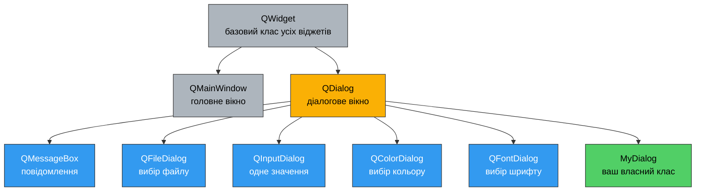
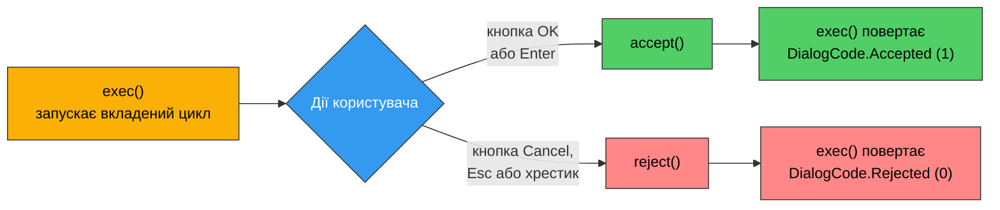

# 11. (Л) Діалогові вікна (QMessageBox, QFileDialog, QDialog)

## Зміст лекції

1. Що таке діалог і навіщо він потрібен
2. Модальність
3. `QMessageBox`: швидкий спосіб
4. `QMessageBox`: повний контроль
5. `QFileDialog`: вибір файлів і тек
6. `QFileDialog` як об'єкт
7. `QInputDialog`: одне значення від користувача
8. `QColorDialog` і `QFontDialog`
9. Власний діалог на базі `QDialog`
10. `QDialogButtonBox`
11. Передача даних у діалог і назад
12. Валідація перед закриттям
13. Немодальні діалоги
14. Збірка: застосунок з повним набором діалогів
15. Типові помилки
16. Підсумок

## Що таке діалог і навіщо він потрібен

У [лекції 7](/ua/courses/programming-3sem/module1/07-qmainwindow-lecture/) ми вже бачили `QMessageBox` і `QFileDialog` у дії — але користувались ними «на віру», без пояснень. Зараз розберемось, як вони влаштовані і як зробити власний діалог.

**Діалог** — це допоміжне вікно, яке з'являється, щоб отримати від користувача одну конкретну відповідь і зникнути. Три речі відрізняють його від звичайного вікна:

1. **Він має власника.** Діалог показують поверх якогось вікна, він центрується на ньому і закривається разом із ним.
2. **Він повертає результат.** Не «щось сталося десь у застосунку», а конкретне: користувач натиснув `OK` чи `Cancel`, вибрав файл чи передумав.
3. **Він, як правило, блокує роботу.** Поки діалог відкритий, з вікном-власником взаємодіяти не можна.



Ключове тут: **`QMessageBox`, `QFileDialog` та інші — це не окремі механізми, а звичайні нащадки `QDialog`**. Усе, що ви дізнаєтесь про `QDialog` у другій половині лекції, справджується і для них. Вони просто вже мають готове наповнення.

### Чому не «просто ще одне вікно»

Технічно ніхто не забороняє створити другий `QWidget`, покласти в нього поля вводу й показати через `show()`. Але тоді доведеться вручну:

- зробити так, щоб вікно з'явилось поверх головного, а не десь у кутку екрана;
- заблокувати головне вікно, поки користувач не відповість;
- обробити `Esc` як скасування, а `Enter` — як підтвердження;
- придумати спосіб дізнатись, чим усе закінчилось.

`QDialog` дає це все з коробки. Тому допоміжні вікна успадковують саме від нього.

## Модальність

**Модальний** діалог блокує введення в інші вікна застосунку. Поки він відкритий, кнопки головного вікна не натискаються, у поля не пишеться.

Qt розрізняє три режими — властивість `windowModality`:

| Режим | Значення | Що блокує |
|---|---|---|
| Немодальний | `Qt.WindowModality.NonModal` | нічого, вікно живе паралельно |
| Модальний для вікна | `Qt.WindowModality.WindowModal` | тільки вікно-власника та його дочірні діалоги |
| Модальний для застосунку | `Qt.WindowModality.ApplicationModal` | усі вікна застосунку |

На практиці режим задають не напряму, а вибором методу показу:

| Метод | Модальність | Блокує код? |
|---|---|---|
| `dialog.exec()` | `ApplicationModal` | **так** — рядок після виклику виконається лише після закриття |
| `dialog.open()` | `WindowModal` | ні — код виконується далі одразу |
| `dialog.show()` | `NonModal` | ні |

Різниця між «блокує ввід» і «блокує код» принципова, і саме тут студенти плутаються найчастіше.

```python
# exec() - код зупиняється тут, поки діалог не закриють
result = dialog.exec()
print("Printed only after the dialog is closed")

# show() - код летить далі негайно
dialog.show()
print("Printed immediately, the dialog is still on screen")
```

`exec()` запускає **вкладений цикл подій**: інтерфейс живий, кнопки натискаються, вікна перемальовуються — але виконання вашої функції стоїть на місці. Саме тому після `exec()` можна одразу прочитати відповідь користувача. Це найзручніший режим, і в 90% випадків використовують саме його.

!!! warning "`exec()` — це не `sleep()`"
    Поки `exec()` тримає керування, застосунок **продовжує обробляти події**: таймери спрацьовують, сигнали приходять, слоти виконуються. Якщо у вас працює таймер, який чіпає віджети головного вікна, він працюватиме й під час показу діалогу.

!!! tip "Батько — не формальність"
    Перший аргумент `QDialog(self)` або `QMessageBox.information(self, ...)` — це вікно-власник. Воно визначає, де діалог з'явиться, що саме заблокується і коли діалог буде знищено. Передавайте `self` (головне вікно), а не `None`, — інакше діалог може вискочити в лівому верхньому куті екрана й не заблокувати нічого.

## `QMessageBox`: швидкий спосіб

`QMessageBox` — це діалог з іконкою, текстом і набором кнопок. У 90% випадків його викликають одним із чотирьох **статичних методів**, не створюючи об'єкт:

| Метод | Іконка | Кнопки за замовчуванням | Коли |
|---|---|---|---|
| `QMessageBox.information()` | ℹ️ синє «i» | `OK` | нейтральне повідомлення |
| `QMessageBox.warning()` | ⚠️ трикутник | `OK` | щось пішло не так, але не фатально |
| `QMessageBox.critical()` | ⛔ червоний хрест | `OK` | помилка, операція не виконана |
| `QMessageBox.question()` | ❓ знак питання | `Yes` \| `No` | потрібна відповідь користувача |

Усі чотири мають однаковий підпис:

```python
QMessageBox.warning(parent, title, text, buttons, defaultButton)
```

і всі чотири **повертають натиснуту кнопку** — значення переліку `QMessageBox.StandardButton`.

```python
import sys

from PySide6.QtWidgets import (
    QApplication,
    QLabel,
    QMessageBox,
    QPushButton,
    QVBoxLayout,
    QWidget,
)


class MessageBoxDemo(QWidget):
    def __init__(self):
        super().__init__()

        self.setWindowTitle("QMessageBox: static methods")

        self.result_label = QLabel("Press any button")

        info_button = QPushButton("information()")
        warning_button = QPushButton("warning()")
        critical_button = QPushButton("critical()")
        question_button = QPushButton("question()")

        info_button.clicked.connect(self.show_information)
        warning_button.clicked.connect(self.show_warning)
        critical_button.clicked.connect(self.show_critical)
        question_button.clicked.connect(self.show_question)

        layout = QVBoxLayout(self)
        layout.addWidget(info_button)
        layout.addWidget(warning_button)
        layout.addWidget(critical_button)
        layout.addWidget(question_button)
        layout.addWidget(self.result_label)

    def show_information(self):
        QMessageBox.information(self, "Export", "Report saved to reports/2026.csv")
        self.result_label.setText("information(): only OK available")

    def show_warning(self):
        QMessageBox.warning(self, "Disk space", "Less than 100 MB left on disk.")
        self.result_label.setText("warning(): only OK available")

    def show_critical(self):
        QMessageBox.critical(self, "Error", "Cannot connect to the database.")
        self.result_label.setText("critical(): only OK available")

    def show_question(self):
        answer = QMessageBox.question(
            self,
            "Delete item",
            "Delete the selected item permanently?",
            QMessageBox.StandardButton.Yes | QMessageBox.StandardButton.No,
            QMessageBox.StandardButton.No,          # кнопка під фокусом при відкритті
        )

        if answer == QMessageBox.StandardButton.Yes:
            self.result_label.setText("User confirmed: item deleted")
        else:
            self.result_label.setText("User cancelled: nothing changed")


def main():
    app = QApplication(sys.argv)

    window = MessageBoxDemo()
    window.resize(360, 220)
    window.show()

    sys.exit(app.exec())


if __name__ == "__main__":
    main()
```

Зверніть увагу на п'ятий аргумент у `question()` — `defaultButton`. Він задає кнопку, на якій стоїть фокус, коли діалог відкривається, тобто ту, що спрацює на `Enter`. Для небезпечних операцій за замовчуванням завжди ставлять **безпечний** варіант: користувач, який на автоматі тисне `Enter`, не має нічого видалити.

### Набір стандартних кнопок

`QMessageBox.StandardButton` містить готові кнопки з правильними написами й позиціями для кожної платформи:

| Кнопка | Типове призначення |
|---|---|
| `Ok`, `Cancel` | підтвердити / скасувати |
| `Yes`, `No` | відповідь на питання |
| `YesToAll`, `NoToAll` | те саме для серії однотипних питань |
| `Save`, `Discard` | зберегти / відкинути зміни |
| `Apply`, `Reset`, `RestoreDefaults` | для вікон налаштувань |
| `Abort`, `Retry`, `Ignore` | реакція на помилку операції |
| `Open`, `Close`, `Help` | інше |

Кнопки об'єднують оператором `|`:

```python
answer = QMessageBox.warning(
    self,
    "Unsaved changes",
    "The document has been modified.",
    QMessageBox.StandardButton.Save
    | QMessageBox.StandardButton.Discard
    | QMessageBox.StandardButton.Cancel,
    QMessageBox.StandardButton.Save,
)
```

Порядок кнопок у вікні визначає **не** порядок в `|`, а платформа: на Windows підтвердження ліворуч, на macOS — праворуч. Qt робить це сам, і саме тому стандартні кнопки кращі за самописні.

!!! danger "Перевіряйте результат явним порівнянням"
    ```python
    if QMessageBox.question(self, "Quit", "Really quit?"):   # ПОМИЛКА
        self.close()
    ```
    `StandardButton.No` — це не нуль, тому умова істинна **завжди**. Правильний варіант єдиний:
    ```python
    answer = QMessageBox.question(self, "Quit", "Really quit?")
    if answer == QMessageBox.StandardButton.Yes:
        self.close()
    ```

### `about()` і `aboutQt()`

Два спеціальні статичні методи без результату:

```python
QMessageBox.about(self, "About Notes", "Notes Manager 1.0\nIvan Petrenko, KI-31")
QMessageBox.aboutQt(self)      # готове вікно з версією Qt
```

`about()` відрізняється від `information()` тим, що замість стандартної іконки показує іконку самого застосунку.

## `QMessageBox`: повний контроль

Статичних методів не вистачає, коли потрібно: кнопка з власним написом, згорнутий технічний текст, прапорець «більше не питати» або уточнення дрібним шрифтом. Тоді створюють об'єкт.

`QMessageBox` має три рівні тексту:

| Метод | Як виглядає |
|---|---|
| `setText()` | основний рядок, жирним |
| `setInformativeText()` | пояснення під ним, звичайним шрифтом |
| `setDetailedText()` | ховається під кнопкою `Show Details...` |

`setDetailedText()` — правильне місце для тексту винятку: користувач його не бачить, але може розгорнути й скопіювати у звіт про помилку.

```python
import sys

from PySide6.QtWidgets import (
    QApplication,
    QCheckBox,
    QLabel,
    QMessageBox,
    QPushButton,
    QVBoxLayout,
    QWidget,
)


class CustomMessageDemo(QWidget):
    def __init__(self):
        super().__init__()

        self.setWindowTitle("QMessageBox: full control")

        self.status_label = QLabel("No action yet")
        self.ask_before_delete = True

        details_button = QPushButton("Error with details")
        custom_button = QPushButton("Custom buttons")
        remember_button = QPushButton("Delete (with 'do not ask again')")

        details_button.clicked.connect(self.show_error_with_details)
        custom_button.clicked.connect(self.show_custom_buttons)
        remember_button.clicked.connect(self.delete_item)

        layout = QVBoxLayout(self)
        layout.addWidget(details_button)
        layout.addWidget(custom_button)
        layout.addWidget(remember_button)
        layout.addWidget(self.status_label)

    def show_error_with_details(self):
        box = QMessageBox(self)
        box.setIcon(QMessageBox.Icon.Critical)
        box.setWindowTitle("Import failed")
        box.setText("Cannot import contacts.csv")
        box.setInformativeText("The file exists but its content is not valid CSV.")
        box.setDetailedText(
            "Traceback (most recent call last):\n"
            '  File "importer.py", line 42, in load\n'
            "    row = next(reader)\n"
            "_csv.Error: line contains NUL"
        )
        box.setStandardButtons(QMessageBox.StandardButton.Ok)
        box.exec()

        self.status_label.setText("Error dialog closed")

    def show_custom_buttons(self):
        box = QMessageBox(self)
        box.setIcon(QMessageBox.Icon.Question)
        box.setWindowTitle("Conflict")
        box.setText("A file with this name already exists.")
        box.setInformativeText("What should be done with the new file?")

        # addButton() повертає створену кнопку - її й порівнюємо потім.
        overwrite = box.addButton("Overwrite", QMessageBox.ButtonRole.DestructiveRole)
        rename = box.addButton("Keep both", QMessageBox.ButtonRole.AcceptRole)
        cancel = box.addButton(QMessageBox.StandardButton.Cancel)

        box.setDefaultButton(rename)
        box.setEscapeButton(cancel)
        box.exec()

        clicked = box.clickedButton()
        if clicked is overwrite:
            self.status_label.setText("Choice: overwrite the existing file")
        elif clicked is rename:
            self.status_label.setText("Choice: save under a new name")
        else:
            self.status_label.setText("Choice: cancelled")

    def delete_item(self):
        if not self.ask_before_delete:
            self.status_label.setText("Deleted without asking")
            return

        box = QMessageBox(self)
        box.setIcon(QMessageBox.Icon.Warning)
        box.setWindowTitle("Delete item")
        box.setText("Delete the selected item?")
        box.setStandardButtons(
            QMessageBox.StandardButton.Yes | QMessageBox.StandardButton.No
        )
        box.setDefaultButton(QMessageBox.StandardButton.No)

        checkbox = QCheckBox("Do not ask me again")
        box.setCheckBox(checkbox)

        answer = box.exec()

        if checkbox.isChecked():
            self.ask_before_delete = False

        if answer == QMessageBox.StandardButton.Yes:
            self.status_label.setText("Deleted")
        else:
            self.status_label.setText("Cancelled")


def main():
    app = QApplication(sys.argv)

    window = CustomMessageDemo()
    window.resize(380, 200)
    window.show()

    sys.exit(app.exec())


if __name__ == "__main__":
    main()
```

Розберемо три неочевидні місця.

**`ButtonRole` при `addButton()`.** Другий аргумент каже Qt, *чим є* ця кнопка, щоб система розставила кнопки у звичному для платформи порядку: `AcceptRole` (підтвердження), `RejectRole` (скасування), `DestructiveRole` (руйнівна дія), `ActionRole` (щось третє), `HelpRole`.

**`clickedButton()` замість результату `exec()`.** Коли кнопки нестандартні, `exec()` повертає малозмістовне число. Порівнювати треба саме об'єкти кнопок через `is`.

**`setEscapeButton()`.** Задає, що станеться при `Esc`. Якщо серед кнопок є `Cancel`, Qt здогадається сама; якщо кнопки всі власні — вкажіть явно, інакше `Esc` може не спрацювати взагалі.

!!! tip "Текст діалогу — не звіт про виняток"
    Перший рядок має відповідати на питання «що сталося з моїми даними», а не «яка функція впала». Порівняйте: `OSError: [Errno 13] Permission denied` проти `Cannot save the file: no write permission for this folder`. Технічний текст кладіть у `setDetailedText()`.

## `QFileDialog`: вибір файлів і тек

`QFileDialog` — це діалог провідника: користувач ходить по теках і вибирає файл. Найважливіше, що треба зрозуміти одразу:

!!! danger "`QFileDialog` нічого не відкриває і не зберігає"
    Він **лише повертає рядок з шляхом**. Прочитати файл, записати в нього, перевірити права, обробити виняток — усе це ваш код. Назви `getOpenFileName` / `getSaveFileName` описують намір користувача, а не дію діалогу.

Чотири статичні методи покривають майже всі потреби:

| Метод | Що повертає | Коли |
|---|---|---|
| `getOpenFileName()` | `(шлях, фільтр)` | відкрити один існуючий файл |
| `getOpenFileNames()` | `(список шляхів, фільтр)` | відкрити кілька файлів |
| `getSaveFileName()` | `(шлях, фільтр)` | вибрати, куди зберегти |
| `getExistingDirectory()` | `шлях` (рядок) | вибрати теку |

Три з чотирьох повертають **кортеж із двох елементів**, і другий — це вибраний фільтр. Забути про нього — найпоширеніша помилка на цій темі.

```python
path, _ = QFileDialog.getOpenFileName(...)   # правильно
path = QFileDialog.getOpenFileName(...)      # у path опиниться кортеж
```

**Скасування** позначається порожнім рядком (або порожнім списком для `getOpenFileNames`). Перевірка обов'язкова — інакше отримаєте спробу відкрити файл з іменем `""`.

### Фільтри

Фільтр — це рядок особливого формату:

```text
Text files (*.txt)
```

Кілька фільтрів розділяють **двома крапками з комою**:

```text
Text files (*.txt);;CSV files (*.csv);;All files (*)
```

Кілька масок в одному фільтрі — через пробіл:

```text
Images (*.png *.jpg *.jpeg *.bmp)
```

### Приклад

```python
import sys
from pathlib import Path

from PySide6.QtWidgets import (
    QApplication,
    QFileDialog,
    QMessageBox,
    QPlainTextEdit,
    QPushButton,
    QVBoxLayout,
    QWidget,
)


class FileDialogDemo(QWidget):
    def __init__(self):
        super().__init__()

        self.setWindowTitle("QFileDialog: static methods")

        self.log = QPlainTextEdit()
        self.log.setReadOnly(True)

        open_one = QPushButton("Open one file")
        open_many = QPushButton("Open several files")
        save_as = QPushButton("Save as...")
        pick_dir = QPushButton("Choose a folder")

        open_one.clicked.connect(self.on_open_one)
        open_many.clicked.connect(self.on_open_many)
        save_as.clicked.connect(self.on_save_as)
        pick_dir.clicked.connect(self.on_pick_dir)

        layout = QVBoxLayout(self)
        layout.addWidget(open_one)
        layout.addWidget(open_many)
        layout.addWidget(save_as)
        layout.addWidget(pick_dir)
        layout.addWidget(self.log)

    def write(self, message):
        self.log.appendPlainText(message)

    def on_open_one(self):
        path, selected_filter = QFileDialog.getOpenFileName(
            self,
            "Open text file",
            str(Path.home()),                                 # звідки починати
            "Text files (*.txt);;CSV files (*.csv);;All files (*)",
        )

        if not path:
            self.write("Open: cancelled")
            return

        self.write(f"Open: {path}")
        self.write(f"Filter used: {selected_filter}")

        # Діалог лише назвав файл - читаємо його ми самі.
        try:
            text = Path(path).read_text(encoding="utf-8")
        except (OSError, UnicodeDecodeError) as error:
            QMessageBox.critical(self, "Error", f"Cannot read the file:\n{error}")
            return

        self.write(f"Size: {len(text)} characters")

    def on_open_many(self):
        paths, _ = QFileDialog.getOpenFileNames(
            self,
            "Open several files",
            "",
            "All files (*)",
        )

        if not paths:
            self.write("Open many: cancelled")
            return

        self.write(f"Selected {len(paths)} file(s):")
        for path in paths:
            self.write(f"  {Path(path).name}")

    def on_save_as(self):
        path, _ = QFileDialog.getSaveFileName(
            self,
            "Save report",
            "report.txt",                    # ім'я, запропоноване за замовчуванням
            "Text files (*.txt);;All files (*)",
        )

        if not path:
            self.write("Save: cancelled")
            return

        try:
            Path(path).write_text(self.log.toPlainText(), encoding="utf-8")
        except OSError as error:
            QMessageBox.critical(self, "Error", f"Cannot write the file:\n{error}")
            return

        self.write(f"Saved: {path}")

    def on_pick_dir(self):
        directory = QFileDialog.getExistingDirectory(
            self,
            "Choose a folder",
            str(Path.home()),
        )

        if not directory:
            self.write("Folder: cancelled")
            return

        count = sum(1 for item in Path(directory).iterdir() if item.is_file())
        self.write(f"Folder: {directory} ({count} files)")


def main():
    app = QApplication(sys.argv)

    window = FileDialogDemo()
    window.resize(560, 380)
    window.show()

    sys.exit(app.exec())


if __name__ == "__main__":
    main()
```

!!! tip "Третій аргумент працює у двох режимах"
    Якщо в `dir` передати шлях до **теки** — діалог відкриється в ній. Якщо передати **ім'я файлу** (як `"report.txt"` вище) — воно потрапить у поле імені. Можна поєднати: `"/home/user/docs/report.txt"`.

!!! warning "`getSaveFileName` не створює файл"
    Він лише запитує ім'я і — якщо файл існує — сам показує підтвердження перезапису. Але після цього файл усе ще не існує, доки ви його не запишете. І навпаки: користувач міг підтвердити перезапис, а ваш код упав із винятком — тоді старий файл залишиться цілим.

## `QFileDialog` як об'єкт

Статичні методи використовують **системний** діалог: на Linux — GTK/KDE-вікно, на Windows — провідник. Це добре (звично користувачеві), але позбавляє контролю. Коли потрібні налаштування, яких у статичних методів немає, створюють об'єкт.

| Метод | Що робить |
|---|---|
| `setAcceptMode(AcceptMode.AcceptOpen / AcceptSave)` | режим відкриття чи збереження |
| `setFileMode(FileMode.AnyFile / ExistingFile / ExistingFiles / Directory)` | що дозволено вибрати |
| `setNameFilters([...])` | фільтри списком, а не рядком через `;;` |
| `setDefaultSuffix("txt")` | розширення, яке дописується, якщо користувач його не ввів |
| `setDirectory(path)` | стартова тека |
| `setViewMode(ViewMode.Detail / List)` | вигляд списку |
| `selectedFiles()` | **список** вибраних шляхів після `exec()` |

```python
import sys
from pathlib import Path

from PySide6.QtWidgets import (
    QApplication,
    QFileDialog,
    QLabel,
    QPushButton,
    QVBoxLayout,
    QWidget,
)


class FileDialogObjectDemo(QWidget):
    def __init__(self):
        super().__init__()

        self.setWindowTitle("QFileDialog as an object")

        self.info_label = QLabel("Nothing selected")
        self.info_label.setWordWrap(True)

        button = QPushButton("Save with default suffix")
        button.clicked.connect(self.on_save)

        layout = QVBoxLayout(self)
        layout.addWidget(button)
        layout.addWidget(self.info_label)

    def on_save(self):
        dialog = QFileDialog(self)
        dialog.setWindowTitle("Export data")
        dialog.setAcceptMode(QFileDialog.AcceptMode.AcceptSave)
        dialog.setFileMode(QFileDialog.FileMode.AnyFile)
        dialog.setNameFilters(["CSV files (*.csv)", "JSON files (*.json)"])
        dialog.setDefaultSuffix("csv")
        dialog.setDirectory(str(Path.home()))

        # Вимикаємо системний діалог: свої налаштування працюють лише
        # у власному діалозі Qt, системний їх просто ігнорує.
        dialog.setOption(QFileDialog.Option.DontUseNativeDialog, True)

        if dialog.exec() != QFileDialog.DialogCode.Accepted:
            self.info_label.setText("Cancelled")
            return

        # selectedFiles() повертає список навіть для одного файлу.
        paths = dialog.selectedFiles()
        if not paths:
            return

        path = Path(paths[0])
        self.info_label.setText(
            f"Path: {path}\nSuffix: {path.suffix}\nFilter: {dialog.selectedNameFilter()}"
        )


def main():
    app = QApplication(sys.argv)

    window = FileDialogObjectDemo()
    window.resize(460, 180)
    window.show()

    sys.exit(app.exec())


if __name__ == "__main__":
    main()
```

Спробуйте ввести ім'я `data` без крапки й розширення — завдяки `setDefaultSuffix("csv")` повернеться `data.csv`.

!!! warning "Налаштування об'єкта і системний діалог"
    `setViewMode()`, `setDefaultSuffix()`, власні написи кнопок і подібне діють **тільки** у власному діалозі Qt. Якщо не вимкнути системний через `DontUseNativeDialog`, ці виклики нічого не зроблять — і це не помилка, а задокументована поведінка. Ціна: діалог виглядатиме не так, як решта діалогів у системі користувача.

## `QInputDialog`: одне значення від користувача

Коли треба спитати рівно одне значення — ім'я, число, вибір зі списку — писати власний діалог зайве. `QInputDialog` має п'ять статичних методів, і всі повертають кортеж `(значення, чи_підтверджено)`.

| Метод | Що показує |
|---|---|
| `getText()` | однорядкове поле |
| `getMultiLineText()` | багаторядкове поле |
| `getInt()` | лічильник з межами й кроком |
| `getDouble()` | те саме для дробових, із заданою кількістю знаків |
| `getItem()` | випадаючий список |

```python
import sys

from PySide6.QtWidgets import (
    QApplication,
    QInputDialog,
    QLabel,
    QLineEdit,
    QPushButton,
    QVBoxLayout,
    QWidget,
)


class InputDialogDemo(QWidget):
    def __init__(self):
        super().__init__()

        self.setWindowTitle("QInputDialog")

        self.result_label = QLabel("No value yet")

        buttons = [
            ("Ask for a name", self.ask_name),
            ("Ask for an age", self.ask_age),
            ("Ask for a price", self.ask_price),
            ("Ask for a city", self.ask_city),
            ("Ask for a password", self.ask_password),
        ]

        layout = QVBoxLayout(self)
        for title, slot in buttons:
            button = QPushButton(title)
            button.clicked.connect(slot)
            layout.addWidget(button)
        layout.addWidget(self.result_label)

    def ask_name(self):
        value, accepted = QInputDialog.getText(
            self,
            "New contact",
            "Full name:",
            QLineEdit.EchoMode.Normal,
            "Ivan Petrenko",              # початкове значення поля
        )
        if accepted and value.strip():
            self.result_label.setText(f"Name: {value.strip()}")

    def ask_age(self):
        value, accepted = QInputDialog.getInt(
            self,
            "Age",
            "Age in years:",
            18,      # початкове значення
            0,       # мінімум
            120,     # максимум
            1,       # крок
        )
        if accepted:
            self.result_label.setText(f"Age: {value}")

    def ask_price(self):
        value, accepted = QInputDialog.getDouble(
            self,
            "Price",
            "Price in UAH:",
            99.90,
            0.0,
            1_000_000.0,
            2,       # знаків після коми
        )
        if accepted:
            self.result_label.setText(f"Price: {value:.2f}")

    def ask_city(self):
        cities = ["Kyiv", "Lviv", "Odesa", "Kharkiv", "Dnipro"]
        value, accepted = QInputDialog.getItem(
            self,
            "City",
            "Choose a city:",
            cities,
            0,        # індекс початкового вибору
            False,    # editable: False - лише вибір зі списку
        )
        if accepted:
            self.result_label.setText(f"City: {value}")

    def ask_password(self):
        value, accepted = QInputDialog.getText(
            self,
            "Authentication",
            "Password:",
            QLineEdit.EchoMode.Password,     # символи ховаються за крапками
        )
        if accepted:
            self.result_label.setText(f"Password length: {len(value)}")


def main():
    app = QApplication(sys.argv)

    window = InputDialogDemo()
    window.resize(340, 260)
    window.show()

    sys.exit(app.exec())


if __name__ == "__main__":
    main()
```

!!! danger "`accepted` і порожній рядок — різні речі"
    ```python
    text, accepted = QInputDialog.getText(self, "Rename", "New name:")
    if text:                                  # ПОМИЛКА
        self.rename(text)
    ```
    Ця перевірка не відрізняє «користувач натиснув `Cancel`» від «натиснув `OK`, нічого не ввівши». Перевіряти треба обидва:
    ```python
    if accepted and text.strip():
        self.rename(text.strip())
    ```
    `QInputDialog` **не вміє** забороняти порожній ввід або перевіряти формат. Потрібна валідація — пишіть власний `QDialog`.

## `QColorDialog` і `QFontDialog`

Ще два готові діалоги, які трапляються в редакторах.

`QColorDialog.getColor()` повертає `QColor`. Скасування позначається **недійсним** кольором — перевіряють через `isValid()`:

```python
color = QColorDialog.getColor(QColor("steelblue"), self, "Pick a text color")
if color.isValid():
    self.editor.setStyleSheet(f"color: {color.name()};")
```

`QFontDialog.getFont()` поводиться інакше — і на цьому спотикаються всі:

```python
ok, font = QFontDialog.getFont(self.editor.font(), self, "Pick a font")
```

!!! danger "У `QFontDialog.getFont()` порядок значень зворотний"
    `QInputDialog` повертає `(значення, ok)`, а `QFontDialog.getFont()` — **`(ok, шрифт)`**. Це не помилка документації, а наслідок того, як C++ сигнатура Qt переноситься в Python. Написавши `font, ok = QFontDialog.getFont(...)`, ви отримаєте `True`/`False` у змінній `font`.

```python
import sys

from PySide6.QtGui import QColor
from PySide6.QtWidgets import (
    QApplication,
    QColorDialog,
    QFontDialog,
    QHBoxLayout,
    QPushButton,
    QTextEdit,
    QVBoxLayout,
    QWidget,
)


class StyleDialogDemo(QWidget):
    def __init__(self):
        super().__init__()

        self.setWindowTitle("QColorDialog and QFontDialog")

        self.editor = QTextEdit("Change my font and color.")
        self.text_color = QColor("black")

        font_button = QPushButton("Font...")
        color_button = QPushButton("Color...")

        font_button.clicked.connect(self.choose_font)
        color_button.clicked.connect(self.choose_color)

        buttons = QHBoxLayout()
        buttons.addWidget(font_button)
        buttons.addWidget(color_button)
        buttons.addStretch()

        layout = QVBoxLayout(self)
        layout.addLayout(buttons)
        layout.addWidget(self.editor)

    def choose_font(self):
        # Увага: спершу ok, потім шрифт.
        ok, font = QFontDialog.getFont(self.editor.font(), self, "Editor font")
        if ok:
            self.editor.setFont(font)

    def choose_color(self):
        color = QColorDialog.getColor(self.text_color, self, "Text color")
        if not color.isValid():          # користувач натиснув Cancel
            return

        self.text_color = color
        self.editor.setStyleSheet(f"color: {color.name()};")


def main():
    app = QApplication(sys.argv)

    window = StyleDialogDemo()
    window.resize(480, 320)
    window.show()

    sys.exit(app.exec())


if __name__ == "__main__":
    main()
```

## Власний діалог на базі `QDialog`

Готові діалоги закінчуються там, де треба спитати **кілька** значень одночасно або перевірити ввід. Тоді пишуть свій клас — нащадок `QDialog`.

Усередині `QDialog` — звичайний віджет: те саме компонування, ті самі поля вводу, що і в головному вікні. Нове тут лише одне — **механізм результату**.



Три методи закривають діалог:

| Метод | Результат | Хто зазвичай викликає |
|---|---|---|
| `accept()` | `DialogCode.Accepted` (1) | кнопка `OK`, `Enter` |
| `reject()` | `DialogCode.Rejected` (0) | кнопка `Cancel`, `Esc`, хрестик вікна |
| `done(code)` | довільне ціле | коли варіантів більше двох |

`accept()` і `reject()` — це **слоти**, тому їх можна підключати до сигналів напряму, без власного методу:

```python
ok_button.clicked.connect(self.accept)
cancel_button.clicked.connect(self.reject)
```

Мінімальний робочий діалог:

```python
import sys

from PySide6.QtWidgets import (
    QApplication,
    QDialog,
    QHBoxLayout,
    QLabel,
    QLineEdit,
    QPushButton,
    QVBoxLayout,
    QWidget,
)


class NameDialog(QDialog):
    def __init__(self, parent=None):
        super().__init__(parent)

        self.setWindowTitle("Enter your name")

        self.name_edit = QLineEdit()
        self.name_edit.setPlaceholderText("Full name")

        ok_button = QPushButton("OK")
        cancel_button = QPushButton("Cancel")

        # accept і reject - готові слоти QDialog, свої методи не потрібні.
        ok_button.clicked.connect(self.accept)
        cancel_button.clicked.connect(self.reject)

        # Enter у полі вводу теж має підтверджувати діалог.
        self.name_edit.returnPressed.connect(self.accept)

        buttons = QHBoxLayout()
        buttons.addStretch()
        buttons.addWidget(ok_button)
        buttons.addWidget(cancel_button)

        layout = QVBoxLayout(self)
        layout.addWidget(QLabel("How should we call you?"))
        layout.addWidget(self.name_edit)
        layout.addLayout(buttons)

    def name(self):
        """Публічний метод, через який власник читає результат."""
        return self.name_edit.text().strip()


class MainWindow(QWidget):
    def __init__(self):
        super().__init__()

        self.setWindowTitle("Custom QDialog")

        self.label = QLabel("Nobody here yet")
        button = QPushButton("Introduce yourself...")
        button.clicked.connect(self.ask_name)

        layout = QVBoxLayout(self)
        layout.addWidget(button)
        layout.addWidget(self.label)

    def ask_name(self):
        dialog = NameDialog(self)

        if dialog.exec() == QDialog.DialogCode.Accepted:
            # Діалог уже закритий, але об'єкт живий - дані читаються звідси.
            name = dialog.name()
            self.label.setText(f"Hello, {name}!" if name else "Hello, stranger!")
        else:
            self.label.setText("Cancelled")


def main():
    app = QApplication(sys.argv)

    window = MainWindow()
    window.resize(340, 140)
    window.show()

    sys.exit(app.exec())


if __name__ == "__main__":
    main()
```

Зверніть увагу на порядок в `ask_name()`: спершу перевіряємо результат `exec()`, і **тільки потім** читаємо дані. Діалог закритий, але Python-об'єкт `dialog` існує до кінця методу, тож `dialog.name()` працює.

!!! tip "Дані читають через метод, а не через поле"
    `dialog.name()` краще за `dialog.name_edit.text()`: власник діалогу не має знати, що всередині є `QLineEdit`. Завтра ви заміните поле на `QComboBox` — і зміните лише один метод у самому діалозі.

## `QDialogButtonBox`

Ряд кнопок `OK` / `Cancel` виглядає простим, але має платформну особливість: на Windows підтвердження ліворуч від скасування, на macOS — праворуч. Вручну цього не врахуєш.

`QDialogButtonBox` створює кнопки з правильними написами (перекладеними мовою системи) і розставляє їх у правильному порядку:

```python
buttons = QDialogButtonBox(
    QDialogButtonBox.StandardButton.Ok | QDialogButtonBox.StandardButton.Cancel
)
buttons.accepted.connect(self.accept)     # спрацьовує на будь-яку кнопку з AcceptRole
buttons.rejected.connect(self.reject)     # ...і на будь-яку з RejectRole
```

Два сигнали замість підключення кожної кнопки окремо. Крім `Ok` і `Cancel`, доступні `Apply`, `Reset`, `RestoreDefaults`, `Save`, `Discard`, `Close`, `Help`, `Yes`, `No`.

Кнопки, які не закривають діалог (`Apply`, `Reset`, `Help`), підключають окремо — вони не входять ані в `accepted`, ані в `rejected`:

```python
apply_button = buttons.button(QDialogButtonBox.StandardButton.Apply)
apply_button.clicked.connect(self.apply_settings)
```

Власну кнопку додають через `addButton()` з роллю:

```python
preview_button = buttons.addButton("Preview", QDialogButtonBox.ButtonRole.ActionRole)
preview_button.clicked.connect(self.show_preview)
```

Приклад — вікно налаштувань з `Ok`, `Cancel`, `Apply` і `RestoreDefaults`:

```python
import sys

from PySide6.QtWidgets import (
    QApplication,
    QCheckBox,
    QComboBox,
    QDialog,
    QDialogButtonBox,
    QFormLayout,
    QLabel,
    QPushButton,
    QSpinBox,
    QVBoxLayout,
    QWidget,
)

DEFAULT_SETTINGS = {"font_size": 12, "theme": "Light", "autosave": True}


class SettingsDialog(QDialog):
    def __init__(self, settings, parent=None):
        super().__init__(parent)

        self.setWindowTitle("Settings")

        self.font_size = QSpinBox()
        self.font_size.setRange(8, 48)

        self.theme = QComboBox()
        self.theme.addItems(["Light", "Dark", "System"])

        self.autosave = QCheckBox("Save the document automatically")

        form = QFormLayout()
        form.addRow("Font size:", self.font_size)
        form.addRow("Theme:", self.theme)
        form.addRow("", self.autosave)

        self.buttons = QDialogButtonBox(
            QDialogButtonBox.StandardButton.Ok
            | QDialogButtonBox.StandardButton.Cancel
            | QDialogButtonBox.StandardButton.Apply
            | QDialogButtonBox.StandardButton.RestoreDefaults
        )
        self.buttons.accepted.connect(self.accept)
        self.buttons.rejected.connect(self.reject)

        # Apply і RestoreDefaults не закривають вікно - підключаємо окремо.
        self.buttons.button(QDialogButtonBox.StandardButton.Apply).clicked.connect(
            self.apply_now
        )
        self.buttons.button(
            QDialogButtonBox.StandardButton.RestoreDefaults
        ).clicked.connect(self.restore_defaults)

        layout = QVBoxLayout(self)
        layout.addLayout(form)
        layout.addWidget(self.buttons)

        self.applied = None
        self.load(settings)

    def load(self, settings):
        self.font_size.setValue(settings["font_size"])
        self.theme.setCurrentText(settings["theme"])
        self.autosave.setChecked(settings["autosave"])

    def settings(self):
        return {
            "font_size": self.font_size.value(),
            "theme": self.theme.currentText(),
            "autosave": self.autosave.isChecked(),
        }

    def apply_now(self):
        # Кнопка Apply віддає значення власнику, не закриваючи діалог.
        self.applied = self.settings()
        if self.parent() is not None:
            self.parent().use_settings(self.applied)

    def restore_defaults(self):
        self.load(DEFAULT_SETTINGS)


class MainWindow(QWidget):
    def __init__(self):
        super().__init__()

        self.setWindowTitle("QDialogButtonBox")

        self.settings = dict(DEFAULT_SETTINGS)
        self.label = QLabel()

        button = QPushButton("Settings...")
        button.clicked.connect(self.open_settings)

        layout = QVBoxLayout(self)
        layout.addWidget(button)
        layout.addWidget(self.label)

        self.show_settings()

    def show_settings(self):
        self.label.setText(
            f"font_size = {self.settings['font_size']}\n"
            f"theme = {self.settings['theme']}\n"
            f"autosave = {self.settings['autosave']}"
        )

    def use_settings(self, settings):
        self.settings = settings
        self.show_settings()

    def open_settings(self):
        # Запам'ятовуємо стан ДО діалогу: кнопка Apply міняє його на льоту.
        before = dict(self.settings)

        dialog = SettingsDialog(self.settings, self)

        if dialog.exec() == QDialog.DialogCode.Accepted:
            self.use_settings(dialog.settings())
        elif dialog.applied is not None:
            # Користувач натиснув Apply, а потім Cancel - відкочуємо зміни.
            self.use_settings(before)


def main():
    app = QApplication(sys.argv)

    window = MainWindow()
    window.resize(320, 160)
    window.show()

    sys.exit(app.exec())


if __name__ == "__main__":
    main()
```

Останній `elif` вирішує реальну проблему кнопки `Apply`: зміни вже застосовані до головного вікна, а потім користувач тисне `Cancel` — і чекає, що все повернеться як було. Тому власник діалогу зберігає початковий стан у `before` **до** показу діалогу й відновлює його при скасуванні. Без цих двох рядків `Cancel` мовчки залишав би застосовані зміни.

## Передача даних у діалог і назад

Діалог майже ніколи не буває порожнім: при редагуванні запису поля мають бути вже заповнені, а після закриття власник має отримати результат. Це двосторонній обмін, і для нього є три усталені прийоми.

**1. Дані всередину — через конструктор.** Діалог не лізе в дані власника сам, а отримує їх аргументом:

```python
dialog = ContactDialog(contact, self)     # contact - словник з даними
```

**2. Дані назовні — через метод-читач.** Ніколи не через прямий доступ до віджетів:

```python
def contact(self):
    return {"name": self.name_edit.text().strip(), ...}
```

**3. Обидва напрямки одразу — через статичний метод-фабрику.** Коли діалог використовують у кількох місцях, повторювати `exec()` + перевірку результату щоразу нудно. Тоді ховають усе в один виклик:

```python
@staticmethod
def get_contact(parent, contact=None):
    dialog = ContactDialog(contact, parent)
    if dialog.exec() == QDialog.DialogCode.Accepted:
        return dialog.contact()
    return None                # None означає "користувач скасував"
```

Виклик стає однорядковим і читається як будь-який `QInputDialog.getText()`:

```python
contact = ContactDialog.get_contact(self)
if contact is None:
    return
```

Той самий клас обслуговує і створення, і редагування: якщо `contact` переданий — поля заповнені, заголовок `Edit contact`; якщо `None` — поля порожні, заголовок `New contact`.

!!! warning "Не змінюйте отриманий об'єкт усередині діалогу"
    ```python
    def __init__(self, contact, parent=None):
        self.contact = contact          # НЕБЕЗПЕЧНО: той самий словник
        ...
    def accept(self):
        self.contact["name"] = self.name_edit.text()    # змінили дані власника
        super().accept()
    ```
    Тут `Cancel` уже нічого не врятує: словник змінено до того, як з'ясувалося, чи підтвердив користувач зміни. Діалог має **читати** передані дані для заповнення полів і **повертати новий** словник, а вирішувати, що з ним робити, — справа власника.

## Валідація перед закриттям

`QDialog` за замовчуванням закривається на `OK` завжди — навіть якщо поля порожні або заповнені сміттям. Щоб цьому завадити, перевизначають `accept()`:

```python
def accept(self):
    if not self.name_edit.text().strip():
        QMessageBox.warning(self, "Invalid input", "Name cannot be empty.")
        self.name_edit.setFocus()
        return                      # НЕ викликаємо super() - діалог лишається відкритим

    super().accept()                # усе гаразд - закриваємось із Accepted
```

Логіка проста: `super().accept()` — це і є «закритись успішно». Не викликали — не закрились.

Другий підхід, приємніший для користувача: не лаятись після натискання, а **гасити саму кнопку**, поки ввід невалідний. Тоді помилки не буває взагалі.

```python
self.name_edit.textChanged.connect(self.validate)
...
def validate(self):
    ok_button = self.buttons.button(QDialogButtonBox.StandardButton.Ok)
    ok_button.setEnabled(bool(self.name_edit.text().strip()))
```

Обидва способи в одному прикладі:

```python
import sys

from PySide6.QtWidgets import (
    QApplication,
    QDialog,
    QDialogButtonBox,
    QFormLayout,
    QLabel,
    QLineEdit,
    QMessageBox,
    QPushButton,
    QSpinBox,
    QVBoxLayout,
    QWidget,
)


class ContactDialog(QDialog):
    def __init__(self, contact=None, parent=None):
        super().__init__(parent)

        self.setWindowTitle("Edit contact" if contact else "New contact")

        self.name_edit = QLineEdit()
        self.email_edit = QLineEdit()
        self.age_spin = QSpinBox()
        self.age_spin.setRange(0, 120)

        self.error_label = QLabel()
        self.error_label.setStyleSheet("color: #c92a2a;")

        form = QFormLayout()
        form.addRow("Name:", self.name_edit)
        form.addRow("Email:", self.email_edit)
        form.addRow("Age:", self.age_spin)

        self.buttons = QDialogButtonBox(
            QDialogButtonBox.StandardButton.Ok
            | QDialogButtonBox.StandardButton.Cancel
        )
        self.buttons.accepted.connect(self.accept)
        self.buttons.rejected.connect(self.reject)

        layout = QVBoxLayout(self)
        layout.addLayout(form)
        layout.addWidget(self.error_label)
        layout.addWidget(self.buttons)

        # Заповнюємо поля переданими даними, не змінюючи сам словник.
        if contact is not None:
            self.name_edit.setText(contact["name"])
            self.email_edit.setText(contact["email"])
            self.age_spin.setValue(contact["age"])

        # Спосіб 1: кнопка OK неактивна, поки ім'я порожнє.
        self.name_edit.textChanged.connect(self.update_ok_button)
        self.update_ok_button()

    def update_ok_button(self):
        ok_button = self.buttons.button(QDialogButtonBox.StandardButton.Ok)
        ok_button.setEnabled(bool(self.name_edit.text().strip()))

    def contact(self):
        return {
            "name": self.name_edit.text().strip(),
            "email": self.email_edit.text().strip(),
            "age": self.age_spin.value(),
        }

    def accept(self):
        # Спосіб 2: складніші правила перевіряємо в момент підтвердження.
        email = self.email_edit.text().strip()
        local_part, _, domain = email.partition("@")

        if email and (not local_part or "." not in domain):
            self.error_label.setText("Email must look like name@example.com")
            self.email_edit.setFocus()
            self.email_edit.selectAll()
            return                       # діалог не закривається

        self.error_label.clear()
        super().accept()

    @staticmethod
    def get_contact(parent, contact=None):
        dialog = ContactDialog(contact, parent)
        if dialog.exec() == QDialog.DialogCode.Accepted:
            return dialog.contact()
        return None


class MainWindow(QWidget):
    def __init__(self):
        super().__init__()

        self.setWindowTitle("Dialog with validation")

        self.contact = None
        self.label = QLabel("No contact")

        add_button = QPushButton("New contact...")
        edit_button = QPushButton("Edit contact...")

        add_button.clicked.connect(self.on_add)
        edit_button.clicked.connect(self.on_edit)

        layout = QVBoxLayout(self)
        layout.addWidget(add_button)
        layout.addWidget(edit_button)
        layout.addWidget(self.label)

    def show_contact(self):
        if self.contact is None:
            self.label.setText("No contact")
            return
        self.label.setText(
            f"{self.contact['name']} <{self.contact['email']}>, "
            f"{self.contact['age']} y.o."
        )

    def on_add(self):
        contact = ContactDialog.get_contact(self)
        if contact is None:
            return
        self.contact = contact
        self.show_contact()

    def on_edit(self):
        if self.contact is None:
            QMessageBox.information(self, "Nothing to edit", "Create a contact first.")
            return

        contact = ContactDialog.get_contact(self, self.contact)
        if contact is None:
            return
        self.contact = contact
        self.show_contact()


def main():
    app = QApplication(sys.argv)

    window = MainWindow()
    window.resize(360, 160)
    window.show()

    sys.exit(app.exec())


if __name__ == "__main__":
    main()
```

Спробуйте ввести `test@` або `@example.com` — діалог не закриється й покаже червоний текст. Зітріть ім'я — кнопка `OK` погасне.

!!! tip "Що перевіряти кнопкою, а що — в `accept()`"
    Гасити кнопку добре для очевидних умов, які видно з одного погляду на форму: «поле порожнє», «нічого не вибрано». Для правил, які треба пояснювати («email не схожий на адресу», «дата початку пізніша за дату кінця»), краще `accept()` з повідомленням: неактивна кнопка без пояснення дратує більше, ніж підказка.

## Немодальні діалоги

Є діалоги, які не мають блокувати роботу. Класичний приклад — вікно пошуку: користувач тисне `Find next`, дивиться на знайдене в тексті, гортає, знову тисне — і все це без закривання діалогу.

Такий діалог показують через `show()`, а не `exec()`. І тут з'являються дві нові проблеми.

**Проблема 1: результат нема де читати.** Після `show()` код летить далі, `exec()` нічого не повертає. Тому немодальний діалог спілкується з власником **сигналами** — своїми власними або сигналами кнопок усередині.

**Проблема 2: діалог зникає одразу після появи.**

```python
def open_find(self):
    dialog = FindDialog(self)
    dialog.show()          # вікно блимне і зникне
```

Локальна змінна `dialog` перестає існувати наприкінці методу. Через батька Qt-об'єкт іще живий, але Python-обгортка вже прибрана збирачем сміття — і поведінка стає непередбачуваною. Виправлення — зберегти посилання в атрибуті: `self._find_dialog = dialog`.

Якщо діалог уже відкритий, другий раз його створювати не треба — достатньо підняти наверх:

```python
if self._find_dialog is None:
    self._find_dialog = FindDialog(self)
    self._find_dialog.find_requested.connect(self.find_text)

self._find_dialog.show()
self._find_dialog.raise_()            # підняти над іншими вікнами
self._find_dialog.activateWindow()    # передати фокус
```

Повний приклад — редактор з немодальним пошуком:

```python
import sys

from PySide6.QtCore import Signal
from PySide6.QtGui import QTextCursor, QTextDocument
from PySide6.QtWidgets import (
    QApplication,
    QCheckBox,
    QDialog,
    QHBoxLayout,
    QLabel,
    QLineEdit,
    QMainWindow,
    QPushButton,
    QTextEdit,
    QVBoxLayout,
)

SAMPLE_TEXT = """Qt is a cross-platform application framework.
PySide6 is the official Python binding for Qt 6.
A dialog is a window that asks the user for a decision.
Qt provides ready-made dialogs and a base class for your own.
"""


class FindDialog(QDialog):
    # Власний сигнал - канал зв'язку з головним вікном.
    find_requested = Signal(str, bool)

    def __init__(self, parent=None):
        super().__init__(parent)

        self.setWindowTitle("Find")

        self.text_edit = QLineEdit()
        self.case_box = QCheckBox("Case sensitive")

        find_button = QPushButton("Find next")
        close_button = QPushButton("Close")

        find_button.setDefault(True)
        find_button.clicked.connect(self.emit_request)
        self.text_edit.returnPressed.connect(self.emit_request)
        close_button.clicked.connect(self.close)

        row = QHBoxLayout()
        row.addWidget(QLabel("Find:"))
        row.addWidget(self.text_edit)

        buttons = QHBoxLayout()
        buttons.addStretch()
        buttons.addWidget(find_button)
        buttons.addWidget(close_button)

        layout = QVBoxLayout(self)
        layout.addLayout(row)
        layout.addWidget(self.case_box)
        layout.addLayout(buttons)

    def emit_request(self):
        text = self.text_edit.text()
        if text:
            self.find_requested.emit(text, self.case_box.isChecked())


class Editor(QMainWindow):
    def __init__(self):
        super().__init__()

        self.setWindowTitle("Non-modal find dialog")

        self.editor = QTextEdit(SAMPLE_TEXT)
        self.setCentralWidget(self.editor)

        self._find_dialog = None

        find_action = self.menuBar().addMenu("Edit").addAction("Find...")
        find_action.setShortcut("Ctrl+F")
        find_action.triggered.connect(self.open_find)

        self.statusBar().showMessage("Press Ctrl+F")

    def open_find(self):
        if self._find_dialog is None:
            # Посилання зберігається в атрибуті, інакше діалог зникне.
            self._find_dialog = FindDialog(self)
            self._find_dialog.find_requested.connect(self.find_text)

        self._find_dialog.show()
        self._find_dialog.raise_()
        self._find_dialog.activateWindow()

    def find_text(self, text, case_sensitive):
        flags = QTextDocument.FindFlag(0)
        if case_sensitive:
            flags |= QTextDocument.FindFlag.FindCaseSensitively

        if self.editor.find(text, flags):
            self.statusBar().showMessage(f"Found: {text}", 2000)
            return

        # Дійшли до кінця - шукаємо з початку документа.
        cursor = self.editor.textCursor()
        cursor.movePosition(QTextCursor.MoveOperation.Start)
        self.editor.setTextCursor(cursor)

        if self.editor.find(text, flags):
            self.statusBar().showMessage(f"Found from the top: {text}", 2000)
        else:
            self.statusBar().showMessage(f"Not found: {text}", 2000)


def main():
    app = QApplication(sys.argv)

    window = Editor()
    window.resize(560, 360)
    window.show()

    sys.exit(app.exec())


if __name__ == "__main__":
    main()
```

Відкрийте пошук через `Ctrl+F` і спробуйте клацнути у тексті, не закриваючи діалог, — це і є немодальність.

### Сигнали `QDialog`

Незалежно від способу показу, `QDialog` повідомляє про закриття трьома сигналами:

| Сигнал | Коли |
|---|---|
| `accepted()` | закрито через `accept()` |
| `rejected()` | закрито через `reject()` |
| `finished(int)` | у будь-якому разі; параметр — код результату |

Для `exec()` вони зайві (результат і так повертається), а для `show()` і `open()` — єдиний спосіб дізнатись, чим усе скінчилось:

```python
dialog = ContactDialog(None, self)
dialog.finished.connect(self.on_dialog_finished)
dialog.open()                    # код виконується далі одразу

def on_dialog_finished(self, result):
    if result == QDialog.DialogCode.Accepted:
        ...
```

## Збірка: застосунок з повним набором діалогів

Складемо все разом — маленька адресна книга, у якій кожен тип діалогу стоїть на своєму місці:

- **власний `QDialog` з валідацією** — створення й редагування контакту;
- **`QMessageBox.question`** — підтвердження видалення;
- **`QMessageBox.critical`** — помилка запису файлу;
- **`QFileDialog.getSaveFileName`** — експорт у CSV;
- **`QFileDialog.getOpenFileName`** — імпорт із CSV;
- **`QMessageBox` з трьома кнопками** — незбережені зміни при виході;
- **`QMessageBox.about`** — вікно «Про програму».

```python
import csv
import sys
from pathlib import Path

from PySide6.QtGui import QAction, QKeySequence
from PySide6.QtWidgets import (
    QApplication,
    QDialog,
    QDialogButtonBox,
    QFileDialog,
    QFormLayout,
    QLabel,
    QLineEdit,
    QListWidget,
    QMainWindow,
    QMessageBox,
    QSpinBox,
    QVBoxLayout,
)

APP_NAME = "Contact Book"


class ContactDialog(QDialog):
    """Створення й редагування одного контакту."""

    def __init__(self, contact=None, parent=None):
        super().__init__(parent)

        self.setWindowTitle("Edit contact" if contact else "New contact")
        self.setMinimumWidth(320)

        self.name_edit = QLineEdit()
        self.email_edit = QLineEdit()
        self.age_spin = QSpinBox()
        self.age_spin.setRange(0, 120)

        self.error_label = QLabel()
        self.error_label.setStyleSheet("color: #c92a2a;")
        self.error_label.setWordWrap(True)

        form = QFormLayout()
        form.addRow("Name:", self.name_edit)
        form.addRow("Email:", self.email_edit)
        form.addRow("Age:", self.age_spin)

        self.buttons = QDialogButtonBox(
            QDialogButtonBox.StandardButton.Ok
            | QDialogButtonBox.StandardButton.Cancel
        )
        self.buttons.accepted.connect(self.accept)
        self.buttons.rejected.connect(self.reject)

        layout = QVBoxLayout(self)
        layout.addLayout(form)
        layout.addWidget(self.error_label)
        layout.addWidget(self.buttons)

        if contact is not None:
            self.name_edit.setText(contact["name"])
            self.email_edit.setText(contact["email"])
            self.age_spin.setValue(contact["age"])

        self.name_edit.textChanged.connect(self.update_ok_button)
        self.update_ok_button()

    def update_ok_button(self):
        ok_button = self.buttons.button(QDialogButtonBox.StandardButton.Ok)
        ok_button.setEnabled(bool(self.name_edit.text().strip()))

    def contact(self):
        return {
            "name": self.name_edit.text().strip(),
            "email": self.email_edit.text().strip(),
            "age": self.age_spin.value(),
        }

    def accept(self):
        email = self.email_edit.text().strip()
        local_part, _, domain = email.partition("@")

        if email and (not local_part or "." not in domain):
            self.error_label.setText("Email must look like name@example.com")
            self.email_edit.setFocus()
            return

        self.error_label.clear()
        super().accept()

    @staticmethod
    def get_contact(parent, contact=None):
        dialog = ContactDialog(contact, parent)
        if dialog.exec() == QDialog.DialogCode.Accepted:
            return dialog.contact()
        return None


class ContactBook(QMainWindow):
    def __init__(self):
        super().__init__()

        self.setWindowTitle(APP_NAME)

        self._contacts = []
        self._modified = False

        self.list_widget = QListWidget()
        self.list_widget.itemDoubleClicked.connect(self.on_edit)
        self.list_widget.currentRowChanged.connect(self.update_actions)
        self.setCentralWidget(self.list_widget)

        self._create_actions()
        self._create_menus()
        self.refresh()

    # --- побудова інтерфейсу ---

    def _create_actions(self):
        self.new_action = QAction("&New contact...", self)
        self.new_action.setShortcut(QKeySequence.StandardKey.New)
        self.new_action.triggered.connect(self.on_new)

        self.edit_action = QAction("&Edit contact...", self)
        self.edit_action.setShortcut("Ctrl+E")
        self.edit_action.triggered.connect(self.on_edit)

        self.delete_action = QAction("&Delete contact", self)
        self.delete_action.setShortcut(QKeySequence.StandardKey.Delete)
        self.delete_action.triggered.connect(self.on_delete)

        self.import_action = QAction("&Import from CSV...", self)
        self.import_action.triggered.connect(self.on_import)

        self.export_action = QAction("E&xport to CSV...", self)
        self.export_action.triggered.connect(self.on_export)

        self.quit_action = QAction("&Quit", self)
        self.quit_action.setShortcut(QKeySequence.StandardKey.Quit)
        self.quit_action.triggered.connect(self.close)

        self.about_action = QAction("&About", self)
        self.about_action.triggered.connect(self.on_about)

    def _create_menus(self):
        file_menu = self.menuBar().addMenu("&File")
        file_menu.addAction(self.new_action)
        file_menu.addAction(self.edit_action)
        file_menu.addAction(self.delete_action)
        file_menu.addSeparator()
        file_menu.addAction(self.import_action)
        file_menu.addAction(self.export_action)
        file_menu.addSeparator()
        file_menu.addAction(self.quit_action)

        help_menu = self.menuBar().addMenu("&Help")
        help_menu.addAction(self.about_action)

    # --- дані та стан ---

    def refresh(self):
        row = self.list_widget.currentRow()

        self.list_widget.clear()
        for contact in self._contacts:
            email = contact["email"] or "no email"
            self.list_widget.addItem(f"{contact['name']} - {email}")

        if 0 <= row < self.list_widget.count():
            self.list_widget.setCurrentRow(row)

        self.update_actions()
        self.update_title()

    def update_actions(self):
        has_selection = self.list_widget.currentRow() >= 0
        self.edit_action.setEnabled(has_selection)
        self.delete_action.setEnabled(has_selection)
        self.export_action.setEnabled(bool(self._contacts))

        self.statusBar().showMessage(f"Contacts: {len(self._contacts)}")

    def update_title(self):
        mark = "*" if self._modified else ""
        self.setWindowTitle(f"{APP_NAME}{mark}")

    def set_modified(self, value):
        self._modified = value
        self.update_title()

    # --- команди ---

    def on_new(self):
        contact = ContactDialog.get_contact(self)
        if contact is None:
            return

        self._contacts.append(contact)
        self.set_modified(True)
        self.refresh()
        self.list_widget.setCurrentRow(len(self._contacts) - 1)

    def on_edit(self):
        row = self.list_widget.currentRow()
        if row < 0:
            return

        # У діалог передаємо копію: він не має права псувати наші дані.
        updated = ContactDialog.get_contact(self, dict(self._contacts[row]))
        if updated is None:
            return

        self._contacts[row] = updated
        self.set_modified(True)
        self.refresh()

    def on_delete(self):
        row = self.list_widget.currentRow()
        if row < 0:
            return

        name = self._contacts[row]["name"]
        answer = QMessageBox.question(
            self,
            "Delete contact",
            f"Delete '{name}' from the address book?",
            QMessageBox.StandardButton.Yes | QMessageBox.StandardButton.No,
            QMessageBox.StandardButton.No,
        )
        if answer != QMessageBox.StandardButton.Yes:
            return

        del self._contacts[row]
        self.set_modified(True)
        self.refresh()

    def on_import(self):
        path, _ = QFileDialog.getOpenFileName(
            self, "Import contacts", "", "CSV files (*.csv);;All files (*)"
        )
        if not path:
            return

        imported = []
        try:
            with open(path, "r", encoding="utf-8", newline="") as source:
                for row in csv.DictReader(source):
                    imported.append(
                        {
                            "name": (row.get("name") or "").strip(),
                            "email": (row.get("email") or "").strip(),
                            "age": int(row.get("age") or 0),
                        }
                    )
        except (OSError, ValueError, csv.Error) as error:
            QMessageBox.critical(
                self, "Import failed", f"Cannot read '{Path(path).name}':\n{error}"
            )
            return

        imported = [contact for contact in imported if contact["name"]]
        if not imported:
            QMessageBox.warning(self, "Import", "No valid rows found in the file.")
            return

        self._contacts.extend(imported)
        self.set_modified(True)
        self.refresh()
        QMessageBox.information(
            self, "Import", f"Imported {len(imported)} contact(s)."
        )

    def on_export(self):
        path, _ = QFileDialog.getSaveFileName(
            self, "Export contacts", "contacts.csv", "CSV files (*.csv)"
        )
        if not path:
            return

        try:
            with open(path, "w", encoding="utf-8", newline="") as target:
                writer = csv.DictWriter(target, fieldnames=["name", "email", "age"])
                writer.writeheader()
                writer.writerows(self._contacts)
        except OSError as error:
            QMessageBox.critical(
                self, "Export failed", f"Cannot write the file:\n{error}"
            )
            return

        self.set_modified(False)
        self.statusBar().showMessage(f"Exported to {path}", 3000)

    def on_about(self):
        QMessageBox.about(
            self,
            f"About {APP_NAME}",
            f"{APP_NAME} 1.0\n\nA PySide6 demo of QMessageBox, QFileDialog and QDialog.",
        )

    # --- вихід із застосунку ---

    def closeEvent(self, event):
        if not self._modified:
            event.accept()
            return

        answer = QMessageBox.warning(
            self,
            "Unsaved changes",
            "The address book has unsaved changes.",
            QMessageBox.StandardButton.Save
            | QMessageBox.StandardButton.Discard
            | QMessageBox.StandardButton.Cancel,
            QMessageBox.StandardButton.Save,
        )

        if answer == QMessageBox.StandardButton.Cancel:
            event.ignore()
            return

        if answer == QMessageBox.StandardButton.Save:
            self.on_export()
            if self._modified:        # експорт скасували або він не вдався
                event.ignore()
                return

        event.accept()


def main():
    app = QApplication(sys.argv)

    window = ContactBook()
    window.resize(480, 340)
    window.show()

    sys.exit(app.exec())


if __name__ == "__main__":
    main()
```

Два місця варті окремої уваги.

**`closeEvent()` з трьома варіантами.** Питання при виході має мати саме три відповіді: зберегти, вийти без збереження, передумати. Варіант `Cancel` перетворюється на `event.ignore()` — вікно лишається відкритим. І окрема тонкість: якщо користувач вибрав `Save`, а потім скасував діалог вибору файлу, виходити теж не можна — це перевіряє `if self._modified`.

**Копія перед редагуванням.** `dict(self._contacts[row])` — це захист від помилки, описаної вище: діалог отримує копію й не може змінити оригінал до підтвердження.

!!! tip "Куди дівається `self._modified`"
    У цьому прикладі позначка «є зміни» знімається лише експортом — окремої команди `Save` немає. У практичній роботі, де дані лежать у SQLite, кожна операція одразу пише в базу, тож `_modified` не потрібен зовсім: підтвердження при виході доречне тільки там, де зміни справді можуть загубитись.

## Типові помилки

**1. Результат `QMessageBox` перевіряють як булеве значення**

```python
if QMessageBox.question(self, "Delete", "Are you sure?"):    # ПОМИЛКА
    self.delete()
```

`StandardButton.No` не дорівнює нулю, тож умова істинна завжди — застосунок видалятиме дані навіть після `No`. Порівнюйте явно з `QMessageBox.StandardButton.Yes`.

**2. Забутий другий елемент кортежу від `QFileDialog`**

```python
path = QFileDialog.getOpenFileName(self, "Open", "", "Text (*.txt)")   # ПОМИЛКА
Path(path).read_text()   # TypeError: у path кортеж, а не рядок
```

Правильно — `path, _ = QFileDialog.getOpenFileName(...)`.

**3. Не перевірено скасування діалогу вибору файлу**

```python
path, _ = QFileDialog.getSaveFileName(self, "Save", "out.txt")
Path(path).write_text(text)      # ПОМИЛКА: після Cancel path == ""
```

Порожній рядок означає скасування, і після нього треба просто вийти з методу.

**4. Зворотний порядок значень у `QFontDialog.getFont()`**

```python
font, ok = QFontDialog.getFont(self.font(), self)   # ПОМИЛКА
```

Цей метод — виняток: він повертає `(ok, font)`. `QInputDialog`, навпаки, повертає `(значення, ok)`.

**5. Перевірка тільки значення від `QInputDialog`**

```python
text, accepted = QInputDialog.getText(self, "Rename", "Name:")
if text:                       # ПОМИЛКА: не відрізняє Cancel від порожнього вводу
```

Перевіряйте `accepted` — і додатково сам текст, якщо порожній вас не влаштовує.

**6. Немодальний діалог без збереженого посилання**

```python
def open_find(self):
    dialog = FindDialog(self)
    dialog.show()              # ПОМИЛКА: вікно блимне і зникне
```

Локальна змінна гине наприкінці методу. Зберігайте діалог в атрибуті: `self._find_dialog = dialog`. Для `exec()` цієї проблеми немає — метод не завершується, поки діалог відкритий.

**7. `super().accept()` викликано попри невалідний ввід**

```python
def accept(self):
    if not self.name_edit.text():
        QMessageBox.warning(self, "Error", "Name is required")
    super().accept()           # ПОМИЛКА: діалог закриється попри попередження
```

Після повідомлення потрібен `return` — інакше перевірка нічого не змінює.

**8. Дані власника змінені всередині діалогу**

```python
self.contact["name"] = self.name_edit.text()   # ПОМИЛКА в accept()
```

Тоді `Cancel` уже нічого не скасовує. Діалог повертає **новий** об'єкт, а застосовує зміни власник.

**9. Читання полів діалогу без перевірки результату**

```python
dialog = ContactDialog(None, self)
dialog.exec()
self.contacts.append(dialog.contact())   # ПОМИЛКА: додасться і після Cancel
```

Результат `exec()` треба порівняти з `QDialog.DialogCode.Accepted`.

**10. Діалог без батька**

```python
dialog = ContactDialog(None)      # батька немає
```

Вікно з'явиться не там, де очікує користувач, не заблокує головне вікно і не буде знищене разом із ним. Передавайте `self`.

**11. Налаштування `QFileDialog`, які ігнорує системний діалог**

`setDefaultSuffix()`, `setViewMode()` та інші тонкі налаштування працюють лише разом із `setOption(QFileDialog.Option.DontUseNativeDialog, True)`.

**12. `exec()` у циклі по елементах**

```python
for item in items:
    QMessageBox.warning(self, "Error", f"Bad item: {item}")   # ПОМИЛКА
```

Сто поганих рядків — сто вікон поспіль. Збирайте помилки в список і показуйте одним діалогом, а деталі кладіть у `setDetailedText()`.

## Підсумок

- Діалог — це вікно з власником, яке повертає результат і зазвичай блокує роботу з батьківським вікном. `QMessageBox`, `QFileDialog`, `QInputDialog`, `QColorDialog`, `QFontDialog` — усі вони нащадки `QDialog`.
- `exec()` блокує виконання коду й повертає результат; `open()` і `show()` не блокують, і про закриття повідомляють сигналами `accepted`, `rejected`, `finished(int)`.
- `QMessageBox` має чотири статичні методи (`information`, `warning`, `critical`, `question`), які повертають натиснуту `StandardButton`; результат порівнюють явно, ніколи не як булеве значення.
- Для нестандартних кнопок, тексту під `Show Details...` або прапорця «не питати знову» створюють об'єкт `QMessageBox` і читають `clickedButton()`.
- `QFileDialog` лише повертає шлях — читання й запис файлу цілком на вашому коді; три з чотирьох статичних методів повертають кортеж `(шлях, фільтр)`, а скасування — це порожній рядок.
- Об'єктний режим `QFileDialog` дає `setFileMode()`, `setAcceptMode()`, `setDefaultSuffix()`, але вимагає `DontUseNativeDialog`.
- `QInputDialog` питає одне значення й повертає `(значення, ok)`; валідації в ньому немає — потрібна перевірка, пишіть свій `QDialog`.
- Власний діалог закривають через `accept()` / `reject()` / `done(code)`; це слоти, тому їх підключають до кнопок напряму.
- `QDialogButtonBox` створює кнопки з правильними написами й порядком для платформи та дає сигнали `accepted` / `rejected`; кнопки, що не закривають діалог, підключають через `button(...)`.
- Дані передають у діалог конструктором, а забирають методом-читачем; статичний метод-фабрика зводить використання до одного рядка.
- Валідацію роблять або гасінням кнопки `OK` при зміні полів, або перевизначенням `accept()` без виклику `super()` у разі помилки.
- Немодальний діалог обов'язково зберігають в атрибуті, інакше він зникне, і спілкуються з ним через власні сигнали.

## Корисні посилання

- [QDialog](https://doc.qt.io/qtforpython-6/PySide6/QtWidgets/QDialog.html)
- [QMessageBox](https://doc.qt.io/qtforpython-6/PySide6/QtWidgets/QMessageBox.html)
- [QFileDialog](https://doc.qt.io/qtforpython-6/PySide6/QtWidgets/QFileDialog.html)
- [QInputDialog](https://doc.qt.io/qtforpython-6/PySide6/QtWidgets/QInputDialog.html)
- [QDialogButtonBox](https://doc.qt.io/qtforpython-6/PySide6/QtWidgets/QDialogButtonBox.html)
- [QColorDialog](https://doc.qt.io/qtforpython-6/PySide6/QtWidgets/QColorDialog.html)
- [QFontDialog](https://doc.qt.io/qtforpython-6/PySide6/QtWidgets/QFontDialog.html)
- [Qt: Dialog Windows — огляд концепції](https://doc.qt.io/qt-6/qdialog.html#details)

## Домашнє завдання

1. Запустити всі приклади лекції та переконатись, що вони працюють.
2. У `CustomMessageDemo` додати кнопку, яка показує `QMessageBox` з чотирма власними кнопками (`Retry`, `Skip`, `Skip all`, `Abort`) і виводить у мітку, яку саме натиснули. Перевірити, що `Esc` дає `Abort`.
3. У `FileDialogDemo` додати кнопку `Open images`, яка приймає лише `*.png`, `*.jpg`, `*.bmp` і виводить у журнал розмір кожного вибраного файлу в кілобайтах.
4. У `ContactDialog` додати поле `Phone` і правило: телефон необов'язковий, але якщо введений — має складатися лише з цифр, пробілів і знака `+`, і містити щонайменше 9 цифр. Порушення показувати в `error_label`, не закриваючи діалог.
5. У `FindDialog` додати кнопку `Find previous` (пошук угору, прапорець `QTextDocument.FindFlag.FindBackward`) і прапорець `Whole words` (`FindWholeWords`). Обидві кнопки мають працювати без закриття діалогу.
6. У `ContactBook`:
    - додати команду `Find contact...` (`Ctrl+F`), яка через `QInputDialog.getText()` питає підрядок і виділяє перший контакт, чиє ім'я його містить; якщо збігів немає — показати `QMessageBox.information`;
    - додати команду `Clear all` з підтвердженням, у якому кількість контактів названа в тексті питання (`Delete all 12 contacts?`);
    - зробити так, щоб при імпорті файлу з рядками без імені застосунок показував **один** `QMessageBox.warning` з кількістю пропущених рядків, а номери цих рядків клав у `setDetailedText()`.
