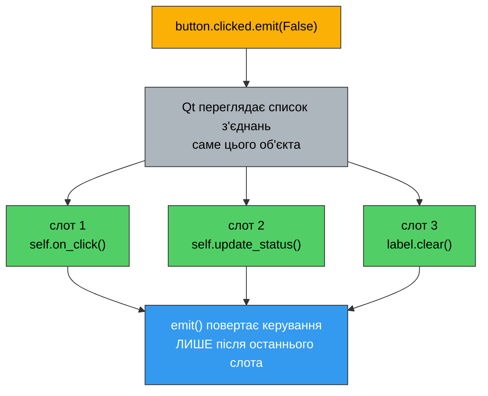
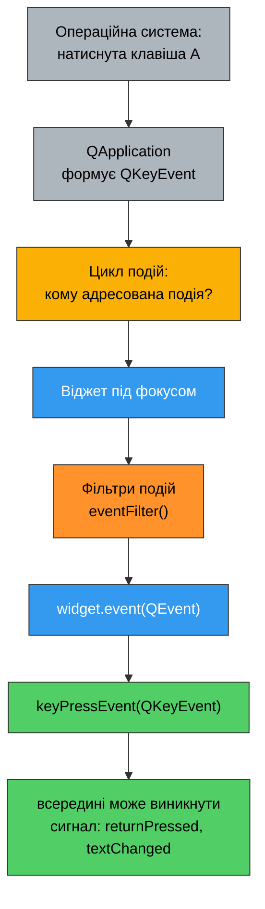
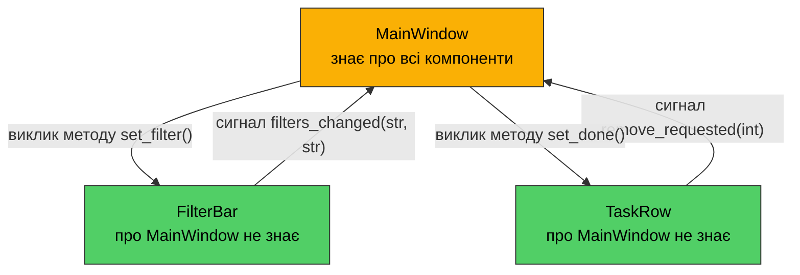

# 13. (Л) Сигнали та слоти на практиці

## Зміст лекції

1. Що вже вміємо і що додаємо
2. Анатомія з'єднання
3. Що може бути слотом
4. Декоратор `@Slot()`
5. Аргументи сигналу і пастка замикань
6. `sender()`: хто надіслав сигнал
7. Власні сигнали
8. Кілька з'єднань, порядок, `disconnect()`
9. Рекурсія сигналів і `QSignalBlocker`
10. Прямий зв'язок віджетів між собою
11. Події — другий механізм Qt
12. Фільтри подій
13. Власний віджет із власним сигналом
14. Архітектура: сигнал угору, метод униз
15. Збірка: застосунок «Task Board»
16. Типові помилки
17. Підсумок

## Що вже вміємо і що додаємо

Сигнали та слоти ми вперше побачили в [лекції 1](/ua/courses/programming-3sem/module1/01-pyside6-intro-lecture/) і відтоді користувались ними на кожному занятті:

```python
button.clicked.connect(self.on_click)
action.triggered.connect(self.on_save)
editor.textChanged.connect(self.on_text_changed)
line_edit.returnPressed.connect(self.on_submit)
```

Досі нам вистачало одного рядка `connect()`. Тепер розберемо сам механізм: що саме робить `connect()`, що може бути слотом, як передати у слот додаткові дані, як оголосити **власний** сигнал і — головне — як за допомогою сигналів зв'язати частини інтерфейсу так, щоб вони не залежали одна від одної.

Окремо розберемо **події** (events) — другий, нижчий механізм Qt. Ми вже користувались ним, коли перевизначали `closeEvent()` у [лекції 7](/ua/courses/programming-3sem/module1/07-qmainwindow-lecture/); тепер побачимо повну картину.

| | Сигнал | Подія |
|---|---|---|
| Що це | повідомлення «зі мною щось сталося» | пакет даних від системи вікон |
| Хто надсилає | будь-який `QObject` | ядро Qt (миша, клавіатура, таймер, вікно) |
| Кому | усім, хто підписався | **одному** конкретному об'єкту |
| Як обробляють | `connect()` до слота | перевизначення методу `...Event()` |
| Скільки обробників | 0, 1 або багато | один (плюс фільтри) |
| Типовий приклад | `clicked`, `textChanged` | `mousePressEvent`, `keyPressEvent`, `closeEvent` |

Правило вибору просте: **якщо потрібний сигнал уже є — користуйтесь сигналом**. Події перевизначають лише тоді, коли готового сигналу не існує (натиснута конкретна клавіша, клік по мітці, перетягування файлу у вікно).

## Анатомія з'єднання

Запис `button.clicked` — це не метод і не функція. Це **об'єкт** класу `SignalInstance`, який Qt створює для кожного сигналу кожного екземпляра. У нього три головні методи:

| Метод | Дія |
|---|---|
| `.connect(slot)` | додати слот до списку одержувачів |
| `.disconnect(slot)` | прибрати слот зі списку |
| `.emit(args...)` | надіслати сигнал — викликати всі слоти зі списку |

```python
print(button.clicked)
# <PySide6.QtCore.SignalInstance clicked(bool) at 0x7f...>
```

Що відбувається під час `emit()`:



Чотири факти, які варто запам'ятати одразу:

1. **Виклик синхронний.** У межах одного потоку `emit()` — це звичайний виклик функцій одна за одною. Рядок після `emit()` виконається лише коли всі слоти завершаться. Сигнал — це не черга й не «повідомлення на потім».
2. **Порядок = порядок підключення.** Слоти викликаються в тому порядку, в якому їх під'єднали. Покладатись на це не варто, але знати корисно.
3. **Відправник нічого не знає про одержувачів.** Якщо слотів немає — `emit()` просто нічого не робить, і це не помилка.
4. **Виняток у слоті не зупиняє інші слоти.** Qt друкує traceback у термінал і викликає наступний слот. Застосунок не падає, вікно не показує нічого — помилку видно тільки в консолі.

!!! danger "Помилки в слотах не видно у вікні"
    ```python
    def on_save(self):
        text = self.editor.toPlainText()
        Path(self.path).write_text(text)      # path == None -> TypeError
    ```
    Користувач натисне `Save`, нічого не станеться, жодного повідомлення не з'явиться. Traceback піде в термінал, з якого запущено застосунок. **Завжди тримайте термінал відкритим під час розробки** — це єдине місце, де видно такі помилки.

### З'єднання розривається саме

Коли об'єкт-відправник або об'єкт-одержувач знищується, Qt автоматично прибирає всі його з'єднання. Це принципова відмінність від звичайних callback-функцій: «висячого» виклику до вже неіснуючого віджета не буде.

## Що може бути слотом

Слот у PySide6 — це **будь-що, що можна викликати**. Чотири варіанти, які реально використовують:

| Варіант | Приклад | Коли |
|---|---|---|
| Метод свого класу | `self.on_click` | основний робочий варіант |
| Звичайна функція | `print` | у маленьких скриптах |
| `lambda` | `lambda: label.setText("Hi")` | коли треба відкинути або підставити аргумент |
| Слот іншого віджета | `self.label.clear` | коли сигнал одного віджета напряму керує іншим |

Останній варіант особливо цінний: більшість методів-сеттерів Qt (`setText`, `setValue`, `setEnabled`, `clear`, `close`, `show`) є **слотами**, тому їх можна підключати напряму, без жодного власного коду.

```python
import sys

from PySide6.QtWidgets import (
    QApplication,
    QLabel,
    QLineEdit,
    QPushButton,
    QVBoxLayout,
    QWidget,
)


def log_to_console(text):
    """Звичайна функція - теж повноцінний слот."""
    print(f"[console] text is now: {text!r}")


class ConnectDemo(QWidget):
    def __init__(self):
        super().__init__()

        self.setWindowTitle("Four kinds of slots")

        self.field = QLineEdit()
        self.mirror = QLabel("(empty)")
        self.status = QLabel("Nothing happened yet")

        clear_button = QPushButton("Clear")
        greet_button = QPushButton("Greet")
        quit_button = QPushButton("Quit")

        # 1. Метод свого класу.
        self.field.textChanged.connect(self.on_text_changed)

        # 2. Звичайна функція поза класом.
        self.field.textChanged.connect(log_to_console)

        # 3. Слот іншого віджета напряму - жодного власного коду.
        #    textChanged(str) -> setText(str): типи аргументів збігаються.
        self.field.textChanged.connect(self.mirror.setText)
        clear_button.clicked.connect(self.field.clear)
        quit_button.clicked.connect(self.close)

        # 4. lambda: відкидає аргумент checked і підставляє свій текст.
        greet_button.clicked.connect(
            lambda: self.status.setText(f"Hello, {self.field.text() or 'stranger'}!")
        )

        layout = QVBoxLayout(self)
        layout.addWidget(QLabel("Type something:"))
        layout.addWidget(self.field)
        layout.addWidget(self.mirror)
        layout.addWidget(clear_button)
        layout.addWidget(greet_button)
        layout.addWidget(quit_button)
        layout.addWidget(self.status)

    def on_text_changed(self, text):
        self.status.setText(f"Length: {len(text)}")


def main():
    app = QApplication(sys.argv)

    window = ConnectDemo()
    window.resize(320, 240)
    window.show()

    sys.exit(app.exec())


if __name__ == "__main__":
    main()
```

Зверніть увагу на `self.field.textChanged.connect(self.mirror.setText)`. Тут немає ані `lambda`, ані власного методу: сигнал `textChanged(str)` передає рядок, `setText(str)` його приймає. Один рядок замість трьох — і саме так виглядає «зв'язування компонентів інтерфейсу» у найпростішому вигляді.

!!! warning "`connect(self.on_click)` — без дужок"
    ```python
    button.clicked.connect(self.on_click())    # ПОМИЛКА
    ```
    З дужками метод **викликається негайно**, а в `connect()` потрапляє його результат (найчастіше `None`). Помилка «слот спрацював один раз під час запуску, а потім ніколи» — майже завжди про це.

## Декоратор `@Slot()`

У прикладах Qt слоти часто позначають декоратором:

```python
from PySide6.QtCore import Slot


class Window(QWidget):
    @Slot()
    def on_click(self):
        ...

    @Slot(str)
    def on_text_changed(self, text):
        ...
```

**Чи обов'язково це?** Ні. Без декоратора все працює так само — PySide6 підключить звичайний метод Python.

**Навіщо тоді?** Декоратор реєструє метод у метаоб'єктній системі Qt як справжній слот C++. Це дає:

- трохи меншу витрату пам'яті та швидший виклик (помітно лише на тисячах з'єднань);
- явну вказівку типів, якщо сигнал має **перевантаження** (див. нижче);
- можливість викликати слот із QML або через `QMetaObject.invokeMethod()`;
- документацію: читач одразу бачить, що метод — не звичайний хелпер, а точка входу від сигналу.

Аргументи декоратора — це типи параметрів сигналу, а не Python-анотації:

```python
@Slot()                 # сигнал без аргументів
@Slot(int)              # один int
@Slot(str, int)         # рядок і число
@Slot(bool)             # clicked(bool), toggled(bool)
```

!!! tip "Правило для курсу"
    Ставити `@Slot()` — хороший тон, і в лекційних прикладах ми його використовуємо там, де це доречно. Але якщо ви його забули або вказали типи неточно — з'єднання з коду Python усе одно спрацює: PySide6 викличе метод як звичайну функцію Python. Помилка в типах стане відчутною лише там, де слот шукають через метаоб'єктну систему (QML, `QMetaObject.invokeMethod`). Тож пишіть типи правильно, але не бійтесь, що застосунок «мовчки зламається» через декоратор.

## Аргументи сигналу і пастка замикань

Сигнал може нести дані. `textChanged(str)` несе новий текст, `valueChanged(int)` — нове значення, `clicked(bool)` — стан кнопки-перемикача.

Правило узгодження одне:

> Слот може приймати **стільки ж або менше** аргументів, ніж передає сигнал. Зайві аргументи з кінця відкидаються. Приймати **більше**, ніж дає сигнал, не можна.

```python
def slot_a():                  # OK: аргумент відкинуто
    ...

def slot_b(text):              # OK: точний збіг з textChanged(str)
    ...

def slot_c(text, extra):       # ПОМИЛКА: сигнал не має другого аргументу
    ...

line_edit.textChanged.connect(slot_a)
line_edit.textChanged.connect(slot_b)
line_edit.textChanged.connect(slot_c)   # TypeError під час emit
```

### Коли слоту потрібні власні дані

Найчастіша задача: десять кнопок, один слот, і слот має знати, **яку саме** кнопку натиснули. Сигнал `clicked` цього не каже — він однаковий для всіх.

Перший спосіб — `lambda` з підставленим значенням. І тут чекає класична пастка Python:

```python
for i in range(3):
    button = QPushButton(str(i))
    button.clicked.connect(lambda: self.on_digit(i))    # ПОМИЛКА
```

Усі три кнопки викличуть `on_digit(2)`. `lambda` не запам'ятовує значення `i` — вона запам'ятовує **саму змінну**, а на момент кліку цикл давно скінчився і в `i` лишилось останнє значення. Це не особливість Qt, а звичайне пізнє зв'язування (late binding) у Python.

Два робочі рішення:

```python
# Варіант 1: значення за замовчуванням обчислюється в момент створення lambda
button.clicked.connect(lambda checked=False, value=i: self.on_digit(value))

# Варіант 2: functools.partial - той самий ефект, але читабельніше
from functools import partial
button.clicked.connect(partial(self.on_digit, i))
```

`partial(self.on_digit, i)` створює об'єкт, який при виклику зробить `self.on_digit(i)`. Значення `i` фіксується **зараз**, а не під час кліку.

!!! warning "`partial` і зайвий аргумент `clicked`"
    `clicked` передає `bool`, і `partial` **додасть** його після своїх аргументів: слот отримає `on_digit(i, False)`. Тому слот під `partial` від `clicked` має або приймати другий параметр, або сигнал має бути без аргументів (наприклад, `triggered` у `QAction` теж передає `bool`). Найнадійніше — оголосити слот як `def on_digit(self, value, checked=False)`.

Повний приклад — калькуляторна панель цифр, де один слот обслуговує десять кнопок:

```python
import sys
from functools import partial

from PySide6.QtWidgets import (
    QApplication,
    QGridLayout,
    QLabel,
    QLineEdit,
    QPushButton,
    QVBoxLayout,
    QWidget,
)


class Keypad(QWidget):
    def __init__(self):
        super().__init__()

        self.setWindowTitle("One slot for ten buttons")

        self.display = QLineEdit()
        self.display.setReadOnly(True)

        grid = QGridLayout()
        for digit in range(10):
            button = QPushButton(str(digit))
            button.setFixedSize(48, 40)

            # partial фіксує digit у момент створення з'єднання.
            button.clicked.connect(partial(self.on_digit, digit))

            row, column = divmod(digit, 5)
            grid.addWidget(button, row, column)

        clear_button = QPushButton("Clear")
        clear_button.clicked.connect(self.display.clear)

        layout = QVBoxLayout(self)
        layout.addWidget(QLabel("Digits:"))
        layout.addWidget(self.display)
        layout.addLayout(grid)
        layout.addWidget(clear_button)

    # checked приходить від clicked(bool) і нас не цікавить,
    # але параметр має бути, бо partial додає його в кінець.
    def on_digit(self, digit, checked=False):
        self.display.setText(self.display.text() + str(digit))


def main():
    app = QApplication(sys.argv)

    window = Keypad()
    window.show()

    sys.exit(app.exec())


if __name__ == "__main__":
    main()
```

## `sender()`: хто надіслав сигнал

Альтернатива `partial` — запитати в самого Qt, який об'єкт надіслав сигнал. Метод `self.sender()` доступний у будь-якому слоті **методі класу-нащадка `QObject`** і повертає об'єкт-відправник.

```python
def on_any_button(self):
    button = self.sender()          # той QPushButton, який натиснули
    self.display.setText(button.text())
```

Щоб не розбирати текст кнопки, до віджета чіпляють довільні дані — через `setProperty()` або через `QAction.setData()` (це ми вже робили в [лекції 9](/ua/courses/programming-3sem/module1/09-actions-menus-toolbars-lecture/) для списку останніх файлів):

```python
button.setProperty("digit", digit)
...
digit = self.sender().property("digit")
```

Порівняння двох підходів:

| | `partial` / `lambda` | `sender()` |
|---|---|---|
| Дані видно | у місці `connect()` | у місці слота |
| Працює поза слотом | так (це звичайний виклик) | ні, поверне `None` |
| Слот можна викликати вручну | так | ні, зламається |
| Тип даних | будь-який Python-об'єкт | те, що вміщує `QVariant` |

**Рекомендація для курсу: за замовчуванням `partial`.** Слот, побудований на `sender()`, неможливо викликати з коду напряму (`self.on_digit(5)` впаде, бо `sender()` поверне `None`) і неможливо протестувати. `sender()` доречний тоді, коли в слоті потрібен сам віджет — наприклад, змінити його вигляд.

```python
import sys

from PySide6.QtWidgets import (
    QApplication,
    QHBoxLayout,
    QLabel,
    QPushButton,
    QVBoxLayout,
    QWidget,
)


class SenderDemo(QWidget):
    def __init__(self):
        super().__init__()

        self.setWindowTitle("sender()")

        self.status = QLabel("Press a colour")

        row = QHBoxLayout()
        for name, color in [("Red", "#fa5252"), ("Green", "#51cf66"), ("Blue", "#339af0")]:
            button = QPushButton(name)
            button.setProperty("color", color)      # довільні дані на віджеті
            button.clicked.connect(self.on_color_clicked)
            row.addWidget(button)

        layout = QVBoxLayout(self)
        layout.addLayout(row)
        layout.addWidget(self.status)

    def on_color_clicked(self):
        button = self.sender()
        color = button.property("color")

        self.status.setText(f"Selected: {button.text()} ({color})")
        self.status.setStyleSheet(f"color: {color}; font-weight: bold;")


def main():
    app = QApplication(sys.argv)

    window = SenderDemo()
    window.resize(320, 120)
    window.show()

    sys.exit(app.exec())


if __name__ == "__main__":
    main()
```

## Власні сигнали

Досі ми лише **підключались** до чужих сигналів. Тепер оголосимо свій.

Правила оголошення:

```python
from PySide6.QtCore import QObject, Signal


class Downloader(QObject):            # 1. клас мусить успадковувати QObject
    progress = Signal(int)            # 2. сигнал - атрибут КЛАСУ, не екземпляра
    finished = Signal(str, int)       # 3. типи аргументів у дужках
    failed = Signal()                 # 4. без аргументів - порожні дужки
```

Три обмеження, які варто знати:

1. **Клас має бути нащадком `QObject`.** Для віджетів це виконано автоматично (`QWidget` — нащадок `QObject`). Для звичайних класів-помічників треба явно писати `class Loader(QObject)` і викликати `super().__init__()`.
2. **`Signal` оголошують у тілі класу.** Написати `self.progress = Signal(int)` в `__init__` не можна — це просто створить непрацездатний атрибут.
3. **Кількість і типи аргументів фіксовані.** `emit()` з іншою кількістю аргументів — помилка.

Типи аргументів:

| Оголошення | Що передає |
|---|---|
| `Signal()` | нічого |
| `Signal(int)` | ціле число |
| `Signal(str)` | рядок |
| `Signal(bool)` | булеве значення |
| `Signal(float)` | дробове число |
| `Signal(list)`, `Signal(dict)` | список, словник |
| `Signal(object)` | **будь-який** Python-об'єкт |
| `Signal(str, int)` | кілька значень одразу |
| `Signal(QColor)` | будь-який тип Qt |

`Signal(object)` — універсальний варіант для власних класів даних:

```python
class Task:
    def __init__(self, title):
        self.title = title


class TaskList(QObject):
    task_added = Signal(object)       # передамо сам об'єкт Task
```

### Надсилання

```python
self.progress.emit(42)
self.finished.emit("report.csv", 1024)
self.failed.emit()
```

`emit()` — звичайний виклик. Ніякої черги: всі підключені слоти виконаються **до** того, як `emit()` поверне керування.

### Приклад: клас без інтерфейсу, який повідомляє про свій стан

Класична схема: логіка живе в окремому класі, який нічого не знає про вікна, і повідомляє про зміни сигналами. Вікно підписується — і оновлює інтерфейс.

```python
import sys

from PySide6.QtCore import QObject, QTimer, Signal, Slot
from PySide6.QtWidgets import (
    QApplication,
    QHBoxLayout,
    QLabel,
    QProgressBar,
    QPushButton,
    QSpinBox,
    QVBoxLayout,
    QWidget,
)


class Countdown(QObject):
    """Зворотний відлік. Про інтерфейс не знає нічого - лише сигнали."""

    tick = Signal(int)            # скільки секунд лишилось
    started = Signal(int)         # з якого значення почали
    finished = Signal()           # відлік завершено
    cancelled = Signal()          # відлік перервано користувачем

    def __init__(self, parent=None):
        super().__init__(parent)

        self._seconds_left = 0

        self._timer = QTimer(self)
        self._timer.setInterval(1000)
        self._timer.timeout.connect(self._on_timeout)

    def is_running(self):
        return self._timer.isActive()

    def start(self, seconds):
        if self.is_running():
            return

        self._seconds_left = seconds
        self.started.emit(seconds)
        self.tick.emit(seconds)
        self._timer.start()

    def cancel(self):
        if not self.is_running():
            return

        self._timer.stop()
        self._seconds_left = 0
        self.cancelled.emit()

    def _on_timeout(self):
        self._seconds_left -= 1
        self.tick.emit(self._seconds_left)

        if self._seconds_left <= 0:
            self._timer.stop()
            self.finished.emit()


class CountdownWindow(QWidget):
    def __init__(self):
        super().__init__()

        self.setWindowTitle("Custom signals")

        self.countdown = Countdown(self)

        self.seconds_box = QSpinBox()
        self.seconds_box.setRange(1, 60)
        self.seconds_box.setValue(10)

        self.progress = QProgressBar()
        self.progress.setRange(0, 10)
        self.progress.setValue(10)

        self.status = QLabel("Ready")

        self.start_button = QPushButton("Start")
        self.cancel_button = QPushButton("Cancel")
        self.cancel_button.setEnabled(False)

        self.start_button.clicked.connect(self.on_start_clicked)
        self.cancel_button.clicked.connect(self.countdown.cancel)

        # Один об'єкт - чотири сигнали - чотири слоти вікна.
        self.countdown.started.connect(self.on_started)
        self.countdown.tick.connect(self.on_tick)
        self.countdown.finished.connect(self.on_finished)
        self.countdown.cancelled.connect(self.on_cancelled)

        controls = QHBoxLayout()
        controls.addWidget(QLabel("Seconds:"))
        controls.addWidget(self.seconds_box)
        controls.addWidget(self.start_button)
        controls.addWidget(self.cancel_button)

        layout = QVBoxLayout(self)
        layout.addLayout(controls)
        layout.addWidget(self.progress)
        layout.addWidget(self.status)

    def on_start_clicked(self):
        self.countdown.start(self.seconds_box.value())

    @Slot(int)
    def on_started(self, total):
        self.progress.setRange(0, total)
        self.start_button.setEnabled(False)
        self.cancel_button.setEnabled(True)
        self.seconds_box.setEnabled(False)

    @Slot(int)
    def on_tick(self, seconds_left):
        self.progress.setValue(seconds_left)
        self.status.setText(f"{seconds_left} s left")

    @Slot()
    def on_finished(self):
        self.status.setText("Time is up!")
        self._reset_controls()

    @Slot()
    def on_cancelled(self):
        self.status.setText("Cancelled")
        self.progress.setValue(0)
        self._reset_controls()

    def _reset_controls(self):
        self.start_button.setEnabled(True)
        self.cancel_button.setEnabled(False)
        self.seconds_box.setEnabled(True)


def main():
    app = QApplication(sys.argv)

    window = CountdownWindow()
    window.resize(420, 140)
    window.show()

    sys.exit(app.exec())


if __name__ == "__main__":
    main()
```

Головне в цьому прикладі — **клас `Countdown` не містить жодного віджета**. Його можна перевірити зі скрипта без графічного інтерфейсу, вбудувати в інше вікно або замінити на іншу реалізацію — вікно про це не дізнається. Це і є та слабка зв'язаність, заради якої існують сигнали.

!!! tip "Сигнал у минулому часі, слот — у наказовому"
    Прийнята в Qt угода про імена: сигнал описує **те, що вже сталося** (`clicked`, `finished`, `text_changed`), слот описує **дію** (`on_finished`, `update_status`, `reload`). Слоти-обробники зазвичай називають `on_<сигнал>`.

### Сигнал з іменем та перевантаження

Два додаткові прийоми, які трапляються в чужому коді:

```python
class Sensor(QObject):
    # Ім'я в стилі Qt для сумісності, атрибут - у стилі Python.
    value_changed = Signal(int, name="valueChanged")

    # Перевантаження: той самий сигнал з різними типами аргументів.
    reading = Signal((int,), (str,))


sensor.reading[int].connect(self.on_int_reading)
sensor.reading[str].connect(self.on_str_reading)
sensor.reading[str].emit("N/A")
```

Перевантажені сигнали є і серед вбудованих (наприклад, у старих версіях Qt `QComboBox.currentIndexChanged` мав варіанти `(int)` і `(str)`). Синтаксис із квадратними дужками — це вибір конкретного варіанта. У власному коді перевантажень краще уникати: два окремі сигнали з різними іменами зрозуміліші.

## Кілька з'єднань, порядок, `disconnect()`

Сигнал і слот пов'язані відношенням «багато до багатьох»:

```python
# один сигнал -> три слоти
self.editor.textChanged.connect(self.update_char_count)
self.editor.textChanged.connect(self.mark_as_modified)
self.editor.textChanged.connect(self.update_window_title)

# три сигнали -> один слот
self.name_edit.textChanged.connect(self.validate_form)
self.email_edit.textChanged.connect(self.validate_form)
self.age_box.valueChanged.connect(self.validate_form)
```

Другий випадок — робочий приклад «зв'язування компонентів»: будь-яка зміна будь-якого поля запускає одну спільну перевірку, яка вмикає або вимикає кнопку `OK`.

### Дублікати

`connect()` не перевіряє, чи такий слот уже підключений. Двічі підключений слот викличеться **двічі**:

```python
button.clicked.connect(self.on_click)
button.clicked.connect(self.on_click)     # тепер on_click виконується двічі на клік
```

Це реальна проблема в коді, де з'єднання створюють у методі, який викликається не один раз (перебудова списку, перезавантаження документа). Захист — `Qt.ConnectionType.UniqueConnection`:

```python
from PySide6.QtCore import Qt

self.model.updated.connect(self.on_updated, Qt.ConnectionType.UniqueConnection)
```

Повторне з'єднання просто не створиться. Обмеження: працює лише для методів об'єктів-нащадків `QObject`, не для `lambda` і не для звичайних функцій.

### Розрив з'єднання

```python
button.clicked.disconnect(self.on_click)   # прибрати конкретний слот
button.clicked.disconnect()                # прибрати ВСІ слоти цього сигналу
```

`disconnect(slot)` повертає `True`, якщо з'єднання було, і `False`, якщо його не існувало (у цьому разі PySide6 ще й друкує `RuntimeWarning` у термінал — це не помилка, але шум у консолі):

```python
if not self.slider.valueChanged.disconnect(self.on_value):
    print("nothing to disconnect")
```

У старіших версіях PySide6 такий виклик підіймав `RuntimeError`, тому в чужому коді часто зустрічається обгортка `try/except RuntimeError` — вона нешкідлива.

Але зазвичай `disconnect()` не потрібен зовсім. Якщо вам хочеться тимчасово «вимкнути» слот — майже завжди правильніша відповідь у наступному розділі.

## Рекурсія сигналів і `QSignalBlocker`

Найпоширеніша задача, де сигнали кусають за хвіст: **двостороння синхронізація двох віджетів**.

Повзунок і поле числа мають показувати одне значення. Наївне рішення:

```python
slider.valueChanged.connect(spin_box.setValue)
spin_box.valueChanged.connect(slider.setValue)
```

Що станеться: користувач тягне повзунок → `valueChanged(5)` → `spin_box.setValue(5)` → у `spin_box` значення змінилось → його `valueChanged(5)` → `slider.setValue(5)`. Ланцюг обірветься лише тому, що і `QSlider`, і `QSpinBox` **не надсилають `valueChanged`, якщо значення не змінилось**. Тобто конкретно ця пара працює — випадково.

Варто додати перетворення — і петля стає нескінченною:

```python
# Цельсій <-> Фаренгейт: значення РІЗНІ, тому сигнали не згасають
celsius.valueChanged.connect(self.on_celsius)      # ставить fahrenheit
fahrenheit.valueChanged.connect(self.on_fahrenheit)  # ставить celsius
# -> RecursionError або зависання
```

Правильне рішення — на час програмної зміни віджета **заблокувати його сигнали**. Це важливо зрозуміти дослівно: блокуються сигнали, а не сама зміна. Значення встановиться, вікно перемалюється — просто ніхто не дізнається про це сигналом.

| Спосіб | Код |
|---|---|
| Вручну | `w.blockSignals(True)` … `w.blockSignals(False)` |
| Через об'єкт | `blocker = QSignalBlocker(w)` … `blocker.unblock()` |
| Контекстний менеджер | `with QSignalBlocker(w): ...` |

Третій варіант найкращий: блокування знімається навіть якщо всередині станеться виняток.

```python
import sys

from PySide6.QtCore import QSignalBlocker, Qt
from PySide6.QtWidgets import (
    QApplication,
    QDoubleSpinBox,
    QFormLayout,
    QLabel,
    QSlider,
    QVBoxLayout,
    QWidget,
)


class TemperatureConverter(QWidget):
    def __init__(self):
        super().__init__()

        self.setWindowTitle("Two-way binding without recursion")

        self.celsius = QDoubleSpinBox()
        self.celsius.setRange(-100.0, 100.0)
        self.celsius.setSuffix(" C")
        self.celsius.setDecimals(1)

        self.fahrenheit = QDoubleSpinBox()
        self.fahrenheit.setRange(-148.0, 212.0)
        self.fahrenheit.setSuffix(" F")
        self.fahrenheit.setDecimals(1)

        self.slider = QSlider(Qt.Orientation.Horizontal)
        self.slider.setRange(-100, 100)

        self.hint = QLabel("Change any field")

        self.celsius.valueChanged.connect(self.on_celsius_changed)
        self.fahrenheit.valueChanged.connect(self.on_fahrenheit_changed)
        self.slider.valueChanged.connect(self.on_slider_changed)

        form = QFormLayout()
        form.addRow("Celsius:", self.celsius)
        form.addRow("Fahrenheit:", self.fahrenheit)

        layout = QVBoxLayout(self)
        layout.addLayout(form)
        layout.addWidget(self.slider)
        layout.addWidget(self.hint)

        self.set_celsius(20.0, source="init")

    def set_celsius(self, value, source):
        """Єдина точка, яка оновлює всі три віджети без зайвих сигналів."""
        # Блокуємо сигнали всіх трьох віджетів, поки розставляємо значення.
        with QSignalBlocker(self.celsius), QSignalBlocker(self.fahrenheit), QSignalBlocker(self.slider):
            self.celsius.setValue(value)
            self.fahrenheit.setValue(value * 9.0 / 5.0 + 32.0)
            self.slider.setValue(round(value))

        self.hint.setText(f"{value:.1f} C  =  {value * 9.0 / 5.0 + 32.0:.1f} F   (changed by {source})")

    def on_celsius_changed(self, value):
        self.set_celsius(value, source="celsius")

    def on_fahrenheit_changed(self, value):
        self.set_celsius((value - 32.0) * 5.0 / 9.0, source="fahrenheit")

    def on_slider_changed(self, value):
        self.set_celsius(float(value), source="slider")


def main():
    app = QApplication(sys.argv)

    window = TemperatureConverter()
    window.resize(360, 160)
    window.show()

    sys.exit(app.exec())


if __name__ == "__main__":
    main()
```

Схема, яка тут застосована, називається «одна точка істини»: **жоден слот не змінює інші віджети напряму**. Кожен слот лише перераховує значення у спільну одиницю й викликає один метод `set_celsius()`, який і розставляє все з блокуванням. Такий код не зациклюється в принципі й легко розширюється четвертим віджетом.

!!! warning "`blockSignals()` без відновлення"
    ```python
    self.slider.blockSignals(True)
    self.slider.setValue(compute())      # тут може статися виняток
    self.slider.blockSignals(False)      # цей рядок не виконається
    ```
    Повзунок назавжди залишиться «німим», і застосунок поводитиметься незрозуміло. `with QSignalBlocker(...)` знімає блокування завжди.

## Прямий зв'язок віджетів між собою

Частину інтерфейсної логіки можна описати взагалі без власних слотів — просто з'єднавши сигнал одного віджета зі слотом іншого. Кілька пар, які варто знати напам'ять:

| Зв'язок | Результат |
|---|---|
| `checkbox.toggled` → `widget.setEnabled` | прапорець вмикає/вимикає групу полів |
| `combo.currentIndexChanged` → `stack.setCurrentIndex` | вибір у списку перемикає сторінку |
| `slider.valueChanged` → `progress.setValue` | повзунок рухає індикатор |
| `line_edit.textChanged` → `label.setText` | дзеркало тексту |
| `line_edit.returnPressed` → `button.click` | `Enter` натискає кнопку |
| `action.toggled` → `toolbar.setVisible` | пункт меню ховає панель |
| `button.clicked` → `dialog.accept` | кнопка закриває діалог |
| `button.clicked` → `window.close` | кнопка закриває вікно |
| `timer.timeout` → `widget.update` | перемалювання за таймером |

Правило те саме: типи мають збігатись (`toggled(bool)` → `setEnabled(bool)`) або слот має бути «коротшим» за сигнал.

```python
import sys

from PySide6.QtCore import Qt
from PySide6.QtWidgets import (
    QApplication,
    QCheckBox,
    QComboBox,
    QFormLayout,
    QGroupBox,
    QLabel,
    QLineEdit,
    QProgressBar,
    QPushButton,
    QSlider,
    QStackedWidget,
    QVBoxLayout,
    QWidget,
)


def make_page(text):
    page = QWidget()
    layout = QVBoxLayout(page)
    layout.addWidget(QLabel(text))
    layout.addStretch()
    return page


class WiringDemo(QWidget):
    """Весь інтерфейс зв'язаний напряму: жодного власного слота."""

    def __init__(self):
        super().__init__()

        self.setWindowTitle("Widgets wired to each other")

        # --- 1. Прапорець вмикає групу полів ---
        self.details_box = QGroupBox("Delivery details")
        self.details_box.setEnabled(False)

        address = QLineEdit()
        comment = QLineEdit()

        details_form = QFormLayout(self.details_box)
        details_form.addRow("Address:", address)
        details_form.addRow("Comment:", comment)

        enable_check = QCheckBox("Deliver to address")
        enable_check.toggled.connect(self.details_box.setEnabled)

        # --- 2. Список перемикає сторінку ---
        self.pages = QStackedWidget()
        self.pages.addWidget(make_page("Page: general settings"))
        self.pages.addWidget(make_page("Page: network settings"))
        self.pages.addWidget(make_page("Page: about"))

        page_combo = QComboBox()
        page_combo.addItems(["General", "Network", "About"])
        page_combo.currentIndexChanged.connect(self.pages.setCurrentIndex)

        # --- 3. Повзунок рухає індикатор ---
        volume = QSlider(Qt.Orientation.Horizontal)
        volume.setRange(0, 100)

        progress = QProgressBar()
        progress.setRange(0, 100)
        volume.valueChanged.connect(progress.setValue)

        # --- 4. Дзеркало тексту й Enter, що натискає кнопку ---
        search_edit = QLineEdit()
        search_edit.setPlaceholderText("Type and press Enter")

        echo_label = QLabel("(nothing typed)")
        search_edit.textChanged.connect(echo_label.setText)

        search_button = QPushButton("Search")
        search_edit.returnPressed.connect(search_button.click)
        search_button.clicked.connect(search_edit.clear)

        # --- 5. Кнопка закриває вікно ---
        close_button = QPushButton("Close")
        close_button.clicked.connect(self.close)

        layout = QVBoxLayout(self)
        layout.addWidget(enable_check)
        layout.addWidget(self.details_box)
        layout.addWidget(page_combo)
        layout.addWidget(self.pages)
        layout.addWidget(volume)
        layout.addWidget(progress)
        layout.addWidget(search_edit)
        layout.addWidget(echo_label)
        layout.addWidget(search_button)
        layout.addWidget(close_button)


def main():
    app = QApplication(sys.argv)

    window = WiringDemo()
    window.resize(380, 480)
    window.show()

    sys.exit(app.exec())


if __name__ == "__main__":
    main()
```

У цьому вікні немає **жодного** методу-обробника — і воно повністю робоче. Це корисний орієнтир: перш ніж писати слот, перевірте, чи не існує вже потрібного слота у віджета-одержувача.

!!! tip "Коли прямий зв'язок шкідливий"
    Прямий зв'язок доречний для суто візуальних речей. Щойно між сигналом і дією з'являється **умова** («перемкнути сторінку, тільки якщо форма валідна») — потрібен власний слот. Не намагайтесь вкласти логіку в ланцюжок `lambda`.

## Події — другий механізм Qt

Сигнал надсилає об'єкт. **Подію** надсилає система: користувач посунув мишу, натиснув клавішу, змінив розмір вікна, система попросила перемалювати ділянку.



Важливо: **сигнали народжуються з подій**. `QPushButton` не отримує сигналу «клік» від системи — він отримує `QMouseEvent` про натиснуту й відпущену кнопку миші, і вже сам вирішує надіслати `clicked`. Коли ви перевизначаєте `mousePressEvent`, ви працюєте на рівень нижче, ніж коли підключаєтесь до `clicked`.

### Найуживаніші обробники подій

| Метод | Клас події | Коли викликається |
|---|---|---|
| `mousePressEvent` | `QMouseEvent` | натиснута кнопка миші над віджетом |
| `mouseReleaseEvent` | `QMouseEvent` | кнопка миші відпущена |
| `mouseDoubleClickEvent` | `QMouseEvent` | подвійний клік |
| `mouseMoveEvent` | `QMouseEvent` | рух миші (за замовчуванням — лише з натиснутою кнопкою) |
| `wheelEvent` | `QWheelEvent` | прокручування коліщатка |
| `keyPressEvent` | `QKeyEvent` | натиснута клавіша (віджет має фокус) |
| `keyReleaseEvent` | `QKeyEvent` | клавіша відпущена |
| `enterEvent` / `leaveEvent` | `QEnterEvent` / `QEvent` | курсор увійшов / вийшов за межі віджета |
| `focusInEvent` / `focusOutEvent` | `QFocusEvent` | віджет отримав / втратив фокус |
| `resizeEvent` | `QResizeEvent` | змінено розмір |
| `paintEvent` | `QPaintEvent` | треба перемалювати |
| `closeEvent` | `QCloseEvent` | вікно закривають |
| `contextMenuEvent` | `QContextMenuEvent` | правий клік або клавіша меню |

Три правила роботи з обробниками:

1. **Викликайте `super()`**, якщо не хочете повністю замінити стандартну поведінку. Забутий `super().keyPressEvent(event)` у полі вводу означає, що в нього перестане щось вводитись.
2. **`event.accept()`** каже «я обробив», **`event.ignore()`** — «передайте батьківському віджету».
3. **Не робіть у обробнику довгих операцій.** Поки він виконується, інтерфейс не реагує.

### Приклад: клавіатура й миша напряму

```python
import sys

from PySide6.QtCore import Qt
from PySide6.QtGui import QKeySequence
from PySide6.QtWidgets import QApplication, QLabel, QVBoxLayout, QWidget


class EventDemo(QWidget):
    def __init__(self):
        super().__init__()

        self.setWindowTitle("Events: keyboard and mouse")

        # Без цього mouseMoveEvent приходить лише з натиснутою кнопкою.
        self.setMouseTracking(True)

        # Без фокусу віджет не отримує подій клавіатури.
        self.setFocusPolicy(Qt.FocusPolicy.StrongFocus)

        self.key_label = QLabel("Press any key")
        self.mouse_label = QLabel("Move the mouse")
        self.wheel_label = QLabel("Scroll the wheel")

        layout = QVBoxLayout(self)
        layout.addWidget(self.key_label)
        layout.addWidget(self.mouse_label)
        layout.addWidget(self.wheel_label)
        layout.addStretch()

    def keyPressEvent(self, event):
        key_text = QKeySequence(event.keyCombination()).toString()

        if event.key() == Qt.Key.Key_Escape:
            self.key_label.setText("Escape pressed: closing")
            self.close()
            return

        if event.matches(QKeySequence.StandardKey.Save):
            self.key_label.setText("Save shortcut intercepted")
            event.accept()
            return

        self.key_label.setText(f"Key: {key_text or event.text()!r}")

        # Незнайомі клавіші віддаємо базовому класу.
        super().keyPressEvent(event)

    def mouseMoveEvent(self, event):
        position = event.position()
        self.mouse_label.setText(f"Mouse at ({position.x():.0f}, {position.y():.0f})")
        super().mouseMoveEvent(event)

    def mousePressEvent(self, event):
        if event.button() == Qt.MouseButton.LeftButton:
            name = "left"
        elif event.button() == Qt.MouseButton.RightButton:
            name = "right"
        else:
            name = "other"

        self.mouse_label.setText(f"Pressed {name} button")
        super().mousePressEvent(event)

    def wheelEvent(self, event):
        delta = event.angleDelta().y()
        direction = "up" if delta > 0 else "down"
        self.wheel_label.setText(f"Wheel {direction} ({delta})")
        super().wheelEvent(event)


def main():
    app = QApplication(sys.argv)

    window = EventDemo()
    window.resize(360, 180)
    window.show()

    sys.exit(app.exec())


if __name__ == "__main__":
    main()
```

Корисні дрібниці з цього прикладу:

- `event.key()` порівнюють з константами `Qt.Key.Key_Escape`, `Qt.Key.Key_Return`, `Qt.Key.Key_Delete`, `Qt.Key.Key_F5`;
- `event.modifiers()` дає натиснуті `Ctrl`/`Shift`/`Alt`: `if event.modifiers() & Qt.KeyboardModifier.ControlModifier:`;
- `event.matches(QKeySequence.StandardKey.Copy)` — платформонезалежна перевірка стандартної комбінації;
- `event.position()` — координати **всередині віджета**, `event.globalPosition()` — на екрані;
- `setMouseTracking(True)` потрібен, щоб `mouseMoveEvent` приходив без натиснутої кнопки;
- без `setFocusPolicy(...)` звичайний `QWidget` не отримує подій клавіатури взагалі.

!!! warning "Гарячі клавіші — це не `keyPressEvent`"
    Для команд застосунку не перехоплюйте клавіші вручну. `QAction` з `setShortcut()` (лекція 9) робить це правильно: працює з меню, показує комбінацію користувачу й не конфліктує з полями вводу. `keyPressEvent` — лише для того, чого не покриває `QAction`.

## Фільтри подій

Іноді потрібно перехопити події **чужого** віджета, який ви не писали й не хочете успадковувати. Наприклад: у звичайному `QLineEdit` натискання `Esc` має очищати поле.

Створювати нащадка `QLineEdit` заради трьох рядків — надмірно. Для цього є **фільтр подій**:

```python
target_widget.installEventFilter(self)     # self ловитиме події target_widget
```

Після цього кожна подія, адресована `target_widget`, спершу потрапить у метод `self.eventFilter(obj, event)`. Він повертає:

- `True` — «подію оброблено, далі не передавати» (віджет її **не побачить**);
- `False` — «пропустити далі» (звичайна обробка триває).

```python
import sys

from PySide6.QtCore import QEvent, Qt
from PySide6.QtWidgets import (
    QApplication,
    QLabel,
    QLineEdit,
    QVBoxLayout,
    QWidget,
)


class FilterDemo(QWidget):
    def __init__(self):
        super().__init__()

        self.setWindowTitle("Event filter")

        self.search = QLineEdit()
        self.search.setPlaceholderText("Esc clears this field")

        self.note = QLineEdit()
        self.note.setPlaceholderText("This one too")

        self.status = QLabel("Ready")

        # Один фільтр обслуговує обидва поля.
        self.search.installEventFilter(self)
        self.note.installEventFilter(self)

        layout = QVBoxLayout(self)
        layout.addWidget(self.search)
        layout.addWidget(self.note)
        layout.addWidget(self.status)

    def eventFilter(self, watched, event):
        if event.type() == QEvent.Type.KeyPress:
            if event.key() == Qt.Key.Key_Escape:
                watched.clear()
                self.status.setText("Cleared by Escape")
                return True                      # поле саме Esc не побачить

        elif event.type() == QEvent.Type.FocusIn:
            self.status.setText("Editing started")

        elif event.type() == QEvent.Type.FocusOut:
            self.status.setText("Editing finished")

        # Усе інше - звичайним шляхом.
        return super().eventFilter(watched, event)


def main():
    app = QApplication(sys.argv)

    window = FilterDemo()
    window.resize(320, 140)
    window.show()

    sys.exit(app.exec())


if __name__ == "__main__":
    main()
```

Коли що обирати:

| Потреба | Рішення |
|---|---|
| Реакція на дію користувача, для якої є сигнал | `connect()` |
| Своя поведінка у **власному** віджеті | перевизначити `...Event()` |
| Своя поведінка в **чужому** віджеті | `installEventFilter()` |
| Однакова поведінка для багатьох віджетів | один фільтр на всіх |

!!! danger "`return True` там, де не треба"
    Фільтр, який повертає `True` для `KeyPress` беззастережно, зробить поле вводу непрацездатним: жодна клавіша до нього не дійде. Повертайте `True` **тільки** всередині перевірки на конкретну клавішу чи умову.

## Власний віджет із власним сигналом

Тепер поєднаємо обидва механізми. Типова задача: `QLabel` не має сигналу `clicked` — клікати по мітці Qt не передбачає. Зробимо власну мітку, яка ловить **подію** миші й перетворює її на **сигнал**.

```python
import sys

from PySide6.QtCore import Qt, Signal
from PySide6.QtWidgets import (
    QApplication,
    QHBoxLayout,
    QLabel,
    QVBoxLayout,
    QWidget,
)


class ClickableLabel(QLabel):
    """QLabel, який надсилає clicked і double_clicked."""

    clicked = Signal()
    double_clicked = Signal()

    def __init__(self, text="", parent=None):
        super().__init__(text, parent)

        self.setCursor(Qt.CursorShape.PointingHandCursor)

    # --- події перетворюємо на сигнали ---

    def mousePressEvent(self, event):
        if event.button() == Qt.MouseButton.LeftButton:
            self.clicked.emit()
            event.accept()
            return

        super().mousePressEvent(event)

    def mouseDoubleClickEvent(self, event):
        if event.button() == Qt.MouseButton.LeftButton:
            self.double_clicked.emit()
            event.accept()
            return

        super().mouseDoubleClickEvent(event)

    # --- підсвічування під курсором ---

    def enterEvent(self, event):
        self.setStyleSheet("text-decoration: underline;")
        super().enterEvent(event)

    def leaveEvent(self, event):
        self.setStyleSheet("")
        super().leaveEvent(event)


class ClickableLabelDemo(QWidget):
    def __init__(self):
        super().__init__()

        self.setWindowTitle("Custom widget with a custom signal")

        self.status = QLabel("Click or double-click a colour")
        self.preview = QLabel("      ")
        self.preview.setAutoFillBackground(True)
        self.preview.setStyleSheet("background: #dee2e6; border: 1px solid #868e96;")
        self.preview.setFixedHeight(40)

        row = QHBoxLayout()
        for name in ["Red", "Green", "Blue"]:
            label = ClickableLabel(name)

            # Сигнал власного віджета підключається так само, як вбудований.
            label.clicked.connect(lambda n=name: self.on_clicked(n))
            label.double_clicked.connect(lambda n=name: self.on_double_clicked(n))

            row.addWidget(label)

        layout = QVBoxLayout(self)
        layout.addLayout(row)
        layout.addWidget(self.preview)
        layout.addWidget(self.status)

    def on_clicked(self, name):
        self.status.setText(f"Clicked: {name}")

    def on_double_clicked(self, name):
        colors = {"Red": "#fa5252", "Green": "#51cf66", "Blue": "#339af0"}
        self.preview.setStyleSheet(
            f"background: {colors[name]}; border: 1px solid #868e96;"
        )
        self.status.setText(f"Applied: {name}")


def main():
    app = QApplication(sys.argv)

    window = ClickableLabelDemo()
    window.resize(320, 160)
    window.show()

    sys.exit(app.exec())


if __name__ == "__main__":
    main()
```

Це — стандартний рецепт розширення Qt: **подія входить, сигнал виходить**. Ззовні `ClickableLabel` виглядає як звичайний віджет із сигналом, і той, хто ним користується, нічого не знає про `mousePressEvent`.

!!! tip "`event.accept()` і `return`"
    Після `emit()` ми не викликаємо `super().mousePressEvent(event)` для лівої кнопки: подію оброблено. Для інших кнопок — викликаємо, щоб не зламати контекстне меню й решту стандартної поведінки.

## Архітектура: сигнал угору, метод униз

Коли інтерфейс складається з кількох власних компонентів, виникає питання: як вони мають спілкуватись? Відповідь Qt однозначна.



Правило формулюється в одне речення:

> **Угору — сигналом, униз — викликом методу.**

Дочірній компонент **ніколи** не тягнеться до батька:

```python
# ПОГАНО: компонент прив'язаний до конкретного вікна
class FilterBar(QWidget):
    def on_text_changed(self, text):
        self.parent().rebuild_task_list(text)      # а якщо parent інший?
        self.window().statusBar().showMessage("Filtering...")
```

```python
# ДОБРЕ: компонент лише повідомляє про факт
class FilterBar(QWidget):
    filters_changed = Signal(str, str)

    def on_text_changed(self, text):
        self.filters_changed.emit(text, self.mode_combo.currentText())
```

Що це дає на практиці:

- компонент можна вставити в будь-яке вікно чи діалог — він не залежить від оточення;
- його можна показати в окремому тестовому вікні й перевірити, друкуючи сигнали в консоль;
- уся координація зібрана в одному місці — у методі `_connect_signals()` головного вікна, а не розкидана по компонентах;
- заміна компонента не ламає решту: достатньо, щоб новий надсилав такий самий сигнал.

Ми вже бачили цей принцип у [лекції 11](/ua/courses/programming-3sem/module1/11-dialogs-lecture/): немодальний діалог пошуку повідомляв головне вікно власним сигналом, а не викликав його методи.

## Збірка: застосунок «Task Board»

Зберемо все разом: власний клас-сховище без інтерфейсу, два власні компоненти з власними сигналами, прямі з'єднання віджетів, блокування сигналів і обробку події клавіатури.

Структура застосунку:

```text
TaskStore (QObject)              логіка, жодного віджета
  сигнали: changed, stats_changed(int, int)

FilterBar (QWidget)              рядок пошуку + режим показу
  сигнал: filters_changed(str, str)

TaskRow (QWidget)                один рядок списку
  сигнали: done_changed(int, bool), remove_requested(int), rename_requested(int)

TaskBoard (QMainWindow)          збирає все й з'єднує
```

```python
import sys

from PySide6.QtCore import QObject, QSignalBlocker, Qt, Signal, Slot
from PySide6.QtWidgets import (
    QApplication,
    QCheckBox,
    QComboBox,
    QHBoxLayout,
    QInputDialog,
    QLabel,
    QLineEdit,
    QMainWindow,
    QMessageBox,
    QPushButton,
    QScrollArea,
    QVBoxLayout,
    QWidget,
)

APP_NAME = "Task Board"

SHOW_ALL = "All"
SHOW_ACTIVE = "Active"
SHOW_DONE = "Done"


class TaskStore(QObject):
    """Сховище задач. Про інтерфейс не знає нічого."""

    changed = Signal()                    # список змінився - треба перебудувати
    stats_changed = Signal(int, int)      # (усього, виконано)
    error = Signal(str)                   # щось пішло не так

    def __init__(self, parent=None):
        super().__init__(parent)

        self._tasks = []
        self._next_id = 1

    # --- читання ---

    def tasks(self, search="", mode=SHOW_ALL):
        search = search.strip().lower()
        result = []

        for task in self._tasks:
            if search and search not in task["title"].lower():
                continue
            if mode == SHOW_ACTIVE and task["done"]:
                continue
            if mode == SHOW_DONE and not task["done"]:
                continue

            result.append(task)

        return result

    def find(self, task_id):
        for task in self._tasks:
            if task["id"] == task_id:
                return task
        return None

    # --- зміни ---

    def add(self, title):
        title = title.strip()

        if not title:
            self.error.emit("Task title cannot be empty")
            return

        if any(task["title"].lower() == title.lower() for task in self._tasks):
            self.error.emit(f"Task {title!r} already exists")
            return

        self._tasks.append({"id": self._next_id, "title": title, "done": False})
        self._next_id += 1

        self._notify()

    def remove(self, task_id):
        self._tasks = [task for task in self._tasks if task["id"] != task_id]
        self._notify()

    def set_done(self, task_id, done):
        task = self.find(task_id)

        if task is None or task["done"] == done:
            return

        task["done"] = done
        self._notify()

    def rename(self, task_id, title):
        task = self.find(task_id)
        title = title.strip()

        if task is None or not title or task["title"] == title:
            return

        task["title"] = title
        self._notify()

    def clear_done(self):
        self._tasks = [task for task in self._tasks if not task["done"]]
        self._notify()

    def _notify(self):
        total = len(self._tasks)
        done = sum(1 for task in self._tasks if task["done"])

        self.changed.emit()
        self.stats_changed.emit(total, done)


class FilterBar(QWidget):
    """Пошук і режим показу. Про головне вікно не знає."""

    filters_changed = Signal(str, str)

    def __init__(self, parent=None):
        super().__init__(parent)

        self.search_edit = QLineEdit()
        self.search_edit.setPlaceholderText("Search tasks...")
        self.search_edit.setClearButtonEnabled(True)

        self.mode_combo = QComboBox()
        self.mode_combo.addItems([SHOW_ALL, SHOW_ACTIVE, SHOW_DONE])

        reset_button = QPushButton("Reset")

        # Обидва віджети ведуть до одного слота - класичне "багато до одного".
        self.search_edit.textChanged.connect(self._emit_filters)
        self.mode_combo.currentTextChanged.connect(self._emit_filters)
        reset_button.clicked.connect(self.reset)

        layout = QHBoxLayout(self)
        layout.setContentsMargins(0, 0, 0, 0)
        layout.addWidget(self.search_edit, stretch=1)
        layout.addWidget(self.mode_combo)
        layout.addWidget(reset_button)

    def filters(self):
        return self.search_edit.text(), self.mode_combo.currentText()

    def reset(self):
        # Скидаємо обидва віджети, але сигнал надсилаємо ОДИН раз,
        # інакше список перебудується двічі поспіль.
        with QSignalBlocker(self.search_edit), QSignalBlocker(self.mode_combo):
            self.search_edit.clear()
            self.mode_combo.setCurrentText(SHOW_ALL)

        self._emit_filters()

    def _emit_filters(self, *args):
        # *args ковтає аргумент від textChanged(str) або currentTextChanged(str):
        # нам потрібен повний стан панелі, а не одне змінене значення.
        self.filters_changed.emit(*self.filters())


class ClickableLabel(QLabel):
    double_clicked = Signal()

    def mouseDoubleClickEvent(self, event):
        if event.button() == Qt.MouseButton.LeftButton:
            self.double_clicked.emit()
            event.accept()
            return

        super().mouseDoubleClickEvent(event)


class TaskRow(QWidget):
    """Один рядок списку. Знає лише свій task_id."""

    done_changed = Signal(int, bool)
    remove_requested = Signal(int)
    rename_requested = Signal(int)

    def __init__(self, task, parent=None):
        super().__init__(parent)

        self._task_id = task["id"]

        self.check = QCheckBox()
        self.check.setChecked(task["done"])

        self.title_label = ClickableLabel(task["title"])
        self.title_label.setToolTip("Double-click to rename")
        if task["done"]:
            self.title_label.setStyleSheet("color: #868e96; text-decoration: line-through;")

        remove_button = QPushButton("Remove")

        # Сигнали віджетів усередині рядка перетворюємо на сигнали самого рядка.
        self.check.toggled.connect(self._on_toggled)
        self.title_label.double_clicked.connect(
            lambda: self.rename_requested.emit(self._task_id)
        )
        remove_button.clicked.connect(
            lambda: self.remove_requested.emit(self._task_id)
        )

        layout = QHBoxLayout(self)
        layout.setContentsMargins(4, 2, 4, 2)
        layout.addWidget(self.check)
        layout.addWidget(self.title_label, stretch=1)
        layout.addWidget(remove_button)

    def task_id(self):
        return self._task_id

    def set_done(self, done):
        """Метод "згори вниз": вікно змінює рядок без зайвих сигналів."""
        with QSignalBlocker(self.check):
            self.check.setChecked(done)

    def _on_toggled(self, checked):
        self.done_changed.emit(self._task_id, checked)


class TaskBoard(QMainWindow):
    def __init__(self):
        super().__init__()

        self.setWindowTitle(APP_NAME)

        self.store = TaskStore(self)

        self.new_task_edit = QLineEdit()
        self.new_task_edit.setPlaceholderText("New task, then press Enter")

        add_button = QPushButton("Add")
        clear_done_button = QPushButton("Clear done")

        self.filter_bar = FilterBar()

        self.rows_container = QWidget()
        self.rows_layout = QVBoxLayout(self.rows_container)
        self.rows_layout.setContentsMargins(0, 0, 0, 0)
        self.rows_layout.addStretch()

        scroll = QScrollArea()
        scroll.setWidgetResizable(True)
        scroll.setWidget(self.rows_container)

        self.empty_label = QLabel("No tasks to show")
        self.empty_label.setAlignment(Qt.AlignmentFlag.AlignCenter)

        top_row = QHBoxLayout()
        top_row.addWidget(self.new_task_edit, stretch=1)
        top_row.addWidget(add_button)
        top_row.addWidget(clear_done_button)

        central_layout = QVBoxLayout()
        central_layout.addLayout(top_row)
        central_layout.addWidget(self.filter_bar)
        central_layout.addWidget(self.empty_label)
        central_layout.addWidget(scroll, stretch=1)

        central = QWidget()
        central.setLayout(central_layout)
        self.setCentralWidget(central)

        self.stats_label = QLabel()
        self.statusBar().addPermanentWidget(self.stats_label)

        # --- усі з'єднання зібрані в одному місці ---

        # 1. Прямий зв'язок віджетів: Enter натискає кнопку Add.
        self.new_task_edit.returnPressed.connect(add_button.click)

        # 2. Кнопки -> власні слоти вікна.
        add_button.clicked.connect(self.on_add_clicked)
        clear_done_button.clicked.connect(self.on_clear_done_clicked)

        # 3. Компонент -> вікно (сигнал угору).
        self.filter_bar.filters_changed.connect(self.on_filters_changed)

        # 4. Сховище -> вікно.
        self.store.changed.connect(self.rebuild_rows)
        self.store.stats_changed.connect(self.on_stats_changed)
        self.store.error.connect(self.on_error)

        self._add_sample_tasks()

    # --- дії користувача ---

    def on_add_clicked(self):
        self.store.add(self.new_task_edit.text())
        self.new_task_edit.clear()
        self.new_task_edit.setFocus()

    def on_clear_done_clicked(self):
        answer = QMessageBox.question(
            self,
            "Clear done",
            "Remove all completed tasks?",
            QMessageBox.StandardButton.Yes | QMessageBox.StandardButton.No,
            QMessageBox.StandardButton.No,
        )

        if answer == QMessageBox.StandardButton.Yes:
            self.store.clear_done()

    @Slot(str, str)
    def on_filters_changed(self, search, mode):
        self.statusBar().showMessage(f"Filter: {mode}, search: {search!r}", 2000)
        self.rebuild_rows()

    @Slot(int, bool)
    def on_row_done_changed(self, task_id, done):
        self.store.set_done(task_id, done)

    @Slot(int)
    def on_row_remove_requested(self, task_id):
        task = self.store.find(task_id)

        if task is None:
            return

        answer = QMessageBox.question(
            self,
            "Remove task",
            f"Remove task {task['title']!r}?",
            QMessageBox.StandardButton.Yes | QMessageBox.StandardButton.No,
            QMessageBox.StandardButton.No,
        )

        if answer == QMessageBox.StandardButton.Yes:
            self.store.remove(task_id)

    @Slot(int)
    def on_row_rename_requested(self, task_id):
        task = self.store.find(task_id)

        if task is None:
            return

        title, accepted = QInputDialog.getText(
            self, "Rename task", "New title:", text=task["title"]
        )

        if accepted:
            self.store.rename(task_id, title)

    # --- реакція на сховище ---

    @Slot()
    def rebuild_rows(self):
        self._clear_rows()

        search, mode = self.filter_bar.filters()
        tasks = self.store.tasks(search, mode)

        self.empty_label.setVisible(not tasks)

        for task in tasks:
            row = TaskRow(task)

            # Сигнали кожного рядка ведуть до слотів вікна.
            row.done_changed.connect(self.on_row_done_changed)
            row.remove_requested.connect(self.on_row_remove_requested)
            row.rename_requested.connect(self.on_row_rename_requested)

            self.rows_layout.insertWidget(self.rows_layout.count() - 1, row)

    @Slot(int, int)
    def on_stats_changed(self, total, done):
        self.stats_label.setText(f"Done: {done} / {total}")

    @Slot(str)
    def on_error(self, message):
        self.statusBar().showMessage(message, 3000)

    # --- події ---

    def keyPressEvent(self, event):
        # Escape повертає фокус у поле вводу й скидає фільтри.
        if event.key() == Qt.Key.Key_Escape:
            self.filter_bar.reset()
            self.new_task_edit.setFocus()
            event.accept()
            return

        super().keyPressEvent(event)

    # --- допоміжне ---

    def _clear_rows(self):
        # Останній елемент - addStretch(), його не чіпаємо.
        while self.rows_layout.count() > 1:
            item = self.rows_layout.takeAt(0)
            widget = item.widget()

            if widget is not None:
                # setParent(None) прибирає віджет з вікна негайно,
                # deleteLater() звільняє пам'ять, коли цикл подій дійде до цього.
                widget.setParent(None)
                widget.deleteLater()

    def _add_sample_tasks(self):
        for title in ["Read lecture 13", "Write task board", "Check signals"]:
            self.store.add(title)

        self.store.set_done(1, True)


def main():
    app = QApplication(sys.argv)

    window = TaskBoard()
    window.resize(560, 420)
    window.show()

    sys.exit(app.exec())


if __name__ == "__main__":
    main()
```

Розберемо чотири рішення, заради яких цей приклад написано.

**1. Сховище нічого не знає про вікно.** `TaskStore` не імпортує жодного віджета. Він змінює список і надсилає `changed` та `stats_changed`. Замініть його на клас, що працює з SQLite, — вікно не зміниться ані на рядок.

**2. Рядок знає лише свій `task_id`.** `TaskRow` не має доступу ні до сховища, ні до вікна. Він перетворює `toggled(bool)` внутрішнього прапорця на `done_changed(int, bool)` — сигнал, у якому вже є ідентифікатор. Саме тому один слот вікна обслуговує всі рядки без `sender()` і без `partial`.

**3. Перебудова списку — єдиний шлях оновлення.** Будь-яка зміна даних веде до `changed` → `rebuild_rows()`. Це не найшвидший спосіб (для тисяч рядків потрібні `QListView` і модель — тема наступних лекцій), але найнадійніший: інтерфейс не може розійтися з даними.

**4. `QSignalBlocker` там, де вікно змінює віджет програмно.** У `FilterBar.reset()` він не дає надіслати два сигнали замість одного; у `TaskRow.set_done()` — не дає прапорцю надіслати `done_changed` назад у сховище, з якого зміна й прийшла.

!!! tip "Метод `_connect_signals()`"
    У реальних проєктах усі `connect()` виносять в окремий метод, який викликають наприкінці `__init__`. Тоді все спілкування компонентів видно в одному екрані коду — це найкоротший шлях зрозуміти чужий застосунок.

## Типові помилки

**1. Дужки після імені слота**

```python
button.clicked.connect(self.on_click())      # ПОМИЛКА
```

Метод виконається негайно під час створення вікна, а в `connect()` потрапить `None`. Правильно — `connect(self.on_click)`.

**2. `lambda` в циклі із зовнішньою змінною**

```python
for i in range(3):
    buttons[i].clicked.connect(lambda: self.select(i))    # ПОМИЛКА
```

Усі кнопки викличуть `self.select(2)`. Використовуйте `partial(self.select, i)` або `lambda i=i: self.select(i)`.

**3. Слот приймає більше аргументів, ніж дає сигнал**

```python
def on_changed(self, text, position):       # ПОМИЛКА
    ...
line_edit.textChanged.connect(self.on_changed)
```

`textChanged` передає лише рядок. Під час першої ж зміни тексту буде `TypeError`, видимий тільки в терміналі.

**4. Слот отримав `False` замість очікуваного значення**

```python
button.clicked.connect(self.label.setText)   # ПОМИЛКА: setText отримає bool
```

`clicked(bool)` передає стан кнопки. Ставте `lambda: self.label.setText("...")`.

**5. `Signal` оголошений в `__init__`**

```python
class Store(QObject):
    def __init__(self):
        super().__init__()
        self.changed = Signal()      # ПОМИЛКА: це не сигнал, а безглуздий атрибут
```

`Signal` оголошують у тілі класу, поза методами.

**6. Клас із сигналом не успадковує `QObject`**

```python
class Store:                          # ПОМИЛКА
    changed = Signal()
```

Сигнали працюють лише в нащадках `QObject`. І `super().__init__()` викликати обов'язково.

**7. Забутий `emit()`**

```python
def add(self, task):
    self._tasks.append(task)
    self.changed                      # ПОМИЛКА: сигнал не надіслано
```

Рядок `self.changed` нічого не робить — це просто звернення до об'єкта. Потрібно `self.changed.emit()`.

**8. Нескінченна рекурсія при двосторонньому зв'язку**

```python
self.celsius.valueChanged.connect(self.on_celsius)
self.fahrenheit.valueChanged.connect(self.on_fahrenheit)
```

Якщо кожен слот змінює інший віджет, значення весь час різні, і петля не згасає — `RecursionError` або зависання. Оновлюйте віджети всередині `with QSignalBlocker(...)` через одну спільну функцію.

**9. `blockSignals(True)` без гарантованого зняття**

Виняток між `blockSignals(True)` і `blockSignals(False)` залишає віджет назавжди «німим». Використовуйте `with QSignalBlocker(widget):`.

**10. Подвійне з'єднання**

```python
def reload(self):
    self.model.updated.connect(self.on_updated)    # ПОМИЛКА при повторному виклику
```

Після трьох перезавантажень слот викликається тричі. Створюйте з'єднання один раз в `__init__` або додавайте `Qt.ConnectionType.UniqueConnection`.

**11. `sender()` поза слотом**

```python
def on_click(self):
    self.handle(self.sender())

self.on_click()          # ПОМИЛКА: sender() поверне None
```

`sender()` має сенс лише під час обробки сигналу. Для даних, які потрібні й при прямому виклику, використовуйте `partial`.

**12. Перевизначений обробник події без `super()`**

```python
def keyPressEvent(self, event):
    if event.key() == Qt.Key.Key_F5:
        self.reload()
    # super() не викликано - решта клавіш зникає
```

Усе, що ви не обробили, треба віддати базовому класу: `super().keyPressEvent(event)`.

**13. `eventFilter`, який повертає `True` завжди**

```python
def eventFilter(self, watched, event):
    if event.type() == QEvent.Type.KeyPress:
        self.log(event)
    return True                       # ПОМИЛКА: жодна клавіша не дійде до віджета
```

Повертайте `True` тільки для подій, які справді поглинаєте; в усіх інших випадках — `super().eventFilter(watched, event)`.

**14. Компонент викликає методи батьківського вікна**

```python
self.window().rebuild_list()          # ПОМИЛКА проєктування
```

Компонент має надіслати власний сигнал; вирішувати, що робити, — справа того, хто його вставив.

**15. Обробник події виконує довгу роботу**

Читання великого файлу або мережевий запит просто в `mousePressEvent` чи в слоті кнопки заморожує інтерфейс: вікно не перемальовується, курсор — «пісочний годинник». Довгі операції виносять у потоки — це тема окремої лекції.

## Підсумок

- `button.clicked` — це об'єкт `SignalInstance` з методами `connect()`, `disconnect()`, `emit()`; `emit()` викликає всі слоти синхронно й повертається лише після останнього.
- Слотом може бути метод, звичайна функція, `lambda` або слот іншого віджета; більшість сеттерів Qt (`setText`, `setValue`, `setEnabled`) можна підключати напряму.
- Виняток у слоті друкується в термінал і не зупиняє ані інші слоти, ані застосунок — під час розробки термінал має бути на очах.
- Слот може приймати менше аргументів, ніж дає сигнал, але не більше; `clicked(bool)` завжди передає булеве значення, і це джерело помилок.
- Для передачі власних даних у слот використовують `functools.partial`; `lambda` в циклі без значення за замовчуванням захоплює змінну, а не її значення.
- `sender()` повертає об'єкт-відправник, але робить слот непридатним для прямого виклику — це запасний, а не основний варіант.
- Власний сигнал оголошують як атрибут класу-нащадка `QObject`: `changed = Signal(int, str)`; надсилають через `.emit(...)`.
- `Qt.ConnectionType.UniqueConnection` запобігає дублюванню з'єднань; `disconnect()` потрібен рідко.
- Двосторонній зв'язок віджетів роблять через одну спільну функцію оновлення й `with QSignalBlocker(...)`, а не ланцюжком взаємних сигналів.
- Події (`mousePressEvent`, `keyPressEvent`, `wheelEvent`, `closeEvent`) — нижчий рівень: з них Qt і будує сигнали. Перевизначайте їх лише тоді, коли готового сигналу немає, і не забувайте `super()`.
- `installEventFilter()` дозволяє перехопити події чужого віджета без успадкування; `return True` поглинає подію.
- Стандартний рецепт власного віджета: подія входить — сигнал виходить.
- Архітектурне правило: **угору — сигналом, униз — викликом методу**. Компонент не звертається до `parent()` і не знає, у якому вікні живе.

## Корисні посилання

- [Signals and Slots in PySide6](https://doc.qt.io/qtforpython-6/tutorials/basictutorial/signals_and_slots.html)
- [Signal, Slot та Property у PySide6](https://doc.qt.io/qtforpython-6/PySide6/QtCore/Signal.html)
- [Qt: Signals & Slots — повний опис механізму](https://doc.qt.io/qt-6/signalsandslots.html)
- [QObject: sender(), installEventFilter(), blockSignals()](https://doc.qt.io/qtforpython-6/PySide6/QtCore/QObject.html)
- [QEvent та типи подій](https://doc.qt.io/qtforpython-6/PySide6/QtCore/QEvent.html)
- [Qt: The Event System](https://doc.qt.io/qt-6/eventsandfilters.html)
- [QSignalBlocker](https://doc.qt.io/qtforpython-6/PySide6/QtCore/QSignalBlocker.html)
- [functools.partial](https://docs.python.org/3/library/functools.html#functools.partial)

## Домашнє завдання

1. Запустити всі приклади лекції та переконатись, що вони працюють.
2. У `Keypad` додати кнопку `Backspace`, яка видаляє останній символ, і мітку, що показує суму введених цифр. Суму перераховувати в тому самому слоті `on_digit`.
3. У `Countdown` додати сигнал `warning(int)`, який надсилається один раз, коли лишається 3 секунди. Вікно за цим сигналом має пофарбувати текст мітки в червоний.
4. У `TemperatureConverter` додати третє поле — Кельвіни (`K = C + 273.15`) — так, щоб рекурсії не виникло. Переконатись, що зміна будь-якого з чотирьох віджетів оновлює решту.
5. Створити власний віджет `RatingWidget(QWidget)` з п'яти `ClickableLabel` із символом `*`. Він має надсилати сигнал `rating_changed(int)` зі значенням від 1 до 5 і підсвічувати вибрану кількість зірок. Перевірити його в окремому вікні, яке друкує значення в мітку.
6. У `FilterDemo` розширити фільтр: `Ctrl+Enter` у будь-якому полі має переносити фокус на наступне поле, а `Up`/`Down` — не доходити до полів узагалі (поглинатись фільтром).
7. У `TaskBoard`:
    - додати компонент `SortBar` із двома кнопками (`By name`, `By status`), який надсилає сигнал `sort_changed(str)`; головне вікно за цим сигналом має сортувати список;
    - додати до `TaskRow` сигнал `priority_changed(int, int)` і `QComboBox` з рівнями `1..3`; рівень зберігати в `TaskStore` і показувати в тексті рядка;
    - зробити так, щоб `Ctrl+F` переносив фокус у поле пошуку (через `QAction` з гарячою клавішею, а не через `keyPressEvent`);
    - додати сигнал `TaskStore.all_done` без аргументів, який надсилається, коли виконано всі задачі й їх щонайменше одна; вікно за ним має показати `QMessageBox.information`.
