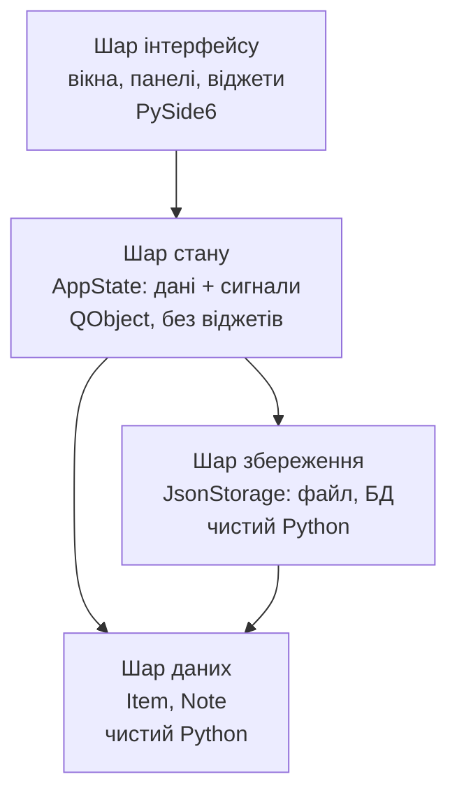
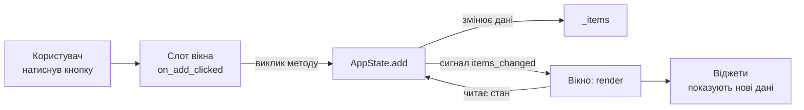
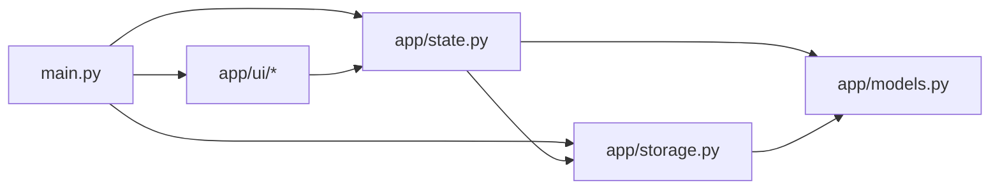

# 14. (Л) Керування станом та структура проєкту

## Зміст лекції

1. Проблема: вікно, яке знає все
2. Що таке «стан застосунку»
3. Три шари застосунку
4. Правило залежностей
5. Шар даних: моделі
6. Центральний стан: клас-сховище
7. Односпрямований потік даних
8. Виділення — теж стан
9. Похідний стан: не зберігати те, що можна обчислити
10. Рендер: як вікно перемальовується зі стану
11. Шар збереження
12. Структура каталогів проєкту
13. Імпорти та точка збірки
14. Панелі: два способи під'єднати компонент до стану
15. Тестування логіки без інтерфейсу
16. Збірка: застосунок «Notes» по файлах
17. Типові помилки
18. Підсумок

## Модуль 2: від віджетів до застосунку

Перший модуль був про **інструменти**: віджети, компонування, вікно, меню, діалоги, сигнали. Кожна лекція давала новий елемент, і кожен приклад містився в одному файлі — від тридцяти до трьохсот рядків.

Другий модуль — про **архітектуру**: як з цих елементів зібрати застосунок, який не розвалиться на п'ятсот першому рядку. Теми модуля:

| Заняття | Тема |
|---|---|
| 14 | Керування станом та структура проєкту |
| 16 | Багатовіконні застосунки, передавання даних між вікнами |
| 18 | Модель–представлення (Model/View), основи MVC |
| 20 | Багатопоточність у PySide6 |
| 22 | Обробка помилок, налаштування застосунку |
| 24 | Пакування та розгортання через PyInstaller |

Усе це спирається на одну ідею, з якої ми й починаємо: **дані застосунку не повинні жити у віджетах**.

## Проблема: вікно, яке знає все

Подивимось на типовий приклад із першого модуля — список покупок. Він працює. Запустіть його.

```python
import sys

from PySide6.QtWidgets import (
    QApplication,
    QHBoxLayout,
    QLabel,
    QLineEdit,
    QListWidget,
    QPushButton,
    QVBoxLayout,
    QWidget,
)


class ShoppingWindowBad(QWidget):
    """Стан застосунку зберігається у віджетах. Так робити не треба."""

    def __init__(self):
        super().__init__()

        self.setWindowTitle("Shopping list - state in widgets")

        self.name_edit = QLineEdit()
        self.name_edit.setPlaceholderText("Item name")

        self.add_button = QPushButton("Add")
        self.buy_button = QPushButton("Mark as bought")
        self.list_widget = QListWidget()
        self.summary = QLabel()

        self.add_button.clicked.connect(self.on_add)
        self.name_edit.returnPressed.connect(self.on_add)
        self.buy_button.clicked.connect(self.on_buy)

        top = QHBoxLayout()
        top.addWidget(self.name_edit)
        top.addWidget(self.add_button)

        layout = QVBoxLayout(self)
        layout.addLayout(top)
        layout.addWidget(self.list_widget)
        layout.addWidget(self.buy_button)
        layout.addWidget(self.summary)

        self.update_summary()

    def on_add(self):
        name = self.name_edit.text().strip()
        if not name:
            return

        self.list_widget.addItem(f"[ ] {name}")     # дані стають текстом
        self.name_edit.clear()
        self.update_summary()

    def on_buy(self):
        item = self.list_widget.currentItem()
        if item is None:
            return

        text = item.text()
        if text.startswith("[x] "):
            return

        item.setText("[x] " + text[4:])             # текст доводиться різати
        self.update_summary()

    def update_summary(self):
        total = self.list_widget.count()
        bought = 0
        for row in range(total):
            if self.list_widget.item(row).text().startswith("[x] "):
                bought += 1                          # і парсити назад

        self.summary.setText(f"Total: {total}, bought: {bought}")


def main():
    app = QApplication(sys.argv)

    window = ShoppingWindowBad()
    window.resize(380, 320)
    window.show()

    sys.exit(app.exec())


if __name__ == "__main__":
    main()
```

Програма робоча, тридцять рядків логіки. А тепер спробуйте додати до неї хоч щось:

1. **Зберегти список у файл.** Треба обійти `QListWidget`, у кожного рядка відрізати `[x] ` або `[ ] ` і здогадатись, де назва, а де позначка.
2. **Змінити вигляд** — замість `[x] ` показувати галочку. Ламається `text[4:]`, ламається `startswith`, ламається підрахунок.
3. **Дозволити назву, яка починається з `[x] `.** Застосунок починає брехати.
4. **Додати друге вікно** зі статистикою. Воно мусить лізти в `list_widget` чужого вікна.
5. **Перевірити логіку тестом.** Неможливо: щоб порахувати куплені товари, треба запустити графічний застосунок.

Причина всіх п'яти проблем одна: **`QListWidget` став базою даних**. Віджет — це спосіб *показати* дані; тут він єдине місце, де вони існують. Формат зберігання злився з форматом відображення, і тепер їх не роз'єднати.

!!! danger "Ознака, що стан живе у віджетах"
    Якщо у коді є `.text()`, результат якого розбирають (`split`, `startswith`, `[4:]`, `int(...)`), щоб дізнатись **дані** — стан зберігається у віджеті. Віджет треба питати тільки про те, що ввів користувач *просто зараз*; усе інше має бути в окремому об'єкті.

## Що таке «стан застосунку»

**Стан** — це всі дані, які визначають, що зараз показує інтерфейс.

У списку покупок стан — це:

- перелік товарів (назва + чи куплений);
- який товар зараз виділений;
- чи є незбережені зміни.

Стан ділять на дві частини:

| Вид | Приклади | Де зберігати |
|---|---|---|
| **Стан застосунку** | список товарів, поточний файл, налаштування, виділений елемент | в окремому об'єкті-сховищі |
| **Стан віджета** | позиція курсора в полі, прокрутка списку, ширина колонки, чи розгорнута гілка дерева | у самому віджеті — це його справа |

Плутати їх не можна, але й перебільшувати теж: скільки пікселів прокручено — застосунку байдуже, і тягнути це в сховище безглуздо.

!!! note "Єдине джерело істини"
    Головне правило: у кожного факту про застосунок є **рівно одне** місце зберігання. Не «у списку й у мітці», не «у полі й у змінній» — одне. Усе інше — це *відображення* цього факту, яке щоразу обчислюється заново.

## Три шари застосунку

Розділимо код на шари. Кожен шар відповідає за одне.



Стрілка означає «знає про», тобто «імпортує».

**Шар даних (моделі).** Прості класи, які описують предметну область: `Item`, `Note`, `Order`. Жодних імпортів із PySide6. Такий клас можна створити, порівняти, вивести в консоль.

**Шар стану.** Один об'єкт, який тримає всі моделі, дає методи для їх зміни й **сигналить** про кожну зміну. Успадковує `QObject` заради сигналів, але не містить жодного віджета.

**Шар збереження.** Читає й пише дані: JSON-файл, SQLite, мережа. Знає про моделі й нічого більше.

**Шар інтерфейсу.** Вікна й панелі. Читають стан, показують його, викликають методи стану у відповідь на дії користувача. Своїх даних не тримають.

## Правило залежностей

> **Інтерфейс знає про логіку. Логіка не знає про інтерфейс.**

Практична перевірка: у файлах шару стану, даних і збереження **не має бути рядка `from PySide6.QtWidgets import ...`**. Імпорт `QtCore` (заради `QObject` і `Signal`) допустимий; імпорт віджетів — ні.

```python
# state.py
from PySide6.QtCore import QObject, Signal    # можна: сигнали
from PySide6.QtWidgets import QMessageBox     # НЕ МОЖНА: логіка не показує вікон
```

Що дає це правило:

- логіку можна запустити й перевірити без графічного інтерфейсу;
- один і той самий стан обслуговує кілька вікон одночасно;
- переробка інтерфейсу не чіпає логіку, і навпаки;
- імпорти не утворюють кола — про це в розділі про структуру каталогів.

А як тоді логіка повідомить про помилку, якщо їй не можна показати `QMessageBox`? Так само, як `Countdown` із [лекції 13](/ua/courses/programming-3sem/module1/13-signals-slots-lecture/) повідомляв про тік: **сигналом**. Логіка надсилає `error_occurred("File not found")`, а вирішує, показати діалог чи написати в рядок стану, той шар, який за це відповідає.

## Шар даних: моделі

Товар зі списку покупок — це не рядок `"[x] Milk"`, а об'єкт із двома полями. Найзручніший спосіб оголосити такий клас — `dataclass`.

```python
from dataclasses import dataclass


@dataclass
class Item:
    id: int
    name: str
    bought: bool = False
```

`@dataclass` безкоштовно дає `__init__`, `__repr__` і `__eq__`:

```python
item = Item(id=1, name="Milk")
print(item)                       # Item(id=1, name='Milk', bought=False)
print(item == Item(1, "Milk"))    # True
```

### Навіщо полю `id`

Здається зайвим: можна ж посилатись на елемент за його позицією в списку. Не можна — позиція змінюється. Видалили перший товар — і всі наступні «переїхали»; відсортували список — виділення показує не на той рядок.

`id` — це стабільне ім'я об'єкта, яке не залежить ані від порядку, ані від назви. Саме `id` передають між шарами: віджет списку зберігає `id` у своєму елементі, стан шукає товар за `id`, файл зберігає `id`.

### Методи в моделі

Модель — не обов'язково «мішок полів». Дрібна логіка, яка стосується лише цього об'єкта, живе в ньому:

```python
from dataclasses import dataclass


@dataclass
class Item:
    id: int
    name: str
    bought: bool = False

    def display_name(self):
        """Як показати товар користувачеві. Формат - справа моделі."""
        mark = "x" if self.bought else " "
        return f"[{mark}] {self.name}"

    def to_dict(self):
        """Для збереження у JSON."""
        return {"id": self.id, "name": self.name, "bought": self.bought}

    @staticmethod
    def from_dict(data):
        """Зворотне перетворення. Відсутні ключі - значення за замовчуванням."""
        return Item(
            id=int(data["id"]),
            name=str(data.get("name", "")),
            bought=bool(data.get("bought", False)),
        )
```

Тепер формат відображення описаний в **одному** місці. Змінити `[x]` на щось інше — це правка одного рядка, і вона не зачіпає ані підрахунок куплених, ані збереження у файл.

## Центральний стан: клас-сховище

Тепер головний клас модуля. Він тримає всі дані застосунку і надсилає сигнал щоразу, коли вони змінюються.

```python
from PySide6.QtCore import QObject, Signal


class ShoppingState(QObject):
    """Центральний стан застосунку. Про віджети не знає нічого."""

    items_changed = Signal()              # склад або вміст списку змінився

    def __init__(self, parent=None):
        super().__init__(parent)

        self._items = []                  # список Item - приватний
        self._next_id = 1

    # --- читання ---

    def items(self):
        return tuple(self._items)         # копія: ззовні список не зіпсують

    def find(self, item_id):
        for item in self._items:
            if item.id == item_id:
                return item
        return None

    # --- зміна ---

    def add(self, name):
        name = name.strip()
        if not name:
            return None

        item = Item(id=self._next_id, name=name)
        self._next_id += 1
        self._items.append(item)

        self.items_changed.emit()
        return item.id

    def set_bought(self, item_id, bought):
        item = self.find(item_id)
        if item is None or item.bought == bought:
            return                        # нічого не змінилось - сигналу немає

        item.bought = bought
        self.items_changed.emit()

    def remove(self, item_id):
        item = self.find(item_id)
        if item is None:
            return

        self._items.remove(item)
        self.items_changed.emit()
```

Розберемо чотири рішення, ухвалені в цьому класі.

**1. Дані приватні.** `self._items` із підкресленням. Ззовні до списку не дотягуються — інакше хтось зробить `state.items.append(...)`, сигнал не надішлеться, і половина інтерфейсу залишиться зі старими даними. Метод `items()` віддає `tuple`: його не можна змінити навіть випадково.

**2. Кожна зміна проходить через метод.** `add`, `set_bought`, `remove` — це повний перелік того, що взагалі може статися з даними. Шукати, «звідки взявся цей товар», є де.

**3. Перевірка перед сигналом.** У `set_bought` є рядок `if item.bought == bought: return`. Без нього повторне натискання кнопки перебудовує весь інтерфейс дарма, а в двосторонніх зв'язках дає нескінченну петлю (пам'ятаєте `QSignalBlocker` із лекції 13?). Правило: **сигнал надсилають лише тоді, коли значення справді змінилось**.

**4. Валідація тут, а не у вікні.** `name.strip()` і перевірка на порожній рядок — у стані. Якби вони були у вікні, то друге вікно (або тест, або імпорт із файлу) змогло б додати порожній товар в обхід перевірки.

### Скільки сигналів потрібно

Найпростіший варіант — один сигнал `changed` на весь стан: «щось змінилось, перемалюйте все». Для сотні елементів цього цілком достатньо, і починати варто саме так.

Коли перемальовування стає помітним, сигнали дроблять:

```python
class ShoppingState(QObject):
    items_changed = Signal()          # список перебудувався: додали / видалили
    item_updated = Signal(int)        # змінився один товар, ось його id
    selection_changed = Signal(int)   # виділили інший рядок
    error_occurred = Signal(str)      # логіка не змогла виконати дію
```

Тоді вікно перебудовує весь список тільки на `items_changed`, а на `item_updated` оновлює єдиний рядок.

!!! tip "Не починайте з десяти сигналів"
    Один сигнал `changed` і повне перемальовування — правильний старт. Дробити варто тоді, коли ви бачите гальмування або мерехтіння, а не «про всяк випадок».

## Односпрямований потік даних

Тепер найважливіша схема лекції. Дані рухаються по колу **в один бік**:



Читається так:

1. Користувач щось робить — спрацьовує сигнал віджета.
2. Слот вікна **не змінює віджети**. Він викликає метод стану.
3. Стан змінює дані й надсилає сигнал.
4. Вікно за сигналом **перечитує стан** і перемальовує себе.

Ключовий момент — крок 2. Спокуса велика: користувач натиснув «Add», давайте одразу `self.list_widget.addItem(...)`. Не треба. Віджет оновлюється **тільки** у відповідь на сигнал стану, і тільки з даних стану.

Що це дає:

- **Немає розсинхронізації.** Неможливо додати товар у список і забути оновити лічильник — обидва оновлюються з одного джерела.
- **Кілька вікон працюють задарма.** Друге вікно підписується на той самий сигнал і показує ті самі дані. Нічого дописувати не треба.
- **Дію легко відтворити з коду.** `state.add("Milk")` зі скрипта дає рівно той самий результат, що й натискання кнопки.

Порівняйте два варіанти одного слота:

```python
# НЕПРАВИЛЬНО: слот змінює і дані, і віджети
def on_add_clicked(self):
    name = self.name_edit.text()
    self.state.add(name)
    self.list_widget.addItem(name)              # дублювання логіки показу
    self.summary.setText(...)                   # і про це теж не забути
    self.name_edit.clear()

# ПРАВИЛЬНО: слот лише передає намір
def on_add_clicked(self):
    self.state.add(self.name_edit.text())       # решта станеться сама
    self.name_edit.clear()
```

У другому варіанті `list_widget` і `summary` оновляться, бо вікно підписане на `items_changed`. І оновляться однаково — хто б не викликав `add`: кнопка, `Enter` у полі, пункт меню чи завантаження файлу.

## Виділення — теж стан

Поширена помилка — вважати виділений рядок справою `QListWidget`. Але від виділення залежить, які кнопки активні, що показує панель праворуч, що видалить `Delete`. Це **стан застосунку**.

```python
class ShoppingState(QObject):
    items_changed = Signal()
    selection_changed = Signal(int)       # -1 означає "нічого не вибрано"

    def __init__(self, parent=None):
        super().__init__(parent)

        self._items = []
        self._next_id = 1
        self._selected_id = -1

    def selected_id(self):
        return self._selected_id

    def selected_item(self):
        return self.find(self._selected_id)

    def select(self, item_id):
        if item_id == self._selected_id:
            return

        self._selected_id = item_id
        self.selection_changed.emit(item_id)
```

Зауважте, що при видаленні товару виділення теж треба полагодити — інакше стан посилатиметься на неіснуючий `id`:

```python
    def remove(self, item_id):
        item = self.find(item_id)
        if item is None:
            return

        self._items.remove(item)

        if self._selected_id == item_id:
            self.select(-1)               # спершу знімаємо виділення

        self.items_changed.emit()
```

`QListWidget` при цьому зберігає **не сам стан, а посилання на нього**: у кожному елементі списку лежить `id` товару.

```python
from PySide6.QtCore import Qt
from PySide6.QtWidgets import QListWidgetItem

widget_item = QListWidgetItem(item.display_name())
widget_item.setData(Qt.ItemDataRole.UserRole, item.id)      # кладемо id
...
item_id = widget_item.data(Qt.ItemDataRole.UserRole)        # дістаємо id
```

`Qt.ItemDataRole.UserRole` — «кишеня» для власних даних у елементі списку, таблиці чи дерева. Туди кладуть **ідентифікатор**, а не копію об'єкта: копія розсинхронізується зі станом, ідентифікатор — ні.

## Похідний стан: не зберігати те, що можна обчислити

Скільки товарів куплено? Спокуса — завести поле `self._bought_count` і підтримувати його в кожному методі. Не треба: рано чи пізно якийсь шлях виконання його не оновить, і лічильник почне брехати.

**Похідний стан обчислюють на льоту:**

```python
    def total_count(self):
        return len(self._items)

    def bought_count(self):
        return sum(1 for item in self._items if item.bought)

    def pending_items(self):
        return tuple(item for item in self._items if not item.bought)

    def is_complete(self):
        return bool(self._items) and self.bought_count() == self.total_count()
```

Кешувати такі значення має сенс лише тоді, коли обчислення справді дороге (десятки тисяч елементів, робота з файлами) — і тоді кеш скидають у тому самому місці, де змінюють дані.

!!! note "Правило"
    Зберігайте **мінімальний** набір фактів. Усе, що виводиться з нього однією формулою, — обчислюйте. Кожне збережене похідне значення — це ще одне місце, яке може розсинхронізуватись.

## Рендер: як вікно перемальовується зі стану

У вікні з'являється метод, який приводить віджети у відповідність до стану. Традиційно його називають `render` або `_update_view`.

```python
    def render(self):
        """Привести віджети у відповідність до стану. Стан не змінює."""
        self.list_widget.clear()

        for item in self.state.items():
            widget_item = QListWidgetItem(item.display_name())
            widget_item.setData(Qt.ItemDataRole.UserRole, item.id)
            self.list_widget.addItem(widget_item)

        total = self.state.total_count()
        bought = self.state.bought_count()
        self.summary.setText(f"Total: {total}, bought: {bought}")
```

Дві вимоги до `render`:

1. **Він нічого не змінює у стані.** Тільки читає. Інакше перемальовування спричинить новий сигнал, а той — нове перемальовування.
2. **Він працює з будь-якого стану.** Не «додати рядок до наявних», а «побудувати список заново». Тоді неважливо, що саме змінилось.

Виникає та сама пастка, що й у лекції 13: `list_widget.clear()` і `addItem()` змінюють виділення, а віджет надсилає `currentRowChanged`. Слот цього сигналу викличе `state.select(...)` — і ми отримаємо зміну стану посеред перемальовування. Захист відомий:

```python
from PySide6.QtCore import QSignalBlocker

    def render(self):
        with QSignalBlocker(self.list_widget):     # тимчасово німий
            self.list_widget.clear()
            ...
        self.render_selection()                     # виділення - окремо
```

### Повний приклад

Той самий список покупок, але зі станом, винесеним з віджетів. Файл усе ще один — розділення шарів по файлах буде далі.

```python
import sys
from dataclasses import dataclass

from PySide6.QtCore import QObject, QSignalBlocker, Qt, Signal, Slot
from PySide6.QtWidgets import (
    QApplication,
    QHBoxLayout,
    QLabel,
    QLineEdit,
    QListWidget,
    QListWidgetItem,
    QPushButton,
    QVBoxLayout,
    QWidget,
)


# ---------------------------------------------------------------- шар даних


@dataclass
class Item:
    id: int
    name: str
    bought: bool = False

    def display_name(self):
        mark = "x" if self.bought else " "
        return f"[{mark}] {self.name}"


# ---------------------------------------------------------------- шар стану


class ShoppingState(QObject):
    """Єдине джерело істини. Жодного імпорту з QtWidgets."""

    items_changed = Signal()
    selection_changed = Signal(int)
    error_occurred = Signal(str)

    def __init__(self, parent=None):
        super().__init__(parent)

        self._items = []
        self._next_id = 1
        self._selected_id = -1

    # читання

    def items(self):
        return tuple(self._items)

    def find(self, item_id):
        for item in self._items:
            if item.id == item_id:
                return item
        return None

    def selected_id(self):
        return self._selected_id

    def selected_item(self):
        return self.find(self._selected_id)

    def total_count(self):
        return len(self._items)

    def bought_count(self):
        return sum(1 for item in self._items if item.bought)

    # зміна

    def add(self, name):
        name = name.strip()
        if not name:
            self.error_occurred.emit("Item name cannot be empty")
            return None

        item = Item(id=self._next_id, name=name)
        self._next_id += 1
        self._items.append(item)

        self.items_changed.emit()
        return item.id

    def set_bought(self, item_id, bought):
        item = self.find(item_id)
        if item is None or item.bought == bought:
            return

        item.bought = bought
        self.items_changed.emit()

    def toggle_bought(self, item_id):
        item = self.find(item_id)
        if item is not None:
            self.set_bought(item_id, not item.bought)

    def remove(self, item_id):
        item = self.find(item_id)
        if item is None:
            return

        self._items.remove(item)

        if self._selected_id == item_id:
            self.select(-1)

        self.items_changed.emit()

    def select(self, item_id):
        if item_id == self._selected_id:
            return

        self._selected_id = item_id
        self.selection_changed.emit(item_id)


# ----------------------------------------------------------- шар інтерфейсу


class ShoppingWindow(QWidget):
    """Показує стан і передає йому наміри користувача. Даних не тримає."""

    def __init__(self, state, parent=None):
        super().__init__(parent)

        self.state = state
        self.setWindowTitle("Shopping list - central state")

        self._build_ui()
        self._connect()

        self.render()
        self.render_selection()

    def _build_ui(self):
        self.name_edit = QLineEdit()
        self.name_edit.setPlaceholderText("Item name")

        self.add_button = QPushButton("Add")
        self.toggle_button = QPushButton("Toggle bought")
        self.remove_button = QPushButton("Remove")
        self.list_widget = QListWidget()
        self.summary = QLabel()
        self.status = QLabel()
        self.status.setStyleSheet("color: #c92a2a;")

        top = QHBoxLayout()
        top.addWidget(self.name_edit)
        top.addWidget(self.add_button)

        buttons = QHBoxLayout()
        buttons.addWidget(self.toggle_button)
        buttons.addWidget(self.remove_button)

        layout = QVBoxLayout(self)
        layout.addLayout(top)
        layout.addWidget(self.list_widget)
        layout.addLayout(buttons)
        layout.addWidget(self.summary)
        layout.addWidget(self.status)

    def _connect(self):
        # знизу вгору: дії користувача -> методи стану
        self.add_button.clicked.connect(self.on_add_clicked)
        self.name_edit.returnPressed.connect(self.on_add_clicked)
        self.toggle_button.clicked.connect(self.on_toggle_clicked)
        self.remove_button.clicked.connect(self.on_remove_clicked)
        self.list_widget.currentItemChanged.connect(self.on_current_item_changed)

        # згори вниз: сигнали стану -> перемальовування
        self.state.items_changed.connect(self.render)
        self.state.selection_changed.connect(self.render_selection)
        self.state.error_occurred.connect(self.on_error)

    # --- наміри користувача ---

    @Slot()
    def on_add_clicked(self):
        self.status.clear()
        if self.state.add(self.name_edit.text()) is not None:
            self.name_edit.clear()

    @Slot()
    def on_toggle_clicked(self):
        self.state.toggle_bought(self.state.selected_id())

    @Slot()
    def on_remove_clicked(self):
        self.state.remove(self.state.selected_id())

    def on_current_item_changed(self, current, previous):
        if current is None:
            self.state.select(-1)
        else:
            self.state.select(current.data(Qt.ItemDataRole.UserRole))

    @Slot(str)
    def on_error(self, message):
        self.status.setText(message)

    # --- перемальовування ---

    @Slot()
    def render(self):
        with QSignalBlocker(self.list_widget):
            self.list_widget.clear()

            for item in self.state.items():
                widget_item = QListWidgetItem(item.display_name())
                widget_item.setData(Qt.ItemDataRole.UserRole, item.id)
                self.list_widget.addItem(widget_item)

        self.summary.setText(
            f"Total: {self.state.total_count()}, bought: {self.state.bought_count()}"
        )
        self.render_selection()

    def render_selection(self):
        selected_id = self.state.selected_id()

        with QSignalBlocker(self.list_widget):
            self.list_widget.setCurrentRow(-1)
            for row in range(self.list_widget.count()):
                widget_item = self.list_widget.item(row)
                if widget_item.data(Qt.ItemDataRole.UserRole) == selected_id:
                    self.list_widget.setCurrentRow(row)
                    break

        has_selection = self.state.selected_item() is not None
        self.toggle_button.setEnabled(has_selection)
        self.remove_button.setEnabled(has_selection)


def main():
    app = QApplication(sys.argv)

    state = ShoppingState()
    state.add("Milk")
    state.add("Bread")
    state.add("Coffee")
    state.set_bought(2, True)

    window = ShoppingWindow(state)
    window.resize(420, 380)
    window.show()

    sys.exit(app.exec())


if __name__ == "__main__":
    main()
```

Зверніть увагу на три речі:

1. **`main()` наповнює список без жодного віджета.** `state.add("Milk")` викликається ще до створення вікна — і вікно показує ці товари, бо `render()` при старті читає стан.
2. **Вікно отримує стан ззовні** (`ShoppingWindow(state)`), а не створює його. Це називають *ін'єкцією залежності*: вікно не вирішує, звідки взявся стан, а отже, працює з будь-яким — зокрема з підготовленим для тесту.
3. **Кнопки вмикаються в `render_selection`**, а не в слоті виділення. Стан змінився — інтерфейс перерахував себе повністю; окремої гілки «а тепер вимкнути кнопку» немає.

## Шар збереження

Стан живе в пам'яті. Щоб він пережив закриття застосунку, потрібен окремий об'єкт, який уміє записати дані у файл і прочитати їх назад.

Чому не покласти `json.dump` просто в `AppState`? Тому що спосіб зберігання змінюється: сьогодні JSON, завтра SQLite, післязавтра сервер. Якщо він схований за окремим класом, стан цього навіть не помітить.

```python
import json
from pathlib import Path


class JsonStorage:
    """Читає й пише список Item у JSON-файл. Про стан і віджети не знає."""

    def __init__(self, path):
        self._path = Path(path)

    def load(self):
        if not self._path.exists():
            return []

        try:
            raw = json.loads(self._path.read_text(encoding="utf-8"))
        except (OSError, json.JSONDecodeError) as error:
            raise StorageError(f"Cannot read {self._path}: {error}") from error

        if not isinstance(raw, list):
            raise StorageError(f"Unexpected file format in {self._path}")

        return [Item.from_dict(record) for record in raw]

    def save(self, items):
        data = [item.to_dict() for item in items]
        text = json.dumps(data, ensure_ascii=False, indent=2)

        try:
            self._path.write_text(text, encoding="utf-8")
        except OSError as error:
            raise StorageError(f"Cannot write {self._path}: {error}") from error


class StorageError(Exception):
    """Помилка збереження, зрозуміла верхнім шарам."""
```

Власний тип винятку — не формальність. Верхній шар не має ловити `json.JSONDecodeError`: це деталь того, що всередині саме JSON. Він ловить `StorageError` — і залишиться правим, коли всередині буде SQLite.

Стан користується сховищем, але помилки перетворює на сигнал:

```python
    def load(self):
        try:
            self._items = list(self._storage.load())
        except StorageError as error:
            self._items = []
            self.error_occurred.emit(str(error))
            return

        self._next_id = max((item.id for item in self._items), default=0) + 1
        self.select(-1)
        self.items_changed.emit()

    def save(self):
        try:
            self._storage.save(self._items)
        except StorageError as error:
            self.error_occurred.emit(str(error))
            return False

        self.set_dirty(False)
        return True
```

Рядок `self._next_id = max(...) + 1` обов'язковий: без нього після завантаження нові товари отримають ті самі `id`, що вже є у файлі.

!!! warning "Не зберігайте на кожне натискання клавіші"
    Запис у файл на кожен `textChanged` — це десятки записів на секунду й підвішений інтерфейс. Позначайте стан як «змінений» (прапорець `dirty`) і зберігайте за командою `Ctrl+S`, при закритті вікна або за таймером.

## Структура каталогів проєкту

Поки застосунок тримається в межах двохсот рядків, один файл — нормально. Далі його розрізають, і межі розрізу вже відомі: це шари.

```text
notes/
├── main.py                 <- точка входу, запуск
├── notes.json              <- дані (створюється застосунком)
└── app/
    ├── __init__.py         <- робить каталог пакетом
    ├── models.py           <- шар даних:   Note
    ├── storage.py          <- шар збереження: JsonStorage, StorageError
    ├── state.py            <- шар стану:   AppState
    └── ui/
        ├── __init__.py
        ├── main_window.py  <- головне вікно
        ├── note_list_panel.py
        └── note_editor_panel.py
```

Правила, за якими це розрізано:

- **Один файл — один шар або одне вікно.** `state.py` не містить віджетів, `main_window.py` не містить логіки.
- **Каталог `ui/` — межа.** Усе, що імпортує `QtWidgets`, лежить усередині; усе, що ні, — зовні.
- **`main.py` не містить класів.** Лише збирає застосунок докупи.
- **Порожній `__init__.py`** робить каталог пакетом, з якого можна імпортувати. Він може бути й справді порожнім.

Файл `models.py` не імпортує нічого зі свого проєкту. `storage.py` імпортує `models`. `state.py` імпортує `models` і `storage`. `ui/` імпортує все. Стрілки завжди дивляться в один бік — тому кільцевих імпортів (`ImportError: cannot import name ... (most likely due to a circular import)`) тут не буває за побудовою.



!!! tip "Коли розрізати"
    Не робіть вісім файлів заради застосунку на сто рядків. Розумний момент для розрізу — коли файл переходить за 300–400 рядків або коли в ньому з'являється другий клас-вікно.

## Імпорти та точка збірки

Усередині пакета користуються **відносними** імпортами — з крапкою:

```python
# app/state.py
from .models import Note              # . = поточний пакет app
from .storage import JsonStorage, StorageError

# app/ui/main_window.py
from ..state import AppState          # .. = пакет на рівень вище
from .note_list_panel import NoteListPanel
```

У `main.py`, який лежить поза пакетом, — звичайні абсолютні:

```python
from app.state import AppState
from app.storage import JsonStorage
from app.ui.main_window import MainWindow
```

Запуск:

```bash
cd notes
python3 main.py
```

Робочий каталог має бути коренем проєкту — саме там Python шукає пакет `app`.

### Точка збірки

`main.py` — єдине місце, де всі шари зустрічаються. Його називають *точкою збірки* (composition root):

```python
import sys

from PySide6.QtWidgets import QApplication

from app.state import AppState
from app.storage import JsonStorage
from app.ui.main_window import MainWindow


def main():
    app = QApplication(sys.argv)
    app.setApplicationName("Notes")

    storage = JsonStorage("notes.json")     # 1. створили сховище
    state = AppState(storage)               # 2. віддали його стану
    state.load()                            # 3. завантажили дані

    window = MainWindow(state)              # 4. віддали стан вікну
    window.resize(860, 520)
    window.show()

    sys.exit(app.exec())


if __name__ == "__main__":
    main()
```

Ніхто, крім `main.py`, не знає, що файл називається `notes.json`. Замінити його на `~/.config/notes/data.json` — правка одного рядка; підставити фальшиве сховище в тесті — теж.

!!! note "Залежності передають, а не створюють"
    `AppState` не пише `self._storage = JsonStorage("notes.json")` всередині себе. Він **приймає** сховище аргументом. Те саме з вікном і станом. Об'єкт, який сам створює свої залежності, неможливо ані перевикористати, ані протестувати.

## Панелі: два способи під'єднати компонент до стану

Коли вікно розбите на панелі, постає питання: чи має панель бачити стан?

**Варіант А — панель нічого не знає про стан.** Вона надсилає сигнали вгору й має методи для оновлення, а зв'язує все головне вікно. Це правило «угору — сигналом, униз — викликом методу» з лекції 13.

```python
class NoteListPanel(QWidget):
    note_selected = Signal(int)
    add_requested = Signal()

    def set_notes(self, notes):
        ...
```

**Варіант Б — панель отримує стан і сама на нього підписується.**

```python
class NoteListPanel(QWidget):
    def __init__(self, state, parent=None):
        super().__init__(parent)
        self.state = state
        self.state.notes_changed.connect(self.render)
```

| | Варіант А | Варіант Б |
|---|---|---|
| Перевикористання | панель придатна для будь-якого проєкту | прив'язана до цього застосунку |
| Код у головному вікні | багато «проводки» | майже немає |
| Кількість учасників | усе видно в одному місці | зв'язки розкидані по панелях |
| Для чого | універсальні віджети (`RatingWidget`, `SearchBar`) | панелі конкретного застосунку |

Практичний компроміс, якого дотримуємось далі: **універсальні віджети — за варіантом А, панелі застосунку — за варіантом Б**. Панель `NoteListPanel` не має сенсу поза застосунком «Notes», тож ховати від неї стан немає навіщо.

## Тестування логіки без інтерфейсу

Головна практична вигода відокремлення: логіку можна запустити без вікон. `QObject` і сигнали працюють **без `QApplication`** — графічний застосунок для цього не потрібен.

```python
"""Перевірка логіки стану без графічного інтерфейсу.
Запуск: python3 check_state.py
"""

from dataclasses import dataclass

from PySide6.QtCore import QObject, Signal


@dataclass
class Item:
    id: int
    name: str
    bought: bool = False


class ShoppingState(QObject):
    items_changed = Signal()

    def __init__(self, parent=None):
        super().__init__(parent)

        self._items = []
        self._next_id = 1

    def items(self):
        return tuple(self._items)

    def find(self, item_id):
        for item in self._items:
            if item.id == item_id:
                return item
        return None

    def add(self, name):
        name = name.strip()
        if not name:
            return None

        item = Item(id=self._next_id, name=name)
        self._next_id += 1
        self._items.append(item)
        self.items_changed.emit()
        return item.id

    def set_bought(self, item_id, bought):
        item = self.find(item_id)
        if item is None or item.bought == bought:
            return

        item.bought = bought
        self.items_changed.emit()

    def bought_count(self):
        return sum(1 for item in self._items if item.bought)


def check_add():
    state = ShoppingState()
    item_id = state.add("Milk")

    assert item_id == 1
    assert len(state.items()) == 1
    assert state.items()[0].name == "Milk"


def check_empty_name_rejected():
    state = ShoppingState()

    assert state.add("   ") is None
    assert len(state.items()) == 0


def check_signal_is_emitted_once():
    state = ShoppingState()
    calls = []
    state.items_changed.connect(lambda: calls.append(1))

    item_id = state.add("Bread")
    state.set_bought(item_id, True)
    state.set_bought(item_id, True)      # без змін - сигналу бути не повинно

    assert len(calls) == 2, f"expected 2 signals, got {len(calls)}"
    assert state.bought_count() == 1


def main():
    checks = [check_add, check_empty_name_rejected, check_signal_is_emitted_once]

    for check in checks:
        check()
        print(f"OK: {check.__name__}")

    print(f"{len(checks)} checks passed")


if __name__ == "__main__":
    main()
```

Запустіть — застосунок не відкриється, у терміналі з'явиться:

```text
OK: check_add
OK: check_empty_name_rejected
OK: check_signal_is_emitted_once
3 checks passed
```

Особливо цінна третя перевірка: вона фіксує, що повторний `set_bought` із тим самим значенням **не** надсилає сигнал. Такі речі неможливо перевірити клацанням мишею, а саме вони спричиняють мерехтіння інтерфейсу й нескінченні петлі.

!!! tip "Той самий код під `pytest`"
    Якщо перейменувати функції на `test_*`, покласти файл як `test_state.py` і виконати `pytest`, усе запрацює без жодної правки. Спеціальних бібліотек для перевірки шару стану не потрібно — саме тому його й тримають вільним від віджетів.

## Збірка: застосунок «Notes» по файлах

Зберемо все разом. Застосунок для нотаток: список ліворуч, редактор праворуч, збереження у JSON, позначка незбережених змін у заголовку.

Створіть каталоги й файли точно за структурою:

```text
notes/
├── main.py
└── app/
    ├── __init__.py
    ├── models.py
    ├── storage.py
    ├── state.py
    └── ui/
        ├── __init__.py
        ├── main_window.py
        ├── note_list_panel.py
        └── note_editor_panel.py
```

Обидва файли `__init__.py` — **порожні**.

### `app/models.py`

```python
"""Шар даних. Жодних імпортів з PySide6."""

from dataclasses import dataclass
from datetime import datetime


@dataclass
class Note:
    id: int
    title: str = ""
    body: str = ""
    updated_at: str = ""

    def display_title(self):
        """Як нотатка виглядає в списку."""
        title = self.title.strip()
        return title if title else "Untitled"

    def touch(self):
        """Запам'ятати час останньої зміни."""
        self.updated_at = datetime.now().isoformat(sep=" ", timespec="seconds")

    def to_dict(self):
        return {
            "id": self.id,
            "title": self.title,
            "body": self.body,
            "updated_at": self.updated_at,
        }

    @staticmethod
    def from_dict(data):
        return Note(
            id=int(data["id"]),
            title=str(data.get("title", "")),
            body=str(data.get("body", "")),
            updated_at=str(data.get("updated_at", "")),
        )
```

### `app/storage.py`

```python
"""Шар збереження. Знає про моделі й про файл - і більше ні про що."""

import json
from pathlib import Path

from .models import Note


class StorageError(Exception):
    """Помилка читання або запису, зрозуміла верхнім шарам."""


class JsonStorage:
    def __init__(self, path):
        self._path = Path(path)

    def path(self):
        return self._path

    def load(self):
        if not self._path.exists():
            return []

        try:
            raw = json.loads(self._path.read_text(encoding="utf-8"))
        except (OSError, json.JSONDecodeError) as error:
            raise StorageError(f"Cannot read {self._path}: {error}") from error

        if not isinstance(raw, list):
            raise StorageError(f"Unexpected file format in {self._path}")

        try:
            return [Note.from_dict(record) for record in raw]
        except (KeyError, TypeError, ValueError) as error:
            raise StorageError(f"Broken record in {self._path}: {error}") from error

    def save(self, notes):
        data = [note.to_dict() for note in notes]

        try:
            self._path.write_text(
                json.dumps(data, ensure_ascii=False, indent=2),
                encoding="utf-8",
            )
        except OSError as error:
            raise StorageError(f"Cannot write {self._path}: {error}") from error
```

### `app/state.py`

```python
"""Шар стану. QtCore - можна (потрібні сигнали), QtWidgets - ні."""

from PySide6.QtCore import QObject, Signal

from .models import Note
from .storage import StorageError

NO_SELECTION = -1


class AppState(QObject):
    """Єдине джерело істини для всього застосунку."""

    notes_changed = Signal()          # список нотаток перебудувався
    note_updated = Signal(int)        # змінився вміст однієї нотатки
    selection_changed = Signal(int)   # вибрано іншу нотатку
    dirty_changed = Signal(bool)      # з'явились / зникли незбережені зміни
    error_occurred = Signal(str)      # логіка не змогла виконати дію

    def __init__(self, storage, parent=None):
        super().__init__(parent)

        self._storage = storage
        self._notes = []
        self._next_id = 1
        self._selected_id = NO_SELECTION
        self._dirty = False

    # ------------------------------------------------------------ читання

    def notes(self):
        return tuple(self._notes)

    def count(self):
        return len(self._notes)

    def find(self, note_id):
        for note in self._notes:
            if note.id == note_id:
                return note
        return None

    def selected_id(self):
        return self._selected_id

    def selected_note(self):
        return self.find(self._selected_id)

    def is_dirty(self):
        return self._dirty

    # ----------------------------------------------------------- виділення

    def select(self, note_id):
        if note_id == self._selected_id:
            return

        self._selected_id = note_id if self.find(note_id) else NO_SELECTION
        self.selection_changed.emit(self._selected_id)

    # --------------------------------------------------------------- зміна

    def add_note(self):
        note = Note(id=self._next_id)
        note.touch()

        self._next_id += 1
        self._notes.append(note)

        self._set_dirty(True)
        self.notes_changed.emit()
        self.select(note.id)

        return note.id

    def update_selected(self, title, body):
        note = self.selected_note()
        if note is None:
            return

        if note.title == title and note.body == body:
            return                        # нічого не змінилось - сигналу немає

        note.title = title
        note.body = body
        note.touch()

        self._set_dirty(True)
        self.note_updated.emit(note.id)

    def delete_selected(self):
        note = self.selected_note()
        if note is None:
            return

        self._notes.remove(note)
        self.select(NO_SELECTION)

        self._set_dirty(True)
        self.notes_changed.emit()

    # --------------------------------------------------------- збереження

    def load(self):
        try:
            self._notes = list(self._storage.load())
        except StorageError as error:
            self._notes = []
            self.error_occurred.emit(str(error))

        # нові нотатки не повинні отримати вже зайняті id
        self._next_id = max((note.id for note in self._notes), default=0) + 1

        self._selected_id = NO_SELECTION
        self._set_dirty(False)
        self.notes_changed.emit()
        self.selection_changed.emit(NO_SELECTION)

    def save(self):
        try:
            self._storage.save(self._notes)
        except StorageError as error:
            self.error_occurred.emit(str(error))
            return False

        self._set_dirty(False)
        return True

    # ------------------------------------------------------------ приватне

    def _set_dirty(self, value):
        if self._dirty == value:
            return

        self._dirty = value
        self.dirty_changed.emit(value)
```

### `app/ui/note_list_panel.py`

```python
"""Панель зі списком нотаток. Своїх даних не тримає."""

from PySide6.QtCore import QSignalBlocker, Qt
from PySide6.QtWidgets import (
    QHBoxLayout,
    QListWidget,
    QListWidgetItem,
    QPushButton,
    QVBoxLayout,
    QWidget,
)

NOTE_ID_ROLE = Qt.ItemDataRole.UserRole


class NoteListPanel(QWidget):
    def __init__(self, state, parent=None):
        super().__init__(parent)

        self.state = state

        self._build_ui()
        self._connect()
        self.render()

    def _build_ui(self):
        self.list_widget = QListWidget()
        self.add_button = QPushButton("New")
        self.delete_button = QPushButton("Delete")

        buttons = QHBoxLayout()
        buttons.addWidget(self.add_button)
        buttons.addWidget(self.delete_button)

        layout = QVBoxLayout(self)
        layout.setContentsMargins(0, 0, 0, 0)
        layout.addWidget(self.list_widget)
        layout.addLayout(buttons)

    def _connect(self):
        self.add_button.clicked.connect(self.on_add_clicked)
        self.delete_button.clicked.connect(self.on_delete_clicked)
        self.list_widget.currentItemChanged.connect(self.on_current_item_changed)

        self.state.notes_changed.connect(self.render)
        self.state.note_updated.connect(self.on_note_updated)
        self.state.selection_changed.connect(self.render_selection)

    # --- наміри користувача ---

    def on_add_clicked(self):
        self.state.add_note()

    def on_delete_clicked(self):
        self.state.delete_selected()

    def on_current_item_changed(self, current, previous):
        if current is None:
            self.state.select(-1)
        else:
            self.state.select(current.data(NOTE_ID_ROLE))

    # --- перемальовування ---

    def on_note_updated(self, note_id):
        """Змінилась одна нотатка - оновлюємо один рядок, а не весь список."""
        note = self.state.find(note_id)
        if note is None:
            return

        for row in range(self.list_widget.count()):
            widget_item = self.list_widget.item(row)
            if widget_item.data(NOTE_ID_ROLE) == note_id:
                widget_item.setText(note.display_title())
                return

    def render(self):
        with QSignalBlocker(self.list_widget):
            self.list_widget.clear()

            for note in self.state.notes():
                widget_item = QListWidgetItem(note.display_title())
                widget_item.setData(NOTE_ID_ROLE, note.id)
                self.list_widget.addItem(widget_item)

        self.render_selection()

    def render_selection(self, note_id=None):
        selected_id = self.state.selected_id()

        with QSignalBlocker(self.list_widget):
            self.list_widget.setCurrentRow(-1)

            for row in range(self.list_widget.count()):
                if self.list_widget.item(row).data(NOTE_ID_ROLE) == selected_id:
                    self.list_widget.setCurrentRow(row)
                    break

        self.delete_button.setEnabled(self.state.selected_note() is not None)
```

### `app/ui/note_editor_panel.py`

```python
"""Панель редагування вибраної нотатки."""

from PySide6.QtWidgets import (
    QFormLayout,
    QLabel,
    QLineEdit,
    QTextEdit,
    QVBoxLayout,
    QWidget,
)


class NoteEditorPanel(QWidget):
    def __init__(self, state, parent=None):
        super().__init__(parent)

        self.state = state
        self._loading = False        # True, поки віджети заповнюються зі стану

        self._build_ui()
        self._connect()
        self.render()

    def _build_ui(self):
        self.title_edit = QLineEdit()
        self.title_edit.setPlaceholderText("Note title")

        self.body_edit = QTextEdit()
        self.body_edit.setPlaceholderText("Note text")

        self.info_label = QLabel()
        self.info_label.setStyleSheet("color: gray;")

        form = QFormLayout()
        form.addRow("Title:", self.title_edit)

        layout = QVBoxLayout(self)
        layout.setContentsMargins(0, 0, 0, 0)
        layout.addLayout(form)
        layout.addWidget(self.body_edit)
        layout.addWidget(self.info_label)

    def _connect(self):
        self.title_edit.textChanged.connect(self.on_text_changed)
        self.body_edit.textChanged.connect(self.on_text_changed)

        self.state.selection_changed.connect(self.render)
        self.state.notes_changed.connect(self.render)

    def on_text_changed(self):
        if self._loading:
            return                   # це ми самі щойно вписали текст зі стану

        self.state.update_selected(
            self.title_edit.text(),
            self.body_edit.toPlainText(),
        )
        self.render_info()

    def render(self, note_id=None):
        note = self.state.selected_note()

        self._loading = True
        try:
            if note is None:
                self.title_edit.clear()
                self.body_edit.clear()
            else:
                self.title_edit.setText(note.title)
                self.body_edit.setPlainText(note.body)
        finally:
            self._loading = False    # прапорець знімається навіть при винятку

        self.title_edit.setEnabled(note is not None)
        self.body_edit.setEnabled(note is not None)
        self.render_info()

    def render_info(self):
        note = self.state.selected_note()

        if note is None:
            self.info_label.setText("No note selected")
        else:
            self.info_label.setText(f"id {note.id}   updated {note.updated_at}")
```

### `app/ui/main_window.py`

```python
"""Головне вікно: складає панелі, меню й рядок стану."""

from PySide6.QtCore import Qt
from PySide6.QtGui import QAction, QKeySequence
from PySide6.QtWidgets import (
    QLabel,
    QMainWindow,
    QMessageBox,
    QSplitter,
)

from .note_editor_panel import NoteEditorPanel
from .note_list_panel import NoteListPanel


class MainWindow(QMainWindow):
    def __init__(self, state, parent=None):
        super().__init__(parent)

        self.state = state

        self._build_ui()
        self._build_menu()
        self._connect()

        self.render_title()
        self.render_status()

    def _build_ui(self):
        self.list_panel = NoteListPanel(self.state)
        self.editor_panel = NoteEditorPanel(self.state)

        splitter = QSplitter(Qt.Orientation.Horizontal)
        splitter.addWidget(self.list_panel)
        splitter.addWidget(self.editor_panel)
        splitter.setStretchFactor(1, 1)
        splitter.setSizes([240, 620])

        self.setCentralWidget(splitter)

        self.count_label = QLabel()
        self.statusBar().addPermanentWidget(self.count_label)
        self.statusBar().showMessage("Ready")

    def _build_menu(self):
        self.new_action = QAction("&New note", self)
        self.new_action.setShortcut(QKeySequence.StandardKey.New)
        self.new_action.triggered.connect(self.on_new)

        self.save_action = QAction("&Save", self)
        self.save_action.setShortcut(QKeySequence.StandardKey.Save)
        self.save_action.triggered.connect(self.on_save)

        self.quit_action = QAction("&Quit", self)
        self.quit_action.setShortcut(QKeySequence.StandardKey.Quit)
        self.quit_action.triggered.connect(self.close)

        file_menu = self.menuBar().addMenu("&File")
        file_menu.addAction(self.new_action)
        file_menu.addAction(self.save_action)
        file_menu.addSeparator()
        file_menu.addAction(self.quit_action)

    def _connect(self):
        self.state.notes_changed.connect(self.render_status)
        self.state.notes_changed.connect(self.render_title)
        self.state.dirty_changed.connect(self.render_title)
        self.state.error_occurred.connect(self.on_error)

    # --- наміри користувача ---

    def on_new(self):
        self.state.add_note()
        self.editor_panel.title_edit.setFocus()

    def on_save(self):
        if self.state.save():
            self.statusBar().showMessage("Saved", 3000)

    def on_error(self, message):
        self.statusBar().showMessage(message, 5000)
        QMessageBox.warning(self, "Notes", message)

    # --- перемальовування ---

    def render_title(self, dirty=None):
        mark = "*" if self.state.is_dirty() else ""
        self.setWindowTitle(f"Notes{mark}")
        self.save_action.setEnabled(self.state.is_dirty())

    def render_status(self):
        self.count_label.setText(f"Notes: {self.state.count()}")

    # --- закриття ---

    def closeEvent(self, event):
        if not self.state.is_dirty():
            event.accept()
            return

        answer = QMessageBox.question(
            self,
            "Notes",
            "There are unsaved changes. Save before closing?",
            QMessageBox.StandardButton.Save
            | QMessageBox.StandardButton.Discard
            | QMessageBox.StandardButton.Cancel,
            QMessageBox.StandardButton.Save,
        )

        if answer == QMessageBox.StandardButton.Cancel:
            event.ignore()
        elif answer == QMessageBox.StandardButton.Discard:
            event.accept()
        elif self.state.save():
            event.accept()
        else:
            event.ignore()          # збереження не вдалось - не закриваємось
```

### `main.py`

```python
"""Точка збірки: тут і тільки тут шари зустрічаються."""

import sys

from PySide6.QtWidgets import QApplication

from app.state import AppState
from app.storage import JsonStorage
from app.ui.main_window import MainWindow

DATA_FILE = "notes.json"


def main():
    app = QApplication(sys.argv)
    app.setApplicationName("Notes")

    storage = JsonStorage(DATA_FILE)
    state = AppState(storage)
    state.load()

    window = MainWindow(state)
    window.resize(880, 540)
    window.show()

    sys.exit(app.exec())


if __name__ == "__main__":
    main()
```

Запуск із кореня проєкту:

```bash
cd notes
python3 main.py
```

### Що варто побачити в цьому коді

**Жодна панель не звертається до іншої панелі.** Ви набираєте текст у редакторі — і заголовок у списку ліворуч змінюється сам. `NoteEditorPanel` про існування `NoteListPanel` не знає: він викликав `state.update_selected(...)`, стан надіслав `note_updated`, список себе оновив.

**Головне вікно не координує зміни даних.** Воно створює панелі, будує меню й показує заголовок та лічильник. Логіка «додати нотатку» живе в `AppState`, а не в `MainWindow`.

**Прапорець `dirty` — теж стан.** Зірочка в заголовку, доступність пункту `Save`, питання при закритті — три різні відображення **одного** факту `self._dirty`. Змінюється він в одному місці, у `_set_dirty`.

**`self._loading` замість `QSignalBlocker`.** У редакторі нам треба заблокувати не «сигнали віджета», а «реакцію на власні дії» — прапорець тут точніший. Обидва прийоми розв'язують ту саму задачу: розірвати петлю «стан → віджет → стан».

**Пункт `Save` вимкнений, коли нема чого зберігати.** Це не окрема гілка коду, а один рядок у `render_title`, який виконується щоразу, коли змінюється `dirty`.

### Перевірка архітектури за три хвилини

Відкрийте застосунок і додайте до `main.py` перед `window.show()` рядки:

```python
    second_window = MainWindow(state)
    second_window.resize(880, 540)
    second_window.show()
```

Два вікна показують той самий стан. Наберіть текст в одному — друге оновиться. Жодного рядка коду для синхронізації писати не довелось: обидва вікна підписані на сигнали одного `AppState`. Саме заради цього стан і виносять із віджетів.

## Типові помилки

**1. Дані зберігаються в тексті віджета**

```python
self.list_widget.addItem(f"[ ] {name}")
...
count = sum(1 for row in range(...) if self.list_widget.item(row).text().startswith("[x] "))
```

Формат показу став форматом зберігання. Заведіть модель і сховище; віджет має лише показувати.

**2. Слот змінює і дані, і віджети**

```python
def on_add_clicked(self):
    self.state.add(name)
    self.list_widget.addItem(name)      # ПОМИЛКА: другий шлях оновлення
```

Віджети оновлюються **тільки** у відповідь на сигнал стану. Інакше рано чи пізно один зі шляхів забудуть оновити.

**3. Дані стану доступні ззовні**

```python
class AppState(QObject):
    def __init__(self):
        self.notes = []                 # ПОМИЛКА: публічний список
...
state.notes.append(note)                # сигналу не буде, інтерфейс не оновиться
```

Дані — приватні (`_notes`), назовні — метод, який віддає `tuple`.

**4. Сигнал надсилається без перевірки, чи щось змінилось**

```python
def set_bought(self, item_id, bought):
    self.find(item_id).bought = bought
    self.items_changed.emit()           # ПОМИЛКА: emit навіть якщо значення те саме
```

Зайве перемальовування, мерехтіння, а у двосторонніх зв'язках — нескінченна петля.

**5. Логіка показує вікна**

```python
# state.py
from PySide6.QtWidgets import QMessageBox      # ПОМИЛКА

def save(self):
    QMessageBox.critical(None, "Error", "Cannot write file")
```

Стан надсилає `error_occurred.emit(...)`; що з цим робити — вирішує шар інтерфейсу.

**6. Похідне значення зберігається окремим полем**

```python
self._bought_count += 1                 # ПОМИЛКА: ще одне джерело істини
```

Обчислюйте: `sum(1 for item in self._items if item.bought)`.

**7. Посилання на елемент за номером рядка**

```python
item = self.state.items()[self.list_widget.currentRow()]   # ПОМИЛКА
```

Після сортування чи фільтрації номер рядка й індекс у стані розходяться. Зберігайте `id` у `Qt.ItemDataRole.UserRole` і шукайте за ним.

**8. У `UserRole` покладено копію об'єкта**

```python
widget_item.setData(Qt.ItemDataRole.UserRole, note)        # ПОМИЛКА
```

Копія застаріє тієї ж миті, коли нотатку змінять. Кладіть `note.id`.

**9. `render()` змінює стан**

```python
def render(self):
    self.state.select(self.list_widget.currentRow())       # ПОМИЛКА
```

Перемальовування спричинить сигнал, сигнал — нове перемальовування. `render()` тільки читає.

**10. Виділення не полагоджене після видалення**

Після `remove(item_id)` у `_selected_id` лишається `id` неіснуючого об'єкта, і `selected_item()` повертає `None` там, де код чекає об'єкт. Знімайте виділення в тому ж методі.

**11. `_next_id` не відновлено після завантаження**

```python
def load(self):
    self._items = self._storage.load()  # ПОМИЛКА: _next_id лишився 1
```

Нові елементи отримають `id`, які вже зайняті. Потрібно `self._next_id = max((item.id for item in self._items), default=0) + 1`.

**12. Панель звертається до сусідньої панелі**

```python
self.window().list_panel.refresh()      # ПОМИЛКА проєктування
```

Панелі не знають одна про одну. Спільна для них точка — стан.

**13. Вікно створює свій стан усередині себе**

```python
class MainWindow(QMainWindow):
    def __init__(self):
        self.state = AppState(JsonStorage("notes.json"))   # ПОМИЛКА
```

Тепер це вікно не відкрити з іншими даними й не перевірити тестом. Стан передають аргументом, а створюють у `main.py`.

**14. Кільцевий імпорт**

```python
# state.py
from .ui.main_window import MainWindow      # ПОМИЛКА: стан імпортує інтерфейс
```

`ImportError: cannot import name ... (most likely due to a circular import)`. Стрілки залежностей дивляться в один бік: інтерфейс → стан → сховище → моделі.

**15. Збереження на кожне натискання клавіші**

```python
def on_text_changed(self):
    self.state.update_selected(...)
    self.state.save()                   # ПОМИЛКА: запис у файл на кожен символ
```

Позначайте зміни прапорцем `dirty`, а зберігайте за `Ctrl+S`, при закритті або за таймером.

**16. Запуск не з кореня проєкту**

```bash
python3 notes/main.py                   # ModuleNotFoundError: No module named 'app'
```

Пакет `app` шукається відносно робочого каталогу. Спершу `cd notes`, потім `python3 main.py`. І не забудьте порожні `__init__.py`.

## Підсумок

- **Стан застосунку** — це дані, від яких залежить вигляд інтерфейсу. Стан віджета (прокрутка, курсор, ширина колонки) — справа самого віджета й до сховища не належить.
- Стан не можна зберігати у віджетах. Ознака помилки — розбирання `.text()` (`split`, `startswith`, зрізи), щоб дістати дані.
- **Єдине джерело істини**: у кожного факту рівно одне місце зберігання; усе решта — його відображення, обчислене заново.
- Шарів чотири: **дані** (моделі), **стан**, **збереження**, **інтерфейс**. Правило залежностей: інтерфейс знає про логіку, логіка про інтерфейс — ні. Практична перевірка: у `state.py`, `models.py`, `storage.py` немає імпортів із `QtWidgets`.
- Моделі — це `dataclass` зі стабільним `id`. Індекс у списку ідентифікатором бути не може: він змінюється при видаленні й сортуванні.
- Клас стану успадковує `QObject`, тримає дані приватними, змінює їх лише через власні методи й надсилає сигнал **тільки коли значення справді змінилось**.
- **Односпрямований потік**: дія користувача → метод стану → зміна даних → сигнал → `render()` → віджети. Слот не змінює віджети напряму.
- `render()` тільки читає стан і будує вигляд заново; від зворотної петлі захищає `QSignalBlocker` або прапорець `_loading`.
- Похідні значення (лічильники, фільтри, «чи все виконано») обчислюють, а не зберігають.
- Ідентифікатор об'єкта кладуть у елемент списку через `setData(Qt.ItemDataRole.UserRole, obj.id)` — саме `id`, не копію об'єкта.
- Шар збереження ховає формат файлу за класом `JsonStorage` і кидає власний `StorageError`; стан перетворює його на сигнал `error_occurred`.
- Структура проєкту повторює шари: `models.py`, `storage.py`, `state.py`, `ui/`. Каталог `ui/` — межа, за яку `QtWidgets` не виходить.
- Залежності **передають**, а не створюють усередині: `AppState(storage)`, `MainWindow(state)`. Збирає все `main.py` — точка збірки.
- Логіку, вільну від віджетів, можна перевірити скриптом без `QApplication`: `QObject` і сигнали працюють і без графічного застосунку.
- Головна нагорода за розділення: друге вікно з тими самими даними працює без жодного додаткового рядка синхронізації.

## Корисні посилання

- [dataclasses — Data Classes](https://docs.python.org/3/library/dataclasses.html)
- [Python Modules and Packages](https://docs.python.org/3/tutorial/modules.html)
- [QObject: сигнали, властивості, батьківство](https://doc.qt.io/qtforpython-6/PySide6/QtCore/QObject.html)
- [Signal та Slot у PySide6](https://doc.qt.io/qtforpython-6/PySide6/QtCore/Signal.html)
- [QListWidgetItem.setData та ItemDataRole](https://doc.qt.io/qtforpython-6/PySide6/QtWidgets/QListWidgetItem.html)
- [QSplitter](https://doc.qt.io/qtforpython-6/PySide6/QtWidgets/QSplitter.html)
- [json — робота з JSON](https://docs.python.org/3/library/json.html)
- [pathlib — шляхи у файловій системі](https://docs.python.org/3/library/pathlib.html)
- [Qt: Model/View Programming (наступний крок після цієї лекції)](https://doc.qt.io/qt-6/model-view-programming.html)

## Домашнє завдання

Запустити фінальний приклад лекції — застосунок «Notes» — і розібратись, як він працює.

