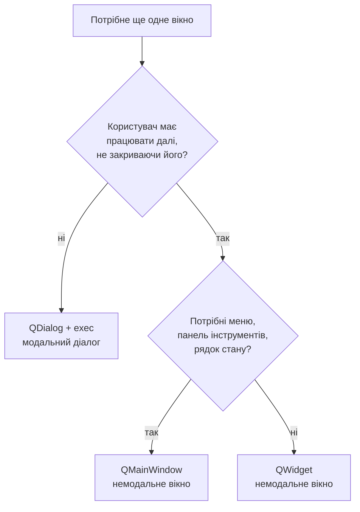
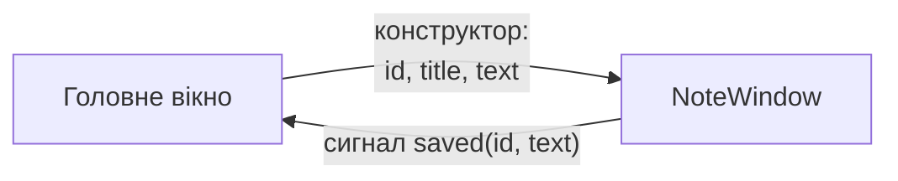
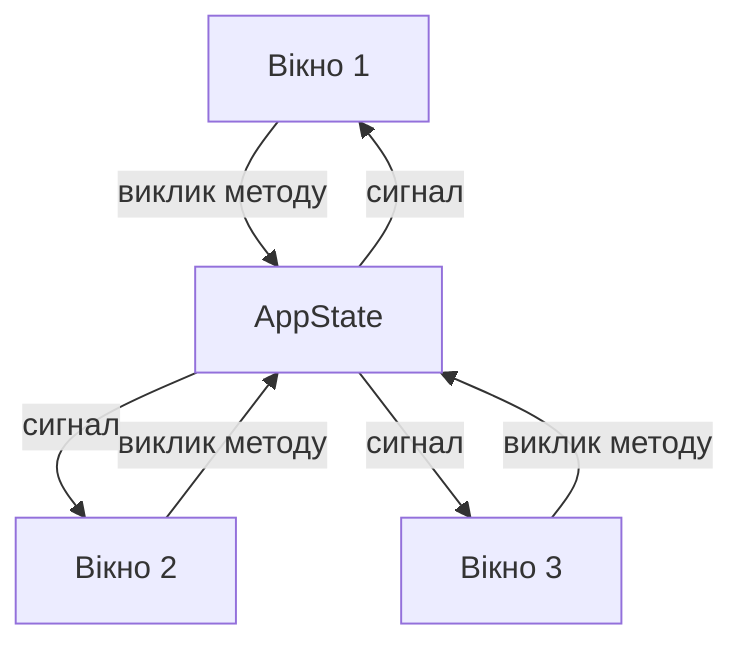
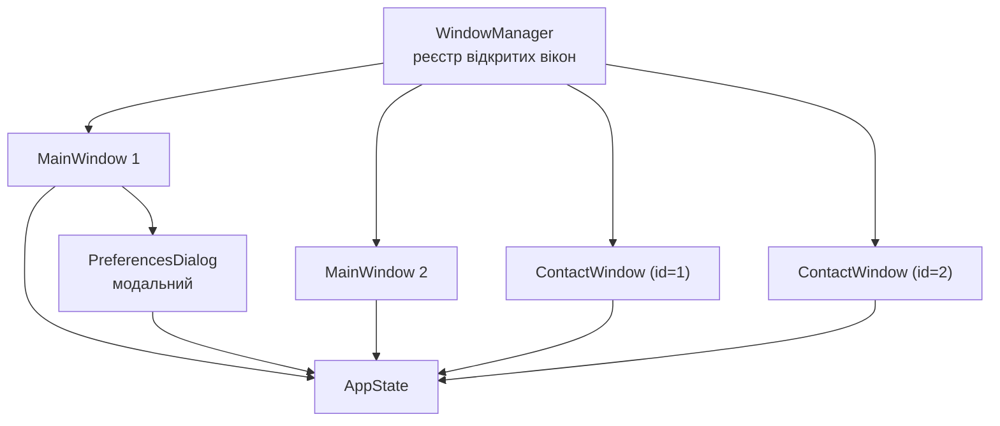

# 16. (Л) Багатовіконні застосунки. Модальні та немодальні вікна. Передавання даних між вікнами

## Зміст лекції

1. Коли застосунку потрібне друге вікно
2. Що робить віджет вікном
3. Час життя вікна: чому вікно блимає і зникає
4. Батько у вікна: що це змінює
5. Модальні та немодальні вікна
6. Діалог чи вікно: як обрати
7. Передавання даних: конструктор — дані вниз
8. Передавання даних: сигнал — результат угору
9. Передавання даних: спільний стан
10. Антипатерни зв'язку між вікнами
11. Один об'єкт — одне вікно: реєстр вікон
12. Закриття вікон і вихід із застосунку
13. Розташування вікон на екрані
14. Збірка: застосунок «Contacts»
15. Типові помилки
16. Підсумок

## Коли застосунку потрібне друге вікно

У [лекції 11](/ua/courses/programming-3sem/module1/11-dialogs-lecture/) допоміжні вікна вже були — діалоги. Діалог ставить одне питання й зникає: «зберегти зміни?», «який файл відкрити?», «введіть назву». Життя діалогу коротке, а результат — одне значення.

Друге **вікно** — інша історія. Воно живе паралельно з головним, має власне місце на панелі задач, власний розмір і положення, і користувач може працювати то в ньому, то в головному вікні. Класичні приклади:

- картка запису, відкрита в окремому вікні, поки список видно поруч;
- вікно журналу подій, у яке застосунок дописує рядки під час роботи;
- друге вікно тих самих даних — щоб дивитись на дві частини документа одночасно;
- панель інструментів, відірвана від головного вікна.

Розрізняти їх варто за одним питанням: **чи має користувач змогу працювати далі, не закривши це вікно?**

| Ознака | Діалог | Друге вікно |
|---|---|---|
| Тривалість життя | секунди | скільки завгодно |
| Результат | одне значення (`accept` / `reject`) | зміни в даних застосунку |
| Блокує роботу | зазвичай так | зазвичай ні |
| Скільки штук одночасно | одне | скільки треба |
| Базовий клас | `QDialog` | `QWidget` або `QMainWindow` |

Далі в лекції «вікно» означає саме друге, немодальне вікно; про модальність поговоримо окремо, бо це властивість, а не тип.

## Що робить віджет вікном

Правило Qt просте: **віджет без батька — це вікно верхнього рівня**.

```python
panel = QWidget(self)        # частина іншого вікна
window = QWidget()           # окреме вікно з рамкою й заголовком
```

Нічого спеціального успадковувати не треба. `QWidget()` без батька отримує рамку, заголовок, кнопки згортання та значок на панелі задач. Для другого вікна беруть один із трьох класів:

| Клас | Коли |
|---|---|
| `QWidget` | вікно без меню й рядка стану: картка, журнал, палітра |
| `QMainWindow` | вікно з меню, панеллю інструментів, рядком стану — «повноцінне» |
| `QDialog` | коротка розмова з результатом |

Мінімальний приклад із двома вікнами:

```python
import sys

from PySide6.QtWidgets import (
    QApplication,
    QLabel,
    QMainWindow,
    QPushButton,
    QVBoxLayout,
    QWidget,
)


class InfoWindow(QWidget):
    """QWidget без батька - це повноцінне вікно верхнього рівня."""

    def __init__(self):
        super().__init__()

        self.setWindowTitle("Info window")

        layout = QVBoxLayout(self)
        layout.addWidget(QLabel("A separate top-level window."))
        layout.addWidget(QLabel("It has its own title bar and taskbar entry."))


class MainWindow(QMainWindow):
    def __init__(self):
        super().__init__()

        self.setWindowTitle("Main window")

        # Посилання живе стільки ж, скільки головне вікно.
        self._info_window = None

        button = QPushButton("Open info window")
        button.clicked.connect(self.open_info)
        self.setCentralWidget(button)

    def open_info(self):
        if self._info_window is None:
            self._info_window = InfoWindow()
            self._info_window.resize(360, 120)

        self._info_window.show()
        self._info_window.raise_()
        self._info_window.activateWindow()


def main():
    app = QApplication(sys.argv)

    window = MainWindow()
    window.resize(320, 160)
    window.show()

    sys.exit(app.exec())


if __name__ == "__main__":
    main()
```

Три рядки в `open_info` варто запам'ятати як одне ціле:

| Виклик | Що робить |
|---|---|
| `show()` | показує вікно (на вже видимому не робить нічого) |
| `raise_()` | піднімає над іншими вікнами застосунку |
| `activateWindow()` | передає йому фокус клавіатури |

Без `raise_()` повторне натискання кнопки нібито «не працює»: вікно вже відкрите, але лежить під головним. Підкреслення в `raise_` — бо `raise` є ключовим словом Python.

## Час життя вікна: чому вікно блимає і зникає

Найпоширеніша помилка початківця в багатовіконному застосунку виглядає так:

```python
    def open_info(self):
        window = InfoWindow()      # ПОМИЛКА: локальна змінна
        window.show()              # вікно блимне і зникне
```

Метод завершується, локальна змінна `window` зникає, лічильник посилань падає до нуля — і Python знищує об'єкт разом із вікном. На екрані воно встигає блимнути.

Причина в тому, **хто володіє об'єктом**:

| Ситуація | Хто володіє | Що буде з локальною змінною |
|---|---|---|
| `QWidget()` — батька немає | Python | знищиться наприкінці методу |
| `QWidget(parent)` — батько є | C++ (об'єкт-батько) | виживе, поки живий батько |

Перевірити це можна за хвилину: створіть два вікна — одне з батьком, друге без — обидва в локальних змінних, і подивіться, що лишилось на екрані. Виживе лише те, у якого є батько.

Але покладатись на батьківство як на спосіб «утримати» вікно не варто: посилання на нього ви все одно втратили, а отже, не зможете ані підняти його наверх, ані оновити, ані закрити. Тому правило одне:

!!! danger "Зберігайте посилання на кожне відкрите вікно"
    Вікно, яке показали через `show()`, має жити в атрибуті (`self._info_window`) або в колекції (`self._windows`, словник реєстру). Локальна змінна — гарантована помилка.

Той самий підводний камінь стосується немодальних діалогів (`show()`, `open()`) — про це вже йшлося в лекції 11. З `exec()` проблеми немає: метод не завершується, поки діалог відкритий, тому локальна змінна жива.

## Батько у вікна: що це змінює

Вікно можна створити з батьком — і при цьому лишити його вікном, додавши прапорець `Qt.WindowType.Window`:

```python
window = QWidget(self)                          # це була б панель усередині self
window.setWindowFlag(Qt.WindowType.Window)      # а тепер це окреме вікно
```

Навіщо вікну батько:

| Наслідок | Пояснення |
|---|---|
| Завжди поверх батька | дочірнє вікно не загубиться під головним |
| Закриється разом із батьком | знищення батька знищує дітей |
| З'явиться біля батька | діалоги — по центру власника, а не в кутку екрана |
| `WindowModal` знає, що блокувати | без батька режим «модальний для вікна» безглуздий |
| Ним володіє Qt | Python-змінна не потрібна для виживання |

Коли батька **не** ставлять: якщо вікно рівноправне з головним — друге головне вікно, окрема картка запису, яку користувач хоче покласти поруч і перемкнутись на неї як на самостійне вікно. Такі вікна мають лишатись незалежними, і накидати їх поверх головного не треба.

Є ще проміжний варіант — прапорець `Qt.WindowType.Tool`: вікно-інструмент із тоншим заголовком, яке тримається поверх свого батька (палітри, панелі властивостей).

## Модальні та немодальні вікна

Модальність — це властивість **будь-якого** вікна, не тільки діалогу. Нагадаємо таблицю з лекції 11:

| Режим `windowModality` | Що блокує |
|---|---|
| `Qt.WindowModality.NonModal` | нічого |
| `Qt.WindowModality.WindowModal` | вікно-батька та його дочірні вікна |
| `Qt.WindowModality.ApplicationModal` | усі вікна застосунку |

І ключова відмінність, яку плутають найчастіше:

> **Блокувати ввід** і **блокувати виконання коду** — різні речі.

- `dialog.exec()` — блокує і ввід (застосунок), і код: наступний рядок виконається після закриття.
- `window.show()` — не блокує код **ніколи**, навіть якщо вікно `ApplicationModal`. Користувач не зможе клацнути в головне вікно, але метод, який викликав `show()`, дійде до кінця негайно.

Приклад, який це показує. Три кнопки відкривають одне й те саме вікно в трьох режимах; таймер у головному вікні тим часом рахує секунди:

```python
import sys

from PySide6.QtCore import Qt, QTimer
from PySide6.QtWidgets import (
    QApplication,
    QLabel,
    QLineEdit,
    QMainWindow,
    QPushButton,
    QVBoxLayout,
    QWidget,
)


class ChildWindow(QWidget):
    """Звичайне вікно, якому задано режим модальності."""

    def __init__(self, title, modality, parent=None):
        super().__init__(parent)

        # Батько потрібен, щоб WindowModal знав, що саме блокувати.
        self.setWindowFlag(Qt.WindowType.Window)
        self.setWindowTitle(title)
        self.setWindowModality(modality)

        close_button = QPushButton("Close")
        close_button.clicked.connect(self.close)

        layout = QVBoxLayout(self)
        layout.addWidget(QLabel(f"Modality: {modality.name}"))
        layout.addWidget(QLineEdit("Type here"))
        layout.addWidget(close_button)


class MainWindow(QMainWindow):
    def __init__(self):
        super().__init__()

        self.setWindowTitle("Modality demo")

        self._windows = []          # без цього вікна зникатимуть
        self._ticks = 0

        self.tick_label = QLabel("Ticks: 0")
        self.edit = QLineEdit()
        self.edit.setPlaceholderText("Try to type here while a window is open")

        central = QWidget()
        layout = QVBoxLayout(central)
        layout.addWidget(self.edit)
        layout.addWidget(self.tick_label)

        for title, modality in [
            ("Non-modal", Qt.WindowModality.NonModal),
            ("Window-modal", Qt.WindowModality.WindowModal),
            ("Application-modal", Qt.WindowModality.ApplicationModal),
        ]:
            button = QPushButton(f"Open {title.lower()} window")
            button.clicked.connect(
                lambda checked=False, t=title, m=modality: self.open_window(t, m)
            )
            layout.addWidget(button)

        self.setCentralWidget(central)

        # Таймер доводить, що цикл подій працює навіть під модальним вікном.
        timer = QTimer(self)
        timer.timeout.connect(self.on_tick)
        timer.start(1000)

    def open_window(self, title, modality):
        window = ChildWindow(title, modality, self)
        window.resize(300, 140)
        window.show()
        self._windows.append(window)

        # Рядок виконується одразу: show() не зупиняє код за жодної модальності.
        print(f"open_window returned, {title} is on screen")

    def on_tick(self):
        self._ticks += 1
        self.tick_label.setText(f"Ticks: {self._ticks}")


def main():
    app = QApplication(sys.argv)

    window = MainWindow()
    window.resize(420, 260)
    window.show()

    sys.exit(app.exec())


if __name__ == "__main__":
    main()
```

Що побачите:

- рядок `open_window returned...` з'являється в консолі **одразу**, у всіх трьох режимах;
- лічильник тіків не зупиняється ніколи — цикл подій живий завжди;
- у немодальному режимі в головне вікно пишеться, у двох інших — ні.

Коли модальність доречна:

| Зробити модальним | Лишити немодальним |
|---|---|
| налаштування застосунку | картка запису |
| майстер («крок 1 з 3») | вікно пошуку |
| підтвердження видалення | журнал подій |
| логін | друге вікно тих самих даних |

!!! warning "Модальні вікна не ставлять одне на одне"
    Модальне вікно поверх модального (а тим більше третє) — це глухий кут для користувача: він мусить закрити три вікна, щоб просто натиснути кнопку в головному. Якщо в модальному вікні потрібне ще одне — майже завжди це ознака, що перше не мало бути модальним.

## Діалог чи вікно: як обрати

Технічно `QDialog` — це `QWidget` з трьома додатками: `exec()`, коди результату (`accept()` / `reject()`) і реакція на `Enter` та `Esc`. Тому вибір робиться не за можливостями, а за сценарієм:



Ознака, що ви обрали неправильно: діалог, у якому користувач сидить хвилинами й весь час хоче зазирнути в головне вікно. Або немодальне вікно, у якому є кнопки `OK` і `Cancel`, — бо «скасувати» після того, як зміни вже пішли в дані, зазвичай нема чого.

## Передавання даних: конструктор — дані вниз

Три способи обміну даними з діалогом ми вже розібрали в лекції 11. З вікнами вони ті самі, але акценти зміщені: вікно живе довго, тому копію даних йому давати небезпечно — вона застаріє.

Перший напрямок — **дані вниз, через конструктор**:

```python
window = ContactWindow(contact_id, self.state)
```

Зверніть увагу, що передається: **ідентифікатор** і **джерело даних**, а не копія самого контакту. Вікно завжди читає актуальний об'єкт зі стану. Копія (`ContactWindow(contact)`) годиться лише для діалогу, який живе три секунди.

!!! danger "Не передавайте вікну посилання на головне вікно"
    ```python
    window = ContactWindow(contact_id, self)      # ПОМИЛКА проєктування
    ```
    Отримавши `self`, дочірнє вікно почне лізти в чужі віджети (`self.main.list_widget.addItem(...)`). Такий код неможливо ані перевикористати, ані протестувати. Батько як `parent` — нормально; батько як «джерело даних і команд» — ні.

## Передавання даних: сигнал — результат угору

Зворотний напрямок — **сигнал**. Вікно оголошує власний сигнал і надсилає його; хто підписався, той і реагує. Вікно не знає, хто саме його слухає, — і це саме те, що потрібно.

```python
class NoteWindow(QWidget):
    saved = Signal(int, str)          # id нотатки та новий текст
```

Повний приклад: список нотаток у головному вікні, редагування — в окремому вікні.

```python
import sys

from PySide6.QtCore import Qt, Signal
from PySide6.QtWidgets import (
    QApplication,
    QHBoxLayout,
    QLabel,
    QListWidget,
    QMainWindow,
    QPushButton,
    QTextEdit,
    QVBoxLayout,
    QWidget,
)


class NoteWindow(QWidget):
    """Вікно редагування однієї нотатки.

    Про головне вікно не знає нічого: отримує текст у конструкторі
    й повідомляє про результат сигналом.
    """

    saved = Signal(int, str)

    def __init__(self, note_id, title, text):
        super().__init__()

        self._note_id = note_id

        self.setWindowTitle(f"Edit: {title}")

        self.editor = QTextEdit(text)

        save_button = QPushButton("Save")
        close_button = QPushButton("Close")
        save_button.clicked.connect(self.on_save)
        close_button.clicked.connect(self.close)

        buttons = QHBoxLayout()
        buttons.addStretch()
        buttons.addWidget(save_button)
        buttons.addWidget(close_button)

        layout = QVBoxLayout(self)
        layout.addWidget(self.editor)
        layout.addLayout(buttons)

    def on_save(self):
        self.saved.emit(self._note_id, self.editor.toPlainText())


class MainWindow(QMainWindow):
    def __init__(self):
        super().__init__()

        self.setWindowTitle("Notes - main window")

        self.notes = {
            1: ("Shopping", "milk, bread"),
            2: ("Ideas", "write a Qt tutorial"),
            3: ("Todo", "call the dentist"),
        }

        self._note_window = None

        self.list_widget = QListWidget()
        for note_id, (title, _text) in self.notes.items():
            self.list_widget.addItem(title)
            self.list_widget.item(self.list_widget.count() - 1).setData(
                Qt.ItemDataRole.UserRole, note_id
            )

        self.preview = QLabel()
        self.preview.setWordWrap(True)

        open_button = QPushButton("Open in a window")
        open_button.clicked.connect(self.open_note)
        self.list_widget.itemDoubleClicked.connect(self.open_note)
        self.list_widget.currentRowChanged.connect(self.show_preview)

        central = QWidget()
        layout = QVBoxLayout(central)
        layout.addWidget(self.list_widget)
        layout.addWidget(open_button)
        layout.addWidget(self.preview)
        self.setCentralWidget(central)

        self.list_widget.setCurrentRow(0)

    def current_id(self):
        item = self.list_widget.currentItem()
        if item is None:
            return None
        return item.data(Qt.ItemDataRole.UserRole)

    def show_preview(self):
        note_id = self.current_id()
        if note_id is None:
            self.preview.setText("")
            return

        self.preview.setText(self.notes[note_id][1])

    def open_note(self):
        note_id = self.current_id()
        if note_id is None:
            return

        title, text = self.notes[note_id]

        # Дані - вниз, через конструктор.
        self._note_window = NoteWindow(note_id, title, text)
        # Результат - угору, через сигнал.
        self._note_window.saved.connect(self.on_note_saved)
        self._note_window.resize(420, 300)
        self._note_window.show()

    def on_note_saved(self, note_id, text):
        title, _old = self.notes[note_id]
        self.notes[note_id] = (title, text)
        self.show_preview()


def main():
    app = QApplication(sys.argv)

    window = MainWindow()
    window.resize(420, 380)
    window.show()

    sys.exit(app.exec())


if __name__ == "__main__":
    main()
```

Схема руху даних:



Це працює й читається — доки вікно одне. Спробуйте відкрити два вікна на дві різні нотатки, і одразу з'явиться список питань: де тримати обидва посилання, що робити, якщо ту саму нотатку відкрили двічі, як оновити перше вікно, коли текст змінили в другому. Відповідь на всі три — наступний розділ.

## Передавання даних: спільний стан

У [лекції 14](/ua/courses/programming-3sem/module2/14-app-state-structure-lecture/) ми винесли дані з віджетів у клас `AppState`. Тепер настав момент, заради якого це робилось:

> **Вікна не передають дані одне одному. Вони працюють зі спільним станом і слухають його сигнали.**



Кількість зв'язків при цьому росте **лінійно**: додали десяте вікно — додали один зв'язок зі станом. Якщо ж вікна спілкуються напряму, зв'язків стає стільки, скільки пар вікон: три вікна — три зв'язки, п'ять вікон — десять, десять — сорок п'ять.

Приклад: два вікна на один стан. Одне вводить завдання, друге показує статистику. Одне про одного вони не знають.

```python
import sys

from PySide6.QtCore import QObject, Signal
from PySide6.QtWidgets import (
    QApplication,
    QHBoxLayout,
    QLabel,
    QLineEdit,
    QListWidget,
    QPushButton,
    QVBoxLayout,
    QWidget,
)


class TaskState(QObject):
    """Спільний стан. Про вікна не знає нічого."""

    tasks_changed = Signal()

    def __init__(self):
        super().__init__()
        self._tasks = []            # список пар (title, done)

    def tasks(self):
        return tuple(self._tasks)

    def add(self, title):
        title = title.strip()
        if not title:
            return

        self._tasks.append((title, False))
        self.tasks_changed.emit()

    def toggle(self, index):
        if not 0 <= index < len(self._tasks):
            return

        title, done = self._tasks[index]
        self._tasks[index] = (title, not done)
        self.tasks_changed.emit()


class TaskListWindow(QWidget):
    """Вікно введення. Про StatsWindow не знає."""

    def __init__(self, state):
        super().__init__()

        self.state = state
        self.setWindowTitle("Tasks")

        self.edit = QLineEdit()
        self.edit.setPlaceholderText("New task")
        add_button = QPushButton("Add")
        toggle_button = QPushButton("Toggle done")
        self.list_widget = QListWidget()

        add_button.clicked.connect(self.on_add)
        self.edit.returnPressed.connect(self.on_add)
        toggle_button.clicked.connect(self.on_toggle)

        # Єдиний шлях оновлення: сигнал стану -> render.
        self.state.tasks_changed.connect(self.render)

        top = QHBoxLayout()
        top.addWidget(self.edit)
        top.addWidget(add_button)

        layout = QVBoxLayout(self)
        layout.addLayout(top)
        layout.addWidget(self.list_widget)
        layout.addWidget(toggle_button)

        self.render()

    def on_add(self):
        self.state.add(self.edit.text())
        self.edit.clear()

    def on_toggle(self):
        self.state.toggle(self.list_widget.currentRow())

    def render(self):
        row = self.list_widget.currentRow()
        self.list_widget.clear()
        for title, done in self.state.tasks():
            mark = "x" if done else " "
            self.list_widget.addItem(f"[{mark}] {title}")
        self.list_widget.setCurrentRow(row)


class StatsWindow(QWidget):
    """Вікно перегляду. Про TaskListWindow не знає."""

    def __init__(self, state):
        super().__init__()

        self.state = state
        self.setWindowTitle("Stats")

        self.total_label = QLabel()
        self.done_label = QLabel()

        self.state.tasks_changed.connect(self.render)

        layout = QVBoxLayout(self)
        layout.addWidget(self.total_label)
        layout.addWidget(self.done_label)
        layout.addStretch()

        self.render()

    def render(self):
        tasks = self.state.tasks()
        done = sum(1 for _title, is_done in tasks if is_done)
        self.total_label.setText(f"Total: {len(tasks)}")
        self.done_label.setText(f"Done: {done}")


def main():
    app = QApplication(sys.argv)

    state = TaskState()
    state.add("Read the lecture")
    state.add("Run the example")

    task_window = TaskListWindow(state)
    task_window.resize(360, 300)
    task_window.move(80, 120)
    task_window.show()

    stats_window = StatsWindow(state)
    stats_window.resize(200, 120)
    stats_window.move(480, 120)
    stats_window.show()

    sys.exit(app.exec())


if __name__ == "__main__":
    main()
```

Додайте завдання в лівому вікні — праве оновиться. Жодного рядка синхронізації для цього не написано: обидва вікна підписані на `tasks_changed` і перемальовуються з одного джерела.

!!! note "Посилання на вікна тут теж є"
    `task_window` і `stats_window` — локальні змінні функції `main`, але `main` не завершується, поки не завершиться `app.exec()`. Тому вікна живі. Щойно вікна почнуть відкриватись із кнопки, посилання доведеться зберігати явно.

Третій прийом із лекції 11 — **результат `exec()`** — нікуди не подівся, але працює лише з модальними діалогами:

```python
if dialog.exec() == QDialog.DialogCode.Accepted:
    data = dialog.contact()
```

Разом виходить чотири канали, і вибір між ними однозначний:

| Канал | Напрямок | Коли |
|---|---|---|
| Конструктор | власник → вікно | що саме показувати (`id`, посилання на стан) |
| Сигнал | вікно → власник | подія у вікні, на яку має відреагувати власник |
| Спільний стан | у всі боки | дані, які бачить більше ніж одне вікно |
| Результат `exec()` | діалог → власник | модальний діалог із коротким результатом |

## Антипатерни зв'язку між вікнами

**1. Похід угору через `parent()`**

```python
# у дочірньому вікні
self.parent().list_widget.addItem(name)          # ПОМИЛКА
self.window().statusBar().showMessage("Saved")   # ПОМИЛКА
```

Вікно прив'язується до конкретного класу власника й до його внутрішніх віджетів. Перейменували `list_widget` — зламалось геть в іншому файлі. Замість цього — сигнал або виклик методу стану.

**2. Глобальна змінна з даними**

```python
# globals.py
CONTACTS = []                    # ПОМИЛКА: стан без сигналів
```

Змінити такий список може будь-хто, а дізнатись про зміну — ніхто. Інтерфейс доведеться оновлювати вручну з усіх місць. `AppState` розв'язує ту саму задачу, але з сигналами.

**3. Вікно імпортує сусіднє вікно й керує ним**

```python
# contact_window.py
from .log_window import LogWindow            # ПОМИЛКА

LogWindow.instance().append("contact saved")
```

Два вікна зчепились намертво, і разом із ними — два файли. Хто відкриває вікна, вирішує окремий об'єкт (див. наступний розділ), а «щось сталося» — це сигнал стану.

**4. Дочірнє вікно закриває або перезапускає головне**

```python
self.parent().close()                        # ПОМИЛКА
```

Рішення про закриття застосунку ухвалює той, хто ним володіє, а не картка контакту.

## Один об'єкт — одне вікно: реєстр вікон

Щойно вікна відкриваються з кнопки, з'являються три обов'язкові вимоги:

1. посилання на кожне відкрите вікно має десь зберігатись;
2. повторне «відкрити» для того самого запису має **піднімати** наявне вікно, а не створювати друге;
3. коли вікно закрили, посилання треба прибрати, інакше вони накопичуватимуться в пам'яті.

Усе це закриває один словник `id → вікно` і невеликий клас навколо нього:

```python
class ContactWindowRegistry:
    def __init__(self, state):
        self.state = state
        self._windows = {}                   # contact_id -> ContactWindow

    def open(self, contact_id):
        window = self._windows.get(contact_id)

        if window is None:
            window = ContactWindow(self.state, contact_id)
            window.closed.connect(self.forget)
            self._windows[contact_id] = window

        window.show()
        window.raise_()
        window.activateWindow()
        return window

    def forget(self, contact_id):
        self._windows.pop(contact_id, None)
```

Звідки береться `closed`? Вікно повідомляє про своє закриття власним сигналом:

```python
class ContactWindow(QWidget):
    closed = Signal(int)

    def closeEvent(self, event):
        self.closed.emit(self.contact_id)
        super().closeEvent(event)
```

Не забудьте `super().closeEvent(event)` — інакше вікно може не закритись.

!!! tip "Ключ словника — `id`, а не номер рядка"
    Те саме правило, що й для `Qt.ItemDataRole.UserRole` у лекції 14: після видалення чи сортування номери рядків змінюються, а `id` — ні.

Другий типовий випадок — **кілька рівноправних головних вікон** (як вкладки-вікна браузера). Тут ключа немає, тому підходить список; додається лише правило, що робити, коли закрилось останнє. Обидва випадки зручно тримати в одному класі — назвемо його `WindowManager`; повна версія є у збірці наприкінці лекції.

## Закриття вікон і вихід із застосунку

За замовчуванням `QApplication` завершує роботу, коли закрилось **останнє видиме вікно верхнього рівня**. Керує цим властивість:

```python
app.setQuitOnLastWindowClosed(False)     # застосунок лишиться жити без вікон
```

`False` ставлять хіба що для програм зі значком у системному лотку. У звичайному застосунку лишається `True`, і саме звідси беруться дві типові неприємності.

**Застосунок не закривається.** Користувач закрив головне вікно, а десь лишилось відкрите вікно картки — процес живий, значок на панелі задач висить. Лікується тим, що при закритті останнього головного вікна закриваються й допоміжні:

```python
    def forget_main_window(self, window):
        if window in self._main_windows:
            self._main_windows.remove(window)

        if not self._main_windows:
            self.close_all_contacts()
```

**Застосунок закривається зарано.** Зворотна ситуація: усі вікна тимчасово сховані (наприклад, головне закрили, а картку ще не відкрили) — і застосунок завершується сам.

Закрити все одразу можна одним викликом:

```python
QApplication.closeAllWindows()      # кожне вікно отримає closeEvent
```

Важливо, що це саме `closeAllWindows()`, а не `quit()`: перший спосіб дає кожному вікну шанс запитати «зберегти зміни?» у своєму `closeEvent`, другий — обриває застосунок без питань.

Ще один інструмент — атрибут `WA_DeleteOnClose`:

```python
window.setAttribute(Qt.WidgetAttribute.WA_DeleteOnClose)
```

Вікно знищується одразу після закриття, а не ховається. Це корисно, коли вікон багато й вони важкі, але тоді **звертатись до вікна після закриття не можна** — отримаєте `RuntimeError: Internal C++ object already deleted`. У реєстрі з попереднього розділу цей атрибут не потрібен: посилання прибирається в `forget`, і Python знищить об'єкт сам.

!!! warning "`closeEvent` спрацьовує й при виході із застосунку"
    Перевірка «чи є незбережені зміни» має жити в `closeEvent` кожного вікна, яке ці зміни тримає. Тоді вона однаково спрацює і на хрестик, і на `Ctrl+W`, і на `Quit`.

## Розташування вікон на екрані

Друге вікно, яке щоразу з'являється в лівому верхньому куті або точно поверх першого, — дрібниця, яка дратує. Два прийоми вирішують 90% випадків:

```python
import sys

from PySide6.QtWidgets import QApplication, QLabel, QPushButton, QVBoxLayout, QWidget


def center_on_screen(window):
    """Ставить вікно посередині екрана, на якому воно зараз опинилось."""
    frame = window.frameGeometry()
    frame.moveCenter(window.screen().availableGeometry().center())
    window.move(frame.topLeft())


class ChildWindow(QWidget):
    def __init__(self, number):
        super().__init__()
        self.setWindowTitle(f"Window {number}")
        QVBoxLayout(self).addWidget(QLabel(f"Cascaded window {number}"))


class MainWindow(QWidget):
    def __init__(self):
        super().__init__()

        self.setWindowTitle("Geometry")

        self._windows = []

        button = QPushButton("Open cascaded window")
        button.clicked.connect(self.open_window)

        layout = QVBoxLayout(self)
        layout.addWidget(button)

    def open_window(self):
        number = len(self._windows) + 1
        window = ChildWindow(number)
        window.resize(300, 120)

        # Кожне наступне вікно зсувається вниз-праворуч від головного.
        offset = 30 * number
        window.move(self.x() + offset, self.y() + offset)
        window.show()

        self._windows.append(window)


def main():
    app = QApplication(sys.argv)

    window = MainWindow()
    window.resize(320, 120)
    window.show()
    center_on_screen(window)

    sys.exit(app.exec())


if __name__ == "__main__":
    main()
```

Що тут важливо:

- `availableGeometry()` — це екран **без** панелі задач, на відміну від `geometry()`;
- `frameGeometry()` враховує рамку й заголовок, тому вікно стає рівно посередині;
- `window.screen()` повертає екран, на якому вікно зараз, — у користувача їх може бути два;
- каскадний зсув на 30 пікселів — найпростіший спосіб не класти вікна одне на одне.

Зберігати розмір і положення вікна між запусками ми вже вміємо — `QSettings` із [лекції 7](/ua/courses/programming-3sem/module1/07-qmainwindow-lecture/). Для кількох однакових вікон ключ доведеться зробити унікальним, наприклад `"window/contact/geometry"`.

## Збірка: застосунок «Contacts»

Складемо все разом. Застосунок «Contacts» має три типи вікон:

- **головне вікно** — список контактів; таких вікон можна відкрити скільки завгодно;
- **вікно контакту** — немодальне, по одному на контакт, зміни застосовуються під час набору;
- **вікно налаштувань** — модальний діалог із `OK` / `Cancel`.



Структура проєкту — та сама, що в лекції 14, плюс окремий файл на кожне вікно:

```text
contacts/
├── main.py                        <- точка збірки
└── app/
    ├── __init__.py
    ├── models.py                  <- Contact
    ├── state.py                   <- AppState: дані + сигнали
    └── ui/
        ├── __init__.py
        ├── window_manager.py      <- хто які вікна відкриває
        ├── main_window.py         <- MainWindow
        ├── contact_window.py      <- ContactWindow (немодальне)
        └── preferences_dialog.py  <- PreferencesDialog (модальний)
```

### `app/models.py`

```python
from dataclasses import dataclass


@dataclass
class Contact:
    """Один контакт. Чистий Python, жодного PySide6."""

    id: int
    name: str
    email: str = ""
    phone: str = ""
    note: str = ""
```

### `app/state.py`

```python
from PySide6.QtCore import QObject, Signal

from .models import Contact


class AppState(QObject):
    """Спільний стан застосунку: дані + сигнали про їх зміну."""

    contacts_changed = Signal()        # склад списку змінився
    contact_changed = Signal(int)      # змінились поля одного контакту
    contact_removed = Signal(int)      # контакт зник: його вікно має закритись
    settings_changed = Signal()        # змінились налаштування показу

    def __init__(self):
        super().__init__()

        self._contacts = {}            # id -> Contact, порядок вставки зберігається
        self._next_id = 1
        self._show_email = True

    # --- читання ---

    def contacts(self):
        return tuple(self._contacts.values())

    def contact(self, contact_id):
        return self._contacts.get(contact_id)

    def show_email(self):
        return self._show_email

    # --- зміна ---

    def add(self, name="New contact", email="", phone="", note=""):
        contact = Contact(self._next_id, name, email, phone, note)
        self._contacts[contact.id] = contact
        self._next_id += 1

        self.contacts_changed.emit()
        return contact.id

    def update(self, contact_id, name, email, phone, note):
        contact = self._contacts.get(contact_id)
        if contact is None:
            return

        new_values = (name, email, phone, note)
        if (contact.name, contact.email, contact.phone, contact.note) == new_values:
            return                     # нічого не змінилось - сигналу не буде

        contact.name, contact.email, contact.phone, contact.note = new_values
        self.contact_changed.emit(contact_id)

    def remove(self, contact_id):
        if contact_id not in self._contacts:
            return

        del self._contacts[contact_id]
        self.contact_removed.emit(contact_id)
        self.contacts_changed.emit()

    def set_show_email(self, value):
        if self._show_email == value:
            return

        self._show_email = value
        self.settings_changed.emit()
```

Чотири сигнали — не забаганка. Кожен має свого адресата: `contacts_changed` перемальовує списки, `contact_changed` оновлює відкриті картки, `contact_removed` закриває вікно видаленого контакту, `settings_changed` змінює вигляд рядків у списку.

### `app/ui/contact_window.py`

```python
from PySide6.QtCore import Signal
from PySide6.QtWidgets import (
    QFormLayout,
    QLabel,
    QLineEdit,
    QPushButton,
    QTextEdit,
    QVBoxLayout,
    QWidget,
)


class ContactWindow(QWidget):
    """Немодальне вікно одного контакту.

    Головного вікна не знає. Читає й змінює спільний стан.
    """

    closed = Signal(int)

    def __init__(self, state, contact_id):
        super().__init__()

        self.state = state
        self.contact_id = contact_id

        self._loading = False          # зараз іде render: не реагувати на textChanged
        self._sending = False          # зміну спричинили ми: не перемальовуватись

        self.name_edit = QLineEdit()
        self.email_edit = QLineEdit()
        self.phone_edit = QLineEdit()
        self.note_edit = QTextEdit()
        self.hint = QLabel("Changes are applied as you type.")

        close_button = QPushButton("Close")
        close_button.clicked.connect(self.close)

        for widget in (self.name_edit, self.email_edit, self.phone_edit):
            widget.textChanged.connect(self.on_edited)
        self.note_edit.textChanged.connect(self.on_edited)

        self.state.contact_changed.connect(self.on_contact_changed)

        form = QFormLayout()
        form.addRow("Name:", self.name_edit)
        form.addRow("Email:", self.email_edit)
        form.addRow("Phone:", self.phone_edit)
        form.addRow("Note:", self.note_edit)

        layout = QVBoxLayout(self)
        layout.addLayout(form)
        layout.addWidget(self.hint)
        layout.addWidget(close_button)

        self.render()

    def render(self):
        contact = self.state.contact(self.contact_id)
        if contact is None:
            return

        self._loading = True
        self.name_edit.setText(contact.name)
        self.email_edit.setText(contact.email)
        self.phone_edit.setText(contact.phone)
        if self.note_edit.toPlainText() != contact.note:
            self.note_edit.setPlainText(contact.note)
        self._loading = False

        self.setWindowTitle(f"Contact: {contact.name}")

    def on_edited(self):
        if self._loading:
            return

        self._sending = True
        self.state.update(
            self.contact_id,
            self.name_edit.text(),
            self.email_edit.text(),
            self.phone_edit.text(),
            self.note_edit.toPlainText(),
        )
        self._sending = False

        contact = self.state.contact(self.contact_id)
        if contact is not None:
            self.setWindowTitle(f"Contact: {contact.name}")

    def on_contact_changed(self, contact_id):
        # Чужі контакти нас не цікавлять, власні зміни - теж.
        if contact_id != self.contact_id or self._sending:
            return

        self.render()

    def closeEvent(self, event):
        self.closed.emit(self.contact_id)
        super().closeEvent(event)
```

Два прапорці розривають петлю «стан → віджет → стан» у двох різних місцях:

- `_loading` — поки `render()` заповнює поля, `textChanged` не має вважати це діями користувача;
- `_sending` — коли сигнал `contact_changed` прийшов у відповідь на наш власний виклик `update`, перемальовуватись не можна: `setText` посеред набору тексту перекине курсор на початок рядка.

### `app/ui/preferences_dialog.py`

```python
from PySide6.QtWidgets import QCheckBox, QDialog, QDialogButtonBox, QLabel, QVBoxLayout


class PreferencesDialog(QDialog):
    """Модальне вікно налаштувань: коротка розмова із зрозумілим кінцем."""

    def __init__(self, state, parent=None):
        super().__init__(parent)

        self.state = state
        self.setWindowTitle("Preferences")

        self.email_box = QCheckBox("Show email in the contact list")
        self.email_box.setChecked(state.show_email())

        buttons = QDialogButtonBox(
            QDialogButtonBox.StandardButton.Ok | QDialogButtonBox.StandardButton.Cancel
        )
        buttons.accepted.connect(self.accept)
        buttons.rejected.connect(self.reject)

        layout = QVBoxLayout(self)
        layout.addWidget(QLabel("Applies to every open window."))
        layout.addWidget(self.email_box)
        layout.addWidget(buttons)

    def accept(self):
        # Стан змінюємо тільки після підтвердження: Cancel має нічого не робити.
        self.state.set_show_email(self.email_box.isChecked())
        super().accept()
```

### `app/ui/main_window.py`

```python
from PySide6.QtCore import Qt, Signal
from PySide6.QtGui import QAction, QKeySequence
from PySide6.QtWidgets import (
    QApplication,
    QHBoxLayout,
    QListWidget,
    QListWidgetItem,
    QMainWindow,
    QMessageBox,
    QPushButton,
    QVBoxLayout,
    QWidget,
)

from .preferences_dialog import PreferencesDialog


class MainWindow(QMainWindow):
    """Головне вікно. Таких вікон може бути кілька на один стан."""

    closed = Signal()

    def __init__(self, state, windows):
        super().__init__()

        self.setWindowTitle("Contacts")

        self.state = state
        self.windows = windows         # WindowManager: тільки він відкриває вікна

        self.list_widget = QListWidget()
        self.list_widget.itemDoubleClicked.connect(self.open_selected)

        open_button = QPushButton("Open in a window")
        new_button = QPushButton("New contact")
        delete_button = QPushButton("Delete")

        open_button.clicked.connect(self.open_selected)
        new_button.clicked.connect(self.new_contact)
        delete_button.clicked.connect(self.delete_selected)

        buttons = QHBoxLayout()
        buttons.addWidget(new_button)
        buttons.addWidget(open_button)
        buttons.addWidget(delete_button)

        central = QWidget()
        layout = QVBoxLayout(central)
        layout.addWidget(self.list_widget)
        layout.addLayout(buttons)
        self.setCentralWidget(central)

        self.build_menu()

        # Три сигнали стану - один спосіб оновлення.
        self.state.contacts_changed.connect(self.render)
        self.state.contact_changed.connect(self.render)
        self.state.settings_changed.connect(self.render)

        self.render()

    def build_menu(self):
        file_menu = self.menuBar().addMenu("File")

        new_window_action = QAction("New window", self)
        new_window_action.setShortcut(QKeySequence("Ctrl+Shift+N"))
        new_window_action.triggered.connect(self.windows.open_main_window)

        close_action = QAction("Close window", self)
        close_action.setShortcut(QKeySequence("Ctrl+W"))
        close_action.triggered.connect(self.close)

        quit_action = QAction("Quit", self)
        quit_action.setShortcut(QKeySequence("Ctrl+Q"))
        quit_action.triggered.connect(QApplication.closeAllWindows)

        file_menu.addAction(new_window_action)
        file_menu.addAction(close_action)
        file_menu.addSeparator()
        file_menu.addAction(quit_action)

        edit_menu = self.menuBar().addMenu("Edit")
        preferences_action = QAction("Preferences...", self)
        preferences_action.triggered.connect(self.open_preferences)
        edit_menu.addAction(preferences_action)

    # --- показ ---

    def render(self):
        selected_id = self.selected_id()

        self.list_widget.clear()
        for contact in self.state.contacts():
            text = contact.name
            if self.state.show_email() and contact.email:
                text = f"{contact.name} <{contact.email}>"

            item = QListWidgetItem(text)
            item.setData(Qt.ItemDataRole.UserRole, contact.id)
            self.list_widget.addItem(item)

            if contact.id == selected_id:
                self.list_widget.setCurrentItem(item)

        self.statusBar().showMessage(f"Contacts: {len(self.state.contacts())}")

    def selected_id(self):
        item = self.list_widget.currentItem()
        if item is None:
            return None

        return item.data(Qt.ItemDataRole.UserRole)

    # --- дії ---

    def new_contact(self):
        contact_id = self.state.add()
        self.windows.open_contact(contact_id)

    def open_selected(self):
        contact_id = self.selected_id()
        if contact_id is None:
            return

        self.windows.open_contact(contact_id)

    def delete_selected(self):
        contact_id = self.selected_id()
        if contact_id is None:
            return

        contact = self.state.contact(contact_id)
        answer = QMessageBox.question(
            self,
            "Contacts",
            f"Delete {contact.name}?",
            QMessageBox.StandardButton.Yes | QMessageBox.StandardButton.No,
            QMessageBox.StandardButton.No,
        )
        if answer == QMessageBox.StandardButton.Yes:
            # Вікно контакту закриється саме: воно підписане на contact_removed.
            self.state.remove(contact_id)

    def open_preferences(self):
        # Модальний діалог: показуємо через exec() і одразу знаємо результат.
        PreferencesDialog(self.state, self).exec()

    def closeEvent(self, event):
        self.closed.emit()
        super().closeEvent(event)
```

### `app/ui/window_manager.py`

```python
from .contact_window import ContactWindow
from .main_window import MainWindow


class WindowManager:
    """Єдине місце, яке знає, які вікна відкриті.

    Вікна одне про одного не знають: усі звертаються сюди.
    """

    def __init__(self, state):
        self.state = state

        self._main_windows = []                 # список головних вікон
        self._contact_windows = {}              # contact_id -> ContactWindow

        self.state.contact_removed.connect(self.close_contact)

    # --- відкриття ---

    def open_main_window(self):
        window = MainWindow(self.state, self)
        window.closed.connect(lambda: self.forget_main_window(window))

        offset = 40 * len(self._main_windows)
        self._main_windows.append(window)

        window.resize(560, 420)
        window.move(120 + offset, 100 + offset)
        window.show()
        return window

    def open_contact(self, contact_id):
        window = self._contact_windows.get(contact_id)

        if window is None:
            window = ContactWindow(self.state, contact_id)
            window.closed.connect(self.forget_contact_window)
            window.resize(400, 340)
            self._contact_windows[contact_id] = window

        # Друге натискання не створює копію, а піднімає наявне вікно.
        window.show()
        window.raise_()
        window.activateWindow()
        return window

    # --- закриття ---

    def close_contact(self, contact_id):
        window = self._contact_windows.get(contact_id)
        if window is not None:
            window.close()

    def close_all_contacts(self):
        for window in list(self._contact_windows.values()):
            window.close()

    def forget_contact_window(self, contact_id):
        self._contact_windows.pop(contact_id, None)

    def forget_main_window(self, window):
        if window in self._main_windows:
            self._main_windows.remove(window)

        # Закрилось останнє головне вікно - допоміжним нема біля чого жити.
        if not self._main_windows:
            self.close_all_contacts()
```

Зверніть увагу на `list(...)` у `close_all_contacts`: закриття вікна викликає `forget_contact_window`, тобто **змінює словник під час обходу**. Без копії отримали б `RuntimeError: dictionary changed size during iteration`.

### `main.py`

```python
"""Точка збірки застосунку Contacts."""

import sys

from PySide6.QtWidgets import QApplication

from app.state import AppState
from app.ui.window_manager import WindowManager

SEED_CONTACTS = [
    ("Ada Lovelace", "ada@example.com", "+380 44 000 0001"),
    ("Alan Turing", "alan@example.com", "+380 44 000 0002"),
    ("Grace Hopper", "grace@example.com", "+380 44 000 0003"),
]


def main():
    app = QApplication(sys.argv)
    app.setApplicationName("Contacts")

    state = AppState()
    for name, email, phone in SEED_CONTACTS:
        state.add(name, email, phone)

    windows = WindowManager(state)
    windows.open_main_window()

    sys.exit(app.exec())


if __name__ == "__main__":
    main()
```

Запуск із кореня проєкту:

```bash
cd contacts
python3 main.py
```

Зберігання даних тут навмисне немає: шар `storage.py` із лекції 14 вставляється в цей застосунок без жодних змін у вікнах — саме тому, що вікна працюють зі станом, а не з файлом.

### Що перевірити руками

1. Відкрийте контакт подвійним клацанням, змініть ім'я — рядок у списку змінюється **під час набору**.
2. Натисніть `Ctrl+Shift+N`. Друге головне вікно показує ті самі контакти; зміни в картці видно в обох списках одночасно.
3. Відкрийте той самий контакт ще раз — нове вікно не з'явиться, наявне підніметься наверх.
4. Відкрийте `Edit → Preferences...` і спробуйте клацнути в головне вікно — не вийде, діалог модальний. Зніміть галочку, натисніть `OK` — списки в обох головних вікнах перемалюються.
5. Видаліть контакт, вікно якого відкрите, — воно закриється саме.
6. Закрийте головні вікна по черзі: після останнього зникнуть і картки, і застосунок завершиться.

Жоден із цих сценаріїв не має власного коду синхронізації. Усе тримається на трьох правилах: дані живуть у стані, вікна перемальовуються з сигналів, відкриттям і закриттям керує один об'єкт.

## Типові помилки

**1. Вікно в локальній змінній**

```python
def open_window(self):
    window = LogWindow()               # ПОМИЛКА
    window.show()
```

Блимне і зникне. Посилання — в атрибут або в реєстр.

**2. Кожне натискання створює нове вікно**

```python
def open_contact(self, contact_id):
    window = ContactWindow(self.state, contact_id)    # ПОМИЛКА: щоразу нове
    window.show()
```

Через п'ять клацань на екрані п'ять копій однієї картки, і кожна вважає себе головною. Спершу шукаємо у словнику.

**3. `show()` без `raise_()` і `activateWindow()`**

Вікно вже відкрите, але лежить під головним. Користувач упевнений, що кнопка зламана.

**4. Немодальне вікно показують через `exec()`**

```python
self.contact_window.exec()             # ПОМИЛКА: у QWidget такого методу немає
```

`exec()` є лише в `QDialog`. А якщо вікно й справді `QDialog` — застосунок буде заблоковано, чого від картки контакту не чекають.

**5. Плутанина «модальне» і «блокує код»**

```python
window.setWindowModality(Qt.WindowModality.ApplicationModal)
window.show()
print(self.result)                     # ПОМИЛКА: користувач ще нічого не зробив
```

`show()` не чекає ні за якої модальності. Результат приходить сигналом.

**6. Дочірнє вікно лізе у віджети власника**

```python
self.parent().list_widget.addItem(name)          # ПОМИЛКА
```

Сигнал угору або виклик методу стану.

**7. Вікну передали копію об'єкта замість `id`**

```python
window = ContactWindow(contact)        # ПОМИЛКА для довгоживучого вікна
```

Через хвилину контакт змінять в іншому місці, і вікно показуватиме застарілі дані. Передають `id` і посилання на стан.

**8. Посилання не прибираються після закриття**

```python
self._windows[contact_id] = window     # покладено
# ...і ніколи не видалено
```

Словник росте, а `open_contact` намагається показати вже закрите вікно. Потрібен сигнал `closed` і `pop`.

**9. Звернення до вікна з `WA_DeleteOnClose` після закриття**

```
RuntimeError: Internal C++ object (ContactWindow) already deleted.
```

Або не ставте цей атрибут, або прибирайте посилання одночасно зі знищенням.

**10. `closeEvent` без `super()`**

```python
def closeEvent(self, event):
    self.closed.emit(self.contact_id)   # ПОМИЛКА: базову реалізацію не викликали
```

Останній рядок має бути `super().closeEvent(event)` (або `event.accept()`).

**11. Словник змінюється під час обходу**

```python
for window in self._contact_windows.values():    # ПОМИЛКА
    window.close()                                # close() видаляє запис
```

`RuntimeError: dictionary changed size during iteration`. Рятує `list(...)`.

**12. Застосунок не завершується після закриття головного вікна**

Лишилось відкрите допоміжне вікно. Закривайте залежні вікна разом з останнім головним.

**13. Вихід через `quit()` замість `closeAllWindows()`**

```python
quit_action.triggered.connect(QApplication.quit)   # вікна не отримають closeEvent
```

Незбережені зміни зникнуть без питання.

**14. Нескінченна петля «вікно → стан → вікно»**

Поле надсилає `textChanged`, слот пише в стан, стан надсилає сигнал, `render()` викликає `setText`, `setText` знову надсилає `textChanged`... Рятують прапорці `_loading` / `_sending` або `QSignalBlocker`. Додаткова ознака проблеми: курсор стрибає на початок поля під час набору.

**15. Кожне вікно має власну копію стану**

```python
window = ContactWindow(AppState(), contact_id)     # ПОМИЛКА
```

Два стани — два незалежні застосунки в одному процесі. Стан створюють один раз у `main.py`.

**16. Модальне вікно поверх модального**

Користувач у пастці з трьох вікон. Якщо з модального вікна треба відкрити ще одне — перше не мало бути модальним.

## Підсумок

- **Вікно верхнього рівня** — це віджет без батька або віджет із прапорцем `Qt.WindowType.Window`. Спеціального класу для цього не існує: підходять `QWidget`, `QMainWindow`, `QDialog`.
- Вибір між діалогом і вікном — за сценарієм: коротка розмова з результатом → `QDialog` і `exec()`; паралельна робота → немодальне вікно.
- Вікно, показане через `show()`, **треба десь зберегти**: атрибут або реєстр. Локальна змінна знищується разом із вікном.
- Батько у вікна дає: показ поверх власника, знищення разом із ним, володіння з боку Qt і осмислений режим `WindowModal`. Рівноправним вікнам батько не потрібен.
- **Модальність блокує ввід, `exec()` блокує код.** `show()` повертає керування негайно за будь-якої модальності, тому результат немодального вікна приходить лише сигналом.
- Модальними роблять налаштування, майстри й підтвердження; картки, журнали й пошук лишають немодальними. Модальне поверх модального — ознака помилки проєктування.
- Дані передають **вниз через конструктор** (`id` і посилання на стан, не копію), а результат — **угору сигналом**. Довгоживучому вікну копію даних давати не можна: вона застаріє.
- Головний спосіб зв'язку між вікнами — **спільний стан**: вікна викликають його методи й перемальовуються з його сигналів. Кількість зв'язків росте лінійно, а не як кількість пар вікон.
- Заборонено: `self.parent().widget...`, глобальні змінні з даними, імпорт одного вікна в інше, закриття власника з дочірнього вікна.
- **Реєстр вікон** (словник `id → вікно`) вирішує три задачі одночасно: тримає посилання, не дає створити дубль, прибирає запис після закриття. Про закриття вікно повідомляє власним сигналом із `closeEvent`.
- `QApplication` завершується, коли закрито останнє видиме вікно. Тому при закритті останнього головного вікна закривайте й допоміжні, а для виходу викликайте `closeAllWindows()`, а не `quit()`.
- `WA_DeleteOnClose` знищує вікно після закриття — і будь-яке подальше звернення до нього дає `RuntimeError`.
- Петлю «віджет → стан → віджет» у двосторонньому вікні розривають прапорцями `_loading` / `_sending`; інакше курсор стрибатиме, а в гіршому разі — `RecursionError`.
- Нове вікно ставлять по центру батька або каскадом; `availableGeometry()` враховує панель задач, `frameGeometry()` — рамку вікна.

## Корисні посилання

- [QWidget: вікна, прапорці, геометрія](https://doc.qt.io/qtforpython-6/PySide6/QtWidgets/QWidget.html)
- [Qt.WindowType — прапорці вікна](https://doc.qt.io/qt-6/qt.html#WindowType-enum)
- [Qt.WindowModality — режими модальності](https://doc.qt.io/qt-6/qt.html#WindowModality-enum)
- [QApplication: closeAllWindows, quitOnLastWindowClosed](https://doc.qt.io/qtforpython-6/PySide6/QtWidgets/QApplication.html)
- [QDialog: exec, open, accept, finished](https://doc.qt.io/qtforpython-6/PySide6/QtWidgets/QDialog.html)
- [QScreen: availableGeometry і кілька моніторів](https://doc.qt.io/qtforpython-6/PySide6/QtGui/QScreen.html)
- [QCloseEvent](https://doc.qt.io/qtforpython-6/PySide6/QtGui/QCloseEvent.html)
- [Qt: Window and Dialog Widgets](https://doc.qt.io/qt-6/application-windows.html)

## Домашнє завдання

Запустити застосунок «Contacts» і пройти всі шість перевірок із розділу «Що перевірити руками», розібравшись, який сигнал спрацьовує в кожному випадку.
