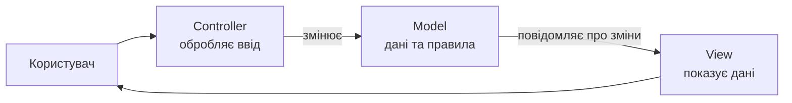
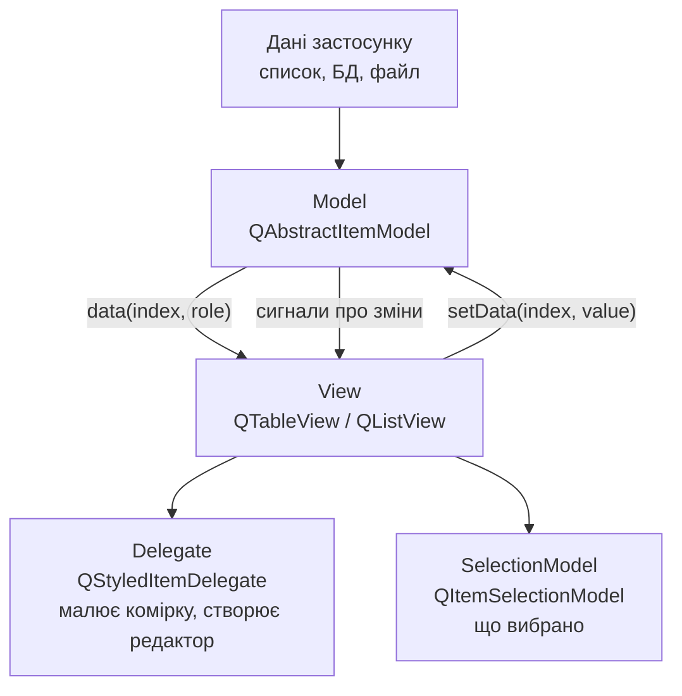
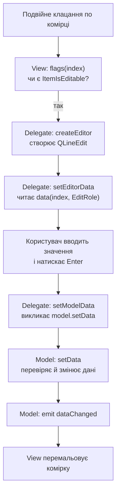
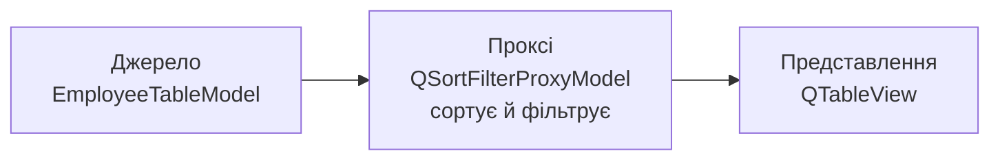
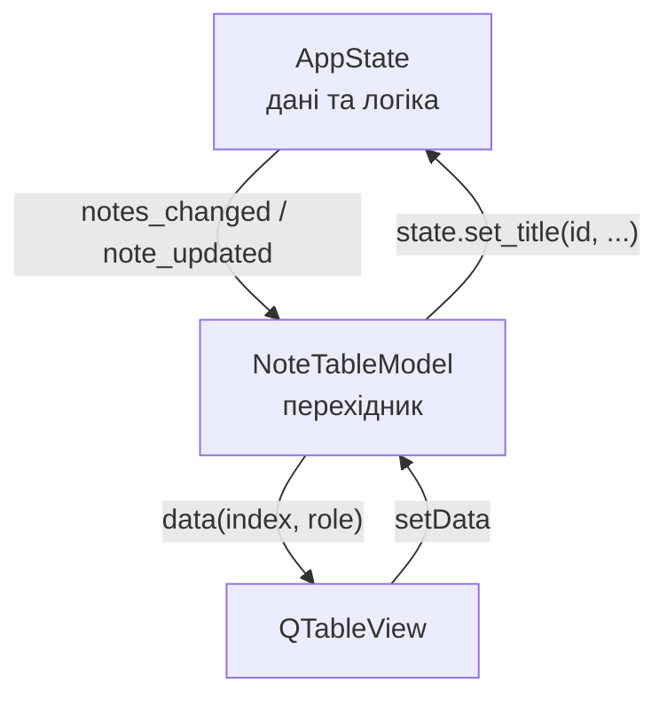

# 18. (Л) Модель–представлення (Model/View). Основи MVC. Представлення табличних даних

## Зміст лекції

1. Проблема: дані живуть у віджеті
2. MVC: звідки взявся поділ
3. Model/View у Qt: контролер зник, з'явився делегат
4. Карта класів
5. Перший застосунок: одна модель — два представлення
6. `QModelIndex`: адреса комірки
7. Ролі: одна комірка — багато значень
8. Готові моделі: `QStringListModel` і `QStandardItemModel`
9. Зручні віджети проти представлень
10. Власна модель: `QAbstractTableModel`
11. Редагування: `flags` → редактор → `setData`
12. Додавання й видалення рядків
13. Повна перебудова: `beginResetModel`
14. Сортування й фільтрація: `QSortFilterProxyModel`
15. Виділення: `QItemSelectionModel`
16. Налаштування `QTableView`
17. Делегат: власний редактор і власне малювання
18. Модель поверх спільного стану
19. Збірка: застосунок «Notes» з таблицею
20. Коли Model/View не потрібен
21. Типові помилки
22. Підсумок

## Проблема: дані живуть у віджеті

У [лекції 3](/ua/courses/programming-3sem/module1/03-basic-widgets-lecture/) ми показували списки через `QListWidget`, а таблиці — через `QTableWidget`. Виглядає це просто:

```python
        table = QTableWidget(0, 3)
        table.setHorizontalHeaderLabels(["Name", "Position", "Salary"])

        for employee in employees:
            row = table.rowCount()
            table.insertRow(row)
            table.setItem(row, 0, QTableWidgetItem(employee.name))
            table.setItem(row, 1, QTableWidgetItem(employee.position))
            table.setItem(row, 2, QTableWidgetItem(str(employee.salary)))
```

Поки записів десяток, а вікно одне, все гаразд. Проблеми починаються далі.

**Дані існують у двох екземплярах.** Список `employees` — це одна правда, комірки `QTableWidgetItem` — друга. Користувач відредагував комірку: змінився рядок у віджеті, а об'єкт `Employee` лишився старим. Тепер треба вручну писати «синхронізатор» в обидва боки, і кожна нова колонка додає до нього ще одну гілку.

**Тип втрачається.** У комірці лежить текст. Зарплата `9000` перетворюється на рядок `"9000"`, і сортування за цією колонкою ставить `"9000"` після `"51000"`, бо `"9"` більше за `"5"`. Щоб цього не сталося, доводиться вигадувати приховані колонки чи доповнювати числа нулями.

**Друге вікно означає третю копію.** Після [лекції 16](/ua/courses/programming-3sem/module2/16-multiwindow-apps-lecture/) ми знаємо: вікон може бути кілька. Кожен `QTableWidget` наповнюється окремо, і синхронізувати їх доводиться руками.

**Великі дані не влазять.** Десять тисяч рядків — це десять тисяч `QTableWidgetItem`, створених наперед, навіть якщо користувач побачить п'ятнадцять із них.

Порівняймо з тим, чого ми домоглися в [лекції 14](/ua/courses/programming-3sem/module2/14-app-state-structure-lecture/): дані живуть у `AppState`, а вікна лише перемальовуються з нього. Але `render()` там перебудовував список цілком:

```python
    def render(self):
        self.list_widget.clear()
        for note in self.state.notes():
            self.list_widget.addItem(note.display_title())
```

Для двадцяти нотаток це нормально. Для тисячі — помітне підморгування списку, втрачена позиція прокрутки й втрачене виділення при кожній зміні одного символу.

Потрібен механізм, у якому **віджет читає дані з об'єкта-джерела на вимогу**, а не отримує їхню копію. Саме це й робить Model/View.

## MVC: звідки взявся поділ

**MVC** (Model–View–Controller) — архітектурний шаблон, придуманий у кінці 1970-х у мові Smalltalk-80. Ідея: розділити застосунок на три частини з різними причинами для змін.



| Частина | Відповідає за | Не знає про |
|---|---|---|
| **Model** | дані, правила їх зміни, повідомлення про зміни | як саме їх показують |
| **View** | показ даних на екрані | звідки дані взялись |
| **Controller** | обробку дій користувача, виклик методів моделі | як дані намальовані |

Головна цінність — **напрямок залежностей**: модель не залежить ні від чого, представлення залежить від моделі, і ніколи навпаки. Логіку можна протестувати без інтерфейсу, а інтерфейс — замінити, не чіпаючи логіку.

Це та сама думка, з якої починалася [лекція 14](/ua/courses/programming-3sem/module2/14-app-state-structure-lecture/): `AppState` — це модель рівня застосунку, вікна — представлення, слоти — контролер. MVC у цій лекції — те саме правило, застосоване на менший масштаб: до **одного списку даних та одного віджета**.

!!! note "MVC — це сімейство, а не один шаблон"
    У різних середовищах межі проводять по-різному: MVP (Model–View–Presenter), MVVM (Model–View–ViewModel, звідки в Qt Quick прив'язки даних), Flux/Redux у вебі. Спільне в усіх — дані окремо, показ окремо. Різниця лише в тому, хто саме зв'язує їх докупи.

## Model/View у Qt: контролер зник, з'явився делегат

Qt реалізує **спрощений MVC**, який у документації називають **Model/View**. Відмінності дві.

**Перша: контролер злився з представленням.** Клацання по рядку, прокрутка, виділення, натискання `F2` — усе це обробляє сам віджет-представлення. Окремого класу-контролера немає.

**Друга: з'явився делегат.** Малювання окремої комірки й створення редактора для неї винесені в четвертий об'єкт — **делегат**. Це дозволяє змінити вигляд однієї колонки, не переписуючи ані модель, ані представлення.



Ключове правило всієї схеми:

!!! tip "Представлення не зберігає даних"
    `QTableView` не має власного списку рядків. Щоразу, коли треба намалювати комірку, він питає модель: `data(index, role)`. Тому видимі 15 рядків із мільйона коштують 15 викликів, а не мільйон об'єктів у пам'яті.

Хто за що відповідає:

| Об'єкт | Відповідає | Типовий клас |
|---|---|---|
| **Модель** | скільки рядків і колонок, що в комірці, чи можна редагувати, коли дані змінились | `QAbstractTableModel` |
| **Представлення** | розташування, прокрутка, заголовки, реакція на клавіші й миш | `QTableView` |
| **Делегат** | вигляд однієї комірки та її редактор | `QStyledItemDelegate` |
| **Модель виділення** | які комірки вибрані та де курсор | `QItemSelectionModel` |
| **Проксі** | сортування, фільтрація, перестановка колонок | `QSortFilterProxyModel` |

## Карта класів

Перед першим прикладом варто побачити всю сім'ю класів одразу — далі буде зрозуміліше, звідки що береться.

**Абстрактні моделі (від них успадковуються):**

| Клас | Коли брати |
|---|---|
| `QAbstractListModel` | одна колонка: список рядків, імен, файлів |
| `QAbstractTableModel` | таблиця: рядки й колонки, без вкладеності |
| `QAbstractItemModel` | дерево з довільною вкладеністю (найскладніший варіант) |

**Готові моделі (використовуються як є):**

| Клас | Що містить |
|---|---|
| `QStringListModel` | список рядків, редагований |
| `QStandardItemModel` | універсальне сховище комірок `QStandardItem` (список, таблиця або дерево) |
| `QFileSystemModel` | вміст каталогів файлової системи |
| `QSqlTableModel`, `QSqlQueryModel` | таблиця або результат запиту з бази даних |

**Проксі-моделі (стоять між моделлю й представленням):**

| Клас | Що робить |
|---|---|
| `QSortFilterProxyModel` | сортує та фільтрує рядки джерела |
| `QIdentityProxyModel` | нічого не змінює; основа для власного проксі |

**Представлення:**

| Клас | Показує |
|---|---|
| `QListView` | одну колонку списком або сіткою значків |
| `QTableView` | таблицю з заголовками рядків і колонок |
| `QTreeView` | дерево з розгортанням |
| `QColumnView` | дерево «колонками», як у Finder |

**Зручні віджети (модель усередині, назовні не видно):**

`QListWidget`, `QTableWidget`, `QTreeWidget` — це відповідні представлення з уже вбудованим `QStandardItemModel`. Про них — окремий розділ.

## Перший застосунок: одна модель — два представлення

Найкоротший спосіб відчути різницю — показати один об'єкт-модель у двох віджетах одразу.

```python
import sys

from PySide6.QtCore import QStringListModel
from PySide6.QtWidgets import (
    QApplication,
    QHBoxLayout,
    QLabel,
    QListView,
    QPushButton,
    QVBoxLayout,
    QWidget,
)


class Window(QWidget):
    """Дві незалежні панелі показують один і той самий об'єкт-модель."""

    def __init__(self):
        super().__init__()

        self.setWindowTitle("One model - two views")

        # Дані живуть тут, а не у віджетах.
        self.model = QStringListModel(["Alpha", "Beta", "Gamma"])

        left_view = QListView()
        left_view.setModel(self.model)

        right_view = QListView()
        right_view.setModel(self.model)

        add_button = QPushButton("Add item")
        add_button.clicked.connect(self.add_item)

        views = QHBoxLayout()
        views.addWidget(left_view)
        views.addWidget(right_view)

        layout = QVBoxLayout(self)
        layout.addWidget(QLabel("Edit an item in any view - both update."))
        layout.addLayout(views)
        layout.addWidget(add_button)

    def add_item(self):
        row = self.model.rowCount()

        # Модель сама повідомить обидва представлення про новий рядок.
        self.model.insertRow(row)
        self.model.setData(self.model.index(row, 0), f"Item {row + 1}")


def main():
    app = QApplication(sys.argv)

    window = Window()
    window.resize(480, 260)
    window.show()

    sys.exit(app.exec())


if __name__ == "__main__":
    main()
```

Запустіть і зробіть дві речі:

1. Двічі клацніть по елементу в лівому списку, змініть текст, натисніть `Enter` — правий список змінюється **сам**. Жодного рядка коду синхронізації в застосунку немає.
2. Натисніть `Add item` — новий рядок з'являється в обох списках.

Порівняйте з `QListWidget`: там на дві панелі потрібні дві копії даних і код, який тримає їх однаковими. Тут копій немає взагалі — є один об'єкт даних і два вікна в нього.

`setModel()` не передає віджету дані; він передає **посилання на джерело**. Далі віджет питає це джерело щоразу, коли малює рядок.

## `QModelIndex`: адреса комірки

Уся взаємодія моделі й представлення відбувається через `QModelIndex` — легкий об'єкт, який відповідає на питання «яка це комірка».

| Метод | Повертає |
|---|---|
| `index.row()` | номер рядка |
| `index.column()` | номер колонки |
| `index.parent()` | батьківський індекс (для таблиці — завжди недійсний) |
| `index.model()` | модель, якій індекс належить |
| `index.data(role)` | значення для ролі — короткий запис `index.model().data(index, role)` |
| `index.isValid()` | чи вказує індекс на існуючу комірку |

Індекси **не створюють вручну**: їх видає модель.

```python
index = model.index(2, 1)            # рядок 2, колонка 1
top_level = model.index(0, 0)        # у таблиці батько завжди кореневий
empty = QModelIndex()                # недійсний індекс = «корінь»
```

Недійсний `QModelIndex()` має особливий сенс: це **корінь моделі**. Саме тому в методах моделі параметр `parent` за замовчуванням дорівнює `QModelIndex()`, і саме тому в таблиці перевірка `parent.isValid()` означає «у мене питають про дітей комірки, а їх у таблиці не буває».

!!! danger "Не зберігайте `QModelIndex` у полі об'єкта"
    Індекс дійсний лише «зараз». Після вставки, видалення, сортування чи скидання моделі збережений індекс вказує **не туди** або стає недійсним — і код тихо працює з чужим рядком. Зберігати треба **ідентифікатор запису** (`note.id`), а індекс отримувати заново. Якщо індекс справді потрібно пережити зміну — існує `QPersistentModelIndex`, який модель оновлює автоматично; він дорожчий, тому його беруть лише за потреби.

## Ролі: одна комірка — багато значень

Комірка — це не одне значення, а набір значень, кожне зі своїм призначенням. Призначення позначають **роллю** (`Qt.ItemDataRole`).

| Роль | Що означає | Тип значення |
|---|---|---|
| `DisplayRole` | текст, який видно | `str` (типово) |
| `EditRole` | значення для редактора й для сортування | будь-який |
| `ToolTipRole` | підказка під курсором | `str` |
| `StatusTipRole` | текст у рядку стану | `str` |
| `DecorationRole` | значок ліворуч від тексту | `QIcon`, `QPixmap`, `QColor` |
| `TextAlignmentRole` | вирівнювання | `Qt.AlignmentFlag` |
| `FontRole` | шрифт комірки | `QFont` |
| `ForegroundRole` / `BackgroundRole` | колір тексту / тла | `QBrush`, `QColor` |
| `CheckStateRole` | стан галочки | `Qt.CheckState` |
| `SizeHintRole` | бажаний розмір комірки | `QSize` |
| `UserRole` | власні дані застосунку (`UserRole`, `UserRole + 1`, …) | будь-який |

Чому `DisplayRole` і `EditRole` розділені: показувати зручно `"42 000 UAH"`, а редагувати й сортувати треба число `42000`. Одна комірка віддає обидва значення — кожне за своєю роллю.

Типовий скелет методу `data()`:

```python
    def data(self, index, role=Qt.ItemDataRole.DisplayRole):
        if not index.isValid():
            return None

        if role == Qt.ItemDataRole.DisplayRole:
            return "text for the screen"

        if role == Qt.ItemDataRole.EditRole:
            return 42

        return None          # усі інші ролі модель не обслуговує
```

!!! warning "Невідома роль — поверніть `None`"
    Представлення питає комірку про десяток ролей поспіль. Якщо модель на будь-яку роль повертає рядок, Qt спробує використати його як шрифт, колір чи розмір — і комірка намалюється дивно або застосунок впаде. Правило: явна перевірка ролі, а наприкінці — `return None`.

Роль `UserRole` — стандартний спосіб покласти в комірку те, чого користувач не бачить: наприклад, `id` запису.

```python
        if role == Qt.ItemDataRole.UserRole:
            return note.id          # представлення не покаже, але код прочитає
```

## Готові моделі: `QStringListModel` і `QStandardItemModel`

Не для кожної задачі треба писати власний клас. Дві готові моделі покривають більшість дрібних випадків.

**`QStringListModel`** — список рядків. Одна колонка, редагування «з коробки», методи `stringList()` / `setStringList()`. Саме він був у першому прикладі.

**`QStandardItemModel`** — універсальне сховище комірок. Кожна комірка — окремий об'єкт `QStandardItem`, у якому ролі виставляють методами:

```python
import sys

from PySide6.QtCore import Qt
from PySide6.QtGui import QBrush, QColor, QStandardItem, QStandardItemModel
from PySide6.QtWidgets import QApplication, QTableView


ROWS = [
    ("Kyiv", 2952, True),
    ("Lviv", 717, False),
    ("Odesa", 1010, True),
]


def build_model():
    model = QStandardItemModel()
    model.setHorizontalHeaderLabels(["City", "Population, k", "Capital"])

    for name, population, is_capital in ROWS:
        name_item = QStandardItem(name)
        name_item.setToolTip(f"City of {name}")

        population_item = QStandardItem(str(population))
        population_item.setTextAlignment(
            Qt.AlignmentFlag.AlignRight | Qt.AlignmentFlag.AlignVCenter
        )
        if population > 1000:
            population_item.setForeground(QBrush(QColor("#b00020")))

        capital_item = QStandardItem()
        capital_item.setCheckable(True)
        capital_item.setCheckState(
            Qt.CheckState.Checked if is_capital else Qt.CheckState.Unchecked
        )

        model.appendRow([name_item, population_item, capital_item])

    return model


def main():
    app = QApplication(sys.argv)

    view = QTableView()
    view.setWindowTitle("QStandardItemModel")
    view.setModel(build_model())
    view.resizeColumnsToContents()
    view.resize(420, 200)
    view.show()

    sys.exit(app.exec())


if __name__ == "__main__":
    main()
```

`QStandardItemModel` зручний, але має ту саму ваду, що й `QTableWidget`: **дані в ньому лежать окремою копією**. Він добре підходить, коли таблиця — сама собі джерело (налаштування, довідник, разовий звіт), і погано — коли дані вже живуть у вашому `AppState`.

| Модель | Брати, коли |
|---|---|
| `QStringListModel` | простий список рядків, який нікуди більше не використовується |
| `QStandardItemModel` | невелика таблиця чи дерево, дані якої більше ніде не потрібні |
| Власна `QAbstractTableModel` | дані вже існують у застосунку (список об'єктів, `AppState`, БД) |

## Зручні віджети проти представлень

`QTableWidget` — це `QTableView` із уже вставленим `QStandardItemModel`. Звідси всі його властивості.

| Ознака | `QTableWidget` | `QTableView` + модель |
|---|---|---|
| Де дані | всередині віджета | у вашій моделі |
| Копія даних | так | ні |
| Кілька вікон з тими самими даними | кожне наповнюємо руками | усі беруть одну модель |
| Сортування за числом | через хитрощі | через `EditRole` |
| Фільтрація | ховати рядки вручну | `QSortFilterProxyModel` |
| Тисячі рядків | усі об'єкти створюються наперед | створюється лише видиме |
| Код на просту таблицю | коротший | довший |
| `setModel()` | **недоступний** | основний спосіб роботи |

Останній рядок часто застає зненацька: `QTableWidget.setModel()` викликати не можна — Qt виведе попередження й нічого не зробить. Якщо ви дійшли до власної моделі, віджет треба міняти на `QTableView`.

Не варто вважати зручні віджети «поганими»: для статичного списку з п'яти пунктів `QListWidget` — правильний вибір. Але щойно ті самі дані потрібні ще десь, час переходити на Model/View.

## Власна модель: `QAbstractTableModel`

Це основний клас лекції. Він перетворює **список ваших об'єктів** на таблицю, не копіюючи їх.

Обов'язковий мінімум — три методи, і майже завжди четвертий:

| Метод | Питання представлення | Обов'язковий |
|---|---|---|
| `rowCount(parent)` | скільки рядків? | так |
| `columnCount(parent)` | скільки колонок? | так |
| `data(index, role)` | що в цій комірці для цієї ролі? | так |
| `headerData(section, orientation, role)` | що написати в заголовку? | ні, але без нього заголовки — числа |

Модель тільки для читання виглядає так:

```python
import sys
from dataclasses import dataclass

from PySide6.QtCore import QAbstractTableModel, QModelIndex, Qt
from PySide6.QtWidgets import QApplication, QTableView


@dataclass
class Employee:
    name: str
    position: str
    salary: int


EMPLOYEES = [
    Employee("Ivan Petrenko", "Developer", 42000),
    Employee("Olena Koval", "Designer", 38000),
    Employee("Petro Shevchuk", "Manager", 51000),
]


class EmployeeTableModel(QAbstractTableModel):
    """Табличне представлення списку об'єктів. Тільки читання."""

    COLUMNS = ["Name", "Position", "Salary"]

    def __init__(self, employees, parent=None):
        super().__init__(parent)
        self._employees = employees

    # ---------------------------------------------------------- розмір

    def rowCount(self, parent=QModelIndex()):
        # У таблиці рядки має лише корінь: у комірок дітей немає.
        if parent.isValid():
            return 0
        return len(self._employees)

    def columnCount(self, parent=QModelIndex()):
        if parent.isValid():
            return 0
        return len(self.COLUMNS)

    # ----------------------------------------------------------- дані

    def data(self, index, role=Qt.ItemDataRole.DisplayRole):
        if not index.isValid():
            return None

        employee = self._employees[index.row()]
        column = index.column()

        if role == Qt.ItemDataRole.DisplayRole:
            if column == 0:
                return employee.name
            if column == 1:
                return employee.position
            if column == 2:
                return f"{employee.salary:,}".replace(",", " ")

        if role == Qt.ItemDataRole.TextAlignmentRole and column == 2:
            return Qt.AlignmentFlag.AlignRight | Qt.AlignmentFlag.AlignVCenter

        if role == Qt.ItemDataRole.ToolTipRole:
            return f"{employee.name} - {employee.position}"

        # Роль, яку модель не обслуговує: явно нічого.
        return None

    def headerData(self, section, orientation, role=Qt.ItemDataRole.DisplayRole):
        if role != Qt.ItemDataRole.DisplayRole:
            return None

        if orientation == Qt.Orientation.Horizontal:
            return self.COLUMNS[section]

        return section + 1


def main():
    app = QApplication(sys.argv)

    model = EmployeeTableModel(EMPLOYEES)

    view = QTableView()
    view.setWindowTitle("QAbstractTableModel")
    view.setModel(model)
    view.resizeColumnsToContents()
    view.resize(480, 200)
    view.show()

    sys.exit(app.exec())


if __name__ == "__main__":
    main()
```

Що тут важливо помітити.

**Модель не володіє даними.** У конструктор передали той самий список `EMPLOYEES`, який живе в застосунку. Копії немає — отже, немає й розсинхронізації.

**Перевірка `parent.isValid()`.** У таблиці дітей у комірок немає, тому на питання «скільки рядків усередині комірки (1, 2)?» модель зобов'язана відповісти `0`. Без цієї перевірки модель, показана в `QTreeView`, «розгортатиметься» нескінченно, а деякі проксі почнуть рахувати рядки вдвічі.

**`headerData` для вертикального заголовка** повертає `section + 1` — нумерацію рядків з одиниці. Повернете `None` — побачите порожні комірки заголовка.

**Аргументи за замовчуванням обов'язкові.** `rowCount(self, parent=QModelIndex())` — Qt викликає метод і з аргументом, і без нього; ваш код може викликати `model.rowCount()`.

!!! warning "`data()` і `rowCount()` викликаються дуже часто"
    Для кожної видимої комірки — щонайменше десяток викликів `data()` при кожній перемальовці, і ще стільки ж під час прокрутки. Тому всередині цих методів не місце для запитів до бази, читання файлів чи важких обчислень: усе, що дорого, має бути обчислене заздалегідь і лежати в об'єкті рядка.

## Редагування: `flags` → редактор → `setData`

Модель із попереднього розділу — тільки для читання: подвійне клацання нічого не відкриває. Щоб таблицю можна було редагувати, потрібні два методи.

Ось повний ланцюжок того, що відбувається під час редагування:



**`flags()`** повідомляє, що з коміркою дозволено робити:

| Прапорець | Дозволяє |
|---|---|
| `ItemIsEnabled` | комірка активна (без нього — сіра й недоступна) |
| `ItemIsSelectable` | комірку можна вибрати |
| `ItemIsEditable` | комірку можна редагувати |
| `ItemIsUserCheckable` | у комірці є галочка, яку можна перемикати |
| `ItemIsDragEnabled` / `ItemIsDropEnabled` | перетягування |

Прапорці можна видавати вибірково — наприклад, редагувати дозволити лише першу колонку:

```python
    def flags(self, index):
        if not index.isValid():
            return Qt.ItemFlag.NoItemFlags

        flags = Qt.ItemFlag.ItemIsEnabled | Qt.ItemFlag.ItemIsSelectable

        if index.column() == 0:
            flags |= Qt.ItemFlag.ItemIsEditable

        return flags
```

**`setData()`** приймає нове значення. У нього чотири обов'язки:

1. перевірити роль і індекс;
2. перевірити саме значення (валідація живе тут);
3. записати зміну в дані;
4. повідомити про зміну сигналом `dataChanged` і повернути `True`.

```python
    def setData(self, index, value, role=Qt.ItemDataRole.EditRole):
        if not index.isValid() or role != Qt.ItemDataRole.EditRole:
            return False

        try:
            salary = int(value)
        except (TypeError, ValueError):
            return False            # значення не прийняли

        self._employees[index.row()].salary = salary
        self.dataChanged.emit(index, index, [role])
        return True
```

!!! danger "`False` означає «не прийняв», а не «сталася помилка»"
    Якщо `setData()` повертає `False`, представлення вважає, що значення відхилено: комірка лишається зі старим вмістом. Це штатний спосіб відмовити в неправильному вводі. А от повернути `True`, **не надіславши `dataChanged`**, — типова помилка: дані змінились, а на екрані старе значення.

Сигнал `dataChanged` приймає діапазон комірок: лівий верхній і правий нижній індекси. Якщо змінилась одна комірка — обидва індекси однакові. Якщо змінився весь рядок:

```python
        left = self.index(row, 0)
        right = self.index(row, self.columnCount() - 1)
        self.dataChanged.emit(left, right)
```

Третій аргумент — список ролей, що змінились. Він необов'язковий, але корисний: представлення й проксі можуть на ньому заощадити роботу.

Повний застосунок із редагуванням, вставкою й видаленням (методи вставки розберемо в наступному розділі):

```python
import sys
from dataclasses import dataclass

from PySide6.QtCore import QAbstractTableModel, QModelIndex, Qt
from PySide6.QtWidgets import (
    QAbstractItemView,
    QApplication,
    QHBoxLayout,
    QHeaderView,
    QPushButton,
    QTableView,
    QVBoxLayout,
    QWidget,
)


@dataclass
class Employee:
    name: str
    position: str
    salary: int


class EmployeeTableModel(QAbstractTableModel):
    """Редагована модель зі вставкою та видаленням рядків."""

    COLUMNS = ["Name", "Position", "Salary"]

    def __init__(self, employees, parent=None):
        super().__init__(parent)
        self._employees = list(employees)

    def rowCount(self, parent=QModelIndex()):
        return 0 if parent.isValid() else len(self._employees)

    def columnCount(self, parent=QModelIndex()):
        return 0 if parent.isValid() else len(self.COLUMNS)

    def data(self, index, role=Qt.ItemDataRole.DisplayRole):
        if not index.isValid():
            return None

        employee = self._employees[index.row()]
        column = index.column()

        if role in (Qt.ItemDataRole.DisplayRole, Qt.ItemDataRole.EditRole):
            if column == 0:
                return employee.name
            if column == 1:
                return employee.position
            if column == 2:
                return employee.salary

        if role == Qt.ItemDataRole.TextAlignmentRole and column == 2:
            return Qt.AlignmentFlag.AlignRight | Qt.AlignmentFlag.AlignVCenter

        return None

    def headerData(self, section, orientation, role=Qt.ItemDataRole.DisplayRole):
        if role != Qt.ItemDataRole.DisplayRole:
            return None

        if orientation == Qt.Orientation.Horizontal:
            return self.COLUMNS[section]

        return section + 1

    # -------------------------------------------------------- редагування

    def flags(self, index):
        if not index.isValid():
            return Qt.ItemFlag.NoItemFlags

        return (
            Qt.ItemFlag.ItemIsEnabled
            | Qt.ItemFlag.ItemIsSelectable
            | Qt.ItemFlag.ItemIsEditable
        )

    def setData(self, index, value, role=Qt.ItemDataRole.EditRole):
        if not index.isValid() or role != Qt.ItemDataRole.EditRole:
            return False

        employee = self._employees[index.row()]
        column = index.column()

        if column == 0:
            text = str(value).strip()
            if not text:
                return False            # порожнє ім'я не приймаємо
            employee.name = text
        elif column == 1:
            employee.position = str(value).strip()
        elif column == 2:
            try:
                salary = int(value)
            except (TypeError, ValueError):
                return False            # не число - значення відхилено
            if salary < 0:
                return False
            employee.salary = salary
        else:
            return False

        # Без цього сигналу представлення не дізнається про зміну.
        self.dataChanged.emit(index, index, [role, Qt.ItemDataRole.DisplayRole])
        return True

    # ------------------------------------------------- вставка й видалення

    def add_employee(self, employee):
        row = len(self._employees)

        self.beginInsertRows(QModelIndex(), row, row)
        self._employees.append(employee)
        self.endInsertRows()

        return row

    def remove_row(self, row):
        if not 0 <= row < len(self._employees):
            return False

        self.beginRemoveRows(QModelIndex(), row, row)
        del self._employees[row]
        self.endRemoveRows()

        return True

    def employees(self):
        return tuple(self._employees)


class Window(QWidget):
    def __init__(self):
        super().__init__()

        self.setWindowTitle("Editable table model")

        self.model = EmployeeTableModel(
            [
                Employee("Ivan Petrenko", "Developer", 42000),
                Employee("Olena Koval", "Designer", 38000),
            ]
        )

        self.view = QTableView()
        self.view.setModel(self.model)
        self.view.setSelectionBehavior(QAbstractItemView.SelectionBehavior.SelectRows)
        self.view.setSelectionMode(QAbstractItemView.SelectionMode.SingleSelection)
        self.view.horizontalHeader().setSectionResizeMode(
            QHeaderView.ResizeMode.Stretch
        )
        self.view.verticalHeader().setVisible(False)

        add_button = QPushButton("Add row")
        add_button.clicked.connect(self.add_row)

        remove_button = QPushButton("Remove selected")
        remove_button.clicked.connect(self.remove_selected)

        buttons = QHBoxLayout()
        buttons.addWidget(add_button)
        buttons.addWidget(remove_button)
        buttons.addStretch()

        layout = QVBoxLayout(self)
        layout.addWidget(self.view)
        layout.addLayout(buttons)

    def add_row(self):
        row = self.model.add_employee(Employee("New employee", "Trainee", 0))

        index = self.model.index(row, 0)
        self.view.setCurrentIndex(index)
        self.view.edit(index)          # одразу відкриваємо редактор

    def remove_selected(self):
        index = self.view.currentIndex()
        if index.isValid():
            self.model.remove_row(index.row())


def main():
    app = QApplication(sys.argv)

    window = Window()
    window.resize(560, 260)
    window.show()

    sys.exit(app.exec())


if __name__ == "__main__":
    main()
```

Спробуйте ввести в колонку `Salary` текст `abc` — редактор не закриється, бо `setData()` повернув `False`. Введіть `-100` — те саме. Введіть `50000` — значення з'явиться в таблиці.

## Додавання й видалення рядків

Найпоширеніша причина падінь у Model/View — **зміна списку без повідомлення моделі**:

```python
    def add_employee(self, employee):
        self._employees.append(employee)      # ПОМИЛКА: ніхто не знає
```

Представлення досі вважає, що рядків було три; смуга прокрутки не змінилась; а щойно віджет спробує намалювати новий рядок, поведінка стане непередбачуваною — від «нічого не з'явилось» до `IndexError` під час прокрутки.

Модель зобов'язана обгорнути кожну структурну зміну в пару викликів:

| Дія | Пара викликів |
|---|---|
| вставка рядків | `beginInsertRows(parent, first, last)` … `endInsertRows()` |
| видалення рядків | `beginRemoveRows(parent, first, last)` … `endRemoveRows()` |
| вставка колонок | `beginInsertColumns(...)` … `endInsertColumns()` |
| видалення колонок | `beginRemoveColumns(...)` … `endRemoveColumns()` |
| переміщення рядків | `beginMoveRows(...)` … `endMoveRows()` |
| усе змінилось | `beginResetModel()` … `endResetModel()` |

Три деталі, на яких спотикаються:

**`first` і `last` включно.** Один рядок на позиції `row` — це `beginInsertRows(QModelIndex(), row, row)`, а не `row, row + 1`.

**Номери рядків — після вставки й до видалення.** Для вставки вказують позиції, які нові рядки **займуть**; для видалення — позиції, які рядки **зараз займають**.

**Дані змінюють між `begin` і `end`.** Порядок «спершу `begin`, потім зміна списку, потім `end`» — не стилістична забаганка: між цими викликами Qt зберігає й оновлює виділення та відкриті редактори.

```python
    def add_employee(self, employee):
        row = len(self._employees)

        self.beginInsertRows(QModelIndex(), row, row)
        self._employees.append(employee)
        self.endInsertRows()
```

!!! tip "Вставляти можна не тільки в кінець"
    `beginInsertRows(QModelIndex(), 0, 0)` + `self._employees.insert(0, employee)` додасть рядок на початок. Головне, щоб номери в `begin...` збігалися з тим, що ви реально робите зі списком.

Окремо існують віртуальні методи `insertRows()` / `removeRows()`. Їх перевизначають, коли рядки має вставляти **хтось ззовні** — наприклад, редагована `QStringListModel` або механізм drag-and-drop. Для власного застосунку зазвичай зручніше мати осмислені методи (`add_employee`, `remove_row`), які самі викликають пару `begin`/`end`.

## Повна перебудова: `beginResetModel`

Коли змінилось не кілька рядків, а весь набір даних — завантажили інший файл, перечитали таблицю з БД, застосували нове сортування в джерелі — використовують скидання:

```python
    def reload(self, employees):
        self.beginResetModel()
        self._employees = list(employees)
        self.endResetModel()
```

Це найпростіший і найгрубіший інструмент.

| | `dataChanged` / `begin*Rows` | `beginResetModel` |
|---|---|---|
| Що оновлюється | точково | усе представлення |
| Виділення | зберігається | **втрачається** |
| Позиція прокрутки | зберігається | скидається |
| Відкритий редактор | лишається | закривається |
| Складність коду | треба знати, що саме змінилось | нічого знати не треба |

Тому правило таке: **скидання — для заміни всього набору даних, точкові сигнали — для звичайної роботи**. Якщо кожне натискання клавіші в полі пошуку скидає модель, користувач втрачатиме виділення й позицію в списку на кожен символ.

## Сортування й фільтрація: `QSortFilterProxyModel`

Сортувати й фільтрувати всередині власної моделі не потрібно. Для цього між моделлю й представленням ставлять **проксі**:



Проксі — теж модель: у нього є рядки, колонки й `data()`. Різниця в тому, що власних даних він не має, а лише **переставляє й приховує рядки джерела**.

Мінімальне під'єднання:

```python
        proxy = QSortFilterProxyModel()
        proxy.setSourceModel(model)
        proxy.setFilterKeyColumn(-1)                            # шукати в усіх колонках
        proxy.setFilterCaseSensitivity(Qt.CaseSensitivity.CaseInsensitive)
        proxy.setSortRole(Qt.ItemDataRole.EditRole)             # сортувати за EditRole

        view.setModel(proxy)                                   # представлення бачить проксі
        view.setSortingEnabled(True)                           # клацання по заголовку сортує

        search_edit.textChanged.connect(proxy.setFilterFixedString)
```

Корисні налаштування:

| Метод | Що робить |
|---|---|
| `setSourceModel(model)` | вказує джерело |
| `setFilterFixedString(text)` | лишає рядки, що містять підрядок |
| `setFilterRegularExpression(pattern)` | фільтр за регулярним виразом |
| `setFilterKeyColumn(n)` | колонка для фільтра; `-1` — усі колонки |
| `setFilterRole(role)` | роль, за якою фільтрувати (типово `DisplayRole`) |
| `setSortRole(role)` | роль, за якою сортувати |
| `sort(column, order)` | відсортувати з коду |
| `setDynamicSortFilter(True)` | перефільтровувати автоматично після змін у джерелі (типово увімкнено) |
| `invalidateFilter()` | перепитати власний фільтр після зміни його критеріїв |

!!! tip "`setSortRole(EditRole)` — головна причина, чому число сортується як число"
    Типово проксі сортує за `DisplayRole`, тобто за текстом: `"9000"` виявиться більшим за `"51000"`. Якщо `data()` повертає для `EditRole` справжнє число, а проксі налаштований на `EditRole`, сортування стає правильним без жодних хитрощів.

Коли стандартного фільтра замало, успадковують проксі й перевизначають `filterAcceptsRow()` (які рядки лишити) та за потреби `lessThan()` (як порівнювати).

Найважливіше правило роботи з проксі:

!!! danger "Індекс проксі — не індекс джерела"
    `view.currentIndex().row()` — це номер рядка **на екрані**. Після сортування чи фільтрації він не збігається з номером у вашому списку. Переклад роблять явно: `proxy.mapToSource(proxy_index)` — у джерело, `proxy.mapFromSource(source_index)` — назад. Найнадійніше взагалі не працювати з номерами рядків, а брати з моделі `id` запису.

Повний приклад: пошук за текстом, фільтр за мінімальною зарплатою, сортування клацанням по заголовку і переклад індексів під час виділення.

```python
import sys
from dataclasses import dataclass

from PySide6.QtCore import (
    QAbstractTableModel,
    QModelIndex,
    QSortFilterProxyModel,
    Qt,
)
from PySide6.QtWidgets import (
    QAbstractItemView,
    QApplication,
    QHBoxLayout,
    QHeaderView,
    QLabel,
    QLineEdit,
    QSpinBox,
    QTableView,
    QVBoxLayout,
    QWidget,
)


@dataclass
class Employee:
    name: str
    position: str
    salary: int


EMPLOYEES = [
    Employee("Ivan Petrenko", "Developer", 42000),
    Employee("Olena Koval", "Designer", 38000),
    Employee("Petro Shevchuk", "Manager", 51000),
    Employee("Maria Bondar", "Developer", 9000),
    Employee("Andrii Tkachuk", "QA engineer", 33000),
]


class EmployeeTableModel(QAbstractTableModel):
    COLUMNS = ["Name", "Position", "Salary"]

    def __init__(self, employees, parent=None):
        super().__init__(parent)
        self._employees = list(employees)

    def rowCount(self, parent=QModelIndex()):
        return 0 if parent.isValid() else len(self._employees)

    def columnCount(self, parent=QModelIndex()):
        return 0 if parent.isValid() else len(self.COLUMNS)

    def data(self, index, role=Qt.ItemDataRole.DisplayRole):
        if not index.isValid():
            return None

        employee = self._employees[index.row()]
        column = index.column()

        if role == Qt.ItemDataRole.DisplayRole:
            if column == 0:
                return employee.name
            if column == 1:
                return employee.position
            if column == 2:
                return f"{employee.salary} UAH"

        if role == Qt.ItemDataRole.EditRole:
            # Сортування читатиме саме цю роль: тут число, а не текст.
            if column == 0:
                return employee.name
            if column == 1:
                return employee.position
            if column == 2:
                return employee.salary

        if role == Qt.ItemDataRole.TextAlignmentRole and column == 2:
            return Qt.AlignmentFlag.AlignRight | Qt.AlignmentFlag.AlignVCenter

        return None

    def headerData(self, section, orientation, role=Qt.ItemDataRole.DisplayRole):
        if role != Qt.ItemDataRole.DisplayRole:
            return None

        if orientation == Qt.Orientation.Horizontal:
            return self.COLUMNS[section]

        return section + 1

    def employee_at(self, row):
        return self._employees[row]


class EmployeeFilterProxy(QSortFilterProxyModel):
    """Два незалежні критерії: підрядок у тексті та мінімальна зарплата."""

    def __init__(self, parent=None):
        super().__init__(parent)

        self._text = ""
        self._min_salary = 0

    def set_search_text(self, text):
        self._text = text.strip().lower()
        self.invalidateFilter()          # перепитати filterAcceptsRow для всіх рядків

    def set_min_salary(self, value):
        self._min_salary = value
        self.invalidateFilter()

    def filterAcceptsRow(self, source_row, source_parent):
        model = self.sourceModel()

        salary = model.index(source_row, 2, source_parent).data(
            Qt.ItemDataRole.EditRole
        )
        if salary < self._min_salary:
            return False

        if not self._text:
            return True

        name = model.index(source_row, 0, source_parent).data() or ""
        position = model.index(source_row, 1, source_parent).data() or ""

        return self._text in name.lower() or self._text in position.lower()


class Window(QWidget):
    def __init__(self):
        super().__init__()

        self.setWindowTitle("Sorting and filtering")

        self.model = EmployeeTableModel(EMPLOYEES)

        self.proxy = EmployeeFilterProxy()
        self.proxy.setSourceModel(self.model)
        self.proxy.setSortRole(Qt.ItemDataRole.EditRole)

        self.view = QTableView()
        self.view.setModel(self.proxy)            # представлення бачить лише проксі
        self.view.setSortingEnabled(True)
        self.view.sortByColumn(0, Qt.SortOrder.AscendingOrder)
        self.view.setSelectionBehavior(QAbstractItemView.SelectionBehavior.SelectRows)
        self.view.setSelectionMode(QAbstractItemView.SelectionMode.SingleSelection)
        self.view.setEditTriggers(QAbstractItemView.EditTrigger.NoEditTriggers)
        self.view.horizontalHeader().setSectionResizeMode(QHeaderView.ResizeMode.Stretch)
        self.view.verticalHeader().setVisible(False)
        self.view.selectionModel().currentChanged.connect(self.on_current_changed)

        self.search_edit = QLineEdit()
        self.search_edit.setPlaceholderText("Search by name or position")
        self.search_edit.textChanged.connect(self.proxy.set_search_text)

        self.salary_spin = QSpinBox()
        self.salary_spin.setRange(0, 100000)
        self.salary_spin.setSingleStep(1000)
        self.salary_spin.valueChanged.connect(self.proxy.set_min_salary)

        self.status_label = QLabel("Nothing selected")

        filters = QHBoxLayout()
        filters.addWidget(self.search_edit)
        filters.addWidget(QLabel("Min salary:"))
        filters.addWidget(self.salary_spin)

        layout = QVBoxLayout(self)
        layout.addLayout(filters)
        layout.addWidget(self.view)
        layout.addWidget(self.status_label)

    def on_current_changed(self, current, previous):
        if not current.isValid():
            self.status_label.setText("Nothing selected")
            return

        # Індекс належить проксі; дані живуть у джерелі.
        source_index = self.proxy.mapToSource(current)
        employee = self.model.employee_at(source_index.row())

        self.status_label.setText(
            f"View row {current.row()} -> source row {source_index.row()}: {employee.name}"
        )


def main():
    app = QApplication(sys.argv)

    window = Window()
    window.resize(620, 320)
    window.show()

    sys.exit(app.exec())


if __name__ == "__main__":
    main()
```

Поклацайте по заголовку `Salary`: сортування правильне саме тому, що `EditRole` віддає число. Введіть `dev` у пошук — лишаться два розробники. Виберіть рядок і подивіться на підпис унизу: номер рядка на екрані й номер у джерелі зазвичай різні.

Проксі можна ставити ланцюжком: джерело → фільтр за категорією → фільтр за текстом → представлення. Кожен наступний вважає попередній своїм джерелом.

## Виділення: `QItemSelectionModel`

Виділення — теж окремий об'єкт. Представлення створює його автоматично, а дістати можна методом `view.selectionModel()`.

Розрізняють два поняття:

| Поняття | Що це | Скільки |
|---|---|---|
| **поточний індекс** (`currentIndex`) | комірка з фокусом клавіатури, обведена рамкою | завжди одна |
| **виділення** (`selection`) | набір вибраних комірок чи рядків | скільки завгодно |

Зазвичай вони збігаються, але не завжди: `Ctrl` + клацання переносить курсор, не змінюючи виділення.

Основні сигнали:

| Сигнал | Коли надходить | Аргументи |
|---|---|---|
| `currentChanged` | змінилась комірка з фокусом | `current`, `previous` |
| `selectionChanged` | змінився набір вибраного | `selected`, `deselected` |
| `currentRowChanged` | фокус перейшов на інший рядок | `current`, `previous` |

Для «однорядкового» списку зручний саме `currentChanged`:

```python
        view.selectionModel().currentChanged.connect(self.on_current_changed)
```

Режими виділення налаштовують на представленні:

```python
        view.setSelectionBehavior(QAbstractItemView.SelectionBehavior.SelectRows)
        view.setSelectionMode(QAbstractItemView.SelectionMode.SingleSelection)
```

| Метод | Значення | Ефект |
|---|---|---|
| `setSelectionBehavior` | `SelectItems` / `SelectRows` / `SelectColumns` | що саме виділяється |
| `setSelectionMode` | `SingleSelection` / `ExtendedSelection` / `MultiSelection` / `NoSelection` | скільки одночасно |

Прочитати виділені рядки:

```python
        indexes = view.selectionModel().selectedRows()      # по одному індексу на рядок
        rows = [index.row() for index in indexes]
```

І головна практична деталь, якщо виділення синхронізується зі спільним станом: **петля**. Клацання змінює виділення → слот кличе `state.select(id)` → стан надсилає `selection_changed` → вікно ставить виділення → представлення знову надсилає `currentChanged`… Розривають її тим самим прапорцем, що й у [лекції 16](/ua/courses/programming-3sem/module2/16-multiwindow-apps-lecture/):

```python
    def _restore_selection(self):
        self._syncing = True
        try:
            ...                       # програмна зміна виділення
        finally:
            self._syncing = False

    def _on_current_changed(self, current, previous):
        if self._syncing:
            return
        ...
```

## Налаштування `QTableView`

Таблиця «з коробки» виглядає посередньо: колонки однакової ширини, зайвий вертикальний заголовок, редагування вмикається випадковим клацанням. Кілька рядків це виправляють.

| Виклик | Ефект |
|---|---|
| `view.horizontalHeader().setSectionResizeMode(col, mode)` | як змінюється ширина колонки |
| `view.horizontalHeader().setStretchLastSection(True)` | остання колонка займає залишок |
| `view.verticalHeader().setVisible(False)` | сховати нумерацію рядків |
| `view.setAlternatingRowColors(True)` | смугасті рядки |
| `view.setShowGrid(False)` | прибрати сітку |
| `view.setSortingEnabled(True)` | сортування клацанням по заголовку |
| `view.setEditTriggers(...)` | чим відкривається редактор |
| `view.setColumnHidden(col, True)` | сховати колонку (наприклад, службовий `id`) |
| `view.resizeColumnsToContents()` | підігнати ширину під вміст один раз |
| `view.setWordWrap(False)` | не переносити довгий текст |

Режими ширини колонки (`QHeaderView.ResizeMode`):

| Режим | Поведінка |
|---|---|
| `Interactive` | користувач тягне межу (типово) |
| `Fixed` | ширина не змінюється |
| `Stretch` | ділить вільне місце порівну |
| `ResizeToContents` | точно під вміст, користувач змінити не може |

Тригери редагування (`QAbstractItemView.EditTrigger`):

| Тригер | Коли відкривається редактор |
|---|---|
| `NoEditTriggers` | ніколи (таблиця тільки для читання) |
| `DoubleClicked` | подвійне клацання |
| `SelectedClicked` | клацання по вже вибраній комірці |
| `EditKeyPressed` | `F2` |
| `AnyKeyPressed` | будь-яка друкована клавіша |
| `AllEditTriggers` | усе перелічене |

Типовий набір для таблиці-списку записів:

```python
        view.setSelectionBehavior(QAbstractItemView.SelectionBehavior.SelectRows)
        view.setSelectionMode(QAbstractItemView.SelectionMode.SingleSelection)
        view.setEditTriggers(QAbstractItemView.EditTrigger.DoubleClicked)
        view.setAlternatingRowColors(True)
        view.verticalHeader().setVisible(False)
        view.horizontalHeader().setStretchLastSection(True)
```

!!! warning "`resizeColumnsToContents()` на великій таблиці — дорого"
    Щоб порахувати ширину, Qt опитує **кожен** рядок. На десятках тисяч записів це помітна пауза. Для великих таблиць беруть `Stretch`, фіксовану ширину або `setResizeContentsPrecision(n)`, що обмежує кількість опитаних рядків.

## Делегат: власний редактор і власне малювання

Делегат відповідає за одну комірку: як вона виглядає і чим редагується. За замовчуванням працює `QStyledItemDelegate` — він малює текст у стилі системи й дає `QLineEdit` для редагування.

| Метод | Навіщо перевизначають |
|---|---|
| `createEditor(parent, option, index)` | дати інший віджет-редактор (`QComboBox`, `QSpinBox`, `QDateEdit`) |
| `setEditorData(editor, index)` | покласти значення з моделі в редактор |
| `setModelData(editor, model, index)` | забрати значення з редактора в модель |
| `updateEditorGeometry(editor, option, index)` | розмістити редактор у межах комірки |
| `displayText(value, locale)` | змінити текст без зміни даних (формат чисел, дат) |
| `paint(painter, option, index)` | намалювати комірку самостійно |
| `sizeHint(option, index)` | сказати бажаний розмір комірки |

Встановлюють делегат на все представлення або на окрему колонку:

```python
        view.setItemDelegate(delegate)                 # на всю таблицю
        view.setItemDelegateForColumn(2, delegate)     # тільки на колонку 2
        view.setItemDelegateForRow(0, delegate)        # тільки на рядок 0
```

Приклад із двома делегатами: список фіксованих значень для посади і числове поле для зарплати.

```python
import sys
from dataclasses import dataclass

from PySide6.QtCore import QAbstractTableModel, QModelIndex, Qt
from PySide6.QtWidgets import (
    QApplication,
    QComboBox,
    QHeaderView,
    QSpinBox,
    QStyledItemDelegate,
    QTableView,
)

POSITIONS = ["Developer", "Designer", "Manager", "QA engineer"]


@dataclass
class Employee:
    name: str
    position: str
    salary: int


class EmployeeTableModel(QAbstractTableModel):
    COLUMNS = ["Name", "Position", "Salary"]

    def __init__(self, employees, parent=None):
        super().__init__(parent)
        self._employees = list(employees)

    def rowCount(self, parent=QModelIndex()):
        return 0 if parent.isValid() else len(self._employees)

    def columnCount(self, parent=QModelIndex()):
        return 0 if parent.isValid() else len(self.COLUMNS)

    def data(self, index, role=Qt.ItemDataRole.DisplayRole):
        if not index.isValid():
            return None

        employee = self._employees[index.row()]

        if role in (Qt.ItemDataRole.DisplayRole, Qt.ItemDataRole.EditRole):
            return [employee.name, employee.position, employee.salary][index.column()]

        return None

    def headerData(self, section, orientation, role=Qt.ItemDataRole.DisplayRole):
        if role == Qt.ItemDataRole.DisplayRole and orientation == Qt.Orientation.Horizontal:
            return self.COLUMNS[section]
        return None

    def flags(self, index):
        if not index.isValid():
            return Qt.ItemFlag.NoItemFlags

        return (
            Qt.ItemFlag.ItemIsEnabled
            | Qt.ItemFlag.ItemIsSelectable
            | Qt.ItemFlag.ItemIsEditable
        )

    def setData(self, index, value, role=Qt.ItemDataRole.EditRole):
        if not index.isValid() or role != Qt.ItemDataRole.EditRole:
            return False

        employee = self._employees[index.row()]
        column = index.column()

        if column == 0:
            employee.name = str(value)
        elif column == 1:
            employee.position = str(value)
        elif column == 2:
            employee.salary = int(value)
        else:
            return False

        self.dataChanged.emit(index, index, [role])
        return True


class PositionDelegate(QStyledItemDelegate):
    """Замість рядкового поля - список фіксованих значень."""

    def createEditor(self, parent, option, index):
        editor = QComboBox(parent)
        editor.addItems(POSITIONS)
        return editor

    def setEditorData(self, editor, index):
        value = index.data(Qt.ItemDataRole.EditRole)
        position = editor.findText(str(value))
        editor.setCurrentIndex(position if position >= 0 else 0)

    def setModelData(self, editor, model, index):
        model.setData(index, editor.currentText(), Qt.ItemDataRole.EditRole)


class SalaryDelegate(QStyledItemDelegate):
    """Числове поле з межами й кроком."""

    def createEditor(self, parent, option, index):
        editor = QSpinBox(parent)
        editor.setRange(0, 200000)
        editor.setSingleStep(500)
        editor.setSuffix(" UAH")
        return editor

    def setEditorData(self, editor, index):
        editor.setValue(int(index.data(Qt.ItemDataRole.EditRole) or 0))

    def setModelData(self, editor, model, index):
        editor.interpretText()          # врахувати текст, який ще не підтверджено
        model.setData(index, editor.value(), Qt.ItemDataRole.EditRole)

    def displayText(self, value, locale):
        return f"{value} UAH"


def main():
    app = QApplication(sys.argv)

    model = EmployeeTableModel(
        [
            Employee("Ivan Petrenko", "Developer", 42000),
            Employee("Olena Koval", "Designer", 38000),
        ]
    )

    view = QTableView()
    view.setWindowTitle("Delegates")
    view.setModel(model)
    view.setItemDelegateForColumn(1, PositionDelegate(view))
    view.setItemDelegateForColumn(2, SalaryDelegate(view))
    view.horizontalHeader().setSectionResizeMode(QHeaderView.ResizeMode.Stretch)
    view.resize(560, 200)
    view.show()

    sys.exit(app.exec())


if __name__ == "__main__":
    main()
```

Зверніть увагу на розподіл обов'язків: делегат **не змінює дані сам**, він викликає `model.setData()`. Валідація лишається в моделі, навіть якщо редактор уже обмежив ввід.

`displayText()` — найдешевший спосіб змінити формат показу, коли модель має віддавати «сире» значення (наприклад, щоб сортування працювало за числом).

Перевизначати `paint()` доводиться рідше — здебільшого заради смужки прогресу, кольорового значка стану чи двох рядків тексту в одній комірці. Робиться це так:

```python
    def paint(self, painter, option, index):
        if index.data(Qt.ItemDataRole.EditRole) < 0:
            painter.fillRect(option.rect, QColor("#ffe0e0"))

        super().paint(painter, option, index)     # текст малює базовий делегат
```

Головне правило власного `paint()` — не змінювати стан `painter` без відновлення: `painter.save()` на початку й `painter.restore()` наприкінці, якщо ви міняли перо, пензель чи трансформацію.

## Модель поверх спільного стану

Тепер з'єднаємо Model/View з архітектурою [лекції 14](/ua/courses/programming-3sem/module2/14-app-state-structure-lecture/). Там єдиним джерелом істини був `AppState`. Модель у цю схему вбудовується як **перехідник**: вона не володіє даними й не містить логіки — лише перекладає питання представлення на мову стану.



Обов'язки розподіляються так:

| Хто | Робить | Не робить |
|---|---|---|
| `AppState` | зберігає нотатки, змінює їх, надсилає сигнали | не знає про рядки, колонки й `QModelIndex` |
| `NoteTableModel` | рахує рядки, віддає значення за ролями, перекладає `setData` у виклик стану | не зберігає даних, не має правил бізнес-логіки |
| `MainWindow` | створює віджети, синхронізує виділення | не звертається до списку нотаток напряму |

Три правила, які роблять цю зв'язку робочою.

**1. Модель тримає знімок порядку рядків.** Список `self._notes` — не копія даних, а копія **порядку**: ті самі об'єкти `Note`, що й у стані. Він потрібен, щоб номер рядка стабільно відповідав нотатці між сигналами.

**2. Кожен сигнал стану має свою реакцію.** Змінився склад списку (`notes_changed`) — модель перечитує знімок через `beginResetModel`. Змінилась одна нотатка (`note_updated`) — модель надсилає `dataChanged` для одного рядка, і виділення з прокруткою лишаються на місці.

**3. `setData` нічого не змінює власноруч.** Він викликає метод стану; стан змінює дані й надсилає `note_updated`; модель, отримавши сигнал, надсилає `dataChanged`. Так зміна з таблиці й зміна з коду проходять **одним шляхом**, і жодне вікно не лишиться з застарілим рядком.

## Збірка: застосунок «Notes» з таблицею

Той самий менеджер нотаток, але список замінено таблицею з трьох колонок: заголовок, час зміни, галочка «закріплено». Плюс пошук, сортування клацанням по заголовку й редагування заголовка прямо в таблиці.

```text
notes_table/
├── main.py
└── app/
    ├── __init__.py
    ├── models.py
    ├── state.py
    └── ui/
        ├── __init__.py
        ├── main_window.py
        ├── note_filter_proxy.py
        └── note_table_model.py
```

Файли `app/__init__.py` та `app/ui/__init__.py` — порожні.

### `app/models.py`

```python
"""Шар даних. Жодних імпортів з PySide6."""

from dataclasses import dataclass
from datetime import datetime


@dataclass
class Note:
    id: int
    title: str = ""
    body: str = ""
    updated_at: str = ""
    pinned: bool = False

    def display_title(self):
        title = self.title.strip()
        return title if title else "Untitled"

    def touch(self):
        self.updated_at = datetime.now().isoformat(sep=" ", timespec="seconds")
```

### `app/state.py`

```python
"""Шар стану. Про таблиці й віджети не знає нічого."""

from PySide6.QtCore import QObject, Signal

from .models import Note

NO_SELECTION = -1


class AppState(QObject):
    notes_changed = Signal()          # склад або порядок списку змінився
    note_updated = Signal(int)        # змінилась одна нотатка (id)
    selection_changed = Signal(int)   # вибрано іншу нотатку

    def __init__(self, parent=None):
        super().__init__(parent)

        self._notes = []
        self._next_id = 1
        self._selected_id = NO_SELECTION

    # ------------------------------------------------------------ читання

    def notes(self):
        return tuple(self._notes)

    def count(self):
        return len(self._notes)

    def find(self, note_id):
        for note in self._notes:
            if note.id == note_id:
                return note
        return None

    def selected_id(self):
        return self._selected_id

    # ----------------------------------------------------------- виділення

    def select(self, note_id):
        if note_id == self._selected_id:
            return

        self._selected_id = note_id if self.find(note_id) else NO_SELECTION
        self.selection_changed.emit(self._selected_id)

    # --------------------------------------------------------------- зміна

    def add_note(self, title="New note", body=""):
        note = Note(id=self._next_id, title=title, body=body)
        note.touch()

        self._next_id += 1
        self._notes.append(note)

        self.notes_changed.emit()
        self.select(note.id)

        return note.id

    def delete_note(self, note_id):
        note = self.find(note_id)
        if note is None:
            return

        self._notes.remove(note)

        if self._selected_id == note_id:
            self._selected_id = NO_SELECTION
            self.selection_changed.emit(NO_SELECTION)

        self.notes_changed.emit()

    def set_title(self, note_id, title):
        note = self.find(note_id)
        if note is None or note.title == title:
            return False

        note.title = title
        note.touch()
        self.note_updated.emit(note_id)

        return True

    def set_pinned(self, note_id, pinned):
        note = self.find(note_id)
        if note is None or note.pinned == pinned:
            return False

        note.pinned = pinned
        note.touch()
        self.note_updated.emit(note_id)

        return True
```

### `app/ui/note_table_model.py`

```python
"""Перехідник між AppState і таблицею. Власних даних не тримає."""

from PySide6.QtCore import QAbstractTableModel, QModelIndex, Qt
from PySide6.QtGui import QFont


class NoteTableModel(QAbstractTableModel):
    COLUMNS = ["Title", "Updated", "Pinned"]
    COL_TITLE, COL_UPDATED, COL_PINNED = range(3)

    def __init__(self, state, parent=None):
        super().__init__(parent)

        self._state = state
        self._notes = list(state.notes())     # знімок порядку рядків

        state.notes_changed.connect(self._reload)
        state.note_updated.connect(self._on_note_updated)

    # ------------------------------------------------- обов'язковий мінімум

    def rowCount(self, parent=QModelIndex()):
        return 0 if parent.isValid() else len(self._notes)

    def columnCount(self, parent=QModelIndex()):
        return 0 if parent.isValid() else len(self.COLUMNS)

    def data(self, index, role=Qt.ItemDataRole.DisplayRole):
        if not index.isValid():
            return None

        note = self._notes[index.row()]
        column = index.column()

        if role == Qt.ItemDataRole.DisplayRole:
            if column == self.COL_TITLE:
                return note.display_title()
            if column == self.COL_UPDATED:
                return note.updated_at
            return None                        # у стовпці з галочкою тексту немає

        if role == Qt.ItemDataRole.EditRole:
            if column == self.COL_TITLE:
                return note.title
            if column == self.COL_UPDATED:
                return note.updated_at
            return int(note.pinned)            # для сортування за галочкою

        if role == Qt.ItemDataRole.CheckStateRole and column == self.COL_PINNED:
            return (
                Qt.CheckState.Checked if note.pinned else Qt.CheckState.Unchecked
            )

        if role == Qt.ItemDataRole.FontRole and note.pinned:
            font = QFont()
            font.setBold(True)
            return font

        if role == Qt.ItemDataRole.ToolTipRole:
            return note.body[:80] if note.body else "Empty note"

        return None

    def headerData(self, section, orientation, role=Qt.ItemDataRole.DisplayRole):
        if role != Qt.ItemDataRole.DisplayRole:
            return None

        if orientation == Qt.Orientation.Horizontal:
            return self.COLUMNS[section]

        return section + 1

    # -------------------------------------------------------- редагування

    def flags(self, index):
        if not index.isValid():
            return Qt.ItemFlag.NoItemFlags

        flags = Qt.ItemFlag.ItemIsEnabled | Qt.ItemFlag.ItemIsSelectable

        if index.column() == self.COL_TITLE:
            flags |= Qt.ItemFlag.ItemIsEditable
        elif index.column() == self.COL_PINNED:
            flags |= Qt.ItemFlag.ItemIsUserCheckable

        return flags

    def setData(self, index, value, role=Qt.ItemDataRole.EditRole):
        if not index.isValid():
            return False

        note = self._notes[index.row()]

        if role == Qt.ItemDataRole.EditRole and index.column() == self.COL_TITLE:
            # Зміну робить стан; він же надішле note_updated -> dataChanged.
            return self._state.set_title(note.id, str(value).strip())

        if role == Qt.ItemDataRole.CheckStateRole and index.column() == self.COL_PINNED:
            checked = Qt.CheckState(value) == Qt.CheckState.Checked
            return self._state.set_pinned(note.id, checked)

        return False

    # ------------------------------------------------------ рядок <-> id

    def note_id_at(self, row):
        if 0 <= row < len(self._notes):
            return self._notes[row].id
        return None

    def row_of(self, note_id):
        for row, note in enumerate(self._notes):
            if note.id == note_id:
                return row
        return -1

    # ------------------------------------------------- реакція на стан

    def _reload(self):
        self.beginResetModel()
        self._notes = list(self._state.notes())
        self.endResetModel()

    def _on_note_updated(self, note_id):
        row = self.row_of(note_id)
        if row < 0:
            return

        left = self.index(row, 0)
        right = self.index(row, self.columnCount() - 1)
        self.dataChanged.emit(left, right)
```

### `app/ui/note_filter_proxy.py`

```python
"""Фільтр над NoteTableModel: пошук за заголовком і текстом."""

from PySide6.QtCore import QSortFilterProxyModel, Qt

from .note_table_model import NoteTableModel


class NoteFilterProxy(QSortFilterProxyModel):
    def __init__(self, parent=None):
        super().__init__(parent)

        self._text = ""
        self.setSortRole(Qt.ItemDataRole.EditRole)

    def set_search_text(self, text):
        self._text = text.strip().lower()
        self.invalidateFilter()

    def filterAcceptsRow(self, source_row, source_parent):
        if not self._text:
            return True

        model = self.sourceModel()
        index = model.index(source_row, NoteTableModel.COL_TITLE, source_parent)

        title = index.data()
        body = index.data(Qt.ItemDataRole.ToolTipRole)

        haystack = f"{title or ''} {body or ''}".lower()
        return self._text in haystack
```

### `app/ui/main_window.py`

```python
"""Головне вікно: таблиця нотаток над спільним станом."""

from PySide6.QtCore import Qt
from PySide6.QtWidgets import (
    QAbstractItemView,
    QHBoxLayout,
    QHeaderView,
    QLabel,
    QLineEdit,
    QMainWindow,
    QPushButton,
    QTableView,
    QVBoxLayout,
    QWidget,
)

from ..state import NO_SELECTION
from .note_filter_proxy import NoteFilterProxy
from .note_table_model import NoteTableModel


class MainWindow(QMainWindow):
    def __init__(self, state, parent=None):
        super().__init__(parent)

        self.setWindowTitle("Notes - table view")

        self._state = state
        self._syncing = False          # захист від петлі стан <-> виділення

        self._model = NoteTableModel(state, self)

        self._proxy = NoteFilterProxy(self)
        self._proxy.setSourceModel(self._model)

        self._build_ui()
        self._connect_signals()
        self._update_status()

    # ------------------------------------------------------------ інтерфейс

    def _build_ui(self):
        self._search_edit = QLineEdit()
        self._search_edit.setPlaceholderText("Search notes")
        self._search_edit.setClearButtonEnabled(True)

        self._table = QTableView()
        self._table.setModel(self._proxy)
        self._table.setSortingEnabled(True)
        self._table.sortByColumn(
            NoteTableModel.COL_UPDATED, Qt.SortOrder.DescendingOrder
        )
        self._table.setSelectionBehavior(
            QAbstractItemView.SelectionBehavior.SelectRows
        )
        self._table.setSelectionMode(QAbstractItemView.SelectionMode.SingleSelection)
        self._table.setAlternatingRowColors(True)
        self._table.verticalHeader().setVisible(False)

        header = self._table.horizontalHeader()
        header.setSectionResizeMode(
            NoteTableModel.COL_TITLE, QHeaderView.ResizeMode.Stretch
        )
        header.setSectionResizeMode(
            NoteTableModel.COL_UPDATED, QHeaderView.ResizeMode.ResizeToContents
        )
        header.setSectionResizeMode(
            NoteTableModel.COL_PINNED, QHeaderView.ResizeMode.ResizeToContents
        )

        self._new_button = QPushButton("New note")
        self._delete_button = QPushButton("Delete note")
        self._delete_button.setEnabled(False)

        buttons = QHBoxLayout()
        buttons.addWidget(self._new_button)
        buttons.addWidget(self._delete_button)
        buttons.addStretch()

        self._status_label = QLabel()

        central = QWidget()
        layout = QVBoxLayout(central)
        layout.addWidget(self._search_edit)
        layout.addWidget(self._table)
        layout.addLayout(buttons)
        layout.addWidget(self._status_label)

        self.setCentralWidget(central)

    def _connect_signals(self):
        self._search_edit.textChanged.connect(self._proxy.set_search_text)
        self._search_edit.textChanged.connect(self._update_status)

        self._new_button.clicked.connect(self._on_new_note)
        self._delete_button.clicked.connect(self._on_delete_note)

        self._table.selectionModel().currentChanged.connect(self._on_current_changed)

        self._state.notes_changed.connect(self._on_notes_changed)
        self._state.selection_changed.connect(self._on_state_selection_changed)

    # --------------------------------------------------------------- слоти

    def _on_new_note(self):
        self._state.add_note()

    def _on_delete_note(self):
        note_id = self._state.selected_id()
        if note_id != NO_SELECTION:
            self._state.delete_note(note_id)

    def _on_current_changed(self, current, previous):
        if self._syncing:
            return

        if not current.isValid():
            self._state.select(NO_SELECTION)
            return

        source_index = self._proxy.mapToSource(current)
        note_id = self._model.note_id_at(source_index.row())

        self._state.select(note_id if note_id is not None else NO_SELECTION)

    def _on_notes_changed(self):
        # Модель уже перебудувалась: вона під'єдналась до сигналу раніше.
        self._restore_selection()
        self._update_status()

    def _on_state_selection_changed(self, note_id):
        self._restore_selection()
        self._delete_button.setEnabled(note_id != NO_SELECTION)

    # ------------------------------------------------------------ приватне

    def _restore_selection(self):
        note_id = self._state.selected_id()

        self._syncing = True
        try:
            if note_id == NO_SELECTION:
                self._table.clearSelection()
                self._table.setCurrentIndex(self._proxy.index(-1, -1))
                return

            row = self._model.row_of(note_id)
            if row < 0:
                return

            source_index = self._model.index(row, NoteTableModel.COL_TITLE)
            proxy_index = self._proxy.mapFromSource(source_index)

            if proxy_index.isValid():
                self._table.setCurrentIndex(proxy_index)
                self._table.scrollTo(proxy_index)
        finally:
            self._syncing = False

    def _update_status(self):
        total = self._state.count()
        shown = self._proxy.rowCount()

        self._status_label.setText(f"Notes: {total}    Shown: {shown}")
```

### `main.py`

```python
"""Точка збірки: стан створюємо один раз і передаємо вікну."""

import sys

from PySide6.QtWidgets import QApplication

from app.state import AppState, NO_SELECTION
from app.ui.main_window import MainWindow


def add_demo_notes(state):
    state.add_note("Shopping list", "milk, bread, coffee")
    state.add_note("Qt homework", "read about Model/View")
    state.add_note("Ideas", "table view for the notes manager")
    state.select(NO_SELECTION)


def main():
    app = QApplication(sys.argv)

    state = AppState()
    add_demo_notes(state)

    window = MainWindow(state)
    window.resize(680, 420)
    window.show()

    sys.exit(app.exec())


if __name__ == "__main__":
    main()
```

### Що варто побачити в цьому коді

- **`MainWindow` жодного разу не звертається до `note.title` напряму.** Таблиця бере текст із моделі, модель — зі стану. Вікно керує лише виділенням і кнопками.
- **Порядок під'єднання до `notes_changed` має значення.** Модель під'єдналась у своєму конструкторі, вікно — пізніше, у `_connect_signals()`. Тому в момент, коли вікно відновлює виділення, модель уже перечитала знімок. Це не випадковість, а наслідок порядку створення об'єктів у `__init__`.
- **`row_of()` і `note_id_at()`** — єдині місця, де номер рядка перетворюється на `id` і навпаки. Ніде більше номерів рядків у логіці немає.
- **Виділення відновлюється в одному методі `_restore_selection()`**, і саме він захищений прапорцем `_syncing`.

### Що перевірити руками

1. Двічі клацніть по заголовку нотатки, змініть текст, натисніть `Enter` — рядок оновиться, а час у колонці `Updated` зміниться.
2. Поставте галочку `Pinned` — заголовок стане жирним. Дані змінює стан, шрифт віддає модель через `FontRole`.
3. Клацніть по заголовку колонки `Title` — таблиця відсортується; клацніть ще раз — у зворотному порядку.
4. Введіть у пошук частину слова з тексту нотатки (наприклад, `coffee`) — знайдеться нотатка, у якої це слово лише в тілі, бо `filterAcceptsRow` дивиться і в підказку.
5. Виберіть рядок і натисніть `Delete note` — рядок зникне, кнопка знову стане неактивною.
6. Натисніть `New note` під час активного фільтра — нова нотатка може не пройти фільтр і не з'явитись у таблиці, хоча лічильник `Notes:` збільшиться. Це нормальна поведінка фільтра; порівняйте `Notes:` і `Shown:`.

## Коли Model/View не потрібен

Model/View — не безумовне благо: він додає класи й шар непрямості. Орієнтир такий:

| Ситуація | Рішення |
|---|---|
| Список із 3–10 фіксованих пунктів, більше ніде не потрібний | `QListWidget` / `QComboBox` |
| Таблиця, яку заповнили один раз і лише читають | `QTableWidget` |
| Дані вже є в `AppState` або в базі | власна модель |
| Ті самі дані видно у двох місцях | власна модель |
| Треба сортування, фільтрація або пошук | модель + `QSortFilterProxyModel` |
| Тисячі рядків | обов'язково модель |
| Дані оновлюються ззовні (таймер, мережа, файл) | обов'язково модель |

Практичне правило: якщо ви ловите себе на тому, що пишете код «пройтись по віджету й оновити його з даних» — вам потрібна модель.

## Типові помилки

**1. Зміна списку без `begin`/`end`**

```python
    def add(self, note):
        self._notes.append(note)          # ПОМИЛКА: представлення не знає
```

Рядок не з'явиться, а прокрутка чи сортування можуть закінчитись падінням. Обгортайте в `beginInsertRows` / `endInsertRows`.

**2. `rowCount()` не перевіряє `parent`**

```python
    def rowCount(self, parent=QModelIndex()):
        return len(self._notes)           # ПОМИЛКА для таблиці
```

Для табличної моделі при дійсному `parent` треба повертати `0`.

**3. `setData()` без `dataChanged`**

Дані змінились, комірка показує старе. Сигнал обов'язковий — або, як у збірці вище, його надсилає модель у відповідь на сигнал стану.

**4. `setData()` завжди повертає `None`**

Метод без `return` повертає `None`, що для Qt означає `False`: редактор не закривається, і здається, що «редагування не працює».

**5. Немає `ItemIsEditable` у `flags()`**

Подвійне клацання нічого не відкриває, хоча `setData()` написано. Прапорці й `setData` завжди йдуть у парі.

**6. `data()` повертає значення для будь-якої ролі**

```python
    def data(self, index, role=Qt.ItemDataRole.DisplayRole):
        return self._notes[index.row()].title      # ПОМИЛКА
```

Той самий рядок піде і в `FontRole`, і в `DecorationRole`, і в `SizeHintRole`. Наслідок — дивний вигляд або падіння.

**7. Немає перевірки `index.isValid()`**

Qt регулярно передає недійсний індекс. `self._notes[index.row()]` при `row() == -1` мовчки візьме останній елемент списку — і ви довго шукатимете, звідки взялись «не ті» дані.

**8. Номер рядка проксі використали як номер у джерелі**

```python
    note = self._notes[view.currentIndex().row()]      # ПОМИЛКА при сортуванні
```

Спершу `proxy.mapToSource(index)`, а ще краще — `id` запису.

**9. Сортування чисел за `DisplayRole`**

`"9000"` виявляється більшим за `"51000"`. Лікується `EditRole` + `proxy.setSortRole(Qt.ItemDataRole.EditRole)`.

**10. `QModelIndex` збережено в полі об'єкта**

Після скидання чи видалення індекс вказує в порожнечу. Зберігайте `id`, а індекс беріть заново.

**11. `beginResetModel()` на кожен чих**

Скидання після кожного натискання клавіші губить виділення й позицію прокрутки. Для зміни однієї комірки є `dataChanged`.

**12. `endInsertRows()` забули або пропустили через виняток**

Модель лишається в «перехідному» стані, і наступні операції поводяться непередбачувано. Якщо між `begin` і `end` можливий виняток — ставте `try` / `finally`.

**13. `setModel()` на `QTableWidget`**

Не спрацює: у зручного віджета вже є своя модель. Потрібен `QTableView`.

**14. Модель зберігає копію даних стану**

```python
        self._notes = [copy.deepcopy(n) for n in state.notes()]     # ПОМИЛКА
```

Копія застаріє після першої ж зміни. Модель тримає **знімок порядку**, а не копію об'єктів.

**15. Петля «виділення → стан → виділення»**

Слот `currentChanged` кличе `state.select()`, стан надсилає сигнал, вікно ставить виділення, представлення знову надсилає `currentChanged`. Рятує прапорець `_syncing`.

**16. Важкі обчислення в `data()`**

Запит до бази чи читання файлу всередині `data()` виконуються сотні разів на прокрутку. Готуйте значення заздалегідь.

**17. Модель змінюють з іншого потоку**

Усі виклики `begin*`/`end*` і `dataChanged` мають відбуватись у головному потоці. Робота з потоками — тема наступних лекцій; поки що просто не робіть цього.

## Підсумок

- **Model/View прибирає копію даних.** Представлення нічого не зберігає: воно питає модель `data(index, role)` щоразу, коли малює комірку. Тому одна модель може живити скільки завгодно вікон.
- Qt реалізує спрощений **MVC**: контролер злився з представленням, натомість з'явився **делегат**, що малює комірку та створює для неї редактор.
- **`QModelIndex`** — адреса комірки: рядок, колонка, батько. Індекси видає модель, вони недовговічні, і зберігати їх не можна: зберігають `id` запису.
- **Ролі** розділяють призначення значень однієї комірки: `DisplayRole` — що видно, `EditRole` — що редагується й сортується, `CheckStateRole` — галочка, `UserRole` — власні дані. На невідому роль модель повертає `None`.
- Власна модель — це `QAbstractTableModel` із чотирма методами: `rowCount`, `columnCount`, `data`, `headerData`. У таблиці `rowCount` і `columnCount` повертають `0` для дійсного `parent`.
- Редагування вмикають **разом**: `flags()` додає `ItemIsEditable`, `setData()` перевіряє значення, змінює дані, надсилає `dataChanged` і повертає `True`. `False` — штатний спосіб відхилити ввід.
- Будь-яка зміна структури обгортається парою `beginInsertRows`/`endInsertRows`, `beginRemoveRows`/`endRemoveRows`. `beginResetModel` — тільки для заміни всього набору даних, бо він губить виділення й прокрутку.
- **`QSortFilterProxyModel`** дає сортування й фільтрацію без жодного рядка в моделі. Представлення підключають до проксі, а індекси перекладають через `mapToSource` / `mapFromSource`. Числа сортуються правильно завдяки `setSortRole(EditRole)`.
- **Виділення** — окремий об'єкт `QItemSelectionModel` із сигналами `currentChanged` і `selectionChanged`. Синхронізацію зі станом захищають прапорцем від петлі.
- **Делегат** не змінює дані сам: він створює редактор і викликає `model.setData()`. `displayText()` міняє формат показу, `paint()` — вигляд комірки.
- У застосунку з `AppState` модель працює **перехідником**: даних не тримає, логіки не має, на `notes_changed` перечитує знімок, на `note_updated` надсилає `dataChanged`, а `setData` перекладає у виклик методу стану.
- Для трьох статичних пунктів `QListWidget` лишається правильним вибором. Модель потрібна там, де дані вже існують окремо, показуються більш ніж в одному місці, фільтруються або обчислюються тисячами.

## Корисні посилання

- [Qt: Model/View Programming](https://doc.qt.io/qt-6/model-view-programming.html)
- [QAbstractItemModel](https://doc.qt.io/qtforpython-6/PySide6/QtCore/QAbstractItemModel.html)
- [QAbstractTableModel](https://doc.qt.io/qtforpython-6/PySide6/QtCore/QAbstractTableModel.html)
- [QModelIndex](https://doc.qt.io/qtforpython-6/PySide6/QtCore/QModelIndex.html)
- [Qt.ItemDataRole — перелік ролей](https://doc.qt.io/qt-6/qt.html#ItemDataRole-enum)
- [Qt.ItemFlag — прапорці комірки](https://doc.qt.io/qt-6/qt.html#ItemFlag-enum)
- [QSortFilterProxyModel](https://doc.qt.io/qtforpython-6/PySide6/QtCore/QSortFilterProxyModel.html)
- [QTableView](https://doc.qt.io/qtforpython-6/PySide6/QtWidgets/QTableView.html)
- [QHeaderView](https://doc.qt.io/qtforpython-6/PySide6/QtWidgets/QHeaderView.html)
- [QItemSelectionModel](https://doc.qt.io/qtforpython-6/PySide6/QtCore/QItemSelectionModel.html)
- [QStyledItemDelegate](https://doc.qt.io/qtforpython-6/PySide6/QtWidgets/QStyledItemDelegate.html)
- [QStandardItemModel](https://doc.qt.io/qtforpython-6/PySide6/QtGui/QStandardItemModel.html)

## Домашнє завдання

Запустити застосунок «Notes» із таблицею та пройти всі шість перевірок із розділу «Що перевірити руками». Далі додати до моделі четверту колонку `Length` — кількість символів у тілі нотатки — так, щоб вона:

- показувала число, а не текст (`DisplayRole` і `EditRole` мають відрізнятись за форматом);
- правильно сортувалась як число;
- була недоступною для редагування (без `ItemIsEditable`);
- оновлювалась разом із рядком, коли змінюється нотатка.
