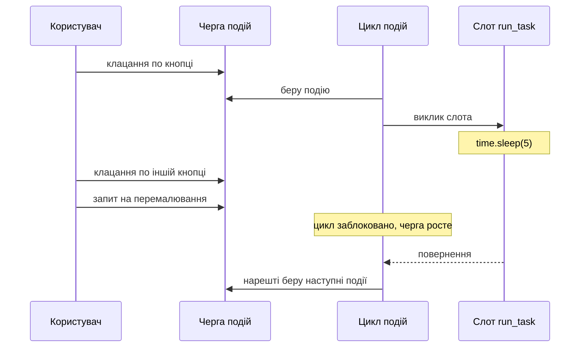
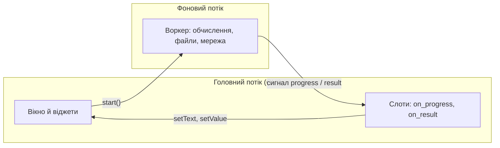
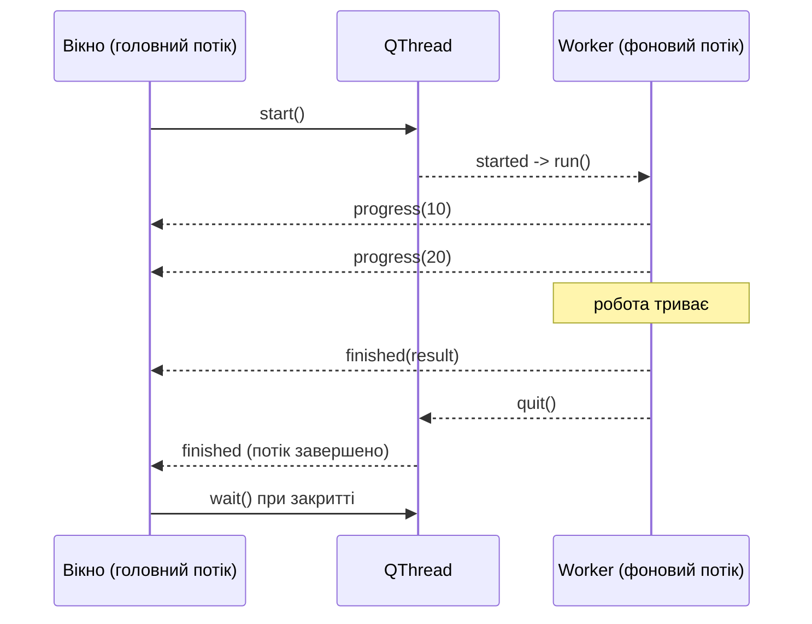

# 20. (Л) Багатопоточність у PySide6. `QThread`, воркери, потокобезпечна взаємодія з GUI

## Зміст лекції

1. Проблема: вікно, яке «не відповідає»
2. Цикл подій і чому довга функція його зупиняє
3. Потік, паралельність і GIL
4. Головне правило Qt: віджети — лише з головного потоку
5. `processEvents()` — чому це не рішення
6. `QThread` — це не потік, а керівник потоку
7. Воркер і `moveToThread`: базовий патерн
8. Життєвий цикл: `start` → сигнали → `quit` → `wait`
9. Успадкування `QThread`: чому так робити не варто
10. Типи з'єднань: `Direct`, `Queued` і що робить `Auto`
11. Що можна передавати сигналом між потоками
12. Прогрес: повідомлення про хід роботи
13. Скасування: `requestInterruption()`
14. Багато коротких задач: `QRunnable` і `QThreadPool`
15. Спільні дані: `QMutex` і чому краще без нього
16. Періодичні дії без потоку: `QTimer`
17. Потоки і Model/View
18. Коректне завершення застосунку
19. Коли потік не допоможе: `QProcess` і `multiprocessing`
20. Збірка: застосунок «File Scanner»
21. Типові помилки
22. Підсумок

## Проблема: вікно, яке «не відповідає»

Усі застосунки з попередніх лекцій мали спільну рису: кожна дія користувача виконувалась миттєво. Натиснули кнопку — додався рядок у таблицю; змінили текст — оновився заголовок. Такі операції тривають частки мілісекунди, і користувач не помічає, що між натисканням і результатом узагалі є час.

Реальні застосунки роблять і повільні речі:

- читають і хешують сотні файлів на диску;
- звертаються до мережі й чекають на відповідь сервера;
- виконують запит до бази даних, який обробляє мільйон рядків;
- конвертують відео, стискають архів, обчислюють звіт.

Спробуємо зробити це «в лоб» — прямо в слоті кнопки.

```python
import sys
import time

from PySide6.QtWidgets import (
    QApplication,
    QLabel,
    QPushButton,
    QVBoxLayout,
    QWidget,
)


class Window(QWidget):
    """Довга робота прямо в слоті. Так робити не можна."""

    def __init__(self):
        super().__init__()

        self.setWindowTitle("Frozen window")

        self.status = QLabel("Ready")
        self.clicks = 0

        start_button = QPushButton("Start long task")
        start_button.clicked.connect(self.run_task)

        count_button = QPushButton("Click me (0)")
        count_button.clicked.connect(self.count_click)
        self.count_button = count_button

        layout = QVBoxLayout(self)
        layout.addWidget(self.status)
        layout.addWidget(start_button)
        layout.addWidget(count_button)

    def run_task(self):
        self.status.setText("Working...")      # цей текст ви не побачите

        total = 0
        for step in range(1, 6):
            time.sleep(1)                      # імітація довгої операції
            total += step * step

        self.status.setText(f"Done: {total}")

    def count_click(self):
        self.clicks += 1
        self.count_button.setText(f"Click me ({self.clicks})")


def main():
    app = QApplication(sys.argv)

    window = Window()
    window.resize(320, 160)
    window.show()

    sys.exit(app.exec())


if __name__ == "__main__":
    main()
```

Запустіть і натисніть `Start long task`. Протягом п'яти секунд:

- вікно не перемальовується — якщо перетягнути на нього інше вікно, залишиться сірий прямокутник;
- напис `Working...` **не з'являється**, хоча `setText()` викликано першим рядком;
- кнопка `Click me` не реагує; клацання не губляться, а накопичуються й «вистрілюють» усі разом після завершення;
- операційна система через кілька секунд позначить вікно як «Not Responding» і запропонує його закрити.

Це не помилка Qt і не помилка Python. Це прямий наслідок того, як влаштований цикл подій.

## Цикл подій і чому довга функція його зупиняє

З [лекції 1](/ua/courses/programming-3sem/module1/01-pyside6-intro-lecture/) відомо, що `app.exec()` — це нескінченний цикл, який дістає події з черги й роздає їх об'єктам. Спрощено:

```python
while not should_quit:
    event = queue.get()          # чекаємо на подію
    dispatch(event)              # віддаємо її потрібному об'єкту
```

`dispatch()` викликає обробник: `mousePressEvent`, `paintEvent`, слот, під'єднаний до сигналу. Поки обробник працює, цикл **стоїть** — наступну подію ніхто не забирає.



Звідси випливає **бюджет обробника**. Око людини сприймає інтерфейс як плавний, поки кадр малюється за ~16 мс (60 кадрів на секунду). Практичні орієнтири:

| Тривалість обробника | Що бачить користувач |
|---|---|
| до 50 мс | нічого не помічає |
| 50–200 мс | легка «липкість» інтерфейсу |
| 200 мс – 1 с | помітне підгальмовування, кнопка «залипає» |
| понад 1 с | вікно виглядає зламаним |
| понад 5 с | система пропонує «завершити програму» |

Правило звучить так: **обробник події не має права виконуватись довго**. Якщо робота довга — її треба винести туди, де вона не блокує цикл подій. Це і є багатопоточність.

!!! warning "«Не побачите `Working...`» — не дивно"
    `setText()` не малює нічого. Він змінює дані віджета й ставить у чергу запит на перемалювання. Малює `paintEvent`, який дістане з черги цикл подій — а він зайнятий вашим слотом. Тому текст з'явиться лише після виходу зі слота, тобто разом із `Done`.

## Потік, паралельність і GIL

**Потік (thread)** — незалежна послідовність виконання всередині одного процесу. Потоки одного процесу мають спільну пам'ять: об'єкти, списки, змінні модуля видно з усіх потоків.

Застосунок PySide6 завжди має щонайменше один потік — **головний**, у якому створено `QApplication` і виконується `app.exec()`. У Qt його часто називають **GUI-потоком**.

Далі важлива особливість саме Python. Інтерпретатор CPython має **GIL** (Global Interpreter Lock) — глобальне блокування, через яке в один момент байткод Python виконує лише один потік. Наслідок:

| Тип роботи | Чи допоможе потік |
|---|---|
| Читання/запис файлів | **Так** — на час системного виклику GIL звільняється |
| Мережевий запит | **Так** — потік чекає на відповідь без GIL |
| Очікування бази даних | **Так** |
| `time.sleep()` | **Так** |
| Обчислення на чистому Python (цикли, математика) | **Ні** — прискорення не буде |
| NumPy, `hashlib`, стиснення, обробка зображень | **Так** — ці бібліотеки звільняють GIL усередині C-коду |

Але навіть там, де GIL не дає прискорення, потік розв'язує **іншу**, головнішу для нас задачу: він **не блокує цикл подій**. Інтерфейс лишається живим, кнопки натискаються, прогрес рухається — навіть якщо загальний час обчислення не зменшився.

Тому в GUI-застосунку потоки беруть із двох причин, і другу плутати з першою не варто:

1. **Швидше** — коли робота чекає на диск чи мережу.
2. **Відгукливо** — щоб інтерфейс не замерзав. Це працює **завжди**.

Якщо потрібне саме прискорення чистих Python-обчислень — потрібні процеси, а не потоки; про це в розділі про `multiprocessing`.

!!! note "Потоки не роблять код швидшим самі по собі"
    Потік завжди коштує: пам'ять під стек, час на створення, складність коду й нові класи помилок, яких у однопотоковій програмі не буває. Якщо операція триває 20 мс — залиште її в головному потоці.

## Головне правило Qt: віджети — лише з головного потоку

Це найважливіше речення лекції:

!!! danger "Правило єдиного GUI-потоку"
    **Створювати віджети й звертатись до них можна лише з головного потоку.** Жоден `QWidget` не є потокобезпечним. Виклик `label.setText()` із фонового потоку — це не «погана практика», це помилка, яка призводить до пошкодження пам'яті й падіння застосунку.

Тобто фоновий потік **не має права**:

- створювати `QWidget`, `QMainWindow`, `QDialog`;
- викликати будь-який метод віджета: `setText`, `addItem`, `show`, `setEnabled`;
- напряму змінювати модель, під'єднану до представлення (`beginInsertRows`, `dataChanged`);
- показувати `QMessageBox`.

Що фоновий потік **може**:

- рахувати, читати файли, ходити в мережу, працювати зі своїми структурами даних;
- **надсилати сигнали** — `Signal.emit()` потокобезпечний.

Сигнал і є мостом між потоками. Фоновий потік каже «ось результат», а слот у головному потоці цей результат кладе у віджет. Схема застосунку з потоком завжди виглядає однаково:



Зверніть увагу на напрямок: **дані з потоку виходять тільки сигналами**, а віджети чіпає тільки головний потік.

## `processEvents()` — чому це не рішення

Перше, що знаходить у пошуку початківець: «додай `QApplication.processEvents()` у цикл, і вікно перестане замерзати».

```python
    def run_task(self):
        for step in range(1, 6):
            time.sleep(1)
            QApplication.processEvents()       # ПОГАНА ІДЕЯ
```

Формально це працює: `processEvents()` вручну прокручує чергу подій, вікно перемальовується. Практично — з'являються проблеми, гірші за початкову:

1. **Реентрантність.** Поки ви всередині `run_task`, `processEvents()` може викликати `run_task` **ще раз** — користувач же натиснув ту саму кнопку. Отримаєте два вкладені виконання однієї функції, які псують спільні дані.
2. **Обробка подій у неочікуваний момент.** Користувач може натиснути «Видалити запис», і об'єкт, з яким ви працюєте, зникне посеред циклу.
3. **Закриття вікна посеред роботи.** `processEvents()` обробить і `closeEvent` — далі код продовжить звертатись до знищених віджетів.
4. **Реакція все одно ривками.** Між викликами `processEvents()` інтерфейс мертвий.
5. **Не працює там, де найпотрібніше.** Один довгий системний виклик (запит до мережі, читання великого файлу) розрізати на шматки не можна.

`processEvents()` має вузьку законну нішу: показ заставки під час старту застосунку, коли інтерфейсу ще нема. У решті випадків правильна відповідь — фоновий потік.

!!! danger "`processEvents()` у слоті кнопки — типова причина «неможливих» багів"
    Симптом: застосунок падає або показує дані видаленого запису, а стек викликів має двічі одну й ту саму функцію. Причина — рекурсивний вхід у слот через `processEvents()`.

## `QThread` — це не потік, а керівник потоку

Найчастіше непорозуміння з `QThread` виникає через назву. `QThread` — це **`QObject`, який керує потоком операційної системи**. Сам об'єкт `QThread` живе там, де його створили (зазвичай у головному потоці); окремий потік з'являється лише після виклику `start()`.

| Виклик / властивість | У якому потоці виконується |
|---|---|
| `thread = QThread()` | там, де створили — головний |
| `thread.start()` | головний; створює новий потік ОС |
| `thread.run()` | **новий потік** |
| `thread.quit()`, `thread.wait()`, `thread.isRunning()` | головний |
| слоти самого об'єкта `thread` | головний (бо об'єкт живе там) |

Стандартний `QThread.run()` робить одну річ: запускає **власний цикл подій** цього потоку (`exec()`). Саме тому в новий потік можна «переселити» об'єкт, і його слоти виконуватимуться там.

Ключове поняття — **приналежність об'єкта потоку (thread affinity)**. Кожен `QObject` належить рівно одному потоку: тому, у якому його створили, або тому, куди його перенесли методом `moveToThread()`. Слот об'єкта виконується в потоці, якому об'єкт належить, — незалежно від того, хто надіслав сигнал.

```python
worker = Worker()                 # належить головному потоку
worker.moveToThread(thread)       # тепер належить іншому потоку
```

Дві умови, які треба запам'ятати:

- **`moveToThread()` викликають до `start()`** — точніше, до того, як об'єктом почнуть користуватись.
- **Переносити можна лише об'єкт без батька.** У `QObject` з батьком приналежність визначає батько; спроба перенести дочірній об'єкт видасть попередження і нічого не зробить.

## Воркер і `moveToThread`: базовий патерн

**Воркер (worker)** — звичайний `QObject`, який уміє робити довгу роботу й повідомляти про неї сигналами. Про віджети він не знає нічого — рівно як `AppState` із [лекції 14](/ua/courses/programming-3sem/module2/14-app-state-structure-lecture/).

```python
import sys
import time

from PySide6.QtCore import QObject, QThread, Signal, Slot
from PySide6.QtWidgets import (
    QApplication,
    QLabel,
    QProgressBar,
    QPushButton,
    QVBoxLayout,
    QWidget,
)


class Worker(QObject):
    """Довга робота. Жодного віджета всередині."""

    progress = Signal(int)          # відсоток виконання
    finished = Signal(int)          # результат

    @Slot()
    def run(self):
        total = 0

        for step in range(1, 11):
            time.sleep(0.3)         # імітація повільної операції
            total += step * step
            self.progress.emit(step * 10)

        self.finished.emit(total)


class Window(QWidget):
    def __init__(self):
        super().__init__()

        self.setWindowTitle("Worker in a thread")

        self.thread = None
        self.worker = None

        self.status = QLabel("Ready")
        self.bar = QProgressBar()
        self.bar.setRange(0, 100)

        self.start_button = QPushButton("Start")
        self.start_button.clicked.connect(self.start_task)

        self.clicks = 0
        self.count_button = QPushButton("Click me (0)")
        self.count_button.clicked.connect(self.count_click)

        layout = QVBoxLayout(self)
        layout.addWidget(self.status)
        layout.addWidget(self.bar)
        layout.addWidget(self.start_button)
        layout.addWidget(self.count_button)

    def start_task(self):
        self.start_button.setEnabled(False)
        self.status.setText("Working...")
        self.bar.setValue(0)

        # 1. Потік і воркер - два різні об'єкти.
        self.thread = QThread()
        self.worker = Worker()

        # 2. Воркер переїжджає в потік: його слоти працюватимуть там.
        self.worker.moveToThread(self.thread)

        # 3. Старт потоку запускає роботу воркера.
        self.thread.started.connect(self.worker.run)

        # 4. Результати повертаються в GUI сигналами.
        self.worker.progress.connect(self.bar.setValue)
        self.worker.finished.connect(self.on_finished)

        # 5. Робота скінчилась - зупиняємо цикл подій потоку.
        self.worker.finished.connect(self.thread.quit)

        self.thread.start()

    @Slot(int)
    def on_finished(self, total):
        # Цей слот виконується в головному потоці - віджети чіпати можна.
        self.status.setText(f"Done: {total}")
        self.start_button.setEnabled(True)

    def count_click(self):
        self.clicks += 1
        self.count_button.setText(f"Click me ({self.clicks})")

    def closeEvent(self, event):
        if self.thread is not None and self.thread.isRunning():
            self.thread.quit()
            self.thread.wait()

        super().closeEvent(event)


def main():
    app = QApplication(sys.argv)

    window = Window()
    window.resize(360, 200)
    window.show()

    sys.exit(app.exec())


if __name__ == "__main__":
    main()
```

Запустіть і натисніть `Start`. Три секунди прогрес рухається, а кнопка `Click me` **справно рахує клацання** — вікно живе.

Розберемо збірку по кроках.

**Крок 1. Два об'єкти, а не один.** `QThread` — «двигун», `Worker` — «вантаж». Плутати їх не можна: методи `QThread` викликаються з головного потоку, методи воркера — з фонового.

**Крок 2. `moveToThread`.** Після цього рядка `worker` належить іншому потоку. Будь-який слот воркера, викликаний через сигнал, виконається там.

**Крок 3. `started` → `run`.** `QThread` надсилає `started` уже **всередині нового потоку**. Оскільки воркер належить цьому ж потоку, `run()` теж виконається там. Це і є момент запуску роботи.

**Крок 4. Результат назад.** `progress` і `finished` надсилаються з фонового потоку, а слоти належать вікну — об'єкту головного потоку. Qt це помічає й доставляє сигнали **через чергу подій головного потоку**. Тому `self.bar.setValue()` виконується у правильному потоці, і жодного явного коду синхронізації писати не треба.

**Крок 5. Зупинка.** `run()` завершився — це ще не кінець потоку: у ньому крутиться цикл подій. `thread.quit()` каже циклу зупинитись, після чого потік завершується й надсилає `finished`.

!!! tip "Чому воркер збережено в `self.worker`"
    В `self.thread` і `self.worker` зберігаються **посилання**. Якби це були локальні змінні, після виходу з `start_task()` Python видалив би обидва об'єкти — і застосунок упав би з `QThread: Destroyed while thread is still running`. Фоновій задачі завжди потрібен власник, який тримає її живою.

## Життєвий цикл: `start` → сигнали → `quit` → `wait`



Методи `QThread`, які знадобляться:

| Метод | Дія |
|---|---|
| `start()` | створює потік ОС і запускає `run()` |
| `quit()` | просить цикл подій потоку завершитись (те саме, що `exit(0)`) |
| `wait(msecs=None)` | блокує викликача, доки потік не завершиться |
| `isRunning()` | чи потік ще працює |
| `requestInterruption()` | ставить прапорець «просимо зупинитись» |
| `isInterruptionRequested()` | читає цей прапорець (з боку воркера) |
| `currentThread()` | статичний: об'єкт потоку, у якому ми зараз |
| `msleep(ms)` / `sleep(s)` | пауза всередині потоку |

!!! danger "`quit()` не вбиває роботу, що триває"
    `quit()` зупиняє **цикл подій**, а не виконання `run()`. Якщо воркер саме крутить цикл на десять хвилин, потік завершиться лише через десять хвилин. Щоб зупинити роботу раніше, воркер має **сам** перевіряти прапорець скасування — про це в розділі про `requestInterruption()`.

Про `terminate()`: такий метод існує, він убиває потік посеред інструкції. Наслідки — незвільнені блокування, недописані файли, пошкоджені дані. **Використовувати не можна.**

## Успадкування `QThread`: чому так робити не варто

У старих статтях і прикладах трапляється інший підхід: успадкувати `QThread` і перевизначити `run()`.

```python
class ScanThread(QThread):
    progress = Signal(int)

    def run(self):                      # виконується у новому потоці
        for step in range(1, 11):
            self.msleep(300)
            self.progress.emit(step * 10)
```

Код коротший, і для одноразової задачі без зворотного зв'язку він працює. Проблема в іншому: **сам об'єкт `ScanThread` належить головному потоку**, а в новому потоці виконується тільки тіло `run()`. Звідси пастка:

```python
class ScanThread(QThread):
    def run(self):
        ...

    @Slot()
    def stop_now(self):
        # УВАГА: цей слот виконається в ГОЛОВНОМУ потоці,
        # хоча написаний у класі потоку.
        self._stop = True
```

Новачок бачить «слот у класі потоку» і вважає, що слот працює у фоні. Ні: слот виконується там, де живе об'єкт. Через це в такий клас непомітно потрапляє змішування потоків — найважчий для налагодження вид помилок.

| Критерій | Успадкування `QThread` | Воркер + `moveToThread` |
|---|---|---|
| Де живуть слоти класу | у головному потоці | у фоновому |
| Кілька задач у одному потоці | ні | так |
| Воркер тестується без потоку | ні | так: просто виклик `run()` |
| Повторний запуск роботи | новий об'єкт потоку | той самий воркер, новий сигнал |
| Ризик випадково торкнутись GUI | високий | низький |

**Правило курсу: використовуємо воркер + `moveToThread`.** Успадкування `QThread` допустиме лише для суто обчислювального `run()` без жодних додаткових слотів — і навіть тоді виграшу майже немає.

## Типи з'єднань: `Direct`, `Queued` і що робить `Auto`

Коли в [лекції 13](/ua/courses/programming-3sem/module1/13-signals-slots-lecture/) ми писали `connect(...)`, останній параметр залишався за замовчуванням. Саме він визначає, **як** сигнал доходить до слота.

| Тип | Поведінка |
|---|---|
| `Qt.ConnectionType.DirectConnection` | слот викликається негайно, **у потоці того, хто надіслав сигнал** |
| `Qt.ConnectionType.QueuedConnection` | виклик кладеться в чергу подій потоку **отримувача**; `emit()` повертається одразу |
| `Qt.ConnectionType.AutoConnection` | за замовчуванням: `Direct`, якщо обидва об'єкти в одному потоці, інакше `Queued` |
| `Qt.ConnectionType.BlockingQueuedConnection` | як `Queued`, але `emit()` чекає на завершення слота; **різні потоки обов'язково** |
| `Qt.ConnectionType.UniqueConnection` | прапорець: не створювати з'єднання-дублікат |

`AutoConnection` — причина того, що приклад із воркером працює без єдиного рядка синхронізації. Qt дивиться на приналежність об'єктів у момент **надсилання** сигналу й сам обирає доставку.

Перевіримо це на практиці. Наступний застосунок друкує, у якому потоці виконується кожен слот.

```python
import sys

from PySide6.QtCore import QObject, Qt, QThread, Signal, Slot
from PySide6.QtWidgets import QApplication, QPushButton, QVBoxLayout, QWidget


def thread_name():
    return QThread.currentThread().objectName()


class Worker(QObject):
    tick = Signal(str)

    @Slot()
    def do_work(self):
        print(f"do_work runs in: {thread_name()}")
        self.tick.emit("hello from worker")


class Window(QWidget):
    ask = Signal()

    def __init__(self):
        super().__init__()

        self.setWindowTitle("Connection types")

        self.thread = QThread()
        self.thread.setObjectName("worker-thread")

        self.worker = Worker()
        self.worker.moveToThread(self.thread)

        # Сигнал з головного потоку в слот воркера: доставка через чергу.
        self.ask.connect(self.worker.do_work)

        # Сигнал з фонового потоку в слот вікна: теж через чергу.
        self.worker.tick.connect(self.on_tick)

        # А це з'єднання примусово пряме - слот виконається у ФОНОВОМУ потоці.
        self.worker.tick.connect(
            self.on_tick_direct,
            Qt.ConnectionType.DirectConnection,
        )

        button = QPushButton("Ask worker")
        button.clicked.connect(self.ask)

        layout = QVBoxLayout(self)
        layout.addWidget(button)

        self.thread.start()

    @Slot(str)
    def on_tick(self, text):
        print(f"on_tick        runs in: {thread_name()} | {text}")

    @Slot(str)
    def on_tick_direct(self, text):
        print(f"on_tick_direct runs in: {thread_name()} | {text}")

    def closeEvent(self, event):
        self.thread.quit()
        self.thread.wait()
        super().closeEvent(event)


def main():
    app = QApplication(sys.argv)

    QThread.currentThread().setObjectName("main-thread")

    window = Window()
    window.show()

    sys.exit(app.exec())


if __name__ == "__main__":
    main()
```

Натисніть кнопку й подивіться у термінал:

```text
do_work runs in: worker-thread
on_tick_direct runs in: worker-thread | hello from worker
on_tick        runs in: main-thread | hello from worker
```

Три спостереження:

1. `do_work` виконався у фоновому потоці, хоча сигнал надіслано з головного — бо воркер належить фоновому.
2. `on_tick_direct` виконався **у фоновому потоці**, хоча це метод вікна. Пряме з'єднання ігнорує приналежність. Якби всередині був `setText()`, застосунок міг би впасти.
3. `on_tick` виконався в головному потоці й **пізніше** за прямий — бо чекав своєї черги в циклі подій.

!!! danger "`DirectConnection` між потоками — заряджена зброя"
    Пряме з'єднання між різними потоками означає, що слот виконується в чужому потоці. Ставте його свідомо й ніколи — на слот, який торкається віджетів. Якщо не впевнені — не вказуйте тип узагалі: `AutoConnection` майже завжди правильний.

!!! warning "`BlockingQueuedConnection` і взаємне блокування"
    Якщо надіслати такий сигнал об'єкту **свого ж** потоку, застосунок зависне назавжди: потік чекатиме сам на себе. Qt у цьому випадку виводить попередження, але зависання це не рятує.

## Що можна передавати сигналом між потоками

При черговій доставці Qt **копіює** аргументи сигналу й кладе копію в чергу. Тому аргументи мають бути такими, щоб копія мала сенс.

Безпечно передавати:

- незмінні значення: `int`, `float`, `str`, `bool`, `tuple`;
- нові об'єкти, які фоновий потік створив і більше не чіпає (наприклад, `list` результатів, `dataclass`);
- значення-типи Qt: `QPoint`, `QSize`, `QColor`, `QDateTime`;
- `QImage` — спеціально спроєктований для передавання між потоками.

Небезпечно передавати:

- **посилання на об'єкт, який потік продовжує змінювати** — головний потік читатиме його одночасно з записом;
- **віджети** й будь-які `QWidget`-похідні;
- `QPixmap` — його можна створювати й чіпати лише в GUI-потоці (для фонового потоку існує `QImage`, який потім перетворюють на `QPixmap`).

Практичне правило: **фоновий потік віддає готові дані й забуває про них**.

```python
    def run(self):
        rows = []
        for path in paths:
            rows.append(self.describe(path))

        self.batch_ready.emit(rows)     # список більше не використовується
        # ПОМИЛКА була б така:
        # self.batch_ready.emit(self.rows); self.rows.append(...)
```

## Прогрес: повідомлення про хід роботи

Довга операція має показувати, що вона жива. Мінімум — рухомий `QProgressBar`; краще — ще й текст «що саме зараз відбувається».

Три поширені випадки:

**1. Загальний обсяг відомий.** Класичний відсоток.

```python
class Worker(QObject):
    progress = Signal(int, int)      # зроблено, усього

    @Slot()
    def run(self):
        total = len(self._items)

        for done, item in enumerate(self._items, start=1):
            self.process(item)
            self.progress.emit(done, total)
```

```python
    @Slot(int, int)
    def on_progress(self, done, total):
        self.bar.setMaximum(total)
        self.bar.setValue(done)
        self.status.setText(f"Processed {done} of {total}")
```

**2. Обсяг невідомий.** `QProgressBar` із діапазоном `0..0` перетворюється на нескінченну «біжучу» смугу.

```python
        self.bar.setRange(0, 0)      # невизначений прогрес
```

**3. Обсяг стає відомим не одразу.** Спершу воркер швидко рахує кількість елементів і надсилає `total_ready`, а вже потім починає повільну частину. Саме так зроблено в застосунку «File Scanner» наприкінці лекції.

Важлива деталь продуктивності: **не надсилайте сигнал на кожен крок, якщо кроків багато**. Кожен сигнал через чергу — це подія, яку головний потік має обробити. Сто тисяч подій за секунду завалять цикл подій, і вікно замерзне знову — тепер уже через прогрес.

```python
        for done, item in enumerate(self._items, start=1):
            self.process(item)

            # Повідомляємо не частіше ніж раз на 50 елементів,
            # і обов'язково про останній.
            if done % 50 == 0 or done == total:
                self.progress.emit(done, total)
```

!!! tip "Другий спосіб приборкати потік сигналів — накопичувати пачками"
    Замість `row_ready` на кожен рядок надсилайте `rows_ready(list)` раз на 200 рядків. Це зменшує і кількість подій, і кількість перемальовувань таблиці.

## Скасування: `requestInterruption()`

Кнопка `Cancel` — не розкіш, а очікувана частина будь-якої довгої операції. Оскільки вбивати потік не можна, скасування завжди **кооперативне**: головний потік просить, воркер періодично перевіряє прохання й виходить сам.

Qt має для цього готовий механізм — прапорець усередині `QThread`:

```python
        self.thread.requestInterruption()      # з головного потоку
```

```python
            if QThread.currentThread().isInterruptionRequested():
                self.cancelled.emit()
                return
```

Повний приклад із прогресом і скасуванням:

```python
import sys

from PySide6.QtCore import QObject, QThread, Signal, Slot
from PySide6.QtWidgets import (
    QApplication,
    QHBoxLayout,
    QLabel,
    QProgressBar,
    QPushButton,
    QVBoxLayout,
    QWidget,
)

TOTAL_STEPS = 200


class Worker(QObject):
    """Рахує суму квадратів, повідомляє прогрес, слухається скасування."""

    progress = Signal(int, int)
    finished = Signal(int)
    cancelled = Signal()

    @Slot()
    def run(self):
        thread = QThread.currentThread()
        total = 0

        for step in range(1, TOTAL_STEPS + 1):
            if thread.isInterruptionRequested():
                self.cancelled.emit()
                return

            thread.msleep(20)              # імітація роботи
            total += step * step

            if step % 5 == 0 or step == TOTAL_STEPS:
                self.progress.emit(step, TOTAL_STEPS)

        self.finished.emit(total)


class Window(QWidget):
    def __init__(self):
        super().__init__()

        self.setWindowTitle("Cancellable task")

        self.thread = None
        self.worker = None

        self.status = QLabel("Ready")
        self.bar = QProgressBar()
        self.bar.setRange(0, TOTAL_STEPS)

        self.start_button = QPushButton("Start")
        self.start_button.clicked.connect(self.start_task)

        self.cancel_button = QPushButton("Cancel")
        self.cancel_button.setEnabled(False)
        self.cancel_button.clicked.connect(self.cancel_task)

        buttons = QHBoxLayout()
        buttons.addWidget(self.start_button)
        buttons.addWidget(self.cancel_button)

        layout = QVBoxLayout(self)
        layout.addWidget(self.status)
        layout.addWidget(self.bar)
        layout.addLayout(buttons)

    def start_task(self):
        self.thread = QThread()
        self.worker = Worker()
        self.worker.moveToThread(self.thread)

        self.thread.started.connect(self.worker.run)

        self.worker.progress.connect(self.on_progress)
        self.worker.finished.connect(self.on_finished)
        self.worker.cancelled.connect(self.on_cancelled)

        self.worker.finished.connect(self.thread.quit)
        self.worker.cancelled.connect(self.thread.quit)

        self.set_running(True)
        self.thread.start()

    def cancel_task(self):
        if self.thread is None:
            return

        self.status.setText("Cancelling...")
        self.cancel_button.setEnabled(False)

        # Прохання, а не наказ: воркер перевірить його на наступному кроці.
        self.thread.requestInterruption()

    def set_running(self, running):
        self.start_button.setEnabled(not running)
        self.cancel_button.setEnabled(running)
        self.status.setText("Working..." if running else "Ready")

        if running:
            self.bar.setValue(0)

    @Slot(int, int)
    def on_progress(self, done, total):
        self.bar.setValue(done)
        self.status.setText(f"Step {done} of {total}")

    @Slot(int)
    def on_finished(self, total):
        self.set_running(False)
        self.status.setText(f"Done: {total}")

    @Slot()
    def on_cancelled(self):
        self.set_running(False)
        self.status.setText("Cancelled by user")

    def closeEvent(self, event):
        if self.thread is not None and self.thread.isRunning():
            self.thread.requestInterruption()
            self.thread.quit()
            self.thread.wait()

        super().closeEvent(event)


def main():
    app = QApplication(sys.argv)

    window = Window()
    window.resize(360, 160)
    window.show()

    sys.exit(app.exec())


if __name__ == "__main__":
    main()
```

Що тут варто побачити:

- **Кнопки перемикаються станом, а не здогадками.** `set_running()` — одна точка, яка описує вигляд вікна під час роботи; це той самий `render()` із лекції 14, тільки маленький.
- **Три вихідні сигнали замість одного.** `finished`, `cancelled` — різні події, і вікно реагує на них по-різному. Не пишіть `finished(success: bool)`; окремі сигнали читаються краще.
- **`msleep()` замість `time.sleep()`.** Різниці для GIL немає, але `QThread.msleep()` явно показує, що ми у фоновому потоці.
- **Скасування перевіряється на кожному кроці**, а прогрес надсилається кожні п'ять — реакція на кнопку швидка, а черга подій не забита.

Альтернатива `requestInterruption()` — власний прапорець у воркері:

```python
class Worker(QObject):
    def __init__(self):
        super().__init__()
        self._cancelled = False

    def cancel(self):
        # Викликається з ГОЛОВНОГО потоку - це звичайний виклик методу,
        # а не слот через чергу.
        self._cancelled = True
```

Так роблять, коли задача не прив'язана до конкретного `QThread` (наприклад, у `QThreadPool`). Присвоєння `bool` у CPython атомарне, тож гонки тут не буде. Але для `QThread` вбудований механізм зрозуміліший — по ньому одразу видно намір.

!!! danger "Скасування, яке не перевіряється, не існує"
    Якщо всередині циклу є одна операція на 30 секунд (величезний файл, мережевий запит без тайм-ауту), прапорець перевіриться лише після неї. Довгі операції розбивають на шматки: читання файлу — блоками, мережу — з тайм-аутом.

## Багато коротких задач: `QRunnable` і `QThreadPool`

`QThread` описує **один** потік і зручний для однієї довгої задачі. Коли задач багато й кожна коротка (обробити 500 зображень, перевірити 200 посилань), створювати 500 потоків неправильно: створення потоку коштує дорожче за саму задачу.

Для цього є **пул потоків**: кілька готових потоків, які по черзі беруть задачі з черги.

| Клас | Роль |
|---|---|
| `QRunnable` | одна задача: клас із методом `run()` |
| `QThreadPool` | пул потоків, який виконує `QRunnable` |
| `QThreadPool.globalInstance()` | спільний пул застосунку |

`QRunnable` — **не** `QObject`, тому власних сигналів у нього немає. Стандартний прийом — покласти сигнали в окремий маленький `QObject`.

```python
import sys

from PySide6.QtCore import QObject, QRunnable, Qt, QThreadPool, Signal, Slot
from PySide6.QtWidgets import (
    QApplication,
    QLabel,
    QListWidget,
    QProgressBar,
    QPushButton,
    QVBoxLayout,
    QWidget,
)

TASK_COUNT = 12


class TaskSignals(QObject):
    """QRunnable не є QObject, тому сигнали живуть в окремому об'єкті."""

    done = Signal(int, int)          # номер задачі, результат
    failed = Signal(int, str)


class SquareTask(QRunnable):
    def __init__(self, number):
        super().__init__()

        self.number = number
        self.signals = TaskSignals()

    def run(self):
        # Виконується в одному з потоків пулу.
        try:
            value = self.number * self.number
            for _ in range(200000):
                value = (value + 7) % 1000003              # трохи роботи

            self.signals.done.emit(self.number, value)
        except Exception as error:                          # noqa: BLE001
            self.signals.failed.emit(self.number, str(error))


class Window(QWidget):
    def __init__(self):
        super().__init__()

        self.setWindowTitle("Thread pool")

        self.pool = QThreadPool.globalInstance()
        self.completed = 0

        self.status = QLabel(
            f"Max threads in pool: {self.pool.maxThreadCount()}"
        )
        self.bar = QProgressBar()
        self.bar.setRange(0, TASK_COUNT)

        self.results = QListWidget()

        start_button = QPushButton("Run all tasks")
        start_button.clicked.connect(self.start_all)

        layout = QVBoxLayout(self)
        layout.addWidget(self.status)
        layout.addWidget(self.bar)
        layout.addWidget(self.results)
        layout.addWidget(start_button)

    def start_all(self):
        self.results.clear()
        self.completed = 0
        self.bar.setValue(0)

        for number in range(1, TASK_COUNT + 1):
            task = SquareTask(number)
            task.signals.done.connect(self.on_done, Qt.ConnectionType.QueuedConnection)
            task.signals.failed.connect(self.on_failed, Qt.ConnectionType.QueuedConnection)

            self.pool.start(task)      # пул сам вирішить, коли й де запустити

    @Slot(int, int)
    def on_done(self, number, value):
        self.completed += 1
        self.bar.setValue(self.completed)
        self.results.addItem(f"task {number}: {value}")

    @Slot(int, str)
    def on_failed(self, number, message):
        self.completed += 1
        self.bar.setValue(self.completed)
        self.results.addItem(f"task {number}: FAILED - {message}")

    def closeEvent(self, event):
        self.pool.clear()              # прибрати ще не запущені задачі
        self.pool.waitForDone()        # дочекатись тих, що вже працюють
        super().closeEvent(event)


def main():
    app = QApplication(sys.argv)

    window = Window()
    window.resize(420, 320)
    window.show()

    sys.exit(app.exec())


if __name__ == "__main__":
    main()
```

Особливості, які варто відзначити:

- **Порядок результатів не збігається з порядком запуску.** Задачі виконуються паралельно, тож у списку номери йдуть урозкид. Якщо порядок важливий — сортуйте результати самі.
- **`maxThreadCount()` за замовчуванням дорівнює кількості ядер.** Змінюють через `setMaxThreadCount()`; для задач, що чекають на мережу, розумно поставити більше за кількість ядер.
- **`task.signals` мусить пережити задачу.** Об'єкт `TaskSignals` створено полем задачі, а задачу пул видаляє після `run()` (`setAutoDelete(True)` — типова поведінка). Оскільки з'єднання зроблено до `start()`, а сигнали надсилаються до кінця `run()`, усе гаразд. Не зберігайте посилання на `QRunnable` після запуску: об'єкта може вже не бути.
- **Обгортка `try` / `except` у `run()`.** Виняток у фоновій задачі не потрапить у ваш `try` в головному потоці. Якщо його не спіймати, у кращому разі побачите трасування в терміналі, у гіршому — задача мовчки зникне. **Кожен `run()` має ловити винятки й перетворювати їх на сигнал `failed`.**

Коли що брати:

| Ситуація | Інструмент |
|---|---|
| Одна довга задача з прогресом і скасуванням | `QThread` + воркер |
| Багато коротких незалежних задач | `QThreadPool` + `QRunnable` |
| Потрібно кілька об'єктів у одному фоновому потоці | `QThread` + кілька воркерів через `moveToThread` |
| Періодична дрібна дія | `QTimer` без потоків |

## Спільні дані: `QMutex` і чому краще без нього

Потоки одного процесу мають спільну пам'ять. Якщо два потоки одночасно змінюють один об'єкт, результат непередбачуваний — це **гонка даних (race condition)**.

Демонстрація. Кілька потоків рахують хеші й додають результат до спільного поля. Критична секція — три дії: прочитати поточне значення, порахувати хеш, записати нове. Поки триває друга дія, `hashlib` **звільняє GIL**, тож інші потоки встигають прочитати те саме старе значення — і їхні внески губляться.

```python
"""Гонка даних: кілька потоків читають і пишуть одне поле."""

import hashlib
import sys

from PySide6.QtCore import QMutex, QMutexLocker, QRunnable, QThreadPool

PAYLOAD = b"x" * (1024 * 1024)
ROUNDS = 50
TASKS = 4
DIGEST_CHARS = 64


class Stats:
    """Спільні дані: скільки символів хешів порахували всі потоки разом."""

    def __init__(self):
        self.total = 0
        self.mutex = QMutex()

    def add_unsafe(self):
        current = self.total                            # 1. читання
        digest = hashlib.sha256(PAYLOAD).hexdigest()    # 2. робота: GIL вільний
        self.total = current + len(digest)              # 3. запис застарілого значення

    def add_safe(self):
        with QMutexLocker(self.mutex):                  # секцію виконує один потік
            self.add_unsafe()


class HashTask(QRunnable):
    def __init__(self, stats, safe):
        super().__init__()

        self.stats = stats
        self.safe = safe

    def run(self):
        for _ in range(ROUNDS):
            if self.safe:
                self.stats.add_safe()
            else:
                self.stats.add_unsafe()


def run_experiment(safe):
    pool = QThreadPool()
    pool.setMaxThreadCount(TASKS)

    stats = Stats()
    for _ in range(TASKS):
        pool.start(HashTask(stats, safe))

    pool.waitForDone()

    expected = TASKS * ROUNDS * DIGEST_CHARS
    label = "with mutex" if safe else "without mutex"
    print(f"{label:14} -> {stats.total} (expected {expected})")


def main():
    run_experiment(safe=False)
    run_experiment(safe=True)
    return 0


if __name__ == "__main__":
    sys.exit(main())
```

Приклад консольний — `QApplication` тут не потрібен. Запустіть кілька разів: варіант без м'ютекса стабільно дає число, значно менше за очікуване; варіант із м'ютексом — завжди рівно `12800`.

```text
without mutex  -> 3200 (expected 12800)
with mutex     -> 12800 (expected 12800)
```

!!! note "GIL не рятує від гонок"
    Часто кажуть: «GIL же не дає потокам виконуватись одночасно, звідки гонка?». По-перше, GIL звільняється на час будь-якої операції введення-виведення й усередині C-бібліотек — саме це відбувається у прикладі. По-друге, навіть `self.value += 1` — це **три** операції байткоду, і інтерпретатор має право перемкнути потік між ними; просто трапляється це рідко, і саме тому такий баг знаходять не на парі, а в проді. GIL захищає внутрішні структури інтерпретатора, а не логіку вашої програми.

Інструменти синхронізації Qt:

| Клас | Призначення |
|---|---|
| `QMutex` | взаємне виключення: критичну секцію виконує один потік |
| `QMutexLocker` | звільняє м'ютекс автоматично (працює як менеджер контексту) |
| `QReadWriteLock` | багато читачів або один письменник |
| `QSemaphore` | обмежити кількість одночасних доступів |
| `QWaitCondition` | один потік чекає на сигнал іншого |

Стандартні `threading.Lock` і `queue.Queue` з Python теж працюють — вибір між ними й Qt-класами здебільшого справа стилю.

І тепер найважливіше:

!!! tip "Найкращий м'ютекс — той, якого немає"
    Кожен м'ютекс — це потенційне взаємне блокування (deadlock) і завжди — складніший для читання код. У GUI-застосунку майже завжди можна обійтись без спільних змінних даних:

    - воркер отримує вхідні дані **копією** в конструкторі;
    - результат віддає **сигналом**;
    - стан застосунку (`AppState`) змінює **тільки головний потік**, у слоті.

    Тоді спільної пам'яті просто немає, а отже, нема чого захищати.

## Періодичні дії без потоку: `QTimer`

Не кожна «фонова» задача потребує потоку. Якщо робота дрібна, але має повторюватись — годинник, автозбереження, опитування стану, анімація — достатньо `QTimer`, який виконується в головному потоці, але не блокує його.

```python
import sys

from PySide6.QtCore import QDateTime, QTimer
from PySide6.QtWidgets import QApplication, QLabel, QVBoxLayout, QWidget


class Window(QWidget):
    def __init__(self):
        super().__init__()

        self.setWindowTitle("Timer instead of a thread")

        self.clock = QLabel()
        self.autosave = QLabel("Autosaved 0 times")
        self.saves = 0

        layout = QVBoxLayout(self)
        layout.addWidget(self.clock)
        layout.addWidget(self.autosave)

        self.clock_timer = QTimer(self)
        self.clock_timer.timeout.connect(self.update_clock)
        self.clock_timer.start(1000)

        self.autosave_timer = QTimer(self)
        self.autosave_timer.timeout.connect(self.do_autosave)
        self.autosave_timer.start(5000)

        self.update_clock()

    def update_clock(self):
        now = QDateTime.currentDateTime()
        self.clock.setText(now.toString("yyyy-MM-dd HH:mm:ss"))

    def do_autosave(self):
        self.saves += 1
        self.autosave.setText(f"Autosaved {self.saves} times")


def main():
    app = QApplication(sys.argv)

    window = Window()
    window.resize(280, 100)
    window.show()

    sys.exit(app.exec())


if __name__ == "__main__":
    main()
```

Правило вибору просте:

- **`QTimer`** — коли одна порція роботи вкладається в кілька мілісекунд, а повторювати треба регулярно.
- **Потік** — коли одна порція роботи довга й розрізати її на дрібні кроки незручно або неможливо.

Є ще проміжний варіант — `QTimer.singleShot(0, self.next_chunk)`: розрізати довгу роботу на шматки й планувати наступний шматок через чергу подій. Інтерфейс лишається живим без жодного потоку, але код перетворюється на ручну машину станів, тож застосовують це рідко.

## Потоки і Model/View

У [лекції 18](/ua/courses/programming-3sem/module2/18-model-view-lecture/) ми домовились, що модель — перехідник між станом і представленням. Тепер додається обмеження: **модель належить головному потоку так само, як віджети**.

Заборонено:

```python
    def run(self):                       # фоновий потік
        for row in self.scan():
            self.model.add_row(row)      # ПОМИЛКА: beginInsertRows не з того потоку
```

Правильно — воркер надсилає дані, а модель змінює слот у головному потоці:

```python
    # у воркері
    def run(self):
        batch = []
        for row in self.scan():
            batch.append(row)

            if len(batch) >= 200:
                self.rows_ready.emit(batch)
                batch = []               # новий список, старий уже «чужий»

        if batch:
            self.rows_ready.emit(batch)
```

```python
    # у вікні
    @Slot(list)
    def on_rows_ready(self, rows):
        self.model.append_rows(rows)     # головний потік - усе законно
```

```python
    # у моделі
    def append_rows(self, rows):
        first = len(self._rows)
        last = first + len(rows) - 1

        self.beginInsertRows(QModelIndex(), first, last)
        self._rows.extend(rows)
        self.endInsertRows()
```

Два зауваження щодо продуктивності:

- **Вставляйте пачками.** `beginInsertRows`/`endInsertRows` на кожен рядок змушує представлення перераховувати геометрію тисячі разів. Одна вставка на 200 рядків — і таблиця наповнюється плавно.
- **Не сортуйте після кожної пачки.** Якщо над моделлю стоїть `QSortFilterProxyModel`, сортування виконується щоразу. Для великих обсягів має сенс вимкнути сортування на час завантаження й увімкнути наприкінці.

## Коректне завершення застосунку

Найчастіше повідомлення, яке студенти бачать під час знайомства з потоками:

```text
QThread: Destroyed while thread is still running
```

Воно означає: об'єкт `QThread` знищено, поки потік ще працює. Причини бувають дві.

**1. Посилання на потік загубилось.**

```python
    def start_task(self):
        thread = QThread()               # ПОМИЛКА: локальна змінна
        worker = Worker()
        worker.moveToThread(thread)
        thread.start()
        # вихід із методу - Python видаляє обидва об'єкти
```

Лікується збереженням у полі: `self.thread`, `self.worker`, або словником задач, якщо їх кілька.

**2. Вікно закрили, поки задача працює.** Тут потрібен `closeEvent`, який зупиняє роботу й **дочікується** її завершення:

```python
    def closeEvent(self, event):
        if self.thread is not None and self.thread.isRunning():
            self.thread.requestInterruption()     # попроси зупинитись
            self.thread.quit()                    # заверши цикл подій потоку
            self.thread.wait(3000)                # дочекайся, але не вічно

        super().closeEvent(event)
```

Порядок саме такий: спершу прохання зупинитись, потім `quit()`, потім `wait()`. Виклик `wait()` без `requestInterruption()` призведе до того, що застосунок «зависне» на закритті доти, доки задача не догорить сама.

Якщо задача принципово довга, коректніше не закривати вікно мовчки, а спитати користувача:

```python
    def closeEvent(self, event):
        if self.thread is None or not self.thread.isRunning():
            super().closeEvent(event)
            return

        answer = QMessageBox.question(
            self,
            "Task is running",
            "A background task is still running. Stop it and exit?",
        )

        if answer != QMessageBox.StandardButton.Yes:
            event.ignore()               # лишаємось у застосунку
            return

        self.thread.requestInterruption()
        self.thread.quit()
        self.thread.wait(3000)

        super().closeEvent(event)
```

Для `QThreadPool` те саме роблять двома викликами:

```python
        pool.clear()             # викинути задачі, які ще не почались
        pool.waitForDone()       # дочекатись тих, що вже виконуються
```

!!! warning "`wait()` без аргументу може зависнути назавжди"
    `wait()` блокує головний потік. Якщо у воркері помилка й він ніколи не завершиться, застосунок неможливо буде закрити. Тому в реальному коді ставлять тайм-аут: `wait(3000)`.

## Коли потік не допоможе: `QProcess` і `multiprocessing`

Потоки — не єдиний спосіб винести роботу з GUI. Два випадки, коли потрібне щось інше.

**1. Треба запустити зовнішню програму.** Для цього є `QProcess` — асинхронний, із сигналами, без жодних потоків.

```python
import sys

from PySide6.QtCore import QProcess
from PySide6.QtWidgets import (
    QApplication,
    QPlainTextEdit,
    QPushButton,
    QVBoxLayout,
    QWidget,
)


class Window(QWidget):
    def __init__(self):
        super().__init__()

        self.setWindowTitle("QProcess")

        self.output = QPlainTextEdit()
        self.output.setReadOnly(True)

        self.button = QPushButton("Run: ping -c 4 127.0.0.1")
        self.button.clicked.connect(self.run_command)

        layout = QVBoxLayout(self)
        layout.addWidget(self.output)
        layout.addWidget(self.button)

        self.process = QProcess(self)
        self.process.setProcessChannelMode(QProcess.ProcessChannelMode.MergedChannels)
        self.process.readyReadStandardOutput.connect(self.read_output)
        self.process.finished.connect(self.on_finished)

    def run_command(self):
        if self.process.state() != QProcess.ProcessState.NotRunning:
            return

        self.output.clear()
        self.button.setEnabled(False)
        self.process.start("ping", ["-c", "4", "127.0.0.1"])

    def read_output(self):
        data = self.process.readAllStandardOutput()
        self.output.appendPlainText(bytes(data).decode(errors="replace").rstrip())

    def on_finished(self, code, status):
        self.button.setEnabled(True)
        self.output.appendPlainText(f"--- finished with code {code} ---")

    def closeEvent(self, event):
        if self.process.state() != QProcess.ProcessState.NotRunning:
            self.process.kill()
            self.process.waitForFinished(2000)

        super().closeEvent(event)


def main():
    app = QApplication(sys.argv)

    window = Window()
    window.resize(560, 360)
    window.show()

    sys.exit(app.exec())


if __name__ == "__main__":
    main()
```

Зовнішня програма виконується як окремий процес операційної системи, а її вивід приходить у вигляді сигналів. Потік тут не потрібен взагалі — і це, до речі, загальне правило: **у Qt багато класів уже асинхронні** (`QProcess`, `QNetworkAccessManager`, `QFileSystemWatcher`), і загортати їх у потік — помилка.

**2. Треба реально прискорити обчислення на чистому Python.** Тут потоки безсилі через GIL: потрібні процеси.

```python
import sys
from concurrent.futures import ProcessPoolExecutor

from PySide6.QtCore import QObject, QThread, Signal, Slot
from PySide6.QtWidgets import (
    QApplication,
    QLabel,
    QListWidget,
    QPushButton,
    QVBoxLayout,
    QWidget,
)


def count_primes(limit):
    """Свідомо неоптимальний підрахунок простих чисел - навантаження на CPU."""
    found = 0

    for number in range(2, limit):
        divisor = 2
        is_prime = True

        while divisor * divisor <= number:
            if number % divisor == 0:
                is_prime = False
                break
            divisor += 1

        if is_prime:
            found += 1

    return limit, found


class Worker(QObject):
    """Керує пулом процесів, лишаючись у фоновому потоці."""

    result_ready = Signal(int, int)
    finished = Signal()

    def __init__(self, limits):
        super().__init__()
        self._limits = limits

    @Slot()
    def run(self):
        with ProcessPoolExecutor() as pool:
            for limit, found in pool.map(count_primes, self._limits):
                self.result_ready.emit(limit, found)

        self.finished.emit()


class Window(QWidget):
    def __init__(self):
        super().__init__()

        self.setWindowTitle("Process pool")

        self.thread = None
        self.worker = None

        self.status = QLabel("Ready")
        self.results = QListWidget()

        self.button = QPushButton("Count primes")
        self.button.clicked.connect(self.start)

        layout = QVBoxLayout(self)
        layout.addWidget(self.status)
        layout.addWidget(self.results)
        layout.addWidget(self.button)

    def start(self):
        self.results.clear()
        self.button.setEnabled(False)
        self.status.setText("Working...")

        limits = [60000, 70000, 80000, 90000]

        self.thread = QThread()
        self.worker = Worker(limits)
        self.worker.moveToThread(self.thread)

        self.thread.started.connect(self.worker.run)
        self.worker.result_ready.connect(self.on_result)
        self.worker.finished.connect(self.on_finished)
        self.worker.finished.connect(self.thread.quit)

        self.thread.start()

    @Slot(int, int)
    def on_result(self, limit, found):
        self.results.addItem(f"primes below {limit}: {found}")

    @Slot()
    def on_finished(self):
        self.status.setText("Done")
        self.button.setEnabled(True)

    def closeEvent(self, event):
        if self.thread is not None and self.thread.isRunning():
            self.thread.quit()
            self.thread.wait()

        super().closeEvent(event)


def main():
    app = QApplication(sys.argv)

    window = Window()
    window.resize(360, 260)
    window.show()

    sys.exit(app.exec())


if __name__ == "__main__":
    main()
```

Зверніть увагу на конструкцію: **потік + пул процесів**. Потік потрібен не для швидкості, а щоб очікування результатів не блокувало цикл подій; прискорення дають процеси. Функція `count_primes` навмисно винесена на рівень модуля — процеси передають її за іменем, і локальну функцію чи метод так передати не вийде.

Підсумкова таблиця вибору:

| Задача | Інструмент |
|---|---|
| Файли, диск, мережа, база даних | потік (`QThread` + воркер) |
| Багато однотипних дрібних задач | `QThreadPool` + `QRunnable` |
| Запуск зовнішньої програми | `QProcess` — без потоків |
| HTTP-запити засобами Qt | `QNetworkAccessManager` — теж без потоків |
| Важкі обчислення на чистому Python | процеси (`ProcessPoolExecutor`) |
| Обчислення в NumPy / `hashlib` / стисненні | потік підійде: GIL звільняється |
| Дрібна періодична дія | `QTimer` |

## Збірка: застосунок «File Scanner»

Зберемо все разом. Застосунок обходить обраний каталог, для кожного файла рахує розмір, час зміни й контрольну суму SHA-256, і показує результат у таблиці з пошуком і сортуванням. Сканування виконується у фоновому потоці, має прогрес і кнопку скасування.

Хешування — саме той випадок, коли потік дає не лише відгукливість, а й реальне прискорення: `hashlib` звільняє GIL на час обчислення.

```text
file_scanner/
├── main.py
└── app/
    ├── __init__.py
    ├── models.py
    ├── scanner.py
    └── ui/
        ├── __init__.py
        ├── file_table_model.py
        └── main_window.py
```

Файли `app/__init__.py` та `app/ui/__init__.py` — порожні.

### `app/models.py`

```python
"""Шар даних. Жодних імпортів з PySide6."""

from dataclasses import dataclass


@dataclass
class FileRow:
    name: str
    path: str
    size: int
    modified: str
    digest: str
```

### `app/scanner.py`

```python
"""Фоновий сканер каталогу. Про віджети не знає нічого."""

import hashlib
from datetime import datetime
from pathlib import Path

from PySide6.QtCore import QObject, QThread, Signal, Slot

from .models import FileRow

BATCH_SIZE = 100          # скільки рядків накопичити перед надсиланням
PROGRESS_STEP = 25        # як часто повідомляти прогрес
CHUNK_SIZE = 64 * 1024    # розмір блока читання файла
DIGEST_LENGTH = 16        # скільки символів хеша показувати


class ScanCancelled(Exception):
    """Внутрішній спосіб вийти з будь-якої глибини при скасуванні."""


class ScanWorker(QObject):
    counted = Signal(int)          # знайдено файлів
    progress = Signal(int, int)    # оброблено, усього
    rows_ready = Signal(list)      # чергова пачка FileRow
    finished = Signal(int, int)    # оброблено, з них нечитабельних
    cancelled = Signal(int)        # оброблено до скасування
    failed = Signal(str)           # каталог недоступний

    def __init__(self, root, parent=None):
        super().__init__(parent)

        self._root = Path(root)
        self._thread = None
        self._batch = []
        self._done = 0
        self._unreadable = 0

    # ------------------------------------------------------------ точка входу

    @Slot()
    def run(self):
        self._thread = QThread.currentThread()
        self._batch = []
        self._done = 0
        self._unreadable = 0

        try:
            self._scan()
        except ScanCancelled:
            self._flush()
            self.cancelled.emit(self._done)
        except OSError as error:
            self.failed.emit(str(error))

    # ---------------------------------------------------------------- сканування

    def _scan(self):
        paths = self._collect_files()
        total = len(paths)
        self.counted.emit(total)

        for path in paths:
            self._check_cancel()

            self._batch.append(self._describe(path))
            self._done += 1

            if len(self._batch) >= BATCH_SIZE:
                self._flush()

            if self._done % PROGRESS_STEP == 0 or self._done == total:
                self.progress.emit(self._done, total)

        self._flush()
        self.finished.emit(self._done, self._unreadable)

    def _collect_files(self):
        # rglob() мовчки пропускає усе, що не вдалося прочитати,
        # тому доступність кореня перевіряємо окремо - інакше користувач
        # побачить порожню таблицю без жодного пояснення.
        if not self._root.is_dir():
            raise NotADirectoryError(f"Not a directory: {self._root}")

        next(self._root.iterdir(), None)      # кине OSError, якщо немає прав

        paths = []

        for path in self._root.rglob("*"):
            self._check_cancel()

            if path.is_file() and not path.is_symlink():
                paths.append(path)

        return paths

    def _describe(self, path):
        try:
            stat = path.stat()
            digest = self._digest(path)
        except OSError:
            # Немає прав або файл зник - це не привід ламати все сканування.
            self._unreadable += 1
            return FileRow(
                name=path.name,
                path=str(path),
                size=0,
                modified="",
                digest="unreadable",
            )

        modified = datetime.fromtimestamp(stat.st_mtime)

        return FileRow(
            name=path.name,
            path=str(path),
            size=stat.st_size,
            modified=modified.isoformat(sep=" ", timespec="seconds"),
            digest=digest,
        )

    def _digest(self, path):
        sha = hashlib.sha256()

        with path.open("rb") as stream:
            while True:
                # Читаємо блоками, щоб скасування спрацювало
                # навіть на файлі в кілька гігабайтів.
                self._check_cancel()

                chunk = stream.read(CHUNK_SIZE)
                if not chunk:
                    break

                sha.update(chunk)

        return sha.hexdigest()[:DIGEST_LENGTH]

    # -------------------------------------------------------------- службове

    def _flush(self):
        if not self._batch:
            return

        # Список віддано назовні - далі працюємо з новим.
        self.rows_ready.emit(self._batch)
        self._batch = []

    def _check_cancel(self):
        if self._thread.isInterruptionRequested():
            raise ScanCancelled()
```

### `app/ui/file_table_model.py`

```python
"""Модель таблиці. Рядки отримує пачками - тільки з головного потоку."""

from PySide6.QtCore import QAbstractTableModel, QModelIndex, Qt

HEADERS = ["Name", "Size", "Modified", "SHA-256", "Path"]

COL_NAME = 0
COL_SIZE = 1
COL_MODIFIED = 2
COL_DIGEST = 3
COL_PATH = 4

UNITS = ["B", "KB", "MB", "GB", "TB"]


def human_size(size):
    value = float(size)

    for unit in UNITS:
        if value < 1024 or unit == UNITS[-1]:
            if unit == "B":
                return f"{int(value)} {unit}"
            return f"{value:.1f} {unit}"

        value /= 1024

    return f"{size} B"


class FileTableModel(QAbstractTableModel):
    def __init__(self, parent=None):
        super().__init__(parent)

        self._rows = []

    # ------------------------------------------------------ обов'язкові методи

    def rowCount(self, parent=QModelIndex()):
        return 0 if parent.isValid() else len(self._rows)

    def columnCount(self, parent=QModelIndex()):
        return 0 if parent.isValid() else len(HEADERS)

    def data(self, index, role=Qt.ItemDataRole.DisplayRole):
        if not index.isValid():
            return None

        row = self._rows[index.row()]
        column = index.column()

        if role == Qt.ItemDataRole.DisplayRole:
            if column == COL_NAME:
                return row.name
            if column == COL_SIZE:
                return human_size(row.size)
            if column == COL_MODIFIED:
                return row.modified
            if column == COL_DIGEST:
                return row.digest
            if column == COL_PATH:
                return row.path

        if role == Qt.ItemDataRole.EditRole:
            # Розмір сортується як число, решта - як текст.
            if column == COL_SIZE:
                return row.size
            return self.data(index, Qt.ItemDataRole.DisplayRole)

        if role == Qt.ItemDataRole.TextAlignmentRole and column == COL_SIZE:
            return Qt.AlignmentFlag.AlignRight | Qt.AlignmentFlag.AlignVCenter

        if role == Qt.ItemDataRole.ToolTipRole:
            return row.path

        return None

    def headerData(self, section, orientation, role=Qt.ItemDataRole.DisplayRole):
        if role != Qt.ItemDataRole.DisplayRole:
            return None

        if orientation == Qt.Orientation.Horizontal:
            return HEADERS[section]

        return section + 1

    # --------------------------------------------------- зміни з головного потоку

    def append_rows(self, rows):
        if not rows:
            return

        first = len(self._rows)
        last = first + len(rows) - 1

        self.beginInsertRows(QModelIndex(), first, last)
        self._rows.extend(rows)
        self.endInsertRows()

    def clear(self):
        self.beginResetModel()
        self._rows = []
        self.endResetModel()

    def total_size(self):
        return sum(row.size for row in self._rows)
```

### `app/ui/main_window.py`

```python
"""Вікно. Керує потоком і показує результати."""

from PySide6.QtCore import Qt, QSortFilterProxyModel, QThread, Slot
from PySide6.QtWidgets import (
    QAbstractItemView,
    QFileDialog,
    QHBoxLayout,
    QHeaderView,
    QLabel,
    QLineEdit,
    QMainWindow,
    QMessageBox,
    QProgressBar,
    QPushButton,
    QTableView,
    QVBoxLayout,
    QWidget,
)

from ..scanner import ScanWorker
from .file_table_model import COL_NAME, FileTableModel, human_size

WAIT_TIMEOUT_MS = 3000


class MainWindow(QMainWindow):
    def __init__(self):
        super().__init__()

        self.setWindowTitle("File Scanner")

        self._thread = None
        self._worker = None

        self.model = FileTableModel(self)

        self.proxy = QSortFilterProxyModel(self)
        self.proxy.setSourceModel(self.model)
        self.proxy.setSortRole(Qt.ItemDataRole.EditRole)
        self.proxy.setFilterKeyColumn(COL_NAME)
        self.proxy.setFilterCaseSensitivity(Qt.CaseSensitivity.CaseInsensitive)

        self.choose_button = QPushButton("Choose folder...")
        self.choose_button.clicked.connect(self.choose_folder)

        self.cancel_button = QPushButton("Cancel")
        self.cancel_button.setEnabled(False)
        self.cancel_button.clicked.connect(self.cancel_scan)

        self.search = QLineEdit()
        self.search.setPlaceholderText("Filter by name")
        self.search.textChanged.connect(self.proxy.setFilterFixedString)

        self.view = QTableView()
        self.view.setModel(self.proxy)
        self.view.setSelectionBehavior(QAbstractItemView.SelectionBehavior.SelectRows)
        self.view.setAlternatingRowColors(True)
        self.view.verticalHeader().setVisible(False)
        self.view.horizontalHeader().setSectionResizeMode(
            QHeaderView.ResizeMode.Interactive
        )
        self.view.horizontalHeader().setStretchLastSection(True)

        top = QHBoxLayout()
        top.addWidget(self.choose_button)
        top.addWidget(self.cancel_button)
        top.addWidget(self.search, stretch=1)

        central = QWidget()
        layout = QVBoxLayout(central)
        layout.addLayout(top)
        layout.addWidget(self.view)
        self.setCentralWidget(central)

        self.status_label = QLabel("Choose a folder to scan")
        self.progress = QProgressBar()
        self.progress.setMaximumWidth(220)
        self.progress.setVisible(False)

        self.statusBar().addWidget(self.status_label, 1)
        self.statusBar().addPermanentWidget(self.progress)

        self.resize(900, 520)

    # --------------------------------------------------------------- запуск

    def choose_folder(self):
        folder = QFileDialog.getExistingDirectory(self, "Choose folder to scan")
        if not folder:
            return

        self.start_scan(folder)

    def start_scan(self, folder):
        self.model.clear()
        self.search.clear()

        # Сортування під час завантаження перебудовувало б проксі
        # після кожної пачки - вмикаємо його наприкінці.
        self.view.setSortingEnabled(False)

        self._thread = QThread()
        self._thread.setObjectName("scanner-thread")

        self._worker = ScanWorker(folder)
        self._worker.moveToThread(self._thread)

        self._thread.started.connect(self._worker.run)

        self._worker.counted.connect(self.on_counted)
        self._worker.progress.connect(self.on_progress)
        self._worker.rows_ready.connect(self.on_rows_ready)
        self._worker.finished.connect(self.on_finished)
        self._worker.cancelled.connect(self.on_cancelled)
        self._worker.failed.connect(self.on_failed)

        for signal in (
            self._worker.finished,
            self._worker.cancelled,
            self._worker.failed,
        ):
            signal.connect(self._thread.quit)

        self.set_scanning(True, folder)
        self._thread.start()

    def cancel_scan(self):
        if self._thread is None or not self._thread.isRunning():
            return

        self.cancel_button.setEnabled(False)
        self.status_label.setText("Cancelling...")
        self._thread.requestInterruption()

    # ---------------------------------------------------------------- слоти

    @Slot(int)
    def on_counted(self, total):
        self.progress.setRange(0, total if total else 1)
        self.progress.setValue(0)
        self.status_label.setText(f"Found {total} files, hashing...")

    @Slot(int, int)
    def on_progress(self, done, total):
        self.progress.setValue(done)
        self.status_label.setText(f"Hashed {done} of {total}")

    @Slot(list)
    def on_rows_ready(self, rows):
        # Головний потік - тільки тут можна чіпати модель.
        self.model.append_rows(rows)

    @Slot(int, int)
    def on_finished(self, done, unreadable):
        self.set_scanning(False)
        self.status_label.setText(
            f"Done: {done} files, {human_size(self.model.total_size())} total, "
            f"{unreadable} unreadable"
        )

    @Slot(int)
    def on_cancelled(self, done):
        self.set_scanning(False)
        self.status_label.setText(f"Cancelled after {done} files")

    @Slot(str)
    def on_failed(self, message):
        self.set_scanning(False)
        self.status_label.setText("Scan failed")
        QMessageBox.warning(self, "Scan failed", message)

    # ---------------------------------------------------------------- рендер

    def set_scanning(self, scanning, folder=""):
        self.choose_button.setEnabled(not scanning)
        self.cancel_button.setEnabled(scanning)
        self.search.setEnabled(not scanning)
        self.progress.setVisible(scanning)

        if scanning:
            self.progress.setRange(0, 0)      # обсяг ще невідомий
            self.status_label.setText(f"Scanning {folder}...")
        else:
            self.view.setSortingEnabled(True)
            self.view.resizeColumnToContents(COL_NAME)

    # -------------------------------------------------------------- закриття

    def closeEvent(self, event):
        if self._thread is not None and self._thread.isRunning():
            self._thread.requestInterruption()
            self._thread.quit()

            if not self._thread.wait(WAIT_TIMEOUT_MS):
                # Потік не зупинився вчасно: краще повідомити, ніж мовчки впасти.
                print("Warning: scanner thread did not stop in time")

        super().closeEvent(event)
```

### `main.py`

```python
import sys

from PySide6.QtWidgets import QApplication

from app.ui.main_window import MainWindow


def main():
    app = QApplication(sys.argv)

    window = MainWindow()
    window.show()

    sys.exit(app.exec())


if __name__ == "__main__":
    main()
```

### Що варто побачити в цьому коді

- **Воркер не імпортує нічого з `QtWidgets`.** Він працює з `pathlib`, `hashlib` і сигналами. Його можна викликати з тесту напряму — `ScanWorker(path).run()` — без вікна й без потоку.
- **Три різні кінцівки: `finished`, `cancelled`, `failed`.** Вікно реагує на кожну по-своєму, а всі три однаково зупиняють потік.
- **Рядки йдуть пачками по 100.** Модель вставляє їх однією парою `beginInsertRows`/`endInsertRows`, тож таблиця не гальмує навіть на десятках тисяч файлів.
- **Скасування перевіряється навіть усередині читання файла.** Виняток `ScanCancelled` виносить керування нагору з будь-якої глибини — це чистіший спосіб, ніж перевіряти прапорець у кожному циклі й повертати `None`.
- **Помилка окремого файла не зупиняє сканування.** Файл без прав доступу потрапляє в таблицю з позначкою `unreadable`, а їхня кількість підбивається в підсумку.
- **Сортування вимкнено на час завантаження** і вмикається наприкінці — інакше проксі перебудовувався б після кожної пачки.
- **`closeEvent` не дає застосунку впасти при виході** й не чекає вічно: `wait(3000)` має тайм-аут.

### Що перевірити руками

1. Просканувати великий каталог (наприклад, домашню теку) і переконатись, що вікно рухається, пошук працює, а прогрес доходить до кінця.
2. Натиснути `Cancel` посеред сканування — рядок стану має показати `Cancelled after N files`, а вже знайдені рядки залишитись у таблиці.
3. Клацнути по заголовку `Size` — сортування має бути числовим: `900 B` іде перед `2.0 KB`.
4. Ввести текст у поле пошуку — таблиця фільтрується без повторного сканування.
5. Закрити вікно посеред сканування — застосунок має завершитись за секунду й **без** повідомлення `QThread: Destroyed while thread is still running`.
6. Створити теку без прав на читання (`mkdir /tmp/locked && chmod 000 /tmp/locked`), обрати її й переконатись, що застосунок показує попередження, а не падає й не мовчить.

## Типові помилки

**1. Довга робота в слоті**

```python
    def on_start_clicked(self):
        result = self.scan_everything()      # ПОМИЛКА: 30 секунд у циклі подій
```

Симптом — «Not Responding». Лікування — воркер у потоці.

**2. `processEvents()` замість потоку**

Дає ілюзію відгукливості, а натомість — рекурсивні виклики слотів і робота зі знищеними об'єктами.

**3. Звернення до віджета з фонового потоку**

```python
    def run(self):                            # фоновий потік
        self.window.status.setText("Working")  # ПОМИЛКА
```

Іноді працює, іноді падає, іноді псує пам'ять — найгірший вид помилки. Тільки сигнал.

**4. Створення `QWidget` або `QPixmap` у потоці**

```python
    def run(self):
        pixmap = QPixmap(path)                # ПОМИЛКА: тільки GUI-потік
```

У фоновому потоці працюють із `QImage`, а перетворюють на `QPixmap` уже в слоті.

**5. Локальні змінні для потоку й воркера**

```python
    def start(self):
        thread = QThread()                    # ПОМИЛКА: зникне після виходу
        worker = Worker()
```

`QThread: Destroyed while thread is still running` або тихе падіння. Зберігайте в полях.

**6. `moveToThread` після `start()` — або взагалі забутий**

Без `moveToThread` воркер лишається в головному потоці, слот `run` виконується там, і вікно замерзає так само, як без потоку. Перевірити просто: надрукуйте `QThread.currentThread().objectName()` у `run()`.

**7. Воркер із батьком**

```python
        worker = Worker(self)                 # ПОМИЛКА
        worker.moveToThread(thread)           # попередження, перенесення не відбулось
```

Переносити можна лише об'єкт без батька.

**8. `terminate()` замість кооперативного скасування**

Убитий посеред роботи потік лишає заблоковані м'ютекси й недописані файли. Правильно — `requestInterruption()` і перевірка в циклі.

**9. Скасування без перевірок**

`requestInterruption()` викликано, а воркер його не читає. Кнопка `Cancel` нічого не робить.

**10. Сигнал на кожну ітерацію**

```python
        for row in rows:                      # мільйон рядків
            self.row_ready.emit(row)          # ПОМИЛКА: мільйон подій у черзі
```

Черга подій головного потоку переповнюється, і вікно замерзає — попри потік. Надсилайте пачками.

**11. Передавання змінюваного об'єкта, який потік продовжує правити**

```python
        self.rows.append(row)
        self.rows_ready.emit(self.rows)       # ПОМИЛКА: обидва потоки правлять один список
```

Після `emit` список має стати «чужим»: створіть новий.

**12. Виняток у `run()` без обробки**

Виняток у фоновому потоці не потрапить у `try` головного потоку. Задача мовчки зникає, вікно назавжди лишається в стані «Working…». Кожен `run()` обгортають `try` / `except` і мають сигнал `failed`.

**13. `wait()` без тайм-ауту**

`self.thread.wait()` у `closeEvent` при зацикленому воркері робить застосунок таким, що не закривається. Ставте `wait(3000)`.

**14. Модель змінюється з потоку**

`beginInsertRows` / `dataChanged` — тільки з головного потоку. Дані передають сигналом, вставляє їх слот.

**15. `DirectConnection` «щоб швидше»**

Пряме з'єднання між потоками виконує слот у чужому потоці. Якщо слот торкається віджетів — застосунок впаде, і зовсім не там, де помилка.

**16. Потік навколо вже асинхронного класу**

`QProcess`, `QNetworkAccessManager`, `QFileSystemWatcher` не блокують цикл подій. Загортати їх у `QThread` — зайва складність.

**17. Потік заради прискорення чистих Python-обчислень**

GIL не дасть прискорення. Для CPU-задач — процеси.

**18. Спільний змінюваний стан без потреби**

```python
        self.results = []                     # пише потік, читає GUI
```

Замість м'ютексів простіше не ділити дані: результат віддається сигналом і належить одному потоку.

**19. Новий потік на кожен елемент**

Тисяча `QThread` — тисяча стеків і планувальник, який більше перемикається, ніж працює. Багато дрібних задач — це `QThreadPool`.

**20. Мовчазне ігнорування помилок окремих елементів**

Один файл без прав доступу не має зупиняти сканування на десять тисяч файлів. Помилку елемента фіксують у результаті, а не в аварійному завершенні.

## Підсумок

- **Цикл подій однопотоковий.** Поки обробник події працює, вікно не малюється й не реагує. Бюджет обробника — десятки мілісекунд.
- **Потік у GUI потрібен насамперед заради відгукливості**, і лише іноді — заради швидкості. GIL не дає прискорення чистим Python-обчисленням, але не заважає інтерфейсу лишатись живим.
- **Головне правило: віджети й моделі — тільки з головного потоку.** Фоновий потік рахує й надсилає сигнали; віджети чіпають слоти в головному потоці.
- **`QThread` — не потік, а керівник потоку.** Об'єкт `QThread` живе там, де його створили; окремий потік з'являється після `start()`.
- **Базовий патерн — воркер + `moveToThread`**: `QObject` з довгою роботою переселяють у потік, `thread.started` запускає `run()`, результати повертаються сигналами. Успадкування `QThread` створює пастку: слоти такого класу виконуються в головному потоці.
- **`AutoConnection` сам обирає доставку**: у межах потоку — прямий виклик, між потоками — через чергу подій отримувача. Саме тому код із воркером не потребує жодної явної синхронізації.
- **Прогрес надсилають рідше, ніж роблять кроки**, а рядки — пачками: інакше черга подій головного потоку стає новим вузьким місцем.
- **Скасування завжди кооперативне**: `requestInterruption()` ставить прапорець, воркер перевіряє його в циклі й виходить сам. `terminate()` не використовують.
- **Багато дрібних задач — `QThreadPool` + `QRunnable`.** Сигнали для `QRunnable` тримають в окремому `QObject`, а `run()` обов'язково ловить винятки.
- **Найкращий м'ютекс — той, якого немає.** Воркер отримує вхідні дані копією, результат віддає сигналом, спільний стан змінює лише головний потік.
- **`QTimer` замінює потік** для дрібних періодичних дій; `QProcess` і `QNetworkAccessManager` уже асинхронні й потоку не потребують; для важких обчислень на чистому Python потрібні **процеси**.
- **Застосунок має коректно завершуватись**: `requestInterruption()` → `quit()` → `wait(timeout)` у `closeEvent`, інакше на виході побачите `QThread: Destroyed while thread is still running`.

## Корисні посилання

- [Qt: Thread Support in Qt](https://doc.qt.io/qt-6/threads.html)
- [Qt: Threading Basics](https://doc.qt.io/qt-6/thread-basics.html)
- [Qt: Threads and QObjects](https://doc.qt.io/qt-6/threads-qobject.html)
- [Qt: Synchronizing Threads](https://doc.qt.io/qt-6/threads-synchronizing.html)
- [QThread](https://doc.qt.io/qtforpython-6/PySide6/QtCore/QThread.html)
- [QRunnable](https://doc.qt.io/qtforpython-6/PySide6/QtCore/QRunnable.html)
- [QThreadPool](https://doc.qt.io/qtforpython-6/PySide6/QtCore/QThreadPool.html)
- [QMutex](https://doc.qt.io/qtforpython-6/PySide6/QtCore/QMutex.html)
- [QMutexLocker](https://doc.qt.io/qtforpython-6/PySide6/QtCore/QMutexLocker.html)
- [QTimer](https://doc.qt.io/qtforpython-6/PySide6/QtCore/QTimer.html)
- [QProcess](https://doc.qt.io/qtforpython-6/PySide6/QtCore/QProcess.html)
- [Qt.ConnectionType](https://doc.qt.io/qt-6/qt.html#ConnectionType-enum)
- [Python: `concurrent.futures`](https://docs.python.org/3/library/concurrent.futures.html)
- [Python: GIL](https://docs.python.org/3/glossary.html#term-global-interpreter-lock)

## Домашнє завдання

Запустити застосунок «File Scanner» і пройти всі шість перевірок із розділу «Що перевірити руками». Далі доопрацювати його так, щоб:

- у таблиці з'явилась колонка `Duplicate` — позначка `yes` для файлів, чий SHA-256 уже зустрічався серед просканованих (обчислювати в **головному** потоці, у слоті `on_rows_ready`, а не у воркері);
- кнопка `Cancel` під час паузи перед скасуванням не «залипала»: перевірити, що застосунок реагує на неї не довше ніж за півсекунди навіть на файлі в кілька гігабайтів;
- при спробі закрити вікно під час сканування застосунок питав підтвердження через `QMessageBox.question()` і залишався відкритим, якщо користувач відмовився;
- у рядку стану після завершення показувалась ще й швидкість: скільки файлів за секунду опрацьовано (час заміряти у воркері й передати в сигналі `finished`).
