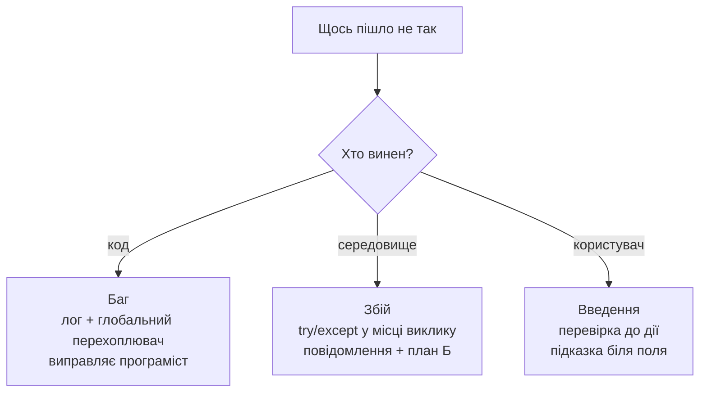
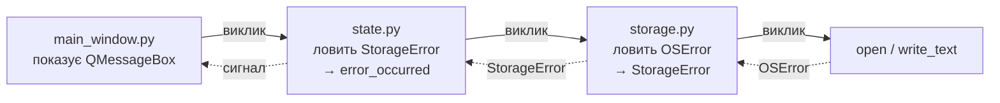
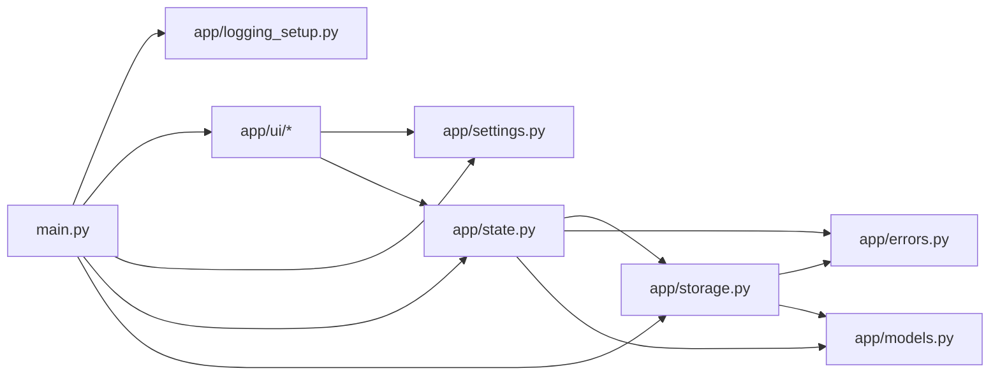

# 22. (Л) Обробка помилок. Налаштування застосунку

## Зміст лекції

1. Проблема: застосунок, який ламається мовчки
2. Три роди проблем: баг, збій, некоректне введення
3. Винятки: короткий повтор під кутом GUI
4. Що Qt робить із винятком у слоті
5. Власні винятки й межі шарів
6. Де ловити: правило найближчого шару, який може щось зробити
7. Останній рубіж: `sys.excepthook`
8. Логування замість `print`
9. Куди писати лог: `QStandardPaths` і ротація
10. Повідомлення самого Qt у тому ж лозі
11. Як показати помилку користувачу
12. Текст повідомлення: що писати, а чого не писати
13. Не ловіть того, чого можна не допустити: валідація
14. Помилки у фоновому потоці
15. Надійне збереження: атомарний запис і резервна копія
16. Налаштування: що це і чим воно не є
17. `QSettings`: перше знайомство
18. Типи значень і головна пастка `value()`
19. Групи та масиви
20. Геометрія вікна й стан `QMainWindow`
21. Свій файл налаштувань: коли JSON кращий за `QSettings`
22. Шар налаштувань в архітектурі
23. Діалог налаштувань і застосування «наживо»
24. Збірка: «Notes» із логом, обробкою помилок і налаштуваннями
25. Типові помилки
26. Підсумок

## Проблема: застосунок, який ламається мовчки

Усі приклади попередніх лекцій мали спільну зручну властивість: у них нічого не ламалося. Файл завжди існував, JSON завжди був коректний, диск завжди мав місце, а користувач завжди вводив число там, де очікувалося число.

Реальність інша. Ось типовий застосунок, який читає дані з файла:

```python
import json
import sys
from pathlib import Path

from PySide6.QtWidgets import (
    QApplication,
    QLabel,
    QPushButton,
    QVBoxLayout,
    QWidget,
)


class Window(QWidget):
    """Завантаження даних без жодної обробки помилок."""

    def __init__(self):
        super().__init__()

        self.setWindowTitle("Fragile loader")

        self.status = QLabel("No data")

        load_button = QPushButton("Load notes.json")
        load_button.clicked.connect(self.load_notes)

        layout = QVBoxLayout(self)
        layout.addWidget(self.status)
        layout.addWidget(load_button)

    def load_notes(self):
        text = Path("notes.json").read_text(encoding="utf-8")
        notes = json.loads(text)
        self.status.setText(f"Loaded {len(notes)} notes")


def main():
    app = QApplication(sys.argv)

    window = Window()
    window.resize(320, 120)
    window.show()

    sys.exit(app.exec())


if __name__ == "__main__":
    main()
```

Запустіть його в порожньому каталозі й натисніть кнопку. У терміналі з'явиться:

```text
Traceback (most recent call last):
  File "fragile.py", line 34, in load_notes
    text = Path("notes.json").read_text(encoding="utf-8")
  ...
FileNotFoundError: [Errno 2] No such file or directory: 'notes.json'
```

А тепер найважливіше: **вікно не закрилося**. Воно й далі показує `No data`, кнопка й далі натискається, застосунок працює. Користувач бачить рівно нічого — жодного повідомлення, жодної підказки. Він натискає кнопку вдруге, втретє, потім вирішує, що програма зламана, і закриває її.

Термінал бачите ви. Користувач бачить порожнє вікно.

Спробуйте ще три сценарії з тим самим файлом:

| Що зробити | Що станеться |
|---|---|
| створити порожній `notes.json` | `json.decoder.JSONDecodeError: Expecting value` |
| написати у файл `{"a": 1}` замість списку | помилки немає, `len()` поверне `1` — **тихо неправильний результат** |
| зняти права на читання (`chmod 000 notes.json`) | `PermissionError: [Errno 13] Permission denied` |

Третій рядок гірший за перші два: там, де немає винятку, немає й сигналу про проблему. Застосунок упевнено показує неправду.

Ця лекція — про те, як зробити, щоб:

- жодна помилка не зникала непоміченою;
- користувач отримував зрозуміле повідомлення, а не порожнечу;
- ви — розробник — отримували повний технічний слід у файлі лога;
- застосунок після помилки лишався в робочому стані, а не в напівзруйнованому.

Друга половина лекції — про налаштування: де застосунок зберігає розмір вікна, обраний шлях до файла, тему й останні відкриті документи, і чому це окремий шар, а не пара глобальних змінних.

## Три роди проблем: баг, збій, некоректне введення

Слово «помилка» означає три різні речі, і поводитись із ними треба по-різному.

**1. Баг — помилка програміста.** `AttributeError`, `TypeError`, `IndexError`, `NameError`, звернення до `None`. Це наслідок неправильного коду. Такі помилки **не ловлять точково**: ловити `AttributeError` навколо кожного виклику — означає ховати власні дефекти. Їх ловить лише глобальний перехоплювач, щоб записати в лог і не дати застосунку загинути тихо.

**2. Очікуваний збій — помилка середовища.** Файла немає, диск заповнений, немає прав, мережа недоступна, база даних не відповідає, файл пошкоджений. Це **нормальна частина роботи** застосунку: така помилка станеться колись обов'язково, і код зобов'язаний її передбачити. Її ловлять точково, у конкретному місці, і перетворюють на зрозумілу дію.

**3. Некоректне введення користувача.** Порожня назва, вік `-5`, дата в майбутньому, ціна з літерами. Це **взагалі не помилка** в сенсі винятків. Це звичайний стан форми, який треба перевірити **до** дії й показати підказку біля поля.



Плутанина між цими трьома — джерело двох найпоширеніших крайнощів:

- **немає жодного `try`** — застосунок валиться на будь-якому відсутньому файлі;
- **`try: ... except Exception: pass`** навколо всього — застосунок не валиться ніколи, але й не працює, і знайти причину неможливо.

Правильна відповідь посередині, і решта лекції — про те, де саме ця середина.

## Винятки: короткий повтор під кутом GUI

Механіку `try` / `except` ви знаєте з першого курсу. Пригадаємо чотири речі, які в GUI-застосунку важать найбільше.

**Повна форма:**

```python
try:
    data = load_file(path)          # може кинути виняток
except FileNotFoundError:
    data = []                       # план Б для конкретного випадку
except OSError as error:
    show_error(str(error))          # ширший клас: права, диск, шлях
    return
else:
    logger.info("Loaded %s", path)  # виконується, якщо винятку не було
finally:
    self.set_busy(False)            # виконується завжди
```

**`finally` — це про відновлення інтерфейсу.** Якщо перед довгою операцією ви вимкнули кнопку й поставили курсор «очікування», увімкнути назад треба **обов'язково** — і при успіху, і при помилці. Інакше після першої ж помилки кнопка лишиться назавжди вимкненою.

**Порядок `except` має значення.** Гілки перевіряються згори вниз, спрацьовує перша підхожа. `FileNotFoundError` — підклас `OSError`, тому вужчий клас пишуть вище. Якщо поставити `except OSError` першим, гілка `FileNotFoundError` не виконається ніколи.

Корисна частина ієрархії:

```text
BaseException
 └── Exception
      ├── OSError
      │    ├── FileNotFoundError
      │    ├── PermissionError
      │    ├── IsADirectoryError
      │    └── FileExistsError
      ├── ValueError
      │    └── json.JSONDecodeError  (також підклас ValueError)
      ├── KeyError
      ├── TypeError
      └── AttributeError
```

**`raise ... from` зберігає причину.** Коли ви перетворюєте низькорівневий виняток на свій, не втрачайте оригінал:

```python
try:
    raw = json.loads(text)
except json.JSONDecodeError as error:
    raise StorageError(f"Broken file: {path}") from error
```

У лозі буде обидва traceback і рядок `The above exception was the direct cause of the following exception`. Без `from` ви побачите лише свій виняток і не дізнаєтесь, у якому символі файла проблема.

**`except Exception`, а не `except`.** Голий `except:` ловить також `KeyboardInterrupt` і `SystemExit` — тобто заважає застосунку завершитись. Ловіть `Exception`, і лише там, де це справді останній рубіж.

!!! warning "Ніколи не пишіть `except Exception: pass`"
    Це найдорожчий рядок у програмуванні. Він не усуває проблему, а робить її невидимою — і ви шукатимете її годинами замість секунд. Якщо виняток справді можна проігнорувати, напишіть чому:

    ```python
    try:
        self._settings.sync()
    except OSError:
        # налаштування не критичні: застосунок працює й без них
        logger.warning("Cannot save settings", exc_info=True)
    ```

## Що Qt робить із винятком у слоті

Це найважливіший практичний факт цієї лекції, і його варто перевірити руками.

Слот викликається **не з вашого коду**, а з циклу подій — тобто з боку C++. Коли всередині слота виникає виняток, він не має куди «спливти»: у стеку вище немає жодного Python-`try`. Ось приклад, який це показує:

```python
import sys

from PySide6.QtCore import QTimer
from PySide6.QtWidgets import QApplication, QLabel, QPushButton, QVBoxLayout, QWidget


class Window(QWidget):
    """Слот кидає виняток. Дивимось, що станеться із застосунком."""

    def __init__(self):
        super().__init__()

        self.setWindowTitle("Exception in slot")
        self.counter = 0

        self.label = QLabel("Clicks that survived: 0")

        boom_button = QPushButton("Raise exception")
        boom_button.clicked.connect(self.boom)

        ok_button = QPushButton("I still work")
        ok_button.clicked.connect(self.tick)

        layout = QVBoxLayout(self)
        layout.addWidget(self.label)
        layout.addWidget(boom_button)
        layout.addWidget(ok_button)

    def boom(self):
        self.label.setText("Before the exception")
        raise ValueError("something went wrong")
        self.label.setText("After the exception")   # ніколи не виконається

    def tick(self):
        self.counter += 1
        self.label.setText(f"Clicks that survived: {self.counter}")


def main():
    app = QApplication(sys.argv)

    window = Window()
    window.resize(320, 160)
    window.show()

    sys.exit(app.exec())


if __name__ == "__main__":
    main()
```

Натисніть `Raise exception`, а потім `I still work`. Спостереження:

1. У термінал друкується traceback.
2. Вікно **не закривається**, цикл подій живий, друга кнопка працює.
3. Напис лишився `Before the exception` — тобто **слот обірвався посередині**.

Пункт 3 і є справжня небезпека. Виняток у слоті не валить застосунок — він лишає його в **напівзробленому стані**. Уявіть слот, який:

```python
    def rename_note(self, note_id, new_title):
        self.set_busy(True)                      # 1. кнопки вимкнено
        note = self._notes[note_id]              # 2. KeyError, якщо нотатки немає
        note.title = new_title
        self._storage.save(self._notes)
        self.set_busy(False)                     # 3. сюди вже не дійшли
```

Після `KeyError` кнопки лишаються вимкненими назавжди, і застосунок для користувача мертвий — хоча формально «працює».

Те саме стосується перевизначених віртуальних методів. Виняток у `data()` вашої моделі PySide6 покаже окремо:

```text
Error calling Python override of QAbstractTableModel::data(): Traceback (most recent call last):
  ...
KeyError: 'bad column'
```

Комірка просто намалюється порожньою — представлення продовжить питати інші комірки, і в лог посиплються сотні однакових traceback.

Висновки:

- **Виняток у слоті не завершує застосунок** — він тихо ламає одну дію.
- **Traceback іде в `stderr`**, якого користувач ніколи не побачить. Запакований застосунок (лекція 24) часто взагалі не має консолі — і тоді traceback зникає безслідно.
- Отже, потрібні дві речі: **точкова обробка** там, де збій очікуваний, і **глобальний перехоплювач**, який ловить решту й записує її в лог.

## Власні винятки й межі шарів

З [лекції 14](/ua/courses/programming-3sem/module2/14-app-state-structure-lecture/) відомо про три шари: дані → стан → інтерфейс. Винятки цю межу теж поважають.

Уявіть, що `main_window.py` пише так:

```python
        try:
            self._state.load()
        except json.JSONDecodeError:              # ПОМИЛКА рівня архітектури
            ...
```

Вікно тепер **знає**, що дані лежать у JSON. Замініть сховище на SQLite — і цей `except` перестане ловити будь-що, мовчки. Вікно не має права знати про формат.

Розв'язок — власний тип винятку на межі шару:

```python
class StorageError(Exception):
    """Помилка шару збереження, зрозуміла верхнім шарам."""
```

Шар збереження ловить усе своє й перекладає:

```python
import json
from pathlib import Path


class StorageError(Exception):
    """Помилка шару збереження, зрозуміла верхнім шарам."""


class JsonStorage:
    def __init__(self, path):
        self._path = Path(path)

    def load(self):
        if not self._path.exists():
            return []                                    # порожньо — не помилка

        try:
            text = self._path.read_text(encoding="utf-8")
            raw = json.loads(text)
        except OSError as error:
            raise StorageError(f"Cannot read {self._path}: {error}") from error
        except json.JSONDecodeError as error:
            raise StorageError(
                f"File {self._path} is damaged (line {error.lineno})"
            ) from error

        if not isinstance(raw, list):
            raise StorageError(f"Unexpected format in {self._path}: list expected")

        return raw
```

Зверніть увагу на три рішення в цьому коді:

- **Відсутній файл — не помилка.** Перший запуск застосунку нормальний: даних ще немає, повертаємо порожній список. Помилкою є файл, який **є**, але прочитати його неможливо.
- **Пошкоджений формат теж перевіряється.** `json.loads` віддасть словник або число без жодного винятку — тому `isinstance` обов'язковий. Це саме той «тихо неправильний результат» із першого розділу.
- **`from error` зберігає причину** для лога.

Тепер верхні шари ловлять один тип:

```python
        try:
            notes = storage.load()
        except StorageError as error:
            self.error_occurred.emit(str(error))
            notes = []
```

І цей код лишиться правильним, коли всередині `JsonStorage` з'явиться SQLite, мережа або зашифрований файл.

!!! tip "Скільки власних винятків потрібно"
    Один на шар — гарний старт: `StorageError`, `NetworkError`, `ValidationError`. Заводьте підкласи (`FileCorruptedError(StorageError)`) лише тоді, коли верхній шар справді **по-різному** реагує на різні випадки. Виняток, який ніхто не ловить окремо, не потрібен.

## Де ловити: правило найближчого шару, який може щось зробити

Найчастіше питання — «а де саме писати `try`?». Правило одне:

> Виняток ловлять там, де є що з ним зробити.

«Зробити» означає одне з трьох: підставити план Б, повідомити користувача, перекласти у виняток свого шару. Якщо в цьому місці жодне з трьох неможливо — не ловіть, хай летить вище.

Розберемо на прикладі кнопки «Export» у застосунку нотаток.

**Шар збереження** знає про файл, але не знає, хто його просив і як показати помилку. Він **перекладає**:

```python
    def export(self, path, notes):
        try:
            Path(path).write_text(json.dumps(notes), encoding="utf-8")
        except OSError as error:
            raise StorageError(f"Cannot write {path}: {error}") from error
```

**Шар стану** знає, що операція не вдалася, і має сигнали. Він **перетворює виняток на сигнал**:

```python
    def export_to(self, path):
        try:
            self._storage.export(path, self._notes)
        except StorageError as error:
            self.error_occurred.emit(str(error))
            return False

        return True
```

**Шар інтерфейсу** знає користувача. Він **показує**:

```python
    def on_export(self):
        path, _ = QFileDialog.getSaveFileName(self, "Export notes", "", "JSON (*.json)")
        if not path:
            return                                     # користувач скасував — не помилка

        if self._state.export_to(path):
            self.statusBar().showMessage(f"Exported to {path}", 5000)
```

Повідомлення про помилку покаже слот, під'єднаний до `error_occurred` — один на все вікно.



Два антипатерни, яких це правило позбавляє:

**Ловити надто рано.** `except` усередині циклу по файлах, який просто робить `continue`, — і користувач ніколи не дізнається, що половина файлів не скопіювалась.

**Ловити надто пізно.** Один величезний `try` навколо всієї `main()`. Формально помилка спіймана, практично — незрозуміло, яка саме дія не вдалася, і застосунок уже закривається.

## Останній рубіж: `sys.excepthook`

Точкова обробка закриває **очікувані** збої. Баги лишаються — і саме вони найнебезпечніші, бо приходять несподівано.

Python має глобальний перехоплювач `sys.excepthook`: функцію, яку викликають для будь-якого винятку, що дійшов до верху й ніким не спійманий. PySide6 користується ним і для винятків зі слотів — це легко перевірити.

```python
import sys
import traceback

from PySide6.QtWidgets import (
    QApplication,
    QLabel,
    QMessageBox,
    QPushButton,
    QVBoxLayout,
    QWidget,
)


def install_excepthook(app):
    """Показує вікно з помилкою замість тихого traceback у консолі."""

    def hook(exc_type, exc_value, exc_tb):
        if issubclass(exc_type, KeyboardInterrupt):
            sys.__excepthook__(exc_type, exc_value, exc_tb)   # Ctrl+C — не наша справа
            return

        details = "".join(traceback.format_exception(exc_type, exc_value, exc_tb))
        print(details, file=sys.stderr)                        # далі замінимо на лог

        box = QMessageBox()
        box.setIcon(QMessageBox.Critical)
        box.setWindowTitle("Unexpected error")
        box.setText("The application ran into an unexpected problem.")
        box.setInformativeText(f"{exc_type.__name__}: {exc_value}")
        box.setDetailedText(details)
        box.setStandardButtons(QMessageBox.Close)
        box.exec()

    sys.excepthook = hook


class Window(QWidget):
    """Дві кнопки: одна ламається, друга доводить, що застосунок живий."""

    def __init__(self):
        super().__init__()

        self.setWindowTitle("Global excepthook")
        self.counter = 0

        self.label = QLabel("Clicks: 0")

        boom_button = QPushButton("Break something")
        boom_button.clicked.connect(self.boom)

        ok_button = QPushButton("Count a click")
        ok_button.clicked.connect(self.tick)

        layout = QVBoxLayout(self)
        layout.addWidget(self.label)
        layout.addWidget(boom_button)
        layout.addWidget(ok_button)

    def boom(self):
        notes = {"a": 1}
        return notes["missing key"]        # KeyError

    def tick(self):
        self.counter += 1
        self.label.setText(f"Clicks: {self.counter}")


def main():
    app = QApplication(sys.argv)
    install_excepthook(app)

    window = Window()
    window.resize(340, 160)
    window.show()

    sys.exit(app.exec())


if __name__ == "__main__":
    main()
```

Натисніть `Break something` — з'явиться вікно з коротким текстом і кнопкою `Show Details...`, яка розгортає повний traceback. Натисніть `Count a click` — застосунок далі працює.

Три деталі реалізації:

- **`traceback.format_exception`** повертає список рядків — саме те, що треба покласти в `setDetailedText()`. Не намагайтесь зібрати текст вручну через `str(exc_value)`: там не буде ні місця, ні стека.
- **`KeyboardInterrupt` пропускають далі** через `sys.__excepthook__` — оригінальний хук, який Python зберігає завжди. Інакше `Ctrl+C` у терміналі відкриватиме діалог замість завершення програми.
- **Хук ставлять після створення `QApplication`.** До того `QMessageBox` створити не можна.

!!! danger "Обережно з вікном у хуку"
    Якщо виняток стався **всередині малювання**, а хук відкриє модальне вікно, ви ризикуєте отримати нескінченну низку діалогів: діалог викликає перемальовування, воно знову падає, знову діалог. У серйозному застосунку хук ставить прапорець «діалог уже показано» й не відкриває другий, поки перший не закрито. Мінімальний варіант — лічильник:

    ```python
    def install_excepthook():
        state = {"busy": False}

        def hook(exc_type, exc_value, exc_tb):
            if state["busy"]:
                return                          # не показуємо діалог поверх діалогу
            state["busy"] = True
            try:
                ...                             # показ вікна
            finally:
                state["busy"] = False

        sys.excepthook = hook
    ```

**Чого `sys.excepthook` не ловить.** Він працює для головного потоку. Виняток у `run()` фонового воркера туди не потрапить — про це буде окремий розділ. Не ловить він і падіння на рівні C++ (segmentation fault): від цього рятує хіба що `faulthandler.enable()`, який друкує стек Python-коду перед аварійним завершенням процесу.

## Логування замість `print`

`print()` у GUI-застосунку майже безкорисний: користувач консолі не бачить, а запакований застосунок її часто не має взагалі. Потрібен **лог у файл**.

Стандартний модуль `logging` дає це в кілька рядків.

```python
import logging
import sys

logging.basicConfig(
    level=logging.DEBUG,
    format="%(asctime)s %(levelname)-8s %(name)s: %(message)s",
    handlers=[
        logging.FileHandler("app.log", encoding="utf-8"),
        logging.StreamHandler(sys.stderr),
    ],
)

logger = logging.getLogger(__name__)
logger.info("Application started")
```

Результат у файлі:

```text
2026-09-08 10:14:02,113 INFO     __main__: Application started
```

**П'ять рівнів** і коли їх брати:

| Рівень | Коли |
|---|---|
| `DEBUG` | подробиці для розробника: значення змінних, хід алгоритму |
| `INFO` | звичайні події застосунку: запуск, відкриття файла, збереження |
| `WARNING` | щось дивне, але працюємо далі: файл налаштувань пошкоджений, узяли типові |
| `ERROR` | операція не вдалася: не змогли зберегти, не змогли завантажити |
| `CRITICAL` | застосунок далі працювати не може |

**Логер на модуль.** У кожному файлі пишуть один рядок:

```python
logger = logging.getLogger(__name__)
```

`__name__` дає `app.storage`, `app.state`, `app.ui.main_window`. У лозі одразу видно, звідки рядок, і можна вимкнути окремий модуль:

```python
logging.getLogger("app.ui").setLevel(logging.WARNING)
```

**Аргументи передають через `%s`, а не через f-рядок:**

```python
logger.debug("Loaded %s notes from %s", len(notes), path)     # правильно
logger.debug(f"Loaded {len(notes)} notes from {path}")        # зайва робота
```

У першому варіанті форматування станеться лише якщо рівень `DEBUG` увімкнений. У другому — рядок збереться завжди, навіть коли його ніхто не запише.

**`exc_info=True` і `logger.exception`.** Найважливіше в лозі — traceback. Два способи його записати:

```python
        try:
            self._storage.save(self._notes)
        except StorageError:
            logger.exception("Save failed")           # усередині except: рівень ERROR + traceback
```

```python
        except OSError:
            logger.warning("Cannot sync settings", exc_info=True)   # інший рівень + traceback
```

`logger.exception()` можна викликати **тільки всередині `except`** — він бере поточний виняток.

Порівняйте, що потрапить у файл. Без `exc_info`:

```text
2026-09-08 10:15:41,882 ERROR    app.state: Save failed
```

З `exc_info`:

```text
2026-09-08 10:15:41,882 ERROR    app.state: Save failed
Traceback (most recent call last):
  File "app/storage.py", line 41, in save
    self._path.write_text(text, encoding="utf-8")
OSError: [Errno 28] No space left on device: 'notes.json'
```

Другий варіант відповідає на питання «що саме сталося». Перший — ні.

## Куди писати лог: `QStandardPaths` і ротація

`logging.FileHandler("app.log")` створює файл **у робочому каталозі**. Це погано з двох причин: робочий каталог залежить від того, звідки запустили програму, а каталог із запакованим застосунком часто взагалі доступний лише для читання.

Правильне місце дає Qt — клас `QStandardPaths`. Він знає, куди операційна система дозволяє писати:

```python
import sys

from PySide6.QtCore import QCoreApplication, QStandardPaths

app = QCoreApplication(sys.argv)
QCoreApplication.setOrganizationName("KTBP")
QCoreApplication.setApplicationName("Notes")

for name in ("AppConfigLocation", "AppDataLocation", "CacheLocation", "TempLocation"):
    location = getattr(QStandardPaths, name)
    print(f"{name:20} {QStandardPaths.writableLocation(location)}")
```

На Linux виведе:

```text
AppConfigLocation    /home/user/.config/KTBP/Notes
AppDataLocation      /home/user/.local/share/KTBP/Notes
CacheLocation        /home/user/.cache/KTBP/Notes
TempLocation         /tmp
```

Той самий код на macOS дасть шляхи всередині `~/Library`. Ви не пишете жодного `if` про операційну систему — Qt робить це за вас.

!!! note "`setOrganizationName` і `setApplicationName` обов'язкові"
    Без них шляхи будуть безіменні, а `QSettings` (наступна половина лекції) писатиме в загальне сміттєзвалище. Ці два рядки ставлять **першими** після створення `QApplication` — до будь-якого звернення до `QStandardPaths` чи `QSettings`.

**Лог має рости обмежено.** Застосунок, який пише лог рік, з'їсть диск. Стандартна відповідь — ротація: файл до заданого розміру, потім перейменування й новий файл.

```python
import logging
import sys
from logging.handlers import RotatingFileHandler
from pathlib import Path

from PySide6.QtCore import QCoreApplication, QStandardPaths


def setup_logging(level=logging.INFO):
    """Налаштовує лог у каталозі застосунку. Повертає шлях до файла."""

    base = QStandardPaths.writableLocation(QStandardPaths.AppDataLocation)
    log_dir = Path(base) / "logs"
    log_dir.mkdir(parents=True, exist_ok=True)          # каталогу може ще не бути
    log_path = log_dir / "app.log"

    file_handler = RotatingFileHandler(
        log_path,
        maxBytes=1_000_000,        # 1 МБ на файл
        backupCount=3,             # app.log, app.log.1, app.log.2, app.log.3
        encoding="utf-8",
    )
    file_handler.setFormatter(
        logging.Formatter("%(asctime)s %(levelname)-8s %(name)s: %(message)s")
    )

    console_handler = logging.StreamHandler(sys.stderr)
    console_handler.setFormatter(logging.Formatter("%(levelname)-8s %(name)s: %(message)s"))

    root = logging.getLogger()
    root.setLevel(level)
    root.handlers.clear()          # захист від подвійного налаштування
    root.addHandler(file_handler)
    root.addHandler(console_handler)

    return log_path


def main():
    app = QCoreApplication(sys.argv)
    QCoreApplication.setOrganizationName("KTBP")
    QCoreApplication.setApplicationName("Notes")

    log_path = setup_logging(logging.DEBUG)
    logger = logging.getLogger(__name__)

    logger.info("Log file: %s", log_path)
    logger.debug("Debug messages are visible")
    logger.warning("Something looks odd")

    try:
        1 / 0
    except ZeroDivisionError:
        logger.exception("Division failed")

    print(f"Written to {log_path}")


if __name__ == "__main__":
    main()
```

Запустіть — і подивіться отриманий файл. Максимум на диску: `maxBytes * (backupCount + 1)` = 4 МБ.

!!! tip "Дайте користувачу дістатись до лога"
    Коли щось ламається, ви попросите користувача надіслати лог. Знайти `~/.local/share/KTBP/Notes/logs/` він не зможе. Додайте в меню `Help` пункт `Open log folder`:

    ```python
    from PySide6.QtCore import QUrl
    from PySide6.QtGui import QDesktopServices

    QDesktopServices.openUrl(QUrl.fromLocalFile(str(log_path.parent)))
    ```

    Це відкриє каталог у файловому менеджері системи — одним пунктом меню замість десяти хвилин пояснень.

## Повідомлення самого Qt у тому ж лозі

Qt друкує власні попередження прямо в `stderr`, повз `logging`:

```text
QLayout: Attempting to add QLayout "" to Window "", which already has a layout
```

У файл лога вони не потраплять, і при розборі проблеми ви їх не побачите. Функція `qInstallMessageHandler` дозволяє перенаправити їх у `logging`:

```python
import logging
import sys

from PySide6.QtCore import QCoreApplication, QtMsgType, qInstallMessageHandler, qWarning

_QT_LEVELS = {
    QtMsgType.QtDebugMsg: logging.DEBUG,
    QtMsgType.QtInfoMsg: logging.INFO,
    QtMsgType.QtWarningMsg: logging.WARNING,
    QtMsgType.QtCriticalMsg: logging.ERROR,
    QtMsgType.QtFatalMsg: logging.CRITICAL,
}


def install_qt_message_handler():
    """Перенаправляє повідомлення Qt у стандартний logging."""

    qt_logger = logging.getLogger("qt")

    def handler(mode, context, message):
        level = _QT_LEVELS.get(mode, logging.INFO)
        if context.file:
            qt_logger.log(level, "%s (%s:%s)", message, context.file, context.line)
        else:
            qt_logger.log(level, "%s", message)

    qInstallMessageHandler(handler)


def main():
    logging.basicConfig(
        level=logging.DEBUG,
        format="%(asctime)s %(levelname)-8s %(name)s: %(message)s",
    )
    install_qt_message_handler()

    app = QCoreApplication(sys.argv)
    qWarning("test warning from Qt")

    logging.getLogger(__name__).info("Application logger works too")


if __name__ == "__main__":
    main()
```

Виведе:

```text
2026-09-08 10:22:03,451 WARNING  qt: test warning from Qt
2026-09-08 10:22:03,451 INFO     __main__: Application logger works too
```

Тепер попередження Qt і ваші повідомлення лежать в одному файлі, в одному хронологічному порядку — при розборі помилки це часто вирішальне.

## Як показати помилку користувачу

Лог — для вас. Користувачу потрібен інший канал, і він залежить від **ваги** проблеми та від того, чи він зараз чекає на результат.

| Спосіб | Коли доречно | Приклад |
|---|---|---|
| Рядок стану (`statusBar`) | дрібниця, дію можна повторити | `Autosave failed, will retry` |
| Смужка (панель) у вікні | помилка стосується того, що на екрані | `File is read-only` над редактором |
| Підказка біля поля | некоректне введення | `Title must not be empty` |
| `QMessageBox.warning` | користувач чекав на результат, результату немає | `Cannot save the file` |
| `QMessageBox.critical` | застосунок далі працювати не може | `Cannot create data folder` |
| Нічого, тільки лог | користувач не помітить і не постраждає | не оновилась іконка в треї |

**Головне правило: одна помилка — одне повідомлення.** Не показуйте `QMessageBox` у циклі. Якщо не скопіювалось 200 файлів із 500, покажіть **один** діалог з підсумком і списком у `setDetailedText()`.

`QMessageBox` має чотири текстові поля, і вони не взаємозамінні:

```python
import sys

from PySide6.QtWidgets import QApplication, QMessageBox, QPushButton, QVBoxLayout, QWidget


def show_save_error(parent, path, error):
    """Повне повідомлення про помилку: коротко, детальніше, технічно."""

    box = QMessageBox(parent)
    box.setIcon(QMessageBox.Warning)
    box.setWindowTitle("Notes")
    box.setText("Cannot save the file.")                       # головний рядок, жирний
    box.setInformativeText(                                    # що робити далі
        "Your notes are still open and unsaved. "
        "Try saving to another folder."
    )
    box.setDetailedText(f"Path: {path}\n{type(error).__name__}: {error}")
    box.setStandardButtons(QMessageBox.Save | QMessageBox.Cancel)
    box.setDefaultButton(QMessageBox.Save)
    box.button(QMessageBox.Save).setText("Save as...")

    return box.exec()


class Window(QWidget):
    def __init__(self):
        super().__init__()

        self.setWindowTitle("Error dialogs")

        warn_button = QPushButton("Simulate save error")
        warn_button.clicked.connect(self.simulate)

        quick_button = QPushButton("Quick question")
        quick_button.clicked.connect(self.ask)

        layout = QVBoxLayout(self)
        layout.addWidget(warn_button)
        layout.addWidget(quick_button)

    def simulate(self):
        error = PermissionError(13, "Permission denied")
        answer = show_save_error(self, "/read-only/notes.json", error)

        if answer == QMessageBox.Save:
            print("User chose Save as...")
        else:
            print("User cancelled")

    def ask(self):
        answer = QMessageBox.question(
            self,
            "Notes",
            "Discard unsaved changes?",
            QMessageBox.Discard | QMessageBox.Cancel,
            QMessageBox.Cancel,                       # безпечна кнопка — типова
        )
        print("Discard" if answer == QMessageBox.Discard else "Cancel")


def main():
    app = QApplication(sys.argv)

    window = Window()
    window.resize(280, 120)
    window.show()

    sys.exit(app.exec())


if __name__ == "__main__":
    main()
```

Розподіл ролей:

- **`setText`** — одне речення про те, що сталося. Це єдине, що прочитають.
- **`setInformativeText`** — що робити далі. Часто корисніше за перше.
- **`setDetailedText`** — технічні подробиці під кнопкою `Show Details...`. Сюди кладуть шлях, тип винятку, traceback. Користувач не побачить, поки не захоче, а в баг-репорт скопіює одним рухом.
- **`setStandardButtons` + `setDefaultButton`** — типовою робіть **безпечну** кнопку. Якщо користувач натисне `Enter` не дивлячись, він не має втратити дані.

!!! warning "`QMessageBox` не показують без батька"
    `QMessageBox.warning(None, ...)` створює вікно, яке може відкритись за головним вікном або на іншому моніторі. Перший аргумент — `self` (вікно-батько), тоді діалог центрується на ньому й блокує саме його.

**Ненав'язливий варіант.** Для помилок, які не вимагають рішення, модальний діалог занадто грубий: він зупиняє роботу. Смужка над вмістом набагато делікатніша.

```python
import sys

from PySide6.QtCore import QTimer
from PySide6.QtWidgets import (
    QApplication,
    QFrame,
    QHBoxLayout,
    QLabel,
    QMainWindow,
    QPushButton,
    QTextEdit,
    QToolButton,
    QVBoxLayout,
    QWidget,
)


class MessageBar(QFrame):
    """Смужка з повідомленням, яка з'являється над вмістом вікна."""

    def __init__(self, parent=None):
        super().__init__(parent)

        self.setFrameShape(QFrame.StyledPanel)
        self.setStyleSheet("background: #fdf0d5; border: 1px solid #d9a441;")
        self.hide()

        self._label = QLabel()
        self._label.setWordWrap(True)

        close_button = QToolButton()
        close_button.setText("x")
        close_button.clicked.connect(self.hide)

        layout = QHBoxLayout(self)
        layout.setContentsMargins(8, 4, 4, 4)
        layout.addWidget(self._label, 1)
        layout.addWidget(close_button)

    def show_message(self, text, timeout_ms=0):
        self._label.setText(text)
        self.show()

        if timeout_ms > 0:
            QTimer.singleShot(timeout_ms, self.hide)


class MainWindow(QMainWindow):
    def __init__(self):
        super().__init__()

        self.setWindowTitle("Message bar")

        self.bar = MessageBar()
        editor = QTextEdit()

        fail_button = QPushButton("Simulate autosave failure")
        fail_button.clicked.connect(self.on_fail)

        central = QWidget()
        layout = QVBoxLayout(central)
        layout.addWidget(self.bar)
        layout.addWidget(editor, 1)
        layout.addWidget(fail_button)
        self.setCentralWidget(central)

        self.statusBar().showMessage("Ready")

    def on_fail(self):
        self.bar.show_message("Autosave failed: disk is full. Your text is still here.")
        self.statusBar().showMessage("Autosave failed", 5000)


def main():
    app = QApplication(sys.argv)

    window = MainWindow()
    window.resize(520, 320)
    window.show()

    sys.exit(app.exec())


if __name__ == "__main__":
    main()
```

Смужка не блокує роботу, не потребує натискання `OK` і зникає, коли перестала бути актуальною. Для повторюваних дрібних збоїв це набагато краще за діалог.

## Текст повідомлення: що писати, а чого не писати

Технічно правильне повідомлення може бути марним.

| Погано | Чому | Краще |
|---|---|---|
| `Error` | нічого не сказано | `Cannot save "notes.json"` |
| `Exception occurred in module 4` | мова розробника | `The file is used by another program` |
| `[Errno 13] Permission denied` | код помилки замість пояснення | `No permission to write to this folder. Choose another one.` |
| `Operation failed. Contact administrator.` | адміністратора не існує | `Cannot reach the server. Check your connection and try again.` |
| `NoneType object has no attribute title` | це баг, а не повідомлення | `Unexpected error. Details are in the log file.` |

Робочий шаблон із трьох частин:

1. **Що не вдалося** — конкретна дія, конкретний об'єкт: `Cannot open "report.json"`.
2. **Чому** — причина людською мовою: `the file is damaged`.
3. **Що робити** — дія, доступна користувачу: `Choose another file or restore it from a backup`.

Три речення, а не одне слово `Error`.

!!! note "Мова інтерфейсу"
    У цьому курсі всі рядки в коді — латиницею (див. вимоги до практичних). У реальному застосунку тексти помилок беруть із системи перекладу (`tr()`), а не пишуть у коді жорстко. Це тема окремої розмови; правило про три частини не залежить від мови.

**Чого не показувати ніколи:** абсолютних шляхів усередині вашого пакета, вмісту змінних, назв внутрішніх класів, повного traceback у `setText`. Усе це — у лог і в `setDetailedText`.

## Не ловіть того, чого можна не допустити: валідація

Найдешевша обробка помилки — та, якої не знадобилось. Некоректне введення перевіряють **до** дії, а не ловлять `ValueError` після.

**Рівень 1: не дати ввести неправильне.** `QLineEdit` приймає валідатор:

```python
import sys

from PySide6.QtCore import QRegularExpression, Qt
from PySide6.QtGui import QIntValidator, QRegularExpressionValidator
from PySide6.QtWidgets import (
    QApplication,
    QFormLayout,
    QLabel,
    QLineEdit,
    QPushButton,
    QVBoxLayout,
    QWidget,
)


class Window(QWidget):
    """Валідатори не дають ввести те, чого не можна."""

    def __init__(self):
        super().__init__()

        self.setWindowTitle("Validation")

        self.age_edit = QLineEdit()
        self.age_edit.setValidator(QIntValidator(1, 120, self))
        self.age_edit.setPlaceholderText("1 .. 120")

        self.code_edit = QLineEdit()
        self.code_edit.setValidator(
            QRegularExpressionValidator(QRegularExpression(r"[A-Z]{2}-\d{3}"), self)
        )
        self.code_edit.setPlaceholderText("AB-123")

        self.title_edit = QLineEdit()
        self.title_edit.setMaxLength(60)

        self.error_label = QLabel()
        self.error_label.setStyleSheet("color: #b00020;")

        submit_button = QPushButton("Submit")
        submit_button.clicked.connect(self.on_submit)

        form = QFormLayout()
        form.addRow("Title:", self.title_edit)
        form.addRow("Age:", self.age_edit)
        form.addRow("Code:", self.code_edit)

        layout = QVBoxLayout(self)
        layout.addLayout(form)
        layout.addWidget(self.error_label)
        layout.addWidget(submit_button)

    def on_submit(self):
        error = self.validate()

        if error:
            field, message = error
            self.error_label.setText(message)
            field.setFocus()
            field.selectAll()
            return

        self.error_label.setText("")
        print("Accepted:", self.title_edit.text(), self.age_edit.text(), self.code_edit.text())

    def validate(self):
        """Повертає (поле, повідомлення) для першої проблеми або None."""

        if not self.title_edit.text().strip():
            return self.title_edit, "Title must not be empty."

        if not self.age_edit.hasAcceptableInput():
            return self.age_edit, "Age must be a number between 1 and 120."

        if not self.code_edit.hasAcceptableInput():
            return self.code_edit, "Code must look like AB-123."

        return None


def main():
    app = QApplication(sys.argv)

    window = Window()
    window.resize(360, 200)
    window.show()

    sys.exit(app.exec())


if __name__ == "__main__":
    main()
```

Спробуйте ввести літеру в поле `Age` — вона просто не з'явиться. Валідатор працює на рівні клавіатури.

**Рівень 2: перевірити перед дією.** Валідатор гарантує лише формат кожного поля окремо. Порожнє поле він пропускає (порожній рядок — «проміжний» стан), як і суперечності між полями («дата кінця раніша за дату початку»). Тому метод `validate()` існує все одно.

Зверніть увагу на дві деталі: `hasAcceptableInput()` питає у валідатора, чи повний зараз вміст поля; `setFocus()` і `selectAll()` ставлять курсор саме туди, де проблема. Показати повідомлення й лишити користувача самого шукати поле — половина роботи.

**Рівень 3: не давати натиснути.** Найм'якший варіант — кнопка `Submit` вимкнена, поки форма неповна:

```python
        self.title_edit.textChanged.connect(self.update_submit_state)
        ...

    def update_submit_state(self):
        self.submit_button.setEnabled(bool(self.title_edit.text().strip()))
```

Правило вибору: **вимикати кнопку** — коли неповнота очевидна з екрана; **показувати повідомлення** — коли причина неочевидна. Вимкнена кнопка без пояснення, чому вона вимкнена, дратує сильніше за помилку.

!!! tip "Валідація — не заміна `try`"
    Ви перевірили, що файл існує, — і між перевіркою й відкриттям його видалили. Перевірка зменшує кількість помилок, але не робить `try` зайвим. Особливо це стосується файлів і мережі.

## Помилки у фоновому потоці

З [лекції 20](/ua/courses/programming-3sem/module2/20-threading-lecture/) відомо, що довга робота живе у воркері. Виняток у воркері має власну неприємну властивість: `try` головного потоку його **не спіймає**.

```python
        try:
            self.thread.start()          # НЕ ловить нічого корисного
        except Exception:
            ...
```

`start()` лише запускає потік і одразу повертається. Виняток станеться пізніше й в іншому потоці — цей `try` уже давно завершився.

Наслідок без обробки: воркер помирає, сигнал `finished` не приходить, вікно назавжди лишається в стані `Working...`, кнопка `Start` вимкнена. Найгірший різновид помилки — та, після якої застосунок просто зависає.

Правило: **`run()` завжди обгортають `try`, і у воркера завжди є сигнал `failed`.**

```python
import sys

from PySide6.QtCore import QObject, QThread, Signal
from PySide6.QtWidgets import (
    QApplication,
    QLabel,
    QProgressBar,
    QPushButton,
    QVBoxLayout,
    QWidget,
)

STEP_COUNT = 10


class Worker(QObject):
    """Довга робота, яка вміє повідомити про власну помилку."""

    progress = Signal(int)
    finished = Signal(int)
    failed = Signal(str)

    def __init__(self, fail_at=-1):
        super().__init__()
        self._fail_at = fail_at

    def run(self):
        try:
            total = 0

            for step in range(1, STEP_COUNT + 1):
                if step == self._fail_at:
                    raise RuntimeError(f"Cannot process step {step}")

                QThread.currentThread().msleep(150)
                total += step
                self.progress.emit(step)

        except Exception as error:                       # ловимо все: потік не має вмирати мовчки
            self.failed.emit(f"{type(error).__name__}: {error}")
        else:
            self.finished.emit(total)


class Window(QWidget):
    def __init__(self):
        super().__init__()

        self.setWindowTitle("Errors in a worker")

        self.thread = None
        self.worker = None

        self.status = QLabel("Ready")
        self.progress_bar = QProgressBar()
        self.progress_bar.setRange(0, STEP_COUNT)

        self.ok_button = QPushButton("Run (succeeds)")
        self.ok_button.clicked.connect(lambda: self.start(-1))

        self.fail_button = QPushButton("Run (fails at step 4)")
        self.fail_button.clicked.connect(lambda: self.start(4))

        layout = QVBoxLayout(self)
        layout.addWidget(self.status)
        layout.addWidget(self.progress_bar)
        layout.addWidget(self.ok_button)
        layout.addWidget(self.fail_button)

    def start(self, fail_at):
        self.set_busy(True)
        self.status.setText("Working...")
        self.progress_bar.setValue(0)

        self.thread = QThread()
        self.worker = Worker(fail_at)
        self.worker.moveToThread(self.thread)

        self.thread.started.connect(self.worker.run)
        self.worker.progress.connect(self.progress_bar.setValue)
        self.worker.finished.connect(self.on_finished)
        self.worker.failed.connect(self.on_failed)

        self.worker.finished.connect(self.thread.quit)
        self.worker.failed.connect(self.thread.quit)          # обидва шляхи зупиняють потік
        self.thread.finished.connect(self.on_thread_finished)

        self.thread.start()

    def on_finished(self, total):
        self.status.setText(f"Done: {total}")

    def on_failed(self, message):
        self.status.setText(f"Failed: {message}")

    def on_thread_finished(self):
        self.set_busy(False)                                   # вмикаємо кнопки в обох випадках
        self.worker = None
        self.thread = None

    def set_busy(self, busy):
        self.ok_button.setEnabled(not busy)
        self.fail_button.setEnabled(not busy)

    def closeEvent(self, event):
        if self.thread is not None and self.thread.isRunning():
            self.thread.quit()
            self.thread.wait(3000)

        super().closeEvent(event)


def main():
    app = QApplication(sys.argv)

    window = Window()
    window.resize(360, 180)
    window.show()

    sys.exit(app.exec())


if __name__ == "__main__":
    main()
```

Ключові рішення:

- **`except Exception` у воркері доречний.** Це той рідкісний випадок, коли ловлять усе: невідомий виняток тут означає зависле вікно. Але його не ковтають — його **надсилають сигналом**.
- **`failed` теж зупиняє потік.** Якщо `quit` під'єднано лише до `finished`, після помилки потік лишиться жити.
- **Кнопки вмикає `thread.finished`.** Це «`finally` на рівні сигналів»: сигнал приходить і після успіху, і після помилки, тому інтерфейс відновиться в обох випадках.
- **Об'єкт винятку сигналом не передають.** Передають рядок (або кортеж `(тип, текст)`). Виняток тягне за собою traceback, а traceback — посилання на кадри стека чужого потоку; така конструкція живе довше, ніж треба, і тримає в пам'яті все, що було в тих кадрах.

Traceback при цьому не губиться — його записує сам воркер:

```python
        except Exception as error:
            logger.exception("Worker failed")           # повний traceback у файл
            self.failed.emit(f"{type(error).__name__}: {error}")
```

!!! warning "`sys.excepthook` не рятує фоновий потік"
    Для потоків, створених через `threading.Thread`, є окремий `threading.excepthook`. Для `QThread` із воркером надійний спосіб один — `try` у `run()`. Не покладайтесь на глобальний хук там, де можна поставити локальний `try`.

## Надійне збереження: атомарний запис і резервна копія

Найдорожча помилка застосунку — та, що знищує дані користувача. І найлегше її отримати саме там, де здається, що все просто:

```python
        self._path.write_text(json.dumps(data), encoding="utf-8")
```

`write_text` спочатку **обрізає файл до нуля**, а потім пише. Якщо на другому кроці станеться збій — скінчилось місце, вимкнулось живлення, впав процес — на диску лишиться порожній або обрізаний файл. Старих даних більше немає.

Правильний спосіб — **атомарний запис**: пишемо в тимчасовий файл поруч, і лише коли запис повністю завершився, перейменовуємо його на місце основного. Перейменування в межах однієї файлової системи — атомарна операція: або старий файл, або новий, третього стану не буває.

```python
import json
import os
import sys
from pathlib import Path


class StorageError(Exception):
    """Помилка шару збереження."""


class JsonStorage:
    """Читає й пише список записів у JSON із атомарним записом і копією."""

    def __init__(self, path):
        self._path = Path(path)

    def load(self):
        if not self._path.exists():
            return []

        try:
            raw = json.loads(self._path.read_text(encoding="utf-8"))
        except OSError as error:
            raise StorageError(f"Cannot read {self._path}: {error}") from error
        except json.JSONDecodeError as error:
            raise StorageError(
                f"File {self._path} is damaged (line {error.lineno})"
            ) from error

        if not isinstance(raw, list):
            raise StorageError(f"Unexpected format in {self._path}: list expected")

        return raw

    def save(self, records):
        text = json.dumps(records, ensure_ascii=False, indent=2)
        temp_path = self._path.with_suffix(self._path.suffix + ".tmp")
        backup_path = self._path.with_suffix(self._path.suffix + ".bak")

        try:
            self._path.parent.mkdir(parents=True, exist_ok=True)

            with open(temp_path, "w", encoding="utf-8") as file:
                file.write(text)
                file.flush()                   # з буфера Python у буфер системи
                os.fsync(file.fileno())        # з буфера системи на диск

            if self._path.exists():
                os.replace(self._path, backup_path)      # попередня версія лишається

            os.replace(temp_path, self._path)            # атомарна підміна
        except OSError as error:
            raise StorageError(f"Cannot write {self._path}: {error}") from error
        finally:
            temp_path.unlink(missing_ok=True)            # прибираємо сміття за собою


def main():
    storage = JsonStorage("demo_data/notes.json")

    storage.save([{"id": 1, "title": "First"}, {"id": 2, "title": "Second"}])
    print("Saved:", storage.load())

    storage.save([{"id": 1, "title": "First (edited)"}])
    print("Saved again:", storage.load())
    print("Backup kept:", Path("demo_data/notes.json.bak").read_text(encoding="utf-8"))

    Path("demo_data/notes.json").write_text("{ broken", encoding="utf-8")

    try:
        storage.load()
    except StorageError as error:
        print("Expected failure:", error)


if __name__ == "__main__":
    sys.exit(main())
```

Що дає ця схема:

- **`.tmp` + `os.replace`** — основний файл ніколи не буває в наполовину записаному стані;
- **`.bak`** — попередня версія лишається на диску, і при пошкодженні є що відновлювати;
- **`fsync`** — гарантія, що дані справді на диску, а не в кеші системи;
- **`finally` з `unlink`** — після невдалого запису поруч не лишається `.tmp`-сміття;
- **`os.replace`, а не `os.rename`** — `replace` перезаписує наявний файл на всіх платформах однаково.

!!! tip "Автозбереження + `.bak` = майже жодних втрат"
    Комбінація «зберігати за таймером кожні N секунд, якщо є зміни» плюс резервна копія покриває переважну більшість сценаріїв втрати даних у навчальних і невеликих застосунках. Складніші схеми (журнал, версії) потрібні там, де дані коштують грошей.

Природне питання: чи не варто виносити збереження у фоновий потік? Для файла на кілька сотень кілобайтів — ні: запис триває одиниці мілісекунд, а складність зросте помітно. Виносьте, коли запис справді довгий (десятки мегабайтів, мережа, база) — і тоді за схемою з попереднього розділу, із сигналом `failed`.

## Налаштування: що це і чим воно не є

Друга половина лекції — про те, що застосунок пам'ятає між запусками.

Закрийте будь-який редактор і відкрийте знову. Вікно того самого розміру й на тому самому місці, той самий шрифт, той самий список останніх файлів, та сама тема. Нічого з цього не з'явилось саме — усе це **налаштування**, збережені при виході й прочитані при старті.

Важливо не плутати три різні речі:

| | Що це | Хто змінює | Де живе |
|---|---|---|---|
| **Дані** | нотатки, контакти, товари | користувач, свідомо | файл документа, база |
| **Налаштування** | тема, шрифт, автозбереження, мова | користувач, у діалозі `Preferences` | `QSettings` / файл конфігурації |
| **Стан інтерфейсу** | розмір вікна, позиція, ширина колонок, останній каталог | застосунок, непомітно | `QSettings` |

Різниця між першим і рештою — принципова. **Втрата даних — катастрофа. Втрата налаштувань — незручність.** Тому дані зберігають атомарно з резервною копією, а налаштування — просто зберігають; якщо файл налаштувань зіпсувався, застосунок бере типові значення й пише `WARNING` у лог. Він **не має** через це відмовлятись запускатись.

Звідси випливають два правила, які видно в коді:

1. **Дані й налаштування — різні файли.** Не кладіть розмір вікна в `notes.json`.
2. **Кожне налаштування має значення за замовчуванням**, і застосунок повністю працездатний, коли файла налаштувань немає взагалі.

## `QSettings`: перше знайомство

Qt дає готовий клас `QSettings`, який ховає всі відмінності між платформами: на Linux це файл `.conf`, на macOS — `plist`, на Windows — реєстр. Ваш код однаковий.

```python
import sys

from PySide6.QtCore import QCoreApplication, QSettings


def main():
    app = QCoreApplication(sys.argv)
    QCoreApplication.setOrganizationName("KTBP")
    QCoreApplication.setApplicationName("Notes")

    settings = QSettings()
    print("Settings file:", settings.fileName())

    settings.setValue("ui/theme", "dark")
    settings.setValue("ui/font_size", 12)
    settings.setValue("editor/autosave", True)
    settings.sync()

    print("All keys:", settings.allKeys())
    print("Theme:", settings.value("ui/theme", "light"))
    print("Missing key:", settings.value("ui/language", "en"))
    print("Contains 'ui/theme':", settings.contains("ui/theme"))

    settings.remove("editor/autosave")
    print("After remove:", settings.allKeys())


if __name__ == "__main__":
    main()
```

Виведе (на Linux):

```text
Settings file: /home/user/.config/KTBP/Notes.conf
All keys: ['editor/autosave', 'ui/font_size', 'ui/theme']
Theme: dark
Missing key: en
Contains 'ui/theme': True
After remove: ['ui/font_size', 'ui/theme']
```

А сам файл виглядає так:

```ini
[editor]
autosave=true

[ui]
font_size=12
theme=dark
```

Що тут відбулося:

- **`QSettings()` без аргументів** бере назву організації й застосунку з `QCoreApplication`. Якщо їх не встановити, шлях буде безіменним і ви не знайдете власні налаштування.
- **Коса риска в ключі** (`ui/theme`) — це група. У файлі вона перетворюється на секцію `[ui]`.
- **`value(key, default)`** ніколи не кидає `KeyError`: немає ключа — повертається типове значення. Це головна причина, чому налаштування такі зручні.
- **`sync()`** записує зміни на диск негайно. Взагалі-то `QSettings` робить це сам — при знищенні об'єкта й періодично, — але при виході з застосунку явний `sync()` не зайвий.

**`QSettings` можна створювати скільки завгодно разів.** Це не сховище, яке треба передавати між об'єктами: усі екземпляри з однаковими організацією/застосунком дивляться в один файл і мають спільний кеш.

```python
        QSettings().setValue("ui/theme", "dark")     # цілком нормальний код
```

Явний файл, коли потрібен свій формат або своє розташування:

```python
        settings = QSettings("config.ini", QSettings.IniFormat)
```

`IniFormat` корисний і тоді, коли ви хочете **однаковий текстовий файл на всіх системах** — наприклад, щоб користувач міг відредагувати його вручну або надіслати вам.

## Типи значень і головна пастка `value()`

Ось код, який виглядає правильним і працює неправильно:

```python
        settings = QSettings()
        size = settings.value("ui/font_size", 12)
        font.setPointSize(size + 2)                  # TypeError!
```

Причина в тому, що `NativeFormat` на Linux і `IniFormat` скрізь зберігають значення **як текст**. При читанні в новому процесі `QSettings` не знає, що `12` мало бути числом, і повертає рядок `'12'`.

Перевірте самі — двома окремими запусками. Спочатку запис:

```python
import sys

from PySide6.QtCore import QCoreApplication, QSettings

app = QCoreApplication(sys.argv)
settings = QSettings("demo_settings.ini", QSettings.IniFormat)

settings.setValue("font_size", 12)
settings.setValue("autosave", True)
settings.setValue("recent", ["a.json", "b.json"])
settings.setValue("only_one", ["single.json"])
settings.sync()

print("Written to", settings.fileName())
```

Потім, **окремим запуском**, читання:

```python
import sys

from PySide6.QtCore import QCoreApplication, QSettings

app = QCoreApplication(sys.argv)
settings = QSettings("demo_settings.ini", QSettings.IniFormat)

print("font_size          ", repr(settings.value("font_size")))
print("font_size, default ", repr(settings.value("font_size", 10)))
print("font_size, type=int", repr(settings.value("font_size", 10, type=int)))
print("autosave           ", repr(settings.value("autosave")))
print("autosave, type=bool", repr(settings.value("autosave", False, type=bool)))
print("recent             ", repr(settings.value("recent")))
print("only_one           ", repr(settings.value("only_one")))
```

Результат:

```text
font_size           '12'
font_size, default  '12'
font_size, type=int 12
autosave            'true'
autosave, type=bool True
recent              ['a.json', 'b.json']
only_one            'single.json'
```

Розберемо чотири уроки з цього виводу.

**1. Тип значення за замовчуванням нічого не перетворює.** `value("font_size", 10)` повернуло рядок `'12'`, хоча типове значення — число. Типове значення використовується лише тоді, коли ключа немає.

**2. Перетворення робить іменований аргумент `type=`:**

```python
        font_size = settings.value("ui/font_size", 12, type=int)
        autosave = settings.value("editor/autosave", True, type=bool)
        theme = settings.value("ui/theme", "light", type=str)
```

**Пишіть `type=` завжди** — навіть коли на вашій системі й без нього працює. Той самий код на іншій платформі поводиться інакше, і це один із найпоширеніших джерел «у мене працює».

**3. Рядок `'true'` — це `True` у сенсі Python.** Найковарніша пастка всієї теми:

```python
        if settings.value("editor/autosave"):        # ПОМИЛКА
            ...
```

Тут `'false'` — непорожній рядок, тобто істина. Автозбереження, яке користувач вимкнув, лишиться увімкненим. `type=bool` перетворює правильно: `'true'` → `True`, `'false'` → `False`.

**4. Список з одного елемента повертається рядком.** У ini-файлі список пишеться як `a.json, b.json`; при читанні один елемент без коми не відрізнити від звичайного рядка. Тому список із двох елементів прийшов списком, а з одного — рядком, і `for path in recent` пробіжить по літерах.

Три способи це обійти:

```python
        # 1) вимагати список явно
        recent = settings.value("recent", [], type=list)

        # 2) захиститись при читанні
        recent = settings.value("recent", [])
        if isinstance(recent, str):
            recent = [recent]

        # 3) зберігати як JSON-рядок — надійно й читабельно
        settings.setValue("recent", json.dumps(recent_list))
        recent = json.loads(settings.value("recent", "[]", type=str))
```

Третій варіант надійний і для вкладених структур, які `QSettings` узагалі не вміє.

!!! warning "Не зберігайте в `QSettings` дані"
    Список нотаток, таблиця товарів, вміст документа — не налаштування. `QSettings` не має ані транзакцій, ані резервних копій, і файл конфігурації на кілька мегабайтів — верна ознака того, що щось пішло не туди.

## Групи та масиви

Коли ключів багато, префікси набридає повторювати. `beginGroup` / `endGroup` роблять це за вас:

```python
        settings.beginGroup("window")
        settings.setValue("width", 1024)             # реальний ключ: window/width
        settings.setValue("height", 768)
        settings.setValue("maximized", False)
        settings.endGroup()

        settings.beginGroup("window")
        width = settings.value("width", 800, type=int)
        settings.endGroup()
```

**Кожен `beginGroup` вимагає `endGroup`.** Забутий `endGroup` призводить до того, що всі наступні ключі отримають чужий префікс, — знайти таку помилку важко. Надійніше загорнути це в менеджер контексту:

```python
from contextlib import contextmanager


@contextmanager
def settings_group(settings, name):
    settings.beginGroup(name)
    try:
        yield settings
    finally:
        settings.endGroup()


# використання
        with settings_group(settings, "window") as group:
            width = group.value("width", 800, type=int)
```

Для впорядкованих наборів однорідних записів є **масиви** — вони розв'язують проблему списків із попереднього розділу:

```python
import sys

from PySide6.QtCore import QCoreApplication, QSettings

RECENT_LIMIT = 5


def save_recent(settings, paths):
    settings.beginWriteArray("recent", len(paths))
    for index, path in enumerate(paths):
        settings.setArrayIndex(index)
        settings.setValue("path", path)
    settings.endArray()


def load_recent(settings):
    paths = []
    count = settings.beginReadArray("recent")
    for index in range(count):
        settings.setArrayIndex(index)
        value = settings.value("path", "", type=str)
        if value:
            paths.append(value)
    settings.endArray()
    return paths


def add_recent(settings, path):
    """Ставить шлях першим, прибирає дублікати, обрізає до ліміту."""

    paths = load_recent(settings)
    if path in paths:
        paths.remove(path)
    paths.insert(0, path)
    save_recent(settings, paths[:RECENT_LIMIT])


def main():
    app = QCoreApplication(sys.argv)
    settings = QSettings("demo_recent.ini", QSettings.IniFormat)

    for path in ["a.json", "b.json", "c.json", "a.json"]:
        add_recent(settings, path)

    settings.sync()
    print("Recent files:", load_recent(settings))
    print("File:", settings.fileName())


if __name__ == "__main__":
    main()
```

У файлі це виглядає так:

```ini
[recent]
1\path=a.json
2\path=c.json
3\path=b.json
size=3
```

`beginWriteArray` сам записує ключ `size`, а `beginReadArray` його читає й повертає кількість. Одноелементний масив прочитається правильно — на відміну від простого списку.

!!! note "`beginWriteArray` не чистить зайве"
    Якщо раніше в масиві було 5 елементів, а тепер ви записали 3, ключі `4\path` і `5\path` лишаться у файлі. `size` дорівнюватиме 3, тому читання буде правильним, але сміття накопичуватиметься. Прибирати явно: `settings.remove("recent")` перед записом.

## Геометрія вікна й стан `QMainWindow`

Найпомітніше налаштування — те, що вікно відкривається там і таким, яким його лишили.

Наївний підхід — зберегти чотири числа:

```python
        settings.setValue("window/x", self.x())
        settings.setValue("window/y", self.y())
        settings.setValue("window/width", self.width())
        settings.setValue("window/height", self.height())
```

Він працює погано: не переживає розгортання вікна, не пам'ятає, на якому моніторі воно було, і при від'єднанні монітора відкриє вікно за межами екрана — де користувач його не дістане.

Qt має готову пару методів, які вирішують усе це:

- **`saveGeometry()` / `restoreGeometry()`** — позиція, розмір, розгорнутість, монітор;
- **`saveState()` / `restoreState()`** — для `QMainWindow`: розташування панелей інструментів і доків.

Обидва повертають `QByteArray`, який `QSettings` зберігає без жодних перетворень.

```python
import sys

from PySide6.QtCore import QByteArray, QCoreApplication, QSettings, Qt
from PySide6.QtWidgets import (
    QApplication,
    QDockWidget,
    QLabel,
    QMainWindow,
    QTextEdit,
    QToolBar,
)


class MainWindow(QMainWindow):
    """Вікно, яке пам'ятає свій розмір, позицію й розкладку панелей."""

    def __init__(self):
        super().__init__()

        self.setWindowTitle("Geometry demo")
        self.setCentralWidget(QTextEdit())

        toolbar = QToolBar("Main")
        toolbar.setObjectName("main_toolbar")          # обов'язково для saveState
        toolbar.addAction("New")
        toolbar.addAction("Open")
        self.addToolBar(toolbar)

        dock = QDockWidget("Notes")
        dock.setObjectName("notes_dock")               # обов'язково для saveState
        dock.setWidget(QLabel("Drag me around, then restart"))
        self.addDockWidget(Qt.LeftDockWidgetArea, dock)

        self.statusBar().showMessage("Move the window, then close and start again")

        self.restore_layout()

    def restore_layout(self):
        settings = QSettings()

        geometry = settings.value("window/geometry", QByteArray(), type=QByteArray)
        if not geometry.isEmpty():
            self.restoreGeometry(geometry)
        else:
            self.resize(800, 500)                      # перший запуск

        state = settings.value("window/state", QByteArray(), type=QByteArray)
        if not state.isEmpty():
            self.restoreState(state)

    def save_layout(self):
        settings = QSettings()
        settings.setValue("window/geometry", self.saveGeometry())
        settings.setValue("window/state", self.saveState())

    def closeEvent(self, event):
        self.save_layout()
        super().closeEvent(event)


def main():
    app = QApplication(sys.argv)
    QCoreApplication.setOrganizationName("KTBP")
    QCoreApplication.setApplicationName("GeometryDemo")

    window = MainWindow()
    window.show()

    sys.exit(app.exec())


if __name__ == "__main__":
    main()
```

Запустіть, перетягніть вікно, перетягніть док в інший бік, закрийте, запустіть знову — усе на місці.

Чотири речі, які легко зробити неправильно:

1. **`objectName` обов'язковий.** `saveState()` запам'ятовує панелі й доки за їхніми іменами. Без `setObjectName()` Qt виведе попередження `QMainWindow::saveState(): 'objectName' not set` і розкладку не відновить.
2. **Порядок відновлення: спочатку `restoreGeometry`, потім `restoreState`.** У зворотному порядку доки отримають розміри від ще не зміненого вікна.
3. **Перевірка на порожнечу.** При першому запуску ключа немає; `restoreGeometry(QByteArray())` поверне `False` і нічого не зробить, тож вікно матиме випадковий розмір. Гілка `else` з явним `resize()` — це і є «розумний перший запуск».
4. **Зберігати в `closeEvent`, а не в `__del__`.** `closeEvent` викликається гарантовано; деструктор Python — ні.

!!! tip "Пункт меню `Reset window layout`"
    Розкладку можна зіпсувати так, що вікно стане непридатним, — наприклад, витягнувши док за межі екрана. Пункт меню, який робить `settings.remove("window")` і просить перезапустити застосунок, коштує п'ять рядків і рятує від листів «у мене все зламалось».

## Свій файл налаштувань: коли JSON кращий за `QSettings`

`QSettings` — не єдиний варіант. Іноді власний файл зручніший.

| | `QSettings` | Свій JSON / TOML |
|---|---|---|
| Розташування | системне, автоматично | обираєте самі |
| Формат | залежить від платформи | однаковий скрізь |
| Типи | плоскі, з пастками перетворення | будь-які, точні |
| Вкладені структури | ні | так |
| Читання людиною | так на Linux, ні на Windows | завжди |
| Копіювання між машинами | незручно | просто копія файла |
| Коментарі у файлі | ні | у TOML — так |
| Код | нуль рядків | ~40 рядків |

Правило вибору просте:

- **Стан інтерфейсу** (геометрія, ширина колонок, останні файли) — `QSettings`. Ці дані машинні, читати їх людині не треба, а системне розташування — саме те, чого від них очікують.
- **Конфігурація** (адреса сервера, шлях до даних, поріг, ключ API) — свій файл. Її редагують руками, кладуть у репозиторій, копіюють між машинами.

Робочий приклад свого шару налаштувань:

```python
import json
import logging
import sys
from dataclasses import asdict, dataclass, field, fields
from pathlib import Path

logger = logging.getLogger(__name__)


@dataclass
class Settings:
    """Налаштування застосунку з явними типами й типовими значеннями."""

    theme: str = "light"
    font_size: int = 12
    autosave: bool = True
    autosave_interval_s: int = 30
    data_path: str = "notes.json"
    recent_files: list = field(default_factory=list)


class SettingsStore:
    """Читає й пише Settings у JSON. Пошкоджений файл не валить застосунок."""

    def __init__(self, path):
        self._path = Path(path)

    def load(self):
        if not self._path.exists():
            logger.info("No settings file, using defaults: %s", self._path)
            return Settings()

        try:
            raw = json.loads(self._path.read_text(encoding="utf-8"))
        except (OSError, json.JSONDecodeError):
            logger.warning("Broken settings file, using defaults", exc_info=True)
            return Settings()

        if not isinstance(raw, dict):
            logger.warning("Settings file is not an object, using defaults")
            return Settings()

        return self._from_dict(raw)

    def save(self, settings):
        try:
            self._path.parent.mkdir(parents=True, exist_ok=True)
            text = json.dumps(asdict(settings), ensure_ascii=False, indent=2)
            self._path.write_text(text, encoding="utf-8")
        except OSError:
            logger.warning("Cannot save settings to %s", self._path, exc_info=True)
            return False

        return True

    @staticmethod
    def _from_dict(raw):
        """Бере лише відомі ключі з очікуваним типом. Решту ігнорує."""

        settings = Settings()

        for item in fields(Settings):
            if item.name not in raw:
                continue

            value = raw[item.name]
            expected_type = type(getattr(settings, item.name))

            # bool є підкласом int, тому порівнюємо типи точно, а не через isinstance
            if type(value) is expected_type:
                setattr(settings, item.name, value)
            else:
                logger.warning(
                    "Ignoring setting %r: expected %s, got %r",
                    item.name,
                    expected_type.__name__,
                    value,
                )

        return settings


def main():
    logging.basicConfig(level=logging.INFO, format="%(levelname)-8s %(name)s: %(message)s")

    store = SettingsStore("demo_config/settings.json")

    settings = store.load()
    print("Loaded:", settings)

    settings.theme = "dark"
    settings.font_size = 14
    settings.recent_files = ["a.json", "b.json"]
    store.save(settings)

    print("Saved:", store.load())

    Path("demo_config/settings.json").write_text("{ broken", encoding="utf-8")
    print("After damage:", store.load())


if __name__ == "__main__":
    sys.exit(main())
```

Три властивості цього коду варто відзначити.

**Пошкоджений файл не валить застосунок.** `load()` не кидає винятків узагалі: будь-яка проблема — це `WARNING` у лозі й типові налаштування. Порівняйте зі сховищем даних із попереднього розділу, яке кидає `StorageError`: там мовчазна підміна на порожній список була б втратою даних, тут — правильна поведінка.

**Невідомі ключі ігноруються.** Користувач відкрив файл і дописав щось своє; стара версія застосунку зустріла ключ від нової. Обидві ситуації нормальні, і жодна не має ламати запуск.

**`dataclass` замість словника.** `settings.font_size` перевіряється редактором і не має шансу перетворитись на `settings.fontsize`. Словник `settings["font_size"]` такої перевірки не дає, а `KeyError` через одруківку ви побачите тільки на запуску.

!!! note "TOML замість JSON"
    Якщо файл редагують люди, TOML приємніший: у ньому є коментарі. Читати його вміє стандартний модуль `tomllib` (Python 3.11+), але **тільки читати** — записувати доведеться вручну або сторонньою бібліотекою. Тому TOML добре пасує для конфігурації, яку застосунок лише читає, а JSON — для тієї, яку він і читає, і пише.

## Шар налаштувань в архітектурі

Головна помилка з налаштуваннями — розсипати `QSettings()` по всьому коду:

```python
# note_editor_panel.py
        size = QSettings().value("ui/font_size", 12, type=int)     # ПОМИЛКА
```

Наслідки ті самі, що й у будь-якого глобального стану: рядок-ключ `"ui/font_size"` існує в кількох файлах (і колись одна з копій стане `"ui/fontsize"`), типове значення `12` теж дублюється, панель неможливо протестувати без справжнього `QSettings`, а знайти всі місця, які читають налаштування, можна лише пошуком по проєкту.

Правило те саме, що для сховища даних із лекції 14: **звертається до `QSettings` один клас; решта отримує його як залежність.**

```python
import sys

from PySide6.QtCore import QByteArray, QCoreApplication, QObject, QSettings, Signal


class AppSettings(QObject):
    """Єдина точка доступу до налаштувань. Знає ключі й типові значення."""

    changed = Signal()

    THEMES = ("light", "dark")

    def __init__(self, settings=None):
        super().__init__()
        self._settings = settings if settings is not None else QSettings()

    # --- налаштування користувача -----------------------------------------

    @property
    def theme(self):
        value = self._settings.value("ui/theme", "light", type=str)
        return value if value in self.THEMES else "light"       # захист від сміття

    @theme.setter
    def theme(self, value):
        if value not in self.THEMES:
            raise ValueError(f"Unknown theme: {value}")

        self._settings.setValue("ui/theme", value)
        self.changed.emit()

    @property
    def font_size(self):
        value = self._settings.value("ui/font_size", 12, type=int)
        return min(max(value, 8), 32)                            # межі — теж захист

    @font_size.setter
    def font_size(self, value):
        self._settings.setValue("ui/font_size", int(value))
        self.changed.emit()

    @property
    def autosave(self):
        return self._settings.value("editor/autosave", True, type=bool)

    @autosave.setter
    def autosave(self, value):
        self._settings.setValue("editor/autosave", bool(value))
        self.changed.emit()

    # --- стан інтерфейсу ---------------------------------------------------

    def window_geometry(self):
        return self._settings.value("window/geometry", QByteArray(), type=QByteArray)

    def set_window_geometry(self, data):
        self._settings.setValue("window/geometry", data)

    def sync(self):
        self._settings.sync()


def main():
    app = QCoreApplication(sys.argv)
    QCoreApplication.setOrganizationName("KTBP")
    QCoreApplication.setApplicationName("SettingsLayerDemo")

    settings = AppSettings()
    settings.changed.connect(lambda: print("Settings changed"))

    print("theme:", settings.theme, "| font:", settings.font_size, "| autosave:", settings.autosave)

    settings.theme = "dark"
    settings.font_size = 15

    print("theme:", settings.theme, "| font:", settings.font_size)

    try:
        settings.theme = "neon"
    except ValueError as error:
        print("Rejected:", error)

    settings.sync()


if __name__ == "__main__":
    main()
```

Що це дає:

- **Ключі й типові значення в одному місці.** Одруківка неможлива: `settings.font_size` або є, або одразу `AttributeError` при першому ж запуску.
- **`type=` уже написаний.** Жоден інший файл не має шансу забути про пастку з рядками.
- **Значення перевіряються на межах.** Хтось відредагував файл руками й поставив `font_size=900` — застосунок візьме `32`, а не намалює вікно з нечитабельним шрифтом. Налаштування — це **зовнішні дані**, і довіряти їм не можна так само, як введенню користувача.
- **Сигнал `changed`.** Вікно під'єднується один раз і перемальовується, коли налаштування змінились, — той самий односпрямований потік даних, що й у лекції 14.
- **Підміна в тестах.** `AppSettings(QSettings("test.ini", QSettings.IniFormat))` працює з тимчасовим файлом і нічого не псує в системі.

!!! tip "Один сигнал чи кілька"
    Починайте з одного `changed`. Розділяйте (`theme_changed`, `font_changed`), лише коли перемальовування стає помітно дорогим, — так само, як із сигналами стану в лекції 14.

## Діалог налаштувань і застосування «наживо»

Останній елемент — вікно `Preferences`, у якому користувач ці налаштування змінює.

Головне питання його дизайну: **коли зміни набувають чинності**. Три поширені відповіді:

- **`OK` / `Cancel`** — зміни застосовуються при `OK`, `Cancel` скасовує все. Передбачувано; стандарт для десктопу.
- **Одразу** — кожна зміна діє негайно, кнопки `Cancel` немає. Так роблять сучасні мобільні застосунки й деякі десктопні (Firefox). Потребує, щоб кожна зміна була безпечною й оборотною.
- **`Apply`** — застосувати, не закриваючи. Корисно, коли результат видно одразу (шрифт, тема).

Реалізуємо перший варіант із живим попереднім переглядом — це і найзвичніше, і найповчальніше.

```python
import sys

from PySide6.QtCore import QCoreApplication, QSettings, Qt, Signal
from PySide6.QtWidgets import (
    QApplication,
    QCheckBox,
    QComboBox,
    QDialog,
    QDialogButtonBox,
    QFormLayout,
    QLabel,
    QMainWindow,
    QSpinBox,
    QTextEdit,
    QVBoxLayout,
)


class SettingsDialog(QDialog):
    """Preferences з OK / Cancel і живим попереднім переглядом."""

    preview_requested = Signal(str, int)

    def __init__(self, values, parent=None):
        super().__init__(parent)

        self.setWindowTitle("Preferences")
        self.setModal(True)

        self._start_values = dict(values)

        self.theme_combo = QComboBox()
        self.theme_combo.addItems(["light", "dark"])
        self.theme_combo.setCurrentText(values["theme"])

        self.font_spin = QSpinBox()
        self.font_spin.setRange(8, 32)
        self.font_spin.setSuffix(" pt")
        self.font_spin.setValue(values["font_size"])

        self.autosave_check = QCheckBox("Save changes automatically")
        self.autosave_check.setChecked(values["autosave"])

        self.interval_spin = QSpinBox()
        self.interval_spin.setRange(5, 600)
        self.interval_spin.setSuffix(" s")
        self.interval_spin.setValue(values["autosave_interval_s"])
        self.interval_spin.setEnabled(values["autosave"])

        self.autosave_check.toggled.connect(self.interval_spin.setEnabled)
        self.theme_combo.currentTextChanged.connect(self._emit_preview)
        self.font_spin.valueChanged.connect(self._emit_preview)

        buttons = QDialogButtonBox(QDialogButtonBox.Ok | QDialogButtonBox.Cancel)
        buttons.accepted.connect(self.accept)
        buttons.rejected.connect(self.reject)

        form = QFormLayout()
        form.addRow("Theme:", self.theme_combo)
        form.addRow("Font size:", self.font_spin)
        form.addRow("", self.autosave_check)
        form.addRow("Autosave every:", self.interval_spin)

        layout = QVBoxLayout(self)
        layout.addLayout(form)
        layout.addWidget(QLabel("Changes are applied when you press OK."))
        layout.addWidget(buttons)

    def values(self):
        return {
            "theme": self.theme_combo.currentText(),
            "font_size": self.font_spin.value(),
            "autosave": self.autosave_check.isChecked(),
            "autosave_interval_s": self.interval_spin.value(),
        }

    def _emit_preview(self):
        self.preview_requested.emit(self.theme_combo.currentText(), self.font_spin.value())

    def reject(self):
        # повертаємо вигляд, який був до відкриття діалогу
        self.preview_requested.emit(
            self._start_values["theme"], self._start_values["font_size"]
        )
        super().reject()


class MainWindow(QMainWindow):
    def __init__(self):
        super().__init__()

        self.setWindowTitle("Preferences demo")

        self.settings = QSettings()
        self.values = {
            "theme": self.settings.value("ui/theme", "light", type=str),
            "font_size": self.settings.value("ui/font_size", 12, type=int),
            "autosave": self.settings.value("editor/autosave", True, type=bool),
            "autosave_interval_s": self.settings.value(
                "editor/autosave_interval_s", 30, type=int
            ),
        }

        self.editor = QTextEdit("Open Preferences from the File menu and try the settings.")
        self.setCentralWidget(self.editor)

        file_menu = self.menuBar().addMenu("&File")
        preferences_action = file_menu.addAction("&Preferences...")
        preferences_action.triggered.connect(self.open_preferences)
        file_menu.addSeparator()
        file_menu.addAction("E&xit", self.close)

        self.apply_appearance(self.values["theme"], self.values["font_size"])

    def open_preferences(self):
        dialog = SettingsDialog(self.values, self)
        dialog.preview_requested.connect(self.apply_appearance)

        if dialog.exec() != QDialog.Accepted:
            self.statusBar().showMessage("Preferences cancelled", 3000)
            return

        self.values = dialog.values()

        self.settings.setValue("ui/theme", self.values["theme"])
        self.settings.setValue("ui/font_size", self.values["font_size"])
        self.settings.setValue("editor/autosave", self.values["autosave"])
        self.settings.setValue("editor/autosave_interval_s", self.values["autosave_interval_s"])
        self.settings.sync()

        self.apply_appearance(self.values["theme"], self.values["font_size"])
        self.statusBar().showMessage("Preferences saved", 3000)

    def apply_appearance(self, theme, font_size):
        if theme == "dark":
            self.setStyleSheet("QTextEdit { background: #1e1e1e; color: #e0e0e0; }")
        else:
            self.setStyleSheet("QTextEdit { background: #ffffff; color: #202020; }")

        font = self.editor.font()
        font.setPointSize(font_size)
        self.editor.setFont(font)


def main():
    app = QApplication(sys.argv)
    QCoreApplication.setOrganizationName("KTBP")
    QCoreApplication.setApplicationName("PreferencesDemo")

    window = MainWindow()
    window.resize(560, 380)
    window.show()

    sys.exit(app.exec())


if __name__ == "__main__":
    main()
```

Що тут показано:

- **Діалог не має доступу ні до `QSettings`, ні до головного вікна.** Він отримує словник значень і віддає словник значень. Це той самий патерн «дані вниз конструктором, результат угору» з [лекції 16](/ua/courses/programming-3sem/module2/16-multiwindow-apps-lecture/).
- **Попередній перегляд іде сигналом.** Діалог не викликає методів вікна — він надсилає `preview_requested`, а вікно вирішує, що з цим робити.
- **`reject()` перевизначено**, щоб скасування повертало вигляд назад. Без цього `Cancel` лишав би на екрані «приміряну» тему.
- **Залежні поля вимикаються.** `interval_spin` неактивний, поки автозбереження вимкнене: `toggled` → `setEnabled` в один рядок.
- **`QSpinBox` замість `QLineEdit`.** Ввести туди нечисло неможливо, діапазон гарантований віджетом — валідація безкоштовно.

!!! tip "Перезапуск потрібен не завжди"
    Повідомлення «зміни набудуть чинності після перезапуску» — ознака того, що налаштування читається один раз при старті й лежить у копії. Більшість налаштувань можна застосувати одразу, якщо вікно перемальовує себе за сигналом `changed`, а не запам'ятовує значення в момент створення.

## Збірка: «Notes» із логом, обробкою помилок і налаштуваннями

Зберемо все докупи. Це той самий застосунок нотаток, що й у [лекції 14](/ua/courses/programming-3sem/module2/14-app-state-structure-lecture/), але тепер він:

- пише лог у файл із ротацією, включно з повідомленнями самого Qt;
- має глобальний перехоплювач, який показує вікно замість тихого traceback;
- зберігає дані атомарно з резервною копією й пропускає зіпсовані записи замість того, щоб втратити весь файл;
- показує помилки трьома різними способами залежно від ваги;
- пам'ятає геометрію вікна, розмір шрифту, автозбереження й підтвердження видалення;
- має діалог `Preferences` і пункт `Open log folder`.

Структура:

```text
notes/
├── main.py                        <- точка збірки
├── notes.json                     <- дані (створює застосунок)
└── app/
    ├── __init__.py
    ├── errors.py                  <- StorageError
    ├── models.py                  <- Note
    ├── storage.py                 <- JsonStorage: атомарний запис
    ├── settings.py                <- AppSettings: обгортка QSettings
    ├── state.py                   <- AppState
    ├── logging_setup.py           <- лог, хук Qt, sys.excepthook
    └── ui/
        ├── __init__.py
        ├── message_bar.py
        ├── settings_dialog.py
        └── main_window.py
```

Порівняно з лекцією 14 додалися три файли: `errors.py`, `logging_setup.py` і `settings.py`. Правило залежностей не змінилось — стрілки дивляться в один бік:



Файли `__init__.py` порожні.

### `app/errors.py`

```python
class StorageError(Exception):
    """Помилка шару збереження. Верхні шари ловлять саме її."""
```

### `app/models.py`

```python
from dataclasses import dataclass


@dataclass
class Note:
    """Одна нотатка. Про віджети й файли не знає нічого."""

    id: int
    title: str
    body: str = ""

    def to_dict(self):
        return {"id": self.id, "title": self.title, "body": self.body}

    @staticmethod
    def from_dict(raw):
        """Створює нотатку з словника. Кидає ValueError на некоректних даних."""

        if not isinstance(raw, dict):
            raise ValueError(f"Note must be an object, got {type(raw).__name__}")

        try:
            note_id = int(raw["id"])
        except (KeyError, TypeError, ValueError) as error:
            raise ValueError(f"Bad note id in {raw!r}") from error

        title = raw.get("title", "")
        body = raw.get("body", "")

        if not isinstance(title, str) or not isinstance(body, str):
            raise ValueError(f"Bad note text in {raw!r}")

        return Note(id=note_id, title=title, body=body)
```

### `app/storage.py`

```python
import json
import logging
import os
from pathlib import Path

from .errors import StorageError
from .models import Note

logger = logging.getLogger(__name__)


class JsonStorage:
    """Читає й пише нотатки в JSON. Запис атомарний, попередня версія лишається."""

    def __init__(self, path):
        self._path = Path(path)

    @property
    def path(self):
        return self._path

    def load(self):
        if not self._path.exists():
            logger.info("No data file yet: %s", self._path)
            return []

        try:
            raw = json.loads(self._path.read_text(encoding="utf-8"))
        except OSError as error:
            raise StorageError(f"Cannot read {self._path}: {error}") from error
        except json.JSONDecodeError as error:
            raise StorageError(
                f"File {self._path} is damaged (line {error.lineno})"
            ) from error

        if not isinstance(raw, list):
            raise StorageError(f"Unexpected format in {self._path}: a list is expected")

        notes = []
        for record in raw:
            try:
                notes.append(Note.from_dict(record))
            except ValueError:
                # один зіпсований запис не має коштувати всього файла
                logger.warning("Skipping bad record: %r", record, exc_info=True)

        logger.info("Loaded %s notes from %s", len(notes), self._path)
        return notes

    def save(self, notes):
        text = json.dumps(
            [note.to_dict() for note in notes], ensure_ascii=False, indent=2
        )
        temp_path = self._path.with_suffix(self._path.suffix + ".tmp")
        backup_path = self._path.with_suffix(self._path.suffix + ".bak")

        try:
            self._path.parent.mkdir(parents=True, exist_ok=True)

            with open(temp_path, "w", encoding="utf-8") as file:
                file.write(text)
                file.flush()
                os.fsync(file.fileno())

            if self._path.exists():
                os.replace(self._path, backup_path)

            os.replace(temp_path, self._path)
        except OSError as error:
            raise StorageError(f"Cannot write {self._path}: {error}") from error
        finally:
            temp_path.unlink(missing_ok=True)

        logger.info("Saved %s notes to %s", len(notes), self._path)
```

### `app/settings.py`

```python
import logging

from PySide6.QtCore import QByteArray, QObject, QSettings, Signal

logger = logging.getLogger(__name__)


class AppSettings(QObject):
    """Єдина точка доступу до QSettings: ключі, типи й межі живуть тут."""

    changed = Signal()

    def __init__(self, settings=None):
        super().__init__()
        self._settings = settings if settings is not None else QSettings()
        logger.info("Settings file: %s", self._settings.fileName())

    # --- налаштування користувача ------------------------------------------

    @property
    def font_size(self):
        return min(max(self._settings.value("ui/font_size", 12, type=int), 8), 32)

    @font_size.setter
    def font_size(self, value):
        self._settings.setValue("ui/font_size", int(value))
        self.changed.emit()

    @property
    def autosave(self):
        return self._settings.value("editor/autosave", True, type=bool)

    @autosave.setter
    def autosave(self, value):
        self._settings.setValue("editor/autosave", bool(value))
        self.changed.emit()

    @property
    def autosave_interval_s(self):
        value = self._settings.value("editor/autosave_interval_s", 30, type=int)
        return min(max(value, 5), 600)

    @autosave_interval_s.setter
    def autosave_interval_s(self, value):
        self._settings.setValue("editor/autosave_interval_s", int(value))
        self.changed.emit()

    @property
    def confirm_delete(self):
        return self._settings.value("editor/confirm_delete", True, type=bool)

    @confirm_delete.setter
    def confirm_delete(self, value):
        self._settings.setValue("editor/confirm_delete", bool(value))
        self.changed.emit()

    # --- стан інтерфейсу ----------------------------------------------------

    def window_geometry(self):
        return self._settings.value("window/geometry", QByteArray(), type=QByteArray)

    def set_window_geometry(self, data):
        self._settings.setValue("window/geometry", data)

    def reset_window(self):
        self._settings.remove("window")

    def sync(self):
        self._settings.sync()
```

### `app/state.py`

```python
import logging

from PySide6.QtCore import QObject, Signal

from .errors import StorageError
from .models import Note

logger = logging.getLogger(__name__)


class AppState(QObject):
    """Стан застосунку. Помилки сховища перетворює на сигнал error_occurred."""

    notes_changed = Signal()
    selection_changed = Signal(int)
    dirty_changed = Signal(bool)
    error_occurred = Signal(str)

    def __init__(self, storage):
        super().__init__()

        self._storage = storage
        self._notes = []
        self._next_id = 1
        self._selected_id = -1
        self._dirty = False

    # --- читання ------------------------------------------------------------

    @property
    def notes(self):
        return list(self._notes)

    @property
    def selected_id(self):
        return self._selected_id

    @property
    def dirty(self):
        return self._dirty

    def note_by_id(self, note_id):
        for note in self._notes:
            if note.id == note_id:
                return note

        return None

    # --- зміни --------------------------------------------------------------

    def load(self):
        try:
            self._notes = self._storage.load()
        except StorageError as error:
            logger.error("Load failed: %s", error)
            self._notes = []
            self.error_occurred.emit(str(error))

        self._next_id = max((note.id for note in self._notes), default=0) + 1
        self._set_dirty(False)
        self.notes_changed.emit()
        self.select(self._notes[0].id if self._notes else -1)

    def save(self):
        try:
            self._storage.save(self._notes)
        except StorageError as error:
            logger.error("Save failed: %s", error)
            self.error_occurred.emit(str(error))
            return False

        self._set_dirty(False)
        return True

    def add_note(self, title):
        title = title.strip()
        if not title:
            self.error_occurred.emit("Note title must not be empty.")
            return None

        note = Note(id=self._next_id, title=title)
        self._next_id += 1
        self._notes.append(note)

        self._set_dirty(True)
        self.notes_changed.emit()
        self.select(note.id)
        return note

    def remove_selected(self):
        note = self.note_by_id(self._selected_id)
        if note is None:
            return False

        self._notes.remove(note)
        self._set_dirty(True)
        self.notes_changed.emit()
        self.select(self._notes[0].id if self._notes else -1)
        return True

    def update_body(self, note_id, body):
        note = self.note_by_id(note_id)
        if note is None or note.body == body:
            return

        note.body = body
        self._set_dirty(True)

    def select(self, note_id):
        if note_id == self._selected_id:
            return

        self._selected_id = note_id
        self.selection_changed.emit(note_id)

    def _set_dirty(self, value):
        if self._dirty == value:
            return

        self._dirty = value
        self.dirty_changed.emit(value)
```

### `app/logging_setup.py`

```python
import logging
import sys
import traceback
from logging.handlers import RotatingFileHandler
from pathlib import Path

from PySide6.QtCore import QStandardPaths, QtMsgType, qInstallMessageHandler
from PySide6.QtWidgets import QMessageBox

_QT_LEVELS = {
    QtMsgType.QtDebugMsg: logging.DEBUG,
    QtMsgType.QtInfoMsg: logging.INFO,
    QtMsgType.QtWarningMsg: logging.WARNING,
    QtMsgType.QtCriticalMsg: logging.ERROR,
    QtMsgType.QtFatalMsg: logging.CRITICAL,
}

logger = logging.getLogger(__name__)


def log_directory():
    """Каталог для лога. Викликати після setApplicationName()."""

    base = QStandardPaths.writableLocation(QStandardPaths.AppDataLocation)
    return Path(base) / "logs"


def setup_logging(level=logging.INFO):
    """Налаштовує кореневий логер. Повертає шлях до файла лога."""

    directory = log_directory()
    directory.mkdir(parents=True, exist_ok=True)
    log_path = directory / "notes.log"

    file_handler = RotatingFileHandler(
        log_path, maxBytes=1_000_000, backupCount=3, encoding="utf-8"
    )
    file_handler.setFormatter(
        logging.Formatter("%(asctime)s %(levelname)-8s %(name)s: %(message)s")
    )

    console_handler = logging.StreamHandler(sys.stderr)
    console_handler.setFormatter(
        logging.Formatter("%(levelname)-8s %(name)s: %(message)s")
    )

    root = logging.getLogger()
    root.setLevel(level)
    root.handlers.clear()
    root.addHandler(file_handler)
    root.addHandler(console_handler)

    return log_path


def install_qt_message_handler():
    """Перенаправляє повідомлення самого Qt у logging."""

    qt_logger = logging.getLogger("qt")

    def handler(mode, context, message):
        qt_logger.log(_QT_LEVELS.get(mode, logging.INFO), "%s", message)

    qInstallMessageHandler(handler)


def install_excepthook(log_path):
    """Ловить усе, що ніхто не спіймав: пише в лог і показує вікно."""

    state = {"busy": False}

    def hook(exc_type, exc_value, exc_tb):
        if issubclass(exc_type, KeyboardInterrupt):
            sys.__excepthook__(exc_type, exc_value, exc_tb)
            return

        logger.critical(
            "Unhandled exception", exc_info=(exc_type, exc_value, exc_tb)
        )

        if state["busy"]:
            return

        state["busy"] = True
        try:
            details = "".join(traceback.format_exception(exc_type, exc_value, exc_tb))

            box = QMessageBox()
            box.setIcon(QMessageBox.Critical)
            box.setWindowTitle("Notes")
            box.setText("The application ran into an unexpected problem.")
            box.setInformativeText(
                f"{exc_type.__name__}: {exc_value}\n\nDetails are saved to:\n{log_path}"
            )
            box.setDetailedText(details)
            box.setStandardButtons(QMessageBox.Close)
            box.exec()
        finally:
            state["busy"] = False

    sys.excepthook = hook
```

### `app/ui/message_bar.py`

```python
from PySide6.QtCore import QTimer
from PySide6.QtWidgets import QFrame, QHBoxLayout, QLabel, QToolButton


class MessageBar(QFrame):
    """Ненав'язлива смужка з повідомленням над вмістом вікна."""

    def __init__(self, parent=None):
        super().__init__(parent)

        self.setFrameShape(QFrame.StyledPanel)
        self.setStyleSheet("background: #fdf0d5; border: 1px solid #d9a441;")
        self.hide()

        self._label = QLabel()
        self._label.setWordWrap(True)

        close_button = QToolButton()
        close_button.setText("x")
        close_button.clicked.connect(self.hide)

        layout = QHBoxLayout(self)
        layout.setContentsMargins(8, 4, 4, 4)
        layout.addWidget(self._label, 1)
        layout.addWidget(close_button)

    def show_message(self, text, timeout_ms=0):
        self._label.setText(text)
        self.show()

        if timeout_ms > 0:
            QTimer.singleShot(timeout_ms, self.hide)
```

### `app/ui/settings_dialog.py`

```python
from PySide6.QtWidgets import (
    QCheckBox,
    QDialog,
    QDialogButtonBox,
    QFormLayout,
    QLabel,
    QSpinBox,
    QVBoxLayout,
)


class SettingsDialog(QDialog):
    """Preferences. Про QSettings не знає: отримує й повертає словник."""

    def __init__(self, values, parent=None):
        super().__init__(parent)

        self.setWindowTitle("Preferences")
        self.setModal(True)

        self.font_spin = QSpinBox()
        self.font_spin.setRange(8, 32)
        self.font_spin.setSuffix(" pt")
        self.font_spin.setValue(values["font_size"])

        self.autosave_check = QCheckBox("Save changes automatically")
        self.autosave_check.setChecked(values["autosave"])

        self.interval_spin = QSpinBox()
        self.interval_spin.setRange(5, 600)
        self.interval_spin.setSuffix(" s")
        self.interval_spin.setValue(values["autosave_interval_s"])
        self.interval_spin.setEnabled(values["autosave"])

        self.confirm_check = QCheckBox("Ask before deleting a note")
        self.confirm_check.setChecked(values["confirm_delete"])

        self.autosave_check.toggled.connect(self.interval_spin.setEnabled)

        buttons = QDialogButtonBox(QDialogButtonBox.Ok | QDialogButtonBox.Cancel)
        buttons.accepted.connect(self.accept)
        buttons.rejected.connect(self.reject)

        form = QFormLayout()
        form.addRow("Font size:", self.font_spin)
        form.addRow("", self.autosave_check)
        form.addRow("Autosave every:", self.interval_spin)
        form.addRow("", self.confirm_check)

        layout = QVBoxLayout(self)
        layout.addLayout(form)
        layout.addWidget(QLabel("Settings are applied when you press OK."))
        layout.addWidget(buttons)

    def values(self):
        return {
            "font_size": self.font_spin.value(),
            "autosave": self.autosave_check.isChecked(),
            "autosave_interval_s": self.interval_spin.value(),
            "confirm_delete": self.confirm_check.isChecked(),
        }
```

### `app/ui/main_window.py`

```python
import logging

from PySide6.QtCore import Qt, QTimer, QUrl
from PySide6.QtGui import QDesktopServices, QKeySequence
from PySide6.QtWidgets import (
    QDialog,
    QHBoxLayout,
    QInputDialog,
    QListWidget,
    QListWidgetItem,
    QMainWindow,
    QMessageBox,
    QTextEdit,
    QVBoxLayout,
    QWidget,
)

from .message_bar import MessageBar
from .settings_dialog import SettingsDialog

logger = logging.getLogger(__name__)


class MainWindow(QMainWindow):
    """Головне вікно: список нотаток ліворуч, редактор праворуч."""

    def __init__(self, state, settings, log_path):
        super().__init__()

        self._state = state
        self._settings = settings
        self._log_path = log_path

        self.setWindowTitle("Notes")

        self.message_bar = MessageBar()

        self.note_list = QListWidget()
        self.note_list.currentItemChanged.connect(self.on_current_item_changed)

        self.editor = QTextEdit()
        self.editor.setEnabled(False)
        self.editor.textChanged.connect(self.on_editor_changed)

        content = QHBoxLayout()
        content.addWidget(self.note_list, 1)
        content.addWidget(self.editor, 2)

        central = QWidget()
        layout = QVBoxLayout(central)
        layout.addWidget(self.message_bar)
        layout.addLayout(content, 1)
        self.setCentralWidget(central)

        self._build_menu()

        self._autosave_timer = QTimer(self)
        self._autosave_timer.timeout.connect(self.on_autosave)

        self._state.notes_changed.connect(self.render_notes)
        self._state.selection_changed.connect(self.render_selection)
        self._state.dirty_changed.connect(self.render_title)
        self._state.error_occurred.connect(self.show_error)
        self._settings.changed.connect(self.apply_settings)

        self.apply_settings()
        self.restore_geometry()
        self.render_notes()
        self.render_title(self._state.dirty)

    # --- побудова -----------------------------------------------------------

    def _build_menu(self):
        file_menu = self.menuBar().addMenu("&File")
        file_menu.addAction("&New note", QKeySequence.New, self.on_new_note)
        file_menu.addAction("&Delete note", QKeySequence.Delete, self.on_delete_note)
        file_menu.addSeparator()
        file_menu.addAction("&Save", QKeySequence.Save, self.on_save)
        file_menu.addSeparator()
        file_menu.addAction("&Preferences...", self.on_preferences)
        file_menu.addSeparator()
        file_menu.addAction("E&xit", QKeySequence.Quit, self.close)

        help_menu = self.menuBar().addMenu("&Help")
        help_menu.addAction("Open &log folder", self.on_open_log_folder)
        help_menu.addAction("&Reset window layout", self.on_reset_layout)
        help_menu.addAction("Raise a test &error", self.on_test_error)

    # --- рендер -------------------------------------------------------------

    def render_notes(self):
        self.note_list.blockSignals(True)
        self.note_list.clear()

        for note in self._state.notes:
            item = QListWidgetItem(note.title)
            item.setData(Qt.UserRole, note.id)     # id ховаємо в елементі списку
            self.note_list.addItem(item)

        self.note_list.blockSignals(False)
        self.render_selection(self._state.selected_id)

    def render_selection(self, note_id):
        note = self._state.note_by_id(note_id)

        self.editor.blockSignals(True)
        self.editor.setPlainText(note.body if note else "")
        self.editor.setEnabled(note is not None)
        self.editor.blockSignals(False)

        for row in range(self.note_list.count()):
            item = self.note_list.item(row)
            if item.data(Qt.UserRole) == note_id:
                self.note_list.setCurrentRow(row)
                break

        self.statusBar().showMessage(f"{len(self._state.notes)} notes")

    def render_title(self, dirty):
        self.setWindowTitle("Notes *" if dirty else "Notes")

    def apply_settings(self):
        font = self.editor.font()
        font.setPointSize(self._settings.font_size)
        self.editor.setFont(font)

        if self._settings.autosave:
            self._autosave_timer.start(self._settings.autosave_interval_s * 1000)
        else:
            self._autosave_timer.stop()

        logger.debug(
            "Settings applied: font=%s autosave=%s interval=%ss",
            self._settings.font_size,
            self._settings.autosave,
            self._settings.autosave_interval_s,
        )

    # --- дії ----------------------------------------------------------------

    def on_current_item_changed(self, current, previous):
        if current is not None:
            self._state.select(current.data(Qt.UserRole))

    def on_editor_changed(self):
        self._state.update_body(self._state.selected_id, self.editor.toPlainText())

    def on_new_note(self):
        title, accepted = QInputDialog.getText(self, "New note", "Title:")
        if not accepted:
            return

        self._state.add_note(title)

    def on_delete_note(self):
        note = self._state.note_by_id(self._state.selected_id)
        if note is None:
            self.message_bar.show_message("Select a note first.", 4000)
            return

        if self._settings.confirm_delete:
            answer = QMessageBox.question(
                self,
                "Notes",
                f'Delete "{note.title}"?',
                QMessageBox.Yes | QMessageBox.No,
                QMessageBox.No,
            )
            if answer != QMessageBox.Yes:
                return

        self._state.remove_selected()

    def on_save(self):
        if self._state.save():
            self.statusBar().showMessage("Saved", 3000)

    def on_autosave(self):
        if not self._state.dirty:
            return

        logger.debug("Autosave tick")
        if not self._state.save():
            self._autosave_timer.stop()          # не смикаємо диск раз на секунду
            self.message_bar.show_message(
                "Autosave is turned off after a failure. Fix the problem and save manually."
            )

    def on_preferences(self):
        values = {
            "font_size": self._settings.font_size,
            "autosave": self._settings.autosave,
            "autosave_interval_s": self._settings.autosave_interval_s,
            "confirm_delete": self._settings.confirm_delete,
        }

        dialog = SettingsDialog(values, self)
        if dialog.exec() != QDialog.Accepted:
            return

        new_values = dialog.values()
        self._settings.font_size = new_values["font_size"]
        self._settings.autosave = new_values["autosave"]
        self._settings.autosave_interval_s = new_values["autosave_interval_s"]
        self._settings.confirm_delete = new_values["confirm_delete"]

        self.statusBar().showMessage("Preferences saved", 3000)

    def on_open_log_folder(self):
        QDesktopServices.openUrl(QUrl.fromLocalFile(str(self._log_path.parent)))

    def on_reset_layout(self):
        self._settings.reset_window()
        QMessageBox.information(
            self, "Notes", "Window layout will be reset on the next start."
        )

    def on_test_error(self):
        notes = {}
        return notes["no such key"]              # навмисний KeyError для перевірки

    # --- помилки ------------------------------------------------------------

    def show_error(self, message):
        logger.error("Reported to user: %s", message)

        box = QMessageBox(self)
        box.setIcon(QMessageBox.Warning)
        box.setWindowTitle("Notes")
        box.setText(message)
        box.setInformativeText("Your notes are still open. Nothing is lost yet.")
        box.setDetailedText(f"See the log file:\n{self._log_path}")
        box.setStandardButtons(QMessageBox.Ok)
        box.exec()

    # --- геометрія й закриття ------------------------------------------------

    def restore_geometry(self):
        geometry = self._settings.window_geometry()

        if geometry.isEmpty():
            self.resize(860, 520)
        else:
            self.restoreGeometry(geometry)

    def closeEvent(self, event):
        if self._state.dirty:
            answer = QMessageBox.question(
                self,
                "Notes",
                "You have unsaved changes. Save before closing?",
                QMessageBox.Save | QMessageBox.Discard | QMessageBox.Cancel,
                QMessageBox.Save,
            )

            if answer == QMessageBox.Cancel:
                event.ignore()
                return

            if answer == QMessageBox.Save and not self._state.save():
                event.ignore()                  # збереження не вдалося — не закриваємось
                return

        self._settings.set_window_geometry(self.saveGeometry())
        self._settings.sync()

        logger.info("Application closed")
        super().closeEvent(event)
```

### `main.py`

```python
import logging
import sys

from PySide6.QtCore import QCoreApplication
from PySide6.QtWidgets import QApplication

from app.logging_setup import install_excepthook, install_qt_message_handler, setup_logging
from app.settings import AppSettings
from app.state import AppState
from app.storage import JsonStorage
from app.ui.main_window import MainWindow

DATA_FILE = "notes.json"


def main():
    app = QApplication(sys.argv)
    QCoreApplication.setOrganizationName("KTBP")
    QCoreApplication.setApplicationName("Notes")

    log_path = setup_logging(logging.DEBUG)
    install_qt_message_handler()
    install_excepthook(log_path)

    logger = logging.getLogger(__name__)
    logger.info("Application started, log file: %s", log_path)

    settings = AppSettings()
    storage = JsonStorage(DATA_FILE)
    state = AppState(storage)

    window = MainWindow(state, settings, log_path)
    window.show()

    state.load()

    sys.exit(app.exec())


if __name__ == "__main__":
    main()
```
### Що варто побачити в цьому коді

- **Жоден `except` не порожній.** Кожен або перекладає виняток у свій тип, або пише в лог, або повідомляє користувача — а частіше все разом.
- **Три канали для помилок.** Порожня назва нотатки — `error_occurred` → діалог; невдале автозбереження — смужка й вимкнення таймера; зіпсований запис у файлі — тільки `WARNING` у лозі.
- **`closeEvent` не закриває вікно, якщо збереження не вдалося.** `event.ignore()` тут єдиний спосіб не втратити дані користувача мовчки.
- **Автозбереження вимикається після першої ж помилки.** Інакше застосунок довбатиме недоступний диск раз на тридцять секунд і показуватиме нескінченну низку повідомлень.
- **`AppSettings` — єдине місце, де є рядок `"ui/font_size"`.** Решта коду пише `settings.font_size`.
- **`MainWindow` отримує `state`, `settings` і `log_path` конструктором.** Він нічого не створює сам, тому його можна запустити з тимчасовим `QSettings` і не зіпсувати справжні налаштування.
- **`SettingsDialog` не знає ані про `QSettings`, ані про головне вікно.** Словник усередину, словник назовні.
- **`Note.from_dict` перевіряє дані.** Файл на диску — зовнішні дані, і довіряти їм не можна.

### Що перевірити руками

1. **Звичайний прохід.** Запустити, створити дві нотатки, написати текст, `Ctrl+S`. З'явився `notes.json`. Закрити й запустити знову — усе на місці, вікно того самого розміру.
2. **Зірочка в заголовку.** Змінити текст — у заголовку `Notes *`. Зберегти — зірочка зникла.
3. **Закриття з незбереженими змінами.** Змінити текст і закрити вікно: діалог `Save / Discard / Cancel`. `Cancel` лишає вікно відкритим.
4. **Пошкоджений файл даних.** Записати в `notes.json` текст `{ broken`, запустити застосунок. З'явиться діалог `File notes.json is damaged (line 1)`, застосунок відкриється **порожнім і робочим**, у лозі буде `ERROR` з повним traceback і рядком `The above exception was the direct cause`.
5. **Частково зіпсований файл.** Записати `[{"id": 1, "title": "ok"}, {"id": "x"}, "junk"]`. Застосунок покаже одну нотатку, а в лозі буде два `WARNING: Skipping bad record`. Жодного діалогу — користувач не постраждав.
6. **Неможливий запис.** Змінити `DATA_FILE` у `main.py` на `/notes.json` (кореневий каталог), створити нотатку, `Ctrl+S`. Діалог `Cannot write /notes.json: [Errno 13] Permission denied`, застосунок працює далі, дані в пам'яті цілі.
7. **Резервна копія.** Зберегти двічі з різним текстом і подивитись на `notes.json.bak` — там попередня версія.
8. **Глобальний перехоплювач.** `Help → Raise a test error`. Вікно з `KeyError`, кнопка `Show Details...` із traceback, застосунок **не закривається**. У лозі — `CRITICAL Unhandled exception`.
9. **Лог.** `Help → Open log folder` відкриває каталог у файловому менеджері. Файл `notes.log` містить і рядки застосунку, і рядки з логера `qt`.
10. **Налаштування.** `File → Preferences`, змінити розмір шрифту — шрифт редактора змінюється одразу після `OK`. Перезапустити — розмір збережено. Вимкнути автозбереження — поле інтервалу стає неактивним.
11. **Автозбереження.** Виставити інтервал 5 секунд, змінити текст, зачекати — зірочка зникає сама, у лозі `Autosave tick`.
12. **Скидання розкладки.** Розтягнути вікно, `Help → Reset window layout`, перезапустити — вікно знову 860×520.

## Типові помилки

**1. `except Exception: pass`**

```python
        try:
            self._storage.save(self._notes)
        except Exception:
            pass                                  # ПОМИЛКА
```

Дані не збережено, користувач упевнений, що збережено. Найдорожчий рядок у програмуванні.

**2. Ловити те, чого не можна виправити в цьому місці**

```python
        try:
            note = self._notes[index]
        except IndexError:
            return                                # ПОМИЛКА: ховаємо власний баг
```

`IndexError` тут означає, що список і представлення розійшлися. Мовчазний `return` перетворює помітну помилку на невідтворювану.

**3. Голий `except:`**

Ловить `KeyboardInterrupt` і `SystemExit`, тобто заважає застосунку завершитись. Завжди `except Exception`.

**4. `print()` замість лога**

Запакований застосунок (лекція 24) часто не має консолі. Усе, що ви надрукували, зникає.

**5. Traceback у `setText()` діалогу**

Користувач бачить сорок рядків, з яких нічого не зрозуміло. Traceback — у `setDetailedText()` і в лог.

**6. `QMessageBox` у циклі**

```python
        for path in paths:
            try:
                copy(path)
            except OSError as error:
                QMessageBox.warning(self, "Error", str(error))    # ПОМИЛКА
```

П'ятсот файлів — п'ятсот діалогів, і застосунок неможливо закрити. Збирайте помилки в список і покажіть **один** підсумок.

**7. `QMessageBox` без батька**

`QMessageBox.warning(None, ...)` може відкритись за головним вікном або на іншому моніторі. Перший аргумент — `self`.

**8. Кнопка лишається вимкненою після помилки**

Відновлення інтерфейсу має бути у `finally` (або в слоті `thread.finished`), а не після успішної гілки.

**9. Виняток у воркері без `try`**

Воркер помирає, `finished` не приходить, вікно назавжди в стані `Working...`. `run()` завжди обгортають `try` і мають сигнал `failed`.

**10. `write_text` для важливих даних**

Файл спочатку обрізається до нуля. Збій посеред запису — і даних немає. Пишуть у `.tmp`, потім `os.replace`.

**11. `settings.value("editor/autosave")` без `type=bool`**

Повертається рядок `'false'`, який у `if` істинний. Вимкнене налаштування працює як увімкнене.

**12. `settings.value("ui/font_size", 12)` без `type=int`**

Повертається `'12'`, і перша ж арифметика дає `TypeError`. Типове значення тип **не** перетворює.

**13. Список з одного елемента з `QSettings`**

`['only.json']` при читанні стає `'only.json'`, і цикл біжить по літерах. Використовуйте `type=list`, масиви (`beginWriteArray`) або JSON-рядок.

**14. `QSettings()` розсипаний по всьому коду**

Ключі-рядки дублюються, типові значення розходяться, тестувати неможливо. Один клас-обгортка, решта отримує його залежністю.

**15. Дані в `QSettings`**

Список нотаток — не налаштування. Немає ані транзакцій, ані резервних копій.

**16. Пошкоджений файл налаштувань валить запуск**

Дані втрачати не можна, налаштування — можна. Зіпсований конфіг — це `WARNING` і типові значення, а не аварійне завершення.

**17. Забутий `endGroup`**

Усі наступні ключі отримують чужий префікс. Використовуйте менеджер контексту.

**18. `saveState()` без `objectName`**

`QMainWindow::saveState(): 'objectName' not set` — розкладка не відновиться. Кожній панелі й доку потрібен `setObjectName()`.

**19. Чотири числа замість `saveGeometry()`**

Не переживає розгортання вікна й від'єднання монітора; вікно може відкритись за межами екрана.

**20. Немає перевірки на перший запуск**

`restoreGeometry(QByteArray())` нічого не робить, і вікно отримує випадковий розмір. Потрібна гілка `else` з явним `resize()`.

**21. Налаштування без меж**

`font_size=900` із відредагованого руками файла — і вікно непридатне. Налаштування — зовнішні дані, їх перевіряють як введення користувача.

**22. `setOrganizationName` забуто**

`QSettings` і `QStandardPaths` дають безіменні шляхи; налаштування «зникають» між запусками або лежать не там, де ви шукаєте.

**23. Лог у робочому каталозі**

`logging.FileHandler("app.log")` пише туди, звідки запустили програму. У запакованому застосунку цей каталог часто доступний лише для читання. Місце дає `QStandardPaths`.

**24. Лог без ротації**

`FileHandler` росте необмежено. `RotatingFileHandler` із `maxBytes` і `backupCount`.

**25. `logger.error("Save failed")` без `exc_info`**

У лозі є факт помилки, але немає причини. Усередині `except` пишуть `logger.exception(...)`.

**26. Автозбереження, яке не вимикається після помилки**

Недоступний диск + таймер = нескінченна низка діалогів. Після невдачі таймер зупиняють і повідомляють користувача один раз.

**27. Об'єкт винятку, переданий сигналом між потоками**

Виняток тягне traceback, traceback тримає кадри стека чужого потоку. Передавайте рядок.

**28. Модальний діалог із `sys.excepthook` без захисту**

Помилка при малюванні → діалог → перемальовування → помилка → діалог. Потрібен прапорець «діалог уже показано».

## Підсумок

- **Помилки бувають трьох родів**, і поводяться з ними по-різному: баг програміста — у лог і глобальний хук; збій середовища — точковий `try`; некоректне введення — перевірка **до** дії.
- **Виняток у слоті не закриває застосунок.** Він друкує traceback у консоль, якої користувач не бачить, і лишає слот обірваним посередині — з вимкненими кнопками й недоробленою дією.
- **Власний тип винятку — це межа шару.** `storage.py` перекладає `OSError` і `JSONDecodeError` у `StorageError`; вікно не має знати, що всередині JSON.
- **Ловіть там, де є що зробити:** підставити план Б, повідомити користувача, перекласти у свій тип. Якщо жодне з трьох неможливе — не ловіть.
- **`sys.excepthook` — останній рубіж**, а не заміна точковій обробці. Він працює лише в головному потоці: у воркері `run()` завжди обгортають `try` і мають сигнал `failed`.
- **Лог — для розробника, повідомлення — для користувача.** `logging` замість `print`, логер на модуль, `RotatingFileHandler` у каталозі від `QStandardPaths`, `exc_info=True` для traceback і `qInstallMessageHandler` для повідомлень самого Qt.
- **Спосіб повідомлення обирають за вагою:** рядок стану для дрібниць, смужка для помилок у контексті, `QMessageBox` для того, чого користувач чекав. Одна помилка — одне повідомлення, ніколи не в циклі.
- **Хороше повідомлення відповідає на три питання:** що не вдалося, чому, що робити. Технічні подробиці — у `setDetailedText()` і в лог.
- **Найдешевша помилка — та, якої не сталося.** Валідатори, `QSpinBox`, перевірка перед дією й вимкнена кнопка знімають більшу частину `try`.
- **Дані зберігають атомарно:** запис у `.tmp`, `fsync`, `os.replace`, попередня версія в `.bak`. `write_text` спочатку обрізає файл до нуля.
- **Налаштування — не дані.** Втрата даних — катастрофа, втрата налаштувань — незручність. Пошкоджений конфіг означає типові значення й `WARNING`, а не відмову запускатись.
- **`QSettings` ховає відмінності платформ**, але повертає рядки: `type=int`, `type=bool` — обов'язкові, а `'false'` без них істинний.
- **Геометрію вікна зберігають через `saveGeometry()` / `saveState()`**, а не через чотири числа; панелям і докам потрібні `objectName`, а першому запуску — гілка `else` з `resize()`.
- **Налаштування читає один клас.** `AppSettings` тримає ключі, типи, межі й сигнал `changed`; решта коду пише `settings.font_size` і не знає ні про рядки-ключі, ні про `QSettings`.

## Корисні посилання

- [Python: `logging`](https://docs.python.org/3/library/logging.html)
- [Python: Logging HOWTO](https://docs.python.org/3/howto/logging.html)
- [Python: `logging.handlers`](https://docs.python.org/3/library/logging.handlers.html)
- [Python: вбудовані винятки](https://docs.python.org/3/library/exceptions.html)
- [Python: `sys.excepthook`](https://docs.python.org/3/library/sys.html#sys.excepthook)
- [Python: `traceback`](https://docs.python.org/3/library/traceback.html)
- [Python: `os.replace`](https://docs.python.org/3/library/os.html#os.replace)
- [Python: `tomllib`](https://docs.python.org/3/library/tomllib.html)
- [QSettings](https://doc.qt.io/qtforpython-6/PySide6/QtCore/QSettings.html)
- [QStandardPaths](https://doc.qt.io/qtforpython-6/PySide6/QtCore/QStandardPaths.html)
- [QMessageBox](https://doc.qt.io/qtforpython-6/PySide6/QtWidgets/QMessageBox.html)
- [QDialogButtonBox](https://doc.qt.io/qtforpython-6/PySide6/QtWidgets/QDialogButtonBox.html)
- [QValidator](https://doc.qt.io/qtforpython-6/PySide6/QtGui/QValidator.html)
- [QMainWindow: `saveState`](https://doc.qt.io/qtforpython-6/PySide6/QtWidgets/QMainWindow.html#PySide6.QtWidgets.QMainWindow.saveState)
- [QWidget: `saveGeometry`](https://doc.qt.io/qtforpython-6/PySide6/QtWidgets/QWidget.html#PySide6.QtWidgets.QWidget.saveGeometry)
- [qInstallMessageHandler](https://doc.qt.io/qtforpython-6/PySide6/QtCore/QtCore.html#PySide6.QtCore.qInstallMessageHandler)
- [QDesktopServices](https://doc.qt.io/qtforpython-6/PySide6/QtGui/QDesktopServices.html)

## Домашнє завдання

Зібрати застосунок «Notes» із розділу «Збірка» й пройти всі дванадцять перевірок із «Що перевірити руками». Далі доопрацювати його так, щоб:

- у меню `File` з'явився підпункт `Open recent` зі списком останніх п'яти файлів даних; список зберігати через `beginWriteArray` (не простим списком — перевірте, що один елемент читається правильно) і оновлювати при кожному успішному завантаженні;
- у меню `Help` з'явився пункт `Show last error`, який відкриває вікно з останніми 50 рядками файла лога; читання лога теж обгорнути `try` — файл може бути заблокований або відсутній;
- при пошкодженому `notes.json` застосунок пропонував діалог із трьома кнопками: `Restore from backup` (прочитати `notes.json.bak`), `Start empty` і `Quit`; вибір користувача записувати в лог;
- у `Preferences` додалось поле `Log level` (`INFO` / `DEBUG`) і рівень застосовувався **одразу**, без перезапуску: `logging.getLogger().setLevel(...)` у слоті `changed`;
- `AppSettings` отримав властивість `data_path` (шлях до файла нотаток) і пункт меню `File → Change data folder...` через `QFileDialog.getExistingDirectory()`; після зміни застосунок перечитує дані з нового місця й повідомляє про це в рядку стану.
