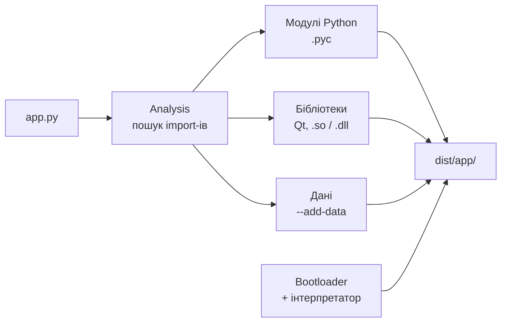
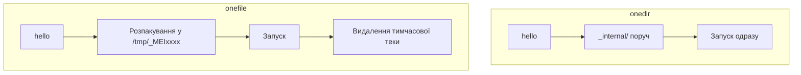

# 24. (Л) Пакування та розгортання застосунків за допомогою PyInstaller

## Зміст лекції

1. Проблема: «у мене працює»
2. Що робить PyInstaller
3. Перша збірка
4. Основні опції
5. `onedir` чи `onefile`
6. Файли ресурсів і шляхи
7. Spec-файл
8. Розгортання
9. Типові проблеми
10. Підсумок

## Проблема: «у мене працює»

Застосунок готовий, і його треба віддати користувачу. Щоб запустити `python app.py`, у користувача мають бути:

- Python потрібної версії;
- віртуальне середовище з PySide6 і рештою залежностей;
- уміння користуватись терміналом.

Звичайний користувач не має жодного з цих пунктів. Він чекає на файл, який запускається подвійним кліком.

**PyInstaller** вирішує саме це: збирає ваш код, інтерпретатор Python і всі залежності в одну теку (або один файл), яку можна запустити на машині без Python.

## Що робить PyInstaller

PyInstaller не компілює Python у машинний код. Він аналізує `import`-и, знаходить усі модулі й бібліотеки, які реально використовуються, і складає їх разом із копією інтерпретатора та маленькою програмою-завантажувачем (bootloader).



Під час запуску bootloader піднімає вбудований інтерпретатор і виконує ваш скрипт так, ніби це звичайний `python app.py`.

!!! warning "PyInstaller — не крос-компілятор"
    Збірка для Linux робиться на Linux, для macOS — на macOS, для Windows — на Windows. Зібрати на Linux виконуваний файл для іншої ОС неможливо.

## Перша збірка

Встановлення — у той самий venv, де встановлено PySide6:

```bash
pip install pyinstaller
```

Застосунок для прикладу:

```python
import sys

from PySide6.QtWidgets import QApplication, QLabel, QVBoxLayout, QWidget


class Window(QWidget):
    def __init__(self):
        super().__init__()

        self.setWindowTitle("Hello PyInstaller")

        # sys.frozen з'являється лише у зібраному застосунку
        frozen = getattr(sys, "frozen", False)

        layout = QVBoxLayout(self)
        layout.addWidget(QLabel("Hello from a packaged app"))
        layout.addWidget(QLabel(f"Frozen: {frozen}"))


def main():
    app = QApplication(sys.argv)

    window = Window()
    window.resize(320, 100)
    window.show()

    sys.exit(app.exec())


if __name__ == "__main__":
    main()
```

Збірка:

```bash
pyinstaller --name hello app.py
```

Після завершення з'являться:

```text
.
├── app.py
├── hello.spec        # опис збірки (про нього нижче)
├── build/            # проміжні файли, можна видаляти
└── dist/
    └── hello/        # готовий застосунок
        ├── hello     # виконуваний файл
        └── _internal/  # інтерпретатор, Qt, модулі
```

Запуск:

```bash
./dist/hello/hello
```

Віддавати користувачу треба **всю теку** `dist/hello/`, а не лише файл `hello`.

!!! tip "`.gitignore`"
    `build/` і `dist/` — результат збірки, їх не комітять. Spec-файл, навпаки, комітять разом із кодом.

## Основні опції

| Опція | Що робить |
|---|---|
| `--name NAME` | Ім'я виконуваного файла й теки в `dist/` |
| `--onedir` | Результат — тека (типово) |
| `--onefile` | Результат — один виконуваний файл |
| `--windowed` | Без консольного вікна (Windows, macOS); на macOS ще й створює `.app`. На Linux ігнорується |
| `--icon FILE` | Іконка виконуваного файла (`.ico` для Windows, `.icns` для macOS) |
| `--add-data SRC:DEST` | Додати файл або теку з даними |
| `--hidden-import MODULE` | Додати модуль, який PyInstaller не знайшов сам |
| `--clean` | Очистити кеш перед збіркою |
| `--noconfirm` | Перезаписувати `dist/` без запитання |

Типова команда для GUI-застосунку:

```bash
pyinstaller --noconfirm --windowed --name hello app.py
```

Повний список опцій: `pyinstaller --help` або розділ [Using PyInstaller](https://pyinstaller.org/en/stable/usage.html) у документації.

## `onedir` чи `onefile`



| | `--onedir` | `--onefile` |
|---|---|---|
| Результат | Тека з багатьма файлами | Один файл |
| Запуск | Швидкий | Повільніший: щоразу розпаковується в тимчасову теку |
| Розмір (приклад з PySide6) | ~170 МБ | ~65 МБ (стиснуто) |
| Зручність передачі | Треба пакувати в архів | Просто скопіювати |
| Налагодження | Легше: видно всі файли | Складніше |

Для Qt-застосунків зазвичай обирають `onedir` і пакують теку в архів або інсталятор. `onefile` зручний для невеликих утиліт.

## Файли ресурсів і шляхи

Застосунку часто потрібні іконки, шаблони, файли перекладів. PyInstaller не бачить їх через `import`, тож їх треба додати явно:

```bash
pyinstaller --noconfirm --windowed --name hello --add-data "assets:assets" app.py
```

`assets:assets` означає: «тека `assets` з проєкту → тека `assets` у зібраному застосунку».

Головна пастка — **шлях до ресурсу**. Відносний шлях `Path("assets/greeting.txt")` рахується від поточного каталогу, а не від застосунку: запуск з іншої теки чи з ярлика його ламає. Правильно — рахувати шлях від `__file__`. PyInstaller налаштовує `__file__` так, що цей спосіб працює і до, і після збірки.

Приклад (перед запуском створіть файл ресурсу):

```bash
mkdir -p assets
echo "Hello from a bundled file" > assets/greeting.txt
```

```python
import sys
from pathlib import Path

from PySide6.QtWidgets import QApplication, QLabel, QVBoxLayout, QWidget

# Каталог із файлами застосунку.
# Звичайний запуск: тека зі скриптом.
# onedir: dist/hello/_internal. onefile: тимчасова тека /tmp/_MEIxxxx
BASE_DIR = Path(__file__).resolve().parent


def read_greeting():
    path = BASE_DIR / "assets" / "greeting.txt"
    try:
        return path.read_text(encoding="utf-8").strip()
    except OSError:
        return f"File not found: {path}"


class Window(QWidget):
    def __init__(self):
        super().__init__()

        self.setWindowTitle("Hello PyInstaller")

        frozen = getattr(sys, "frozen", False)

        layout = QVBoxLayout(self)
        layout.addWidget(QLabel(read_greeting()))
        layout.addWidget(QLabel(f"Frozen: {frozen}"))
        layout.addWidget(QLabel(f"Base dir: {BASE_DIR}"))


def main():
    app = QApplication(sys.argv)

    window = Window()
    window.resize(420, 120)
    window.show()

    sys.exit(app.exec())


if __name__ == "__main__":
    main()
```

!!! danger "Не пишіть у каталог застосунку"
    `BASE_DIR` — лише для **читання** ресурсів. У режимі `onefile` це тимчасова тека, яка зникає після закриття застосунку, а в установленому застосунку каталог часто недоступний для запису. Дані користувача, налаштування й логи зберігайте в каталогах від `QStandardPaths` — див. [лекцію 22](22-error-handling-settings-lecture.md).

## Spec-файл

Перша збірка створює `hello.spec` — Python-файл з описом збірки. Опції командного рядка перетворюються на його параметри:

```python
# -*- mode: python ; coding: utf-8 -*-
# Файл згенеровано командою:
# pyinstaller --windowed --name hello --add-data "assets:assets" app.py

a = Analysis(
    ["app.py"],
    pathex=[],
    binaries=[],
    datas=[("assets", "assets")],  # --add-data
    hiddenimports=[],              # --hidden-import
    hookspath=[],
    hooksconfig={},
    runtime_hooks=[],
    excludes=[],
    noarchive=False,
    optimize=0,
)
pyz = PYZ(a.pure)

exe = EXE(
    pyz,
    a.scripts,
    [],
    exclude_binaries=True,
    name="hello",
    debug=False,
    bootloader_ignore_signals=False,
    strip=False,
    upx=True,
    console=False,  # --windowed
    disable_windowed_traceback=False,
    argv_emulation=False,
    target_arch=None,
    codesign_identity=None,
    entitlements_file=None,
)
coll = COLLECT(
    exe,
    a.binaries,
    a.datas,
    strip=False,
    upx=True,
    upx_exclude=[],
    name="hello",
)
```

Цей файл виконується лише самим PyInstaller, окремо його не запускають. Далі збирають уже зі spec-файла, і довгий рядок опцій більше не потрібен:

```bash
pyinstaller --noconfirm hello.spec
```

Spec-файл комітять у репозиторій: тоді збірка відтворювана, і кожен у команді (або CI) збирає однаково.

## Розгортання

Зібрати — пів справи. Далі застосунок треба доставити користувачу.

- **Збирайте на кожній цільовій ОС.** Для кількох платформ зазвичай налаштовують CI (наприклад, GitHub Actions) з окремою збіркою для кожної ОС.
- **Linux: збирайте на найстарішій системі, яку підтримуєте.** Зібраний застосунок залежить від версії `glibc` і працює на системах з такою самою або новішою версією, але не старішою.
- **Пакуйте результат.** Теку `onedir` передають архівом:

    ```bash
    tar -czf hello-linux-x86_64.tar.gz -C dist hello
    ```

- **Інсталятори й формати пакетів** (`.deb`, AppImage, `.dmg`, інсталятори Windows) створюються окремими інструментами поверх результату PyInstaller.
- **Перевіряйте на чистій машині.** Застосунок, що запускається у вас, може не запуститись там, де немає вашого venv і ваших файлів. Найпростіше — віртуальна машина або контейнер.

## Типові проблеми

**Застосунок не запускається й нічого не каже.** Запустіть виконуваний файл із терміналу — traceback з'явиться там. Якщо збирали з `--windowed`, для налагодження зберіть без цієї опції.

```bash
./dist/hello/hello
```

**`ModuleNotFoundError` у зібраному застосунку.** Модуль імпортується динамічно (`importlib.import_module`, плагіни), і PyInstaller його не побачив. Рішення — `--hidden-import module_name` або `hiddenimports` у spec-файлі.

**`FileNotFoundError` для ресурсу.** Файл не додано через `--add-data`, або шлях рахується від поточного каталогу, а не від `__file__`.

**Дивна поведінка після змін.** Застарілий кеш збірки: `pyinstaller --clean --noconfirm hello.spec`.

**Великий розмір.** PySide6 тягне багато Qt-бібліотек. Збирайте з чистого venv, де встановлено лише потрібне: PyInstaller забирає все, що імпортується.

!!! note "Альтернатива: `pyside6-deploy`"
    Разом із PySide6 постачається власний інструмент [`pyside6-deploy`](https://doc.qt.io/qtforpython-6/deployment/deployment-pyside6-deploy.html). Він працює на основі Nuitka і справді компілює Python у C, але збірка значно довша. Для цього курсу достатньо PyInstaller.

## Підсумок

- **PyInstaller збирає код, інтерпретатор і залежності** в теку або файл, що запускається без встановленого Python.
- **Це не крос-компілятор:** збирають на тій ОС, для якої потрібен результат.
- **`onedir` — типовий вибір для Qt**: швидкий запуск, пакується в архів. `onefile` — один файл, але повільніший старт.
- **Ресурси додають через `--add-data`**, а шлях до них рахують від `Path(__file__).resolve().parent`.
- **Писати можна лише в каталоги від `QStandardPaths`**, не поруч із застосунком.
- **Spec-файл — відтворювана збірка**, його комітять; `build/` і `dist/` — ні.
- **Перевіряють на чистій машині** і з терміналу, щоб бачити помилки.

## Корисні посилання

- [PyInstaller: документація](https://pyinstaller.org/en/stable/)
- [PyInstaller: Using PyInstaller (опції командного рядка)](https://pyinstaller.org/en/stable/usage.html)
- [PyInstaller: What PyInstaller Does and How It Does It](https://pyinstaller.org/en/stable/operating-mode.html)
- [PyInstaller: Using Spec Files](https://pyinstaller.org/en/stable/spec-files.html)
- [PyInstaller: Run-time Information (`sys.frozen`, `__file__`)](https://pyinstaller.org/en/stable/runtime-information.html)
- [PyInstaller: When Things Go Wrong](https://pyinstaller.org/en/stable/when-things-go-wrong.html)
- [PyInstaller: Common Issues and Pitfalls](https://pyinstaller.org/en/stable/common-issues-and-pitfalls.html)
- [Qt for Python: Deployment](https://doc.qt.io/qtforpython-6/deployment/index.html)
- [Qt for Python: PyInstaller](https://doc.qt.io/qtforpython-6/deployment/deployment-pyinstaller.html)
- [Qt for Python: pyside6-deploy](https://doc.qt.io/qtforpython-6/deployment/deployment-pyside6-deploy.html)
