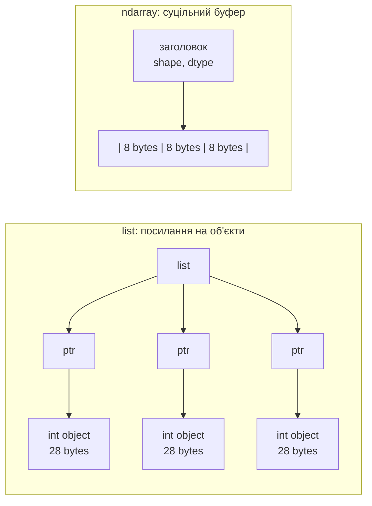

# 25. (Л) Вступ до NumPy. Масиви ndarray, створення, типи даних

## Зміст лекції

1. Навіщо NumPy: числа у списках Python
2. Встановлення та імпорт
3. Що таке `ndarray`
4. Атрибути масиву
5. Створення масиву з Python-даних
6. Масиви-заготовки: `zeros`, `ones`, `full`, `eye`
7. Числові послідовності: `arange` і `linspace`
8. Форма масиву: `reshape`
9. Типи даних (`dtype`)
10. Як NumPy обирає тип
11. Перетворення типів: `astype`
12. Межі типів і переповнення
13. Поелементна арифметика
14. Універсальні функції та агрегати
15. Осі (`axis`)
16. Типові помилки
17. Підсумок

## Навіщо NumPy: числа у списках Python

Список Python — універсальний контейнер. У ньому можна тримати числа, рядки, словники й інші списки впереміш. За цю гнучкість доводиться платити, і коли даних багато, ціна стає відчутною.

Задача: є мільйон чисел, треба знайти суму їхніх квадратів.

```python
import time

import numpy as np

N = 1_000_000

# Звичайний Python: список і цикл
values = list(range(N))
start = time.perf_counter()
total_list = sum(x * x for x in values)
list_time = time.perf_counter() - start

# NumPy: масив і одна операція над усім масивом
array = np.arange(N)
start = time.perf_counter()
total_numpy = (array * array).sum()
numpy_time = time.perf_counter() - start

print(f"list:    {list_time:.4f} s, total = {total_list}")
print(f"numpy:   {numpy_time:.4f} s, total = {total_numpy}")
print(f"speedup: {list_time / numpy_time:.0f}x")
```

Приблизний результат (числа залежать від комп'ютера):

```text
list:    0.0176 s, total = 333332833333500000
numpy:   0.0018 s, total = 333332833333500000
speedup: 10x
```

Результат однаковий, але NumPy рахує приблизно в десять разів швидше, а на складніших обчисленнях різниця сягає десятків і сотень разів. Причин дві.

**1. Пам'ять.** Список зберігає не числа, а **посилання** на окремі об'єкти `int`. Кожен такий об'єкт має заголовок (лічильник посилань, тип, розмір) і розкиданий десь у пам'яті. Масив NumPy зберігає самі числа — одним суцільним блоком байтів, одне за одним.



**2. Цикл.** У виразі `sum(x * x for x in values)` інтерпретатор на кожному кроці з'ясовує тип `x`, шукає для нього операцію `*`, створює новий об'єкт `int` для результату. У виразі `array * array` тип відомий заздалегідь (усі елементи однакові), і NumPy виконує цикл усередині скомпільованого коду на C — без інтерпретатора.

Різницю в пам'яті легко виміряти:

```python
import sys

import numpy as np

N = 1_000_000

values = list(range(N))
# розмір самого списку (масив посилань) + розмір кожного об'єкта int
list_bytes = sys.getsizeof(values) + sum(sys.getsizeof(x) for x in values)

array = np.arange(N)

print(f"list:    {list_bytes / 1_000_000:.1f} MB")
print(f"ndarray: {array.nbytes / 1_000_000:.1f} MB")
```

```text
list:    36.0 MB
ndarray: 8.0 MB
```

Такий спосіб роботи — одна операція над усім масивом замість циклу по елементах — називається **векторизацією**. Це головна ідея NumPy, і на ній тримається все, що буде далі в модулі: pandas, наукові обчислення, машинне навчання.

!!! note "Що таке NumPy"
    **NumPy** (Numerical Python) — бібліотека для роботи з багатовимірними числовими масивами. Вона дає тип `ndarray`, сотні математичних функцій над ним, лінійну алгебру й генерацію випадкових чисел. На NumPy побудовані pandas, SciPy, Matplotlib, scikit-learn та багато інших бібліотек.

## Встановлення та імпорт

NumPy — стороння бібліотека, її встановлюють у віртуальне середовище:

```bash
python3 -m venv env
source env/bin/activate
pip install numpy
```

Перевірка:

```bash
python -c "import numpy as np; print(np.__version__)"
```

```text
2.2.4
```

Імпорт завжди пишуть так:

```python
import numpy as np

print(np.__version__)
```

Скорочення `np` — загальноприйнята домовленість. Його використовують документація, підручники, Stack Overflow і будь-який код, який ви прочитаєте. Писати `import numpy` чи `from numpy import *` технічно можна, але так ніхто не робить.

## Що таке `ndarray`

`ndarray` (N-dimensional array) — основний тип NumPy. Він має три ключові властивості:

| Властивість | Що означає | Чим відрізняється від `list` |
|---|---|---|
| **однорідність** | усі елементи мають один тип (`dtype`) | у списку можуть бути елементи будь-яких типів |
| **фіксований розмір** | кількість елементів задається при створенні | список росте через `append()` |
| **багатовимірність** | масив може мати 1, 2, 3 і більше вимірів | «таблиця» в Python — це список списків |

Виміри масиву в NumPy називають **осями** (axes).

```text
1D: shape (4,)            2D: shape (2, 3)           3D: shape (2, 2, 3)

[1 2 3 4]                 [[1 2 3]                   [[[ 1  2  3]
                           [4 5 6]]                    [ 4  5  6]]

  вектор                    матриця:                  [[ 7  8  9]
                            2 рядки, 3 стовпці          [10 11 12]]]

                                                      2 матриці 2x3
```

Приклади з життя:

- **1D** — температура за кожну годину доби: 24 числа;
- **2D** — оцінки студентів: рядок — студент, стовпець — предмет;
- **3D** — кольорове зображення: висота × ширина × 3 канали (R, G, B).

## Атрибути масиву

Кожен масив знає про себе все необхідне:

```python
import numpy as np

matrix = np.array([[1, 2, 3], [4, 5, 6]])

print(matrix)
print("ndim:    ", matrix.ndim)
print("shape:   ", matrix.shape)
print("size:    ", matrix.size)
print("dtype:   ", matrix.dtype)
print("itemsize:", matrix.itemsize)
print("nbytes:  ", matrix.nbytes)
print("type:    ", type(matrix))
```

```text
[[1 2 3]
 [4 5 6]]
ndim:     2
shape:    (2, 3)
size:     6
dtype:    int64
itemsize: 8
nbytes:   48
type:     <class 'numpy.ndarray'>
```

| Атрибут | Значення |
|---|---|
| `ndim` | кількість вимірів (осей) |
| `shape` | кортеж: розмір уздовж кожної осі |
| `size` | загальна кількість елементів, добуток чисел із `shape` |
| `dtype` | тип елементів |
| `itemsize` | розмір одного елемента в байтах |
| `nbytes` | розмір даних у байтах: `size * itemsize` |

!!! tip "`shape` одновимірного масиву"
    Для 1D-масиву `shape` — це кортеж з одного елемента: `(4,)`, а не `4` і не `(4)`. Кома обов'язкова: `(4)` у Python — просто число в дужках.

Зверніть увагу: `print()` показує масив **без ком** між елементами — так його легко відрізнити від списку. Функція `repr()` (або вивід в інтерактивній консолі) показує повну форму:

```python
import numpy as np

numbers = np.array([1, 2, 3])

print(numbers)
print(repr(numbers))
print([1, 2, 3])
```

```text
[1 2 3]
array([1, 2, 3])
[1, 2, 3]
```

## Створення масиву з Python-даних

Найпростіший спосіб — функція `np.array()`, яка приймає список (або кортеж) чи вкладені списки:

```python
import numpy as np

vector = np.array([10, 20, 30, 40])
matrix = np.array([[1.5, 2.0], [3.0, 4.5]])
cube = np.array([[[1, 2], [3, 4]], [[5, 6], [7, 8]]])
from_tuple = np.array((True, False, True))

for name, array in [("vector", vector), ("matrix", matrix),
                    ("cube", cube), ("from_tuple", from_tuple)]:
    print(f"{name}: shape={array.shape}, dtype={array.dtype}")
    print(array)
    print()
```

```text
vector: shape=(4,), dtype=int64
[10 20 30 40]

matrix: shape=(2, 2), dtype=float64
[[1.5 2. ]
 [3.  4.5]]

cube: shape=(2, 2, 2), dtype=int64
[[[1 2]
  [3 4]]

 [[5 6]
  [7 8]]]

from_tuple: shape=(3,), dtype=bool
[ True False  True]
```

Кількість вкладених рівнів списку визначає кількість вимірів. Запис `2.` — це `2.0`: NumPy скорочує нулі після крапки.

**Вкладені списки мають бути однакової довжини.** Масив — прямокутний, «рваних» рядків у ньому не буває:

```python
import numpy as np

try:
    ragged = np.array([[1, 2, 3], [4, 5]])
except ValueError as error:
    print("ValueError:", error)
```

```text
ValueError: setting an array element with a sequence. The requested array has an inhomogeneous shape after 1 dimensions. The detected shape was (2,) + inhomogeneous part.
```

**Типова помилка** — передати числа окремими аргументами замість списку:

```python
import numpy as np

try:
    wrong = np.array(1, 2, 3)
except TypeError as error:
    print("TypeError:", error)

right = np.array([1, 2, 3])
print(right)
```

```text
TypeError: array() takes from 1 to 2 positional arguments but 3 were given
[1 2 3]
```

## Масиви-заготовки: `zeros`, `ones`, `full`, `eye`

Часто розмір масиву відомий, а значення будуть обчислені пізніше. Для цього є функції, які створюють масив потрібної форми, заповнений однаковими значеннями:

```python
import numpy as np

print("zeros:")
print(np.zeros(5))

print("ones (2, 3), int:")
print(np.ones((2, 3), dtype=int))

print("full (2, 4) with 7:")
print(np.full((2, 4), 7))

print("eye 3:")
print(np.eye(3))

print("empty (2, 2):")
print(np.empty((2, 2)))
```

```text
zeros:
[0. 0. 0. 0. 0.]
ones (2, 3), int:
[[1 1 1]
 [1 1 1]]
full (2, 4) with 7:
[[7 7 7 7]
 [7 7 7 7]]
eye 3:
[[1. 0. 0.]
 [0. 1. 0.]
 [0. 0. 1.]]
empty (2, 2):
[[6.91384439e-310 6.91384439e-310]
 [0.00000000e+000 0.00000000e+000]]
```

| Функція | Що створює | Тип за замовчуванням |
|---|---|---|
| `np.zeros(shape)` | масив нулів | `float64` |
| `np.ones(shape)` | масив одиниць | `float64` |
| `np.full(shape, value)` | масив, заповнений `value` | тип `value` |
| `np.eye(n)` | одинична матриця `n × n` | `float64` |
| `np.empty(shape)` | масив **без ініціалізації** | `float64` |

Три моменти, які важливо запам'ятати:

- **форма передається одним аргументом**: `np.zeros((2, 3))` — з подвійними дужками. Запис `np.zeros(2, 3)` — помилка: друге число NumPy сприйме як `dtype`;
- **`zeros` і `ones` за замовчуванням створюють дробові числа** — `0.` і `1.`, а не `0` і `1`. Цілі потрібно просити явно через `dtype=int`;
- **`np.empty` не заповнює масив нічим**: у ньому лежить те, що було в пам'яті раніше (у вас значення будуть інші). Ця функція трохи швидша, але використовують її лише тоді, коли кожен елемент гарантовано буде перезаписано.

Функції з суфіксом `_like` створюють масив **такої ж форми й типу**, як інший:

```python
import numpy as np

prices = np.array([[19.99, 5.49, 3.00], [7.25, 12.10, 1.75]])

discounts = np.zeros_like(prices)
counts = np.ones_like(prices, dtype=int)

print(prices.shape, discounts.shape, counts.shape)
print(discounts)
print(counts)
```

```text
(2, 3) (2, 3) (2, 3)
[[0. 0. 0.]
 [0. 0. 0.]]
[[1 1 1]
 [1 1 1]]
```

## Числові послідовності: `arange` і `linspace`

### `np.arange`

`np.arange` — аналог вбудованого `range`, але повертає масив і вміє працювати з дробовим кроком:

```python
import numpy as np

print(np.arange(5))           # від 0 до 5, не включаючи 5
print(np.arange(2, 10))       # від 2 до 10
print(np.arange(0, 20, 5))    # крок 5
print(np.arange(10, 0, -3))   # крок може бути від'ємним
print(np.arange(0, 1, 0.25))  # дробовий крок
```

```text
[0 1 2 3 4]
[2 3 4 5 6 7 8 9]
[ 0  5 10 15]
[10  7  4  1]
[0.   0.25 0.5  0.75]
```

Як і в `range`, кінець **не входить** у результат.

!!! warning "`arange` із дробовим кроком"
    Дробові числа в комп'ютері неточні, тому кількість елементів при дробовому кроці може виявитися несподіваною:

    ```python
    import numpy as np

    print(np.arange(1, 1.3, 0.1))
    ```

    ```text
    [1.  1.1 1.2 1.3]
    ```

    Очікували три елементи (`1.3` не мав увійти), отримали чотири: `1 + 3 * 0.1` дає `1.3000000000000003`, і NumPy вирішує, що місця ще на один крок вистачає. Для дробових послідовностей використовуйте `linspace`.

### `np.linspace`

`np.linspace(start, stop, num)` ділить відрізок на **задану кількість точок**. Крок NumPy обчислює сам, і кінець за замовчуванням **входить**:

```python
import numpy as np

print(np.linspace(0, 1, 5))
print(np.linspace(0, 1, 5, endpoint=False))

points, step = np.linspace(0, 100, 9, retstep=True)
print(points)
print("step:", step)
```

```text
[0.   0.25 0.5  0.75 1.  ]
[0.  0.2 0.4 0.6 0.8]
[  0.   12.5  25.   37.5  50.   62.5  75.   87.5 100. ]
step: 12.5
```

| | `arange(start, stop, step)` | `linspace(start, stop, num)` |
|---|---|---|
| Що задаєте | крок | кількість точок |
| `stop` входить? | ні | так (можна вимкнути: `endpoint=False`) |
| Тип | цілий, якщо всі аргументи цілі | завжди `float64` |
| Коли використовувати | цілі послідовності, індекси | дробові сітки: час, координати, графіки |

## Форма масиву: `reshape`

Метод `reshape` перекладає ті самі елементи в іншу форму. Кількість елементів при цьому змінитись не може:

```python
import numpy as np

numbers = np.arange(12)
print(numbers)

print("reshape(3, 4):")
print(numbers.reshape(3, 4))

print("reshape(2, 6):")
print(numbers.reshape(2, 6))

print("reshape(2, 3, 2):")
print(numbers.reshape(2, 3, 2))
```

```text
[ 0  1  2  3  4  5  6  7  8  9 10 11]
reshape(3, 4):
[[ 0  1  2  3]
 [ 4  5  6  7]
 [ 8  9 10 11]]
reshape(2, 6):
[[ 0  1  2  3  4  5]
 [ 6  7  8  9 10 11]]
reshape(2, 3, 2):
[[[ 0  1]
  [ 2  3]
  [ 4  5]]

 [[ 6  7]
  [ 8  9]
  [10 11]]]
```

Елементи заповнюють нову форму **рядок за рядком** — зліва направо, згори вниз.

Один із розмірів можна замінити на `-1`: NumPy обчислить його сам.

```python
import numpy as np

numbers = np.arange(12)

print(numbers.reshape(4, -1).shape)   # 12 / 4 = 3 стовпці
print(numbers.reshape(-1, 6).shape)   # 12 / 6 = 2 рядки

matrix = numbers.reshape(3, 4)
print(matrix.reshape(-1))             # назад в один вимір
print(matrix.ravel())                 # те саме

try:
    numbers.reshape(5, 2)
except ValueError as error:
    print("ValueError:", error)
```

```text
(4, 3)
(2, 6)
[ 0  1  2  3  4  5  6  7  8  9 10 11]
[ 0  1  2  3  4  5  6  7  8  9 10 11]
ValueError: cannot reshape array of size 12 into shape (5,2)
```

Типовий прийом — створити послідовність через `arange` і одразу надати їй потрібну форму:

```python
import numpy as np

table = np.arange(1, 10).reshape(3, 3)
print(table)
```

```text
[[1 2 3]
 [4 5 6]
 [7 8 9]]
```

!!! note "`reshape` не змінює оригінал"
    `reshape` повертає **новий об'єкт-масив**, а початковий лишається тієї самої форми. Проте дані в пам'яті вони зазвичай ділять спільні — це називається *перегляд* (view). Детально про перегляди й копії — у лекції 27.

## Типи даних (`dtype`)

У масиві всі елементи одного типу, і цей тип — `dtype` — визначає, скільки байтів займає елемент і які значення в нього поміщаються.

| Група | `dtype` | Байтів | Діапазон / опис |
|---|---|---|---|
| логічний | `bool` | 1 | `True` / `False` |
| цілі зі знаком | `int8` | 1 | −128 .. 127 |
| | `int16` | 2 | −32 768 .. 32 767 |
| | `int32` | 4 | ≈ ±2.1 млрд |
| | `int64` | 8 | ≈ ±9.2 · 10¹⁸ |
| цілі без знаку | `uint8` | 1 | 0 .. 255 |
| | `uint16`, `uint32`, `uint64` | 2, 4, 8 | 0 .. 2ⁿ − 1 |
| дробові | `float16` | 2 | ≈ 4 значущі цифри |
| | `float32` | 4 | ≈ 7 значущих цифр |
| | `float64` | 8 | ≈ 15–16 значущих цифр (як `float` у Python) |
| комплексні | `complex128` | 16 | `1+2j` |
| рядки | `<U10` | 40 | рядок Unicode до 10 символів |
| об'єкти | `object` | 8 | посилання на довільні Python-об'єкти |

Число в назві — кількість **біт**, а не байтів: `int32` — 32 біти, тобто 4 байти.

Точні межі можна дізнатися в коді:

```python
import numpy as np

for dtype in [np.int8, np.int16, np.int32, np.int64, np.uint8]:
    info = np.iinfo(dtype)
    print(f"{info.dtype}: {info.min} .. {info.max}")

for dtype in [np.float16, np.float32, np.float64]:
    info = np.finfo(dtype)
    print(f"{info.dtype}: max={info.max}, digits={info.precision}")
```

```text
int8: -128 .. 127
int16: -32768 .. 32767
int32: -2147483648 .. 2147483647
int64: -9223372036854775808 .. 9223372036854775807
uint8: 0 .. 255
float16: max=65504.0, digits=3
float32: max=3.4028234663852886e+38, digits=6
float64: max=1.7976931348623157e+308, digits=15
```

Тип задають параметром `dtype` будь-якої функції створення. Приймаються три форми запису — вони рівнозначні:

```python
import numpy as np

a = np.array([1, 2, 3], dtype=np.int16)   # об'єкт типу NumPy
b = np.array([1, 2, 3], dtype="int16")    # рядок з назвою
c = np.zeros(3, dtype=float)              # тип Python: float -> float64

print(a.dtype, b.dtype, c.dtype)
```

```text
int16 int16 float64
```

Вибір типу — це компроміс між пам'яттю й діапазоном. Для мільйона елементів різниця помітна:

```python
import numpy as np

N = 1_000_000

for dtype in ["int8", "int16", "int32", "int64", "float32", "float64"]:
    array = np.zeros(N, dtype=dtype)
    print(f"{dtype:>7}: {array.nbytes / 1_000_000:>4.0f} MB")
```

```text
    int8:    1 MB
   int16:    2 MB
   int32:    4 MB
   int64:    8 MB
 float32:    4 MB
 float64:    8 MB
```

!!! tip "Який тип обирати"
    Поки немає причини інакше — залишайте типи за замовчуванням: `int64` і `float64`. Менші типи (`uint8`, `float32`) беруть свідомо: для зображень (пікселі 0..255), великих масивів, які мають поміститися в пам'ять, або коли цього вимагає інша бібліотека.

## Як NumPy обирає тип

Якщо `dtype` не задано, NumPy обирає **найменш загальний тип, у який поміщаються всі елементи**:

```python
import numpy as np

examples = [
    [1, 2, 3],
    [1.0, 2, 3],
    [True, False],
    [True, 2, 3.5],
    [1, 2, 3 + 4j],
    ["kyiv", "lviv", "odesa"],
    [1, "two", 3.0],
]

for data in examples:
    array = np.array(data)
    print(f"{str(data):<28} -> {array.dtype}: {array}")
```

```text
[1, 2, 3]                    -> int64: [1 2 3]
[1.0, 2, 3]                  -> float64: [1. 2. 3.]
[True, False]                -> bool: [ True False]
[True, 2, 3.5]               -> float64: [1.  2.  3.5]
[1, 2, (3+4j)]               -> complex128: [1.+0.j 2.+0.j 3.+4.j]
['kyiv', 'lviv', 'odesa']    -> <U5: ['kyiv' 'lviv' 'odesa']
[1, 'two', 3.0]              -> <U32: ['1' 'two' '3.0']
```

Порядок «підвищення» типу: `bool` → цілі → дробові → комплексні. Одного дробового числа достатньо, щоб увесь масив став `float64`.

Останній рядок — пастка: число й рядок у одному списку перетворюють **усі** елементи на рядки. Із таким масивом уже не можна рахувати: `'1' + '3.0'` — не число.

`<U5` читається так: `<` — порядок байтів, `U` — Unicode-рядок, `5` — максимальна довжина. Рядок, довший за цю межу, при записі в масив мовчки обріжеться.

!!! note "`int64` чи `int32`"
    На Linux і macOS цілі за замовчуванням — `int64`. У NumPy 1.x на Windows за замовчуванням був `int32`; починаючи з NumPy 2.0 скрізь `int64`.

## Перетворення типів: `astype`

Метод `astype` створює **новий масив** із тими самими значеннями в іншому типі:

```python
import numpy as np

temperatures = np.array([-2.7, -0.5, 0.5, 3.9, 21.5])

print("float:  ", temperatures)
print("int:    ", temperatures.astype(int))
print("rounded:", np.round(temperatures).astype(int))
print("bool:   ", np.array([0, 3, 0, -1]).astype(bool))

text = np.array(["1.5", "2", "-3.25"])
print("from str:", text.astype(float))
print("to str:  ", np.array([1, 20, 300]).astype(str))

print("original is unchanged:", temperatures.dtype)
```

```text
float:   [-2.7 -0.5  0.5  3.9 21.5]
int:     [-2  0  0  3 21]
rounded: [-3  0  0  4 22]
bool:    [False  True False  True]
from str: [ 1.5   2.   -3.25]
to str:   ['1' '20' '300']
original is unchanged: float64
```

Що варто помітити:

- **дробові → цілі відкидають дробову частину** (округлення до нуля): `-2.7` → `-2`, `3.9` → `3`. Якщо потрібне математичне округлення — спочатку `np.round`, потім `astype(int)`;
- `np.round` округлює `.5` **до найближчого парного**: `-0.5` → `0`, `0.5` → `0`, `21.5` → `22`;
- **ненульове число → `True`**, нуль → `False`;
- рядки з числами перетворюються на числа — зручно, коли дані прочитано з текстового файла;
- **оригінал не змінюється**. Результат `astype` треба зберегти у змінну.

## Межі типів і переповнення

Звичайний `int` у Python не має верхньої межі: `2 ** 100` — коректне число. Цілі типи NumPy мають фіксований розмір, і результат, який виходить за межі, **мовчки «загортається»** по колу:

```python
import numpy as np

small = np.array([100, 120, 127], dtype=np.int8)
print(small + 10)

pixels = np.array([200, 250, 10], dtype=np.uint8)
print(pixels + 100)
print(pixels - 20)
```

```text
[ 110 -126 -119]
[ 44  94 110]
[180 230 246]
```

Жодної помилки, жодного попередження. `127 + 10` у `int8` дає `-119`, а піксель яскравості `250` після «освітлення» на `100` стає майже чорним — `94`.

Це схоже на механічний лічильник кілометрів: після `999999` він показує `000000`.

```text
int8:   ... 125  126  127 | -128 -127 -126 ...
                          ^ переповнення
uint8:  ... 253  254  255 |    0    1    2 ...
```

Числа, які не поміщаються в тип ще **при створенні**, NumPy 2 не пропустить:

```python
import numpy as np

try:
    np.array([100, 200, 300], dtype=np.int8)
except OverflowError as error:
    print("OverflowError:", error)
```

```text
OverflowError: Python integer 200 out of bounds for int8
```

А ось переповнення під час обчислень над масивами ловити доведеться вам. Найпростіший захист — перейти на ширший тип **до** операції:

```python
import numpy as np

pixels = np.array([200, 250, 10], dtype=np.uint8)

brighter = pixels.astype(np.int16) + 100     # у int16 є місце для 350
brighter = np.clip(brighter, 0, 255)         # обрізати до меж яскравості
brighter = brighter.astype(np.uint8)         # повернути тип зображення

print(brighter)
```

```text
[255 255 110]
```

Дробові типи не загортаються, а переходять у `inf` (нескінченність) і мають обмежену точність:

```python
import numpy as np

print(np.array([60000], dtype=np.float16) * 2)

value32 = np.float32(0.1)
value64 = np.float64(0.1)
print(value32)
print(value32 == value64)
print(f"{value32:.20f}")
print(f"{value64:.20f}")
```

```text
[inf]
0.1
False
0.10000000149011611938
0.10000000000000000555
```

`float32` і `float64` зберігають `0.1` з різною похибкою, тому порівняння `==` між ними дає `False`. Дробові числа не порівнюють через `==` — для цього є `np.isclose` і `np.allclose`:

```python
import numpy as np

a = np.array([0.1, 0.2, 0.3], dtype=np.float32)
b = np.array([0.1, 0.2, 0.3])

print(a == b)
print(np.isclose(a, b))
print(np.allclose(a, b))
```

```text
[False False False]
[ True  True  True]
True
```

## Поелементна арифметика

Арифметичні оператори над масивами працюють **поелементно**: перший елемент з першим, другий з другим і так далі. Результат — новий масив тієї ж форми.

```python
import numpy as np

a = np.array([10, 20, 30, 40])
b = np.array([1, 2, 3, 4])

print("a + b  =", a + b)
print("a - b  =", a - b)
print("a * b  =", a * b)
print("a / b  =", a / b)
print("a // 3 =", a // 3)
print("a % 3  =", a % 3)
print("b ** 2 =", b ** 2)
print("-a     =", -a)
```

```text
a + b  = [11 22 33 44]
a - b  = [ 9 18 27 36]
a * b  = [ 10  40  90 160]
a / b  = [10. 10. 10. 10.]
a // 3 = [ 3  6 10 13]
a % 3  = [1 2 0 1]
b ** 2 = [ 1  4  9 16]
-a     = [-10 -20 -30 -40]
```

Ділення `/` завжди дає `float64`, навіть якщо ділиться націло — так само, як у звичайному Python.

**Операція з числом застосовується до кожного елемента.** Без жодного циклу:

```python
import numpy as np

prices_uah = np.array([120.0, 45.5, 999.0, 15.25])
USD_RATE = 41.5

prices_usd = prices_uah / USD_RATE
with_vat = prices_uah * 1.2

print(np.round(prices_usd, 2))
print(with_vat)
```

```text
[ 2.89  1.1  24.07  0.37]
[ 144.    54.6 1198.8   18.3]
```

Порівняльні оператори теж поелементні й повертають масив `bool`:

```python
import numpy as np

scores = np.array([55, 91, 74, 60, 88])

passed = scores >= 60
print(passed)
print(passed.dtype)
print("passed count:", passed.sum())
print("all passed:", passed.all())
print("any excellent:", (scores >= 90).any())
```

```text
[False  True  True  True  True]
bool
passed count: 4
all passed: False
any excellent: True
```

`sum()` над масивом `bool` рахує кількість `True`: `True` вважається за `1`, `False` — за `0`. Це найкоротший спосіб порахувати, скільки елементів задовольняють умову.

!!! warning "Масив — не список"
    Ті самі оператори над списками й масивами роблять **зовсім різні речі**:

    ```python
    import numpy as np

    print([1, 2, 3] + [10, 20, 30])
    print(np.array([1, 2, 3]) + np.array([10, 20, 30]))

    print([1, 2, 3] * 2)
    print(np.array([1, 2, 3]) * 2)
    ```

    ```text
    [1, 2, 3, 10, 20, 30]
    [11 22 33]
    [1, 2, 3, 1, 2, 3]
    [2 4 6]
    ```

    Для списку `+` — склеювання, `*` — повторення. Для масиву — арифметика.

**Форми мають збігатися.** Масиви різної довжини поелементно не складаються:

```python
import numpy as np

try:
    np.array([1, 2, 3]) + np.array([1, 2, 3, 4])
except ValueError as error:
    print("ValueError:", error)
```

```text
ValueError: operands could not be broadcast together with shapes (3,) (4,)
```

Слово *broadcast* у повідомленні — не випадкове. Операція «масив + число» насправді є окремим випадком загального механізму **broadcasting**, який дозволяє поєднувати масиви різних, але сумісних форм — наприклад, додати до кожного рядка матриці один і той самий вектор. Правила broadcasting розберемо в лекції 27.

**Ділення на нуль** не кидає виняток, а дає спеціальні значення й попередження:

```python
import numpy as np

a = np.array([1.0, -1.0, 0.0])

with np.errstate(divide="ignore", invalid="ignore"):
    result = a / 0

print(result)
print(np.isinf(result))
print(np.isnan(result))
```

```text
[ inf -inf  nan]
[ True  True False]
[False False  True]
```

`inf` — нескінченність, `nan` (Not a Number) — «невизначений результат», як `0 / 0`. Без `np.errstate` NumPy виведе `RuntimeWarning: divide by zero encountered in divide`, але обчислення все одно продовжиться.

## Універсальні функції та агрегати

### Універсальні функції (ufunc)

Математичні функції NumPy — `np.sqrt`, `np.abs`, `np.exp` тощо — теж працюють поелементно. Їх називають **універсальними функціями** (universal functions, ufunc):

```python
import numpy as np

x = np.array([1.0, 4.0, 9.0, 16.0])
angles = np.linspace(0, np.pi, 5)

print("sqrt:   ", np.sqrt(x))
print("log10:  ", np.log10(x))
print("abs:    ", np.abs(np.array([-3, 0, 5])))
print("sin:    ", np.round(np.sin(angles), 3))
print("maximum:", np.maximum(np.array([1, 8, 3]), np.array([5, 2, 6])))
```

```text
sqrt:    [1. 2. 3. 4.]
log10:   [0.         0.60205999 0.95424251 1.20411998]
abs:     [3 0 5]
sin:     [0.    0.707 1.    0.707 0.   ]
maximum: [5 8 6]
```

Функції з модуля `math` (`math.sqrt`) працюють лише з одним числом. Над масивами завжди використовуйте версії з `np`.

### Агрегати

**Агрегатна функція** зводить масив до одного числа:

```python
import numpy as np

temperatures = np.array([12.5, 15.0, 9.5, 18.0, 21.5, 17.0, 11.5])

print("sum:   ", temperatures.sum())
print("min:   ", temperatures.min())
print("max:   ", temperatures.max())
print("mean:  ", temperatures.mean())
print("argmin:", temperatures.argmin())
print("argmax:", temperatures.argmax())
print("prod:  ", np.array([1, 2, 3, 4]).prod())
```

```text
sum:    105.0
min:    9.5
max:    21.5
mean:   15.0
argmin: 2
argmax: 4
prod:   24
```

`argmin` і `argmax` повертають не значення, а **позицію** (індекс) мінімуму чи максимуму. Якщо дні тижня нумеруються з нуля, найхолодніший — день `2`, найтепліший — день `4`.

Більшість агрегатів доступні у двох формах, які роблять одне й те саме:

```python
import numpy as np

data = np.array([3, 1, 4, 1, 5])

print(data.sum(), np.sum(data))
print(data.max(), np.max(data))
```

```text
14 14
5 5
```

!!! warning "`sum()` чи `np.sum()`"
    Вбудовані `sum`, `min`, `max` Python теж приймають масив, але перебирають його елементи по одному, як список. На великих масивах це в десятки разів повільніше, а для 2D-масиву ще й дає інший результат. Використовуйте методи масиву або функції `np.`.

Статистичні функції (`median`, `std`, `var`, `percentile`) детально розберемо в лекції 30.

## Осі (`axis`)

Для багатовимірного масиву агрегат можна порахувати не по всіх елементах, а **уздовж однієї осі**. Приклад: продажі трьох магазинів за чотири дні.

```python
import numpy as np

# рядок — магазин, стовпець — день
sales = np.array([
    [12, 15, 11, 20],
    [ 8,  9, 14, 10],
    [20, 18, 25, 22],
])

print("total:        ", sales.sum())
print("per day:      ", sales.sum(axis=0))
print("per shop:     ", sales.sum(axis=1))
print("best day idx: ", sales.sum(axis=0).argmax())
print("max per shop: ", sales.max(axis=1))
print("mean per day: ", sales.mean(axis=0))
```

```text
total:         184
per day:       [40 42 50 52]
per shop:      [58 41 85]
best day idx:  3
max per shop:  [20 14 25]
mean per day:  [13.33333333 14.         16.66666667 17.33333333]
```

```text
                 axis=1 ------------------->

                  day0  day1  day2  day3        sum(axis=1)
                +-----+-----+-----+-----+
 axis=0   shop0 |  12 |  15 |  11 |  20 |  -->  58
   |      shop1 |   8 |   9 |  14 |  10 |  -->  41
   |      shop2 |  20 |  18 |  25 |  22 |  -->  85
   v            +-----+-----+-----+-----+
                   |     |     |     |
                   v     v     v     v
 sum(axis=0)      40    42    50    52
```

Як запам'ятати: **`axis` — це вісь, яка «зникає»** після агрегації.

- `axis=0` — рух згори вниз, уздовж рядків. Кожен **стовпець** схлопується в одне число. Форма `(3, 4)` → `(4,)`: результат для кожного дня.
- `axis=1` — рух зліва направо, уздовж стовпців. Кожен **рядок** схлопується в одне число. Форма `(3, 4)` → `(3,)`: результат для кожного магазину.
- без `axis` — усі елементи зводяться до одного числа.

```python
import numpy as np

sales = np.arange(12).reshape(3, 4)

print(sales.shape)
print(sales.sum(axis=0).shape)
print(sales.sum(axis=1).shape)
print(sales.sum().shape)
```

```text
(3, 4)
(4,)
(3,)
()
```

## Типові помилки

**Форма без дужок.** `np.zeros(3, 4)` замість `np.zeros((3, 4))`. Друге число сприймається як `dtype`, і NumPy повідомляє `TypeError: Cannot interpret '4' as a data type`.

**Очікування цілих від `zeros`/`ones`.** Вони за замовчуванням створюють `float64`. Якщо потрібні цілі — `dtype=int`.

**`arange` із дробовим кроком.** Кількість елементів може відрізнятися на один від очікуваної. Для дробових сіток — `linspace`.

**Змішування чисел і рядків.** `np.array([1, "2", 3])` — масив рядків, а не чисел. Дані з файла спершу перетворюють через `astype(float)`.

**Непомічене переповнення.** Операції над `int8`/`uint8`/`int16` мовчки загортаються. Перед обчисленнями, які можуть вийти за межі, перейдіть на ширший тип.

**Забутий результат `astype`.** `array.astype(int)` не змінює `array`. Правильно: `array = array.astype(int)`.

**`*` як множення матриць.** `a * b` — поелементне множення. Матричний добуток записується `a @ b`, про нього — у лекції 29.

**Присвоєння замість копії.** `b = a` не створює новий масив: обидві змінні вказують на той самий об'єкт, і зміна `b` змінить `a`. Незалежна копія — `b = a.copy()`.

```python
import numpy as np

a = np.zeros(3)
b = a
c = a.copy()

b += 5

print("a:", a)
print("b:", b)
print("c:", c)
```

```text
a: [5. 5. 5.]
b: [5. 5. 5.]
c: [0. 0. 0.]
```

**Цикл замість векторизації.** Код `for i in range(len(a)): result[i] = a[i] * 2` працює, але повільно й довго читається. У NumPy те саме — `result = a * 2`. Якщо ви пишете `for` по елементах масиву, майже завжди є векторизований спосіб.

## Підсумок

- **`ndarray` — однорідний масив фіксованого розміру** з суцільним блоком пам'яті. Тому він компактніший за список і швидший у обчисленнях.
- **Атрибути** `ndim`, `shape`, `size`, `dtype`, `nbytes` описують форму й пам'ять масиву.
- **Створення:** `np.array` зі списків; `zeros`, `ones`, `full`, `eye`, `*_like` — заготовки; `arange` — послідовність із кроком, `linspace` — задана кількість точок.
- **`reshape`** змінює форму без зміни кількості елементів; `-1` означає «обчисли сам».
- **`dtype`** визначає діапазон і розмір елемента. За замовчуванням — `int64` і `float64`; NumPy обирає найзагальніший тип для всіх елементів.
- **`astype`** повертає новий масив іншого типу; дробові → цілі відкидають дробову частину.
- **Цілі типи мають межі** й мовчки загортаються при переповненні; дробові мають обмежену точність і порівнюються через `np.isclose`.
- **Оператори й ufunc працюють поелементно**, порівняння дають масив `bool`, агрегати (`sum`, `mean`, `argmax`) зводять масив до числа або — з `axis` — до масиву меншої розмірності.

## Корисні посилання

- [NumPy: офіційна документація](https://numpy.org/doc/stable/)
- [NumPy: the absolute basics for beginners](https://numpy.org/doc/stable/user/absolute_beginners.html)
- [NumPy quickstart](https://numpy.org/doc/stable/user/quickstart.html)
- [Array creation](https://numpy.org/doc/stable/user/basics.creation.html)
- [Data types](https://numpy.org/doc/stable/user/basics.types.html)
- [Universal functions (ufunc)](https://numpy.org/doc/stable/reference/ufuncs.html)
- [NumPy: the ndarray](https://numpy.org/doc/stable/reference/arrays.ndarray.html)
