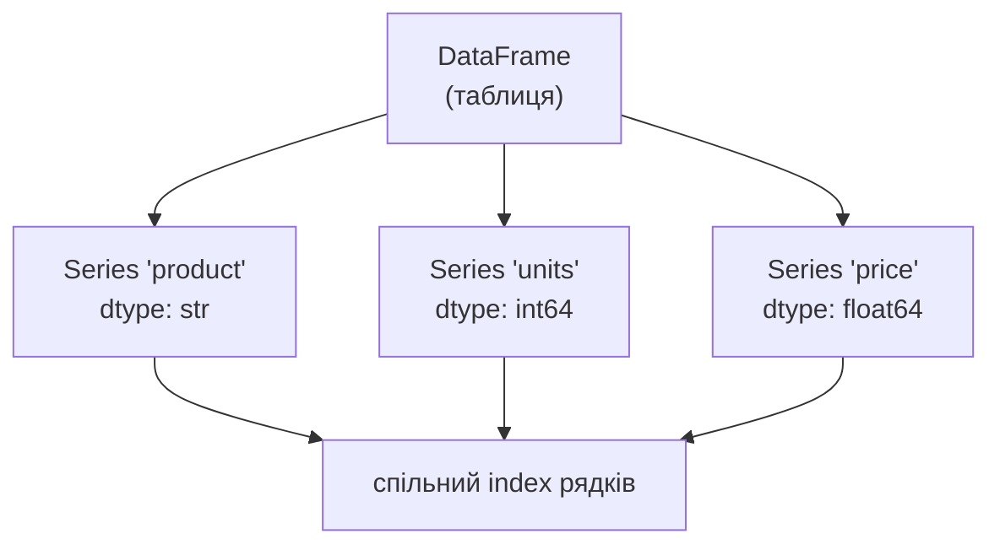

# 32. (Л) Вступ до pandas. Series, DataFrame, читання CSV

## Зміст лекції

1. Навіщо pandas
2. Встановлення та імпорт
3. Дві структури даних: `Series` і `DataFrame`
4. `Series`: створення
5. `Series`: доступ до елементів
6. `Series`: операції та вирівнювання за індексом
7. `DataFrame`: створення
8. Огляд таблиці: `shape`, `dtypes`, `info`, `head`
9. `describe`: швидка статистика
10. Вибір стовпців
11. Вибір рядків: `.loc` і `.iloc`
12. Власний індекс: `set_index` і `reset_index`
13. Булева фільтрація
14. Створення та видалення стовпців
15. Сортування
16. Читання CSV: `read_csv`
17. Роздільник і десяткова кома
18. Заголовки, індекс, вибір стовпців, дати
19. Пропущені значення та типи при читанні
20. Службові рядки та розвідка великого файлу
21. Робота з пропусками: `isna`, `dropna`, `fillna`
22. Підрахунок значень: `value_counts`, `unique`
23. Запис у CSV: `to_csv`
24. pandas і NumPy
25. Налаштування виведення
26. Повний приклад: від файлу до звіту
27. Типові помилки
28. Підсумок

## Навіщо pandas

NumPy чудово працює з **однорідними числовими** масивами. Але реальні дані майже ніколи такими не бувають: у таблиці продажів є дата, назва товару, категорія (рядки) і кількість та ціна (числа). Ще й частина клітинок порожня.

Подивимося, як це виглядає чистим Python:

```python
# Чистий Python: список словників
rows = [
    {"city": "Kyiv", "temp": 21.0, "humidity": 55},
    {"city": "Lviv", "temp": 18.5, "humidity": 70},
    {"city": "Odesa", "temp": 24.0, "humidity": 60},
    {"city": "Kharkiv", "temp": 22.5, "humidity": 48},
]

# середня температура
total = sum(row["temp"] for row in rows)
print("mean temp:", total / len(rows))

# міста, де тепліше за 20 градусів
warm = [row["city"] for row in rows if row["temp"] > 20]
print("warm:", warm)

# сортування за вологістю
by_humidity = sorted(rows, key=lambda row: row["humidity"])
print("driest:", by_humidity[0]["city"])
```

```text
mean temp: 21.5
warm: ['Kyiv', 'Odesa', 'Kharkiv']
driest: Kharkiv
```

Працює, але кожна операція — окремий цикл або генератор. Те саме на pandas:

```python
import pandas as pd

rows = [
    {"city": "Kyiv", "temp": 21.0, "humidity": 55},
    {"city": "Lviv", "temp": 18.5, "humidity": 70},
    {"city": "Odesa", "temp": 24.0, "humidity": 60},
    {"city": "Kharkiv", "temp": 22.5, "humidity": 48},
]

df = pd.DataFrame(rows)

print("mean temp:", df["temp"].mean())
print("warm:", df.loc[df["temp"] > 20, "city"].tolist())
print("driest:", df.sort_values("humidity").iloc[0]["city"])
```

```text
mean temp: 21.5
warm: ['Kyiv', 'Odesa', 'Kharkiv']
driest: Kharkiv
```

На чотирьох рядках різниця невелика. На чотирьох мільйонах — принципова: pandas зберігає кожен стовпець як масив NumPy і виконує операції векторизовано, без циклів Python.

**Що дає pandas:**

- таблицю з **іменованими стовпцями різних типів** і **іменованими рядками**;
- читання та запис CSV, Excel, JSON, SQL, Parquet — одним рядком коду;
- вбудовану підтримку **пропущених значень**;
- фільтрацію, сортування, групування, об'єднання таблиць;
- **вирівнювання за індексом**: операції над двома таблицями зіставляють рядки за мітками, а не за позиціями.

!!! info "pandas побудований на NumPy"
    Усередині кожен стовпець — це масив NumPy. Тому все, що ви вивчили в лекціях 25–31 (векторизація, `dtype`, агрегати, `axis`, булеві маски), працює й тут. pandas додає зверху **мітки** та **різнотипність**.

## Встановлення та імпорт

```bash
pip install pandas
```

Загальноприйнятий псевдонім — `pd`:

```python
import pandas as pd

print(pd.__version__)
```

```text
3.0.6
```

!!! note "Про версії"
    Приклади в лекції зроблено на pandas 3.x. У pandas 2.x частина виведення виглядає трохи інакше: рядкові стовпці показуються як `object` замість `str`, а дати — як `datetime64[ns]` замість `datetime64[us]`. Логіка роботи при цьому та сама.

## Дві структури даних: `Series` і `DataFrame`

- **`Series`** — одновимірний масив зі **мітками** (індексом). Приблизно «масив NumPy + іменовані позиції» або «впорядкований словник, над яким працює векторизація».
- **`DataFrame`** — двовимірна таблиця. Її можна уявляти як **словник `Series`**: кожен стовпець — окрема `Series`, і всі вони мають **спільний індекс рядків**.



Стовпець має **один тип**; різні стовпці — різні типи. Саме тому таблиця може тримати рядки й числа одночасно, залишаючись швидкою.

## `Series`: створення

Найпростіший варіант — зі списку. Індекс створюється автоматично: `0, 1, 2, ...`

```python
import pandas as pd

temps = pd.Series([21.0, 18.5, 24.0, 22.5])
print(temps)
```

```text
0    21.0
1    18.5
2    24.0
3    22.5
dtype: float64
```

Зліва — індекс, справа — значення, знизу — тип. Індекс можна задати своїм:

```python
import pandas as pd

temps = pd.Series([21.0, 18.5, 24.0, 22.5], index=["Kyiv", "Lviv", "Odesa", "Kharkiv"])
print(temps)
print()

print("name:  ", temps.name)
print("dtype: ", temps.dtype)
print("size:  ", temps.size)
print("index: ", temps.index)
print("values:", temps.values)
```

```text
Kyiv       21.0
Lviv       18.5
Odesa      24.0
Kharkiv    22.5
dtype: float64

name:   None
dtype:  float64
size:   4
index:  Index(['Kyiv', 'Lviv', 'Odesa', 'Kharkiv'], dtype='str')
values: [21.  18.5 24.  22.5]
```

`values` — це звичайний масив NumPy. Серія також має ім'я (`name`), яке стає назвою стовпця, коли серію кладуть у таблицю.

Зі словника індекс береться з ключів:

```python
import pandas as pd

population = pd.Series(
    {"Kyiv": 2952, "Lviv": 717, "Odesa": 993, "Kharkiv": 1421},
    name="population_k",
)
print(population)
```

```text
Kyiv       2952
Lviv        717
Odesa       993
Kharkiv    1421
Name: population_k, dtype: int64
```

## `Series`: доступ до елементів

```python
import pandas as pd

temps = pd.Series([21.0, 18.5, 24.0, 22.5], index=["Kyiv", "Lviv", "Odesa", "Kharkiv"])

# доступ за міткою
print(temps["Lviv"])
print(temps[["Kyiv", "Odesa"]].tolist())

# доступ за позицією
print(temps.iloc[0])
print(temps.iloc[1:3].tolist())

# зріз за мітками: права межа ВХОДИТЬ
print(temps.loc["Lviv":"Odesa"].tolist())
```

```text
18.5
[21.0, 24.0]
21.0
[18.5, 24.0]
[18.5, 24.0]
```

!!! warning "Зрізи за мітками включають праву межу"
    `temps.iloc[1:3]` дає 2 елементи (як звичайний зріз Python), а `temps.loc["Lviv":"Odesa"]` — теж 2, але тому, що `"Odesa"` **входить**. Якби між ними були ще міста, вони б теж увійшли. Це одна з небагатьох відмінностей pandas від звичного Python.

Правило просте: **`.loc` — мітки, `.iloc` — позиції**. Завжди пишіть один із них явно.

## `Series`: операції та вирівнювання за індексом

Арифметика поелементна, як у NumPy:

```python
import numpy as np
import pandas as pd

temps = pd.Series([21.0, 18.5, 24.0, 22.5], index=["Kyiv", "Lviv", "Odesa", "Kharkiv"])

# поелементна арифметика — як у NumPy
print((temps * 9 / 5 + 32).round(1))
print()

# агрегати
print("mean:", temps.mean(), "max:", temps.max(), "idxmax:", temps.idxmax())
print()

# булева маска і фільтрація
mask = temps > 20
print(mask)
print()
print(temps[mask])
print()

# universal-функції NumPy працюють і на Series
print(np.sqrt(temps).round(2).tolist())
```

```text
Kyiv       69.8
Lviv       65.3
Odesa      75.2
Kharkiv    72.5
dtype: float64

mean: 21.5 max: 24.0 idxmax: Odesa

Kyiv        True
Lviv       False
Odesa       True
Kharkiv     True
dtype: bool

Kyiv       21.0
Odesa      24.0
Kharkiv    22.5
dtype: float64

[4.58, 4.3, 4.9, 4.74]
```

Зверніть увагу на `idxmax`: на відміну від `argmax` у NumPy, він повертає **мітку**, а не позицію.

А ось те, чого в NumPy немає. Коли складають дві серії, pandas зіставляє елементи **за мітками**, а не за позиціями:

```python
import pandas as pd

monday = pd.Series({"Kyiv": 21.0, "Lviv": 18.5, "Odesa": 24.0})
tuesday = pd.Series({"Lviv": 19.0, "Kyiv": 22.0, "Kharkiv": 23.0})

print(monday + tuesday)
```

```text
Kharkiv     NaN
Kyiv       43.0
Lviv       37.5
Odesa       NaN
dtype: float64
```

Порядок ключів у словниках різний — pandas це не зупинило: `Kyiv` додався до `Kyiv`. Там, де мітка є лише в одній серії, результат — `NaN` (*Not a Number*, позначка пропуску).

```python
import pandas as pd

monday = pd.Series({"Kyiv": 21.0, "Lviv": 18.5, "Odesa": 24.0})
tuesday = pd.Series({"Lviv": 19.0, "Kyiv": 22.0, "Kharkiv": 23.0})

average = (monday + tuesday) / 2
print(average)
print()
print("isna:")
print(average.isna())
print()
print("dropna:")
print(average.dropna())
print()
print("fillna:")
print(monday.add(tuesday, fill_value=0.0))
```

```text
Kharkiv      NaN
Kyiv       21.50
Lviv       18.75
Odesa        NaN
dtype: float64

isna:
Kharkiv     True
Kyiv       False
Lviv       False
Odesa       True
dtype: bool

dropna:
Kyiv    21.50
Lviv    18.75
dtype: float64

fillna:
Kharkiv    23.0
Kyiv       43.0
Lviv       37.5
Odesa      24.0
dtype: float64
```

Метод `add` з `fill_value` дозволяє сказати: «якщо мітки немає в одній зі сторін, вважай її нулем».

## `DataFrame`: створення

Найчастіший спосіб — словник, де ключ це назва стовпця, а значення — увесь стовпець:

```python
import pandas as pd

# словник: ключ — назва стовпця, значення — стовпець цілком
df = pd.DataFrame({
    "city": ["Kyiv", "Lviv", "Odesa", "Kharkiv"],
    "temp": [21.0, 18.5, 24.0, 22.5],
    "humidity": [55, 70, 60, 48],
})

print(df)
```

```text
      city  temp  humidity
0     Kyiv  21.0        55
1     Lviv  18.5        70
2    Odesa  24.0        60
3  Kharkiv  22.5        48
```

Є ще кілька джерел даних:

```python
import numpy as np
import pandas as pd

# 1) зі списку словників (один словник — один рядок)
rows = [
    {"city": "Kyiv", "temp": 21.0},
    {"city": "Lviv", "temp": 18.5},
]
print(pd.DataFrame(rows))
print()

# 2) зі списку списків + явні назви стовпців
data = [["Kyiv", 21.0], ["Lviv", 18.5]]
print(pd.DataFrame(data, columns=["city", "temp"]))
print()

# 3) з масиву NumPy
matrix = np.arange(6).reshape(3, 2)
print(pd.DataFrame(matrix, columns=["a", "b"], index=["r1", "r2", "r3"]))
print()

# 4) зі словника Series
temps = pd.Series([21.0, 18.5], index=["Kyiv", "Lviv"])
humidity = pd.Series([55, 70], index=["Kyiv", "Lviv"])
print(pd.DataFrame({"temp": temps, "humidity": humidity}))
```

```text
   city  temp
0  Kyiv  21.0
1  Lviv  18.5

   city  temp
0  Kyiv  21.0
1  Lviv  18.5

    a  b
r1  0  1
r2  2  3
r3  4  5

      temp  humidity
Kyiv  21.0        55
Lviv  18.5        70
```

У варіанті (4) індекс рядків узявся з індексів серій.

!!! tip "Список словників — типовий формат з API"
    Відповідь JSON-API майже завжди має вигляд списку об'єктів. `pd.DataFrame(response.json())` одразу перетворює її на таблицю.

## Огляд таблиці: `shape`, `dtypes`, `info`, `head`

Перше, що роблять з будь-якою таблицею — дивляться, що в ній.

```python
import pandas as pd

df = pd.DataFrame({
    "city": ["Kyiv", "Lviv", "Odesa", "Kharkiv"],
    "temp": [21.0, 18.5, 24.0, 22.5],
    "humidity": [55, 70, 60, 48],
})

print("shape:  ", df.shape)
print("size:   ", df.size)
print("columns:", list(df.columns))
print("index:  ", list(df.index))
print()
print("dtypes:")
print(df.dtypes)
```

```text
shape:   (4, 3)
size:    12
columns: ['city', 'temp', 'humidity']
index:   [0, 1, 2, 3]

dtypes:
city            str
temp        float64
humidity      int64
dtype: object
```

`shape` — це `(рядки, стовпці)`, як у NumPy. Кожен стовпець має свій `dtype`.

Метод `info()` збирає все разом і додає головне — **кількість непорожніх значень**:

```python
import pandas as pd

df = pd.DataFrame({
    "city": ["Kyiv", "Lviv", "Odesa", "Kharkiv"],
    "temp": [21.0, 18.5, 24.0, 22.5],
    "humidity": [55, 70, 60, 48],
})

df.info()
```

```text
<class 'pandas.DataFrame'>
RangeIndex: 4 entries, 0 to 3
Data columns (total 3 columns):
 #   Column    Non-Null Count  Dtype  
---  ------    --------------  -----  
 0   city      4 non-null      str    
 1   temp      4 non-null      float64
 2   humidity  4 non-null      int64  
dtypes: float64(1), int64(1), str(1)
memory usage: 228.0 bytes
```

`info()` нічого не повертає — він **друкує**. Писати `print(df.info())` не треба: отримаєте зайве `None`.

## `describe`: швидка статистика

`head(n)` показує перші `n` рядків (за замовчуванням 5), `tail(n)` — останні. `describe()` рахує статистику по всіх числових стовпцях.

```python
from pathlib import Path

import pandas as pd

CSV_TEXT = """date,product,category,units,price
2026-03-01,Keyboard,peripherals,12,899.00
2026-03-01,Mouse,peripherals,25,349.50
2026-03-02,Monitor,displays,4,7499.00
2026-03-02,Keyboard,peripherals,8,899.00
2026-03-03,Headset,audio,15,1250.00
2026-03-03,Monitor,displays,6,7499.00
2026-03-04,Mouse,peripherals,30,349.50
2026-03-04,Webcam,video,9,2100.00
2026-03-05,Headset,audio,11,1250.00
2026-03-05,Keyboard,peripherals,14,899.00
"""
Path("sales.csv").write_text(CSV_TEXT, encoding="utf-8")

df = pd.read_csv("sales.csv")

print(df.head(3))
print()
print(df.tail(2))
print()
print(df.describe())
```

```text
         date   product     category  units   price
0  2026-03-01  Keyboard  peripherals     12   899.0
1  2026-03-01     Mouse  peripherals     25   349.5
2  2026-03-02   Monitor     displays      4  7499.0

         date   product     category  units   price
8  2026-03-05   Headset        audio     11  1250.0
9  2026-03-05  Keyboard  peripherals     14   899.0

           units        price
count  10.000000    10.000000
mean   13.400000  2299.400000
std     8.248906  2784.909771
min     4.000000   349.500000
25%     8.250000   899.000000
50%    11.500000  1074.500000
75%    14.750000  1887.500000
max    30.000000  7499.000000
```

Тут уже видно все з лекції 30: середнє, стандартне відхилення, мінімум, квартилі, максимум.

!!! warning "`std` у pandas і NumPy — різні за замовчуванням"
    pandas рахує вибіркове стандартне відхилення (`ddof=1`), NumPy — генеральне (`ddof=0`). Тому `df["price"].std()` і `df["price"].to_numpy().std()` дадуть різні числа. Це не помилка, а різні угоди.

## Вибір стовпців

```python
import pandas as pd

df = pd.DataFrame({
    "product": ["Keyboard", "Mouse", "Monitor", "Headset", "Webcam"],
    "category": ["peripherals", "peripherals", "displays", "audio", "video"],
    "units": [34, 55, 10, 26, 9],
    "price": [899.0, 349.5, 7499.0, 1250.0, 2100.0],
})

# один стовпець -> Series
prices = df["price"]
print(type(prices))
print(prices)
print()

# кілька стовпців -> DataFrame (список усередині дужок!)
print(df[["product", "price"]])
print()

print(type(df[["price"]]))
```

```text
<class 'pandas.Series'>
0     899.0
1     349.5
2    7499.0
3    1250.0
4    2100.0
Name: price, dtype: float64

    product   price
0  Keyboard   899.0
1     Mouse   349.5
2   Monitor  7499.0
3   Headset  1250.0
4    Webcam  2100.0

<class 'pandas.DataFrame'>
```

Запам'ятайте різницю: `df["price"]` — **`Series`**, `df[["price"]]` — **`DataFrame`** з одного стовпця.

Якщо назва стовпця — коректний ідентифікатор Python, працює і крапкова форма `df.price`. Але вона ламається на назвах з пробілами й конфліктує з методами (`df.count` — це метод, а не стовпець), тож у робочому коді надійніше дужки.

## Вибір рядків: `.loc` і `.iloc`

```python
import pandas as pd

df = pd.DataFrame({
    "product": ["Keyboard", "Mouse", "Monitor", "Headset", "Webcam"],
    "category": ["peripherals", "peripherals", "displays", "audio", "video"],
    "units": [34, 55, 10, 26, 9],
    "price": [899.0, 349.5, 7499.0, 1250.0, 2100.0],
})

# .loc — за мітками
print(df.loc[2])
print()
print(df.loc[1:3, ["product", "units"]])
print()

# .iloc — за позиціями
print(df.iloc[0])
print()
print(df.iloc[1:3, 0:2])
print()

# одна клітинка
print(df.loc[2, "price"], df.iloc[2, 3])
```

```text
product      Monitor
category    displays
units             10
price         7499.0
Name: 2, dtype: object

   product  units
1    Mouse     55
2  Monitor     10
3  Headset     26

product        Keyboard
category    peripherals
units                34
price             899.0
Name: 0, dtype: object

   product     category
1    Mouse  peripherals
2  Monitor     displays

7499.0 7499.0
```

Обидва приймають два аргументи: `[рядки, стовпці]`. Один рядок повертається як `Series`, де індексом стають назви стовпців.

Знову зверніть увагу: `df.loc[1:3]` дало **три** рядки (1, 2, 3), а `df.iloc[1:3]` — **два** (позиції 1 і 2).

| Потрібно | `.loc` | `.iloc` |
|---|---|---|
| один рядок | `df.loc["Mouse"]` | `df.iloc[1]` |
| кілька рядків | `df.loc[["Mouse", "Webcam"]]` | `df.iloc[[1, 4]]` |
| зріз | `df.loc["Mouse":"Headset"]` (включно) | `df.iloc[1:3]` (без правої) |
| рядки + стовпці | `df.loc[маска, ["a", "b"]]` | `df.iloc[0:3, 1:3]` |
| одна клітинка | `df.loc[2, "price"]` | `df.iloc[2, 3]` |

## Власний індекс: `set_index` і `reset_index`

Індекс `0, 1, 2, ...` не несе сенсу. Часто корисно зробити індексом осмислений стовпець:

```python
import pandas as pd

df = pd.DataFrame({
    "product": ["Keyboard", "Mouse", "Monitor", "Headset", "Webcam"],
    "category": ["peripherals", "peripherals", "displays", "audio", "video"],
    "units": [34, 55, 10, 26, 9],
    "price": [899.0, 349.5, 7499.0, 1250.0, 2100.0],
})

# індекс з осмислених міток
indexed = df.set_index("product")
print(indexed)
print()
print(indexed.loc["Monitor"])
print()
print(indexed.loc["Mouse":"Headset", "units"])
print()
print(indexed.reset_index().head(2))
```

```text
             category  units   price
product                             
Keyboard  peripherals     34   899.0
Mouse     peripherals     55   349.5
Monitor      displays     10  7499.0
Headset         audio     26  1250.0
Webcam          video      9  2100.0

category    displays
units             10
price         7499.0
Name: Monitor, dtype: object

product
Mouse      55
Monitor    10
Headset    26
Name: units, dtype: int64

    product     category  units  price
0  Keyboard  peripherals     34  899.0
1     Mouse  peripherals     55  349.5
```

`set_index` **повертає нову таблицю**, а не змінює стару — типова поведінка pandas. `reset_index` виконує зворотну операцію: перетворює індекс назад на звичайний стовпець.

## Булева фільтрація

Працює так само, як маски в NumPy (лекція 27), але з іменами стовпців:

```python
import pandas as pd

df = pd.DataFrame({
    "product": ["Keyboard", "Mouse", "Monitor", "Headset", "Webcam"],
    "category": ["peripherals", "peripherals", "displays", "audio", "video"],
    "units": [34, 55, 10, 26, 9],
    "price": [899.0, 349.5, 7499.0, 1250.0, 2100.0],
})

mask = df["units"] > 20
print(mask)
print()
print(df[mask])
print()

# кілька умов: & | ~ і ОБОВ'ЯЗКОВІ дужки
expensive_peripherals = df[(df["category"] == "peripherals") & (df["price"] > 500)]
print(expensive_peripherals)
print()

# isin — «значення у переліку»
print(df[df["category"].isin(["audio", "video"])])
print()

# рядковий метод через .str
print(df[df["product"].str.startswith("M")])
print()

# .loc з маскою + вибір стовпців
print(df.loc[df["units"] < 30, ["product", "units"]])
```

```text
0     True
1     True
2    False
3     True
4    False
Name: units, dtype: bool

    product     category  units   price
0  Keyboard  peripherals     34   899.0
1     Mouse  peripherals     55   349.5
3   Headset        audio     26  1250.0

    product     category  units  price
0  Keyboard  peripherals     34  899.0

   product category  units   price
3  Headset    audio     26  1250.0
4   Webcam    video      9  2100.0

   product     category  units   price
1    Mouse  peripherals     55   349.5
2  Monitor     displays     10  7499.0

   product  units
2  Monitor     10
3  Headset     26
4   Webcam      9
```

!!! danger "`and` / `or` не працюють з масками"
    Пишіть `&`, `|`, `~` — і **обов'язково** беріть кожну умову в дужки: `(a > 1) & (b < 2)`. Через пріоритет операторів `a > 1 & b < 2` буде розібрано зовсім не так, як ви очікуєте, а `and` кине `ValueError: The truth value of a Series is ambiguous`.

Аксесор `.str` дає доступ до рядкових методів Python (`.str.lower()`, `.str.contains()`, `.str.strip()`, `.str.split()`) одразу над усім стовпцем.

## Створення та видалення стовпців

```python
import pandas as pd

df = pd.DataFrame({
    "product": ["Keyboard", "Mouse", "Monitor", "Headset", "Webcam"],
    "category": ["peripherals", "peripherals", "displays", "audio", "video"],
    "units": [34, 55, 10, 26, 9],
    "price": [899.0, 349.5, 7499.0, 1250.0, 2100.0],
})

# новий стовпець з виразу над іншими
df["revenue"] = df["units"] * df["price"]
print(df)
print()

# стовпець з умови
df["is_cheap"] = df["price"] < 1000
print(df[["product", "price", "is_cheap"]])
print()

# перейменування
renamed = df.rename(columns={"units": "qty"})
print(list(renamed.columns))
print()

# видалення (повертає копію)
print(df.drop(columns=["is_cheap"]).head(2))
print()

# видалення рядків за мітками
print(df.drop(index=[0, 1])[["product", "revenue"]])
```

```text
    product     category  units   price  revenue
0  Keyboard  peripherals     34   899.0  30566.0
1     Mouse  peripherals     55   349.5  19222.5
2   Monitor     displays     10  7499.0  74990.0
3   Headset        audio     26  1250.0  32500.0
4    Webcam        video      9  2100.0  18900.0

    product   price  is_cheap
0  Keyboard   899.0      True
1     Mouse   349.5      True
2   Monitor  7499.0     False
3   Headset  1250.0     False
4    Webcam  2100.0     False

['product', 'category', 'qty', 'price', 'revenue', 'is_cheap']

    product     category  units  price  revenue
0  Keyboard  peripherals     34  899.0  30566.0
1     Mouse  peripherals     55  349.5  19222.5

   product  revenue
2  Monitor  74990.0
3  Headset  32500.0
4   Webcam  18900.0
```

Присвоєння `df["new"] = ...` змінює таблицю **на місці**. А от `rename` і `drop` повертають **копію** — щоб зберегти результат, його треба присвоїти.

## Сортування

```python
import pandas as pd

df = pd.DataFrame({
    "product": ["Keyboard", "Mouse", "Monitor", "Headset", "Webcam"],
    "category": ["peripherals", "peripherals", "displays", "audio", "video"],
    "units": [34, 55, 10, 26, 9],
    "price": [899.0, 349.5, 7499.0, 1250.0, 2100.0],
})

print(df.sort_values("price"))
print()
print(df.sort_values("price", ascending=False).head(2))
print()

# сортування за кількома стовпцями
print(df.sort_values(["category", "price"])[["category", "product", "price"]])
print()

# сортування за індексом
print(df.sort_index(ascending=False).head(2))
```

```text
    product     category  units   price
1     Mouse  peripherals     55   349.5
0  Keyboard  peripherals     34   899.0
3   Headset        audio     26  1250.0
4    Webcam        video      9  2100.0
2   Monitor     displays     10  7499.0

   product  category  units   price
2  Monitor  displays     10  7499.0
4   Webcam     video      9  2100.0

      category   product   price
3        audio   Headset  1250.0
2     displays   Monitor  7499.0
1  peripherals     Mouse   349.5
0  peripherals  Keyboard   899.0
4        video    Webcam  2100.0

   product category  units   price
4   Webcam    video      9  2100.0
3  Headset    audio     26  1250.0
```

Індекс «їде» разом із рядками — тому в першому виведенні він 1, 0, 3, 4, 2. Якщо потрібна нова нумерація, додайте `.reset_index(drop=True)`.

Зв'язка `sort_values(...).head(n)` — стандартний спосіб отримати топ-N.

## Читання CSV: `read_csv`

CSV (*comma-separated values*) — найпоширеніший формат обміну табличними даними. Це звичайний текст: перший рядок зазвичай містить назви стовпців, далі — по рядку на запис.

```python
from pathlib import Path

import pandas as pd

CSV_TEXT = """date,product,category,units,price
2026-03-01,Keyboard,peripherals,12,899.00
2026-03-01,Mouse,peripherals,25,349.50
2026-03-02,Monitor,displays,4,7499.00
2026-03-02,Keyboard,peripherals,8,899.00
2026-03-03,Headset,audio,15,1250.00
2026-03-03,Monitor,displays,6,7499.00
2026-03-04,Mouse,peripherals,30,349.50
2026-03-04,Webcam,video,9,2100.00
2026-03-05,Headset,audio,11,1250.00
2026-03-05,Keyboard,peripherals,14,899.00
"""

# створюємо файл, щоб приклад був самодостатнім
Path("sales.csv").write_text(CSV_TEXT, encoding="utf-8")

df = pd.read_csv("sales.csv")

print(df.head())
print()
df.info()
```

```text
         date   product     category  units   price
0  2026-03-01  Keyboard  peripherals     12   899.0
1  2026-03-01     Mouse  peripherals     25   349.5
2  2026-03-02   Monitor     displays      4  7499.0
3  2026-03-02  Keyboard  peripherals      8   899.0
4  2026-03-03   Headset        audio     15  1250.0

<class 'pandas.DataFrame'>
RangeIndex: 10 entries, 0 to 9
Data columns (total 5 columns):
 #   Column    Non-Null Count  Dtype  
---  ------    --------------  -----  
 0   date      10 non-null     str    
 1   product   10 non-null     str    
 2   category  10 non-null     str    
 3   units     10 non-null     int64  
 4   price     10 non-null     float64
dtypes: float64(1), int64(1), str(3)
memory usage: 532.0 bytes
```

Один виклик — і pandas сам знайшов заголовки, розібрав рядки, **визначив типи** стовпців. Зверніть увагу: `date` залишилася рядком — про це нижче.

`read_csv` приймає не лише шлях, а й URL — `pd.read_csv("https://example.com/data.csv")` завантажить файл і одразу розбере його. Поруч живуть `read_excel`, `read_json`, `read_parquet`, `read_sql`, `read_html`, і всі повертають `DataFrame`.

## Роздільник і десяткова кома

Файли з європейських систем (та з українського Excel) часто використовують `;` як роздільник і кому як десяткову крапку — бо кома вже зайнята.

```python
from pathlib import Path

import pandas as pd

# файл у "європейському" форматі: ; як роздільник, кома як десяткова крапка
CSV_TEXT = """product;units;price
Keyboard;12;899,00
Mouse;25;349,50
Monitor;4;7499,00
"""
Path("sales_eu.csv").write_text(CSV_TEXT, encoding="utf-8")

# без параметрів — усе зіллється в один стовпець
wrong = pd.read_csv("sales_eu.csv")
print(wrong)
print("columns:", list(wrong.columns))
print()

right = pd.read_csv("sales_eu.csv", sep=";", decimal=",")
print(right)
print(right.dtypes)
```

```text
                 product;units;price
Keyboard;12;899                    0
Mouse;25;349                      50
Monitor;4;7499                     0
columns: ['product;units;price']

    product  units   price
0  Keyboard     12   899.0
1     Mouse     25   349.5
2   Monitor      4  7499.0
product        str
units        int64
price      float64
dtype: object
```

Перший результат — безглуздя: pandas розділив рядки за комою (тією, що всередині чисел), тому вся решта злиплася в одну назву стовпця. З `sep=";"` і `decimal=","` усе стає на місце, а `price` отримує тип `float64`.

!!! tip "Завжди дивіться у файл перед читанням"
    `head -3 data.csv` у терміналі (або `Path("data.csv").read_text()[:300]`) економить багато часу. Ви одразу побачите роздільник, наявність заголовка, формат чисел і кодування.

Ще один частий параметр — **`encoding`**. За замовчуванням `utf-8`. Файли з українського Excel іноді зберігаються у `windows-1251` — тоді потрібно `pd.read_csv("data.csv", encoding="windows-1251")`. Ознака неправильного кодування — `UnicodeDecodeError` або «кракозябри» у значеннях.

## Заголовки, індекс, вибір стовпців, дати

Не в кожному файлі є рядок заголовків:

```python
from pathlib import Path

import pandas as pd

# файл без рядка заголовків
CSV_TEXT = """Keyboard,12,899.00
Mouse,25,349.50
Monitor,4,7499.00
"""
Path("no_header.csv").write_text(CSV_TEXT, encoding="utf-8")

# без header=None перший рядок даних стане заголовком
print(pd.read_csv("no_header.csv"))
print()

print(pd.read_csv("no_header.csv", header=None))
print()

print(pd.read_csv("no_header.csv", names=["product", "units", "price"]))
```

```text
  Keyboard  12  899.00
0    Mouse  25   349.5
1  Monitor   4  7499.0

          0   1       2
0  Keyboard  12   899.0
1     Mouse  25   349.5
2   Monitor   4  7499.0

    product  units   price
0  Keyboard     12   899.0
1     Mouse     25   349.5
2   Monitor      4  7499.0
```

У першому випадку перший товар зник із даних — став заголовком. `header=None` дає числові назви стовпців, `names=[...]` — свої.

Тепер `usecols`, `index_col` і `parse_dates`:

```python
from pathlib import Path

import pandas as pd

CSV_TEXT = """date,product,category,units,price
2026-03-01,Keyboard,peripherals,12,899.00
2026-03-01,Mouse,peripherals,25,349.50
2026-03-02,Monitor,displays,4,7499.00
2026-03-02,Keyboard,peripherals,8,899.00
"""
Path("sales.csv").write_text(CSV_TEXT, encoding="utf-8")

# лише потрібні стовпці
part = pd.read_csv("sales.csv", usecols=["product", "units"])
print(part)
print()

# стовпець як індекс + дати як справжні дати
df = pd.read_csv("sales.csv", index_col="date", parse_dates=["date"])
print(df)
print()
print(df.index)
print()
print(df.dtypes)
```

```text
    product  units
0  Keyboard     12
1     Mouse     25
2   Monitor      4
3  Keyboard      8

             product     category  units   price
date                                            
2026-03-01  Keyboard  peripherals     12   899.0
2026-03-01     Mouse  peripherals     25   349.5
2026-03-02   Monitor     displays      4  7499.0
2026-03-02  Keyboard  peripherals      8   899.0

DatetimeIndex(['2026-03-01', '2026-03-01', '2026-03-02', '2026-03-02'], dtype='datetime64[us]', name='date', freq=None)

product         str
category        str
units         int64
price       float64
dtype: object
```

`usecols` не просто ховає зайве — він **не читає** його з диска, що помітно на великих файлах.

`parse_dates` перетворює текст на тип `datetime64`. Після цього працюють порівняння дат (`df[df["date"] > "2026-03-02"]`) і аксесор `.dt` (`df["date"].dt.month`, `.dt.dayofweek`). Без нього дата — звичайний рядок, і `"2026-03-10" < "2026-03-9"` дасть неочікуване.

## Пропущені значення та типи при читанні

```python
from pathlib import Path

import pandas as pd

# порожні клітинки, "n/a" і "-" як позначки пропуску
CSV_TEXT = """product,code,units,price
Keyboard,0042,12,899.00
Mouse,0007,,349.50
Monitor,0113,4,n/a
Headset,0085,15,-
"""
Path("messy.csv").write_text(CSV_TEXT, encoding="utf-8")

default = pd.read_csv("messy.csv")
print(default)
print()
print(default.dtypes)
print()

fixed = pd.read_csv("messy.csv", na_values=["n/a", "-"], dtype={"code": "str"})
print(fixed)
print()
print(fixed.dtypes)
```

```text
    product  code  units   price
0  Keyboard    42   12.0  899.00
1     Mouse     7    NaN  349.50
2   Monitor   113    4.0     NaN
3   Headset    85   15.0       -

product        str
code         int64
units      float64
price          str
dtype: object

    product  code  units  price
0  Keyboard  0042   12.0  899.0
1     Mouse  0007    NaN  349.5
2   Monitor  0113    4.0    NaN
3   Headset  0085   15.0    NaN

product        str
code           str
units      float64
price      float64
dtype: object
```

Тут одразу три проблеми і три уроки:

1. **`code` перетворився на число**, і провідні нулі зникли: `0042` → `42`. Артикули, поштові індекси, телефони, ЄДРПОУ — це **рядки**, навіть якщо складаються з цифр. Рятує `dtype={"code": "str"}`.
2. **`price` залишився рядком** через `-` в останньому рядку. Одне нечислове значення робить нечисловим увесь стовпець. `na_values=["n/a", "-"]` каже, які позначки вважати пропусками. Порожню клітинку і `n/a` pandas розпізнає сам.
3. **`units` став `float64`**, хоч це кількість. Причина: `NaN` — число з рухомою крапкою, а цілочисельний масив NumPy не вміє його тримати. Після заповнення пропусків тип можна повернути: `df["units"].fillna(0).astype("int64")`.

## Службові рядки та розвідка великого файлу

Експорт із бухгалтерських систем часто починається з рядків-коментарів:

```python
from pathlib import Path

import pandas as pd

CSV_TEXT = """# report generated by shop-export v2
# do not edit manually
date,product,units
2026-03-01,Keyboard,12
2026-03-01,Mouse,25
2026-03-02,Monitor,4
2026-03-02,Keyboard,8
"""
Path("with_comments.csv").write_text(CSV_TEXT, encoding="utf-8")

# пропустити 2 службові рядки
df = pd.read_csv("with_comments.csv", skiprows=2)
print(df)
print()

# те саме через comment
print(pd.read_csv("with_comments.csv", comment="#"))
print()

# прочитати лише перші 2 рядки даних — зручно для розвідки великого файлу
print(pd.read_csv("with_comments.csv", skiprows=2, nrows=2))
```

```text
         date   product  units
0  2026-03-01  Keyboard     12
1  2026-03-01     Mouse     25
2  2026-03-02   Monitor      4
3  2026-03-02  Keyboard      8

         date   product  units
0  2026-03-01  Keyboard     12
1  2026-03-01     Mouse     25
2  2026-03-02   Monitor      4
3  2026-03-02  Keyboard      8

         date   product  units
0  2026-03-01  Keyboard     12
1  2026-03-01     Mouse     25
```

`nrows=1000` — перший крок для файлу на кілька гігабайтів: подивитися структуру, підібрати `dtype` і `usecols`, і лише потім читати все.

### Основні параметри `read_csv`

| Параметр | Що робить |
|---|---|
| `sep=";"` | роздільник полів (за замовчуванням `,`) |
| `decimal=","` | десятковий роздільник у числах |
| `encoding="windows-1251"` | кодування файлу (за замовчуванням `utf-8`) |
| `header=None` | у файлі немає рядка заголовків |
| `names=[...]` | задати назви стовпців самому |
| `index_col="id"` | зробити стовпець індексом рядків |
| `usecols=["a", "b"]` | читати лише ці стовпці |
| `dtype={"code": "str"}` | явно задати тип стовпця |
| `parse_dates=["date"]` | розібрати стовпець як дату |
| `na_values=["-", "n/a"]` | додаткові позначки пропуску |
| `skiprows=2` | пропустити перші рядки |
| `comment="#"` | ігнорувати рядки, що починаються з символу |
| `nrows=1000` | прочитати лише перші N рядків даних |
| `thousands=" "` | роздільник тисяч у числах |

## Робота з пропусками: `isna`, `dropna`, `fillna`

```python
import pandas as pd

df = pd.DataFrame({
    "product": ["Keyboard", "Mouse", "Monitor", "Headset"],
    "units": [12.0, None, 4.0, 15.0],
    "price": [899.0, 349.5, None, None],
})

print(df.isna())
print()
print("na per column:")
print(df.isna().sum())
print()

print("dropna (rows with any NaN):")
print(df.dropna())
print()

print("dropna(subset=['units']):")
print(df.dropna(subset=["units"]))
print()

print("fillna(0):")
print(df.fillna(0))
print()

print("fill price with mean:")
print(df.fillna({"price": df["price"].mean()}))
```

```text
   product  units  price
0    False  False  False
1    False   True  False
2    False  False   True
3    False  False   True

na per column:
product    0
units      1
price      2
dtype: int64

dropna (rows with any NaN):
    product  units  price
0  Keyboard   12.0  899.0

dropna(subset=['units']):
    product  units  price
0  Keyboard   12.0  899.0
2   Monitor    4.0    NaN
3   Headset   15.0    NaN

fillna(0):
    product  units  price
0  Keyboard   12.0  899.0
1     Mouse    0.0  349.5
2   Monitor    4.0    0.0
3   Headset   15.0    0.0

fill price with mean:
    product  units   price
0  Keyboard   12.0  899.00
1     Mouse    NaN  349.50
2   Monitor    4.0  624.25
3   Headset   15.0  624.25
```

`df.isna().sum()` — перше, що варто написати після читання будь-якого файлу: воно показує, скільки пропусків у кожному стовпці.

`dropna()` без аргументів викидає рядок, якщо в ньому є **хоча б один** пропуск — з чотирьох рядків лишився один. Зазвичай потрібен `subset=[...]`: «викидай лише там, де немає критичного поля».

!!! warning "Заповнення нулем — не завжди нейтральне"
    `fillna(0)` для «кількості проданого» логічне. Для «ціни» чи «температури» — ні: нуль зіпсує середнє. Там частіше підставляють медіану, середнє або значення сусіднього рядка (`ffill`).

Агрегати pandas, на відміну від NumPy, **ігнорують пропуски за замовчуванням**: `df["price"].mean()` порахує середнє по наявних значеннях, не повертаючи `NaN`.

## Підрахунок значень: `value_counts`, `unique`

```python
import pandas as pd

df = pd.DataFrame({
    "date": ["2026-03-01", "2026-03-01", "2026-03-02", "2026-03-02", "2026-03-03"],
    "product": ["Keyboard", "Mouse", "Monitor", "Keyboard", "Headset"],
    "category": ["peripherals", "peripherals", "displays", "peripherals", "audio"],
    "units": [12, 25, 4, 8, 15],
})

print(df["category"].value_counts())
print()
print(list(df["product"].unique()))
print()
print("nunique:", df["product"].nunique())
print()
print(df["category"].value_counts(normalize=True).round(2))
```

```text
category
peripherals    3
displays       1
audio          1
Name: count, dtype: int64

['Keyboard', 'Mouse', 'Monitor', 'Headset']

nunique: 4

category
peripherals    0.6
displays       0.2
audio          0.2
Name: proportion, dtype: float64
```

`value_counts()` — аналог `np.unique(..., return_counts=True)` з лекції 30, але одразу відсортований за спаданням. З `normalize=True` дає частки замість кількостей.

## Запис у CSV: `to_csv`

```python
from pathlib import Path

import pandas as pd

df = pd.DataFrame({
    "product": ["Keyboard", "Mouse", "Monitor"],
    "units": [12, 25, 4],
    "price": [899.0, 349.5, 7499.0],
})
df["revenue"] = df["units"] * df["price"]

# з індексом-лічильником (за замовчуванням) — зайвий стовпець у файлі
df.to_csv("with_index.csv")
print(Path("with_index.csv").read_text(encoding="utf-8"))

# без індексу — те, що потрібно майже завжди
df.to_csv("report.csv", index=False)
print(Path("report.csv").read_text(encoding="utf-8"))

# лише частина стовпців, інший роздільник, 2 знаки після крапки
df.to_csv("report_eu.csv", index=False, columns=["product", "revenue"],
          sep=";", float_format="%.2f")
print(Path("report_eu.csv").read_text(encoding="utf-8"))
```

```text
,product,units,price,revenue
0,Keyboard,12,899.0,10788.0
1,Mouse,25,349.5,8737.5
2,Monitor,4,7499.0,29996.0

product,units,price,revenue
Keyboard,12,899.0,10788.0
Mouse,25,349.5,8737.5
Monitor,4,7499.0,29996.0

product;revenue
Keyboard;10788.00
Mouse;8737.50
Monitor;29996.00
```

!!! tip "`index=False` — майже завжди"
    Якщо індекс — просто лічильник `0, 1, 2`, у файлі він зайвий: без назви, і при наступному читанні перетвориться на стовпець `Unnamed: 0`. Пишіть `index=False`, крім випадків, коли індекс справді несе інформацію (дата, артикул).

## pandas і NumPy

Перехід між ними безкоштовний в обидва боки:

```python
import numpy as np
import pandas as pd

df = pd.DataFrame({
    "product": ["Keyboard", "Mouse", "Monitor"],
    "units": [12, 25, 4],
    "price": [899.0, 349.5, 7499.0],
})

# Series -> масив NumPy
units = df["units"].to_numpy()
print(type(units), units)

# увесь DataFrame -> двовимірний масив (числові стовпці)
matrix = df[["units", "price"]].to_numpy()
print(matrix)

# назад у DataFrame
back = pd.DataFrame(matrix, columns=["units", "price"])
print(back)

# функції NumPy працюють над стовпцями
print(np.log10(df["price"]).round(3).tolist())
```

```text
<class 'numpy.ndarray'> [12 25  4]
[[1.200e+01 8.990e+02]
 [2.500e+01 3.495e+02]
 [4.000e+00 7.499e+03]]
   units   price
0   12.0   899.0
1   25.0   349.5
2    4.0  7499.0
[2.954, 2.543, 3.875]
```

Зверніть увагу: `to_numpy()` над кількома стовпцями зводить усе до **спільного типу** — цілі `units` стали `float`. Масив NumPy однорідний, тому іншого виходу немає.

| Задача | NumPy | pandas |
|---|---|---|
| однорідні числа, матриці | ✅ | — |
| лінійна алгебра, зображення | ✅ | — |
| різнотипні стовпці | — | ✅ |
| іменовані стовпці й рядки | — | ✅ |
| пропущені значення | незручно | ✅ |
| CSV / Excel / SQL | — | ✅ |
| групування, злиття таблиць | — | ✅ |

## Налаштування виведення

За замовчуванням pandas ховає середину великих таблиць за `...`. Це керується глобальними опціями:

```python
import pandas as pd

pd.set_option("display.max_rows", 10)
pd.set_option("display.width", 120)
pd.set_option("display.float_format", "{:.2f}".format)

df = pd.DataFrame({"value": [1.23456, 2.5, 3.0]})
print(df)
```

```text
   value
0   1.23
1   2.50
2   3.00
```

Корисні опції: `display.max_rows`, `display.max_columns`, `display.width`, `display.float_format`. Повернути все як було — `pd.reset_option("all")`.

## Повний приклад: від файлу до звіту

Складемо все разом: брудний CSV на вході, звіт на виході.

```python
from pathlib import Path

import pandas as pd

CSV_TEXT = """date;product;category;units;price
2026-03-01;Keyboard;peripherals;12;899,00
2026-03-01;Mouse;peripherals;25;349,50
2026-03-02;Monitor;displays;4;7499,00
2026-03-02;Keyboard;peripherals;8;899,00
2026-03-03;Headset;audio;15;1250,00
2026-03-03;Monitor;displays;6;7499,00
2026-03-04;Mouse;peripherals;30;349,50
2026-03-04;Webcam;video;;2100,00
2026-03-05;Headset;audio;11;1250,00
2026-03-05;Keyboard;peripherals;14;899,00
"""
Path("sales.csv").write_text(CSV_TEXT, encoding="utf-8")

# 1. читання з урахуванням формату файлу
df = pd.read_csv("sales.csv", sep=";", decimal=",", parse_dates=["date"])

# 2. огляд
print("shape:", df.shape)
print("missing values per column:")
print(df.isna().sum())
print()

# 3. чистка: продажі без кількості вважаємо нульовими
df["units"] = df["units"].fillna(0).astype("int64")

# 4. похідний стовпець
df["revenue"] = df["units"] * df["price"]

# 5. відповіді на питання
print("total revenue:", df["revenue"].sum())
print("mean check:   ", round(df["revenue"].mean(), 2))
print()

print("top 3 by revenue:")
print(df.sort_values("revenue", ascending=False).head(3)[["date", "product", "revenue"]])
print()

print("peripherals only:")
print(df.loc[df["category"] == "peripherals", ["product", "units", "revenue"]])
print()

print("sales per category:")
print(df["category"].value_counts())
print()

# 6. збереження результату
df.to_csv("sales_with_revenue.csv", index=False)
print("saved:", Path("sales_with_revenue.csv").stat().st_size, "bytes")
```

```text
shape: (10, 5)
missing values per column:
date        0
product     0
category    0
units       1
price       0
dtype: int64

total revenue: 157278.5
mean check:    15727.85

top 3 by revenue:
        date  product  revenue
5 2026-03-03  Monitor  44994.0
2 2026-03-02  Monitor  29996.0
4 2026-03-03  Headset  18750.0

peripherals only:
    product  units  revenue
0  Keyboard     12  10788.0
1     Mouse     25   8737.5
3  Keyboard      8   7192.0
6     Mouse     30  10485.0
9  Keyboard     14  12586.0

sales per category:
category
peripherals    5
displays       2
audio          2
video          1
Name: count, dtype: int64

saved: 491 bytes
```

Шість кроків — і це типовий скелет будь-якого аналізу: **прочитати → оглянути → почистити → порахувати → відповісти → зберегти**.

## Типові помилки

**`df["a", "b"]`.** Кілька стовпців вибирають списком: `df[["a", "b"]]`. Без внутрішніх дужок pandas шукає стовпець із назвою-кортежем і кидає `KeyError`.

**`and` / `or` у масках.** `df[(df["a"] > 1) and (df["b"] < 2)]` → `ValueError: The truth value of a Series is ambiguous`. Потрібні `&`, `|`, `~` і дужки навколо кожної умови.

**Забуті дужки навколо умов.** `df[df["a"] > 1 & df["b"] < 2]` синтаксично валідне, але через пріоритет `&` порахується зовсім не те.

**Плутанина `.loc` і `.iloc`.** `.loc` працює з мітками і **включає** праву межу зрізу, `.iloc` — з позиціями і не включає. Коли індекс — числа `0, 1, 2`, обидва «працюють», і помилка вилізе пізніше, після `sort_values` або фільтрації.

**Ланцюжок індексацій при присвоєнні.**

```python
import pandas as pd

df = pd.DataFrame({
    "product": ["Keyboard", "Mouse", "Monitor"],
    "price": [899.0, 349.5, 7499.0],
})

# ПРАВИЛЬНО: один виклик .loc
df.loc[df["price"] > 1000, "price"] = 0.0
print(df)
```

```text
    product  price
0  Keyboard  899.0
1     Mouse  349.5
2   Monitor    0.0
```

А от `df[df["price"] > 1000]["price"] = 0.0` **не змінить** `df`: маска створює копію, і присвоєння йде в неї. У сучасних версіях pandas це ще й попередження `ChainedAssignmentError`.

**Очікування, що метод змінює таблицю на місці.** `df.drop(columns=["a"])`, `df.sort_values("b")`, `df.rename(...)`, `df.fillna(0)` **повертають нову** таблицю. Результат треба присвоїти: `df = df.drop(columns=["a"])`.

**`print(df.info())`.** `info()` друкує сам і повертає `None`. Просто `df.info()`.

**Артикули й індекси як числа.** `0042` перетвориться на `42`, номер телефону `380501234567` — на число у форматі float. Такі стовпці читають із `dtype={"code": "str"}`.

**Дати як рядки.** Без `parse_dates` порівняння й сортування дат працюють як для тексту. Формат `YYYY-MM-DD` випадково сортується правильно, `DD.MM.YYYY` — ні.

**`df["date"] == "NaN"` або `x == np.nan`.** Пропуск не дорівнює нічому, навіть самому собі. Лише `df["x"].isna()`.

**`dropna()` без `subset`.** Викидає рядок, якщо пропуск є **в будь-якому** стовпці. На широкій таблиці може не лишитися жодного рядка.

**`to_csv` з індексом.** Зайвий стовпець без назви, який при наступному читанні стане `Unnamed: 0`. Пишіть `index=False`.

**Цикл по рядках замість векторизації.** `for i in range(len(df)): df.loc[i, "total"] = ...` у сотні разів повільніше за `df["total"] = df["units"] * df["price"]`. Те саме стосується `iterrows()` — це майже завжди ознака, що задачу можна розв'язати векторно.

**Різні `std` у pandas і NumPy.** pandas за замовчуванням `ddof=1`, NumPy — `ddof=0`.

## Підсумок

- **`Series`** — одновимірні дані з мітками; **`DataFrame`** — таблиця, словник `Series` зі спільним індексом рядків.
- Стовпець має **один тип**, різні стовпці — різні типи; усередині кожен стовпець це масив NumPy.
- Операції над двома об'єктами **вирівнюються за мітками**, а не за позиціями; відсутні мітки дають `NaN`.
- **`df["a"]`** — `Series`, **`df[["a"]]`** — `DataFrame`; кілька стовпців — списком.
- **`.loc`** працює з мітками (зріз **включає** праву межу), **`.iloc`** — з позиціями.
- Фільтрація — булевою маскою: `df[df["units"] > 20]`; кілька умов — через **`&`, `|`, `~` і дужки**.
- **`set_index` / `reset_index`** перетворюють стовпець на індекс і навпаки.
- **`head`, `tail`, `info`, `describe`, `dtypes`, `isna().sum()`** — стандартний огляд нової таблиці.
- Більшість методів (**`drop`, `rename`, `sort_values`, `fillna`, `dropna`**) повертають **копію**.
- **`pd.read_csv`** читає файл або URL; ключові параметри — `sep`, `decimal`, `encoding`, `header`, `names`, `index_col`, `usecols`, `dtype`, `parse_dates`, `na_values`, `skiprows`, `nrows`.
- Артикули та коди читають як **`str`**, дати — через **`parse_dates`**.
- Пропуски: **`isna`**, **`dropna(subset=[...])`**, **`fillna`**; агрегати pandas ігнорують `NaN` самі.
- **`value_counts`** і **`unique`** відповідають на питання «які значення і скільки разів».
- **`to_csv(..., index=False)`** зберігає результат.
- **`to_numpy()`** віддає дані в NumPy; при цьому типи зводяться до спільного.
- Ніяких циклів по рядках — усе робиться операціями над стовпцями.

## Корисні посилання

- [pandas: User Guide](https://pandas.pydata.org/docs/user_guide/index.html)
- [10 minutes to pandas](https://pandas.pydata.org/docs/user_guide/10min.html)
- [`pandas.Series`](https://pandas.pydata.org/docs/reference/api/pandas.Series.html)
- [`pandas.DataFrame`](https://pandas.pydata.org/docs/reference/api/pandas.DataFrame.html)
- [`pandas.read_csv`](https://pandas.pydata.org/docs/reference/api/pandas.read_csv.html)
- [Indexing and selecting data](https://pandas.pydata.org/docs/user_guide/indexing.html)
- [Working with missing data](https://pandas.pydata.org/docs/user_guide/missing_data.html)
