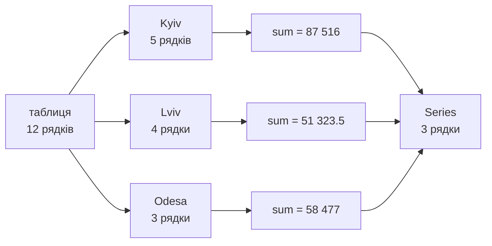
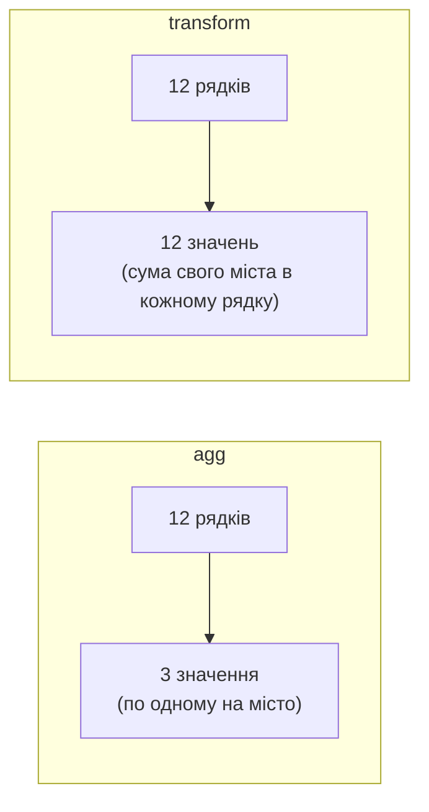
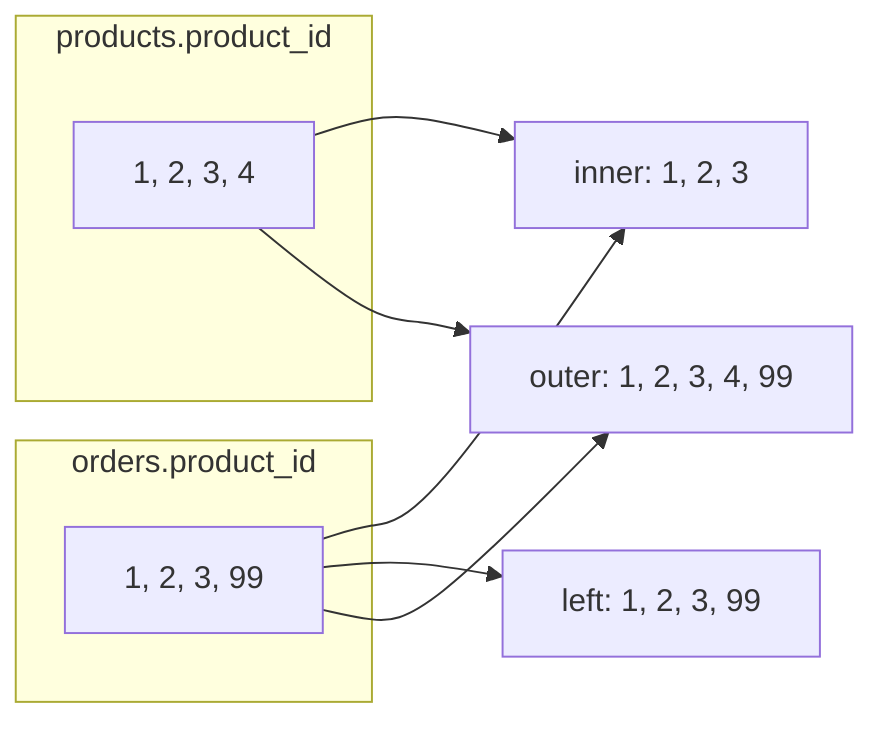

# 34. (Л) Агрегати та складні запити у pandas

## Зміст лекції

1. Від «що в таблиці» до «що з цього випливає»
2. Набір даних для лекції
3. Агрегати над усією таблицею
4. `agg`: кілька агрегатів одразу
5. `groupby`: розділити — застосувати — об'єднати
6. Групування за одним ключем
7. Групування за кількома ключами і `MultiIndex`
8. `unstack` і `stack`: з довгої таблиці в широку
9. Іменовані агрегати та власні функції
10. `size`, `count` і пропуски в ключах
11. `transform`: результат групи — назад у кожен рядок
12. `filter`: відбір цілих груп
13. Топ-N у групі, ранги та накопичувальні суми
14. Групування за датами
15. Групування за інтервалами: `cut` і `qcut`
16. Зведені таблиці: `pivot_table` і `crosstab`
17. `pivot` і `melt`: зміна форми таблиці
18. Об'єднання таблиць: `merge`
19. Типи з'єднань і пошук «сиріт»
20. Склеювання таблиць: `concat`
21. `query`: фільтрація рядком-виразом
22. Ланцюжки методів: `assign` і `pipe`
23. pandas і SQL
24. Повний приклад: звіт з трьох таблиць
25. Типові помилки
26. Підсумок

## Від «що в таблиці» до «що з цього випливає»

У лекції 32 ми навчилися читати таблицю, вибирати стовпці й рядки, фільтрувати й сортувати. Це відповідає на питання «**що** в таблиці». Але бізнес питає інакше:

- яка виручка **в кожному місті**?
- який товар найкращий **у кожній категорії**?
- як змінювалися продажі **по місяцях**?
- яку частку виручки міста дав **кожен продаж**?
- які замовлення посилаються на товари, **яких немає** в каталозі?

Усі ці питання мають спільну структуру: розбити рядки на **групи**, для кожної групи порахувати **агрегат**, а іноді ще й **з'єднати** кілька таблиць. Саме цьому присвячена лекція.

Ось як виглядає перше питання без групування — фільтром і циклом по містах:

```python
import pandas as pd

df = pd.DataFrame({
    "city": ["Kyiv", "Lviv", "Kyiv", "Odesa", "Lviv", "Kyiv"],
    "revenue": [10788.0, 8737.5, 29996.0, 7192.0, 18750.0, 10485.0],
})

# без groupby: цикл по унікальних містах і маска на кожній ітерації
for city in df["city"].unique():
    total = df.loc[df["city"] == city, "revenue"].sum()
    print(city, total)
```

```text
Kyiv 51269.0
Lviv 27487.5
Odesa 7192.0
```

Працює, але кожна ітерація проходить **усю** таблицю ще раз. Для 3 міст — дрібниця, для 30 000 клієнтів — хвилини. Те саме з `groupby`:

```python
import pandas as pd

df = pd.DataFrame({
    "city": ["Kyiv", "Lviv", "Kyiv", "Odesa", "Lviv", "Kyiv"],
    "revenue": [10788.0, 8737.5, 29996.0, 7192.0, 18750.0, 10485.0],
})

# з groupby: одна операція, один прохід по даних
print(df.groupby("city")["revenue"].sum())
```

```text
city
Kyiv     51269.0
Lviv     27487.5
Odesa     7192.0
Name: revenue, dtype: float64
```

Один рядок, один прохід по даних, а результат — готова `Series` з містами в індексі, яку можна далі сортувати, фільтрувати чи зберігати.

## Набір даних для лекції

Більшість прикладів працює з однією таблицею продажів магазину електроніки за березень–квітень. Її код повторюється в кожному прикладі, щоб будь-який з них можна було скопіювати й запустити окремо.

```python
import pandas as pd

rows = [
    ("2026-03-02", "Kyiv", "Keyboard", "peripherals", 12, 899.0),
    ("2026-03-02", "Lviv", "Mouse", "peripherals", 25, 349.5),
    ("2026-03-05", "Kyiv", "Monitor", "displays", 4, 7499.0),
    ("2026-03-09", "Odesa", "Keyboard", "peripherals", 8, 899.0),
    ("2026-03-12", "Lviv", "Headset", "audio", 15, 1250.0),
    ("2026-03-20", "Kyiv", "Mouse", "peripherals", 30, 349.5),
    ("2026-04-01", "Odesa", "Monitor", "displays", 6, 7499.0),
    ("2026-04-03", "Kyiv", "Headset", "audio", 11, 1250.0),
    ("2026-04-08", "Lviv", "Keyboard", "peripherals", 14, 899.0),
    ("2026-04-15", "Kyiv", "Monitor", "displays", 3, 7499.0),
    ("2026-04-22", "Odesa", "Mouse", "peripherals", 18, 349.5),
    ("2026-04-28", "Lviv", "Headset", "audio", 9, 1250.0),
]
df = pd.DataFrame(rows, columns=["date", "city", "product", "category", "units", "price"])
df["date"] = pd.to_datetime(df["date"])
df["revenue"] = df["units"] * df["price"]
print(df)
print()
df.info()
```

```text
         date   city   product     category  units   price  revenue
0  2026-03-02   Kyiv  Keyboard  peripherals     12   899.0  10788.0
1  2026-03-02   Lviv     Mouse  peripherals     25   349.5   8737.5
2  2026-03-05   Kyiv   Monitor     displays      4  7499.0  29996.0
3  2026-03-09  Odesa  Keyboard  peripherals      8   899.0   7192.0
4  2026-03-12   Lviv   Headset        audio     15  1250.0  18750.0
5  2026-03-20   Kyiv     Mouse  peripherals     30   349.5  10485.0
6  2026-04-01  Odesa   Monitor     displays      6  7499.0  44994.0
7  2026-04-03   Kyiv   Headset        audio     11  1250.0  13750.0
8  2026-04-08   Lviv  Keyboard  peripherals     14   899.0  12586.0
9  2026-04-15   Kyiv   Monitor     displays      3  7499.0  22497.0
10 2026-04-22  Odesa     Mouse  peripherals     18   349.5   6291.0
11 2026-04-28   Lviv   Headset        audio      9  1250.0  11250.0

<class 'pandas.DataFrame'>
RangeIndex: 12 entries, 0 to 11
Data columns (total 7 columns):
 #   Column    Non-Null Count  Dtype
---  ------    --------------  -----
 0   date      12 non-null     datetime64[us]
 1   city      12 non-null     str
 2   product   12 non-null     str
 3   category  12 non-null     str
 4   units     12 non-null     int64
 5   price     12 non-null     float64
 6   revenue   12 non-null     float64
dtypes: datetime64[us](1), float64(2), int64(1), str(3)
memory usage: 804.0 bytes
```

Один рядок — один продаж: дата, місто, товар, категорія, кількість, ціна за одиницю і виручка (`units * price`).

## Агрегати над усією таблицею

**Агрегат** — функція, яка перетворює багато значень на одне: сума, середнє, мінімум, кількість. На `Series` ви вже бачили їх у лекції 32:

```python
import pandas as pd

rows = [
    ("2026-03-02", "Kyiv", "Keyboard", "peripherals", 12, 899.0),
    ("2026-03-02", "Lviv", "Mouse", "peripherals", 25, 349.5),
    ("2026-03-05", "Kyiv", "Monitor", "displays", 4, 7499.0),
    ("2026-03-09", "Odesa", "Keyboard", "peripherals", 8, 899.0),
    ("2026-03-12", "Lviv", "Headset", "audio", 15, 1250.0),
    ("2026-03-20", "Kyiv", "Mouse", "peripherals", 30, 349.5),
    ("2026-04-01", "Odesa", "Monitor", "displays", 6, 7499.0),
    ("2026-04-03", "Kyiv", "Headset", "audio", 11, 1250.0),
    ("2026-04-08", "Lviv", "Keyboard", "peripherals", 14, 899.0),
    ("2026-04-15", "Kyiv", "Monitor", "displays", 3, 7499.0),
    ("2026-04-22", "Odesa", "Mouse", "peripherals", 18, 349.5),
    ("2026-04-28", "Lviv", "Headset", "audio", 9, 1250.0),
]
df = pd.DataFrame(rows, columns=["date", "city", "product", "category", "units", "price"])
df["date"] = pd.to_datetime(df["date"])
df["revenue"] = df["units"] * df["price"]
print("sum:    ", df["revenue"].sum())
print("mean:   ", round(df["revenue"].mean(), 2))
print("median: ", df["revenue"].median())
print("min/max:", df["units"].min(), df["units"].max())
print("count:  ", df["units"].count())
print("nunique:", df["product"].nunique())
print("idxmax: ", df["revenue"].idxmax())
print()

# рядок із найбільшою виручкою цілком
print(df.loc[df["revenue"].idxmax()])
```

```text
sum:     197316.5
mean:    16443.04
median:  11918.0
min/max: 3 30
count:   12
nunique: 4
idxmax:  6

date        2026-04-01 00:00:00
city                      Odesa
product                 Monitor
category               displays
units                         6
price                    7499.0
revenue                 44994.0
Name: 6, dtype: object
```

`idxmax` повертає **мітку** рядка, тож через `.loc` можна дістати весь рядок-рекордсмен.

На `DataFrame` агрегат рахується **для кожного стовпця окремо** і повертає `Series`:

```python
import pandas as pd

rows = [
    ("2026-03-02", "Kyiv", "Keyboard", "peripherals", 12, 899.0),
    ("2026-03-02", "Lviv", "Mouse", "peripherals", 25, 349.5),
    ("2026-03-05", "Kyiv", "Monitor", "displays", 4, 7499.0),
    ("2026-03-09", "Odesa", "Keyboard", "peripherals", 8, 899.0),
    ("2026-03-12", "Lviv", "Headset", "audio", 15, 1250.0),
    ("2026-03-20", "Kyiv", "Mouse", "peripherals", 30, 349.5),
    ("2026-04-01", "Odesa", "Monitor", "displays", 6, 7499.0),
    ("2026-04-03", "Kyiv", "Headset", "audio", 11, 1250.0),
    ("2026-04-08", "Lviv", "Keyboard", "peripherals", 14, 899.0),
    ("2026-04-15", "Kyiv", "Monitor", "displays", 3, 7499.0),
    ("2026-04-22", "Odesa", "Mouse", "peripherals", 18, 349.5),
    ("2026-04-28", "Lviv", "Headset", "audio", 9, 1250.0),
]
df = pd.DataFrame(rows, columns=["date", "city", "product", "category", "units", "price"])
df["date"] = pd.to_datetime(df["date"])
df["revenue"] = df["units"] * df["price"]
# агрегат по стовпцях (axis=0, за замовчуванням)
print(df[["units", "price", "revenue"]].sum())
print()

# лише числові стовпці: рядки й дати пропускаються
print(df.mean(numeric_only=True).round(2))
print()

# агрегат по рядках (axis=1): сума двох стовпців у кожному рядку
print(df[["units", "price"]].sum(axis=1).head(3))
```

```text
units         155.0
price       29992.5
revenue    197316.5
dtype: float64

units         12.92
price       2499.38
revenue    16443.04
dtype: float64

0     911.0
1     374.5
2    7503.0
dtype: float64
```

Правило `axis` те саме, що в NumPy (лекція 30): `axis=0` — «згорнути рядки», результат по одному числу **на стовпець**; `axis=1` — «згорнути стовпці», результат по одному числу **на рядок**.

!!! warning "`numeric_only=True`"
    `df.mean()` на таблиці з текстовими стовпцями кидає `TypeError`: середнє від `"Kyiv"` не існує. Або виберіть числові стовпці явно (`df[["units", "price"]]`), або передайте `numeric_only=True`.

Основні агрегати:

| Метод | Що рахує |
|---|---|
| `sum()` | сума |
| `mean()`, `median()` | середнє, медіана |
| `min()`, `max()` | мінімум, максимум |
| `idxmin()`, `idxmax()` | **мітка** мінімуму / максимуму |
| `count()` | кількість **непорожніх** значень |
| `size` (атрибут) | кількість значень **разом із пропусками** |
| `nunique()` | кількість унікальних значень |
| `std()`, `var()` | стандартне відхилення, дисперсія (`ddof=1`) |
| `quantile(q)` | квантиль |
| `first()`, `last()` | перше / останнє значення |

## `agg`: кілька агрегатів одразу

Метод `agg` (скорочення від *aggregate*) приймає **список** функцій або **словник** «стовпець → функції»:

```python
import pandas as pd

rows = [
    ("2026-03-02", "Kyiv", "Keyboard", "peripherals", 12, 899.0),
    ("2026-03-02", "Lviv", "Mouse", "peripherals", 25, 349.5),
    ("2026-03-05", "Kyiv", "Monitor", "displays", 4, 7499.0),
    ("2026-03-09", "Odesa", "Keyboard", "peripherals", 8, 899.0),
    ("2026-03-12", "Lviv", "Headset", "audio", 15, 1250.0),
    ("2026-03-20", "Kyiv", "Mouse", "peripherals", 30, 349.5),
    ("2026-04-01", "Odesa", "Monitor", "displays", 6, 7499.0),
    ("2026-04-03", "Kyiv", "Headset", "audio", 11, 1250.0),
    ("2026-04-08", "Lviv", "Keyboard", "peripherals", 14, 899.0),
    ("2026-04-15", "Kyiv", "Monitor", "displays", 3, 7499.0),
    ("2026-04-22", "Odesa", "Mouse", "peripherals", 18, 349.5),
    ("2026-04-28", "Lviv", "Headset", "audio", 9, 1250.0),
]
df = pd.DataFrame(rows, columns=["date", "city", "product", "category", "units", "price"])
df["date"] = pd.to_datetime(df["date"])
df["revenue"] = df["units"] * df["price"]
# список агрегатів для одного стовпця
print(df["revenue"].agg(["sum", "mean", "max"]))
print()

# список агрегатів для кількох стовпців
print(df[["units", "revenue"]].agg(["sum", "mean", "max"]))
print()

# словник: для кожного стовпця — свої агрегати
print(df.agg({"units": "sum", "price": ["min", "max"], "date": ["min", "max"]}))
```

```text
sum     197316.500000
mean     16443.041667
max      44994.000000
Name: revenue, dtype: float64

           units        revenue
sum   155.000000  197316.500000
mean   12.916667   16443.041667
max    30.000000   44994.000000

     units   price       date
sum  155.0     NaN        NaT
min    NaN   349.5 2026-03-02
max    NaN  7499.0 2026-04-28
```

Функції задають **рядком-назвою** (`"sum"`, `"mean"`) — pandas сам візьме оптимізовану реалізацію. Там, де для стовпця агрегат не просили, стоїть `NaN`.

Сам по собі `agg` рідко потрібен на всій таблиці. Його справжня сила — у поєднанні з `groupby`.

## `groupby`: розділити — застосувати — об'єднати

Групування працює за схемою **split — apply — combine**:

1. **split** — розбити рядки на групи за значенням ключа;
2. **apply** — до кожної групи окремо застосувати функцію (агрегат, перетворення, фільтр);
3. **combine** — зібрати результати в нову таблицю.



Виклик `df.groupby("city")` ще нічого не рахує — він повертає **об'єкт групування**, який лише знає, які рядки куди потрапили:

```python
import pandas as pd

rows = [
    ("2026-03-02", "Kyiv", "Keyboard", "peripherals", 12, 899.0),
    ("2026-03-02", "Lviv", "Mouse", "peripherals", 25, 349.5),
    ("2026-03-05", "Kyiv", "Monitor", "displays", 4, 7499.0),
    ("2026-03-09", "Odesa", "Keyboard", "peripherals", 8, 899.0),
    ("2026-03-12", "Lviv", "Headset", "audio", 15, 1250.0),
    ("2026-03-20", "Kyiv", "Mouse", "peripherals", 30, 349.5),
    ("2026-04-01", "Odesa", "Monitor", "displays", 6, 7499.0),
    ("2026-04-03", "Kyiv", "Headset", "audio", 11, 1250.0),
    ("2026-04-08", "Lviv", "Keyboard", "peripherals", 14, 899.0),
    ("2026-04-15", "Kyiv", "Monitor", "displays", 3, 7499.0),
    ("2026-04-22", "Odesa", "Mouse", "peripherals", 18, 349.5),
    ("2026-04-28", "Lviv", "Headset", "audio", 9, 1250.0),
]
df = pd.DataFrame(rows, columns=["date", "city", "product", "category", "units", "price"])
df["date"] = pd.to_datetime(df["date"])
df["revenue"] = df["units"] * df["price"]
grouped = df.groupby("city")
print(type(grouped))
print("groups:", grouped.ngroups)
print()

# які мітки рядків потрапили в кожну групу
for city, labels in grouped.groups.items():
    print(city, list(labels))
print()

# одна група як окрема таблиця
print(grouped.get_group("Odesa"))
```

```text
<class 'pandas.api.typing.DataFrameGroupBy'>
groups: 3

Kyiv [0, 2, 5, 7, 9]
Lviv [1, 4, 8, 11]
Odesa [3, 6, 10]

         date   city   product     category  units   price  revenue
3  2026-03-09  Odesa  Keyboard  peripherals      8   899.0   7192.0
6  2026-04-01  Odesa   Monitor     displays      6  7499.0  44994.0
10 2026-04-22  Odesa     Mouse  peripherals     18   349.5   6291.0
```

Якщо потрібно подивитися на групи під час налагодження, по об'єкту можна пройти циклом: `for key, group in grouped: ...` — кожна `group` є звичайним `DataFrame`. Але для обчислень цикл не потрібен: усе роблять методи групування.

## Групування за одним ключем

Типовий виклик складається з трьох частин: **за чим** групувати, **який стовпець** рахувати, **який агрегат**:

```python
import pandas as pd

rows = [
    ("2026-03-02", "Kyiv", "Keyboard", "peripherals", 12, 899.0),
    ("2026-03-02", "Lviv", "Mouse", "peripherals", 25, 349.5),
    ("2026-03-05", "Kyiv", "Monitor", "displays", 4, 7499.0),
    ("2026-03-09", "Odesa", "Keyboard", "peripherals", 8, 899.0),
    ("2026-03-12", "Lviv", "Headset", "audio", 15, 1250.0),
    ("2026-03-20", "Kyiv", "Mouse", "peripherals", 30, 349.5),
    ("2026-04-01", "Odesa", "Monitor", "displays", 6, 7499.0),
    ("2026-04-03", "Kyiv", "Headset", "audio", 11, 1250.0),
    ("2026-04-08", "Lviv", "Keyboard", "peripherals", 14, 899.0),
    ("2026-04-15", "Kyiv", "Monitor", "displays", 3, 7499.0),
    ("2026-04-22", "Odesa", "Mouse", "peripherals", 18, 349.5),
    ("2026-04-28", "Lviv", "Headset", "audio", 9, 1250.0),
]
df = pd.DataFrame(rows, columns=["date", "city", "product", "category", "units", "price"])
df["date"] = pd.to_datetime(df["date"])
df["revenue"] = df["units"] * df["price"]
# за чим групувати -> який стовпець -> який агрегат
print(df.groupby("city")["revenue"].sum())
print()

# кілька стовпців -> DataFrame
print(df.groupby("category")[["units", "revenue"]].sum())
print()

# одразу відсортувати результат
print(df.groupby("product")["units"].sum().sort_values(ascending=False))
```

```text
city
Kyiv     87516.0
Lviv     51323.5
Odesa    58477.0
Name: revenue, dtype: float64

             units  revenue
category
audio           35  43750.0
displays        13  97487.0
peripherals    107  56079.5

product
Mouse       73
Headset     35
Keyboard    34
Monitor     13
Name: units, dtype: int64
```

Зверніть увагу:

- ключ групування стає **індексом** результату;
- групи відсортовані за ключем (алфавіт). Якщо порядок не важливий, `sort=False` трохи пришвидшує роботу;
- `["revenue"]` після `groupby` — один стовпець, результат `Series`; `[["units", "revenue"]]` — кілька, результат `DataFrame`.

Якщо ключ потрібен як звичайний стовпець (наприклад, для запису в CSV), є два способи:

```python
import pandas as pd

rows = [
    ("2026-03-02", "Kyiv", "Keyboard", "peripherals", 12, 899.0),
    ("2026-03-02", "Lviv", "Mouse", "peripherals", 25, 349.5),
    ("2026-03-05", "Kyiv", "Monitor", "displays", 4, 7499.0),
    ("2026-03-09", "Odesa", "Keyboard", "peripherals", 8, 899.0),
    ("2026-03-12", "Lviv", "Headset", "audio", 15, 1250.0),
    ("2026-03-20", "Kyiv", "Mouse", "peripherals", 30, 349.5),
    ("2026-04-01", "Odesa", "Monitor", "displays", 6, 7499.0),
    ("2026-04-03", "Kyiv", "Headset", "audio", 11, 1250.0),
    ("2026-04-08", "Lviv", "Keyboard", "peripherals", 14, 899.0),
    ("2026-04-15", "Kyiv", "Monitor", "displays", 3, 7499.0),
    ("2026-04-22", "Odesa", "Mouse", "peripherals", 18, 349.5),
    ("2026-04-28", "Lviv", "Headset", "audio", 9, 1250.0),
]
df = pd.DataFrame(rows, columns=["date", "city", "product", "category", "units", "price"])
df["date"] = pd.to_datetime(df["date"])
df["revenue"] = df["units"] * df["price"]
# спосіб 1: reset_index після агрегату
print(df.groupby("city")["revenue"].sum().reset_index())
print()

# спосіб 2: as_index=False одразу
print(df.groupby("city", as_index=False)["revenue"].sum())
```

```text
    city  revenue
0   Kyiv  87516.0
1   Lviv  51323.5
2  Odesa  58477.0

    city  revenue
0   Kyiv  87516.0
1   Lviv  51323.5
2  Odesa  58477.0
```

Групувати можна не лише за стовпцем таблиці, а й за будь-якою `Series` тієї ж довжини — наприклад, за обчисленою умовою:

```python
import pandas as pd

rows = [
    ("2026-03-02", "Kyiv", "Keyboard", "peripherals", 12, 899.0),
    ("2026-03-02", "Lviv", "Mouse", "peripherals", 25, 349.5),
    ("2026-03-05", "Kyiv", "Monitor", "displays", 4, 7499.0),
    ("2026-03-09", "Odesa", "Keyboard", "peripherals", 8, 899.0),
    ("2026-03-12", "Lviv", "Headset", "audio", 15, 1250.0),
    ("2026-03-20", "Kyiv", "Mouse", "peripherals", 30, 349.5),
    ("2026-04-01", "Odesa", "Monitor", "displays", 6, 7499.0),
    ("2026-04-03", "Kyiv", "Headset", "audio", 11, 1250.0),
    ("2026-04-08", "Lviv", "Keyboard", "peripherals", 14, 899.0),
    ("2026-04-15", "Kyiv", "Monitor", "displays", 3, 7499.0),
    ("2026-04-22", "Odesa", "Mouse", "peripherals", 18, 349.5),
    ("2026-04-28", "Lviv", "Headset", "audio", 9, 1250.0),
]
df = pd.DataFrame(rows, columns=["date", "city", "product", "category", "units", "price"])
df["date"] = pd.to_datetime(df["date"])
df["revenue"] = df["units"] * df["price"]
# ключ — обчислена Series, а не стовпець таблиці
is_big = df["revenue"] > 15000
print(df.groupby(is_big)["revenue"].agg(["size", "sum"]))
```

```text
         size       sum
revenue
False       8   81079.5
True        4  116237.0
```

## Групування за кількома ключами і `MultiIndex`

Список ключів дає групи за **комбінаціями** значень:

```python
import pandas as pd

rows = [
    ("2026-03-02", "Kyiv", "Keyboard", "peripherals", 12, 899.0),
    ("2026-03-02", "Lviv", "Mouse", "peripherals", 25, 349.5),
    ("2026-03-05", "Kyiv", "Monitor", "displays", 4, 7499.0),
    ("2026-03-09", "Odesa", "Keyboard", "peripherals", 8, 899.0),
    ("2026-03-12", "Lviv", "Headset", "audio", 15, 1250.0),
    ("2026-03-20", "Kyiv", "Mouse", "peripherals", 30, 349.5),
    ("2026-04-01", "Odesa", "Monitor", "displays", 6, 7499.0),
    ("2026-04-03", "Kyiv", "Headset", "audio", 11, 1250.0),
    ("2026-04-08", "Lviv", "Keyboard", "peripherals", 14, 899.0),
    ("2026-04-15", "Kyiv", "Monitor", "displays", 3, 7499.0),
    ("2026-04-22", "Odesa", "Mouse", "peripherals", 18, 349.5),
    ("2026-04-28", "Lviv", "Headset", "audio", 9, 1250.0),
]
df = pd.DataFrame(rows, columns=["date", "city", "product", "category", "units", "price"])
df["date"] = pd.to_datetime(df["date"])
df["revenue"] = df["units"] * df["price"]
by_city_cat = df.groupby(["city", "category"])["revenue"].sum()
print(by_city_cat)
print()
print(by_city_cat.index)
```

```text
city   category
Kyiv   audio          13750.0
       displays       52493.0
       peripherals    21273.0
Lviv   audio          30000.0
       peripherals    21323.5
Odesa  displays       44994.0
       peripherals    13483.0
Name: revenue, dtype: float64

MultiIndex([( 'Kyiv',       'audio'),
            ( 'Kyiv',    'displays'),
            ( 'Kyiv', 'peripherals'),
            ( 'Lviv',       'audio'),
            ( 'Lviv', 'peripherals'),
            ('Odesa',    'displays'),
            ('Odesa', 'peripherals')],
           names=['city', 'category'])
```

Індекс результату тепер **багаторівневий** (`MultiIndex`): кожна мітка — кортеж `(city, category)`. Повторювані значення зовнішнього рівня pandas просто не друкує, щоб таблиця читалася легше.

Доступ до елементів — через кортежі або за зовнішнім рівнем:

```python
import pandas as pd

rows = [
    ("2026-03-02", "Kyiv", "Keyboard", "peripherals", 12, 899.0),
    ("2026-03-02", "Lviv", "Mouse", "peripherals", 25, 349.5),
    ("2026-03-05", "Kyiv", "Monitor", "displays", 4, 7499.0),
    ("2026-03-09", "Odesa", "Keyboard", "peripherals", 8, 899.0),
    ("2026-03-12", "Lviv", "Headset", "audio", 15, 1250.0),
    ("2026-03-20", "Kyiv", "Mouse", "peripherals", 30, 349.5),
    ("2026-04-01", "Odesa", "Monitor", "displays", 6, 7499.0),
    ("2026-04-03", "Kyiv", "Headset", "audio", 11, 1250.0),
    ("2026-04-08", "Lviv", "Keyboard", "peripherals", 14, 899.0),
    ("2026-04-15", "Kyiv", "Monitor", "displays", 3, 7499.0),
    ("2026-04-22", "Odesa", "Mouse", "peripherals", 18, 349.5),
    ("2026-04-28", "Lviv", "Headset", "audio", 9, 1250.0),
]
df = pd.DataFrame(rows, columns=["date", "city", "product", "category", "units", "price"])
df["date"] = pd.to_datetime(df["date"])
df["revenue"] = df["units"] * df["price"]
by_city_cat = df.groupby(["city", "category"])["revenue"].sum()

# одна клітинка — кортеж міток
print(by_city_cat.loc[("Kyiv", "displays")])
print()

# усе для одного міста — мітка зовнішнього рівня
print(by_city_cat.loc["Lviv"])
print()

# зріз за внутрішнім рівнем: одна категорія в усіх містах
print(by_city_cat.xs("audio", level="category"))
print()

# агрегат по одному рівню MultiIndex
print(by_city_cat.groupby(level="city").max())
```

```text
52493.0

category
audio          30000.0
peripherals    21323.5
Name: revenue, dtype: float64

city
Kyiv    13750.0
Lviv    30000.0
Name: revenue, dtype: float64

city
Kyiv     52493.0
Lviv     30000.0
Odesa    44994.0
Name: revenue, dtype: float64
```

`MultiIndex` потужний, але незручний для подальшої роботи. У більшості випадків після групування роблять `reset_index()` або `unstack()`.

## `unstack` і `stack`: з довгої таблиці в широку

`unstack` переносить внутрішній рівень індексу в **стовпці** — виходить звична двовимірна таблиця «міста × категорії»:

```python
import pandas as pd

rows = [
    ("2026-03-02", "Kyiv", "Keyboard", "peripherals", 12, 899.0),
    ("2026-03-02", "Lviv", "Mouse", "peripherals", 25, 349.5),
    ("2026-03-05", "Kyiv", "Monitor", "displays", 4, 7499.0),
    ("2026-03-09", "Odesa", "Keyboard", "peripherals", 8, 899.0),
    ("2026-03-12", "Lviv", "Headset", "audio", 15, 1250.0),
    ("2026-03-20", "Kyiv", "Mouse", "peripherals", 30, 349.5),
    ("2026-04-01", "Odesa", "Monitor", "displays", 6, 7499.0),
    ("2026-04-03", "Kyiv", "Headset", "audio", 11, 1250.0),
    ("2026-04-08", "Lviv", "Keyboard", "peripherals", 14, 899.0),
    ("2026-04-15", "Kyiv", "Monitor", "displays", 3, 7499.0),
    ("2026-04-22", "Odesa", "Mouse", "peripherals", 18, 349.5),
    ("2026-04-28", "Lviv", "Headset", "audio", 9, 1250.0),
]
df = pd.DataFrame(rows, columns=["date", "city", "product", "category", "units", "price"])
df["date"] = pd.to_datetime(df["date"])
df["revenue"] = df["units"] * df["price"]
by_city_cat = df.groupby(["city", "category"])["revenue"].sum()

wide = by_city_cat.unstack()
print(wide)
print()

# пропущені комбінації -> 0
wide = by_city_cat.unstack(fill_value=0)
print(wide)
print()

# stack — зворотна операція
print(wide.stack().head(4))
```

```text
category    audio  displays  peripherals
city
Kyiv      13750.0   52493.0      21273.0
Lviv      30000.0       NaN      21323.5
Odesa         NaN   44994.0      13483.0

category    audio  displays  peripherals
city
Kyiv      13750.0   52493.0      21273.0
Lviv      30000.0       0.0      21323.5
Odesa         0.0   44994.0      13483.0

city  category
Kyiv  audio          13750.0
      displays       52493.0
      peripherals    21273.0
Lviv  audio          30000.0
dtype: float64
```

`NaN` з'явився там, де такої комбінації в даних немає: в Одесі не продавали аудіо. Для сум логічно поставити нуль, для середніх — ні (див. попередження про `fillna(0)` у лекції 32).

## Іменовані агрегати та власні функції

Коли для групи потрібно кілька показників, `agg` з групуванням дає цілий звіт одним викликом:

```python
import pandas as pd

rows = [
    ("2026-03-02", "Kyiv", "Keyboard", "peripherals", 12, 899.0),
    ("2026-03-02", "Lviv", "Mouse", "peripherals", 25, 349.5),
    ("2026-03-05", "Kyiv", "Monitor", "displays", 4, 7499.0),
    ("2026-03-09", "Odesa", "Keyboard", "peripherals", 8, 899.0),
    ("2026-03-12", "Lviv", "Headset", "audio", 15, 1250.0),
    ("2026-03-20", "Kyiv", "Mouse", "peripherals", 30, 349.5),
    ("2026-04-01", "Odesa", "Monitor", "displays", 6, 7499.0),
    ("2026-04-03", "Kyiv", "Headset", "audio", 11, 1250.0),
    ("2026-04-08", "Lviv", "Keyboard", "peripherals", 14, 899.0),
    ("2026-04-15", "Kyiv", "Monitor", "displays", 3, 7499.0),
    ("2026-04-22", "Odesa", "Mouse", "peripherals", 18, 349.5),
    ("2026-04-28", "Lviv", "Headset", "audio", 9, 1250.0),
]
df = pd.DataFrame(rows, columns=["date", "city", "product", "category", "units", "price"])
df["date"] = pd.to_datetime(df["date"])
df["revenue"] = df["units"] * df["price"]
# список агрегатів -> стовпці з двома рівнями назв
print(df.groupby("city")["revenue"].agg(["size", "sum", "mean"]))
print()

# словник: різні агрегати для різних стовпців
report = df.groupby("city").agg({"units": "sum", "revenue": ["sum", "max"]})
print(report)
print()
print(list(report.columns))
```

```text
       size      sum          mean
city
Kyiv      5  87516.0  17503.200000
Lviv      4  51323.5  12830.875000
Odesa     3  58477.0  19492.333333

      units  revenue
        sum      sum      max
city
Kyiv     60  87516.0  29996.0
Lviv     63  51323.5  18750.0
Odesa    32  58477.0  44994.0

[('units', 'sum'), ('revenue', 'sum'), ('revenue', 'max')]
```

У другому випадку стовпці отримали **двоярусні назви** — кортежі `("revenue", "sum")`. З такими незручно працювати. Тому в сучасному коді використовують **іменовані агрегати**: `нова_назва=("стовпець", "функція")`.

```python
import pandas as pd

rows = [
    ("2026-03-02", "Kyiv", "Keyboard", "peripherals", 12, 899.0),
    ("2026-03-02", "Lviv", "Mouse", "peripherals", 25, 349.5),
    ("2026-03-05", "Kyiv", "Monitor", "displays", 4, 7499.0),
    ("2026-03-09", "Odesa", "Keyboard", "peripherals", 8, 899.0),
    ("2026-03-12", "Lviv", "Headset", "audio", 15, 1250.0),
    ("2026-03-20", "Kyiv", "Mouse", "peripherals", 30, 349.5),
    ("2026-04-01", "Odesa", "Monitor", "displays", 6, 7499.0),
    ("2026-04-03", "Kyiv", "Headset", "audio", 11, 1250.0),
    ("2026-04-08", "Lviv", "Keyboard", "peripherals", 14, 899.0),
    ("2026-04-15", "Kyiv", "Monitor", "displays", 3, 7499.0),
    ("2026-04-22", "Odesa", "Mouse", "peripherals", 18, 349.5),
    ("2026-04-28", "Lviv", "Headset", "audio", 9, 1250.0),
]
df = pd.DataFrame(rows, columns=["date", "city", "product", "category", "units", "price"])
df["date"] = pd.to_datetime(df["date"])
df["revenue"] = df["units"] * df["price"]
report = df.groupby("city").agg(
    orders=("revenue", "size"),
    units=("units", "sum"),
    revenue=("revenue", "sum"),
    avg_check=("revenue", "mean"),
    first_sale=("date", "min"),
    products=("product", "nunique"),
)
print(report.round({"avg_check": 2}))
print()
print(list(report.columns))
```

```text
       orders  units  revenue  avg_check first_sale  products
city
Kyiv        5     60  87516.0   17503.20 2026-03-02         4
Lviv        4     63  51323.5   12830.88 2026-03-02         3
Odesa       3     32  58477.0   19492.33 2026-03-09         3

['orders', 'units', 'revenue', 'avg_check', 'first_sale', 'products']
```

Назви стовпців — прості рядки, які ви обрали самі. Це найчитабельніша форма агрегації: з коду одразу видно, **який показник з якого стовпця і як** порахований.

Замість назви функції можна передати **власну функцію**. Вона отримує `Series` однієї групи й має повернути одне значення:

```python
import pandas as pd

rows = [
    ("2026-03-02", "Kyiv", "Keyboard", "peripherals", 12, 899.0),
    ("2026-03-02", "Lviv", "Mouse", "peripherals", 25, 349.5),
    ("2026-03-05", "Kyiv", "Monitor", "displays", 4, 7499.0),
    ("2026-03-09", "Odesa", "Keyboard", "peripherals", 8, 899.0),
    ("2026-03-12", "Lviv", "Headset", "audio", 15, 1250.0),
    ("2026-03-20", "Kyiv", "Mouse", "peripherals", 30, 349.5),
    ("2026-04-01", "Odesa", "Monitor", "displays", 6, 7499.0),
    ("2026-04-03", "Kyiv", "Headset", "audio", 11, 1250.0),
    ("2026-04-08", "Lviv", "Keyboard", "peripherals", 14, 899.0),
    ("2026-04-15", "Kyiv", "Monitor", "displays", 3, 7499.0),
    ("2026-04-22", "Odesa", "Mouse", "peripherals", 18, 349.5),
    ("2026-04-28", "Lviv", "Headset", "audio", 9, 1250.0),
]
df = pd.DataFrame(rows, columns=["date", "city", "product", "category", "units", "price"])
df["date"] = pd.to_datetime(df["date"])
df["revenue"] = df["units"] * df["price"]
def price_range(values):
    # різниця між найдорожчим і найдешевшим товаром у групі
    return values.max() - values.min()


report = df.groupby("city").agg(
    price_range=("price", price_range),
    units_span=("units", lambda s: s.max() - s.min()),
    top_product=("product", lambda s: s.value_counts().idxmax()),
)
print(report)
```

```text
       price_range  units_span top_product
city
Kyiv        7149.5          27     Monitor
Lviv         900.5          16     Headset
Odesa       7149.5          12    Keyboard
```

!!! tip "Вбудовані агрегати — швидкі, власні — повільні"
    `"sum"`, `"mean"`, `"max"` pandas рахує оптимізованим кодом без циклу Python. Власна функція викликається **окремо для кожної групи** — на мільйонах груп це відчутно. Використовуйте її лише тоді, коли вбудованого еквівалента немає.

Про `apply`: на групуванні є ще метод `apply`, який передає у функцію **всю групу як `DataFrame`** і дозволяє повернути що завгодно. Він найгнучкіший і найповільніший. Майже завжди задачу можна розв'язати через `agg`, `transform` або `filter`, які розглянемо далі.

## `size`, `count` і пропуски в ключах

Дві схожі функції, що часто плутають:

- `size` — кількість **рядків** у групі;
- `count` — кількість **непорожніх** значень у кожному стовпці групи.

```python
import pandas as pd

df = pd.DataFrame({
    "city": ["Kyiv", "Kyiv", "Lviv", "Lviv", None, "Kyiv"],
    "units": [12.0, None, 25.0, 15.0, 7.0, 30.0],
    "rating": [5.0, 4.0, None, None, 3.0, 4.0],
})

print(df.groupby("city").size())
print()
print(df.groupby("city").count())
print()

# рядки з пропуском у ключі за замовчуванням відкидаються
print(df.groupby("city", dropna=False).size())
```

```text
city
Kyiv    3
Lviv    2
dtype: int64

      units  rating
city
Kyiv      2       3
Lviv      2       0

city
Kyiv    3
Lviv    2
NaN     1
dtype: int64
```

Два важливі висновки:

1. Для питання «скільки замовлень» потрібен `size`. `count` відповідає на інше питання: «скільки заповнених значень».
2. Рядок, у якого **ключ** порожній, **тихо зникає** з групування. Звіт може не зійтися із загальною сумою — і ніякої помилки. `dropna=False` робить такі рядки окремою групою `NaN`.

## `transform`: результат групи — назад у кожен рядок

Агрегат **згортає** групу в одне значення: з 12 рядків виходить 3. Але часто потрібно інше — щоб у **кожному рядку** було значення, пораховане по його групі. Наприклад, «частка цього продажу у виручці свого міста».

`transform` рахує той самий агрегат, але **розтягує** результат назад на всі рядки групи, зберігаючи вихідний індекс:

```python
import pandas as pd

rows = [
    ("2026-03-02", "Kyiv", "Keyboard", "peripherals", 12, 899.0),
    ("2026-03-02", "Lviv", "Mouse", "peripherals", 25, 349.5),
    ("2026-03-05", "Kyiv", "Monitor", "displays", 4, 7499.0),
    ("2026-03-09", "Odesa", "Keyboard", "peripherals", 8, 899.0),
    ("2026-03-12", "Lviv", "Headset", "audio", 15, 1250.0),
    ("2026-03-20", "Kyiv", "Mouse", "peripherals", 30, 349.5),
    ("2026-04-01", "Odesa", "Monitor", "displays", 6, 7499.0),
    ("2026-04-03", "Kyiv", "Headset", "audio", 11, 1250.0),
    ("2026-04-08", "Lviv", "Keyboard", "peripherals", 14, 899.0),
    ("2026-04-15", "Kyiv", "Monitor", "displays", 3, 7499.0),
    ("2026-04-22", "Odesa", "Mouse", "peripherals", 18, 349.5),
    ("2026-04-28", "Lviv", "Headset", "audio", 9, 1250.0),
]
df = pd.DataFrame(rows, columns=["date", "city", "product", "category", "units", "price"])
df["date"] = pd.to_datetime(df["date"])
df["revenue"] = df["units"] * df["price"]
# agg: одне значення на групу (3 рядки)
print(df.groupby("city")["revenue"].sum())
print()

# transform: те саме значення в кожному рядку групи (12 рядків)
city_total = df.groupby("city")["revenue"].transform("sum")
print(city_total.tolist())
```

```text
city
Kyiv     87516.0
Lviv     51323.5
Odesa    58477.0
Name: revenue, dtype: float64

[87516.0, 51323.5, 87516.0, 58477.0, 51323.5, 87516.0, 58477.0, 87516.0, 51323.5, 87516.0, 58477.0, 51323.5]
```



Оскільки довжина та індекс збігаються з вихідною таблицею, результат можна одразу покласти в новий стовпець або використати в арифметиці:

```python
import pandas as pd

rows = [
    ("2026-03-02", "Kyiv", "Keyboard", "peripherals", 12, 899.0),
    ("2026-03-02", "Lviv", "Mouse", "peripherals", 25, 349.5),
    ("2026-03-05", "Kyiv", "Monitor", "displays", 4, 7499.0),
    ("2026-03-09", "Odesa", "Keyboard", "peripherals", 8, 899.0),
    ("2026-03-12", "Lviv", "Headset", "audio", 15, 1250.0),
    ("2026-03-20", "Kyiv", "Mouse", "peripherals", 30, 349.5),
    ("2026-04-01", "Odesa", "Monitor", "displays", 6, 7499.0),
    ("2026-04-03", "Kyiv", "Headset", "audio", 11, 1250.0),
    ("2026-04-08", "Lviv", "Keyboard", "peripherals", 14, 899.0),
    ("2026-04-15", "Kyiv", "Monitor", "displays", 3, 7499.0),
    ("2026-04-22", "Odesa", "Mouse", "peripherals", 18, 349.5),
    ("2026-04-28", "Lviv", "Headset", "audio", 9, 1250.0),
]
df = pd.DataFrame(rows, columns=["date", "city", "product", "category", "units", "price"])
df["date"] = pd.to_datetime(df["date"])
df["revenue"] = df["units"] * df["price"]
df["city_total"] = df.groupby("city")["revenue"].transform("sum")
df["share"] = df["revenue"] / df["city_total"] * 100

# відхилення від середньої кількості у своїй категорії
df["units_vs_cat"] = df["units"] - df.groupby("category")["units"].transform("mean")

print(df[["city", "product", "revenue", "city_total", "share", "units_vs_cat"]].round(2))
print()

# перевірка: частки всередині міста дають 100%
print(df.groupby("city")["share"].sum().round(6))
```

```text
     city   product  revenue  city_total  share  units_vs_cat
0    Kyiv  Keyboard  10788.0     87516.0  12.33         -5.83
1    Lviv     Mouse   8737.5     51323.5  17.02          7.17
2    Kyiv   Monitor  29996.0     87516.0  34.27         -0.33
3   Odesa  Keyboard   7192.0     58477.0  12.30         -9.83
4    Lviv   Headset  18750.0     51323.5  36.53          3.33
5    Kyiv     Mouse  10485.0     87516.0  11.98         12.17
6   Odesa   Monitor  44994.0     58477.0  76.94          1.67
7    Kyiv   Headset  13750.0     87516.0  15.71         -0.67
8    Lviv  Keyboard  12586.0     51323.5  24.52         -3.83
9    Kyiv   Monitor  22497.0     87516.0  25.71         -1.33
10  Odesa     Mouse   6291.0     58477.0  10.76          0.17
11   Lviv   Headset  11250.0     51323.5  21.92         -2.67

city
Kyiv     100.0
Lviv     100.0
Odesa    100.0
Name: share, dtype: float64
```

Ще одне класичне застосування `transform` — **заповнення пропусків середнім по групі**, а не по всій таблиці:

```python
import pandas as pd

df = pd.DataFrame({
    "category": ["displays", "displays", "displays", "peripherals", "peripherals", "peripherals"],
    "product": ["Monitor A", "Monitor B", "Monitor C", "Mouse", "Keyboard", "Webcam"],
    "price": [7499.0, None, 8100.0, 349.5, 899.0, None],
})

# середня ціна по всій таблиці спотворює обидві категорії
print("global mean:", round(df["price"].mean(), 2))

# середня ціна своєї категорії — розумніша заміна
df["price_filled"] = df["price"].fillna(df.groupby("category")["price"].transform("mean"))
print(df)
```

```text
global mean: 4211.88
      category    product   price  price_filled
0     displays  Monitor A  7499.0       7499.00
1     displays  Monitor B     NaN       7799.50
2     displays  Monitor C  8100.0       8100.00
3  peripherals      Mouse   349.5        349.50
4  peripherals   Keyboard   899.0        899.00
5  peripherals     Webcam     NaN        624.25
```

Замість середнього по всій таблиці (4211.88 — ні монітор, ні мишка) кожен пропуск отримав середнє **своєї** категорії.

## `filter`: відбір цілих груп

Звичайна маска відбирає **рядки**. `filter` відбирає **групи**: функція отримує групу як `DataFrame` і повертає `True` (залишити всі рядки групи) або `False` (викинути всі).

```python
import pandas as pd

rows = [
    ("2026-03-02", "Kyiv", "Keyboard", "peripherals", 12, 899.0),
    ("2026-03-02", "Lviv", "Mouse", "peripherals", 25, 349.5),
    ("2026-03-05", "Kyiv", "Monitor", "displays", 4, 7499.0),
    ("2026-03-09", "Odesa", "Keyboard", "peripherals", 8, 899.0),
    ("2026-03-12", "Lviv", "Headset", "audio", 15, 1250.0),
    ("2026-03-20", "Kyiv", "Mouse", "peripherals", 30, 349.5),
    ("2026-04-01", "Odesa", "Monitor", "displays", 6, 7499.0),
    ("2026-04-03", "Kyiv", "Headset", "audio", 11, 1250.0),
    ("2026-04-08", "Lviv", "Keyboard", "peripherals", 14, 899.0),
    ("2026-04-15", "Kyiv", "Monitor", "displays", 3, 7499.0),
    ("2026-04-22", "Odesa", "Mouse", "peripherals", 18, 349.5),
    ("2026-04-28", "Lviv", "Headset", "audio", 9, 1250.0),
]
df = pd.DataFrame(rows, columns=["date", "city", "product", "category", "units", "price"])
df["date"] = pd.to_datetime(df["date"])
df["revenue"] = df["units"] * df["price"]
# залишити лише категорії, де було щонайменше 4 продажі
frequent = df.groupby("category").filter(lambda g: len(g) >= 4)
print(frequent[["date", "product", "category", "units"]])
print()

# залишити лише міста з сумарною виручкою понад 55000
rich = df.groupby("city").filter(lambda g: g["revenue"].sum() > 55000)
print(rich["city"].unique().tolist())
```

```text
         date   product     category  units
0  2026-03-02  Keyboard  peripherals     12
1  2026-03-02     Mouse  peripherals     25
3  2026-03-09  Keyboard  peripherals      8
5  2026-03-20     Mouse  peripherals     30
8  2026-04-08  Keyboard  peripherals     14
10 2026-04-22     Mouse  peripherals     18

['Kyiv', 'Odesa']
```

Результат — **вихідні рядки** (з вихідним індексом), а не агрегати.

Той самий результат дає маска з `transform` — і вона працює швидше, бо не викликає функцію Python для кожної групи:

```python
import pandas as pd

rows = [
    ("2026-03-02", "Kyiv", "Keyboard", "peripherals", 12, 899.0),
    ("2026-03-02", "Lviv", "Mouse", "peripherals", 25, 349.5),
    ("2026-03-05", "Kyiv", "Monitor", "displays", 4, 7499.0),
    ("2026-03-09", "Odesa", "Keyboard", "peripherals", 8, 899.0),
    ("2026-03-12", "Lviv", "Headset", "audio", 15, 1250.0),
    ("2026-03-20", "Kyiv", "Mouse", "peripherals", 30, 349.5),
    ("2026-04-01", "Odesa", "Monitor", "displays", 6, 7499.0),
    ("2026-04-03", "Kyiv", "Headset", "audio", 11, 1250.0),
    ("2026-04-08", "Lviv", "Keyboard", "peripherals", 14, 899.0),
    ("2026-04-15", "Kyiv", "Monitor", "displays", 3, 7499.0),
    ("2026-04-22", "Odesa", "Mouse", "peripherals", 18, 349.5),
    ("2026-04-28", "Lviv", "Headset", "audio", 9, 1250.0),
]
df = pd.DataFrame(rows, columns=["date", "city", "product", "category", "units", "price"])
df["date"] = pd.to_datetime(df["date"])
df["revenue"] = df["units"] * df["price"]
# те саме, що filter(lambda g: g["revenue"].sum() > 55000), але векторно
mask = df.groupby("city")["revenue"].transform("sum") > 55000
print(df.loc[mask, "city"].unique().tolist())
```

```text
['Kyiv', 'Odesa']
```

| Метод | Що повертає | Розмір результату |
|---|---|---|
| `agg` | одне значення на групу | кількість груп |
| `transform` | значення групи в кожному рядку | як у вихідної таблиці |
| `filter` | вихідні рядки груп, що пройшли умову | менший або рівний вихідному |

## Топ-N у групі, ранги та накопичувальні суми

«Найкращий продаж у кожному місті» — не агрегат, адже потрібен **весь рядок**, а не одне число. Стандартний прийом: відсортувати, згрупувати, взяти перші рядки кожної групи.

```python
import pandas as pd

rows = [
    ("2026-03-02", "Kyiv", "Keyboard", "peripherals", 12, 899.0),
    ("2026-03-02", "Lviv", "Mouse", "peripherals", 25, 349.5),
    ("2026-03-05", "Kyiv", "Monitor", "displays", 4, 7499.0),
    ("2026-03-09", "Odesa", "Keyboard", "peripherals", 8, 899.0),
    ("2026-03-12", "Lviv", "Headset", "audio", 15, 1250.0),
    ("2026-03-20", "Kyiv", "Mouse", "peripherals", 30, 349.5),
    ("2026-04-01", "Odesa", "Monitor", "displays", 6, 7499.0),
    ("2026-04-03", "Kyiv", "Headset", "audio", 11, 1250.0),
    ("2026-04-08", "Lviv", "Keyboard", "peripherals", 14, 899.0),
    ("2026-04-15", "Kyiv", "Monitor", "displays", 3, 7499.0),
    ("2026-04-22", "Odesa", "Mouse", "peripherals", 18, 349.5),
    ("2026-04-28", "Lviv", "Headset", "audio", 9, 1250.0),
]
df = pd.DataFrame(rows, columns=["date", "city", "product", "category", "units", "price"])
df["date"] = pd.to_datetime(df["date"])
df["revenue"] = df["units"] * df["price"]
# найбільший продаж у кожному місті
best = df.sort_values("revenue", ascending=False).groupby("city").head(1)
print(best[["city", "date", "product", "revenue"]])
print()

# два найбільші продажі в кожній категорії
top2 = df.sort_values("revenue", ascending=False).groupby("category").head(2)
print(top2.sort_values(["category", "revenue"], ascending=[True, False])[["category", "product", "revenue"]])
print()

# через idxmax: мітки рядків-рекордсменів
print(df.loc[df.groupby("city")["revenue"].idxmax(), ["city", "product", "revenue"]])
```

```text
    city       date  product  revenue
6  Odesa 2026-04-01  Monitor  44994.0
2   Kyiv 2026-03-05  Monitor  29996.0
4   Lviv 2026-03-12  Headset  18750.0

      category   product  revenue
4        audio   Headset  18750.0
7        audio   Headset  13750.0
6     displays   Monitor  44994.0
2     displays   Monitor  29996.0
8  peripherals  Keyboard  12586.0
0  peripherals  Keyboard  10788.0

    city  product  revenue
2   Kyiv  Monitor  29996.0
4   Lviv  Headset  18750.0
6  Odesa  Monitor  44994.0
```

Для топ-N по всій таблиці є ще коротші `nlargest` і `nsmallest`: `df.nlargest(3, "revenue")`.

Всередині групи працюють і «віконні» операції, які рахують значення для кожного рядка з урахуванням його сусідів у групі:

```python
import pandas as pd

rows = [
    ("2026-03-02", "Kyiv", "Keyboard", "peripherals", 12, 899.0),
    ("2026-03-02", "Lviv", "Mouse", "peripherals", 25, 349.5),
    ("2026-03-05", "Kyiv", "Monitor", "displays", 4, 7499.0),
    ("2026-03-09", "Odesa", "Keyboard", "peripherals", 8, 899.0),
    ("2026-03-12", "Lviv", "Headset", "audio", 15, 1250.0),
    ("2026-03-20", "Kyiv", "Mouse", "peripherals", 30, 349.5),
    ("2026-04-01", "Odesa", "Monitor", "displays", 6, 7499.0),
    ("2026-04-03", "Kyiv", "Headset", "audio", 11, 1250.0),
    ("2026-04-08", "Lviv", "Keyboard", "peripherals", 14, 899.0),
    ("2026-04-15", "Kyiv", "Monitor", "displays", 3, 7499.0),
    ("2026-04-22", "Odesa", "Mouse", "peripherals", 18, 349.5),
    ("2026-04-28", "Lviv", "Headset", "audio", 9, 1250.0),
]
df = pd.DataFrame(rows, columns=["date", "city", "product", "category", "units", "price"])
df["date"] = pd.to_datetime(df["date"])
df["revenue"] = df["units"] * df["price"]
df = df.sort_values(["city", "date"])

g = df.groupby("city")["revenue"]
df["sale_no"] = df.groupby("city").cumcount() + 1   # номер продажу в місті
df["running"] = g.cumsum()                          # накопичена виручка
df["prev"] = g.shift(1)                             # попередній продаж у місті
df["rank"] = g.rank(ascending=False).astype(int)    # місце за виручкою в місті

print(df[["city", "date", "revenue", "sale_no", "running", "prev", "rank"]])
```

```text
     city       date  revenue  sale_no  running     prev  rank
0    Kyiv 2026-03-02  10788.0        1  10788.0      NaN     4
2    Kyiv 2026-03-05  29996.0        2  40784.0  10788.0     1
5    Kyiv 2026-03-20  10485.0        3  51269.0  29996.0     5
7    Kyiv 2026-04-03  13750.0        4  65019.0  10485.0     3
9    Kyiv 2026-04-15  22497.0        5  87516.0  13750.0     2
1    Lviv 2026-03-02   8737.5        1   8737.5      NaN     4
4    Lviv 2026-03-12  18750.0        2  27487.5   8737.5     1
8    Lviv 2026-04-08  12586.0        3  40073.5  18750.0     2
11   Lviv 2026-04-28  11250.0        4  51323.5  12586.0     3
3   Odesa 2026-03-09   7192.0        1   7192.0      NaN     2
6   Odesa 2026-04-01  44994.0        2  52186.0   7192.0     1
10  Odesa 2026-04-22   6291.0        3  58477.0  44994.0     3
```

- `cumcount()` — порядковий номер рядка в групі, починаючи з 0;
- `cumsum()` — накопичувальна сума в межах групи; для нової групи починається спочатку;
- `shift(1)` — значення з попереднього рядка **тієї ж групи**; для першого рядка групи — `NaN`;
- `rank()` — місце значення всередині групи.

Порядок рядків тут важливий: накопичувальна сума «за датою» має сенс лише після сортування за датою.

## Групування за датами

Часова динаміка — одне з найчастіших питань. Якщо стовпець має тип `datetime64` (через `parse_dates` або `pd.to_datetime`), аксесор `.dt` дає частини дати, за якими можна групувати:

```python
import pandas as pd

rows = [
    ("2026-03-02", "Kyiv", "Keyboard", "peripherals", 12, 899.0),
    ("2026-03-02", "Lviv", "Mouse", "peripherals", 25, 349.5),
    ("2026-03-05", "Kyiv", "Monitor", "displays", 4, 7499.0),
    ("2026-03-09", "Odesa", "Keyboard", "peripherals", 8, 899.0),
    ("2026-03-12", "Lviv", "Headset", "audio", 15, 1250.0),
    ("2026-03-20", "Kyiv", "Mouse", "peripherals", 30, 349.5),
    ("2026-04-01", "Odesa", "Monitor", "displays", 6, 7499.0),
    ("2026-04-03", "Kyiv", "Headset", "audio", 11, 1250.0),
    ("2026-04-08", "Lviv", "Keyboard", "peripherals", 14, 899.0),
    ("2026-04-15", "Kyiv", "Monitor", "displays", 3, 7499.0),
    ("2026-04-22", "Odesa", "Mouse", "peripherals", 18, 349.5),
    ("2026-04-28", "Lviv", "Headset", "audio", 9, 1250.0),
]
df = pd.DataFrame(rows, columns=["date", "city", "product", "category", "units", "price"])
df["date"] = pd.to_datetime(df["date"])
df["revenue"] = df["units"] * df["price"]
print(df.groupby(df["date"].dt.month)["revenue"].sum())
print()

# назва дня тижня
print(df.groupby(df["date"].dt.day_name())["units"].sum())
print()

# період "рік-місяць" — надійніше, ніж просто номер місяця
print(df.groupby(df["date"].dt.to_period("M"))["revenue"].agg(["size", "sum"]))
```

```text
date
3     85948.5
4    111368.0
Name: revenue, dtype: float64

date
Friday       41
Monday       45
Thursday     19
Tuesday       9
Wednesday    41
Name: units, dtype: int64

         size       sum
date
2026-03     6   85948.5
2026-04     6  111368.0
```

!!! warning "Номер місяця без року"
    `dt.month` зливає березень 2025 і березень 2026 в одну групу `3`. Якщо дані охоплюють кілька років, групуйте за `dt.to_period("M")` або за парою `[dt.year, dt.month]`.

Для часових рядів є спеціальний інструмент — `resample`. Він працює, коли дата стоїть в індексі, і створює **всі** інтервали, навіть порожні:

```python
import pandas as pd

rows = [
    ("2026-03-02", "Kyiv", "Keyboard", "peripherals", 12, 899.0),
    ("2026-03-02", "Lviv", "Mouse", "peripherals", 25, 349.5),
    ("2026-03-05", "Kyiv", "Monitor", "displays", 4, 7499.0),
    ("2026-03-09", "Odesa", "Keyboard", "peripherals", 8, 899.0),
    ("2026-03-12", "Lviv", "Headset", "audio", 15, 1250.0),
    ("2026-03-20", "Kyiv", "Mouse", "peripherals", 30, 349.5),
    ("2026-04-01", "Odesa", "Monitor", "displays", 6, 7499.0),
    ("2026-04-03", "Kyiv", "Headset", "audio", 11, 1250.0),
    ("2026-04-08", "Lviv", "Keyboard", "peripherals", 14, 899.0),
    ("2026-04-15", "Kyiv", "Monitor", "displays", 3, 7499.0),
    ("2026-04-22", "Odesa", "Mouse", "peripherals", 18, 349.5),
    ("2026-04-28", "Lviv", "Headset", "audio", 9, 1250.0),
]
df = pd.DataFrame(rows, columns=["date", "city", "product", "category", "units", "price"])
df["date"] = pd.to_datetime(df["date"])
df["revenue"] = df["units"] * df["price"]
by_date = df.set_index("date")

# виручка по тижнях (тиждень закінчується в неділю)
weekly = by_date["revenue"].resample("W").sum()
print(weekly)
print()

# те саме без set_index: pd.Grouper у groupby, разом з іншим ключем
print(df.groupby([pd.Grouper(key="date", freq="MS"), "category"])["revenue"].sum().unstack(fill_value=0))
```

```text
date
2026-03-08    49521.5
2026-03-15    25942.0
2026-03-22    10485.0
2026-03-29        0.0
2026-04-05    58744.0
2026-04-12    12586.0
2026-04-19    22497.0
2026-04-26     6291.0
2026-05-03    11250.0
Freq: W-SUN, Name: revenue, dtype: float64

category      audio  displays  peripherals
date
2026-03-01  18750.0   29996.0      37202.5
2026-04-01  25000.0   67491.0      18877.0
```

Тиждень з 23 по 29 березня без продажів отримав `0.0` — `groupby` за номером тижня такого рядка просто б не створив. Для графіків і звітів «по днях / тижнях / місяцях» це важливо: провал у даних має бути видно.

Часті частоти: `"D"` — день, `"W"` — тиждень, `"MS"` / `"ME"` — місяць (мітка на початку / в кінці), `"QS"` — квартал, `"YS"` — рік, `"h"` — година.

## Групування за інтервалами: `cut` і `qcut`

Числовий стовпець часто хочуть розбити на **діапазони**: дешеві / середні / дорогі товари, вікові групи, оцінки. Для цього є `pd.cut` (межі задаєте ви) і `pd.qcut` (межі — квантилі, групи однакового розміру):

```python
import pandas as pd

rows = [
    ("2026-03-02", "Kyiv", "Keyboard", "peripherals", 12, 899.0),
    ("2026-03-02", "Lviv", "Mouse", "peripherals", 25, 349.5),
    ("2026-03-05", "Kyiv", "Monitor", "displays", 4, 7499.0),
    ("2026-03-09", "Odesa", "Keyboard", "peripherals", 8, 899.0),
    ("2026-03-12", "Lviv", "Headset", "audio", 15, 1250.0),
    ("2026-03-20", "Kyiv", "Mouse", "peripherals", 30, 349.5),
    ("2026-04-01", "Odesa", "Monitor", "displays", 6, 7499.0),
    ("2026-04-03", "Kyiv", "Headset", "audio", 11, 1250.0),
    ("2026-04-08", "Lviv", "Keyboard", "peripherals", 14, 899.0),
    ("2026-04-15", "Kyiv", "Monitor", "displays", 3, 7499.0),
    ("2026-04-22", "Odesa", "Mouse", "peripherals", 18, 349.5),
    ("2026-04-28", "Lviv", "Headset", "audio", 9, 1250.0),
]
df = pd.DataFrame(rows, columns=["date", "city", "product", "category", "units", "price"])
df["date"] = pd.to_datetime(df["date"])
df["revenue"] = df["units"] * df["price"]
# межі задаємо самі: (0, 1000], (1000, 5000], (5000, 10000]
df["price_band"] = pd.cut(
    df["price"],
    bins=[0, 1000, 5000, 10000],
    labels=["cheap", "mid", "premium"],
)
print(df[["product", "price", "price_band"]].drop_duplicates("product"))
print()

print(df.groupby("price_band", observed=True)["revenue"].agg(["size", "sum"]))
print()

# qcut: 3 групи приблизно однакового розміру за кількістю
df["units_q"] = pd.qcut(df["units"], q=3, labels=["low", "mid", "high"])
print(df["units_q"].value_counts().sort_index())
```

```text
    product   price price_band
0  Keyboard   899.0      cheap
1     Mouse   349.5      cheap
2   Monitor  7499.0    premium
4   Headset  1250.0        mid

            size      sum
price_band
cheap          6  56079.5
mid            3  43750.0
premium        3  97487.0

units_q
low     4
mid     4
high    4
Name: count, dtype: int64
```

Результат `cut` — стовпець типу `category`: він пам'ятає **всі** можливі значення, навіть ті, що не трапилися в даних. Параметр `observed=True` у `groupby` каже показувати лише ті категорії, що справді зустрілися.

## Зведені таблиці: `pivot_table` і `crosstab`

Зведена таблиця (як *Pivot Table* в Excel) — це групування за двома ключами, де один ключ іде в рядки, а другий — у стовпці. Ми вже робили її вручну через `groupby` + `unstack`. `pivot_table` робить це одним викликом:

```python
import pandas as pd

rows = [
    ("2026-03-02", "Kyiv", "Keyboard", "peripherals", 12, 899.0),
    ("2026-03-02", "Lviv", "Mouse", "peripherals", 25, 349.5),
    ("2026-03-05", "Kyiv", "Monitor", "displays", 4, 7499.0),
    ("2026-03-09", "Odesa", "Keyboard", "peripherals", 8, 899.0),
    ("2026-03-12", "Lviv", "Headset", "audio", 15, 1250.0),
    ("2026-03-20", "Kyiv", "Mouse", "peripherals", 30, 349.5),
    ("2026-04-01", "Odesa", "Monitor", "displays", 6, 7499.0),
    ("2026-04-03", "Kyiv", "Headset", "audio", 11, 1250.0),
    ("2026-04-08", "Lviv", "Keyboard", "peripherals", 14, 899.0),
    ("2026-04-15", "Kyiv", "Monitor", "displays", 3, 7499.0),
    ("2026-04-22", "Odesa", "Mouse", "peripherals", 18, 349.5),
    ("2026-04-28", "Lviv", "Headset", "audio", 9, 1250.0),
]
df = pd.DataFrame(rows, columns=["date", "city", "product", "category", "units", "price"])
df["date"] = pd.to_datetime(df["date"])
df["revenue"] = df["units"] * df["price"]
table = df.pivot_table(
    index="city",
    columns="category",
    values="revenue",
    aggfunc="sum",
    fill_value=0,
    margins=True,
    margins_name="total",
)
print(table)
```

```text
category    audio  displays  peripherals     total
city
Kyiv      13750.0   52493.0      21273.0   87516.0
Lviv      30000.0       0.0      21323.5   51323.5
Odesa         0.0   44994.0      13483.0   58477.0
total     43750.0   97487.0      56079.5  197316.5
```

- `index` — що піде в рядки;
- `columns` — що піде в стовпці;
- `values` — що агрегуємо;
- `aggfunc` — як агрегуємо (за замовчуванням **`"mean"`** — не забувайте вказувати!);
- `fill_value` — чим заповнити порожні комбінації;
- `margins=True` — додати підсумковий рядок і стовпець.

Можна передати кілька ключів і кілька агрегатів:

```python
import pandas as pd

rows = [
    ("2026-03-02", "Kyiv", "Keyboard", "peripherals", 12, 899.0),
    ("2026-03-02", "Lviv", "Mouse", "peripherals", 25, 349.5),
    ("2026-03-05", "Kyiv", "Monitor", "displays", 4, 7499.0),
    ("2026-03-09", "Odesa", "Keyboard", "peripherals", 8, 899.0),
    ("2026-03-12", "Lviv", "Headset", "audio", 15, 1250.0),
    ("2026-03-20", "Kyiv", "Mouse", "peripherals", 30, 349.5),
    ("2026-04-01", "Odesa", "Monitor", "displays", 6, 7499.0),
    ("2026-04-03", "Kyiv", "Headset", "audio", 11, 1250.0),
    ("2026-04-08", "Lviv", "Keyboard", "peripherals", 14, 899.0),
    ("2026-04-15", "Kyiv", "Monitor", "displays", 3, 7499.0),
    ("2026-04-22", "Odesa", "Mouse", "peripherals", 18, 349.5),
    ("2026-04-28", "Lviv", "Headset", "audio", 9, 1250.0),
]
df = pd.DataFrame(rows, columns=["date", "city", "product", "category", "units", "price"])
df["date"] = pd.to_datetime(df["date"])
df["revenue"] = df["units"] * df["price"]
df["month"] = df["date"].dt.to_period("M")

table = df.pivot_table(
    index=["city"],
    columns="month",
    values="units",
    aggfunc=["sum", "count"],
    fill_value=0,
)
print(table)
```

```text
          sum           count
month 2026-03 2026-04 2026-03 2026-04
city
Kyiv       46      14       3       2
Lviv       40      23       2       2
Odesa       8      24       1       2
```

`pd.crosstab` — спеціальний випадок зведеної таблиці для **підрахунку частот**: скільки разів трапилася кожна комбінація двох ознак.

```python
import pandas as pd

rows = [
    ("2026-03-02", "Kyiv", "Keyboard", "peripherals", 12, 899.0),
    ("2026-03-02", "Lviv", "Mouse", "peripherals", 25, 349.5),
    ("2026-03-05", "Kyiv", "Monitor", "displays", 4, 7499.0),
    ("2026-03-09", "Odesa", "Keyboard", "peripherals", 8, 899.0),
    ("2026-03-12", "Lviv", "Headset", "audio", 15, 1250.0),
    ("2026-03-20", "Kyiv", "Mouse", "peripherals", 30, 349.5),
    ("2026-04-01", "Odesa", "Monitor", "displays", 6, 7499.0),
    ("2026-04-03", "Kyiv", "Headset", "audio", 11, 1250.0),
    ("2026-04-08", "Lviv", "Keyboard", "peripherals", 14, 899.0),
    ("2026-04-15", "Kyiv", "Monitor", "displays", 3, 7499.0),
    ("2026-04-22", "Odesa", "Mouse", "peripherals", 18, 349.5),
    ("2026-04-28", "Lviv", "Headset", "audio", 9, 1250.0),
]
df = pd.DataFrame(rows, columns=["date", "city", "product", "category", "units", "price"])
df["date"] = pd.to_datetime(df["date"])
df["revenue"] = df["units"] * df["price"]
# скільки продажів кожної категорії в кожному місті
print(pd.crosstab(df["city"], df["category"]))
print()

# частки по рядках: яку частку продажів міста дає кожна категорія
print(pd.crosstab(df["city"], df["category"], normalize="index").round(2))
```

```text
category  audio  displays  peripherals
city
Kyiv          1         2            2
Lviv          2         0            2
Odesa         0         1            2

category  audio  displays  peripherals
city
Kyiv        0.2      0.40         0.40
Lviv        0.5      0.00         0.50
Odesa       0.0      0.33         0.67
```

## `pivot` і `melt`: зміна форми таблиці

Дані бувають у двох формах:

- **довга** (*long*): одне спостереження — один рядок. `(city, month, revenue)`. Зручно для групування, фільтрації, запису в БД;
- **широка** (*wide*): одна сутність — один рядок, значення розкладені по стовпцях. `city | 2026-03 | 2026-04`. Зручно для читання людиною та Excel.

`pivot` перетворює довгу форму на широку **без агрегації**, `melt` — навпаки:

```python
import pandas as pd

long = pd.DataFrame({
    "city": ["Kyiv", "Kyiv", "Lviv", "Lviv", "Odesa"],
    "month": ["2026-03", "2026-04", "2026-03", "2026-04", "2026-04"],
    "revenue": [51269.0, 36247.0, 27487.5, 23836.0, 51285.0],
})

# довга -> широка
wide = long.pivot(index="city", columns="month", values="revenue")
print(wide)
print()

# широка -> довга
back = wide.reset_index().melt(id_vars="city", var_name="month", value_name="revenue")
print(back)
```

```text
month  2026-03  2026-04
city
Kyiv   51269.0  36247.0
Lviv   27487.5  23836.0
Odesa      NaN  51285.0

    city    month  revenue
0   Kyiv  2026-03  51269.0
1   Lviv  2026-03  27487.5
2  Odesa  2026-03      NaN
3   Kyiv  2026-04  36247.0
4   Lviv  2026-04  23836.0
5  Odesa  2026-04  51285.0
```

!!! warning "`pivot` проти `pivot_table`"
    `pivot` лише **переставляє** значення і кидає `ValueError: Index contains duplicate entries`, якщо для якоїсь пари `(index, columns)` є більше одного рядка. `pivot_table` у такому разі **агрегує** дублікати. Якщо дані «сирі» — вам потрібен `pivot_table`.

`melt` особливо корисний при читанні Excel-звітів, де місяці йдуть стовпцями: після `melt` такий звіт можна групувати, фільтрувати й з'єднувати, як звичайні дані.

## Об'єднання таблиць: `merge`

У реальних системах дані рідко лежать в одній таблиці. Продажі зберігають **ідентифікатор** товару, а назва, категорія й ціна живуть у каталозі. Щоб порахувати виручку за категоріями, таблиці треба **з'єднати** за спільним ключем — так само, як `JOIN` у SQL.

```python
import pandas as pd

orders = pd.DataFrame({
    "order_id": [101, 102, 103, 104, 105, 106],
    "product_id": [1, 2, 1, 3, 2, 99],
    "units": [2, 1, 5, 1, 3, 4],
})

products = pd.DataFrame({
    "product_id": [1, 2, 3, 4],
    "name": ["Keyboard", "Mouse", "Monitor", "Webcam"],
    "price": [899.0, 349.5, 7499.0, 2100.0],
})

merged = orders.merge(products, on="product_id")
print(merged)
print()

merged["revenue"] = merged["units"] * merged["price"]
print(merged.groupby("name")["revenue"].sum())
```

```text
   order_id  product_id  units      name   price
0       101           1      2  Keyboard   899.0
1       102           2      1     Mouse   349.5
2       103           1      5  Keyboard   899.0
3       104           3      1   Monitor  7499.0
4       105           2      3     Mouse   349.5

name
Keyboard    6293.0
Monitor     7499.0
Mouse       1398.0
Name: revenue, dtype: float64
```

`merge` знайшов для кожного замовлення рядок каталогу з тим самим `product_id` і приклеїв його стовпці. Зверніть увагу на дві речі:

- замовлення `106` з товаром `99` **зникло** — такого товару в каталозі немає;
- товар `Webcam` (`4`) теж не потрапив у результат — його ніхто не замовляв.

Це поведінка **внутрішнього з'єднання** (`how="inner"`, за замовчуванням): у результат потрапляють лише ключі, що є в **обох** таблицях.

## Типи з'єднань і пошук «сиріт»

Параметр `how` визначає, що робити з ключами, які є лише в одній таблиці:

| `how` | Які рядки залишаються | SQL |
|---|---|---|
| `"inner"` | ключ є в обох таблицях | `INNER JOIN` |
| `"left"` | усі рядки лівої таблиці | `LEFT JOIN` |
| `"right"` | усі рядки правої таблиці | `RIGHT JOIN` |
| `"outer"` | усі рядки обох таблиць | `FULL OUTER JOIN` |
| `"cross"` | кожен з кожним | `CROSS JOIN` |



```python
import pandas as pd

orders = pd.DataFrame({
    "order_id": [101, 102, 103, 104, 105, 106],
    "product_id": [1, 2, 1, 3, 2, 99],
    "units": [2, 1, 5, 1, 3, 4],
})

products = pd.DataFrame({
    "product_id": [1, 2, 3, 4],
    "name": ["Keyboard", "Mouse", "Monitor", "Webcam"],
    "price": [899.0, 349.5, 7499.0, 2100.0],
})

print("left:")
print(orders.merge(products, on="product_id", how="left"))
print()

print("outer + indicator:")
full = orders.merge(products, on="product_id", how="outer", indicator=True)
print(full)
```

```text
left:
   order_id  product_id  units      name   price
0       101           1      2  Keyboard   899.0
1       102           2      1     Mouse   349.5
2       103           1      5  Keyboard   899.0
3       104           3      1   Monitor  7499.0
4       105           2      3     Mouse   349.5
5       106          99      4       NaN     NaN

outer + indicator:
   order_id  product_id  units      name   price      _merge
0     101.0           1    2.0  Keyboard   899.0        both
1     103.0           1    5.0  Keyboard   899.0        both
2     102.0           2    1.0     Mouse   349.5        both
3     105.0           2    3.0     Mouse   349.5        both
4     104.0           3    1.0   Monitor  7499.0        both
5       NaN           4    NaN    Webcam  2100.0  right_only
6     106.0          99    4.0       NaN     NaN   left_only
```

При `left` замовлення `106` залишилося, а стовпці каталогу для нього — `NaN`. Параметр `indicator=True` додає стовпець `_merge`, який каже, звідки прийшов рядок: `both`, `left_only` або `right_only`. З ним легко відповісти на питання, що часто звучать при перевірці якості даних:

```python
import pandas as pd

orders = pd.DataFrame({
    "order_id": [101, 102, 103, 104, 105, 106],
    "product_id": [1, 2, 1, 3, 2, 99],
    "units": [2, 1, 5, 1, 3, 4],
})

products = pd.DataFrame({
    "product_id": [1, 2, 3, 4],
    "name": ["Keyboard", "Mouse", "Monitor", "Webcam"],
    "price": [899.0, 349.5, 7499.0, 2100.0],
})

full = orders.merge(products, on="product_id", how="outer", indicator=True)

# замовлення з неіснуючим товаром ("сироти")
print(full.loc[full["_merge"] == "left_only", ["order_id", "product_id"]])
print()

# товари, яких ніхто не замовляв
print(full.loc[full["_merge"] == "right_only", ["product_id", "name"]])
print()

# коротший спосіб для другого питання — isin
print(products[~products["product_id"].isin(orders["product_id"])])
```

```text
   order_id  product_id
6     106.0          99

   product_id    name
5           4  Webcam

   product_id    name   price
3           4  Webcam  2100.0
```

Якщо ключі в таблицях називаються по-різному, або однакові назви мають і інші стовпці, допоможуть `left_on` / `right_on` і `suffixes`:

```python
import pandas as pd

orders = pd.DataFrame({
    "order_id": [101, 102, 103],
    "item": [1, 2, 1],
    "price": [850.0, 349.5, 899.0],   # фактична ціна продажу (зі знижкою)
})

products = pd.DataFrame({
    "id": [1, 2],
    "name": ["Keyboard", "Mouse"],
    "price": [899.0, 349.5],          # ціна за каталогом
})

merged = orders.merge(
    products,
    left_on="item",
    right_on="id",
    suffixes=("_sold", "_list"),
    validate="many_to_one",
)
merged["discount"] = merged["price_list"] - merged["price_sold"]
print(merged)
```

```text
   order_id  item  price_sold  id      name  price_list  discount
0       101     1       850.0   1  Keyboard       899.0      49.0
1       102     2       349.5   2     Mouse       349.5       0.0
2       103     1       899.0   1  Keyboard       899.0       0.0
```

`validate="many_to_one"` — страховка: pandas перевірить, що в правій таблиці кожен ключ **унікальний**, і кине `MergeError`, якщо ні. Без цієї перевірки дублікат у каталозі тихо **подвоїть** рядки замовлень — і всі суми після з'єднання стануть неправильними.

!!! danger "Дублікати ключів множать рядки"
    Якщо ключ `1` зустрічається у лівій таблиці 3 рази, а в правій 2 — у результаті буде 3 × 2 = 6 рядків. Після кожного `merge` корисно перевірити `len(result)` і порівняти з очікуваним.

Коли ключ лежить в **індексі**, замість `merge` можна використати `join`: `orders.join(products.set_index("product_id"), on="product_id")`. Це те саме з'єднання, лише інший синтаксис.

## Склеювання таблиць: `concat`

`merge` приклеює таблиці **збоку** за ключем. `concat` ставить їх **одну під одну** (або поруч за індексом) — наприклад, щоб зібрати продажі з файлів за різні місяці:

```python
import pandas as pd

march = pd.DataFrame({
    "product": ["Keyboard", "Mouse"],
    "units": [12, 25],
})
april = pd.DataFrame({
    "product": ["Monitor", "Keyboard", "Headset"],
    "units": [6, 14, 11],
})

# один під одним, з новою нумерацією рядків
both = pd.concat([march, april], ignore_index=True)
print(both)
print()

# з позначкою джерела: ключі стають зовнішнім рівнем індексу
labeled = pd.concat({"2026-03": march, "2026-04": april}, names=["month", "row"])
print(labeled)
print()
print(labeled.groupby(level="month")["units"].sum())
```

```text
    product  units
0  Keyboard     12
1     Mouse     25
2   Monitor      6
3  Keyboard     14
4   Headset     11

              product  units
month   row
2026-03 0    Keyboard     12
        1       Mouse     25
2026-04 0     Monitor      6
        1    Keyboard     14
        2     Headset     11

month
2026-03    37
2026-04    31
Name: units, dtype: int64
```

Без `ignore_index=True` індекси обох таблиць збережуться як є: у результаті буде дві мітки `0` і дві мітки `1`, і `.loc[0]` поверне два рядки.

Якщо в таблицях різні набори стовпців, `concat` об'єднає їх, а відсутні значення заповнить `NaN`.

!!! tip "Збирати таблиці — списком, а не в циклі"
    `result = pd.concat([result, new_df])` усередині циклу щоразу копіює все накопичене — квадратична складність. Складайте таблиці у звичайний список і викликайте `pd.concat(frames)` **один раз** у кінці.

## `query`: фільтрація рядком-виразом

Складні маски швидко стають нечитабельними через дужки й повторення `df[...]`. Метод `query` приймає умову **рядком**, у якому стовпці пишуться просто назвами:

```python
import pandas as pd

rows = [
    ("2026-03-02", "Kyiv", "Keyboard", "peripherals", 12, 899.0),
    ("2026-03-02", "Lviv", "Mouse", "peripherals", 25, 349.5),
    ("2026-03-05", "Kyiv", "Monitor", "displays", 4, 7499.0),
    ("2026-03-09", "Odesa", "Keyboard", "peripherals", 8, 899.0),
    ("2026-03-12", "Lviv", "Headset", "audio", 15, 1250.0),
    ("2026-03-20", "Kyiv", "Mouse", "peripherals", 30, 349.5),
    ("2026-04-01", "Odesa", "Monitor", "displays", 6, 7499.0),
    ("2026-04-03", "Kyiv", "Headset", "audio", 11, 1250.0),
    ("2026-04-08", "Lviv", "Keyboard", "peripherals", 14, 899.0),
    ("2026-04-15", "Kyiv", "Monitor", "displays", 3, 7499.0),
    ("2026-04-22", "Odesa", "Mouse", "peripherals", 18, 349.5),
    ("2026-04-28", "Lviv", "Headset", "audio", 9, 1250.0),
]
df = pd.DataFrame(rows, columns=["date", "city", "product", "category", "units", "price"])
df["date"] = pd.to_datetime(df["date"])
df["revenue"] = df["units"] * df["price"]
# маска
a = df[(df["city"] == "Kyiv") & (df["units"] > 5) & (df["price"] < 5000)]

# те саме через query
b = df.query("city == 'Kyiv' and units > 5 and price < 5000")

print(b[["city", "product", "units", "price"]])
print("same:", a.equals(b))
```

```text
   city   product  units   price
0  Kyiv  Keyboard     12   899.0
5  Kyiv     Mouse     30   349.5
7  Kyiv   Headset     11  1250.0
same: True
```

Усередині `query` можна:

```python
import pandas as pd

rows = [
    ("2026-03-02", "Kyiv", "Keyboard", "peripherals", 12, 899.0),
    ("2026-03-02", "Lviv", "Mouse", "peripherals", 25, 349.5),
    ("2026-03-05", "Kyiv", "Monitor", "displays", 4, 7499.0),
    ("2026-03-09", "Odesa", "Keyboard", "peripherals", 8, 899.0),
    ("2026-03-12", "Lviv", "Headset", "audio", 15, 1250.0),
    ("2026-03-20", "Kyiv", "Mouse", "peripherals", 30, 349.5),
    ("2026-04-01", "Odesa", "Monitor", "displays", 6, 7499.0),
    ("2026-04-03", "Kyiv", "Headset", "audio", 11, 1250.0),
    ("2026-04-08", "Lviv", "Keyboard", "peripherals", 14, 899.0),
    ("2026-04-15", "Kyiv", "Monitor", "displays", 3, 7499.0),
    ("2026-04-22", "Odesa", "Mouse", "peripherals", 18, 349.5),
    ("2026-04-28", "Lviv", "Headset", "audio", 9, 1250.0),
]
df = pd.DataFrame(rows, columns=["date", "city", "product", "category", "units", "price"])
df["date"] = pd.to_datetime(df["date"])
df["revenue"] = df["units"] * df["price"]
min_units = 10
cities = ["Lviv", "Odesa"]

# @ — посилання на змінну Python
print(df.query("units >= @min_units and city in @cities")[["city", "product", "units"]])
print()

# подвійна нерівність і арифметика
print(df.query("1000 <= price <= 5000 and units * price > 15000")[["product", "units", "revenue"]])
print()

# порівняння дат
print(df.query("date >= '2026-04-15'")[["date", "product"]])
print()

# not, or і рядкові методи
print(df.query("not (category == 'peripherals' or product.str.startswith('H'))")[["product", "category"]])
```

```text
     city   product  units
1    Lviv     Mouse     25
4    Lviv   Headset     15
8    Lviv  Keyboard     14
10  Odesa     Mouse     18

   product  units  revenue
4  Headset     15  18750.0

         date  product
9  2026-04-15  Monitor
10 2026-04-22    Mouse
11 2026-04-28  Headset

   product  category
2  Monitor  displays
6  Monitor  displays
9  Monitor  displays
```

- у `query` **працюють** `and`, `or`, `not` — на відміну від масок, де потрібні `&`, `|`, `~`;
- `@name` підставляє змінну Python;
- `in` / `not in` — аналог `isin`;
- подвійна нерівність `a <= x <= b` пишеться природно;
- назви стовпців із пробілами беруться у зворотні лапки: `` `unit price` > 100 ``.

Для діапазонів без `query` є ще метод `between`: `df[df["price"].between(1000, 5000)]` (обидві межі включно).

!!! note "Коли `query`, а коли маска"
    `query` зручний для інтерактивної роботи та довгих умов. Маски універсальніші: з ними працюють `.loc` для присвоєння, і їх можна будувати програмно (зберігати в змінні, комбінувати). В одному проєкті краще дотримуватися одного стилю.

## Ланцюжки методів: `assign` і `pipe`

Більшість методів pandas повертають нову таблицю, тому їх можна викликати **ланцюжком**: результат одного — вхід наступного. Такий код читається зверху вниз як рецепт:

```python
import pandas as pd

rows = [
    ("2026-03-02", "Kyiv", "Keyboard", "peripherals", 12, 899.0),
    ("2026-03-02", "Lviv", "Mouse", "peripherals", 25, 349.5),
    ("2026-03-05", "Kyiv", "Monitor", "displays", 4, 7499.0),
    ("2026-03-09", "Odesa", "Keyboard", "peripherals", 8, 899.0),
    ("2026-03-12", "Lviv", "Headset", "audio", 15, 1250.0),
    ("2026-03-20", "Kyiv", "Mouse", "peripherals", 30, 349.5),
    ("2026-04-01", "Odesa", "Monitor", "displays", 6, 7499.0),
    ("2026-04-03", "Kyiv", "Headset", "audio", 11, 1250.0),
    ("2026-04-08", "Lviv", "Keyboard", "peripherals", 14, 899.0),
    ("2026-04-15", "Kyiv", "Monitor", "displays", 3, 7499.0),
    ("2026-04-22", "Odesa", "Mouse", "peripherals", 18, 349.5),
    ("2026-04-28", "Lviv", "Headset", "audio", 9, 1250.0),
]
df = pd.DataFrame(rows, columns=["date", "city", "product", "category", "units", "price"])
df["date"] = pd.to_datetime(df["date"])
df["revenue"] = df["units"] * df["price"]
report = (
    df
    .query("category != 'audio'")
    .assign(
        month=lambda d: d["date"].dt.to_period("M"),
        big=lambda d: d["revenue"] > 10000,
    )
    .groupby(["month", "city"], as_index=False)
    .agg(
        orders=("revenue", "size"),
        big_orders=("big", "sum"),
        revenue=("revenue", "sum"),
    )
    .sort_values(["month", "revenue"], ascending=[True, False])
    .reset_index(drop=True)
)
print(report)
```

```text
     month   city  orders  big_orders  revenue
0  2026-03   Kyiv       3           3  51269.0
1  2026-03   Lviv       1           0   8737.5
2  2026-03  Odesa       1           0   7192.0
3  2026-04  Odesa       2           1  51285.0
4  2026-04   Kyiv       1           1  22497.0
5  2026-04   Lviv       1           1  12586.0
```

- **`assign`** додає стовпці і повертає нову таблицю (на відміну від `df["x"] = ...`, яке змінює таблицю на місці і нічого не повертає). Функція `lambda d: ...` отримує **поточний** стан таблиці в ланцюжку — тому можна посилатися на стовпці, додані на попередніх кроках;
- весь ланцюжок береться в **круглі дужки** — тоді кожен крок можна писати з нового рядка.

Якщо крок ланцюжка — ваша власна функція, вставте її через **`pipe`**:

```python
import pandas as pd

rows = [
    ("2026-03-02", "Kyiv", "Keyboard", "peripherals", 12, 899.0),
    ("2026-03-02", "Lviv", "Mouse", "peripherals", 25, 349.5),
    ("2026-03-05", "Kyiv", "Monitor", "displays", 4, 7499.0),
    ("2026-03-09", "Odesa", "Keyboard", "peripherals", 8, 899.0),
    ("2026-03-12", "Lviv", "Headset", "audio", 15, 1250.0),
    ("2026-03-20", "Kyiv", "Mouse", "peripherals", 30, 349.5),
    ("2026-04-01", "Odesa", "Monitor", "displays", 6, 7499.0),
    ("2026-04-03", "Kyiv", "Headset", "audio", 11, 1250.0),
    ("2026-04-08", "Lviv", "Keyboard", "peripherals", 14, 899.0),
    ("2026-04-15", "Kyiv", "Monitor", "displays", 3, 7499.0),
    ("2026-04-22", "Odesa", "Mouse", "peripherals", 18, 349.5),
    ("2026-04-28", "Lviv", "Headset", "audio", 9, 1250.0),
]
df = pd.DataFrame(rows, columns=["date", "city", "product", "category", "units", "price"])
df["date"] = pd.to_datetime(df["date"])
df["revenue"] = df["units"] * df["price"]
def drop_small(frame, min_revenue):
    # прибрати дрібні продажі
    return frame[frame["revenue"] >= min_revenue]


def add_share(frame):
    # частка кожного продажу у виручці свого міста, %
    total = frame.groupby("city")["revenue"].transform("sum")
    return frame.assign(share=(frame["revenue"] / total * 100).round(1))


result = (
    df
    .pipe(drop_small, min_revenue=10000)
    .pipe(add_share)
    .loc[:, ["city", "product", "revenue", "share"]]
    .sort_values(["city", "share"], ascending=[True, False])
)
print(result)
```

```text
     city   product  revenue  share
2    Kyiv   Monitor  29996.0   34.3
9    Kyiv   Monitor  22497.0   25.7
7    Kyiv   Headset  13750.0   15.7
0    Kyiv  Keyboard  10788.0   12.3
5    Kyiv     Mouse  10485.0   12.0
4    Lviv   Headset  18750.0   44.0
8    Lviv  Keyboard  12586.0   29.6
11   Lviv   Headset  11250.0   26.4
6   Odesa   Monitor  44994.0  100.0
```

`df.pipe(f, x=1)` — те саме, що `f(df, x=1)`, але не розриває ланцюжок. Кожну функцію можна окремо протестувати й перевикористати.

!!! tip "Налагодження ланцюжка"
    Якщо довгий ланцюжок видає дивний результат, закоментуйте кроки з кінця або вставте `.pipe(lambda d: print(d.shape) or d)` між кроками — він надрукує розмір проміжної таблиці і передасть її далі без змін.

## pandas і SQL

Якщо ви знайомі з SQL, більшість операцій pandas мають прямий відповідник:

| SQL | pandas |
|---|---|
| `SELECT a, b` | `df[["a", "b"]]` |
| `WHERE a > 1 AND b = 'x'` | `df[(df["a"] > 1) & (df["b"] == "x")]` або `df.query("a > 1 and b == 'x'")` |
| `WHERE a IN (1, 2)` | `df[df["a"].isin([1, 2])]` |
| `WHERE a BETWEEN 1 AND 5` | `df[df["a"].between(1, 5)]` |
| `ORDER BY a DESC` | `df.sort_values("a", ascending=False)` |
| `LIMIT 10` | `.head(10)` |
| `SELECT DISTINCT a` | `df["a"].unique()` / `df.drop_duplicates("a")` |
| `COUNT(*)` | `len(df)` / `.size()` у групі |
| `GROUP BY a` | `df.groupby("a")` |
| `SUM(b) AS total` | `.agg(total=("b", "sum"))` |
| `HAVING SUM(b) > 100` | `.filter(lambda g: g["b"].sum() > 100)` або фільтр після `agg` |
| `INNER / LEFT JOIN ... ON` | `df.merge(other, on=..., how=...)` |
| `UNION ALL` | `pd.concat([df1, df2])` |
| `SUM(b) OVER (PARTITION BY a)` | `df.groupby("a")["b"].transform("sum")` |
| `ROW_NUMBER() OVER (PARTITION BY a ORDER BY b)` | `df.sort_values("b").groupby("a").cumcount() + 1` |

Різниця в тому, що pandas працює з даними **в пам'яті** вашої програми: це швидко й гнучко, але таблиця має вміщатися в оперативну пам'ять. Для даних, що живуть у базі, часто вигідніше зробити агрегацію в SQL і завантажити в pandas уже невеликий результат.

## Повний приклад: звіт з трьох таблиць

Магазин вивантажив три файли: замовлення, каталог товарів і список магазинів з регіонами. Потрібно:

1. з'єднати таблиці й знайти замовлення з невідомим товаром;
2. порахувати по регіонах і місяцях виручку, кількість замовлень і середній чек;
3. знайти найкращий товар у кожному регіоні;
4. зберегти зведену таблицю «регіон × місяць» у CSV.

```python
from pathlib import Path

import pandas as pd

ORDERS_CSV = """order_id,date,store_id,product_id,units
1,2026-03-02,S1,P1,12
2,2026-03-02,S2,P2,25
3,2026-03-05,S1,P3,4
4,2026-03-09,S3,P1,8
5,2026-03-12,S2,P4,15
6,2026-03-20,S1,P2,30
7,2026-04-01,S3,P3,6
8,2026-04-03,S4,P4,11
9,2026-04-08,S2,P1,14
10,2026-04-15,S4,P3,3
11,2026-04-22,S3,P2,18
12,2026-04-28,S2,P9,9
"""

PRODUCTS_CSV = """product_id,name,category,price
P1,Keyboard,peripherals,899.00
P2,Mouse,peripherals,349.50
P3,Monitor,displays,7499.00
P4,Headset,audio,1250.00
P5,Webcam,video,2100.00
"""

STORES_CSV = """store_id,city,region
S1,Kyiv,north
S2,Lviv,west
S3,Odesa,south
S4,Chernihiv,north
"""

Path("orders.csv").write_text(ORDERS_CSV, encoding="utf-8")
Path("products.csv").write_text(PRODUCTS_CSV, encoding="utf-8")
Path("stores.csv").write_text(STORES_CSV, encoding="utf-8")

# 1. читання
orders = pd.read_csv("orders.csv", parse_dates=["date"])
products = pd.read_csv("products.csv")
stores = pd.read_csv("stores.csv")

# 2. з'єднання з перевіркою унікальності ключів у довідниках
full = (
    orders
    .merge(products, on="product_id", how="left", validate="many_to_one", indicator=True)
    .merge(stores, on="store_id", how="left", validate="many_to_one")
)

orphans = full[full["_merge"] == "left_only"]
print("orders with unknown product:")
print(orphans[["order_id", "date", "product_id", "units"]])
print()

# 3. працюємо лише з коректними замовленнями
sales = (
    full[full["_merge"] == "both"]
    .drop(columns="_merge")
    .assign(
        revenue=lambda d: d["units"] * d["price"],
        month=lambda d: d["date"].dt.to_period("M"),
    )
)

# 4. показники по регіонах і місяцях
summary = (
    sales
    .groupby(["region", "month"], as_index=False)
    .agg(
        orders=("order_id", "size"),
        units=("units", "sum"),
        revenue=("revenue", "sum"),
        avg_check=("revenue", "mean"),
    )
    .round({"avg_check": 2})
)
print("region x month:")
print(summary)
print()

# 5. частка регіону в загальній виручці
by_region = sales.groupby("region")["revenue"].sum().sort_values(ascending=False)
print("revenue share by region, %:")
print((by_region / by_region.sum() * 100).round(1))
print()

# 6. найкращий товар у кожному регіоні
best = (
    sales
    .groupby(["region", "name"], as_index=False)["revenue"].sum()
    .sort_values("revenue", ascending=False)
    .groupby("region")
    .head(1)
    .sort_values("region")
)
print("best product per region:")
print(best)
print()

# 7. зведена таблиця для керівництва і збереження
pivot = sales.pivot_table(
    index="region",
    columns="month",
    values="revenue",
    aggfunc="sum",
    fill_value=0,
    margins=True,
    margins_name="total",
)
print(pivot)

pivot.to_csv("revenue_by_region.csv")
print()
print(Path("revenue_by_region.csv").read_text(encoding="utf-8"))
```

```text
orders with unknown product:
    order_id       date product_id  units
11        12 2026-04-28         P9      9

region x month:
  region    month  orders  units  revenue  avg_check
0  north  2026-03       3     46  51269.0   17089.67
1  north  2026-04       2     14  36247.0   18123.50
2  south  2026-03       1      8   7192.0    7192.00
3  south  2026-04       2     24  51285.0   25642.50
4   west  2026-03       2     40  27487.5   13743.75
5   west  2026-04       1     14  12586.0   12586.00

revenue share by region, %:
region
north    47.0
south    31.4
west     21.5
Name: revenue, dtype: float64

best product per region:
  region     name  revenue
2  north  Monitor  52493.0
5  south  Monitor  44994.0
7   west  Headset  18750.0

month   2026-03   2026-04     total
region
north   51269.0   36247.0   87516.0
south    7192.0   51285.0   58477.0
west    27487.5   12586.0   40073.5
total   85948.5  100118.0  186066.5

region,2026-03,2026-04,total
north,51269.0,36247.0,87516.0
south,7192.0,51285.0,58477.0
west,27487.5,12586.0,40073.5
total,85948.5,100118.0,186066.5
```

Структура типового аналітичного скрипту: **прочитати → з'єднати й перевірити → почистити → збагатити стовпцями → згрупувати → звести → зберегти**. Кожен крок — одна-дві операції над цілими стовпцями, жодного циклу по рядках.

У зведеній таблиці індекс (`region`) несе зміст, тому `to_csv` тут викликано **без** `index=False`.

## Типові помилки

**`pivot_table` без `aggfunc`.** За замовчуванням рахується **середнє**, а не сума. Таблиця виглядає правдоподібно, але числа неправильні. Завжди вказуйте `aggfunc` явно.

**`count` замість `size`.** `count` рахує непорожні значення в кожному стовпці. Якщо в стовпці є пропуски, «кількість замовлень» вийде заниженою.

**Зникнення рядків з пропуском у ключі.** `groupby` за замовчуванням відкидає рядки, де ключ — `NaN`. Сума по групах не зійдеться з загальною. Перевіряйте `df["key"].isna().sum()` або використовуйте `dropna=False`.

**`df.groupby("city").mean()` на таблиці з текстом.** Кине `TypeError`, бо не знає, як усереднити `product`. Вибирайте стовпці: `df.groupby("city")["revenue"].mean()`, або передайте `numeric_only=True`.

**Спроба присвоїти результат `agg` як стовпець.**

```python
import pandas as pd

df = pd.DataFrame({
    "city": ["Kyiv", "Lviv", "Kyiv"],
    "revenue": [100.0, 200.0, 300.0],
})

# НЕПРАВИЛЬНО: agg повертає 2 значення з індексом-містами, а не 3 з індексом 0..2
df["wrong"] = df.groupby("city")["revenue"].sum()

# ПРАВИЛЬНО: transform повертає значення для кожного рядка
df["city_total"] = df.groupby("city")["revenue"].transform("sum")
print(df)
```

```text
   city  revenue  wrong  city_total
0  Kyiv    100.0    NaN       400.0
1  Lviv    200.0    NaN       200.0
2  Kyiv    300.0    NaN       400.0
```

Помилки не було — pandas вирівняв за індексом, не знайшов міток `0, 1, 2` серед `"Kyiv"`, `"Lviv"` і тихо записав `NaN`. Для «значення групи в кожному рядку» потрібен `transform`.

**Двоярусні назви стовпців після `agg` зі списком.** `df.groupby("a").agg({"b": ["sum", "mean"]})` дає стовпці-кортежі `("b", "sum")`, з якими незручно працювати. Використовуйте іменовані агрегати: `.agg(b_sum=("b", "sum"), b_mean=("b", "mean"))`.

**Групування за місяцем без року.** `dt.month` зливає однакові місяці різних років. Використовуйте `dt.to_period("M")`.

**Дублікати ключа в довіднику при `merge`.** Рядки мовчки множаться, суми зростають. Додавайте `validate="many_to_one"` і перевіряйте `len()` результату.

**Неочікуване зникнення рядків після `merge`.** `how="inner"` за замовчуванням викидає рядки без пари. Якщо важливо зберегти всі замовлення — `how="left"`, а `indicator=True` покаже, у яких рядках пари не знайшлося.

**Різні типи ключів.** Якщо в одній таблиці `product_id` — число `1`, а в іншій рядок `"1"`, `merge` кине `ValueError` про несумісні типи. Приведіть обидва ключі до одного типу через `astype` перед з'єднанням.

**`pd.concat` у циклі.** Кожен виклик копіює все накопичене. Збирайте таблиці у список і склеюйте один раз.

**`concat` без `ignore_index=True`.** Індекси повторюються, і `.loc[0]` раптом повертає кілька рядків.

**`pivot` на даних з дублікатами.** `ValueError: Index contains duplicate entries`. Потрібен `pivot_table` з `aggfunc`.

**`apply` там, де вистачає вбудованого агрегату.** `df.groupby("a").apply(lambda g: g["b"].sum())` дає той самий результат, що `df.groupby("a")["b"].sum()`, але в рази повільніше.

**`and` / `or` у масках, але `&` / `|` у `query`.** У масках працюють лише `&`, `|`, `~`; у рядку `query` — навпаки, природніше писати `and`, `or`, `not`.

## Підсумок

- **Агрегат** згортає багато значень в одне: `sum`, `mean`, `median`, `min`, `max`, `count`, `nunique`, `idxmax`. На `DataFrame` рахується по кожному стовпцю (`axis=0`) або по кожному рядку (`axis=1`).
- **`agg`** рахує кілька агрегатів одразу: список або словник «стовпець → функції».
- **`groupby`** працює за схемою **split — apply — combine**; ключ стає індексом результату (`as_index=False` або `reset_index()` повертають його в стовпці).
- Кілька ключів дають **`MultiIndex`**; **`unstack`** переносить рівень у стовпці, **`stack`** — назад.
- **Іменовані агрегати** `.agg(name=("col", "func"))` — найчитабельніший спосіб побудувати звіт.
- **`size`** — рядків у групі, **`count`** — непорожніх значень; рядки з `NaN` у ключі відкидаються, якщо не вказати `dropna=False`.
- **`transform`** повертає значення групи **в кожному рядку**: частки, відхилення від середнього групи, заповнення пропусків по групі.
- **`filter`** залишає або викидає **цілі групи**.
- **Топ-N у групі**: `sort_values(...).groupby(...).head(n)`; у групах працюють `cumsum`, `cumcount`, `shift`, `rank`.
- Дати групують через **`.dt`** (`to_period("M")`), **`resample`** або **`pd.Grouper`**; інтервали — через **`pd.cut`** і **`pd.qcut`**.
- **`pivot_table`** — зведена таблиця з агрегацією (вказуйте `aggfunc`!); **`crosstab`** — таблиця частот; **`pivot`** / **`melt`** — зміна форми без агрегації.
- **`merge`** з'єднує таблиці за ключем (`inner`, `left`, `right`, `outer`); `indicator=True` знаходить «сиріт», `validate` захищає від дублікатів.
- **`concat`** складає таблиці одна під одною; збирайте їх у список і склеюйте один раз.
- **`query`** — фільтр рядком-виразом з `and`, `or`, `not`, `in` і `@змінними`.
- **Ланцюжки** з `assign`, `pipe`, `query`, `groupby`, `agg` читаються як рецепт і не засмічують код проміжними змінними.

## Корисні посилання

- [Group by: split-apply-combine](https://pandas.pydata.org/docs/user_guide/groupby.html)
- [Reshaping and pivot tables](https://pandas.pydata.org/docs/user_guide/reshaping.html)
- [Merge, join, concatenate and compare](https://pandas.pydata.org/docs/user_guide/merging.html)
- [Comparison with SQL](https://pandas.pydata.org/docs/getting_started/comparison/comparison_with_sql.html)
- [Time series / date functionality](https://pandas.pydata.org/docs/user_guide/timeseries.html)
- [`DataFrame.query`](https://pandas.pydata.org/docs/reference/api/pandas.DataFrame.query.html)
- [`pandas.pivot_table`](https://pandas.pydata.org/docs/reference/api/pandas.pivot_table.html)
- [`pandas.merge`](https://pandas.pydata.org/docs/reference/api/pandas.merge.html)
