# 35. (Л) Вступ до matplotlib. Структура графіків, figure, axes

## Зміст лекції

1. Навіщо візуалізація
2. Встановлення та імпорт
3. Перший графік
4. Анатомія графіка: `Figure`, `Axes`, `Axis`
5. Два стилі: pyplot і об'єктно-орієнтований
6. Лінійний графік: кілька ліній, кольори, маркери, легенда
7. Підписи, сітка, межі осей
8. Діаграма розсіювання: `scatter`
9. Стовпчикова діаграма: `bar` і `barh`
10. Гістограма: `hist`
11. Кілька графіків на одній фігурі: `subplots`
12. Розмір фігури та компонування
13. Збереження у файл: `savefig`
14. Приклад: аналіз оцінок групи
15. Типові помилки
16. Підсумок

## Навіщо візуалізація

У лекції 30 ми рахували середнє, медіану, стандартне відхилення. Але числа не завжди розповідають усю історію. Класичний приклад — чотири набори даних, у яких **однакові** середнє, дисперсія та кореляція:

```python
import numpy as np

# квартет Енскомба: чотири набори точок (x, y)
x = np.array([10, 8, 13, 9, 11, 14, 6, 4, 12, 7, 5])
x4 = np.array([8, 8, 8, 8, 8, 8, 8, 19, 8, 8, 8])
y1 = np.array([8.04, 6.95, 7.58, 8.81, 8.33, 9.96, 7.24, 4.26, 10.84, 4.82, 5.68])
y2 = np.array([9.14, 8.14, 8.74, 8.77, 9.26, 8.10, 6.13, 3.10, 9.13, 7.26, 4.74])
y3 = np.array([7.46, 6.77, 12.74, 7.11, 7.81, 8.84, 6.08, 5.39, 8.15, 6.42, 5.73])
y4 = np.array([6.58, 5.76, 7.71, 8.84, 8.47, 7.04, 5.25, 12.50, 5.56, 7.91, 6.89])

for xs, ys in [(x, y1), (x, y2), (x, y3), (x4, y4)]:
    corr = np.corrcoef(xs, ys)[0, 1]
    print(f"mean y = {ys.mean():.2f}, std y = {ys.std():.2f}, corr = {corr:.3f}")
```

```text
mean y = 7.50, std y = 1.94, corr = 0.816
mean y = 7.50, std y = 1.94, corr = 0.816
mean y = 7.50, std y = 1.94, corr = 0.816
mean y = 7.50, std y = 1.94, corr = 0.817
```

За статистикою набори не відрізнити. А на графіку вони зовсім різні:

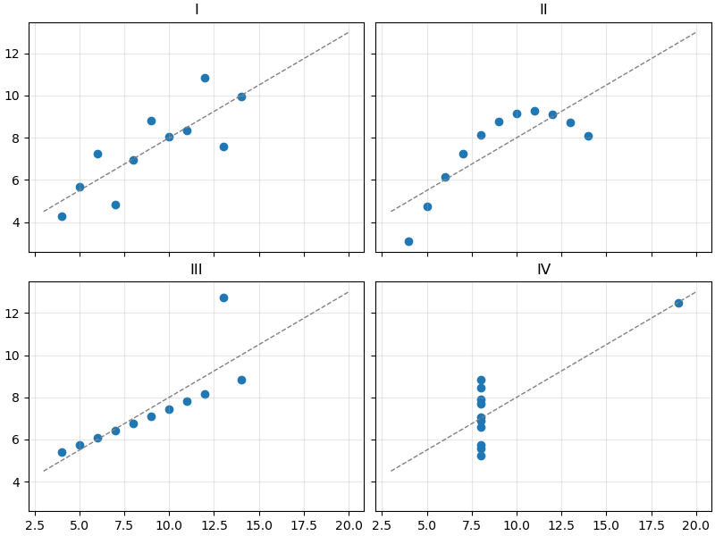

- I — звичайна лінійна залежність із шумом;
- II — крива, а не пряма;
- III — ідеальна пряма, яку зіпсував один викид;
- IV — усі точки в одному стовпчику, а «кореляцію» створює одна точка.

Висновок: **перш ніж рахувати — подивіться на дані**. Графік швидко показує тренди, викиди, помилки в даних і форму розподілу.

**matplotlib** — базова бібліотека візуалізації в Python. На ній побудовані pandas (`df.plot()`), seaborn та багато інших інструментів. Вона вміє малювати лінійні графіки, діаграми, гістограми, теплові карти, 3D — і зберігати результат у PNG, SVG, PDF.

## Встановлення та імпорт

```bash
pip install matplotlib numpy
```

Загальноприйнятий імпорт:

```python
import matplotlib.pyplot as plt
import numpy as np
```

`matplotlib.pyplot` — модуль із функціями для створення графіків. Скорочення `plt` таке ж стандартне, як `np` для NumPy.

Перевірка версії:

```python
import matplotlib

print(matplotlib.__version__)
```

```text
3.10.1
```

## Перший графік

```python
import matplotlib.pyplot as plt

hours = [0, 3, 6, 9, 12, 15, 18, 21]
temps = [4, 3, 5, 11, 15, 16, 12, 7]

plt.plot(hours, temps)
plt.show()
```

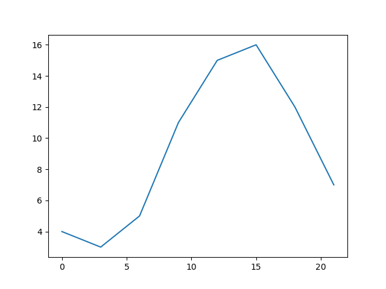

- `plt.plot(x, y)` — з'єднує точки `(x[i], y[i])` лініями;
- `plt.show()` — відкриває вікно з графіком. Програма **зупиняється**, поки вікно не закрите.

Якщо передати лише один список, matplotlib візьме як `x` індекси `0, 1, 2, ...`:

```python
import matplotlib.pyplot as plt

plt.plot([4, 3, 5, 11, 15, 16, 12, 7])
plt.show()
```

matplotlib приймає і списки, і масиви NumPy. На практиці дані майже завжди — масиви:

```python
import matplotlib.pyplot as plt
import numpy as np

x = np.linspace(0, 2 * np.pi, 100)
y = np.sin(x)

plt.plot(x, y)
plt.show()
```

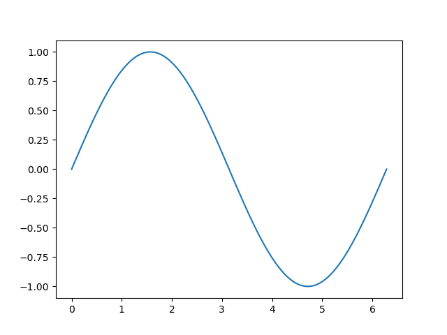

Лінія здається плавною, бо ми взяли 100 точок. Спробуйте `np.linspace(0, 2 * np.pi, 8)` — побачите ламану.

!!! note "Jupyter та IDE"
    У Jupyter Notebook графік показується під клітинкою автоматично, `plt.show()` можна не писати. У звичайному скрипті `.py` без `plt.show()` вікно не з'явиться.

## Анатомія графіка: `Figure`, `Axes`, `Axis`

Кожен графік у matplotlib — це дерево об'єктів:

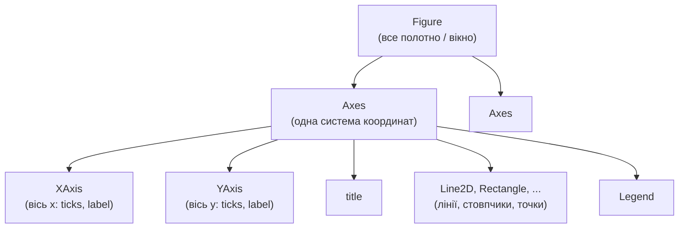

- **`Figure`** — «аркуш паперу» або вікно. Має розмір, фон, може містити кілька графіків.
- **`Axes`** — **один графік**: область із системою координат, у якій малюються дані. Саме в `Axes` є методи `plot`, `bar`, `set_title` тощо.
- **`Axis`** — **одна вісь** (x або y) усередині `Axes`: поділки (ticks), підписи поділок, назва осі.
- **Artist** — загальна назва всього, що видно на фігурі: лінії, текст, прямокутники, легенда.

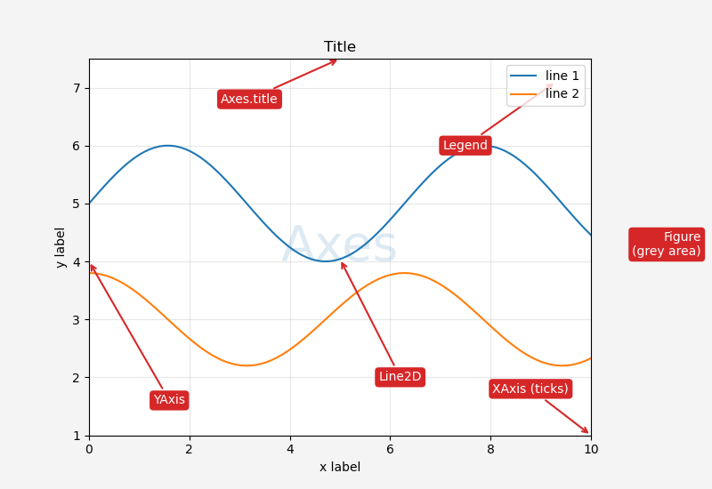

!!! warning "`Axes` ≠ `Axis`"
    Назви схожі, але це різні речі. **Axes** (множина від «axis») — цілий графік із двома осями. **Axis** — одна вісь. Фігура з двома графіками має **два** `Axes` і **чотири** `Axis`.

## Два стилі: pyplot і об'єктно-орієнтований

matplotlib має два способи писати той самий код.

**1. pyplot-стиль (неявний).** Функції `plt.*` самі знаходять «поточну» фігуру та «поточний» `Axes` і малюють на них:

```python
import matplotlib.pyplot as plt

hours = [0, 3, 6, 9, 12, 15, 18, 21]
temps = [4, 3, 5, 11, 15, 16, 12, 7]

plt.plot(hours, temps)
plt.title("Temperature")
plt.xlabel("Hour")
plt.ylabel("Temperature, C")
plt.show()
```

**2. Об'єктно-орієнтований стиль (явний).** Створюємо фігуру та `Axes` явно і викликаємо методи в об'єкта `ax`:

```python
import matplotlib.pyplot as plt

hours = [0, 3, 6, 9, 12, 15, 18, 21]
temps = [4, 3, 5, 11, 15, 16, 12, 7]

fig, ax = plt.subplots()
ax.plot(hours, temps)
ax.set_title("Temperature")
ax.set_xlabel("Hour")
ax.set_ylabel("Temperature, C")
plt.show()
```

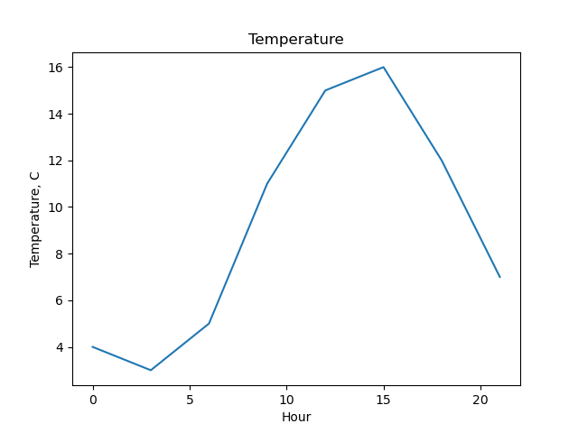

Результат однаковий. `plt.subplots()` повертає кортеж `(Figure, Axes)`.

Відповідність назв:

| pyplot | об'єктний стиль |
|---|---|
| `plt.plot(...)` | `ax.plot(...)` |
| `plt.title("...")` | `ax.set_title("...")` |
| `plt.xlabel("...")` | `ax.set_xlabel("...")` |
| `plt.ylabel("...")` | `ax.set_ylabel("...")` |
| `plt.xlim(0, 10)` | `ax.set_xlim(0, 10)` |
| `plt.legend()` | `ax.legend()` |
| `plt.grid()` | `ax.grid()` |

!!! tip "Який стиль обрати"
    pyplot зручний для швидкого графіка «на одну хвилину». Для всього іншого — кількох графіків на фігурі, функцій, що малюють графік, вбудовування в PySide6 — використовуйте **об'єктний стиль**: завжди зрозуміло, на якому `Axes` ви малюєте. Далі в курсі — лише об'єктний стиль.

## Лінійний графік: кілька ліній, кольори, маркери, легенда

Кожен виклик `ax.plot` додає нову лінію на той самий `Axes`. Кольори призначаються автоматично по черзі.

```python
import matplotlib.pyplot as plt

months = [1, 2, 3, 4, 5, 6, 7, 8, 9, 10, 11, 12]
kyiv = [-3.5, -2.4, 2.1, 9.4, 15.6, 19.0, 20.8, 20.0, 14.8, 8.6, 2.7, -1.6]
lviv = [-2.9, -1.8, 2.3, 8.3, 13.6, 16.6, 18.2, 17.6, 13.2, 8.3, 3.3, -1.1]
odesa = [-0.9, -0.3, 3.4, 9.3, 15.5, 20.0, 22.8, 22.4, 17.3, 11.5, 5.9, 1.3]

fig, ax = plt.subplots()
ax.plot(months, kyiv, label="Kyiv")
ax.plot(months, lviv, label="Lviv")
ax.plot(months, odesa, label="Odesa")
ax.set_title("Average monthly temperature")
ax.set_xlabel("Month")
ax.set_ylabel("Temperature, C")
ax.legend()
plt.show()
```

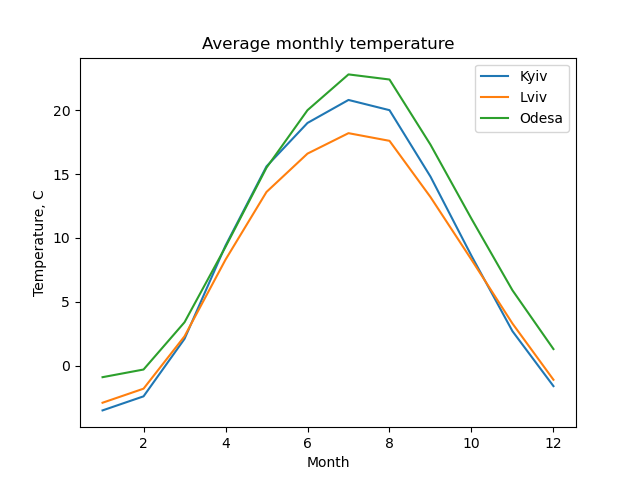

- `label="..."` — підпис лінії для легенди;
- `ax.legend()` — показує легенду. Без `label` легенда буде порожньою (і matplotlib видасть попередження).

### Оформлення лінії

Основні параметри `plot`:

| Параметр | Скорочення | Приклади значень |
|---|---|---|
| `color` | `c` | `"red"`, `"tab:blue"`, `"#1f77b4"`, `"0.5"` (відтінок сірого) |
| `linestyle` | `ls` | `"-"`, `"--"`, `":"`, `"-."`, `"none"` |
| `linewidth` | `lw` | `1`, `2.5` |
| `marker` | — | `"o"`, `"s"`, `"^"`, `"x"`, `"."` |
| `markersize` | `ms` | `4`, `8` |
| `alpha` | — | від `0` (прозоро) до `1` |

```python
import matplotlib.pyplot as plt
import numpy as np

x = np.arange(10)

fig, ax = plt.subplots()
ax.plot(x, x, color="tab:blue", linestyle="-", marker="o", label="solid + o")
ax.plot(x, x + 2, color="tab:orange", linestyle="--", marker="s", label="dashed + s")
ax.plot(x, x + 4, color="tab:green", linestyle=":", linewidth=3, label="dotted, lw=3")
ax.plot(x, x + 6, color="tab:red", linestyle="-.", marker="^", markersize=10, label="dashdot + ^")
ax.plot(x, x + 8, color="0.4", linestyle="none", marker="x", label="markers only")
ax.legend()
plt.show()
```

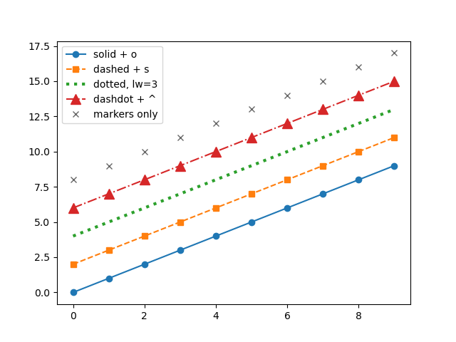

Є й коротка **форматна рядкова** нотація: `"ro--"` = червоний (`r`), маркер-коло (`o`), пунктир (`--`). Її часто можна побачити в прикладах:

```python
import matplotlib.pyplot as plt

fig, ax = plt.subplots()
ax.plot([1, 2, 3, 4], [1, 4, 9, 16], "ro--")
plt.show()
```

Проте іменовані параметри (`color=`, `marker=`, `linestyle=`) читаються краще.

!!! tip "Кольори `tab:*`"
    Палітра за замовчуванням — `tab:blue`, `tab:orange`, `tab:green`, `tab:red`, `tab:purple`, `tab:brown`, `tab:pink`, `tab:gray`, `tab:olive`, `tab:cyan`. Якщо задаєте кольори вручну — беріть з неї: ці кольори добре розрізняються між собою.

## Підписи, сітка, межі осей

```python
import matplotlib.pyplot as plt
import numpy as np

x = np.linspace(-2, 2, 200)

fig, ax = plt.subplots()
ax.plot(x, x ** 2, label="x^2")
ax.plot(x, x ** 3, label="x^3")

ax.set_title("Power functions")
ax.set_xlabel("x")
ax.set_ylabel("y")
ax.set_xlim(-2, 2)
ax.set_ylim(-4, 4)
ax.grid(True, alpha=0.3)
ax.axhline(0, color="black", linewidth=0.8)
ax.axvline(0, color="black", linewidth=0.8)
ax.legend(loc="upper left")
plt.show()
```

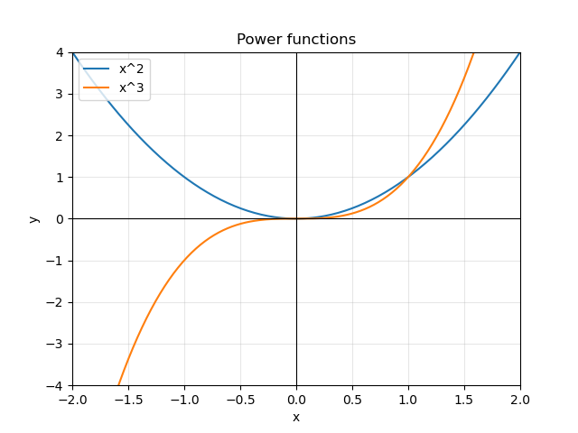

- `set_xlim(a, b)` / `set_ylim(a, b)` — видимий діапазон осі. За замовчуванням matplotlib підбирає його сам під дані;
- `grid(True)` — сітка; `alpha=0.3` робить її блідою, щоб не заважала даним;
- `axhline(y)` / `axvline(x)` — горизонтальна / вертикальна лінія через увесь графік (зручно для нуля, порогу, середнього);
- `legend(loc=...)` — позиція легенди: `"upper left"`, `"lower right"`, `"center"`, `"best"` (за замовчуванням).

### Усе одним викликом: `ax.set`

Кілька налаштувань можна задати одним викликом — імена параметрів збігаються з методами без `set_`:

```python
import matplotlib.pyplot as plt

fig, ax = plt.subplots()
ax.plot([1, 2, 3, 4], [10, 20, 15, 25])
ax.set(title="Sales", xlabel="Quarter", ylabel="Units", ylim=(0, 30))
plt.show()
```

### Поділки осей

```python
import matplotlib.pyplot as plt

months = [1, 2, 3, 4, 5, 6, 7, 8, 9, 10, 11, 12]
names = ["Jan", "Feb", "Mar", "Apr", "May", "Jun",
         "Jul", "Aug", "Sep", "Oct", "Nov", "Dec"]
kyiv = [-3.5, -2.4, 2.1, 9.4, 15.6, 19.0, 20.8, 20.0, 14.8, 8.6, 2.7, -1.6]

fig, ax = plt.subplots()
ax.plot(months, kyiv, marker="o")
ax.set_xticks(months)
ax.set_xticklabels(names)
ax.set_ylabel("Temperature, C")
ax.grid(True, alpha=0.3)
plt.show()
```

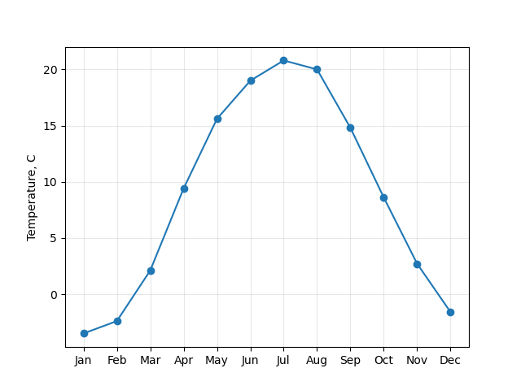

`set_xticks` задає, **де** стоять поділки, `set_xticklabels` — **що** на них написано. Кількість має збігатися.

## Діаграма розсіювання: `scatter`

`scatter` малює окремі точки без ліній. Використовується, щоб побачити **зв'язок двох величин**.

```python
import matplotlib.pyplot as plt
import numpy as np

rng = np.random.default_rng(42)

# години підготовки та бал за тест
hours = rng.uniform(0, 10, size=50)
score = 40 + 5 * hours + rng.normal(0, 6, size=50)

fig, ax = plt.subplots()
ax.scatter(hours, score)
ax.set(title="Study hours vs score", xlabel="Hours", ylabel="Score")
ax.grid(True, alpha=0.3)
plt.show()
```

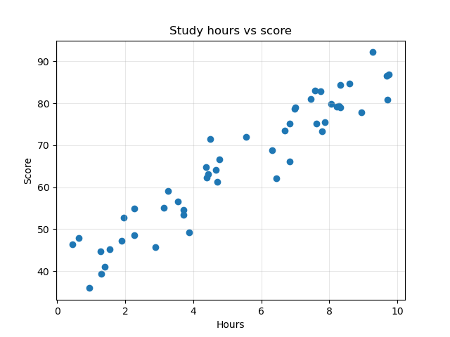

Хмара точок іде вгору — чим більше годин, тим вищий бал (додатна кореляція).

На відміну від `plot`, у `scatter` розмір `s` і колір `c` можна задати **окремо для кожної точки** — масивом:

```python
import matplotlib.pyplot as plt
import numpy as np

rng = np.random.default_rng(42)

hours = rng.uniform(0, 10, size=50)
score = 40 + 5 * hours + rng.normal(0, 6, size=50)
passed = score >= 60

fig, ax = plt.subplots()
ax.scatter(hours[passed], score[passed], color="tab:green", label="passed")
ax.scatter(hours[~passed], score[~passed], color="tab:red", marker="x", label="failed")
ax.axhline(60, color="0.5", linestyle="--")
ax.set(title="Study hours vs score", xlabel="Hours", ylabel="Score")
ax.legend()
plt.show()
```

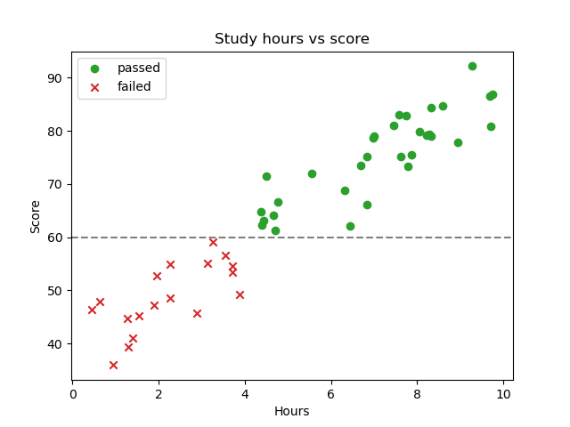

Тут працює булева індексація з лекції 27: `hours[passed]` — лише ті, хто склав. Групи відрізняються не тільки кольором, а й формою маркера — так графік читається і на чорно-білому друку.

## Стовпчикова діаграма: `bar` і `barh`

`bar` порівнює значення між **категоріями**.

```python
import matplotlib.pyplot as plt

languages = ["Python", "JavaScript", "Java", "C#", "C++"]
students = [42, 30, 18, 12, 9]

fig, ax = plt.subplots()
ax.bar(languages, students, color="tab:blue")
ax.set(title="Favourite language", ylabel="Students")
plt.show()
```

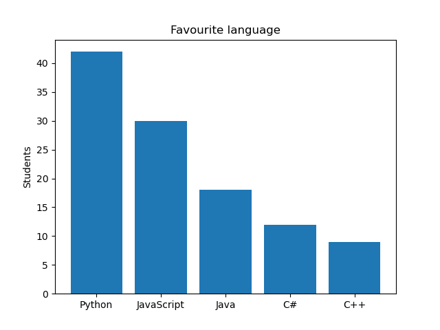

- перший аргумент — підписи категорій (рядки) або позиції `x`;
- другий — висота стовпчиків.

Значення над стовпчиками додає `ax.bar_label`:

```python
import matplotlib.pyplot as plt

languages = ["Python", "JavaScript", "Java", "C#", "C++"]
students = [42, 30, 18, 12, 9]

fig, ax = plt.subplots()
bars = ax.bar(languages, students, color="tab:blue")
ax.bar_label(bars)
ax.set(title="Favourite language", ylabel="Students")
plt.show()
```

Коли підписів багато або вони довгі, зручніша **горизонтальна** діаграма `barh`:

```python
import matplotlib.pyplot as plt

languages = ["Python", "JavaScript", "Java", "C#", "C++", "Go", "Rust", "Kotlin"]
students = [42, 30, 18, 12, 9, 7, 5, 4]

fig, ax = plt.subplots()
bars = ax.barh(languages, students, color="tab:blue")
ax.bar_label(bars, padding=3)
ax.invert_yaxis()
ax.set(title="Favourite language", xlabel="Students")
plt.show()
```

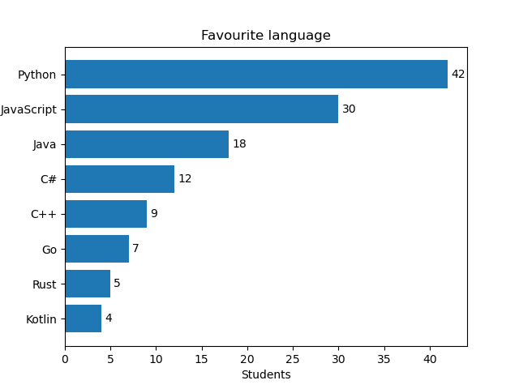

`invert_yaxis()` ставить перший елемент угорі — інакше `barh` малює знизу вгору, і найпопулярніша мова опиниться внизу.

!!! warning "Вісь стовпчиків починається з нуля"
    Довжина стовпчика — це і є значення. Якщо обрізати вісь (`set_ylim(40, 45)`), різниця 42 проти 41 виглядатиме як «удвічі більше». Для `bar` не змінюйте нижню межу осі значень.

## Гістограма: `hist`

`hist` показує **розподіл** однієї величини: ділить діапазон на інтервали (bins) і малює, скільки значень потрапило в кожен. Це графічна версія `np.histogram` з лекції 30.

```python
import matplotlib.pyplot as plt
import numpy as np

rng = np.random.default_rng(7)
heights = rng.normal(175, 7, size=1000)

fig, ax = plt.subplots()
ax.hist(heights, bins=30, color="tab:blue", edgecolor="white")
ax.axvline(heights.mean(), color="tab:red", linestyle="--", label="mean")
ax.set(title="Height of 1000 people", xlabel="Height, cm", ylabel="Count")
ax.legend()
plt.show()
```

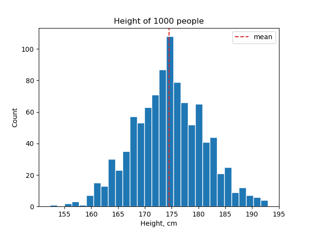

- `bins` — кількість інтервалів (або масив меж). Замало — втрачається форма, забагато — «гребінка» з шуму;
- `edgecolor="white"` — тонка світла межа між стовпчиками.

!!! note "`bar` чи `hist`?"
    `bar` — готові значення для **категорій** (мова → кількість студентів). `hist` — **сирі числа**, які треба спершу розкласти по інтервалах (1000 значень зросту). Стовпчики гістограми стоять впритул, бо інтервали неперервні.

`hist` повертає ті самі дані, що й `np.histogram`:

```python
import matplotlib.pyplot as plt
import numpy as np

rng = np.random.default_rng(7)
heights = rng.normal(175, 7, size=1000)

fig, ax = plt.subplots()
counts, edges, patches = ax.hist(heights, bins=5)
print(counts)
print(edges.round(1))
plt.show()
```

```text
[ 14. 173. 461. 289.  63.]
[152.2 160.4 168.5 176.7 184.8 193. ]
```

`counts` — кількість значень у кожному з 5 інтервалів, `edges` — 6 меж інтервалів.

## Кілька графіків на одній фігурі: `subplots`

`plt.subplots(nrows, ncols)` створює сітку `Axes`. Тоді `axes` — **масив NumPy** з об'єктами `Axes`:

```python
import matplotlib.pyplot as plt
import numpy as np

x = np.linspace(0, 2 * np.pi, 100)

fig, axes = plt.subplots(2, 2)
print(type(axes), axes.shape)

axes[0, 0].plot(x, np.sin(x))
axes[0, 0].set_title("sin")

axes[0, 1].plot(x, np.cos(x), color="tab:orange")
axes[0, 1].set_title("cos")

axes[1, 0].plot(x, x ** 2, color="tab:green")
axes[1, 0].set_title("x^2")

axes[1, 1].plot(x, np.sqrt(x), color="tab:red")
axes[1, 1].set_title("sqrt(x)")

fig.suptitle("Four functions")
fig.tight_layout()
plt.show()
```

```text
<class 'numpy.ndarray'> (2, 2)
```

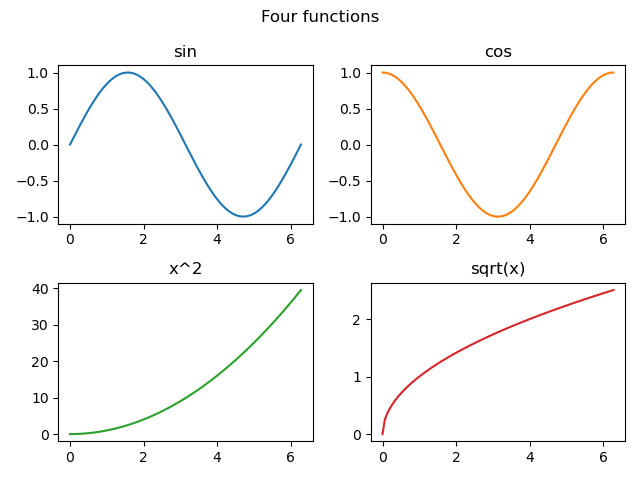

- `axes[row, col]` — звичайна індексація двовимірного масиву;
- `fig.suptitle` — заголовок усієї фігури (на відміну від `ax.set_title` — заголовка одного графіка);
- `fig.tight_layout()` — розсуває графіки, щоб підписи не накладалися.

Форма `axes` залежить від аргументів:

| Виклик | Що повертається в `axes` |
|---|---|
| `plt.subplots()` | один об'єкт `Axes` |
| `plt.subplots(1, 3)` | масив форми `(3,)` |
| `plt.subplots(3, 1)` | масив форми `(3,)` |
| `plt.subplots(2, 3)` | масив форми `(2, 3)` |

Для однакової обробки всіх графіків у циклі зручно «сплющити» масив через `axes.flat`:

```python
import matplotlib.pyplot as plt
import numpy as np

rng = np.random.default_rng(1)
titles = ["uniform", "normal", "exponential", "dice"]
data = [
    rng.uniform(0, 1, size=1000),
    rng.normal(0, 1, size=1000),
    rng.exponential(1, size=1000),
    rng.integers(1, 7, size=1000),
]

fig, axes = plt.subplots(2, 2, figsize=(8, 6))
for ax, title, values in zip(axes.flat, titles, data):
    ax.hist(values, bins=20, edgecolor="white")
    ax.set_title(title)
fig.tight_layout()
plt.show()
```

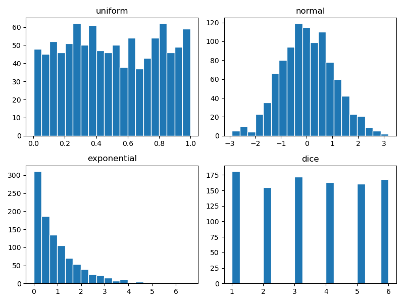

### Спільні осі: `sharex`, `sharey`

Щоб порівнювати графіки, в них має бути **однаковий масштаб**. `sharey=True` робить вісь y спільною:

```python
import matplotlib.pyplot as plt

months = [1, 2, 3, 4, 5, 6, 7, 8, 9, 10, 11, 12]
kyiv = [-3.5, -2.4, 2.1, 9.4, 15.6, 19.0, 20.8, 20.0, 14.8, 8.6, 2.7, -1.6]
odesa = [-0.9, -0.3, 3.4, 9.3, 15.5, 20.0, 22.8, 22.4, 17.3, 11.5, 5.9, 1.3]

fig, (ax1, ax2) = plt.subplots(1, 2, sharey=True, figsize=(9, 4))
ax1.bar(months, kyiv, color="tab:blue")
ax1.set_title("Kyiv")
ax2.bar(months, odesa, color="tab:orange")
ax2.set_title("Odesa")
ax1.set_ylabel("Temperature, C")
fig.tight_layout()
plt.show()
```

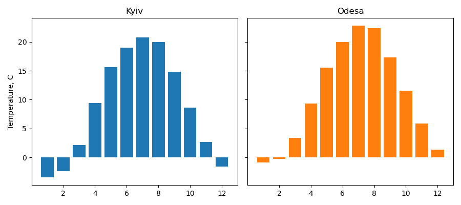

Зверніть увагу на розпакування `fig, (ax1, ax2) = ...` — масив із двох `Axes` одразу розкладається на дві змінні.

## Розмір фігури та компонування

`figsize=(width, height)` — розмір фігури **в дюймах**. За замовчуванням `(6.4, 4.8)`.

```python
import matplotlib.pyplot as plt

fig, ax = plt.subplots(figsize=(10, 3))
ax.plot([1, 2, 3, 4, 5], [3, 1, 4, 1, 5])
plt.show()
```

Розмір у пікселях = дюйми × `dpi` (точок на дюйм). При `dpi=100` фігура `(10, 3)` — це 1000×300 пікселів.

Замість `fig.tight_layout()` можна одразу створити фігуру з автоматичним компонуванням:

```python
import matplotlib.pyplot as plt

fig, axes = plt.subplots(2, 2, layout="constrained")
for i, ax in enumerate(axes.flat):
    ax.plot([0, 1], [0, i])
    ax.set_title(f"Plot {i}")
    ax.set_xlabel("x")
plt.show()
```

`layout="constrained"` — сучасніший механізм: він стежить за підписами, заголовками та легендами під час кожного перемальовування (наприклад, коли змінюєте розмір вікна).

## Збереження у файл: `savefig`

```python
import matplotlib.pyplot as plt
import numpy as np

x = np.linspace(0, 10, 200)

fig, ax = plt.subplots(figsize=(8, 4))
ax.plot(x, np.sin(x) * np.exp(-x / 5))
ax.set(title="Damped oscillation", xlabel="t, s", ylabel="Amplitude")
ax.grid(True, alpha=0.3)

fig.savefig("damped.png", dpi=150, bbox_inches="tight")
fig.savefig("damped.svg")
print("saved")
```

```text
saved
```

- формат визначається розширенням: `.png`, `.jpg`, `.svg`, `.pdf`;
- `dpi` — роздільна здатність растрового файлу. Для звіту достатньо 150, для друку — 300;
- `bbox_inches="tight"` — обрізає зайві білі поля навколо графіка;
- **SVG** і **PDF** — векторні: масштабуються без втрати якості, зручні для документів.

!!! warning "`savefig` — до `show`"
    Після того як вікно `plt.show()` закрите, фігура знищується. `savefig` після `show` збереже **порожню** картинку. Правильний порядок: спершу `savefig`, потім `show`.

Якщо графік потрібен лише у файлі (скрипт на сервері, генерація звіту), `show` не викликають. Щоб не накопичувати фігури в пам'яті в циклі, після збереження фігуру закривають:

```python
import matplotlib.pyplot as plt
import numpy as np

rng = np.random.default_rng(0)

for i in range(3):
    fig, ax = plt.subplots()
    ax.hist(rng.normal(0, 1, size=500), bins=20)
    fig.savefig(f"hist_{i}.png")
    plt.close(fig)

print("done")
```

```text
done
```

## Приклад: аналіз оцінок групи

Повернемося до симуляції оцінок з лекції 30 і покажемо результат на одній фігурі з чотирма графіками.

```python
import matplotlib.pyplot as plt
import numpy as np

rng = np.random.default_rng(42)

subjects = ["math", "physics", "python", "english"]
means = np.array([68, 65, 78, 74])
stds = np.array([12, 13, 10, 9])

# 30 студентів x 4 предмети
scores = rng.normal(loc=means, scale=stds, size=(30, 4))
scores = np.clip(np.round(scores), 0, 100).astype(int)
avg = scores.mean(axis=1)

fig, axes = plt.subplots(2, 2, figsize=(10, 7), layout="constrained")

# 1. середній бал по предметах
ax = axes[0, 0]
bars = ax.bar(subjects, scores.mean(axis=0), color="tab:blue")
ax.bar_label(bars, fmt="%.1f")
ax.set(title="Mean score by subject", ylabel="Score", ylim=(0, 100))

# 2. розподіл середнього балу студентів
ax = axes[0, 1]
ax.hist(avg, bins=10, color="tab:blue", edgecolor="white")
ax.axvline(60, color="tab:red", linestyle="--", label="pass threshold")
ax.set(title="Student average", xlabel="Average score", ylabel="Students", xlim=(40, 100))
ax.legend()

# 3. зв'язок математики та фізики
ax = axes[1, 0]
ax.scatter(scores[:, 0], scores[:, 1], color="tab:blue")
ax.set(title="Math vs physics", xlabel="Math", ylabel="Physics")
ax.grid(True, alpha=0.3)

# 4. бали студентів, відсортовані за середнім
ax = axes[1, 1]
order = np.argsort(avg)[::-1]
ax.plot(np.arange(1, 31), avg[order], marker="o", markersize=4)
ax.axhline(60, color="tab:red", linestyle="--")
ax.set(title="Ranking", xlabel="Place", ylabel="Average score", ylim=(40, 100))
ax.grid(True, alpha=0.3)

fig.suptitle("Group KI-31: exam results")
fig.savefig("grades_report.png", dpi=150)
plt.show()
```

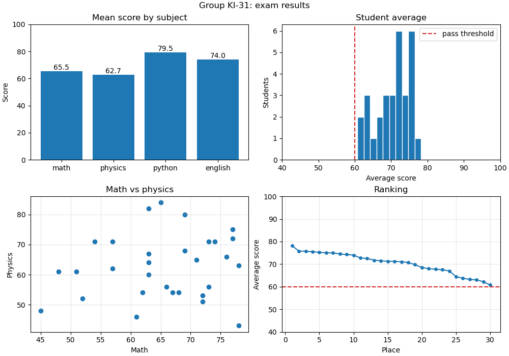

Що тут відбувається:

- вся обробка даних — NumPy (`mean(axis=...)`, `argsort`, булеві маски), matplotlib отримує вже готові масиви;
- кожен з 4 графіків відповідає на **одне питання**: який предмет найважчий? скільки «на межі»? чи пов'язані предмети? хто лідер і хто відстає?
- `ylim=(0, 100)` на стовпчиковій діаграмі — чесна шкала від нуля;
- `np.argsort(avg)[::-1]` — індекси студентів від найкращого до найгіршого.

## Типові помилки

**Немає `plt.show()`.** Скрипт завершується, вікно не з'являється. У `.py` файлі `show` обов'язковий (якщо графік не зберігається у файл).

**`savefig` після `show`.** Зберігається порожня картинка. Спершу `savefig`, потім `show`.

**Плутанина `Axes` і `Axis`.** `Axes` — графік, `Axis` — вісь. Методи для малювання — в `Axes`.

**`ax.title("...")`.** У `Axes` немає методу `title` — лише `ax.set_title("...")`. Так само `set_xlabel`, `set_ylabel`, `set_xlim`. `plt.title(...)` без `set_` — це pyplot-стиль.

**`axes.plot(...)` для сітки графіків.** Якщо `fig, axes = plt.subplots(2, 2)`, то `axes` — масив, а не `Axes`. Потрібно `axes[0, 0].plot(...)`.

**`axes[0, 0]` для одного рядка.** `plt.subplots(1, 3)` повертає одновимірний масив: `axes[0]`, `axes[1]`, `axes[2]`. `axes[0, 0]` дасть `IndexError`.

**Змішування стилів.** `plt.title(...)` після `fig, axes = plt.subplots(2, 2)` підпише лише останній створений `Axes`, а не той, який ви мали на увазі. В об'єктному стилі — лише методи `ax.*`.

**`legend()` без `label`.** Легенда порожня, в консолі попередження `No artists with labels found to put in legend`.

**Різна довжина `x` і `y`.** `ValueError: x and y must have same first dimension`. Перевіряйте `shape` масивів.

**Графік без підписів.** Графік без назви осей і одиниць вимірювання — це просто лінія. Завжди: заголовок, підписи осей з одиницями, легенда, якщо ліній кілька.

**`bar` з обрізаною віссю.** Стовпчикова діаграма з `ylim`, що не починається з нуля, спотворює пропорції.

**Фігури в циклі без `close`.** Сотні фігур, створених у циклі і збережених у файли, лишаються в пам'яті. `plt.close(fig)` після `savefig`.

## Підсумок

- **matplotlib** — базова бібліотека графіків у Python; імпорт `import matplotlib.pyplot as plt`.
- **`Figure`** — полотно; **`Axes`** — один графік з осями; **`Axis`** — одна вісь.
- **`fig, ax = plt.subplots()`** — стандартний початок; далі методи `ax.*` (об'єктний стиль).
- **`ax.plot`** — лінії; параметри `color`, `linestyle`, `linewidth`, `marker`, `label`.
- **`ax.scatter`** — точки, зв'язок двох величин.
- **`ax.bar` / `ax.barh`** — порівняння категорій; `ax.bar_label` — значення над стовпчиками.
- **`ax.hist`** — розподіл однієї величини; параметр `bins`.
- **`set_title`**, **`set_xlabel`**, **`set_ylabel`**, **`set_xlim`**, **`set_ylim`**, **`set_xticks`** або все разом через **`ax.set(...)`**.
- **`ax.legend()`**, **`ax.grid()`**, **`ax.axhline()`** / **`ax.axvline()`**.
- **`plt.subplots(nrows, ncols)`** — сітка графіків; `axes` — масив NumPy; `sharex` / `sharey` — спільний масштаб.
- **`figsize`** — розмір у дюймах; **`layout="constrained"`** або **`fig.tight_layout()`** — компонування без накладань.
- **`fig.savefig("file.png", dpi=150, bbox_inches="tight")`** — збереження; до `plt.show()`.

## Корисні посилання

- [matplotlib: Quick start guide](https://matplotlib.org/stable/users/explain/quick_start.html)
- [Anatomy of a figure](https://matplotlib.org/stable/gallery/showcase/anatomy.html)
- [`Axes.plot`](https://matplotlib.org/stable/api/_as_gen/matplotlib.axes.Axes.plot.html)
- [`pyplot.subplots`](https://matplotlib.org/stable/api/_as_gen/matplotlib.pyplot.subplots.html)
- [Галерея прикладів matplotlib](https://matplotlib.org/stable/gallery/index.html)
- [Квартет Енскомба](https://uk.wikipedia.org/wiki/%D0%9A%D0%B2%D0%B0%D1%80%D1%82%D0%B5%D1%82_%D0%95%D0%BD%D1%81%D0%BA%D0%BE%D0%BC%D0%B1%D0%B0)
