# 37. (Л) Лінійні графіки у matplotlib. Налаштування осей, легенди, стилі

## Зміст лекції

1. Коли потрібен лінійний графік
2. Підготовка даних: порядок `x`, пропуски
3. Ступінчастий графік: `step`
4. Заливка між лініями: `fill_between`
5. Межі осей і відступи
6. Масштаб осі: лінійний і логарифмічний
7. Поділки: локатори
8. Підписи поділок: форматери
9. Дати на осі x
10. Рамка графіка: `spines`
11. Дві осі y: `twinx` і чому краще без неї
12. Легенда: розташування
13. Легенда: що і в якому порядку показувати
14. Спільна легенда для кількох графіків
15. Підписи замість легенди та анотації
16. Стилі: `plt.style`
17. `rcParams`: глобальні налаштування
18. Цикл кольорів і стилів ліній
19. Власний файл стилю
20. Приклад: погода за рік
21. Типові помилки
22. Підсумок

## Коли потрібен лінійний графік

У лекції 35 ми вже будували лінії через `ax.plot`. Тепер розберемося, **коли** лінія доречна і як довести графік до стану, коли його можна вставити у звіт.

Лінія з'єднує сусідні точки. Тим самим вона «стверджує», що між точками є проміжні значення і що порядок точок має сенс. Тому лінійний графік підходить, коли `x`:

- **час** — температура за день, курс валют, кількість користувачів за місяцями;
- **неперервна величина** — функція `y = f(x)`, залежність швидкості від тиску.

Лінія **не** підходить для категорій: мови програмування, міста, предмети. Між «Python» і «Java» немає «проміжних» значень — для категорій беремо `bar`.

| Дані | Графік |
|---|---|
| значення в часі | `plot` |
| функція `y = f(x)` | `plot` |
| значення по категоріях | `bar` / `barh` |
| зв'язок двох величин (кожна точка — окремий об'єкт) | `scatter` |
| розподіл однієї величини | `hist` |

## Підготовка даних: порядок `x`, пропуски

### Точки мають бути відсортовані за `x`

`plot` з'єднує точки **в тому порядку, в якому вони в масиві**, а не за зростанням `x`. Якщо дані перемішані, вийде «павутиння»:

```python
import matplotlib.pyplot as plt
import numpy as np

rng = np.random.default_rng(3)
x = rng.uniform(0, 10, size=40)
y = np.sin(x)

fig, (ax1, ax2) = plt.subplots(1, 2, figsize=(9, 3.5), layout="constrained")

ax1.plot(x, y, marker="o", markersize=3)
ax1.set_title("Unsorted x")

order = np.argsort(x)
ax2.plot(x[order], y[order], marker="o", markersize=3)
ax2.set_title("Sorted x")

plt.show()
```

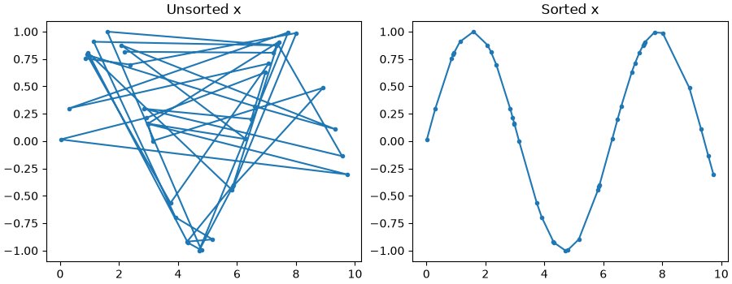

`np.argsort(x)` повертає індекси, які впорядковують `x`; тими самими індексами переставляємо `y`, щоб пари `(x, y)` не розірвались. У pandas те саме робить `df.sort_values("x")`.

### Пропуски розривають лінію

Якщо в даних є `np.nan`, matplotlib **не малює** відрізки до і після цієї точки. Це корисно: розрив на графіку чесно показує, що даних немає.

```python
import matplotlib.pyplot as plt
import numpy as np

hours = np.arange(24)
temps = np.array([5, 4, 4, 3, 3, 3, 4, 6, 8, 10, 12, 13,
                  14, 15, 15, 14, 13, 11, 9, 8, 7, 6, 6, 5], dtype=float)

# датчик не працював з 9:00 до 12:00
temps[9:13] = np.nan

fig, ax = plt.subplots(figsize=(8, 3.5))
ax.plot(hours, temps, marker="o")
ax.set(title="Sensor data with a gap", xlabel="Hour", ylabel="Temperature, C")
ax.grid(True, alpha=0.3)
plt.show()
```

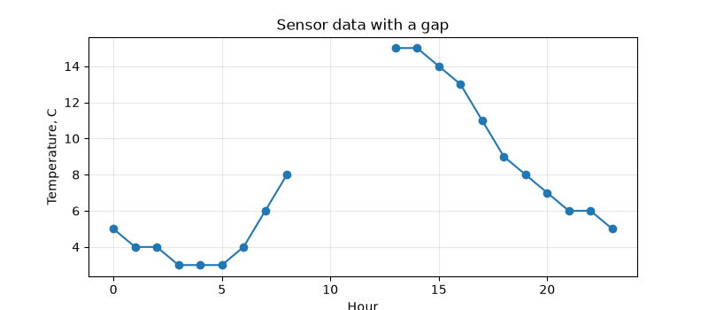

!!! warning "Не заповнюйте пропуски нулями"
    `temps[9:13] = 0` намалює падіння температури до нуля посеред дня — цього не було. Пропуск — це `np.nan` (у pandas — `NaN`, лекція 32). Заповнювати пропуски (`fillna`, інтерполяція) можна лише свідомо і з поясненням на графіку.

## Ступінчастий графік: `step`

Деякі величини змінюються **стрибком** і тримаються до наступної зміни: тариф, ціна, кількість працівників, стан пристрою. Звичайна лінія між такими точками бреше — вона показує плавний перехід, якого не було.

```python
import matplotlib.pyplot as plt

# місяць, з якого діє тариф
months = [1, 4, 6, 10, 12]
price = [2.64, 2.64, 4.32, 4.32, 4.32]

fig, (ax1, ax2) = plt.subplots(1, 2, figsize=(9, 3.5), sharey=True, layout="constrained")

ax1.plot(months, price, marker="o")
ax1.set_title("plot: misleading slope")

ax2.step(months, price, where="post", marker="o")
ax2.set_title("step: price holds until change")

for ax in (ax1, ax2):
    ax.set_xlabel("Month")
    ax.grid(True, alpha=0.3)
ax1.set_ylabel("Price, UAH/kWh")
plt.show()
```

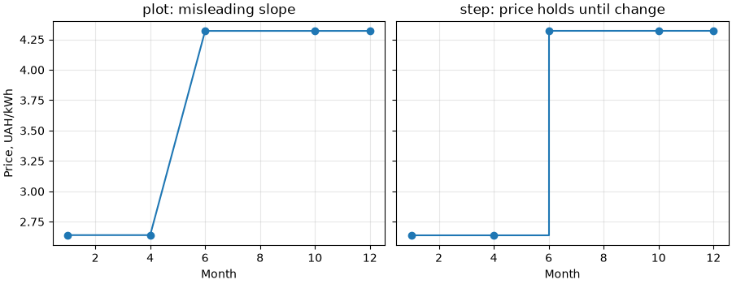

Параметр `where` визначає, де відбувається стрибок:

- `"post"` — значення діє **від** точки `x[i]` до `x[i+1]` (тариф з 6-го місяця);
- `"pre"` — значення діє **до** точки `x[i]`;
- `"mid"` — стрибок посередині між точками.

## Заливка між лініями: `fill_between`

`ax.fill_between(x, y1, y2)` зафарбовує область між двома кривими. Типове використання — **діапазон**: мінімум і максимум, похибка, прогнозний коридор.

```python
import matplotlib.pyplot as plt

months = [1, 2, 3, 4, 5, 6, 7, 8, 9, 10, 11, 12]
t_mean = [-3.5, -2.4, 2.1, 9.4, 15.6, 19.0, 20.8, 20.0, 14.8, 8.6, 2.7, -1.6]
t_min = [-6.1, -5.6, -1.6, 4.8, 10.4, 14.0, 15.9, 15.0, 10.2, 4.8, 0.2, -3.9]
t_max = [-0.9, 0.6, 6.4, 14.6, 20.8, 23.9, 25.9, 25.2, 19.8, 12.8, 5.3, 0.8]

fig, ax = plt.subplots(figsize=(8, 4))
ax.fill_between(months, t_min, t_max, color="tab:blue", alpha=0.2, label="min - max")
ax.plot(months, t_mean, color="tab:blue", marker="o", label="mean")
ax.set(title="Kyiv: monthly temperature", xlabel="Month", ylabel="Temperature, C")
ax.legend(loc="upper left")
ax.grid(True, alpha=0.3)
plt.show()
```

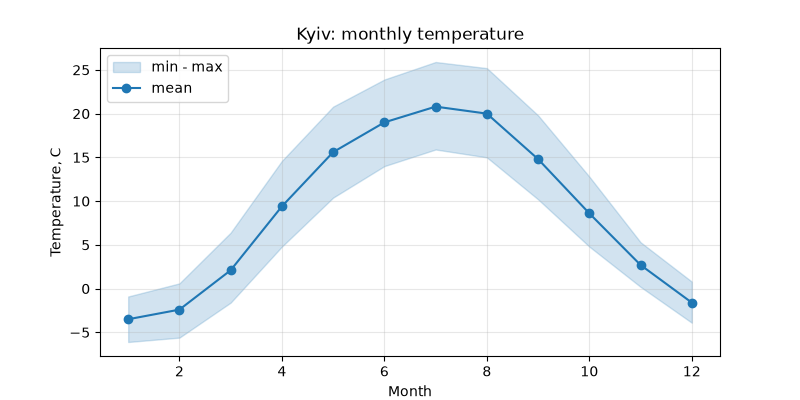

`alpha=0.2` робить заливку напівпрозорою — лінія середнього і сітка лишаються видимими.

### Умовна заливка: `where`

Параметр `where` — булевий масив: заливка лише там, де `True`. Так можна розфарбувати відхилення від норми вгору і вниз різними кольорами:

```python
import matplotlib.pyplot as plt
import numpy as np

rng = np.random.default_rng(11)
days = np.arange(1, 31)
norm = np.full(30, 15.0)
actual = 15 + 3 * np.sin(days / 4) + rng.normal(0, 1, size=30)

fig, ax = plt.subplots(figsize=(8, 4))
ax.plot(days, actual, color="black", linewidth=1.5, label="actual")
ax.plot(days, norm, color="0.5", linestyle="--", label="norm")
ax.fill_between(days, actual, norm, where=actual >= norm,
                color="tab:red", alpha=0.3, interpolate=True, label="warmer")
ax.fill_between(days, actual, norm, where=actual < norm,
                color="tab:blue", alpha=0.3, interpolate=True, label="colder")
ax.set(title="Deviation from norm", xlabel="Day", ylabel="Temperature, C")
ax.legend(loc="lower left", ncols=2)
plt.show()
```

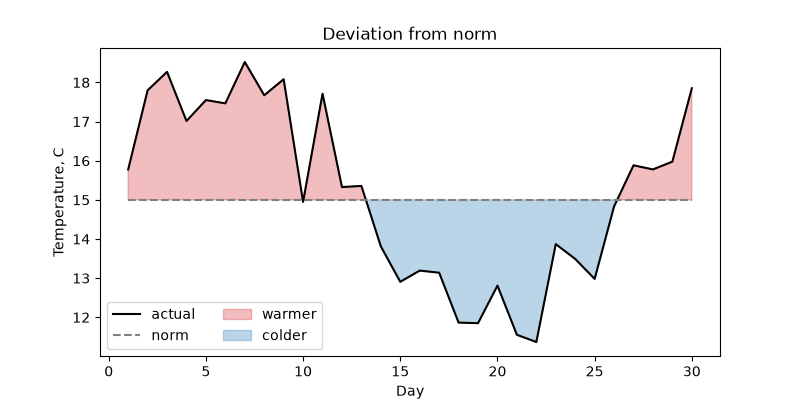

`interpolate=True` знаходить точку перетину ліній між сусідніми днями. Без нього заливка обривається на найближчій точці даних, і біля перетинів лишаються білі трикутники.

## Межі осей і відступи

За замовчуванням matplotlib бере діапазон даних і додає **5% відступу** з кожного боку. Змінити це можна кількома способами:

```python
import matplotlib.pyplot as plt
import numpy as np

x = np.linspace(0, 10, 200)
y = 3 + np.sin(x)

fig, axes = plt.subplots(1, 3, figsize=(11, 3.2), sharey=False, layout="constrained")

axes[0].plot(x, y)
axes[0].set_title("default")

axes[1].plot(x, y)
axes[1].margins(x=0)
axes[1].set_title("margins(x=0)")

axes[2].plot(x, y)
axes[2].margins(x=0)
axes[2].set_ylim(bottom=0)
axes[2].set_title("margins(x=0), ylim(bottom=0)")

plt.show()
```

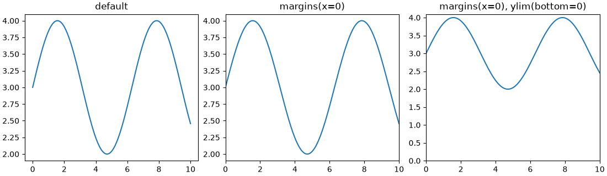

- `ax.margins(x=0)` — лінія починається і закінчується точно на краях графіка. Для часових рядів це зазвичай виглядає охайніше;
- `ax.set_ylim(bottom=0)` — задає **лише одну** межу, другу matplotlib підбирає сам. Так само `top=`, `left=`, `right=`;
- `ax.invert_yaxis()` — перевертає вісь (глибина, місце в рейтингу: 1-ше місце — вгорі).

!!! note "Чи починати вісь y з нуля?"
    Для `bar` — **завжди** (лекція 35). Для лінійного графіка — не обов'язково: лінія показує **зміну**, а не довжину. Температура 18–22 °C на осі від 0 до 25 стане майже прямою. Але якщо читач порівнюватиме абсолютні значення («удвічі більше»), нуль на осі потрібен.

## Масштаб осі: лінійний і логарифмічний

Коли значення ростуть **у рази** (кількість користувачів, поширення вірусу, складність алгоритмів), на звичайній осі ранні дані злипаються біля нуля. Логарифмічна вісь показує не «на скільки», а «у скільки разів» змінилася величина.

```python
import matplotlib.pyplot as plt
import numpy as np

months = np.arange(0, 25)
app_a = 100 * 1.30 ** months   # +30% за місяць
app_b = 2000 * 1.10 ** months  # +10% за місяць

fig, (ax1, ax2) = plt.subplots(1, 2, figsize=(10, 4), layout="constrained")

for ax in (ax1, ax2):
    ax.plot(months, app_a, label="App A (+30%/month)")
    ax.plot(months, app_b, label="App B (+10%/month)")
    ax.set_xlabel("Month")
    ax.set_ylabel("Users")
    ax.grid(True, alpha=0.3)
    ax.legend()

ax1.set_title("Linear scale")
ax2.set_yscale("log")
ax2.set_title("Log scale")
plt.show()
```

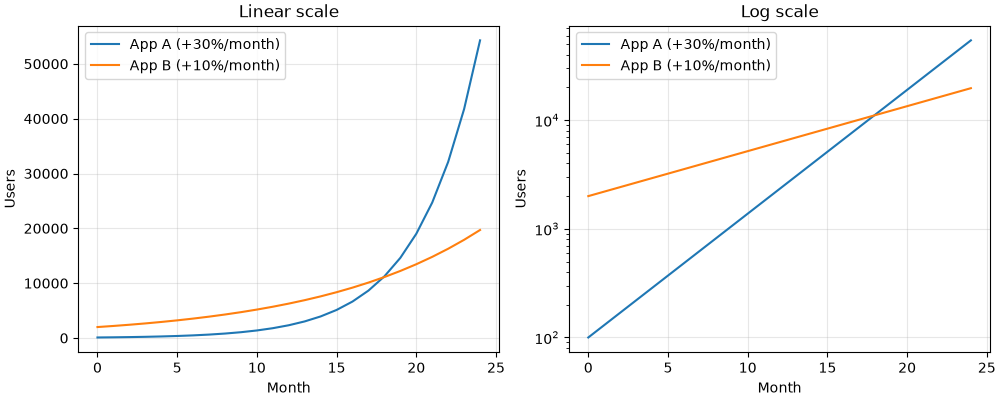

На логарифмічній осі:

- кожна основна поділка — у 10 разів більша за попередню (`10^2`, `10^3`, ...);
- **експоненційне зростання — пряма лінія**, а її нахил — темп зростання. Видно, що A росте швидше (крутіша лінія) і обганяє B приблизно на 17-му місяці;
- на лінійній осі видно лише «A вистрілила наприкінці», перші 12 місяців злиплися.

| Метод | Масштаб |
|---|---|
| `ax.set_yscale("linear")` | звичайний (за замовчуванням) |
| `ax.set_yscale("log")` | логарифмічний; лише додатні значення |
| `ax.set_yscale("symlog")` | логарифмічний з обох боків від нуля; дозволяє від'ємні значення |
| `ax.set_xscale(...)` | те саме для осі x |

!!! warning "Нуль і від'ємні числа на log-осі"
    `log(0)` не існує. Точки з `y <= 0` на логарифмічній осі просто зникають (з попередженням у консолі). Якщо в даних є нулі — `symlog` або окремий графік.

## Поділки: локатори

**Локатор** (locator) вирішує, **де** стоять поділки. У лекції 35 ми задавали їх списком через `set_xticks`. Це зручно для 12 місяців, але незручно, коли діапазон даних змінюється. Модуль `matplotlib.ticker` має локатори, які розставляють поділки за правилом:

```python
import matplotlib.pyplot as plt
import numpy as np
from matplotlib.ticker import AutoMinorLocator, MaxNLocator, MultipleLocator

x = np.linspace(0, 48, 300)
y = 20 + 6 * np.sin(x / 24 * 2 * np.pi - 2)

fig, ax = plt.subplots(figsize=(9, 3.5))
ax.plot(x, y)
ax.margins(x=0)

# основні поділки по x кожні 6 годин, додаткові — кожну годину
ax.xaxis.set_major_locator(MultipleLocator(6))
ax.xaxis.set_minor_locator(MultipleLocator(1))

# по y не більше 5 основних поділок, додаткові — автоматично
ax.yaxis.set_major_locator(MaxNLocator(5))
ax.yaxis.set_minor_locator(AutoMinorLocator())

ax.grid(True, which="major", alpha=0.5)
ax.grid(True, which="minor", alpha=0.15)
ax.set(title="Two days of temperature", xlabel="Hour", ylabel="Temperature, C")
plt.show()
```

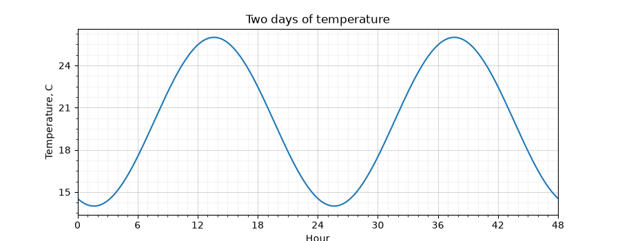

- `ax.xaxis` / `ax.yaxis` — це ті самі об'єкти `Axis` з лекції 35. Налаштування поділок робиться саме на них;
- **major** — основні поділки з підписами, **minor** — дрібні поділки без підписів;
- `grid(which="minor")` — сітка по дрібних поділках; робимо її ще блідішою.

| Локатор | Що робить |
|---|---|
| `MultipleLocator(base)` | поділка кожні `base` одиниць |
| `MaxNLocator(n)` | не більше `n` «круглих» поділок |
| `AutoMinorLocator(n)` | ділить відрізок між основними поділками на `n` частин |
| `FixedLocator([...])` | поділки у заданих точках (те, що робить `set_xticks`) |
| `NullLocator()` | жодної поділки |

### Вигляд поділок: `tick_params`

`ax.tick_params` змінює вигляд поділок і їхніх підписів, не чіпаючи їхнього розташування:

```python
import matplotlib.pyplot as plt

names = ["January", "February", "March", "April", "May", "June",
         "July", "August", "September", "October", "November", "December"]
kyiv = [-3.5, -2.4, 2.1, 9.4, 15.6, 19.0, 20.8, 20.0, 14.8, 8.6, 2.7, -1.6]

fig, ax = plt.subplots(figsize=(8, 4), layout="constrained")
ax.plot(names, kyiv, marker="o")
ax.tick_params(axis="x", labelrotation=45, labelsize=9)
ax.tick_params(axis="both", direction="in", length=4)
ax.set_ylabel("Temperature, C")
plt.show()
```

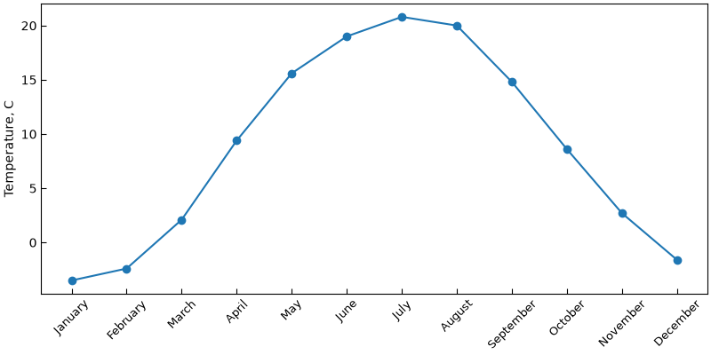

Довгі підписи повертаємо (`labelrotation=45`), щоб вони не налізали один на одного. Зверніть увагу: `plot` прийняв рядки як `x` — matplotlib сам поставив їх на позиції `0, 1, 2, ...`. Для назв місяців це доречно, бо місяці впорядковані.

## Підписи поділок: форматери

**Форматер** (formatter) вирішує, **що** написано на поділці. Число `1500000` на осі краще показати як `1.5M`, частку `0.25` — як `25%`.

```python
import matplotlib.pyplot as plt
import numpy as np
from matplotlib.ticker import FuncFormatter, PercentFormatter, StrMethodFormatter

months = np.arange(1, 13)
revenue = np.array([120, 135, 150, 148, 170, 210, 260, 250, 190, 175, 160, 230]) * 1000
conversion = np.array([2.1, 2.3, 2.2, 2.6, 2.8, 3.1, 3.4, 3.3, 2.9, 2.7, 2.6, 3.2]) / 100
visitors = revenue * 12


def millions(value, pos):
    # pos — номер поділки; тут не потрібен, але matplotlib його передає
    return f"{value / 1e6:.1f}M"


fig, axes = plt.subplots(1, 3, figsize=(12, 3.5), layout="constrained")

axes[0].plot(months, revenue)
axes[0].yaxis.set_major_formatter(StrMethodFormatter("{x:,.0f} UAH"))
axes[0].set_title("Revenue")

axes[1].plot(months, conversion, color="tab:orange")
axes[1].yaxis.set_major_formatter(PercentFormatter(xmax=1, decimals=1))
axes[1].set_title("Conversion")

axes[2].plot(months, visitors, color="tab:green")
axes[2].yaxis.set_major_formatter(FuncFormatter(millions))
axes[2].set_title("Visitors")

for ax in axes:
    ax.set_xlabel("Month")
    ax.grid(True, alpha=0.3)
plt.show()
```

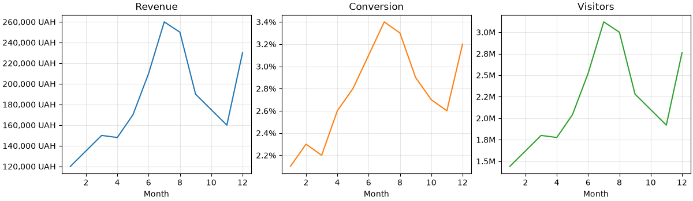

| Форматер | Приклад | Результат |
|---|---|---|
| `StrMethodFormatter("{x:,.0f} UAH")` | `150000` | `150,000 UAH` |
| `PercentFormatter(xmax=1)` | `0.25` | `25%` |
| `PercentFormatter(xmax=100)` | `25` | `25%` |
| `FuncFormatter(func)` | будь-яке | те, що поверне `func(value, pos)` |

У `StrMethodFormatter` значення поділки завжди називається `x` — навіть для осі y. Синтаксис той самий, що в f-рядках: `,` — розділювач тисяч, `.0f` — нуль знаків після коми.

Скорочений запис: у `set_major_formatter` можна передати одразу рядок або функцію — matplotlib сам обгорне їх у `StrMethodFormatter` / `FuncFormatter`:

```python
import matplotlib.pyplot as plt

fig, ax = plt.subplots()
ax.plot([1, 2, 3], [1500, 2500, 4000])
ax.yaxis.set_major_formatter("{x:,.0f} UAH")
ax.xaxis.set_major_formatter(lambda value, pos: f"Q{value:.0f}")
ax.set_xticks([1, 2, 3])
plt.show()
```

## Дати на осі x

Часові ряди зазвичай приходять із pandas із датами в індексі або стовпці (лекції 32 і 34). matplotlib розуміє `datetime` і `pd.Timestamp` напряму — `plot` можна передати стовпець дат як `x`. Проблема лише в підписах: за замовчуванням вони довгі й налазять один на одного.

```python
import matplotlib.dates as mdates
import matplotlib.pyplot as plt
import numpy as np
import pandas as pd

rng = np.random.default_rng(5)
dates = pd.date_range("2025-01-01", "2025-12-31", freq="D")
day = np.arange(len(dates))
temps = 9 - 12 * np.cos(2 * np.pi * (day - 15) / 365) + rng.normal(0, 3, size=len(dates))

fig, (ax1, ax2) = plt.subplots(2, 1, figsize=(9, 6), layout="constrained")

ax1.plot(dates, temps, linewidth=0.8)
ax1.set_title("Default date labels")

ax2.plot(dates, temps, linewidth=0.8)
ax2.xaxis.set_major_locator(mdates.MonthLocator())
ax2.xaxis.set_major_formatter(mdates.ConciseDateFormatter(ax2.xaxis.get_major_locator()))
ax2.set_title("MonthLocator + ConciseDateFormatter")

for ax in (ax1, ax2):
    ax.set_ylabel("Temperature, C")
    ax.margins(x=0)
    ax.grid(True, alpha=0.3)
plt.show()
```

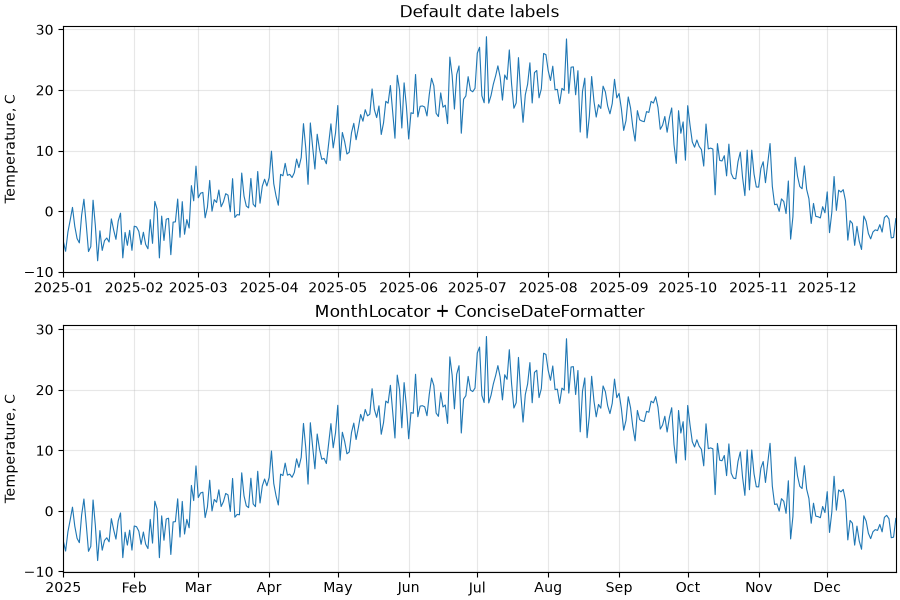

- `matplotlib.dates` (скорочено `mdates`) — локатори й форматери для дат;
- `MonthLocator()` — поділка на початку кожного місяця; є також `DayLocator`, `WeekdayLocator`, `YearLocator`, `HourLocator`;
- `ConciseDateFormatter` — «стислі» підписи: пише лише те, що змінилося (`Feb`, `Mar`, ...), а рік — один раз, у кутку.

Якщо потрібен власний формат, є `mdates.DateFormatter` з кодами `strftime`:

```python
import matplotlib.dates as mdates
import matplotlib.pyplot as plt
import pandas as pd

dates = pd.date_range("2025-03-01", periods=14, freq="D")
visits = [120, 135, 128, 160, 190, 80, 75, 140, 150, 149, 170, 205, 90, 85]

fig, ax = plt.subplots(figsize=(8, 3.5), layout="constrained")
ax.plot(dates, visits, marker="o")
ax.xaxis.set_major_locator(mdates.DayLocator(interval=2))
ax.xaxis.set_major_formatter(mdates.DateFormatter("%d.%m"))
ax.set(title="Site visits", ylabel="Visits")
plt.show()
```

`%d.%m` — день і місяць (`01.03`), `%Y` — рік, `%H:%M` — година і хвилини.

!!! tip "`fig.autofmt_xdate()`"
    Швидкий спосіб «якось виправити» дати, що налазять: `fig.autofmt_xdate()` повертає підписи під кутом і вирівнює їх праворуч. `ConciseDateFormatter` зазвичай дає охайніший результат без повороту.

## Рамка графіка: `spines`

**Spines** — чотири лінії, що утворюють рамку `Axes`: `top`, `bottom`, `left`, `right`. Звертаємося до них як до словника `ax.spines["top"]`.

Верхня і права лінії рамки не несуть інформації. Їх часто прибирають, щоб графік виглядав «легше»:

```python
import matplotlib.pyplot as plt
import numpy as np

x = np.linspace(-2 * np.pi, 2 * np.pi, 300)

fig, (ax1, ax2) = plt.subplots(1, 2, figsize=(10, 3.8), layout="constrained")

# 1. без верхньої та правої рамки
ax1.plot(x, np.sin(x))
ax1.spines[["top", "right"]].set_visible(False)
ax1.set_title("No top/right spines")

# 2. осі через нуль, як у підручнику математики
ax2.plot(x, np.sin(x))
ax2.spines[["top", "right"]].set_visible(False)
ax2.spines["left"].set_position("zero")
ax2.spines["bottom"].set_position("zero")
ax2.set_title("Spines through zero")

plt.show()
```

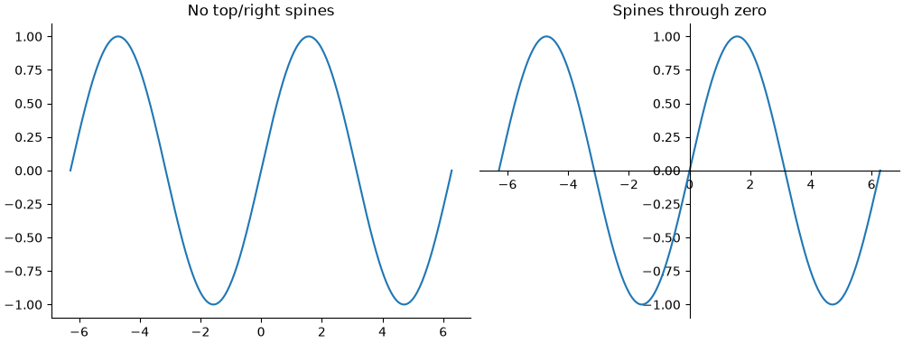

- `ax.spines[["top", "right"]]` — можна вибрати кілька ліній одразу списком;
- `set_position("zero")` — переносить лінію осі в точку `0` іншої осі.

### Однаковий масштаб осей: `set_aspect`

За замовчуванням одиниця по x і одиниця по y мають різну довжину на екрані — графік розтягується під розмір фігури. Для геометрії (коло, траєкторія, карта) це спотворення:

```python
import matplotlib.pyplot as plt
import numpy as np

t = np.linspace(0, 2 * np.pi, 200)

fig, (ax1, ax2) = plt.subplots(1, 2, figsize=(9, 3.5), layout="constrained")
for ax in (ax1, ax2):
    ax.plot(np.cos(t), np.sin(t))
    ax.grid(True, alpha=0.3)

ax1.set_title("default aspect")
ax2.set_aspect("equal")
ax2.set_title("aspect = equal")
plt.show()
```

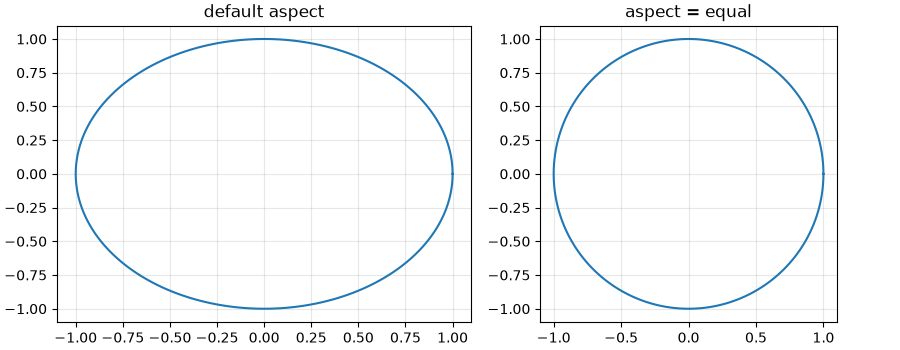

## Дві осі y: `twinx` і чому краще без неї

Іноді хочеться на одному графіку показати дві величини з **різними одиницями**: температуру (°C) і опади (мм). `ax.twinx()` створює другий `Axes` зі спільною віссю x і власною віссю y праворуч:

```python
import matplotlib.pyplot as plt

months = [1, 2, 3, 4, 5, 6, 7, 8, 9, 10, 11, 12]
temps = [-3.5, -2.4, 2.1, 9.4, 15.6, 19.0, 20.8, 20.0, 14.8, 8.6, 2.7, -1.6]
rain = [38, 40, 37, 45, 55, 72, 80, 65, 55, 45, 50, 45]

fig, ax1 = plt.subplots(figsize=(8, 4), layout="constrained")
ax2 = ax1.twinx()

ax2.bar(months, rain, color="tab:blue", alpha=0.3)
ax1.plot(months, temps, color="tab:red", marker="o")

ax1.set_xlabel("Month")
ax1.set_ylabel("Temperature, C", color="tab:red")
ax2.set_ylabel("Precipitation, mm", color="tab:blue")
ax1.set_zorder(ax2.get_zorder() + 1)
ax1.patch.set_visible(False)
plt.show()
```

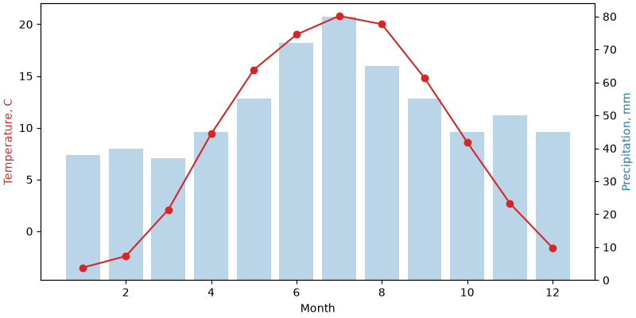

Останні два рядки — технічна деталь: `ax2` створений пізніше і малюється поверх `ax1`. Піднімаємо `ax1` наверх (`zorder`) і робимо його фон прозорим, щоб стовпчики не перекривали лінію.

!!! warning "Дві осі y легко вводять в оману"
    Масштаб кожної осі обирається довільно. Змінивши `ylim` однієї з них, можна зробити так, що лінії «перетинаються», «йдуть разом» або «розходяться» — хоча дані ті самі. Читач також мусить щоразу з'ясовувати, до якої осі належить лінія.

Надійніша альтернатива — **два графіки один під одним зі спільною віссю x** (`sharex=True`, лекція 35):

```python
import matplotlib.pyplot as plt

months = [1, 2, 3, 4, 5, 6, 7, 8, 9, 10, 11, 12]
temps = [-3.5, -2.4, 2.1, 9.4, 15.6, 19.0, 20.8, 20.0, 14.8, 8.6, 2.7, -1.6]
rain = [38, 40, 37, 45, 55, 72, 80, 65, 55, 45, 50, 45]

fig, (ax1, ax2) = plt.subplots(2, 1, figsize=(8, 5), sharex=True,
                               height_ratios=[2, 1], layout="constrained")

ax1.plot(months, temps, color="tab:red", marker="o")
ax1.set_ylabel("Temperature, C")
ax1.grid(True, alpha=0.3)

ax2.bar(months, rain, color="tab:blue")
ax2.set_ylabel("Precipitation, mm")
ax2.set_xlabel("Month")
ax2.set_xticks(months)

fig.suptitle("Kyiv climate")
plt.show()
```

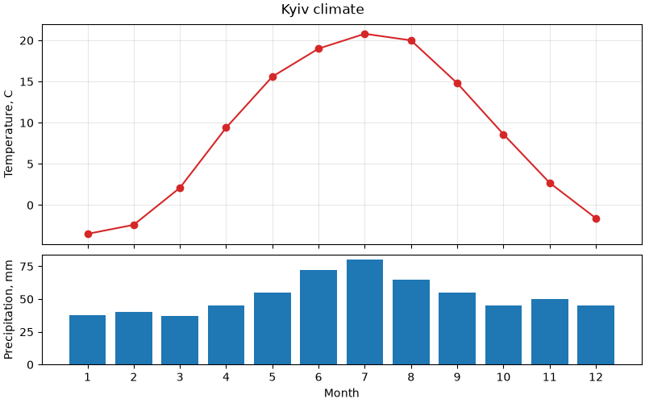

- кожна величина має свою вісь, свою шкалу і підпис — плутанини немає;
- `sharex=True` вирівнює місяці по вертикалі, тож порівнювати їх так само легко;
- `height_ratios=[2, 1]` — верхній графік удвічі вищий за нижній.

## Легенда: розташування

У лекції 35 ми бачили `ax.legend(loc="upper left")`. Можливі значення `loc`:

```text
"upper left"    "upper center"    "upper right"
"center left"   "center"          "center right"
"lower left"    "lower center"    "lower right"
"best" (default)
```

`"best"` шукає місце, де легенда найменше перекриває дані. На великих масивах це повільно, і результат може змінюватися від запуску до запуску при зміні даних — у звітах краще задати `loc` явно.

### Легенда поза графіком: `bbox_to_anchor`

Коли ліній багато, легенда всередині графіка закриває дані. Її можна винести назовні:

```python
import matplotlib.pyplot as plt

months = [1, 2, 3, 4, 5, 6, 7, 8, 9, 10, 11, 12]
cities = {
    "Kyiv": [-3.5, -2.4, 2.1, 9.4, 15.6, 19.0, 20.8, 20.0, 14.8, 8.6, 2.7, -1.6],
    "Lviv": [-2.9, -1.8, 2.3, 8.3, 13.6, 16.6, 18.2, 17.6, 13.2, 8.3, 3.3, -1.1],
    "Odesa": [-0.9, -0.3, 3.4, 9.3, 15.5, 20.0, 22.8, 22.4, 17.3, 11.5, 5.9, 1.3],
    "Kharkiv": [-5.5, -4.9, 0.1, 8.4, 15.2, 18.8, 20.9, 20.0, 14.1, 7.6, 1.2, -3.1],
    "Dnipro": [-3.9, -3.2, 1.8, 10.1, 16.5, 20.2, 22.5, 21.8, 16.0, 9.0, 2.5, -1.8],
    "Uzhhorod": [-1.9, 0.1, 5.2, 11.2, 16.1, 19.4, 21.1, 20.6, 15.8, 10.2, 4.5, -0.3],
}

fig, ax = plt.subplots(figsize=(8, 4), layout="constrained")
for name, temps in cities.items():
    ax.plot(months, temps, label=name)

ax.set(title="Average monthly temperature", xlabel="Month", ylabel="Temperature, C")
ax.legend(loc="upper left", bbox_to_anchor=(1.02, 1), title="City")
plt.show()
```

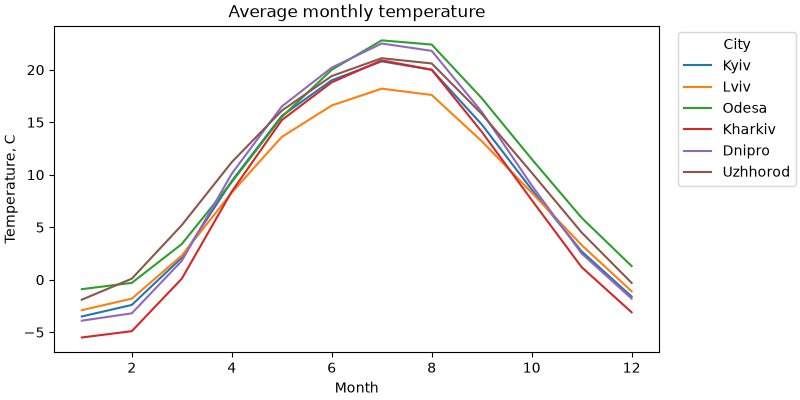

Як читати `bbox_to_anchor=(1.02, 1)` разом з `loc="upper left"`:

- координати задані у **частках `Axes`**: `(0, 0)` — лівий нижній кут графіка, `(1, 1)` — правий верхній;
- `(1.02, 1)` — точка трохи правіше правого верхнього кута;
- `loc="upper left"` — до цієї точки прикріплюється **лівий верхній** кут легенди.

`layout="constrained"` автоматично звужує графік, щоб легенда вмістилася у фігуру. Без нього легенда обріжеться краєм вікна (а `savefig(..., bbox_inches="tight")` її збереже, але розмір картинки зміниться).

Інший поширений варіант — легенда **під** графіком у кілька стовпців (`ncols`):

```python
import matplotlib.pyplot as plt
import numpy as np

x = np.linspace(0, 2 * np.pi, 100)

fig, ax = plt.subplots(figsize=(8, 4), layout="constrained")
for k in range(1, 7):
    ax.plot(x, np.sin(k * x) / k, label=f"sin({k}x)/{k}")

ax.legend(loc="upper center", bbox_to_anchor=(0.5, -0.12), ncols=3, frameon=False)
plt.show()
```

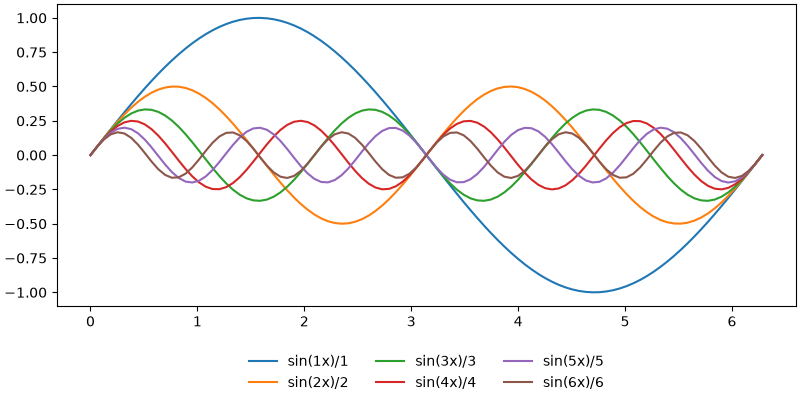

### Основні параметри `legend`

| Параметр | Що робить |
|---|---|
| `loc` | яким кутом / стороною легенда прикріплюється |
| `bbox_to_anchor` | точка прикріплення (у частках `Axes`) |
| `ncols` | кількість стовпців |
| `title` | заголовок легенди |
| `frameon=False` | без рамки |
| `fontsize` | розмір тексту: число або `"small"`, `"large"` |
| `reverse=True` | зворотний порядок елементів |

## Легенда: що і в якому порядку показувати

### Прибрати елемент з легенди

Легенда показує лише об'єкти з `label`. Допоміжні лінії (поріг, нуль, середнє) часто не потребують окремого рядка в легенді — їх просто не підписують. Якщо ж `label` вже є (наприклад, у циклі), matplotlib ігнорує підписи, що **починаються з підкреслення**:

```python
import matplotlib.pyplot as plt
import numpy as np

rng = np.random.default_rng(2)
days = np.arange(1, 31)

fig, ax = plt.subplots(figsize=(8, 4))
for i in range(5):
    # лише перша лінія потрапить у легенду
    label = "simulations" if i == 0 else "_nolegend_"
    ax.plot(days, np.cumsum(rng.normal(0, 1, 30)), color="0.6", linewidth=1, label=label)

ax.plot(days, np.zeros(30), color="tab:red", linewidth=2, label="expected")
ax.axhline(3, color="black", linestyle=":")  # без label — не в легенді
ax.legend(loc="upper left")
plt.show()
```

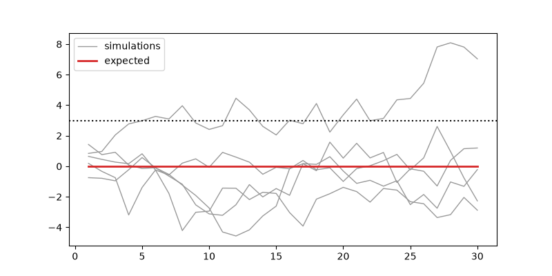

П'ять сірих ліній — це одна група, тому в легенді один рядок `simulations`, а не п'ять однакових.

### Змінити порядок

`ax.get_legend_handles_labels()` повертає списки об'єктів (handles) і їхніх підписів. Їх можна переставити й передати в `legend` явно:

```python
import matplotlib.pyplot as plt

years = [2020, 2021, 2022, 2023, 2024]

fig, ax = plt.subplots()
ax.plot(years, [10, 12, 15, 17, 22], label="Python")
ax.plot(years, [14, 14, 13, 12, 12], label="Java")
ax.plot(years, [8, 9, 11, 13, 15], label="JavaScript")

handles, labels = ax.get_legend_handles_labels()
# порядок як у кінці графіка: зверху вниз
order = [0, 2, 1]
ax.legend([handles[i] for i in order], [labels[i] for i in order])
ax.set(title="Popularity index", xlabel="Year", ylabel="Share, %")
ax.set_xticks(years)
plt.show()
```

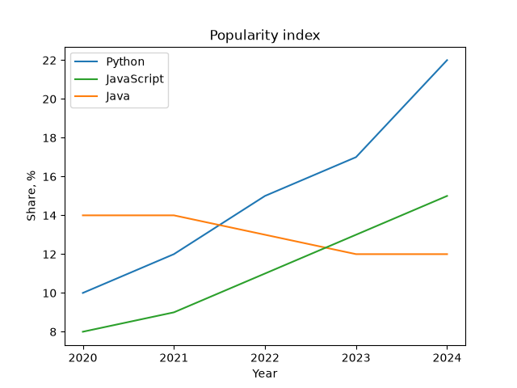

Правило: **порядок у легенді має збігатися з порядком ліній на графіку** (наприкінці, зверху вниз). Тоді око не стрибає між легендою і лініями.

## Спільна легенда для кількох графіків

Якщо на кількох `Axes` ті самі серії, легенда в кожному — зайвий шум. `fig.legend()` створює одну легенду на рівні фігури:

```python
import matplotlib.pyplot as plt

months = [1, 2, 3, 4, 5, 6, 7, 8, 9, 10, 11, 12]
temp_2024 = {"Kyiv": [-2.1, 1.5, 5.3, 12.1, 16.0, 21.3, 24.6, 22.5, 18.4, 10.1, 3.2, 0.5],
             "Lviv": [-1.3, 2.4, 5.8, 10.9, 14.2, 18.9, 21.3, 20.1, 16.8, 9.7, 3.9, 0.9]}
temp_norm = {"Kyiv": [-3.5, -2.4, 2.1, 9.4, 15.6, 19.0, 20.8, 20.0, 14.8, 8.6, 2.7, -1.6],
             "Lviv": [-2.9, -1.8, 2.3, 8.3, 13.6, 16.6, 18.2, 17.6, 13.2, 8.3, 3.3, -1.1]}

fig, axes = plt.subplots(1, 2, figsize=(10, 4), sharey=True, layout="constrained")
for ax, city in zip(axes, ["Kyiv", "Lviv"]):
    ax.plot(months, temp_norm[city], color="0.5", linestyle="--", label="norm")
    ax.plot(months, temp_2024[city], color="tab:red", label="2024")
    ax.set_title(city)
    ax.set_xlabel("Month")
axes[0].set_ylabel("Temperature, C")

# підписи беремо з першого графіка — на обох вони однакові
handles, labels = axes[0].get_legend_handles_labels()
fig.legend(handles, labels, loc="outside upper center", ncols=2)
plt.show()
```

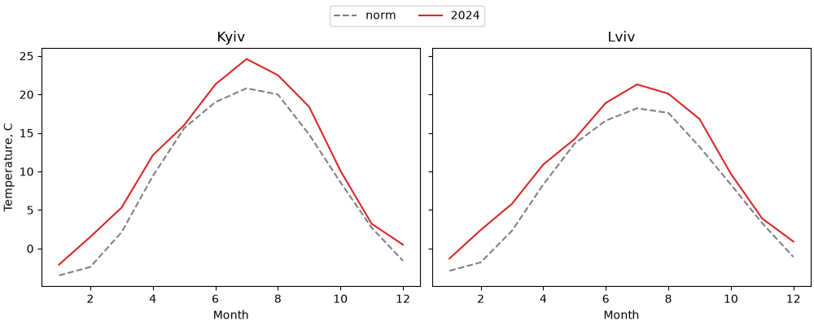

`loc="outside upper center"` працює лише з `layout="constrained"`: легенда стає над усіма графіками, а графіки зсуваються, звільняючи для неї місце.

## Підписи замість легенди та анотації

### Прямі підписи

Легенда змушує читача зіставляти колір лінії з кольором у рамці. Коли ліній небагато (2–4), їх можна підписати **прямо на графіку**, біля кінця лінії:

```python
import matplotlib.pyplot as plt

months = [1, 2, 3, 4, 5, 6, 7, 8, 9, 10, 11, 12]
cities = {
    "Kyiv": [-3.5, -2.4, 2.1, 9.4, 15.6, 19.0, 20.8, 20.0, 14.8, 8.6, 2.7, -1.6],
    "Lviv": [-2.9, -1.8, 2.3, 8.3, 13.6, 16.6, 18.2, 17.6, 13.2, 8.3, 3.3, -1.1],
    "Odesa": [-0.9, -0.3, 3.4, 9.3, 15.5, 20.0, 22.8, 22.4, 17.3, 11.5, 5.9, 1.3],
}

# вертикальний зсув підпису в пунктах, щоб підписи не налізали один на одного
nudge = {"Kyiv": -6, "Lviv": 5, "Odesa": 0}

fig, ax = plt.subplots(figsize=(8, 4), layout="constrained")
for name, temps in cities.items():
    (line,) = ax.plot(months, temps)
    ax.annotate(name, xy=(months[-1], temps[-1]), xytext=(6, nudge[name]),
                textcoords="offset points", va="center", color=line.get_color())

ax.spines[["top", "right"]].set_visible(False)
ax.set(title="Average monthly temperature", xlabel="Month", ylabel="Temperature, C")
ax.set_xticks(months)
plt.show()
```

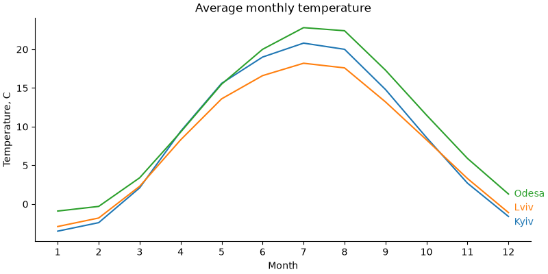

- `ax.plot` повертає **список** ліній; `(line,) = ...` розпаковує єдиний елемент;
- `line.get_color()` — колір, який matplotlib призначив лінії автоматично;
- `xy` — точка, до якої прив'язаний текст (остання точка лінії), `xytext=(6, ...)` з `textcoords="offset points"` — зсув на 6 пунктів праворуч від неї;
- кінці ліній Києва і Львова майже збігаються (−1.6 і −1.1), тому їхні підписи трохи розсунуті по вертикалі словником `nudge`. Прямі підписи часто потребують такого ручного доведення — це їхня ціна.

### Анотації: `text`, `annotate`, `axvspan`

Хороший графік не лише показує дані, а й **вказує на головне**: максимум, аномалію, подію.

```python
import matplotlib.pyplot as plt
import numpy as np

months = np.arange(1, 13)
kyiv = np.array([-3.5, -2.4, 2.1, 9.4, 15.6, 19.0, 20.8, 20.0, 14.8, 8.6, 2.7, -1.6])

i_max = np.argmax(kyiv)

fig, ax = plt.subplots(figsize=(8, 4), layout="constrained")
ax.plot(months, kyiv, marker="o", color="tab:blue")

# період, виділений фоном
ax.axvspan(5.5, 8.5, color="tab:orange", alpha=0.12)
ax.text(7, 1, "summer", ha="center", color="tab:orange")

# стрілка до максимуму
ax.annotate(f"max {kyiv[i_max]:.1f} C",
            xy=(months[i_max], kyiv[i_max]),
            xytext=(months[i_max] + 1.5, kyiv[i_max] + 2),
            arrowprops={"arrowstyle": "->", "color": "black"})

# горизонтальна смуга: зона заморозків
ax.axhspan(-5, 0, color="tab:blue", alpha=0.08)
ax.text(12.3, -4.5, "frost", ha="right", color="tab:blue")

ax.set(title="Kyiv: average monthly temperature", xlabel="Month",
       ylabel="Temperature, C", ylim=(-5, 25))
ax.set_xticks(months)
plt.show()
```

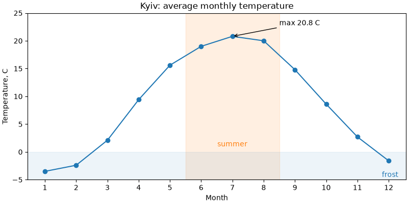

| Метод | Що робить |
|---|---|
| `ax.text(x, y, "...")` | текст у точці даних |
| `ax.annotate("...", xy=..., xytext=..., arrowprops=...)` | текст зі стрілкою до точки `xy` |
| `ax.axvspan(x1, x2)` | вертикальна смуга на всю висоту |
| `ax.axhspan(y1, y2)` | горизонтальна смуга на всю ширину |

Параметри `ha` / `va` (horizontal / vertical alignment) визначають, якою стороною текст прикріплюється до точки: `ha="center"` — центром, `ha="left"` — лівим краєм.

## Стилі: `plt.style`

Усі кольори, шрифти, товщини ліній і сітки за замовчуванням зберігаються в наборі параметрів. **Стиль** — це готовий набір таких параметрів. Список вбудованих стилів:

```python
import matplotlib.pyplot as plt

print(len(plt.style.available))
print(plt.style.available[:8])
```

```text
28
['Solarize_Light2', 'bmh', 'classic', 'dark_background', 'fast', 'fivethirtyeight', 'ggplot', 'grayscale']
```

Застосувати стиль до **всього скрипта** — `plt.style.use(...)` на початку, до створення фігур:

```python
import matplotlib.pyplot as plt
import numpy as np

plt.style.use("ggplot")

x = np.linspace(0, 10, 100)
fig, ax = plt.subplots()
ax.plot(x, np.sin(x), label="sin")
ax.plot(x, np.cos(x), label="cos")
ax.legend()
plt.show()
```

Щоб застосувати стиль лише до **частини коду**, використовують контекстний менеджер `plt.style.context`. Після виходу з блоку `with` налаштування повертаються:

```python
import matplotlib.pyplot as plt
import numpy as np

x = np.linspace(0, 10, 100)

for style in ["default", "ggplot", "bmh", "dark_background"]:
    with plt.style.context(style):
        fig, ax = plt.subplots(figsize=(5, 3.2), layout="constrained")
        ax.plot(x, np.sin(x), label="sin")
        ax.plot(x, np.cos(x), label="cos")
        ax.set_title(style)
        ax.legend(loc="lower left")

plt.show()
```

Цей код відкриє чотири вікна. Ось вони поруч:

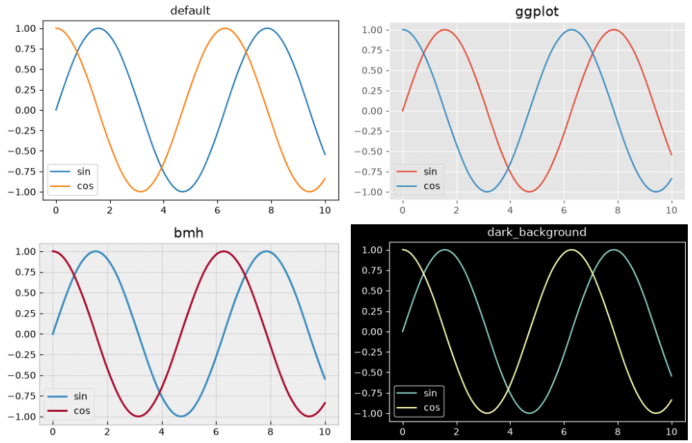

Деякі корисні стилі:

- `"default"` — стандартний вигляд matplotlib;
- `"ggplot"` — сірий фон і біла сітка, як у пакеті ggplot2 з мови R;
- `"bmh"`, `"fivethirtyeight"` — стилі, що імітують відомі видання;
- `"seaborn-v0_8-whitegrid"`, `"seaborn-v0_8-darkgrid"` — стилі бібліотеки seaborn;
- `"dark_background"` — для темних слайдів;
- `"grayscale"` — відтінки сірого для чорно-білого друку.

!!! note "Стиль діє в момент створення"
    Стиль застосовується до фігур і ліній, які створюються **після** `plt.style.use`. Уже створена фігура свій вигляд не змінить. Тому `plt.style.use` — одразу після імпортів.

## `rcParams`: глобальні налаштування

Стиль — це просто набір значень у словнику `plt.rcParams` (rc — «run commands», історична назва конфігурації). Окремі параметри можна змінити напряму:

```python
import matplotlib.pyplot as plt

print(plt.rcParams["figure.figsize"])
print(plt.rcParams["lines.linewidth"])
print(plt.rcParams["font.size"])
```

```text
[6.4, 4.8]
1.5
10.0
```

```python
import matplotlib.pyplot as plt
import numpy as np

plt.rcParams["figure.figsize"] = (8, 4)
plt.rcParams["font.size"] = 12
plt.rcParams["lines.linewidth"] = 2.5
plt.rcParams["axes.spines.top"] = False
plt.rcParams["axes.spines.right"] = False
plt.rcParams["axes.grid"] = True
plt.rcParams["grid.alpha"] = 0.3

x = np.linspace(0, 10, 100)
fig, ax = plt.subplots()
ax.plot(x, np.sqrt(x))
ax.set(title="Custom rcParams", xlabel="x", ylabel="sqrt(x)")
plt.show()
```

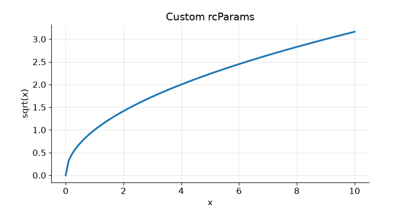

Тепер **кожен** графік у скрипті матиме такий вигляд — не треба повторювати `spines`, `grid` і `figsize` для кожного `Axes`.

Часто змінювані параметри:

| Ключ | Що задає |
|---|---|
| `figure.figsize` | розмір фігури, дюйми |
| `figure.dpi` | роздільна здатність на екрані |
| `savefig.dpi` | роздільна здатність `savefig` за замовчуванням |
| `font.size` | базовий розмір шрифту |
| `axes.titlesize`, `axes.labelsize` | розмір заголовка / підписів осей |
| `lines.linewidth`, `lines.markersize` | товщина ліній / розмір маркерів |
| `axes.grid`, `grid.alpha` | сітка за замовчуванням і її прозорість |
| `axes.spines.top`, `axes.spines.right` | показувати верхню / праву рамку |
| `legend.frameon` | рамка легенди |

Для тимчасової зміни — `plt.rc_context`, так само як `plt.style.context`:

```python
import matplotlib.pyplot as plt

with plt.rc_context({"font.size": 16, "lines.linewidth": 4}):
    fig, ax = plt.subplots()
    ax.plot([1, 2, 3], [1, 4, 9])
    ax.set_title("Big font for slides")

plt.show()
```

Скинути все до стандартних значень — `plt.rcdefaults()`.

## Цикл кольорів і стилів ліній

Коли ми не задаємо `color`, matplotlib бере кольори по черзі з **циклу властивостей** (`axes.prop_cycle`): `tab:blue`, `tab:orange`, `tab:green`, ... Цей цикл можна замінити.

Приклад: графік для **чорно-білого друку**, де лінії розрізняються не кольором, а стилем і маркером:

```python
import matplotlib.pyplot as plt

months = [1, 2, 3, 4, 5, 6, 7, 8, 9, 10, 11, 12]
cities = {
    "Kyiv": [-3.5, -2.4, 2.1, 9.4, 15.6, 19.0, 20.8, 20.0, 14.8, 8.6, 2.7, -1.6],
    "Lviv": [-2.9, -1.8, 2.3, 8.3, 13.6, 16.6, 18.2, 17.6, 13.2, 8.3, 3.3, -1.1],
    "Odesa": [-0.9, -0.3, 3.4, 9.3, 15.5, 20.0, 22.8, 22.4, 17.3, 11.5, 5.9, 1.3],
}

fig, ax = plt.subplots(figsize=(8, 4), layout="constrained")
ax.set_prop_cycle(color=["black", "0.35", "0.6"],
                  linestyle=["-", "--", ":"],
                  marker=["o", "s", "^"])

for name, temps in cities.items():
    ax.plot(months, temps, label=name)

ax.set(title="Print-friendly lines", xlabel="Month", ylabel="Temperature, C")
ax.legend()
plt.show()
```

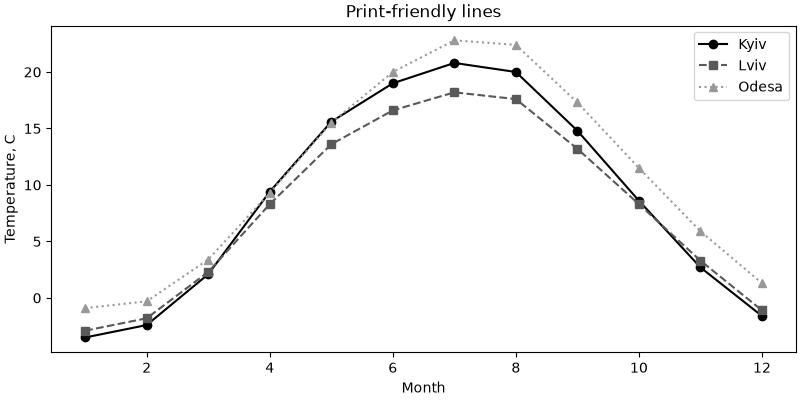

- `set_prop_cycle` задає цикл лише для **цього** `Axes`;
- усі списки мають бути **однакової довжини**: i-та лінія отримує i-тий колір, i-тий стиль і i-тий маркер;
- для всього скрипта той самий цикл задають через `rcParams["axes.prop_cycle"]` і функцію `cycler` з однойменного пакета (встановлюється разом з matplotlib).

```python
import matplotlib.pyplot as plt
import numpy as np
from cycler import cycler

plt.rcParams["axes.prop_cycle"] = cycler(color=["tab:blue", "tab:red", "tab:green"])

x = np.linspace(0, 1, 50)
fig, ax = plt.subplots()
for k in range(1, 4):
    ax.plot(x, x ** k, label=f"x^{k}")
ax.legend()
plt.show()
```

!!! tip "Колір — не єдина ознака"
    Близько 8% чоловіків мають порушення кольорового зору. Якщо ліній більше двох, відрізняйте їх **ще чимось**: стилем лінії, маркером або прямим підписом. Тоді графік читається і на чорно-білому друку.

## Власний файл стилю

Якщо у звітах потрібен однаковий вигляд графіків, налаштування виносять у файл `*.mplstyle`. Формат — `ключ: значення`, ті самі ключі, що в `rcParams`:

```text
# report.mplstyle
figure.figsize: 8, 4
figure.dpi: 100
savefig.dpi: 150
savefig.bbox: tight

font.size: 11
axes.titlesize: 13
axes.titleweight: bold

axes.spines.top: False
axes.spines.right: False
axes.grid: True
grid.alpha: 0.3

lines.linewidth: 2
legend.frameon: False
axes.prop_cycle: cycler(color=["1f77b4", "d62728", "2ca02c", "9467bd"])
```

Кольори у файлі стилю пишуться без `#` — у форматі `.mplstyle` символ `#` починає коментар.

Файл підключається за шляхом:

```python
from pathlib import Path

import matplotlib.pyplot as plt
import numpy as np

# у реальному проєкті файл report.mplstyle лежить поруч зі скриптом
Path("report.mplstyle").write_text(
    "figure.figsize: 8, 4\n"
    "savefig.dpi: 150\n"
    "savefig.bbox: tight\n"
    "font.size: 11\n"
    "axes.titlesize: 13\n"
    "axes.titleweight: bold\n"
    "axes.spines.top: False\n"
    "axes.spines.right: False\n"
    "axes.grid: True\n"
    "grid.alpha: 0.3\n"
    "lines.linewidth: 2\n"
    "legend.frameon: False\n"
    'axes.prop_cycle: cycler(color=["1f77b4", "d62728", "2ca02c", "9467bd"])\n'
)

plt.style.use("report.mplstyle")

x = np.linspace(0, 10, 100)
fig, ax = plt.subplots()
ax.plot(x, np.sin(x), label="sin")
ax.plot(x, np.cos(x), label="cos")
ax.set(title="Report style", xlabel="x", ylabel="y")
ax.legend()
plt.show()
```

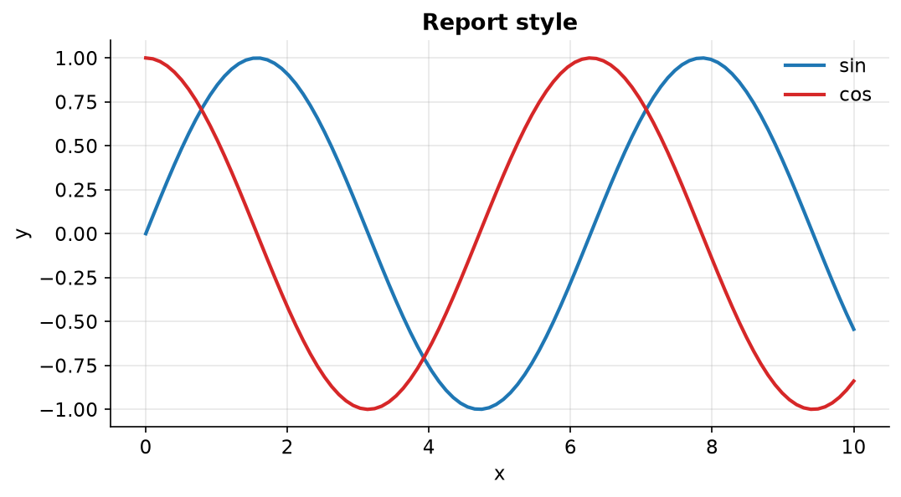

Стилі можна поєднувати списком — кожен наступний перекриває попередні: `plt.style.use(["seaborn-v0_8-whitegrid", "report.mplstyle"])`.

## Приклад: погода за рік

Зберемо все разом. Згенеруємо щоденну температуру за рік, порахуємо ковзне середнє в pandas і побудуємо графік, готовий для звіту.

Одна нова для нас функція pandas — `rolling(7).mean()`: **ковзне середнє** за 7 днів. Для кожного дня береться середнє цього дня і шести попередніх. Ковзне середнє згладжує щоденний «шум» і показує тренд. Перші 6 значень будуть `NaN` — для них ще немає 7 днів історії, і лінія там не малюється.

```python
import matplotlib.dates as mdates
import matplotlib.pyplot as plt
import numpy as np
import pandas as pd
from matplotlib.ticker import MultipleLocator

plt.rcParams["axes.spines.top"] = False
plt.rcParams["axes.spines.right"] = False
plt.rcParams["font.size"] = 10

rng = np.random.default_rng(2025)

# 1. дані: щоденна температура за рік
dates = pd.date_range("2025-01-01", "2025-12-31", freq="D")
day = np.arange(len(dates))
base = 9 - 12 * np.cos(2 * np.pi * (day - 15) / 365)
df = pd.DataFrame({
    "t_min": base - 4 + rng.normal(0, 2.5, size=len(dates)),
    "t_max": base + 4 + rng.normal(0, 2.5, size=len(dates)),
}, index=dates)
df["t_mean"] = (df["t_min"] + df["t_max"]) / 2
df["t_week"] = df["t_mean"].rolling(7).mean()

hot = df["t_max"] >= 28
print(f"days: {len(df)}, hot days (t_max >= 28): {hot.sum()}")
print(f"warmest day: {df['t_max'].idxmax().date()}, {df['t_max'].max():.1f} C")

# 2. графік
fig, ax = plt.subplots(figsize=(11, 4.5), layout="constrained")

ax.fill_between(df.index, df["t_min"], df["t_max"],
                color="tab:blue", alpha=0.2, linewidth=0, label="daily min - max")
ax.plot(df.index, df["t_week"], color="tab:blue", linewidth=2, label="7-day mean")
ax.scatter(df.index[hot], df.loc[hot, "t_max"], color="tab:red", s=12,
           zorder=3, label="t_max >= 28 C")

ax.axhline(0, color="black", linewidth=0.8)

# найтепліший день
warmest = df["t_max"].idxmax()
ax.annotate(f"{df.loc[warmest, 't_max']:.1f} C",
            xy=(warmest, df.loc[warmest, "t_max"]),
            xytext=(25, 5), textcoords="offset points",
            arrowprops={"arrowstyle": "->"})

# 3. осі
ax.margins(x=0)
ax.xaxis.set_major_locator(mdates.MonthLocator())
ax.xaxis.set_major_formatter(mdates.ConciseDateFormatter(ax.xaxis.get_major_locator()))
ax.yaxis.set_major_locator(MultipleLocator(10))
ax.yaxis.set_minor_locator(MultipleLocator(5))
ax.yaxis.set_major_formatter("{x:.0f} C")
ax.grid(True, which="major", axis="y", alpha=0.4)
ax.grid(True, which="minor", axis="y", alpha=0.15)

# 4. підписи та легенда
ax.set_title("Daily temperature, 2025 (simulated)", loc="left", fontweight="bold")
ax.set_ylabel("Temperature")
ax.legend(loc="lower center", ncols=3, frameon=False)

fig.savefig("weather_2025.png", dpi=150)
plt.show()
```

```text
days: 365, hot days (t_max >= 28): 8
warmest day: 2025-07-14, 30.5 C
```

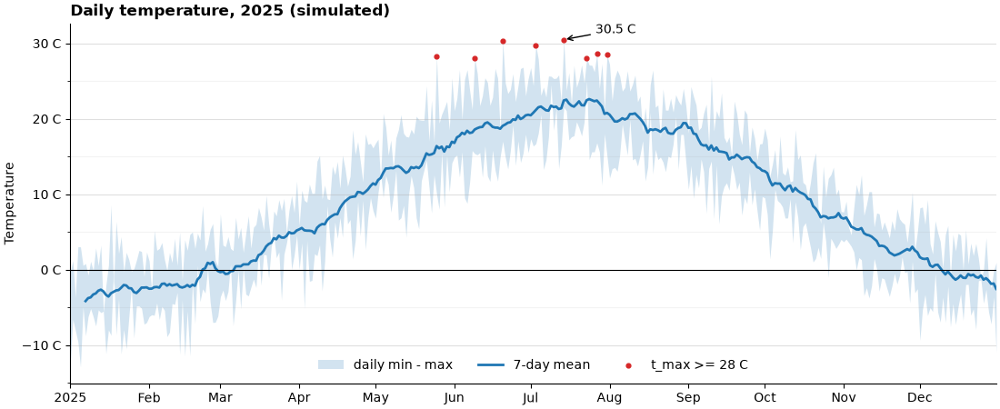

Що тут використано:

- **дані** — pandas: `date_range`, стовпці, `rolling`, булева маска `hot`, `idxmax` (індекс, тобто дата максимуму);
- **лінія + заливка** — `fill_between` показує діапазон дня, `plot` — згладжений тренд;
- **scatter поверх лінії** — `zorder=3` гарантує, що точки не сховаються під заливкою;
- **осі** — `margins(x=0)`, дати через `ConciseDateFormatter`, поділки через `MultipleLocator`, одиниці вимірювання прямо в підписах поділок;
- **сітка** — лише горизонтальна (`axis="y"`), бо температуру зчитують по горизонталі;
- **легенда** — у рядок (`ncols=3`) без рамки, внизу по центру: там, де влітку немає даних;
- **`rcParams`** — рамка без верхньої і правої лінії задана один раз на початку.

!!! tip "pandas `df.plot()` повертає `Axes`"
    `df["t_mean"].plot()` — це обгортка над matplotlib, яка повертає звичайний `Axes`. Усе з цієї лекції до нього застосовне: `ax = df["t_mean"].plot(figsize=(10, 4))`, далі `ax.set_title(...)`, `ax.legend(...)`, `ax.xaxis.set_major_formatter(...)`. Можна й навпаки — малювати pandas на вже створеному `Axes`: `df.plot(ax=ax)`.

## Типові помилки

**Невідсортовані `x`.** `plot` з'єднує точки в порядку масиву — виходить «павутиння». Сортуйте: `np.argsort` або `df.sort_values`.

**Лінія для категорій.** Лінія між «Python» і «Java» не має сенсу. Для категорій — `bar`.

**Нулі замість пропусків.** `0` на графіку — це значення. Пропуск — `np.nan`, і лінія чесно розривається.

**`plot` для ступінчастих даних.** Тариф змінився 1 червня, а не «поступово з квітня по червень». Для таких даних — `step(..., where="post")`.

**Нуль або від'ємні числа на log-осі.** Точки зникають. Перевіряйте `(y <= 0).any()` перед `set_yscale("log")`.

**`set_major_formatter` на `ax` замість `ax.xaxis`.** Локатори і форматери належать осі (`Axis`), а не графіку (`Axes`): `ax.xaxis.set_major_formatter(...)`. У `ax` такого методу немає — `AttributeError`.

**`StrMethodFormatter("{y:.0f}")` для осі y.** У форматі значення завжди називається `x`, незалежно від осі. `{y}` дасть `KeyError`.

**Легенда поверх даних.** Коли ліній багато, винесіть легенду назовні (`bbox_to_anchor`) або підпишіть лінії напряму.

**Легенда поза графіком без `layout="constrained"`.** Легенда обрізається краєм фігури. Використовуйте `layout="constrained"` або `savefig(..., bbox_inches="tight")`.

**Порядок легенди не збігається з лініями.** Верхня лінія на графіку — верхній рядок у легенді. Переставляйте через `get_legend_handles_labels`.

**Дві осі y без потреби.** `twinx` дає змогу «підкрутити» враження від графіка масштабом. Зазвичай краще два графіки з `sharex=True`.

**`plt.style.use` після створення фігури.** Уже створена фігура не зміниться. Стиль — одразу після імпортів.

**Колір як єдина відмінність.** На чорно-білому друку і для людей із порушенням кольорового зору лінії зливаються. Додавайте стиль лінії, маркер або прямий підпис.

**`set_prop_cycle` зі списками різної довжини.** `ValueError`. Усі списки мають бути однакової довжини.

## Підсумок

- **Лінійний графік** — для часу та неперервних величин; дані відсортовані за `x`, пропуски — `np.nan`.
- **`ax.step(..., where="post")`** — для значень, що змінюються стрибком.
- **`ax.fill_between(x, y1, y2)`** — діапазон між кривими; `where=` — умовна заливка.
- **Межі:** `margins(x=0)`, `set_ylim(bottom=0)`, `invert_yaxis()`.
- **Масштаб:** `set_yscale("log")` — зростання «у рази», експонента стає прямою.
- **Поділки:** `ax.xaxis.set_major_locator(...)` — **де** (`MultipleLocator`, `MaxNLocator`, `AutoMinorLocator`); `ax.xaxis.set_major_formatter(...)` — **що** написано (`StrMethodFormatter`, `PercentFormatter`, `FuncFormatter`); `tick_params` — вигляд.
- **Дати:** `matplotlib.dates` — `MonthLocator`, `DateFormatter`, `ConciseDateFormatter`.
- **Рамка:** `ax.spines[["top", "right"]].set_visible(False)`; `set_aspect("equal")` для геометрії.
- **`twinx`** — дві осі y; частіше краще `subplots(2, 1, sharex=True)`.
- **Легенда:** `loc`, `bbox_to_anchor`, `ncols`, `title`, `frameon`; `_nolegend_` — приховати; `get_legend_handles_labels` — порядок; `fig.legend` — одна на фігуру.
- **Анотації:** `ax.text`, `ax.annotate` зі стрілкою, `axvspan` / `axhspan`; прямі підписи замість легенди для 2–4 ліній.
- **Стилі:** `plt.style.use(...)`, `plt.style.context(...)`; `plt.rcParams[...]`, `plt.rc_context(...)`; `set_prop_cycle` — свій цикл кольорів і стилів; `*.mplstyle` — свій стиль у файлі.

## Корисні посилання

- [matplotlib: Axis scales](https://matplotlib.org/stable/users/explain/axes/axes_scales.html)
- [Tick locators](https://matplotlib.org/stable/gallery/ticks/tick-locators.html)
- [Tick formatters](https://matplotlib.org/stable/gallery/ticks/tick-formatters.html)
- [Date tick labels](https://matplotlib.org/stable/gallery/text_labels_and_annotations/date.html)
- [Legend guide](https://matplotlib.org/stable/users/explain/axes/legend_guide.html)
- [Annotations](https://matplotlib.org/stable/users/explain/text/annotations.html)
- [Style sheets reference](https://matplotlib.org/stable/gallery/style_sheets/style_sheets_reference.html)
- [Customizing with style sheets and rcParams](https://matplotlib.org/stable/users/explain/customizing.html)
