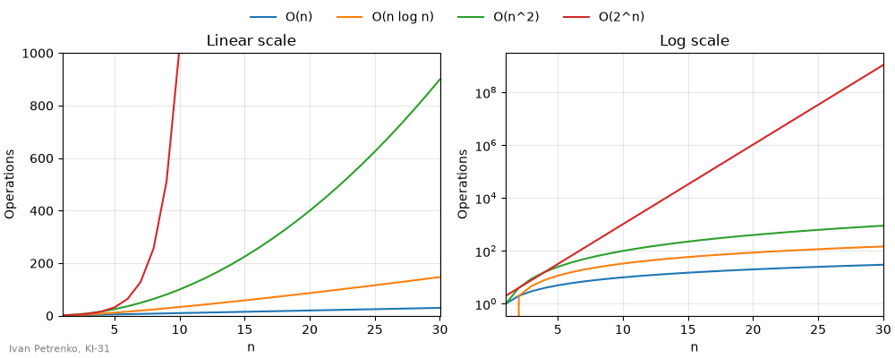
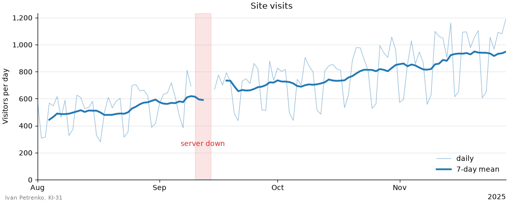
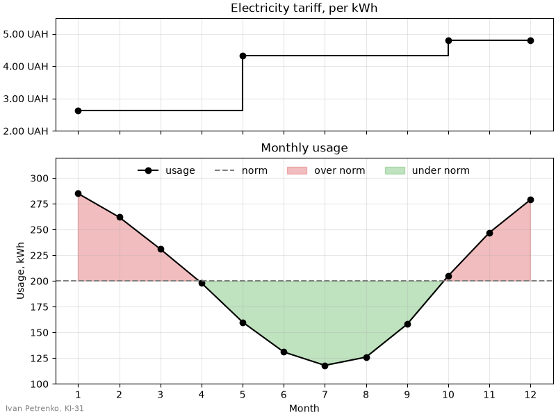
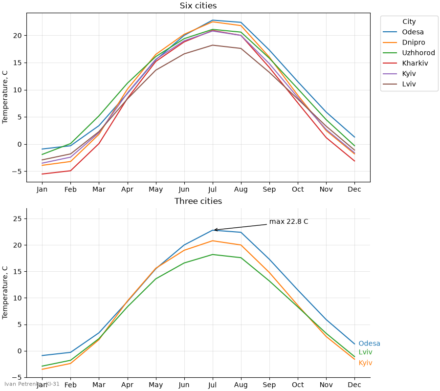
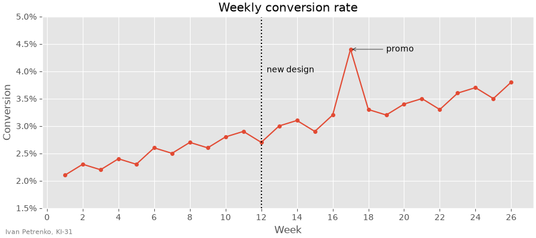
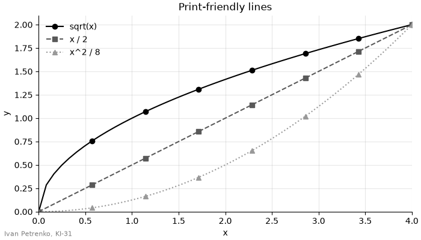

# 38. (П17) Лінійні графіки: осі, легенди, стилі

## Передумови

- Прочитана [Лекція 37 — Лінійні графіки у matplotlib. Налаштування осей, легенди, стилі](/ua/courses/programming-3sem/module4/37-line-plots-axes-legends-styles-lecture/)
- Встановлені бібліотеки: `pip install matplotlib numpy pandas`

!!! warning "Мова в коді"
    Усі рядкові літерали, заголовки та підписи графіків, імена файлів і змінних — **лише латиницею**. Кирилиця допускається тільки в коментарях.

## Завдання

Для кожного завдання дано картинку та вхідні дані. Потрібно написати код, який малює **такий самий** графік: ті самі лінії, кольори, стилі, осі, підписи поділок, легенди, анотації та розташування елементів.

- кожне завдання — окремий файл `task_1.py`, `task_2.py`, ...;
- кожен скрипт зберігає графік у файл `task_1.png`, `task_2.png`, ...;
- у лівому нижньому куті кожної фігури — ваше ім'я та група (на зразках — `Ivan Petrenko, KI-31`).

## Завдання 1

Розмір фігури: 10 × 4.



```python
import numpy as np

n = np.arange(1, 31)
```

## Завдання 2

Розмір фігури: 10 × 4. Товста лінія — ковзне середнє за 7 днів; воно показується, коли у вікні є щонайменше 4 значення.



```python
import numpy as np
import pandas as pd

rng = np.random.default_rng(38)
dates = pd.date_range("2025-08-01", periods=120, freq="D")
day = np.arange(120)
visits = 500 + 5 * day + rng.normal(0, 60, size=120)
visits[dates.dayofweek >= 5] *= 0.6

# сервер не працював: дні з індексами 40..44
visits[40:45] = np.nan
```

## Завдання 3

Розмір фігури: 8 × 6.



```python
import numpy as np

# місяць, з якого діє тариф, і ціна за kWh
tariff_months = [1, 5, 10, 12]
tariff_prices = [2.64, 4.32, 4.80, 4.80]

months = np.arange(1, 13)
usage = np.array([285, 262, 231, 198, 160, 131, 118, 126, 158, 205, 247, 279])
norm = 200
```

## Завдання 4

Розмір фігури: 9 × 8.



```python
cities = {
    "Kyiv": [-3.5, -2.4, 2.1, 9.4, 15.6, 19.0, 20.8, 20.0, 14.8, 8.6, 2.7, -1.6],
    "Lviv": [-2.9, -1.8, 2.3, 8.3, 13.6, 16.6, 18.2, 17.6, 13.2, 8.3, 3.3, -1.1],
    "Odesa": [-0.9, -0.3, 3.4, 9.3, 15.5, 20.0, 22.8, 22.4, 17.3, 11.5, 5.9, 1.3],
    "Kharkiv": [-5.5, -4.9, 0.1, 8.4, 15.2, 18.8, 20.9, 20.0, 14.1, 7.6, 1.2, -3.1],
    "Dnipro": [-3.9, -3.2, 1.8, 10.1, 16.5, 20.2, 22.5, 21.8, 16.0, 9.0, 2.5, -1.8],
    "Uzhhorod": [-1.9, 0.1, 5.2, 11.2, 16.1, 19.4, 21.1, 20.6, 15.8, 10.2, 4.5, -0.3],
}
months = list(range(1, 13))
month_names = ["Jan", "Feb", "Mar", "Apr", "May", "Jun",
               "Jul", "Aug", "Sep", "Oct", "Nov", "Dec"]
```

## Завдання 5

Розмір фігури: 9 × 4.



```python
import numpy as np

weeks = np.arange(1, 27)
conversion = np.array([2.1, 2.3, 2.2, 2.4, 2.3, 2.6, 2.5, 2.7, 2.6, 2.8, 2.9, 2.7, 3.0,
                       3.1, 2.9, 3.2, 4.4, 3.3, 3.2, 3.4, 3.5, 3.3, 3.6, 3.7, 3.5, 3.8]) / 100
release_week = 12
```

## Завдання 6

Розмір фігури: 7 × 4.



```python
import numpy as np

x = np.linspace(0, 4, 50)
```

## Для звіту

- код `task_1.py` ... `task_6.py`;
- зображення `task_1.png` ... `task_6.png`;
- відповіді одним-двома реченнями:
    1. Чому на логарифмічній шкалі в завданні 1 лінія `O(2^n)` пряма?
    2. Чому в завданні 2 дні простою не можна заповнити нулями?
    3. Чим локатор поділок відрізняється від форматера?
