# 39. (Л) Гістограми та scatter plots у matplotlib

## Зміст лекції

1. Розподіл і зв'язок: два питання до даних
2. Гістограма: що вона показує
3. `bins`: кількість інтервалів
4. `bins`: ширина та межі інтервалів
5. Частота, частка, щільність: `density` і `weights`
6. Теоретична крива поверх гістограми
7. Порівняння кількох розподілів
8. Накопичувальна гістограма
9. Асиметричні дані: логарифмічні інтервали
10. Гістограми в pandas
11. Scatter: розмір, колір, прозорість
12. Колір як третя величина: `cmap` і `colorbar`
13. Категорії на scatter
14. Бульбашкова діаграма: легенда розмірів
15. Перекриття точок: `alpha`, `hist2d`, `hexbin`
16. Лінія тренду і кореляція
17. Scatter з гістограмами на полях
18. Приклад: ринок квартир
19. Типові помилки
20. Підсумок

## Розподіл і зв'язок: два питання до даних

У лекції 35 ми вже побудували першу гістограму (`hist`) і першу діаграму розсіювання (`scatter`). Ці два графіки відповідають на два найчастіші питання до числових даних:

| Питання | Графік | Приклад |
|---|---|---|
| Які значення **однієї** величини трапляються і як часто? | гістограма `hist` | зріст людей, час відповіді сервера, бали за тест |
| Як пов'язані **дві** величини? | scatter `scatter` | площа і ціна квартири, години підготовки і бал |

Середнє і стандартне відхилення (лекція 30) стискають тисячі чисел до двох. Гістограма показує те, що ці два числа приховують: кілька «горбів», довгий хвіст, викиди. Scatter показує те, що приховує коефіцієнт кореляції: нелінійність, групи, окремі аномальні точки.

## Гістограма: що вона показує

Гістограма ділить діапазон значень на **інтервали** (bins) і рахує, скільки значень потрапило в кожен. Висота стовпчика — кількість.

Два набори нижче мають майже однакові середнє і стандартне відхилення, але зовсім різну форму:

```python
import matplotlib.pyplot as plt
import numpy as np

rng = np.random.default_rng(1)

# один "горб"
a = rng.normal(170, 10, size=2000)
# два "горби": дві групи з різним середнім
b = np.concatenate([rng.normal(161, 4, size=1000),
                    rng.normal(179, 4, size=1000)])

print(f"a: mean={a.mean():.1f}, std={a.std():.1f}")
print(f"b: mean={b.mean():.1f}, std={b.std():.1f}")

fig, (ax1, ax2) = plt.subplots(1, 2, figsize=(9, 3.5), sharex=True, sharey=True,
                               layout="constrained")
ax1.hist(a, bins=40, edgecolor="white")
ax1.set_title("a: one peak")
ax2.hist(b, bins=40, edgecolor="white", color="tab:orange")
ax2.set_title("b: two peaks")
for ax in (ax1, ax2):
    ax.set_xlabel("Height, cm")
ax1.set_ylabel("Count")
plt.show()
```

```text
a: mean=169.9, std=10.1
b: mean=170.0, std=9.8
```

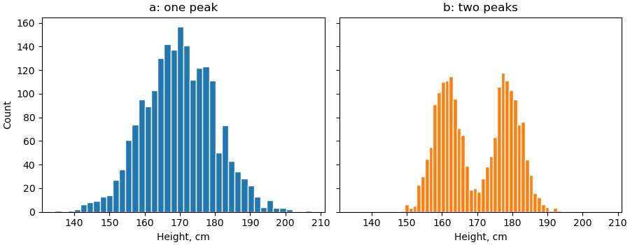

Набір `b` — це суміш двох груп (наприклад, зріст жінок і чоловіків). Середнє 170 см тут узагалі нетипове значення: людей такого зросту в `b` менше, ніж будь-якого іншого поблизу.

!!! tip "Спершу гістограма, потім статистика"
    Перш ніж рахувати середнє, подивіться на розподіл. Якщо «горбів» кілька або є довгий хвіст, середнє може погано описувати дані — краще медіана або розбиття на групи.

## `bins`: кількість інтервалів

Кількість інтервалів — головне налаштування гістограми. Від неї залежить, що ви побачите:

```python
import matplotlib.pyplot as plt
import numpy as np

rng = np.random.default_rng(2)
data = np.concatenate([rng.normal(0, 1, size=300),
                       rng.normal(3, 0.7, size=150)])

fig, axs = plt.subplots(1, 3, figsize=(11, 3.2), sharey=False, layout="constrained")
for ax, bins in zip(axs, [5, 25, 200]):
    ax.hist(data, bins=bins, edgecolor="white", linewidth=0.5)
    ax.set_title(f"bins={bins}")
plt.show()
```

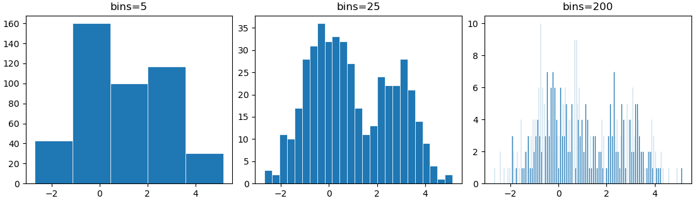

- **замало** (`bins=5`) — другий «горб» зливається з першим, форма втрачена;
- **забагато** (`bins=200`) — у кожен інтервал потрапляє 0–5 значень, видно лише шум;
- **у самий раз** (`bins=25`) — видно обидва «горби».

Універсального числа немає. Що більше даних, то більше інтервалів можна собі дозволити.

### Автоматичний вибір: правила

Замість числа `bins` можна передати назву правила. matplotlib передає його в `np.histogram_bin_edges`:

| Значення | Як рахує |
|---|---|
| `"sturges"` | `log2(n) + 1` інтервалів; добре для невеликих нормальних вибірок |
| `"fd"` | Фрідмана — Діаконіса: ширина за міжквартильним розмахом, стійке до викидів |
| `"auto"` | менша ширина з `"sturges"` і `"fd"`; хороший вибір за замовчуванням |

```python
import numpy as np

rng = np.random.default_rng(2)
data = np.concatenate([rng.normal(0, 1, size=300),
                       rng.normal(3, 0.7, size=150)])

for rule in ["sturges", "fd", "auto"]:
    edges = np.histogram_bin_edges(data, bins=rule)
    print(f"{rule:8} -> {len(edges) - 1} bins, width {edges[1] - edges[0]:.2f}")
```

```text
sturges  -> 10 bins, width 0.78
fd       -> 11 bins, width 0.71
auto     -> 11 bins, width 0.71
```

!!! note "За замовчуванням `bins=10`"
    Без параметра `bins` matplotlib завжди бере 10 інтервалів — незалежно від кількості даних. Для 10 000 значень цього зазвичай замало. Завжди задавайте `bins` явно.

## `bins`: ширина та межі інтервалів

Число інтервалів дає «некруглі» межі: `152.2`, `160.4`, `168.5`… Їх незручно читати. Краще задати **межі** масивом через `np.arange(start, stop, step)`:

```python
import matplotlib.pyplot as plt
import numpy as np

rng = np.random.default_rng(3)
scores = np.clip(rng.normal(72, 12, size=400).round(), 0, 100)

fig, (ax1, ax2) = plt.subplots(1, 2, figsize=(9, 3.5), sharey=True, layout="constrained")

ax1.hist(scores, bins=12, edgecolor="white")
ax1.set_title("bins=12: odd edges")

# інтервали по 5 балів: [0, 5), [5, 10), ..., [95, 100]
edges = np.arange(0, 101, 5)
ax2.hist(scores, bins=edges, edgecolor="white")
ax2.set_title("bins=np.arange(0, 101, 5)")
ax2.set_xticks(np.arange(0, 101, 10))

for ax in (ax1, ax2):
    ax.set_xlabel("Score")
ax1.set_ylabel("Students")
plt.show()
```

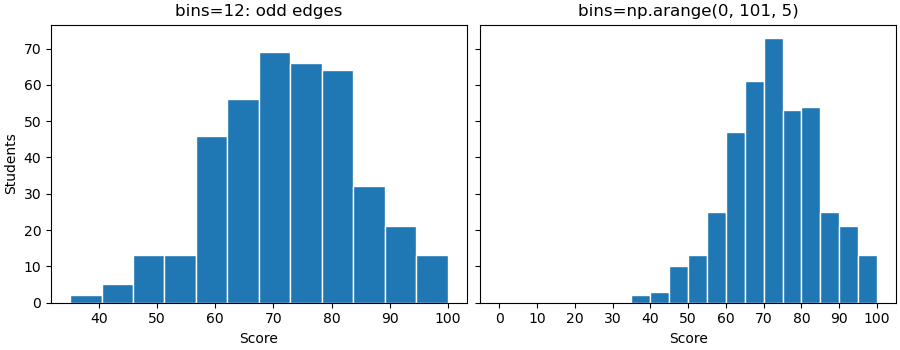

Тепер кожен стовпчик — рівно 5 балів, а межі збігаються з поділками осі.

### Які значення потрапляють у інтервал

Усі інтервали, крім останнього, **напіввідкриті**: `[a, b)` — ліва межа включена, права ні. Останній інтервал закритий: `[a, b]`.

```python
import numpy as np

values = np.array([0, 5, 9, 10, 10, 15, 20])
counts, edges = np.histogram(values, bins=[0, 10, 20])
print(counts)
```

```text
[3 4]
```

`[0, 10)` — значення 0, 5, 9; `[10, 20]` — 10, 10, 15 і **20** (остання межа включена).

!!! warning "Цілі числа і межі інтервалів"
    Для цілих даних (бали, вік, кількість) ставте межі **між** цілими: `np.arange(0.5, 11.5, 1)` для оцінок 1–10. Інакше залежно від кроку один стовпчик може охопити два цілі значення, а сусідній — одне, і з'являться хибні «зубці».

### Дискретні значення: `bar` замість `hist`

Якщо різних значень мало (кількість дітей у сім'ї, оцінка 1–5), гістограма з інтервалами не потрібна. Порахуйте кожне значення і намалюйте `bar`:

```python
import matplotlib.pyplot as plt
import numpy as np

rng = np.random.default_rng(4)
grades = rng.choice([1, 2, 3, 4, 5], size=200, p=[0.05, 0.1, 0.3, 0.35, 0.2])

values, counts = np.unique(grades, return_counts=True)
print(values, counts)

fig, ax = plt.subplots(figsize=(6, 3.5))
ax.bar(values, counts, width=0.6)
ax.set(title="Grades distribution", xlabel="Grade", ylabel="Students", xticks=values)
plt.show()
```

```text
[1 2 3 4 5] [ 5 19 51 78 47]
```

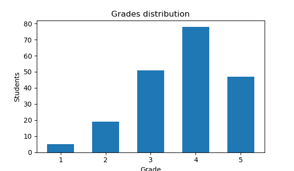

`np.unique(..., return_counts=True)` повертає унікальні значення та кількість кожного. У pandas те саме — `s.value_counts().sort_index()`.

## Частота, частка, щільність: `density` і `weights`

За замовчуванням висота стовпчика — **кількість** значень. Це погано, коли треба порівняти вибірки різного розміру: 1000 студентів одного потоку і 150 іншого. Є два способи нормувати висоти.

### Частка у відсотках: `weights`

`weights` — масив ваг, по одній на кожне значення. Висота стовпчика — сума ваг у ньому. Якщо кожному значенню дати вагу `1 / n`, висоти стануть частками, а їхня сума — 1:

```python
import matplotlib.pyplot as plt
import numpy as np
from matplotlib.ticker import PercentFormatter

rng = np.random.default_rng(5)
group_a = rng.normal(70, 10, size=1000)
group_b = rng.normal(78, 8, size=150)
edges = np.arange(30, 111, 5)

fig, (ax1, ax2) = plt.subplots(1, 2, figsize=(10, 3.6), layout="constrained")

ax1.hist(group_a, bins=edges, alpha=0.6, label="A (n=1000)")
ax1.hist(group_b, bins=edges, alpha=0.6, label="B (n=150)")
ax1.set(title="Counts: B looks tiny", ylabel="Students")

ax2.hist(group_a, bins=edges, alpha=0.6, label="A (n=1000)",
         weights=np.ones(len(group_a)) / len(group_a))
ax2.hist(group_b, bins=edges, alpha=0.6, label="B (n=150)",
         weights=np.ones(len(group_b)) / len(group_b))
ax2.yaxis.set_major_formatter(PercentFormatter(xmax=1))
ax2.set(title="Share of group", ylabel="Share of students")

for ax in (ax1, ax2):
    ax.set_xlabel("Score")
    ax.legend()
plt.show()
```

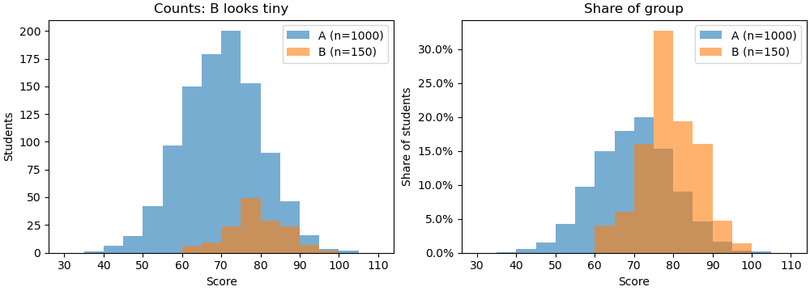

`PercentFormatter(xmax=1)` (лекція 37) перетворює `0.2` на `20%`. Тепер висота стовпчика читається просто: «20% студентів групи B мають 80–85 балів».

### Щільність: `density=True`

`density=True` нормує висоти так, щоб **площа** всіх стовпчиків дорівнювала 1. Висота стовпчика = частка / ширина інтервалу.

```python
import numpy as np

rng = np.random.default_rng(5)
data = rng.normal(70, 10, size=1000)

counts, edges = np.histogram(data, bins=np.arange(30, 111, 5))
dens, _ = np.histogram(data, bins=edges, density=True)
width = edges[1] - edges[0]

print(f"sum of counts:     {counts.sum()}")
print(f"sum of shares:     {(counts / counts.sum()).sum():.2f}")
print(f"sum of densities:  {dens.sum():.2f}")
print(f"area (dens*width): {(dens * width).sum():.2f}")
```

```text
sum of counts:     1000
sum of shares:     1.00
sum of densities:  0.20
area (dens*width): 1.00
```

| Режим | Висота стовпчика | Сума / площа |
|---|---|---|
| за замовчуванням | кількість | сума висот = `n` |
| `weights=1/n` | частка | сума висот = 1 |
| `density=True` | частка / ширина | площа = 1 |

Щільність потрібна у двох випадках:

- інтервали **різної ширини** — без `density` широкий інтервал виглядає «важчим» лише тому, що він широкий;
- треба накласти **теоретичну криву** розподілу, яка також має площу 1.

Для звіту, який читатимуть люди, частки у відсотках зазвичай зрозуміліші за щільність.

## Теоретична крива поверх гістограми

Чи схожі дані на нормальний розподіл? Намалюємо гістограму зі щільністю і поверх неї — криву нормального розподілу з тими самими середнім і стандартним відхиленням:

$$f(x) = \frac{1}{\sigma\sqrt{2\pi}} e^{-\frac{(x-\mu)^2}{2\sigma^2}}$$

```python
import matplotlib.pyplot as plt
import numpy as np


def normal_pdf(x, mu, sigma):
    return np.exp(-((x - mu) ** 2) / (2 * sigma ** 2)) / (sigma * np.sqrt(2 * np.pi))


rng = np.random.default_rng(6)
normal_data = rng.normal(50, 8, size=1000)
# час очікування: сильно асиметричний розподіл
skewed_data = rng.exponential(8, size=1000) + 42

fig, axs = plt.subplots(1, 2, figsize=(10, 3.6), sharey=True, layout="constrained")
for ax, data, title in zip(axs, [normal_data, skewed_data], ["normal", "skewed"]):
    mu, sigma = data.mean(), data.std()
    ax.hist(data, bins=40, density=True, color="0.8", edgecolor="white")
    x = np.linspace(data.min(), data.max(), 300)
    ax.plot(x, normal_pdf(x, mu, sigma), color="tab:red", linewidth=2,
            label=f"normal({mu:.0f}, {sigma:.0f})")
    ax.set_title(title)
    ax.legend()
axs[0].set_ylabel("Density")
plt.show()
```

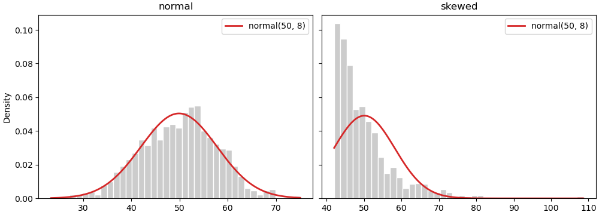

Ліворуч крива лягає на стовпчики — дані близькі до нормальних. Праворуч ні: нормальна крива «вважає», що значення менше 42 трапляються часто, хоча їх немає зовсім. Тут середнє ± 2σ дає хибні межі «типових» значень.

## Порівняння кількох розподілів

Типова задача: порівняти час відповіді сервера до і після оптимізації, бали двох груп, зарплати в трьох містах. Головне правило — **спільні межі інтервалів** для всіх наборів. Інакше стовпчики різної ширини неможливо порівнювати.

```python
import matplotlib.pyplot as plt
import numpy as np

rng = np.random.default_rng(8)
before = rng.gamma(4, 30, size=800)
after = rng.gamma(4, 20, size=800)

# спільні межі для обох наборів
edges = np.histogram_bin_edges(np.concatenate([before, after]), bins=40)

fig, axs = plt.subplots(2, 2, figsize=(10, 6), sharex=True, layout="constrained")

axs[0, 0].hist(before, bins=edges, alpha=0.5, label="before")
axs[0, 0].hist(after, bins=edges, alpha=0.5, label="after")
axs[0, 0].set_title("alpha overlay")

axs[0, 1].hist([before, after], bins=edges, label=["before", "after"])
axs[0, 1].set_title("side by side (list of arrays)")

axs[1, 0].hist(before, bins=edges, histtype="step", linewidth=2, label="before")
axs[1, 0].hist(after, bins=edges, histtype="step", linewidth=2, label="after")
axs[1, 0].set_title('histtype="step"')

axs[1, 1].hist([before, after], bins=edges, stacked=True, label=["before", "after"])
axs[1, 1].set_title("stacked=True")

for ax in axs.flat:
    ax.legend()
for ax in axs[1]:
    ax.set_xlabel("Response time, ms")
plt.show()
```

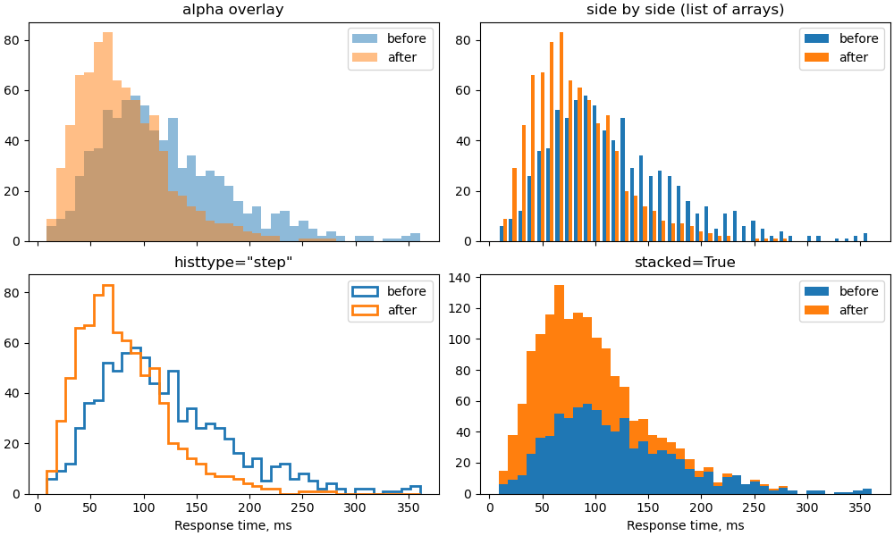

| Спосіб | Коли підходить |
|---|---|
| накладання з `alpha` | 2 набори; перетин видно як змішаний колір |
| `histtype="step"` | 2–4 набори; лише контури, нічого не перекривається |
| список масивів | 2–3 набори; стовпчики поруч, але кожен вужчий |
| `stacked=True` | набори — **частини цілого** (запити з різних регіонів); висота стовпчика — загальна кількість |

!!! warning "`stacked` — не для порівняння форм"
    На складеній гістограмі форму лише нижнього набору видно чесно. Верхній «стоїть» на нижньому, і його форму важко оцінити. Для порівняння «до / після» використовуйте `step` або накладання.

### Окремі графіки зі спільною віссю

Коли наборів більше трьох, накладання стає нечитабельним. Краще — стовпчик графіків зі спільною віссю `x` (`sharex=True`, лекція 35):

```python
import matplotlib.pyplot as plt
import numpy as np

rng = np.random.default_rng(9)
cities = {"Kyiv": (38, 12), "Lviv": (31, 9), "Odesa": (29, 10),
          "Dnipro": (27, 8), "Kharkiv": (26, 8)}
edges = np.arange(0, 76, 3)

fig, axs = plt.subplots(len(cities), 1, figsize=(7, 7), sharex=True, sharey=True,
                        layout="constrained")
for ax, (city, (mu, sigma)) in zip(axs, cities.items()):
    salary = rng.normal(mu, sigma, size=500).clip(5)
    ax.hist(salary, bins=edges, color="tab:blue", edgecolor="white")
    ax.axvline(np.median(salary), color="tab:red", linewidth=1.5)
    ax.text(0.99, 0.8, city, transform=ax.transAxes, ha="right", fontweight="bold")
    ax.spines[["top", "right"]].set_visible(False)
axs[-1].set_xlabel("Salary, thousand UAH (red line: median)")
plt.show()
```

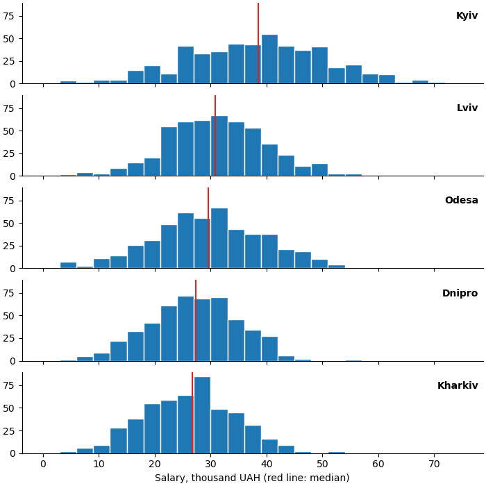

Спільна вісь `x` дає змогу порівняти зсув розподілів, дивлячись згори вниз, а медіана (червона лінія) — точка відліку. `transform=ax.transAxes` розміщує підпис у координатах графіка (0–1), а не даних.

## Накопичувальна гістограма

`cumulative=True` — кожен стовпчик показує кількість значень **не більших** за праву межу. Разом із `density=True` отримаємо частку: «90% запитів швидші за 250 мс».

```python
import matplotlib.pyplot as plt
import numpy as np
from matplotlib.ticker import PercentFormatter

rng = np.random.default_rng(8)
before = rng.gamma(4, 30, size=800)
after = rng.gamma(4, 20, size=800)

p90_before = np.percentile(before, 90)
p90_after = np.percentile(after, 90)
print(f"p90 before: {p90_before:.0f} ms, after: {p90_after:.0f} ms")

fig, ax = plt.subplots(figsize=(8, 4))
edges = np.linspace(0, 400, 401)
ax.hist(before, bins=edges, density=True, cumulative=True, histtype="step",
        linewidth=2, label="before")
ax.hist(after, bins=edges, density=True, cumulative=True, histtype="step",
        linewidth=2, label="after")
ax.axhline(0.9, color="0.5", linestyle="--", linewidth=1)
for p90 in (p90_before, p90_after):
    ax.axvline(p90, color="0.5", linestyle=":", linewidth=1)
ax.yaxis.set_major_formatter(PercentFormatter(xmax=1))
ax.set(title="Cumulative distribution", xlabel="Response time, ms",
       ylabel="Share of requests", xlim=(0, 400))
ax.legend(loc="lower right")
ax.grid(True, alpha=0.3)
plt.show()
```

```text
p90 before: 202 ms, after: 137 ms
```

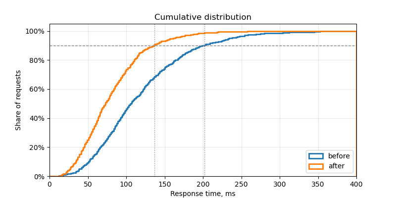

Накопичувальну криву легко читати в обидва боки:

- **по горизонталі** від частки: на рівні 90% — значення 90-го перцентиля (`np.percentile`, лекція 30);
- **по вертикалі** від значення: яка частка запитів швидша за 200 мс.

Крім того, на ній не треба підбирати `bins`: з дуже дрібними інтервалами (тут 400) крива просто стає гладкою.

!!! tip "`ax.ecdf`"
    Починаючи з matplotlib 3.8, є окремий метод `ax.ecdf(data)` — емпірична функція розподілу без інтервалів узагалі. Результат той самий, що `hist(..., cumulative=True, density=True, histtype="step")` з нескінченно дрібними інтервалами.

## Асиметричні дані: логарифмічні інтервали

Доходи, розміри файлів, кількість переглядів — у таких даних більшість значень малі, а кілька — у сотні разів більші. Звичайна гістограма стискає все в один стовпчик біля нуля.

Рішення — логарифмічна вісь `x` (лекція 37) **і** інтервали, рівні в логарифмічному масштабі. `np.logspace(a, b, n)` дає `n` меж від `10**a` до `10**b`:

```python
import matplotlib.pyplot as plt
import numpy as np

rng = np.random.default_rng(10)
# розміри файлів у KB
sizes = rng.lognormal(mean=4, sigma=1.5, size=5000)
print(f"min={sizes.min():.1f}, median={np.median(sizes):.1f}, max={sizes.max():.0f}")

fig, (ax1, ax2) = plt.subplots(1, 2, figsize=(10, 3.6), layout="constrained")

ax1.hist(sizes, bins=50, edgecolor="white")
ax1.set(title="Linear bins", xlabel="File size, KB", ylabel="Files")

edges = np.logspace(-1, 5, 50)
ax2.hist(sizes, bins=edges, edgecolor="white")
ax2.set_xscale("log")
ax2.set(title="Log bins + log x-axis", xlabel="File size, KB")
plt.show()
```

```text
min=0.3, median=51.7, max=13412
```

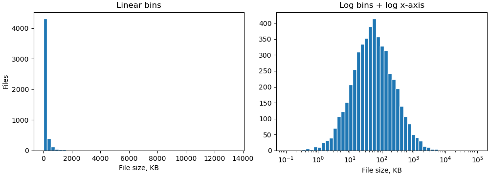

Ліворуч майже всі 5000 файлів в одному стовпчику. Праворуч видно справжню форму: типовий файл — десятки KB, а розкид — від долей KB до десятків MB.

!!! warning "Лише `set_xscale("log")` не досить"
    Якщо залишити `bins=50` (рівні лінійні інтервали) і лише змінити масштаб осі, стовпчики зліва стануть нескінченно вузькими, а справа — широкими. Межі інтервалів мають бути логарифмічними: `np.logspace` або `np.geomspace(min, max, n)`.

Коли проблема не в асиметрії, а в тому, що рідкі значення не видно на тлі частих, допомагає логарифмічна вісь **y**: `ax.hist(..., log=True)`.

## Гістограми в pandas

Для `DataFrame` є два швидкі способи. Обидва — обгортки над `ax.hist`, тож приймають ті самі параметри (`bins`, `edgecolor`, `density`, ...).

```python
import matplotlib.pyplot as plt
import numpy as np
import pandas as pd

rng = np.random.default_rng(11)
df = pd.DataFrame({
    "math": rng.normal(72, 12, size=300).clip(0, 100),
    "physics": rng.normal(65, 15, size=300).clip(0, 100),
    "english": rng.normal(80, 8, size=300).clip(0, 100),
    "group": rng.choice(["KI-31", "KI-32"], size=300),
})

# 1. окремий графік для кожного числового стовпця
axs = df.hist(bins=20, figsize=(10, 3.2), layout=(1, 3), edgecolor="white",
              sharex=True, sharey=True)
plt.show()
```

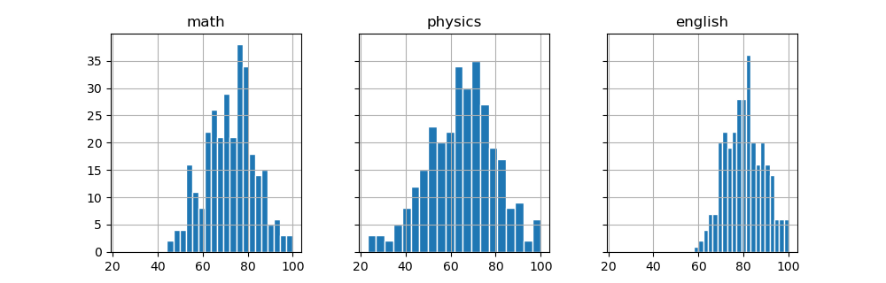

`df.hist()` повертає масив `Axes`, які далі можна налаштовувати звичайними методами. Нечислові стовпці (`group`) ігноруються.

Для порівняння груп зручніше самим пройти по `groupby` (лекція 34) і малювати на одному `Axes`:

```python
import matplotlib.pyplot as plt
import numpy as np
import pandas as pd

rng = np.random.default_rng(11)
df = pd.DataFrame({
    "math": rng.normal(72, 12, size=300).clip(0, 100),
    "group": rng.choice(["KI-31", "KI-32"], size=300),
})
df.loc[df["group"] == "KI-32", "math"] -= 8

edges = np.arange(0, 101, 5)
fig, ax = plt.subplots(figsize=(8, 3.8))
for name, part in df.groupby("group"):
    ax.hist(part["math"], bins=edges, histtype="step", linewidth=2,
            label=f"{name} (median {part['math'].median():.0f})")
ax.set(title="Math score by group", xlabel="Score", ylabel="Students")
ax.legend(loc="upper left")
plt.show()
```

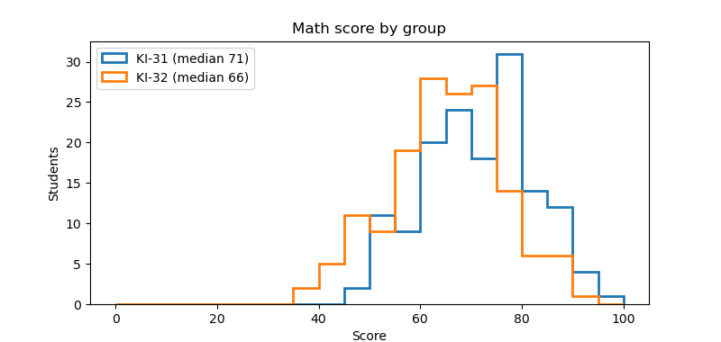

## Scatter: розмір, колір, прозорість

Тепер — діаграма розсіювання. Кожна точка — один об'єкт (студент, квартира, запит), її положення — значення двох величин.

`ax.scatter(x, y, ...)` приймає параметри, які можуть бути **одним значенням** для всіх точок або **масивом** — окремим значенням для кожної:

| Параметр | Що задає | Приклад |
|---|---|---|
| `s` | площа маркера в пунктах² | `s=20`, `s=sizes` |
| `c` / `color` | колір | `color="tab:red"`, `c=values` |
| `marker` | форма | `"o"`, `"s"`, `"^"`, `"x"`, `"D"` |
| `alpha` | прозорість 0–1 | `alpha=0.5` |
| `edgecolors` | колір обводки | `edgecolors="white"`, `"black"` |
| `linewidths` | товщина обводки | `linewidths=0.5` |

```python
import matplotlib.pyplot as plt
import numpy as np

rng = np.random.default_rng(12)
x = rng.uniform(0, 10, size=60)
y = 2 * x + rng.normal(0, 3, size=60)

fig, axs = plt.subplots(1, 3, figsize=(11, 3.4), sharey=True, layout="constrained")

axs[0].scatter(x, y)
axs[0].set_title("default")

axs[1].scatter(x, y, s=80, color="tab:orange", edgecolors="black", linewidths=0.5)
axs[1].set_title("s=80, edgecolors")

axs[2].scatter(x, y, s=60, marker="D", color="tab:green", alpha=0.5)
axs[2].set_title('marker="D", alpha=0.5')
plt.show()
```

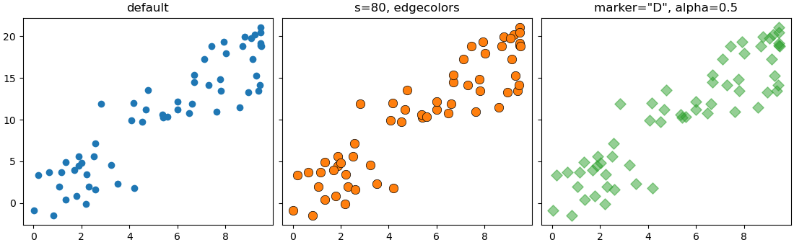

!!! note "`s` — це площа, а не радіус"
    `s=40` — у 4 рази більша площа, ніж `s=10`, але діаметр лише вдвічі більший. Так і має бути: око порівнює площі. Якщо розмір кодує величину, передавайте в `s` значення, **пропорційні** величині, а не її квадрату.

### `scatter` чи `plot(..., "o")`?

Точки можна намалювати і через `ax.plot(x, y, "o")` — без ліній, лише маркери. Це швидше для великих масивів (100 000+ точок), але розмір і колір — одні для всіх. Правило:

- усі точки однакові → `plot(x, y, "o")` або `scatter`;
- розмір або колір залежить від даних → лише `scatter`.

## Колір як третя величина: `cmap` і `colorbar`

Якщо передати в `c` **масив чисел**, matplotlib перетворить кожне число на колір за **колірною картою** (colormap). Так на площині можна показати третю величину:

```python
import matplotlib.pyplot as plt
import numpy as np

rng = np.random.default_rng(13)
n = 150
# координати метеостанцій і висота над рівнем моря
lon = rng.uniform(22, 40, size=n)
lat = rng.uniform(44.5, 52.3, size=n)
altitude = np.clip(1800 * np.exp(-((lon - 24) ** 2 + (lat - 48.3) ** 2) / 3)
                   + rng.normal(150, 60, size=n), 0, None)

fig, ax = plt.subplots(figsize=(8, 4.5))
sc = ax.scatter(lon, lat, c=altitude, cmap="viridis", s=40,
                edgecolors="white", linewidths=0.4)
fig.colorbar(sc, ax=ax, label="Altitude, m")
ax.set(title="Weather stations", xlabel="Longitude", ylabel="Latitude")
ax.set_aspect(1.4)
plt.show()
```

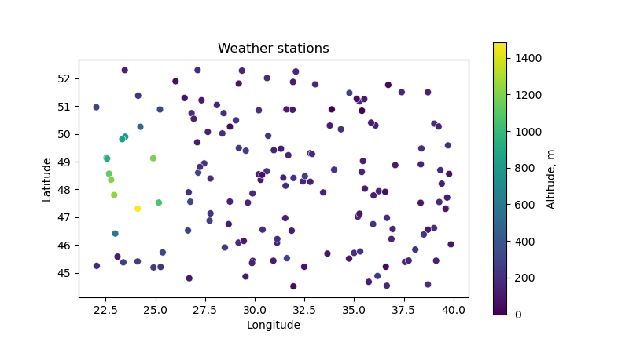

- `c=altitude` — числа, з яких береться колір;
- `cmap="viridis"` — яку шкалу кольорів використовувати;
- `ax.scatter` повертає об'єкт `PathCollection` — його передаємо у `fig.colorbar`, щоб намалювати шкалу з підписами.

Без `colorbar` колір не можна прочитати: незрозуміло, яка висота відповідає жовтому.

### Вибір колірної карти

```python
import matplotlib.pyplot as plt
import numpy as np

cmaps = {
    "sequential": ["viridis", "Blues", "magma"],
    "diverging": ["RdBu_r", "coolwarm", "PiYG"],
    "qualitative": ["tab10", "Set2", "Paired"],
}
gradient = np.linspace(0, 1, 256).reshape(1, -1)

fig, axs = plt.subplots(9, 1, figsize=(7, 4), layout="constrained")
i = 0
for kind, names in cmaps.items():
    for name in names:
        axs[i].imshow(gradient, aspect="auto", cmap=name)
        axs[i].set_axis_off()
        axs[i].text(-0.01, 0.5, f"{kind}: {name}", transform=axs[i].transAxes,
                    ha="right", va="center", fontsize=9)
        i += 1
plt.show()
```

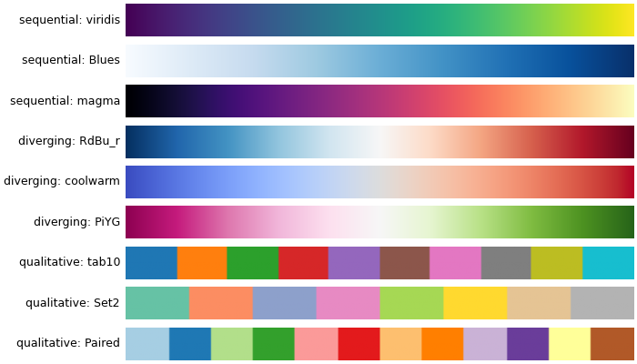

| Тип | Коли | Приклади |
|---|---|---|
| **послідовна** (sequential) | від меншого до більшого: висота, ціна, щільність | `viridis`, `plasma`, `Blues`, `Greens` |
| **розбіжна** (diverging) | відхилення від центру: вище/нижче норми, прибуток/збиток | `RdBu_r`, `coolwarm`, `PiYG` |
| **якісна** (qualitative) | категорії без порядку | `tab10`, `Set2` — але для категорій краще окремі `scatter` (наступний розділ) |

!!! warning "Не використовуйте `jet` і `rainbow`"
    Веселкові карти мають яскраві «смуги» (жовту, блакитну), які око сприймає як межі, хоча в даних їх немає. До того ж на чорно-білому друку вони нечитабельні. `viridis` — рівномірна за яскравістю і читабельна для людей із порушенням кольорового зору.

Для розбіжної карти центр шкали має збігатися з «нулем» — нормою, нульовим прибутком. Задайте симетричні межі `vmin`, `vmax`:

```python
import matplotlib.pyplot as plt
import numpy as np

rng = np.random.default_rng(14)
month = rng.integers(1, 13, size=200)
day = rng.integers(1, 29, size=200)
# відхилення температури від норми
anomaly = rng.normal(0.8, 2.5, size=200)

limit = np.abs(anomaly).max()
fig, ax = plt.subplots(figsize=(8, 4))
sc = ax.scatter(month, day, c=anomaly, cmap="RdBu_r", vmin=-limit, vmax=limit,
                s=50, edgecolors="0.3", linewidths=0.3)
fig.colorbar(sc, ax=ax, label="Deviation from norm, C")
ax.set(title="Temperature anomaly", xlabel="Month", ylabel="Day", xticks=range(1, 13))
plt.show()
```

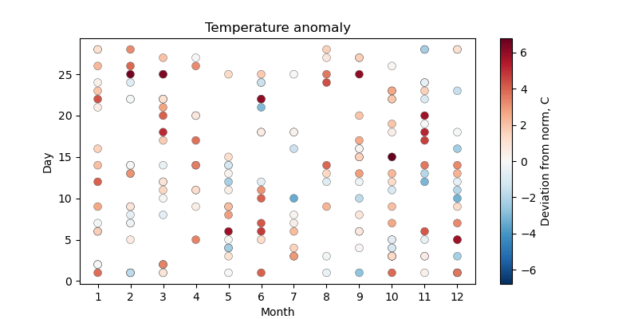

Без `vmin=-limit, vmax=limit` білий колір відповідав би не нулю, а середині діапазону даних (тут близько +0.8), і «трохи тепліше за норму» виглядало б як «норма».

`_r` у назві — обернена карта: `RdBu` — від червоного до синього, `RdBu_r` — від синього (холодно) до червоного (тепло).

## Категорії на scatter

Для категорій (місто, група, тип) не передавайте коди категорій у `c=` з колірною картою — вийде шкала, якої немає. Правильний шлях — **окремий `scatter` для кожної категорії** з власним `label`:

```python
import matplotlib.pyplot as plt
import numpy as np
import pandas as pd

rng = np.random.default_rng(15)
rows = []
for species, (length, width) in {"setosa": (1.5, 0.25),
                                 "versicolor": (4.3, 1.3),
                                 "virginica": (5.5, 2.0)}.items():
    for _ in range(50):
        rows.append({"species": species,
                     "petal_length": rng.normal(length, 0.4),
                     "petal_width": rng.normal(width, 0.2)})
df = pd.DataFrame(rows)

markers = {"setosa": "o", "versicolor": "s", "virginica": "^"}

fig, ax = plt.subplots(figsize=(7, 4.5))
for species, part in df.groupby("species"):
    ax.scatter(part["petal_length"], part["petal_width"],
               marker=markers[species], s=35, alpha=0.8, label=species)
ax.set(title="Iris petals", xlabel="Petal length, cm", ylabel="Petal width, cm")
ax.legend(title="Species")
ax.grid(True, alpha=0.3)
plt.show()
```

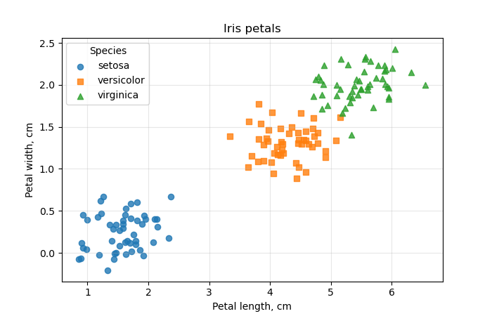

Кожен виклик `scatter` бере наступний колір із циклу кольорів (лекція 37), а `legend` автоматично збирає підписи. Різні маркери дублюють колір — графік читається і на чорно-білому друку.

## Бульбашкова діаграма: легенда розмірів

Розмір точки `s` може кодувати **четверту** величину. Такий графік називають бульбашковим (bubble chart):

```python
import matplotlib.pyplot as plt
import numpy as np

countries = ["UA", "PL", "DE", "FR", "IT", "ES", "RO", "CZ", "HU", "NL"]
gdp_per_capita = [5.2, 22.1, 52.7, 44.4, 38.4, 33.5, 18.5, 30.5, 22.1, 62.5]
life_expectancy = [73.0, 78.6, 81.2, 83.1, 83.7, 83.9, 76.6, 79.8, 76.9, 82.0]
population = [37.0, 36.7, 84.5, 68.2, 58.9, 48.4, 19.0, 10.9, 9.6, 17.9]
internet = [79, 87, 93, 86, 86, 95, 89, 85, 91, 97]

fig, ax = plt.subplots(figsize=(8.5, 5), layout="constrained")
sc = ax.scatter(gdp_per_capita, life_expectancy,
                s=np.array(population) * 15, c=internet, cmap="viridis",
                alpha=0.7, edgecolors="black", linewidths=0.5)

for name, x, y in zip(countries, gdp_per_capita, life_expectancy):
    ax.annotate(name, (x, y), xytext=(0, 0), textcoords="offset points",
                ha="center", va="center", fontsize=8)

fig.colorbar(sc, ax=ax, label="Internet users, %")

# легенда розмірів: кружки для 10, 40 і 80 млн
handles, labels = sc.legend_elements(prop="sizes", num=[10, 40, 80],
                                     func=lambda s: s / 15, alpha=0.5, color="0.5")
ax.legend(handles, labels, title="Population, mln", loc="lower right",
          labelspacing=1.6, borderpad=1.2)

ax.set(title="GDP, life expectancy, population, internet (2023, approx.)",
       xlabel="GDP per capita, thousand USD", ylabel="Life expectancy, years",
       xlim=(0, 70), ylim=(71, 86))
ax.grid(True, alpha=0.3)
plt.show()
```

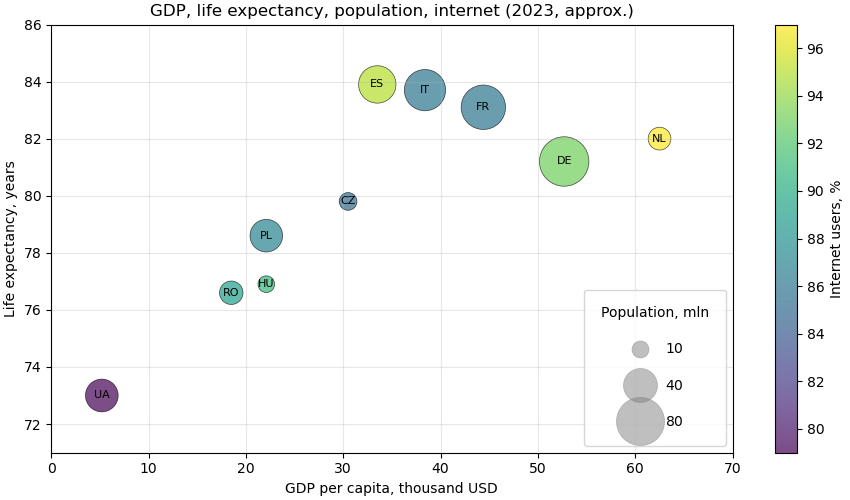

На одному графіку чотири величини: `x` — ВВП, `y` — тривалість життя, розмір — населення, колір — частка користувачів інтернету.

`sc.legend_elements(prop="sizes", ...)` створює «зразки» кружків для легенди:

- `num=[10, 40, 80]` — які значення показати (в одиницях після `func`, тобто в мільйонах);
- `func=lambda s: s / 15` — як перерахувати `s` назад у населення для підписів (ми множили на 15);
- `labelspacing`, `borderpad` — більше місця, щоб великі кружки не налазили один на одного.

!!! tip "Бульбашки — обережно"
    Око погано порівнює площі: різницю між 40 і 50 млн на бульбашках не видно. Використовуйте розмір лише для приблизного порядку величини, а важливі числа підписуйте.

## Перекриття точок: `alpha`, `hist2d`, `hexbin`

Коли точок тисячі, вони лягають одна на одну (overplotting). Хмара стає суцільною плямою, і не видно, де точок насправді більше.

```python
import matplotlib.pyplot as plt
import numpy as np

rng = np.random.default_rng(16)
n = 30000
x = rng.normal(0, 1, size=n)
y = 0.6 * x + rng.normal(0, 0.8, size=n)
# невелика окрема група всередині хмари
x = np.concatenate([x, rng.normal(1.2, 0.2, size=2500)])
y = np.concatenate([y, rng.normal(-0.6, 0.2, size=2500)])

fig, axs = plt.subplots(2, 2, figsize=(10, 8), sharex=True, sharey=True,
                        layout="constrained")

axs[0, 0].scatter(x, y, s=5)
axs[0, 0].set_title("scatter: solid blob")

axs[0, 1].scatter(x, y, s=2, alpha=0.05, color="black")
axs[0, 1].set_title("scatter: s=2, alpha=0.05")

*_, img = axs[1, 0].hist2d(x, y, bins=60, cmap="Blues")
fig.colorbar(img, ax=axs[1, 0], label="Points in cell")
axs[1, 0].set_title("hist2d")

hb = axs[1, 1].hexbin(x, y, gridsize=40, cmap="Blues", mincnt=1)
fig.colorbar(hb, ax=axs[1, 1], label="Points in cell")
axs[1, 1].set_title("hexbin")
plt.show()
```

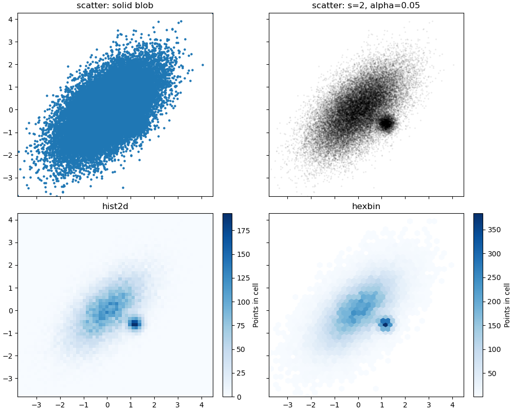

- **`alpha` + малий `s`** — найпростіше: там, де точок багато, колір темніший. Підходить до ~50 000 точок;
- **`hist2d(x, y, bins=...)`** — двовимірна гістограма: площина ділиться на прямокутні клітинки, колір — кількість точок у клітинці. Повертає `(counts, xedges, yedges, image)`; для `colorbar` потрібен останній елемент;
- **`hexbin(x, y, gridsize=...)`** — те саме з шестикутними клітинками, вони краще передають форму хмари. `mincnt=1` не зафарбовує порожні клітинки.

На першому графіку окрема група всередині хмари зовсім не видна: точки просто зафарбовують одне й те саме місце. На `hist2d` і `hexbin` вона — друга темна пляма поруч із центром.

!!! tip "Логарифмічна шкала кольору"
    Якщо в центрі тисячі точок, а по краях одиниці, краї будуть майже білими. `hexbin(..., bins="log")` або `hist2d(..., norm="log")` робить шкалу кольору логарифмічною.

## Лінія тренду і кореляція

### Коефіцієнт кореляції

`np.corrcoef(x, y)` повертає матрицю 2×2; коефіцієнт кореляції Пірсона — елемент `[0, 1]`. Він від −1 до 1 і показує, наскільки точки близькі до **прямої**:

```python
import matplotlib.pyplot as plt
import numpy as np

rng = np.random.default_rng(17)
x = rng.uniform(-3, 3, size=200)
cases = {
    "strong positive": 2 * x + rng.normal(0, 1, size=200),
    "weak negative": -0.5 * x + rng.normal(0, 2, size=200),
    "none": rng.normal(0, 2, size=200),
    "nonlinear": x ** 2 + rng.normal(0, 0.5, size=200),
}

fig, axs = plt.subplots(1, 4, figsize=(12, 3.2), layout="constrained")
for ax, (title, y) in zip(axs, cases.items()):
    r = np.corrcoef(x, y)[0, 1]
    ax.scatter(x, y, s=8, alpha=0.6)
    ax.set_title(f"{title}\nr = {r:.2f}")
    ax.set_xticks([])
    ax.set_yticks([])
plt.show()
```

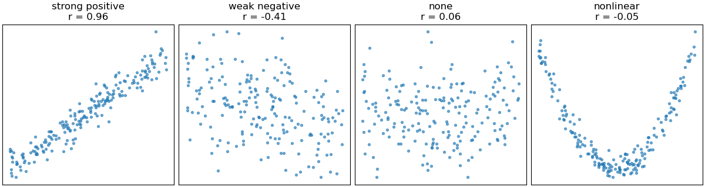

Останній графік — важливий урок: залежність сильна (парабола), а `r ≈ 0`. Коефіцієнт кореляції бачить лише **лінійний** зв'язок. Тому завжди дивіться на scatter, а не лише на число.

### Пряма тренду: `np.polyfit`

`np.polyfit(x, y, deg)` знаходить поліном степеня `deg`, найближчий до точок (метод найменших квадратів). Для прямої `deg=1`, результат — `[нахил, зсув]`:

```python
import matplotlib.pyplot as plt
import numpy as np

rng = np.random.default_rng(18)
hours = rng.uniform(0, 10, size=60)
score = 40 + 5 * hours + rng.normal(0, 6, size=60)

slope, intercept = np.polyfit(hours, score, deg=1)
r = np.corrcoef(hours, score)[0, 1]
print(f"score = {slope:.2f} * hours + {intercept:.2f}, r = {r:.2f}")

x_line = np.linspace(0, 10, 100)
y_line = slope * x_line + intercept

fig, ax = plt.subplots(figsize=(7, 4.5))
ax.scatter(hours, score, alpha=0.7, label="students")
ax.plot(x_line, y_line, color="tab:red", linewidth=2,
        label=f"trend: {slope:.1f} points per hour")
ax.text(0.03, 0.95, f"r = {r:.2f}", transform=ax.transAxes, va="top")
ax.set(title="Study hours vs score", xlabel="Hours", ylabel="Score")
ax.legend(loc="lower right")
ax.grid(True, alpha=0.3)
plt.show()
```

```text
score = 4.49 * hours + 41.73, r = 0.93
```

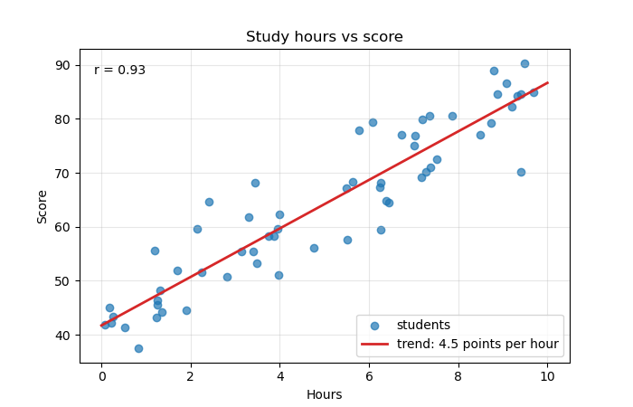

Нахил 4.49 читається так: кожна додаткова година підготовки в середньому дає +4.5 бала. `np.polyval(coefs, x)` обчислює поліном у точках — зручно для `deg=2` і вище:

```python
import numpy as np

rng = np.random.default_rng(19)
x = rng.uniform(-3, 3, size=100)
y = x ** 2 + rng.normal(0, 0.5, size=100)

coefs = np.polyfit(x, y, deg=2)
print(coefs.round(2))
print(np.polyval(coefs, [0, 1, 2]).round(2))
```

```text
[ 0.98 -0.03  0.07]
[0.07 1.02 3.92]
```

!!! warning "Кореляція — не причинність"
    Продаж морозива і кількість утоплень корелюють: обидва ростуть улітку. Scatter і `r` показують, що величини змінюються разом, але не показують, що одна спричиняє іншу. І не продовжуйте лінію тренду далеко за межі даних: 20 годин підготовки не дадуть 140 балів зі 100.

## Scatter з гістограмами на полях

Scatter показує зв'язок, але погано показує розподіл кожної величини окремо: 500 точок в одному місці виглядають так само, як 50. Класичне рішення — гістограми на полях (marginal histograms).

Зручно зібрати таку фігуру через `fig.subplot_mosaic` — компонування задається «малюнком» із літер:

```python
import matplotlib.pyplot as plt
import numpy as np

rng = np.random.default_rng(20)
area = rng.lognormal(np.log(55), 0.35, size=600)
price = area * rng.normal(1.6, 0.3, size=600)

fig, axd = plt.subplot_mosaic(
    [["top", "."],
     ["main", "right"]],
    width_ratios=[4, 1], height_ratios=[1, 4],
    figsize=(7, 7), layout="constrained",
)
ax, ax_top, ax_right = axd["main"], axd["top"], axd["right"]
# спільні осі з головним графіком
ax_top.sharex(ax)
ax_right.sharey(ax)

ax.scatter(area, price, s=10, alpha=0.4)
ax.set(xlabel="Area, m2", ylabel="Price, thousand USD")

ax_top.hist(area, bins=40, color="0.6")
ax_right.hist(price, bins=40, color="0.6", orientation="horizontal")

for a in (ax_top, ax_right):
    a.spines[["top", "right"]].set_visible(False)
ax_top.tick_params(labelbottom=False)
ax_right.tick_params(labelleft=False)
fig.suptitle("Apartments: area vs price")
plt.show()
```

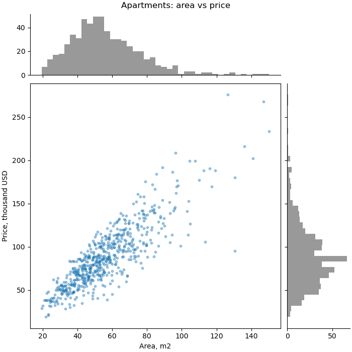

- кожен рядок списку — рядок сітки, кожна літера (рядок) — назва `Axes`; однакові назви поруч об'єднуються в один великий `Axes`, `"."` — порожня клітинка;
- `axd` — словник `{назва: Axes}`;
- `width_ratios`, `height_ratios` — відносні розміри колонок і рядків;
- `sharex` / `sharey` — гістограми зсуваються і масштабуються разом із головним графіком;
- `orientation="horizontal"` — гістограма «лежить» на боці, стовпчики йдуть праворуч.

## Приклад: ринок квартир

Зберемо все разом. Згенеруємо дані про продаж квартир у п'яти районах і відповімо на кілька питань одним рисунком:

1. Який розподіл ціни за м²?
2. Як ціна залежить від площі, і чи відрізняються райони?
3. Як ціна за м² залежить від поверху й віку будинку?

```python
import matplotlib.pyplot as plt
import numpy as np
import pandas as pd
from matplotlib.ticker import PercentFormatter

rng = np.random.default_rng(2025)

# 1. дані: базова ціна за m2 (тис. USD) для кожного району
districts = {"Center": 2.6, "Pechersk": 3.1, "Obolon": 1.6,
             "Troieshchyna": 1.0, "Holosiiv": 1.7}
rows = []
for district, base in districts.items():
    n = 160
    area = rng.lognormal(np.log(58), 0.35, size=n).clip(18, 200)
    age = rng.integers(0, 70, size=n)
    floor = rng.integers(1, 26, size=n)
    price_m2 = base * (1 - 0.006 * age) * rng.normal(1, 0.12, size=n)
    rows.append(pd.DataFrame({"district": district, "area": area, "age": age,
                              "floor": floor, "price_m2": price_m2}))
df = pd.concat(rows, ignore_index=True)
df["price"] = df["area"] * df["price_m2"]

print(df.groupby("district")["price_m2"].median().sort_values().round(2))
r = np.corrcoef(df["area"], df["price"])[0, 1]
print(f"corr(area, price) = {r:.2f}")

# 2. рисунок
fig, axd = plt.subplot_mosaic([["hist", "scatter"],
                               ["age", "scatter"]],
                              figsize=(12, 7), width_ratios=[1, 1.4],
                              layout="constrained")

# гістограма ціни за m2, частки у відсотках
edges = np.arange(0, 4.01, 0.1)
ax = axd["hist"]
ax.hist(df["price_m2"], bins=edges, weights=np.ones(len(df)) / len(df),
        color="0.6", edgecolor="white")
ax.axvline(df["price_m2"].median(), color="tab:red", linestyle="--",
           label=f"median {df['price_m2'].median():.2f}")
ax.yaxis.set_major_formatter(PercentFormatter(xmax=1))
ax.set(title="Price per m2", xlabel="Thousand USD per m2", ylabel="Share of flats")
ax.legend()

# площа проти ціни, район - колір
ax = axd["scatter"]
order = df.groupby("district")["price_m2"].median().sort_values(ascending=False).index
for district in order:
    part = df[df["district"] == district]
    ax.scatter(part["area"], part["price"], s=14, alpha=0.6, label=district)
    k = np.polyfit(part["area"], part["price"], deg=1)
    x = np.array([part["area"].min(), part["area"].max()])
    ax.plot(x, np.polyval(k, x), linewidth=1.5)
ax.set(title=f"Area vs price (r = {r:.2f})", xlabel="Area, m2",
       ylabel="Price, thousand USD")
ax.legend(title="District", loc="upper left")
ax.grid(True, alpha=0.3)

# вік будинку проти ціни за m2, колір - поверх
ax = axd["age"]
sc = ax.scatter(df["age"], df["price_m2"], c=df["floor"], cmap="viridis",
                s=10, alpha=0.7)
fig.colorbar(sc, ax=ax, label="Floor")
ax.set(title="Building age vs price per m2", xlabel="Building age, years",
       ylabel="Thousand USD per m2")

fig.suptitle("Apartment market (simulated data)", fontweight="bold")
fig.savefig("apartments.png", dpi=150)
plt.show()
```

```text
district
Troieshchyna    0.79
Obolon          1.24
Holosiiv        1.29
Center          2.02
Pechersk        2.37
Name: price_m2, dtype: float64
corr(area, price) = 0.65
```

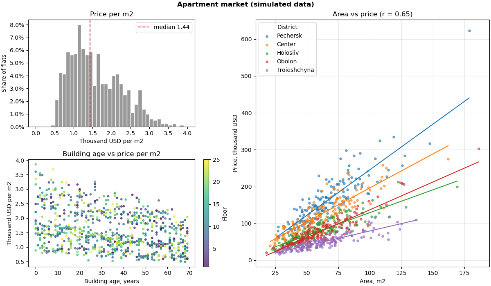

Що видно:

- **гістограма** — широкий розподіл із довгим правим хвостом і «плечем» біля 2–2.5: це суміш дешевих і дорогих районів; одна медіана тут мало що каже;
- **scatter площа — ціна** — загальна кореляція лише 0.65, але в кожному районі точки лежать майже на прямій. Низьке `r` — не через відсутність зв'язку, а через суміш груп з різним нахилом. Райони в легенді впорядковані за медіанною ціною — так само, як «віяло» ліній на графіку;
- **вік — ціна за м²** — старші будинки дешевші; кольори поверхів перемішані — поверх на ціну майже не впливає.

Що тут використано:

- `subplot_mosaic` — великий scatter праворуч і два менші графіки ліворуч;
- `weights` + `PercentFormatter` — частки замість кількості;
- `groupby` + окремий `scatter` для кожного району — категорії з легендою;
- `np.polyfit` / `np.polyval` — лінія тренду для кожної групи;
- `c=` + `cmap` + `colorbar` — третя величина кольором.

## Типові помилки

**`hist` без `bins`.** Завжди 10 інтервалів, незалежно від обсягу даних. Задавайте `bins` явно: число, правило (`"auto"`) або масив меж.

**Різні `bins` для наборів, які порівнюють.** Стовпчики різної ширини неможливо зіставити. Обчисліть спільні межі: `np.histogram_bin_edges(np.concatenate([a, b]), bins=...)`.

**Кількість замість частки для вибірок різного розміру.** Маленька група на тлі великої «зникає». Нормуйте: `weights=np.ones(n) / n` або `density=True`.

**`density=True`, а читають як відсотки.** Висота при `density` — частка, поділена на ширину інтервалу. Вона може бути більшою за 1. Для відсотків — `weights`.

**Межі інтервалів на цілих значеннях.** Для цілих даних межі — між цілими (`np.arange(0.5, 11.5, 1)`), або просто `np.unique` + `bar`.

**`set_xscale("log")` з лінійними інтервалами.** Інтервали мають бути логарифмічними: `np.logspace` / `np.geomspace`.

**`stacked=True` для порівняння форм.** Форму верхнього набору не видно. Для порівняння — `histtype="step"`.

**Категорії через `c=` і колірну карту.** Шкала кольорів вигадує порядок, якого немає. Для категорій — окремий `scatter` на кожну з `label`.

**Колірна карта без `colorbar`.** Колір не можна прочитати. `fig.colorbar(sc, ax=ax, label=...)`.

**`jet` / `rainbow`.** Хибні межі і проблеми з кольоровим зором. Послідовні дані — `viridis`, відхилення від нуля — `RdBu_r` із симетричними `vmin`/`vmax`.

**Тисячі точок без `alpha`.** Суцільна пляма. Малий `s` + `alpha`, або `hexbin` / `hist2d`.

**`s` пропорційно квадрату величини.** `s` — уже площа. Для бульбашок `s` ∝ величині.

**Висновки лише з `r`.** Нелінійний зв'язок дає `r ≈ 0`, суміш груп — занижене `r`. Спершу scatter, потім число.

**`np.corrcoef(x, y)` як число.** Це матриця 2×2; коефіцієнт — `np.corrcoef(x, y)[0, 1]`.

## Підсумок

- **Гістограма** — розподіл однієї величини; **scatter** — зв'язок двох. Середнє і `r` не замінюють графік.
- **`bins`:** завжди явно; число, правило (`"auto"`, `"fd"`, `"sturges"`) або масив меж `np.arange(...)`. Інтервали `[a, b)`, останній — `[a, b]`. Мало різних значень — `np.unique` + `bar`.
- **Нормування:** `weights=np.ones(n)/n` + `PercentFormatter` — частки; `density=True` — площа 1, для теоретичних кривих і різної ширини інтервалів.
- **Порівняння:** спільні межі; `alpha`, `histtype="step"`, список масивів, `stacked=True` (лише частини цілого); багато наборів — `subplots(..., sharex=True)`.
- **`cumulative=True`** — накопичувальний розподіл, перцентилі; `ax.ecdf`.
- **Асиметричні дані:** `np.logspace` + `set_xscale("log")`; `log=True` — логарифмічна вісь y.
- **pandas:** `df.hist(bins=...)`; `groupby` + `ax.hist` для груп.
- **`scatter`:** `s` (площа), `c`/`color`, `marker`, `alpha`, `edgecolors`; масиви — окреме значення для кожної точки.
- **Колір — величина:** `c=values`, `cmap`, `vmin`/`vmax`, `fig.colorbar(sc, ax=ax)`; послідовні — `viridis`, розбіжні — `RdBu_r`, без `jet`.
- **Категорії:** окремий `scatter` для кожної групи + `legend`; маркер дублює колір.
- **Бульбашки:** `s` ∝ величині; `sc.legend_elements(prop="sizes", func=...)` — легенда розмірів.
- **Багато точок:** `alpha` + малий `s`, `hist2d`, `hexbin(..., mincnt=1)`.
- **Зв'язок:** `np.corrcoef(x, y)[0, 1]` — лише лінійний; `np.polyfit(x, y, deg)` + `np.polyval` — тренд.
- **Поля:** `plt.subplot_mosaic` + `sharex`/`sharey` + `orientation="horizontal"`.

## Корисні посилання

- [matplotlib: `Axes.hist`](https://matplotlib.org/stable/api/_as_gen/matplotlib.axes.Axes.hist.html)
- [Histograms (gallery)](https://matplotlib.org/stable/gallery/statistics/hist.html)
- [`numpy.histogram_bin_edges`](https://numpy.org/doc/stable/reference/generated/numpy.histogram_bin_edges.html)
- [matplotlib: `Axes.scatter`](https://matplotlib.org/stable/api/_as_gen/matplotlib.axes.Axes.scatter.html)
- [Scatter plot with a legend](https://matplotlib.org/stable/gallery/lines_bars_and_markers/scatter_with_legend.html)
- [Choosing colormaps](https://matplotlib.org/stable/users/explain/colors/colormaps.html)
- [Hexagonal binned plot](https://matplotlib.org/stable/gallery/statistics/hexbin_demo.html)
- [Scatter plot with histograms](https://matplotlib.org/stable/gallery/lines_bars_and_markers/scatter_hist.html)
- [Complex and semantic figure composition (`subplot_mosaic`)](https://matplotlib.org/stable/users/explain/axes/mosaic.html)
