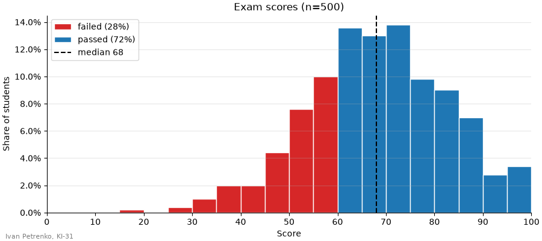
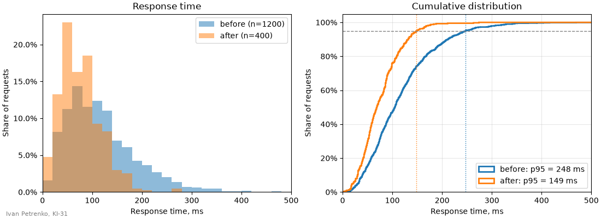
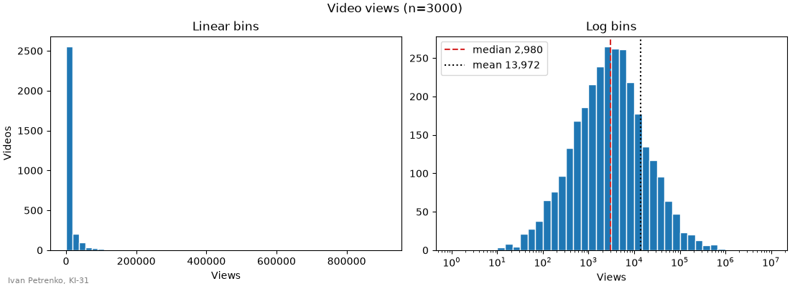

# 40. (П18) Гістограми та scatter plots

## Передумови

- Прочитана [Лекція 39 — Гістограми та scatter plots у matplotlib](/ua/courses/programming-3sem/module4/39-histograms-scatter-lecture/)
- Встановлені бібліотеки: `pip install matplotlib numpy pandas`

!!! warning "Мова в коді"
    Усі рядкові літерали, заголовки та підписи графіків, імена файлів і змінних — **лише латиницею**. Кирилиця допускається тільки в коментарях.

## Завдання

Для кожного завдання дано картинку та вхідні дані. Потрібно написати код, який малює **такий самий** графік: ті самі інтервали гістограм, кольори, маркери, осі, підписи поділок, легенди, шкали кольорів і розташування елементів.

- кожне завдання — окремий файл `task_1.py`, `task_2.py`, ...;
- кожен скрипт зберігає графік у файл `task_1.png`, `task_2.png`, ...;
- у лівому нижньому куті кожної фігури — ваше ім'я та група (на зразках — `Ivan Petrenko, KI-31`);
- усі числа в легендах і підписах (медіана, відсотки, перцентилі, `r`, показник степеня) **обчислюються в коді**, а не вписуються вручну.

## Завдання 1

Розмір фігури: 9 × 4. Інтервали — по 5 балів. Висота стовпчика — частка від **усіх** студентів.



```python
import numpy as np

rng = np.random.default_rng(40)
scores = np.clip(rng.normal(68, 14, size=500).round(), 0, 100)
pass_score = 60
```

## Завдання 2

Розмір фігури: 11 × 4. Ліворуч інтервали — по 20 ms, праворуч — по 1 ms. Вертикальні пунктирні лінії — 95-й перцентиль кожного набору.



```python
import numpy as np

rng = np.random.default_rng(41)
# час відповіді сервера, ms
before = rng.gamma(3, 40, size=1200)
after = rng.gamma(3, 25, size=400)
```

## Завдання 3

Розмір фігури: 11 × 4. Ліворуч — 50 рівних інтервалів, праворуч — 42 логарифмічні інтервали від 1 до 10<sup>7</sup>.



```python
import numpy as np

rng = np.random.default_rng(42)
# кількість переглядів відео
views = rng.lognormal(mean=8, sigma=1.8, size=3000)
```

