# 41. (Л) Стовпчикові діаграми, стеки, boxplots та інші типи графіків у matplotlib

## Зміст лекції

1. Який графік для якого питання
2. `bar`: правила хорошої стовпчикової діаграми
3. Підписи значень: `bar_label`
4. Згруповані стовпчики
5. Складені стовпчики: `bottom`
6. Стовпчики 100%: частки цілого
7. Від'ємні значення і «водоспад»
8. Похибки: `yerr` і `capsize`
9. Стовпчикові діаграми в pandas
10. Складені площі: `stackplot`
11. Boxplot: п'ять чисел на одному графіку
12. Налаштування `boxplot`
13. Violin plot: форма розподілу
14. Точки поверх boxplot
15. Boxplot у pandas
16. Кругова діаграма: `pie` і «бублик»
17. Теплова карта: `imshow`
18. Lollipop і `stem`
19. Приклад: звіт інтернет-магазину
20. Типові помилки
21. Підсумок

## Який графік для якого питання

У лекціях 35–39 ми працювали з лініями, гістограмами і scatter. Сьогодні — графіки для **категорій** і для **порівняння розподілів між групами**.

| Питання | Графік | Приклад |
|---|---|---|
| Скільки в кожній категорії? | `bar`, `barh` | продажі за містами |
| Як порівняти кілька показників у кожній категорії? | згруповані `bar` | продажі за містами у 2024 і 2025 |
| З чого складається ціле в кожній категорії? | складені `bar` | продажі за містами з розбиттям на товари |
| Як змінюється склад цілого з часом? | `stackplot` | трафік сайту з різних джерел за місяцями |
| Як відрізняються **розподіли** між групами? | `boxplot`, `violinplot` | зарплати в різних відділах |
| Яка частка кожної частини (2–5 частин)? | `pie` | частка платформ: web / android / ios |
| Значення на сітці двох категорій? | `imshow` (теплова карта) | замовлення за днями тижня і годинами |

Головна ідея: **довжина стовпчика і положення точки на спільній осі** — найточніше, що порівнює людське око. Кути (`pie`), площі та кольори (теплова карта) читаються гірше. Тому `bar` — вибір за замовчуванням, а решта — для конкретних задач.

## `bar`: правила хорошої стовпчикової діаграми

Базовий `bar` ми бачили в лекції 35. Повторимо і додамо три правила:

1. Вісь значень **починається з нуля**.
2. Категорії без природного порядку **сортуйте за значенням**.
3. Підсвічуйте кольором лише те, на що треба звернути увагу.

```python
import matplotlib.pyplot as plt
import numpy as np

cities = ["Lviv", "Kyiv", "Odesa", "Dnipro", "Kharkiv", "Vinnytsia"]
sales = [310, 540, 270, 220, 260, 150]

fig, (ax1, ax2) = plt.subplots(1, 2, figsize=(10, 3.6), layout="constrained")

ax1.bar(cities, sales)
ax1.set_title("As is")

# сортування за спаданням
order = np.argsort(sales)[::-1]
sorted_cities = [cities[i] for i in order]
sorted_sales = [sales[i] for i in order]
# сірий для всіх, синій лише для Lviv
colors = ["tab:blue" if c == "Lviv" else "0.75" for c in sorted_cities]

ax2.bar(sorted_cities, sorted_sales, color=colors)
ax2.set_title("Sorted, one city highlighted")

for ax in (ax1, ax2):
    ax.set_ylabel("Sales, thousand UAH")
    ax.spines[["top", "right"]].set_visible(False)
plt.show()
```

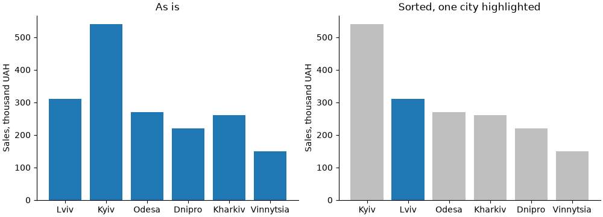

На правому графіку одразу видно, що Львів — другий. На лівому треба порівнювати кожну пару стовпчиків.

- `np.argsort(sales)` повертає індекси, що впорядковують масив за зростанням; `[::-1]` — за спаданням;
- `color` приймає **список** кольорів — по одному на стовпчик;
- `"0.75"` — відтінок сірого (0 — чорний, 1 — білий).

!!! note "Коли сортувати не можна"
    Якщо категорії мають власний порядок — місяці, дні тижня, вікові групи «18–24, 25–34, ...», оцінки 1–5 — зберігайте його. Сортування за значенням зламає читання.

### Позиції, ширина, підписи

Якщо передати в `bar` рядки, matplotlib сам розставить стовпчики в позиціях `0, 1, 2, ...`. Для складніших діаграм (згруповані стовпчики, проміжки між групами) зручніше задавати **числові позиції** і підписи окремо:

```python
import matplotlib.pyplot as plt
import numpy as np

months = ["Jan", "Feb", "Mar", "Apr", "May", "Jun"]
orders = [120, 135, 160, 150, 185, 210]

x = np.arange(len(months))

fig, axs = plt.subplots(1, 3, figsize=(11, 3.2), sharey=True, layout="constrained")

axs[0].bar(x, orders)
axs[0].set_title("width=0.8 (default)")

axs[1].bar(x, orders, width=0.4)
axs[1].set_title("width=0.4")

axs[2].bar(x, orders, width=1.0, edgecolor="white")
axs[2].set_title('width=1.0, edgecolor="white"')

for ax in axs:
    ax.set_xticks(x, months)
plt.show()
```

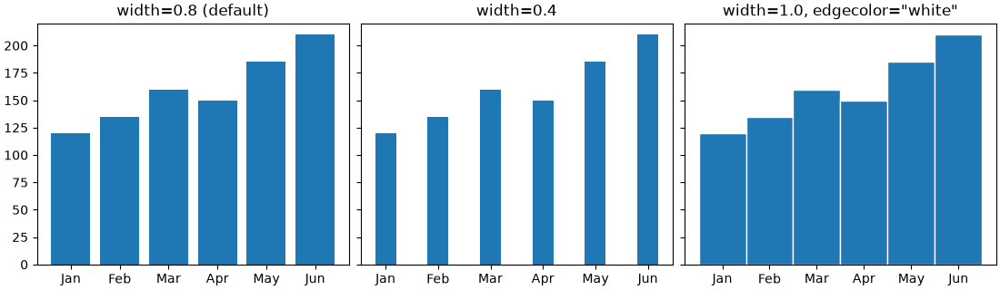

| Параметр | Що задає |
|---|---|
| `x` | позиції центрів стовпчиків (числа або рядки) |
| `height` | висота (другий аргумент) |
| `width` | ширина в одиницях осі `x`; за замовчуванням `0.8` |
| `bottom` | де починається стовпчик (для стеків) |
| `align` | `"center"` (за замовчуванням) або `"edge"` — `x` є лівим краєм |
| `color`, `edgecolor`, `linewidth` | заливка, обводка, товщина обводки |
| `hatch` | штрихування: `"/"`, `"\\"`, `"x"`, `"."` |

`ax.set_xticks(x, months)` одним викликом ставить поділки в позиціях `x` і підписує їх.

## Підписи значень: `bar_label`

`ax.bar` повертає контейнер стовпчиків `BarContainer`. Його передають у `ax.bar_label`, щоб підписати кожен стовпчик:

```python
import matplotlib.pyplot as plt

languages = ["Python", "JavaScript", "Java", "C#", "C++", "Go"]
share = [31.4, 22.8, 15.1, 11.2, 9.6, 4.3]

fig, ax = plt.subplots(figsize=(7, 3.8), layout="constrained")
bars = ax.barh(languages, share, color="tab:blue")
ax.bar_label(bars, fmt="{:.1f}%", padding=3)
ax.invert_yaxis()
ax.set_xlim(0, 36)
# коли є підписи, вісь x не потрібна
ax.xaxis.set_visible(False)
ax.spines[["top", "right", "bottom"]].set_visible(False)
ax.set_title("Most used language among students")
plt.show()
```

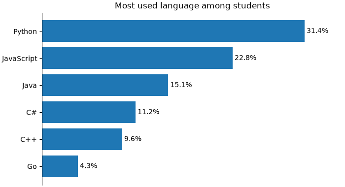

| Параметр `bar_label` | Що робить |
|---|---|
| `fmt` | формат: рядок у стилі `str.format` (`"{:.1f}%"`, `"{:,.0f}"`) |
| `labels` | власні підписи списком — замість значень |
| `padding` | відступ від кінця стовпчика в пунктах |
| `label_type` | `"edge"` (за замовчуванням) — біля кінця, `"center"` — посередині стовпчика |
| `color`, `fontsize`, `fontweight` | оформлення тексту |

`ax.set_xlim(0, 36)` залишає місце праворуч, щоб підпис найдовшого стовпчика не виліз за межі.

Якщо підписи на стовпчиках є, вісь значень і сітка часто зайві — числа вже на графіку. Це робить діаграму чистішою.

## Згруповані стовпчики

Задача: порівняти продажі в містах за три роки. Для кожного міста — група з трьох стовпчиків поруч.

matplotlib не має окремої функції для цього. Ми самі зсуваємо кожен набір стовпчиків відносно центру групи:

```python
import matplotlib.pyplot as plt
import numpy as np

cities = ["Kyiv", "Lviv", "Odesa", "Kharkiv", "Dnipro"]
sales = {
    "2023": [420, 250, 230, 200, 190],
    "2024": [480, 290, 240, 230, 200],
    "2025": [540, 310, 270, 260, 220],
}

x = np.arange(len(cities))
n = len(sales)
# ширина одного стовпчика: група займає 0.8, решта - проміжок
width = 0.8 / n

fig, ax = plt.subplots(figsize=(9, 4), layout="constrained")
for i, (year, values) in enumerate(sales.items()):
    # зсув від центру групи: -width, 0, +width
    offset = (i - (n - 1) / 2) * width
    bars = ax.bar(x + offset, values, width, label=year)
    ax.bar_label(bars, padding=2, fontsize=8)

ax.set_xticks(x, cities)
ax.set(title="Sales by city", ylabel="Sales, thousand UAH", ylim=(0, 600))
ax.legend(title="Year", loc="upper right", ncols=3)
ax.spines[["top", "right"]].set_visible(False)
plt.show()
```

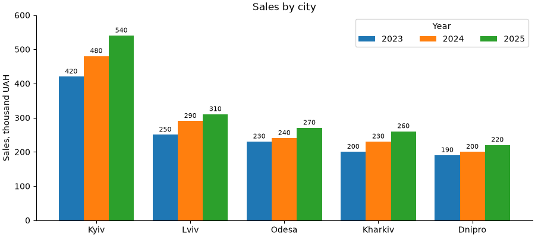

Формула зсуву `(i - (n - 1) / 2) * width` працює для будь-якого `n`:

| `n` | `i` | зсув (в одиницях `width`) |
|---|---|---|
| 2 | 0, 1 | −0.5, +0.5 |
| 3 | 0, 1, 2 | −1, 0, +1 |
| 4 | 0, 1, 2, 3 | −1.5, −0.5, +0.5, +1.5 |

!!! tip "Не більше 3–4 стовпчиків у групі"
    Що більше стовпчиків, то важче порівняти потрібні. Якщо наборів 5+, краще кілька окремих графіків (`subplots(..., sharey=True)`) або лінійний графік, якщо це роки.

Групувати можна двома способами — і це різні графіки:

- групи — **міста**, кольори — роки: зручно порівнювати роки **в межах міста** (зростання);
- групи — **роки**, кольори — міста: зручно порівнювати міста **в межах року** (рейтинг).

Спершу визначте, яке порівняння головне, і саме ці стовпчики ставте поруч.

## Складені стовпчики: `bottom`

Складена (stacked) діаграма показує **ціле і його частини**: висота стовпчика — сума, сегменти — складові.

Параметр `bottom` задає, де починається стовпчик. Для стека кожен наступний сегмент починається там, де закінчився попередній. Накопичену суму ведемо у змінній:

```python
import matplotlib.pyplot as plt
import numpy as np

months = ["Jan", "Feb", "Mar", "Apr", "May", "Jun"]
# продажі за категоріями товарів, тис. грн
sales = {
    "Laptops": np.array([210, 190, 230, 250, 240, 280]),
    "Phones": np.array([150, 160, 170, 160, 190, 210]),
    "Accessories": np.array([60, 55, 70, 80, 75, 90]),
}

fig, ax = plt.subplots(figsize=(8, 4.2), layout="constrained")
bottom = np.zeros(len(months))
for category, values in sales.items():
    bars = ax.bar(months, values, bottom=bottom, label=category)
    ax.bar_label(bars, label_type="center", color="white", fontsize=8)
    bottom += values

# підпис загальної суми над стовпчиком
ax.bar_label(bars, labels=[f"{v:.0f}" for v in bottom], padding=3,
             fontweight="bold")
ax.set(title="Sales by category", ylabel="Thousand UAH", ylim=(0, 650))
ax.legend(loc="upper left", ncols=3)
ax.spines[["top", "right"]].set_visible(False)
plt.show()
```

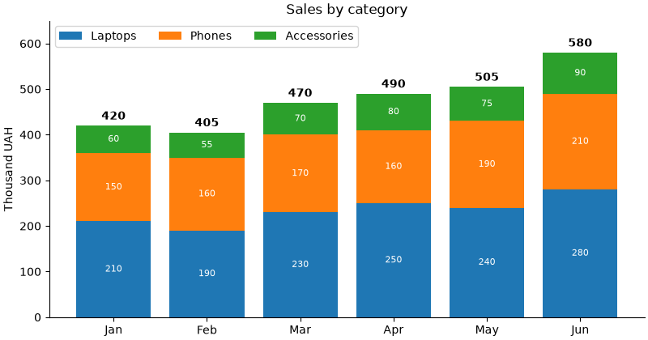

- `bottom = np.zeros(...)` — перший сегмент стоїть на нулі;
- після кожного набору `bottom += values` — наступний стоїть на попередніх;
- після циклу `bottom` — загальна сума; її підписуємо над останнім набором `bars` через `labels=`;
- `label_type="center"` — підписи сегментів посередині.

!!! warning "Порівнювати можна лише нижній сегмент і суму"
    У нижнього сегмента (Laptops) і в суми спільна база — нуль, тож їх легко порівнювати між місяцями. Сегменти вище «стоять» на різній висоті, і порівняти, наприклад, Phones у лютому і травні важко. Найважливішу категорію ставте **внизу**. Якщо треба порівнювати кожну категорію — згруповані стовпчики або окремі графіки.

Порядок легенди і стека: перший набір — внизу стека, але **вгорі** вертикальної легенди. Щоб легенда йшла в тому ж порядку, що й сегменти, оберніть її: `ax.legend(reverse=True)` (matplotlib 3.7+) або через `handles, labels = ax.get_legend_handles_labels()` і `ax.legend(handles[::-1], labels[::-1])` (лекція 37).

## Стовпчики 100%: частки цілого

Коли суми дуже різні, складений графік показує здебільшого різницю сум. Щоб порівняти **склад**, нормуйте кожен стовпчик до 100%.

Приклад: результати опитування студентів «Курс корисний?» за шкалою від «повністю не згоден» до «повністю згоден». Горизонтальні стовпчики зручні для довгих назв:

```python
import matplotlib.pyplot as plt
import numpy as np
from matplotlib.ticker import PercentFormatter

courses = ["Python", "Databases", "Networks", "Math", "English"]
answers = ["Strongly disagree", "Disagree", "Neutral", "Agree", "Strongly agree"]
# кількість відповідей: рядок - курс, стовпчик - варіант відповіді
counts = np.array([
    [2, 4, 10, 40, 34],
    [5, 10, 20, 30, 15],
    [8, 12, 25, 22, 13],
    [15, 20, 20, 15, 10],
    [3, 5, 15, 25, 12],
])
# частки: ділимо кожен рядок на його суму
shares = counts / counts.sum(axis=1, keepdims=True)

colors = ["#ca0020", "#f4a582", "#d9d9d9", "#92c5de", "#0571b0"]

fig, ax = plt.subplots(figsize=(10, 3.8), layout="constrained")
left = np.zeros(len(courses))
for j, answer in enumerate(answers):
    bars = ax.barh(courses, shares[:, j], left=left, color=colors[j],
                   label=answer, height=0.6)
    ax.bar_label(bars, labels=[f"{v:.0%}" if v >= 0.07 else "" for v in shares[:, j]],
                 label_type="center", fontsize=8)
    left += shares[:, j]

ax.invert_yaxis()
ax.xaxis.set_major_formatter(PercentFormatter(xmax=1))
ax.set_xlim(0, 1)
# pad - відступ заголовка, щоб над графіком помістилася легенда
ax.set_title("Is the course useful? (share of answers)", pad=24)
ax.legend(loc="lower center", bbox_to_anchor=(0.5, 1.0), ncols=5, fontsize=8,
          frameon=False)
plt.show()
```

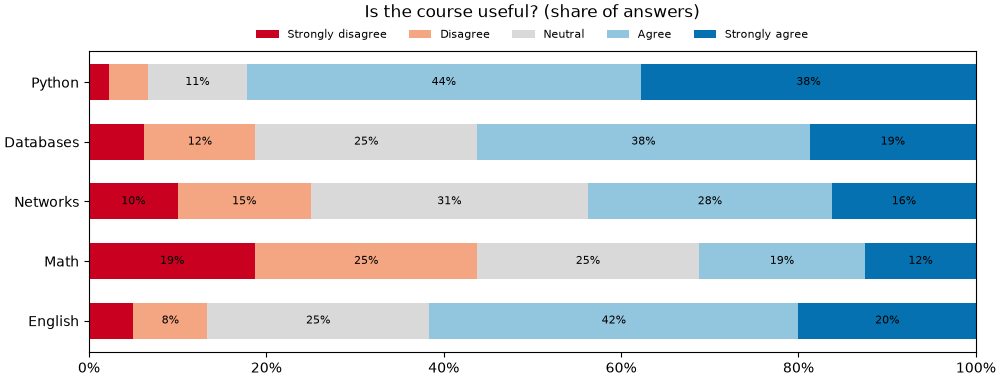

- для `barh` замість `bottom` — `left`, замість `width` — `height`;
- `counts.sum(axis=1, keepdims=True)` — суми рядків як стовпець `(5, 1)`; broadcasting (лекція 27) ділить кожен рядок на його суму;
- `f"{v:.0%}"` — форматування частки як відсотка: `0.42` → `42%`;
- підписи для дуже вузьких сегментів (менше 7%) не показуємо — вони не помістяться;
- кольори — розбіжна шкала: червоний «не згоден», сірий нейтральний, синій «згоден». Порядок відповідей має сенс, тому кольори теж упорядковані.

!!! tip "Кольори зі шкали"
    Замість ручного списку можна взяти кольори з колірної карти (лекція 39): `plt.get_cmap("RdBu")(np.linspace(0.1, 0.9, 5))` — п'ять рівномірних кольорів від червоного до синього.

## Від'ємні значення і «водоспад»

### Колір за знаком

Прибуток і збиток, відхилення від плану, зміна відносно минулого року — значення бувають від'ємними. `bar` малює такі стовпчики вниз від нуля. Колір за знаком і лінія нуля роблять графік очевидним:

```python
import matplotlib.pyplot as plt
import numpy as np

months = ["Jan", "Feb", "Mar", "Apr", "May", "Jun",
          "Jul", "Aug", "Sep", "Oct", "Nov", "Dec"]
profit = np.array([12, 8, -5, 15, 22, -3, -12, -8, 18, 25, 30, 41])

colors = np.where(profit >= 0, "tab:green", "tab:red")

fig, ax = plt.subplots(figsize=(9, 3.8), layout="constrained")
bars = ax.bar(months, profit, color=colors)
ax.bar_label(bars, fmt="{:+d}", padding=2, fontsize=8)
ax.axhline(0, color="black", linewidth=0.8)
ax.set(title="Monthly profit", ylabel="Thousand UAH", ylim=(-20, 48))
ax.spines[["top", "right", "bottom"]].set_visible(False)
ax.tick_params(axis="x", length=0)
plt.show()
```

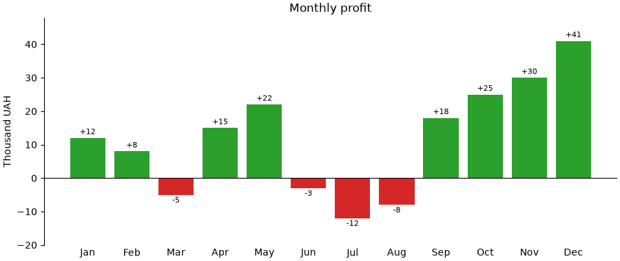

- `np.where(умова, a, b)` (лекція 27) — масив кольорів: зелений для `>= 0`, червоний для решти;
- `fmt="{:+d}"` — ціле число завжди зі знаком: `+12`, `-5`;
- `bar_label` для від'ємних стовпчиків сам ставить підпис **під** стовпчиком;
- `ax.axhline(0, ...)` — лінія нуля замість нижньої рамки.

### Діаграма-водоспад

«Водоспад» (waterfall) показує, як початкове значення змінюється через низку приростів і втрат. Кожен стовпчик «висить» там, де закінчився попередній — це той самий `bottom`:

```python
import matplotlib.pyplot as plt
import numpy as np

steps = ["Revenue", "Cost of goods", "Salaries", "Rent", "Marketing", "Other"]
values = np.array([1000, -420, -260, -90, -70, 55])

# де закінчується кожен крок
ends = np.cumsum(values)
# де починається: 0 для першого, далі - кінець попереднього
starts = np.concatenate([[0], ends[:-1]])
print("ends:  ", ends)
print("starts:", starts)

colors = ["tab:blue"] + ["tab:green" if v > 0 else "tab:red" for v in values[1:]]

fig, ax = plt.subplots(figsize=(9, 4), layout="constrained")
bars = ax.bar(steps, values, bottom=starts, color=colors)
ax.bar_label(bars, labels=[f"{v:+d}" for v in values], label_type="center",
             color="white", fontweight="bold")

# підсумковий стовпчик
profit = ends[-1]
total = ax.bar("Profit", profit, color="0.3")
ax.bar_label(total, padding=3)

# тонкі лінії-сходинки між стовпчиками
for i in range(len(steps)):
    ax.plot([i + 0.4, i + 0.6], [ends[i], ends[i]], color="0.5", linewidth=0.8)

ax.set(title="From revenue to profit", ylabel="Thousand UAH")
ax.spines[["top", "right"]].set_visible(False)
plt.show()
```

```text
ends:   [1000  580  320  230  160  215]
starts: [   0 1000  580  320  230  160]
```

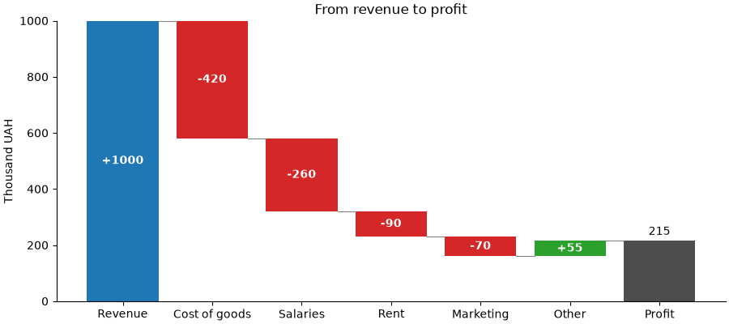

Від'ємна висота з `bottom` малює стовпчик **вниз** від `bottom`: стовпчик `-420` з `bottom=1000` займає проміжок від 580 до 1000. Тому окремо рахувати «нижній край» не треба — достатньо `np.cumsum`.

## Похибки: `yerr` і `capsize`

Середнє значення без розкиду може вводити в оману: різниця 72 проти 75 балів нічого не означає, якщо розкид ±10. `yerr` додає «вуса» похибки до кожного стовпчика:

```python
import matplotlib.pyplot as plt
import numpy as np

rng = np.random.default_rng(1)
groups = ["KI-31", "KI-32", "KI-33", "KI-34"]
scores = [rng.normal(mu, 10, size=25) for mu in (72, 75, 68, 80)]

means = [s.mean() for s in scores]
# стандартна похибка середнього: std / sqrt(n)
errors = [s.std(ddof=1) / np.sqrt(len(s)) for s in scores]
for g, m, e in zip(groups, means, errors):
    print(f"{g}: {m:.1f} +- {e:.1f}")

fig, ax = plt.subplots(figsize=(6.5, 4), layout="constrained")
ax.bar(groups, means, yerr=errors, capsize=6, color="tab:blue", alpha=0.8,
       error_kw={"elinewidth": 1.5})
ax.set(title="Mean exam score (error bars: standard error)", ylabel="Score",
       ylim=(0, 100))
ax.spines[["top", "right"]].set_visible(False)
plt.show()
```

```text
KI-31: 72.0 +- 1.7
KI-32: 74.2 +- 1.9
KI-33: 67.0 +- 1.6
KI-34: 78.8 +- 1.8
```

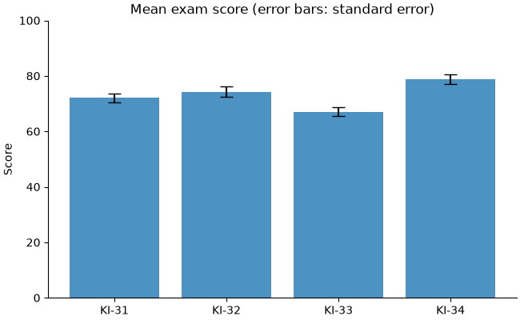

- `yerr` — одне число, масив (симетрична похибка) або масив `2 × n` (окремо вниз і вгору);
- `capsize` — ширина «капелюшків» на кінцях у пунктах;
- `error_kw` — словник параметрів для ліній похибки;
- для `barh` — `xerr`.

!!! warning "Завжди пишіть, що означають вуса"
    Вуса можуть бути стандартним відхиленням (розкид даних), стандартною похибкою середнього (точність оцінки середнього) або довірчим інтервалом. Це дуже різні величини: стандартна похибка в `sqrt(n)` разів менша за відхилення. Без підпису графік неможливо прочитати правильно.

Для окремих точок без стовпчиків є `ax.errorbar(x, y, yerr=..., fmt="o", capsize=...)`.

## Стовпчикові діаграми в pandas

`DataFrame.plot.bar()` і `plot.barh()` будують згруповані і складені стовпчики без ручних зсувів: **рядки** — групи на осі, **стовпці** — набори з кольорами і легендою.

```python
import matplotlib.pyplot as plt
import numpy as np
import pandas as pd

rng = np.random.default_rng(2)
orders = pd.DataFrame({
    "city": rng.choice(["Kyiv", "Lviv", "Odesa", "Kharkiv"], size=600,
                       p=[0.4, 0.25, 0.2, 0.15]),
    "platform": rng.choice(["web", "android", "ios"], size=600, p=[0.5, 0.3, 0.2]),
})

# кількість замовлень: рядки - міста, стовпці - платформи
table = orders.groupby(["city", "platform"]).size().unstack()
table = table.loc[table.sum(axis=1).sort_values(ascending=False).index]
print(table)

fig, (ax1, ax2) = plt.subplots(1, 2, figsize=(11, 3.8), layout="constrained")
table.plot.bar(ax=ax1, rot=0)
ax1.set(title="Grouped", xlabel="", ylabel="Orders")

table.plot.bar(ax=ax2, stacked=True, rot=0)
ax2.set(title="Stacked", xlabel="")
plt.show()
```

```text
platform  android  ios  web
city
Kyiv           66   49  127
Lviv           47   27   65
Odesa          35   34   62
Kharkiv        26   23   39
```

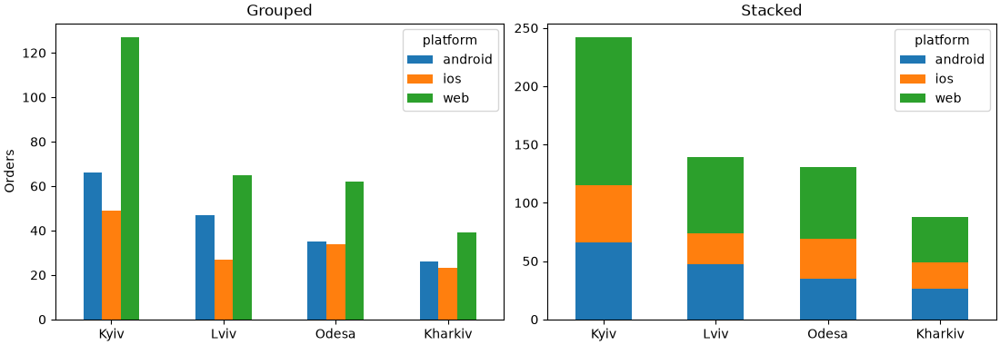

- `groupby([...]).size()` — кількість у кожній парі (лекція 34); `.unstack()` переносить другий рівень індексу (`platform`) у стовпці;
- рядки сортуємо за загальною сумою;
- `ax=ax1` — малювати на нашому `Axes`, а не створювати нову фігуру;
- `rot=0` — горизонтальні підписи (за замовчуванням pandas повертає їх на 90°);
- метод повертає `Axes`, тож далі — звичайні `set`, `legend`, `bar_label`.

Для 100% достатньо поділити на суми рядків: `table.div(table.sum(axis=1), axis=0).plot.barh(stacked=True)`.

`pd.crosstab(orders["city"], orders["platform"])` — те саме, що `groupby + size + unstack`, одним викликом.

## Складені площі: `stackplot`

Коли категорія по осі `x` — це **час** із багатьма точками (12 місяців, 52 тижні), складені стовпчики стають строкатими. Складені площі (`stackplot`) показують те саме неперервно:

```python
import matplotlib.pyplot as plt
import numpy as np

months = np.arange(1, 25)
rng = np.random.default_rng(3)
# відвідувачі сайту за джерелами, тис.
search = 40 + 1.5 * months + rng.normal(0, 3, size=24)
social = 10 + 0.08 * months ** 2 + rng.normal(0, 2, size=24)
direct = 25 + rng.normal(0, 2, size=24)
ads = np.where(months > 12, 15, 5) + rng.normal(0, 1.5, size=24)

labels = ["Search", "Direct", "Social", "Ads"]
fig, (ax1, ax2) = plt.subplots(1, 2, figsize=(11, 3.8), layout="constrained")

ax1.stackplot(months, search, direct, social, ads, labels=labels, alpha=0.85)
ax1.set(title="Visitors by source", xlabel="Month", ylabel="Thousand visitors",
        xlim=(1, 24))
ax1.legend(loc="upper left", reverse=True)

# 100%: ділимо на загальну суму в кожному місяці
data = np.vstack([search, direct, social, ads])
shares = data / data.sum(axis=0)
ax2.stackplot(months, shares, labels=labels, alpha=0.85)
ax2.set(title="Share of visitors", xlabel="Month", ylim=(0, 1), xlim=(1, 24))
ax2.yaxis.set_major_formatter("{x:.0%}")
plt.show()
```

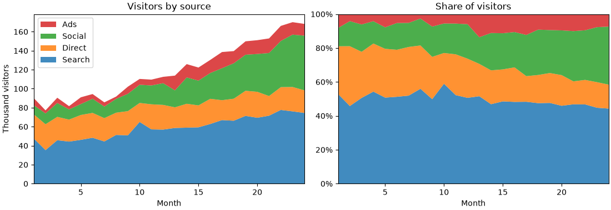

- `stackplot(x, y1, y2, ...)` або `stackplot(x, Y)`, де `Y` — 2D-масив, рядок — один набір;
- перший набір — унизу; `legend(reverse=True)` (matplotlib 3.7+) показує легенду в порядку шарів знизу вгору;
- `yaxis.set_major_formatter("{x:.0%}")` — форматер із рядка (лекція 37).

Тут працює те саме обмеження, що й для складених стовпчиків: точно читається лише нижній шар і загальна сума. Якщо головне — динаміка кожного джерела окремо, кращий звичайний лінійний графік із чотирма лініями.

## Boxplot: п'ять чисел на одному графіку

Гістограма (лекція 39) добре показує розподіл **одного** набору. Але як порівняти розподіли зарплат у восьми відділах? Вісім гістограм — забагато. **Boxplot** («ящик з вусами») стискає розподіл до кількох чисел, і десятки груп поміщаються на одному графіку.

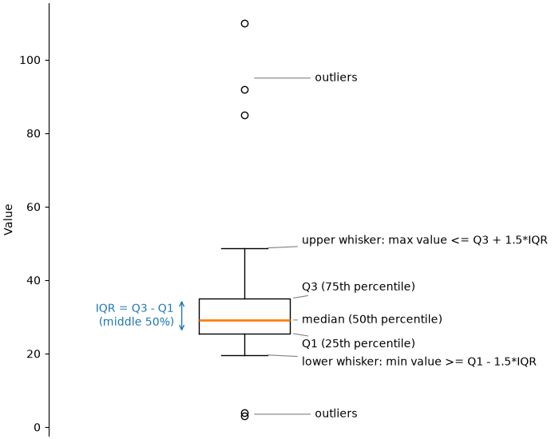

| Елемент | Значення |
|---|---|
| лінія всередині ящика | **медіана** (Q2, 50-й перцентиль) |
| нижній край ящика | **Q1** — 25-й перцентиль |
| верхній край ящика | **Q3** — 75-й перцентиль |
| висота ящика | **IQR** = Q3 − Q1, міжквартильний розмах; в ящику — середні 50% даних |
| вуса | до найдальшого значення в межах `Q1 − 1.5·IQR` … `Q3 + 1.5·IQR` |
| окремі точки | **викиди** — значення за межами вусів |

Порахуємо ці числа вручну через `np.percentile` (лекція 30) і порівняємо з тим, що малює matplotlib:

```python
import matplotlib.pyplot as plt
import numpy as np

rng = np.random.default_rng(4)
salary = np.concatenate([rng.lognormal(np.log(30), 0.2, size=95),
                         [85, 92, 110, 4, 3]])

q1, median, q3 = np.percentile(salary, [25, 50, 75])
iqr = q3 - q1
low_limit = q1 - 1.5 * iqr
high_limit = q3 + 1.5 * iqr
# вуса - до найдальших значень у межах
whisker_low = salary[salary >= low_limit].min()
whisker_high = salary[salary <= high_limit].max()
outliers = salary[(salary < low_limit) | (salary > high_limit)]

print(f"Q1={q1:.1f}, median={median:.1f}, Q3={q3:.1f}, IQR={iqr:.1f}")
print(f"whiskers: {whisker_low:.1f} .. {whisker_high:.1f}")
print(f"outliers: {np.sort(outliers).round(1)}")

fig, ax = plt.subplots(figsize=(4, 5), layout="constrained")
ax.boxplot(salary)
ax.set(title="Salary", ylabel="Thousand UAH", xticks=[])
plt.show()
```

```text
Q1=25.5, median=29.1, Q3=35.0, IQR=9.5
whiskers: 19.6 .. 48.7
outliers: [  3.   4.  85.  92. 110.]
```

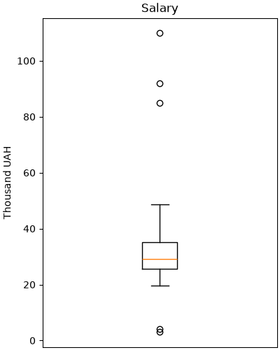

Boxplot чесно показує асиметрію: верхній вус довший за нижній, медіана ближче до низу ящика — у даних довгий правий хвіст.

!!! note "Чому 1.5 · IQR"
    Це домовленість (правило Тьюкі), а не закон природи. Для нормального розподілу за межами `1.5·IQR` лежить лише ~0.7% значень, тож точки там справді незвичні. Але «викид» на boxplot — це сигнал перевірити дані, а не підстава їх видалити.

## Налаштування `boxplot`

На практиці boxplot потрібен для **порівняння груп**. Передайте список масивів — по одному на групу:

```python
import matplotlib.pyplot as plt
import numpy as np

rng = np.random.default_rng(5)
departments = ["Sales", "Support", "Dev", "QA", "HR"]
params = [(28, 0.45), (22, 0.2), (55, 0.35), (38, 0.25), (30, 0.2)]
data = [rng.lognormal(np.log(m), s, size=80) for m, s in params]

fig, axs = plt.subplots(1, 3, figsize=(12, 4), sharey=True, layout="constrained")

axs[0].boxplot(data, tick_labels=departments)
axs[0].set_title("default")

axs[1].boxplot(data, tick_labels=departments, showmeans=True, notch=True,
               flierprops={"marker": "o", "markersize": 4, "alpha": 0.5})
axs[1].set_title("showmeans, notch, flierprops")

box = axs[2].boxplot(data, tick_labels=departments, patch_artist=True,
                     widths=0.6, medianprops={"color": "black", "linewidth": 1.5})
for patch, color in zip(box["boxes"], plt.get_cmap("Set2").colors):
    patch.set_facecolor(color)
axs[2].set_title("patch_artist + colors")

axs[0].set_ylabel("Salary, thousand UAH")
for ax in axs:
    ax.grid(axis="y", alpha=0.3)
plt.show()
```

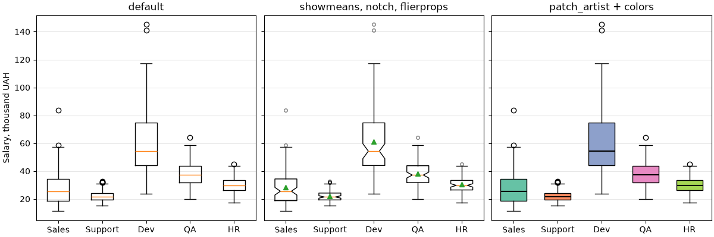

| Параметр | Що робить |
|---|---|
| `tick_labels` | підписи груп |
| `orientation` | `"vertical"` (за замовчуванням) або `"horizontal"` |
| `widths` | ширина ящиків |
| `whis` | довжина вусів у IQR (за замовчуванням `1.5`); `(5, 95)` — вуса до 5-го і 95-го перцентилів |
| `showmeans` | позначити середнє (зелений трикутник) |
| `notch` | «виріз» біля медіани — приблизний 95% довірчий інтервал медіани |
| `showfliers` | `False` — не показувати викиди |
| `patch_artist` | `True` — ящики стають заливними фігурами, їм можна задати колір |
| `boxprops`, `medianprops`, `whiskerprops`, `capprops`, `flierprops`, `meanprops` | словники стилю для кожної частини |

`boxplot` повертає словник із частинами графіка: `"boxes"`, `"medians"`, `"whiskers"`, `"caps"`, `"fliers"`, `"means"`. Це списки об'єктів, кожен можна налаштувати окремо — як у циклі з `set_facecolor` вище.

**Як читати notch:** якщо вирізи двох ящиків не перекриваються, медіани, найімовірніше, справді різні. На середньому графіку вирізи Dev і решти не перекриваються.

**Середнє проти медіани:** у Sales трикутник (середнє) помітно вище медіанної лінії — великі зарплати кількох людей «тягнуть» середнє вгору. Це ознака правого хвоста.

!!! note "Старі версії matplotlib"
    `tick_labels` з'явився в matplotlib 3.9 (раніше — `labels`), `orientation` — у 3.10 (раніше — `vert=False` для горизонтальних). Якщо у вас стара версія і параметр не працює, оновіть matplotlib: `pip install -U matplotlib`.

### Горизонтальний boxplot і сортування

Як і для `bar`, групи без природного порядку краще сортувати — за медіаною:

```python
import matplotlib.pyplot as plt
import numpy as np

rng = np.random.default_rng(5)
departments = ["Sales", "Support", "Dev", "QA", "HR"]
params = [(28, 0.45), (22, 0.2), (55, 0.35), (38, 0.25), (30, 0.2)]
data = [rng.lognormal(np.log(m), s, size=80) for m, s in params]

# сортування за медіаною
order = np.argsort([np.median(d) for d in data])
data_sorted = [data[i] for i in order]
labels_sorted = [departments[i] for i in order]

fig, ax = plt.subplots(figsize=(8, 3.8), layout="constrained")
ax.boxplot(data_sorted, tick_labels=labels_sorted, orientation="horizontal",
           widths=0.5)
ax.set(title="Salary by department (sorted by median)",
       xlabel="Salary, thousand UAH")
ax.grid(axis="x", alpha=0.3)
plt.show()
```

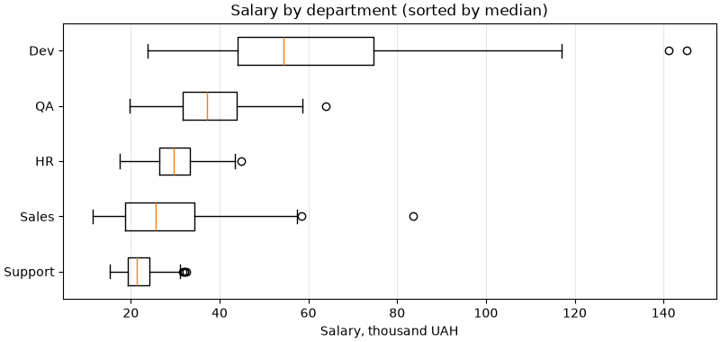

Горизонтальний варіант зручний, коли груп багато або назви довгі.

## Violin plot: форма розподілу

Boxplot має слабке місце: він не бачить «горбів». Два набори нижче мають майже однакові квартилі — і однакові ящики, хоча розподіли зовсім різні:

```python
import matplotlib.pyplot as plt
import numpy as np

rng = np.random.default_rng(6)
one_peak = rng.normal(50, 20, size=500)
two_peaks = np.concatenate([rng.normal(36, 5, size=250),
                            rng.normal(64, 5, size=250)])
data = [one_peak, two_peaks]
labels = ["one peak", "two peaks"]

for name, d in zip(labels, data):
    print(f"{name:9}: Q1={np.percentile(d, 25):.1f}, "
          f"median={np.median(d):.1f}, Q3={np.percentile(d, 75):.1f}")

fig, (ax1, ax2) = plt.subplots(1, 2, figsize=(9, 4), sharey=True, layout="constrained")

ax1.boxplot(data, tick_labels=labels)
ax1.set_title("boxplot: looks the same")

parts = ax2.violinplot(data, showmedians=True)
for body in parts["bodies"]:
    body.set_facecolor("tab:orange")
    body.set_alpha(0.6)
ax2.set_xticks([1, 2], labels)
ax2.set_title("violinplot: shows the shape")
plt.show()
```

```text
one peak : Q1=35.2, median=51.3, Q3=64.1
two peaks: Q1=36.1, median=49.4, Q3=64.3
```

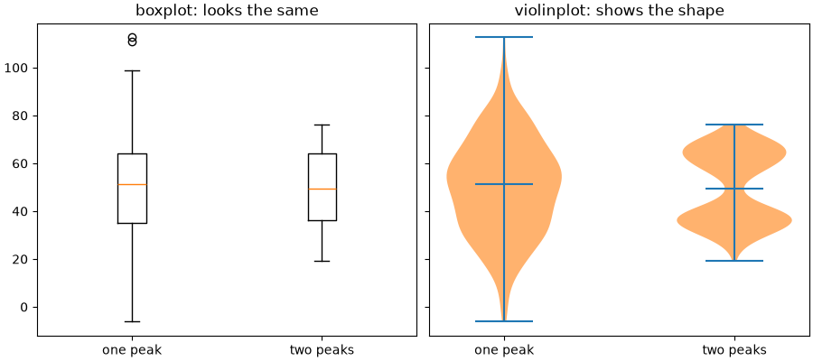

Ящики подібні, а «скрипка» праворуч одразу показує дві групи і майже порожню середину — там, де boxplot малює медіану.

**Violin plot** — це згладжена гістограма, віддзеркалена симетрично: ширина «скрипки» на певній висоті — наскільки часто трапляються такі значення.

| Параметр `violinplot` | Що робить |
|---|---|
| `positions` | позиції по осі (за замовчуванням `1, 2, ...`) |
| `widths` | максимальна ширина |
| `showmedians`, `showmeans` | лінії медіани, середнього |
| `showextrema` | лінії мінімуму й максимуму (за замовчуванням `True`) |
| `quantiles` | список квантилів для кожного набору, наприклад `[[0.25, 0.75]] * n` |
| `bw_method` | ширина згладжування: менше число — більше деталей і шуму |
| `orientation` | `"vertical"` або `"horizontal"` (3.10+) |

`violinplot` не має параметра підписів — їх ставимо через `set_xticks`. Повертає словник: `"bodies"` — список фігур-«скрипок», `"cmedians"`, `"cmins"`, `"cmaxes"`... У прикладі вище колір «скрипок» змінено в циклі по `parts["bodies"]` — так само, як ящики boxplot.

!!! tip "Що обрати"
    - **boxplot** — багато груп, важливі медіана, квартилі і викиди; зрозумілий більшості читачів;
    - **violin** — важлива форма розподілу (кілька «горбів», асиметрія); потребує 30+ значень у групі, інакше згладжування вигадує форму.

## Точки поверх boxplot

Коли значень у групі небагато (до кількох сотень), найчесніше — показати **кожне**. Точки з невеликим випадковим зсувом по горизонталі (jitter) не накладаються одна на одну:

```python
import matplotlib.pyplot as plt
import numpy as np

rng = np.random.default_rng(7)
groups = ["KI-31", "KI-32", "KI-33"]
scores = [rng.normal(72, 10, size=25).clip(0, 100),
          rng.normal(78, 6, size=12).clip(0, 100),
          np.concatenate([rng.normal(60, 6, size=15), rng.normal(88, 4, size=15)])]

fig, ax = plt.subplots(figsize=(7, 4.5), layout="constrained")
ax.boxplot(scores, tick_labels=groups, widths=0.5, showfliers=False,
           medianprops={"color": "black"})

for i, values in enumerate(scores, start=1):
    # випадковий зсув по x, щоб точки не злилися
    x = i + rng.uniform(-0.12, 0.12, size=len(values))
    ax.scatter(x, values, s=18, alpha=0.6, zorder=3)
    ax.text(i, 102, f"n={len(values)}", ha="center", fontsize=9, color="0.4")

ax.set(title="Exam scores", ylabel="Score", ylim=(30, 106))
ax.grid(axis="y", alpha=0.3)
plt.show()
```

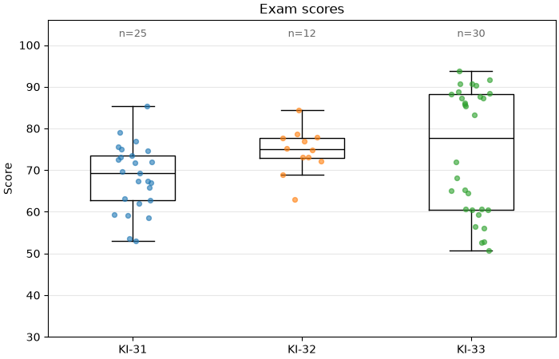

- `showfliers=False` — викиди і так видно серед точок, без нього вони б подвоїлися;
- `zorder=3` — точки над ящиками;
- підпис `n=...` — скільки значень у групі. Ящик із 12 точок виглядає так само «солідно», як із 1000, і без `n` цього не видно;
- у KI-33 видно дві підгрупи — boxplot сам по собі цього не показав би.

## Boxplot у pandas

Для даних у «довгому» форматі (стовпець значень + стовпець групи) зручний `DataFrame.boxplot` з `by`:

```python
import matplotlib.pyplot as plt
import numpy as np
import pandas as pd

rng = np.random.default_rng(8)
df = pd.DataFrame({
    "department": rng.choice(["Dev", "QA", "Sales"], size=300),
    "level": rng.choice(["junior", "middle", "senior"], size=300),
})
base = df["department"].map({"Dev": 40, "QA": 30, "Sales": 25})
k = df["level"].map({"junior": 0.6, "middle": 1.0, "senior": 1.6})
df["salary"] = base * k * rng.lognormal(0, 0.15, size=300)

print(df.groupby("department")["salary"].describe().round(1))

fig, (ax1, ax2) = plt.subplots(1, 2, figsize=(11, 4), layout="constrained")
df.boxplot(column="salary", by="department", ax=ax1, grid=False)
ax1.set(title="By department", xlabel="", ylabel="Salary, thousand UAH")

df.boxplot(column="salary", by="level", ax=ax2, grid=False)
ax2.set(title="By level", xlabel="")
# pandas додає свій загальний заголовок - прибираємо його
fig.suptitle("")
plt.show()
```

```text
            count  mean   std   min   25%   50%   75%    max
department
Dev          93.0  43.4  19.1  15.9  25.4  38.3  60.5  104.0
QA          111.0  32.6  14.9  12.5  19.0  27.6  47.0   63.4
Sales        96.0  28.0  11.7  10.2  17.3  26.2  37.6   59.0
```

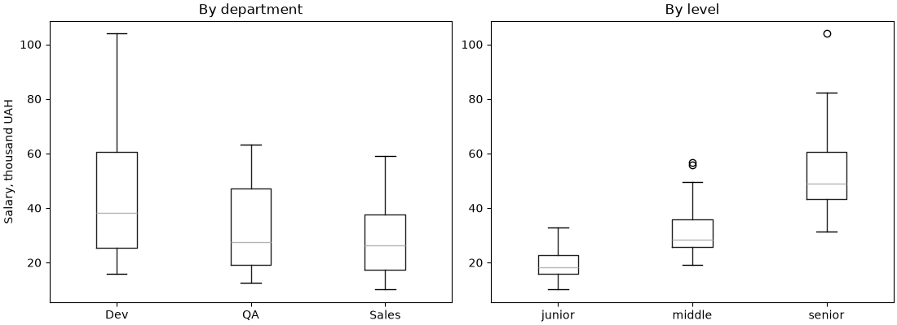

- `column` — що розподіляємо, `by` — за чим групуємо;
- групи впорядковані за алфавітом; для власного порядку зробіть стовпець категоріальним (`pd.Categorical(..., categories=[...], ordered=True)`) або зберіть список масивів і викличте `ax.boxplot` самі;
- `describe()` дає ті самі числа, що й ящик: `25%`, `50%`, `75%`, `min`, `max`.

## Кругова діаграма: `pie` і «бублик»

Кругова діаграма показує **частки одного цілого**. Вона читається гірше за стовпчики: око погано порівнює кути. Але для 2–4 частин з помітно різними частками, коли головне повідомлення «яка частина від цілого», вона зрозуміла.

```python
import matplotlib.pyplot as plt

platforms = ["Web", "Android", "iOS", "Other"]
orders = [480, 310, 190, 20]

fig, (ax1, ax2) = plt.subplots(1, 2, figsize=(10, 4.2), layout="constrained")

ax1.pie(orders, labels=platforms, autopct="%1.0f%%", startangle=90,
        counterclock=False, wedgeprops={"edgecolor": "white"})
ax1.set_title("Pie")

# "бублик": кільце замість круга
ax2.pie(orders, labels=platforms, autopct="%1.0f%%", startangle=90,
        counterclock=False, pctdistance=0.8,
        wedgeprops={"width": 0.4, "edgecolor": "white"})
ax2.text(0, 0, f"{sum(orders)}\norders", ha="center", va="center",
         fontsize=14, fontweight="bold")
ax2.set_title("Donut")
plt.show()
```

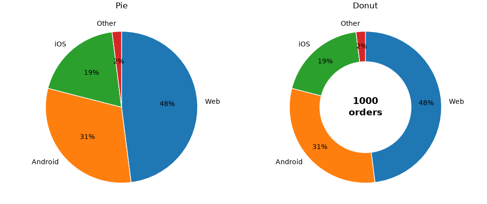

| Параметр | Що робить |
|---|---|
| `labels` | підписи секторів |
| `autopct` | формат відсотків усередині: `"%1.0f%%"` → `48%` (старий `%`-формат; `%%` — знак відсотка) |
| `startangle=90`, `counterclock=False` | перший сектор починається вгорі і йде за годинниковою стрілкою — як читаємо годинник |
| `wedgeprops` | стиль секторів; `width` < 1 перетворює круг на кільце |
| `pctdistance` | де ставити відсотки: частка радіуса |
| `explode` | список зсувів секторів від центру, щоб «висунути» один |

`pie` сам рахує частки: передавайте кількість, не відсотки.

Порівняйте той самий набір даних, представлений двома способами:

```python
import matplotlib.pyplot as plt

languages = ["Python", "JavaScript", "Java", "C#", "C++", "Go", "Rust"]
share = [24, 21, 17, 14, 12, 7, 5]

fig, (ax1, ax2) = plt.subplots(1, 2, figsize=(10, 4), layout="constrained")
ax1.pie(share, labels=languages, startangle=90, counterclock=False,
        wedgeprops={"edgecolor": "white"})
ax1.set_title("Which is bigger: Java or C#?")

bars = ax2.barh(languages, share, color="tab:blue")
ax2.bar_label(bars, fmt="{}%", padding=3)
ax2.invert_yaxis()
ax2.xaxis.set_visible(False)
ax2.spines[["top", "right", "bottom"]].set_visible(False)
ax2.set_title("Same data as bars")
plt.show()
```

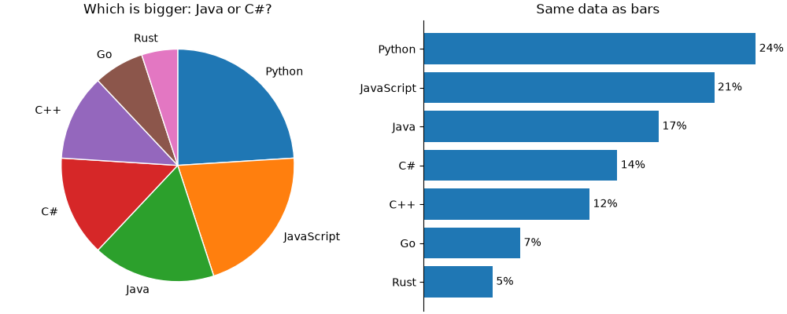

На круговій діаграмі сектори Java, C# і C++ важко впорядкувати. На стовпчиках — миттєво.

!!! warning "Коли не використовувати `pie`"
    - частин більше ~5;
    - частки близькі одна до одної;
    - треба порівняти кілька цілих (кілька «пирогів» поруч) — краще 100%-стовпчики;
    - частини не складаються в ціле (наприклад, відповіді з кількома варіантами, сума > 100%);
    - 3D-ефекти і «висунуті» сектори — завжди спотворюють пропорції.

## Теплова карта: `imshow`

Теплова карта показує числа в таблиці **кольором**: рядки і стовпці — дві категорії, колір клітинки — значення. Класичний приклад — активність за днями тижня і годинами:

```python
import matplotlib.pyplot as plt
import numpy as np

rng = np.random.default_rng(9)
days = ["Mon", "Tue", "Wed", "Thu", "Fri", "Sat", "Sun"]
hours = np.arange(8, 24, 2)

# кількість замовлень: рядок - день, стовпець - година
evening = np.exp(-((hours - 20) ** 2) / 12)
lunch = 0.6 * np.exp(-((hours - 13) ** 2) / 4)
weekend = np.array([1, 1, 1, 1, 1.2, 1.6, 1.5]).reshape(-1, 1)
orders = 100 * (evening + lunch) * weekend + rng.normal(0, 5, size=(7, 8))
# кількість не може бути від'ємною і дробовою
orders = np.clip(orders, 0, None).round().astype(int)

fig, ax = plt.subplots(figsize=(9, 4.5), layout="constrained")
img = ax.imshow(orders, cmap="YlOrRd", aspect="auto")
fig.colorbar(img, ax=ax, label="Orders")

ax.set_xticks(np.arange(len(hours)), [f"{h}:00" for h in hours])
ax.set_yticks(np.arange(len(days)), days)

# число в кожній клітинці; колір тексту залежить від фону
threshold = orders.max() * 0.6
for i in range(orders.shape[0]):
    for j in range(orders.shape[1]):
        value = orders[i, j]
        color = "white" if value > threshold else "black"
        ax.text(j, i, f"{value}", ha="center", va="center", color=color,
                fontsize=9)

ax.set_title("Orders by day and hour")
ax.tick_params(length=0)
ax.spines[:].set_visible(False)
plt.show()
```

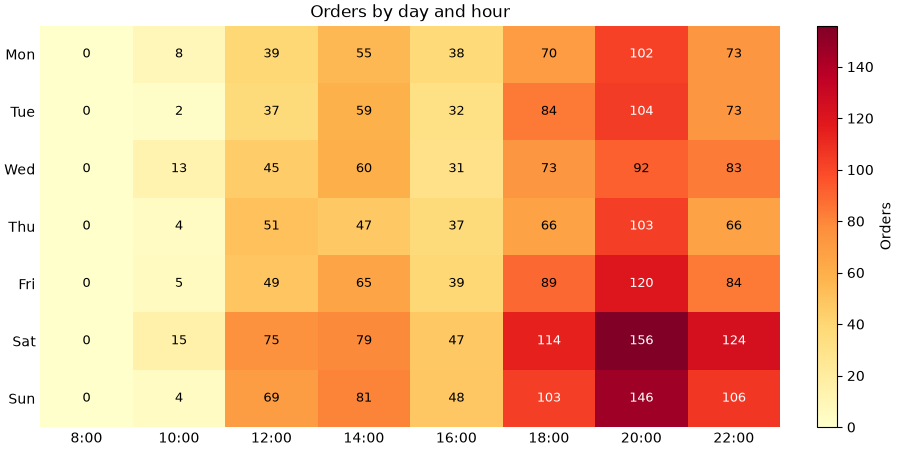

- `imshow(2D-масив)` малює кожен елемент як клітинку: рядок `i` — по осі `y`, стовпець `j` — по осі `x`;
- `aspect="auto"` — клітинки розтягуються під розмір графіка (без нього вони квадратні);
- центр клітинки `[i, j]` має координати `(x=j, y=i)` — тому `ax.text(j, i, ...)`;
- перший рядок угорі — як у таблиці;
- для темних клітинок — білий текст, інакше його не прочитати.

Видно два «гарячі» періоди — обід і вечір — і що у вихідні вечірній пік сильніший.

Колірну карту обирайте за правилами з лекції 39: послідовна (`YlOrRd`, `viridis`, `Blues`) — для кількості; розбіжна (`RdBu_r`) з симетричними `vmin`/`vmax` — для відхилень і кореляцій.

### Матриця кореляцій

Теплова карта — стандартний спосіб показати `df.corr()` (лекція 34):

```python
import matplotlib.pyplot as plt
import numpy as np
import pandas as pd

rng = np.random.default_rng(10)
n = 200
hours = rng.uniform(0, 10, size=n)
df = pd.DataFrame({
    "study_hours": hours,
    "attendance": 50 + 4 * hours + rng.normal(0, 8, size=n),
    "sleep_hours": 8 - 0.2 * hours + rng.normal(0, 1, size=n),
    "games_hours": 6 - 0.4 * hours + rng.normal(0, 1.5, size=n),
})
df["score"] = 40 + 4 * df["study_hours"] + 1.5 * df["sleep_hours"] + rng.normal(0, 6, size=n)

corr = df.corr()

fig, ax = plt.subplots(figsize=(6.5, 5.5), layout="constrained")
img = ax.imshow(corr, cmap="RdBu_r", vmin=-1, vmax=1)
fig.colorbar(img, ax=ax, label="Correlation")
ticks = np.arange(len(corr))
ax.set_xticks(ticks, corr.columns, rotation=45, ha="right")
ax.set_yticks(ticks, corr.columns)
for i in ticks:
    for j in ticks:
        value = corr.iloc[i, j]
        ax.text(j, i, f"{value:.2f}", ha="center", va="center",
                color="white" if abs(value) > 0.6 else "black", fontsize=9)
ax.set_title("Correlation matrix")
plt.show()
```

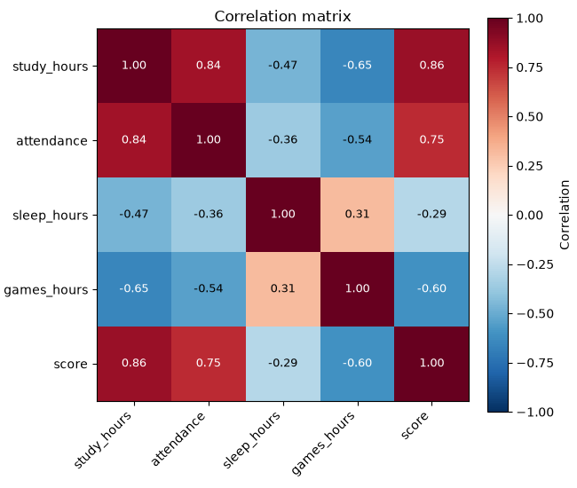

`vmin=-1, vmax=1` — повна шкала кореляції: білий — нуль, червоний — позитивна, синій — негативна.

## Lollipop і `stem`

Коли категорій багато, ряд товстих стовпчиків стає важким «парканом». **Lollipop** («льодяник») — тонка лінія з точкою на кінці. Він передає ту саму довжину, але з меншою кількістю «чорнила»:

```python
import matplotlib.pyplot as plt
import numpy as np

products = ["Mouse", "Keyboard", "Monitor", "Headphones", "Webcam", "Laptop stand",
            "USB hub", "SSD", "Router", "Microphone", "Speakers", "Charger"]
rating = np.array([4.6, 4.4, 4.7, 4.1, 3.6, 4.3, 3.9, 4.8, 4.0, 4.2, 3.8, 4.5])

order = np.argsort(rating)
y = np.arange(len(products))

fig, ax = plt.subplots(figsize=(7, 5), layout="constrained")
ax.hlines(y, 0, rating[order], color="0.7", linewidth=2)
ax.scatter(rating[order], y, s=60, color="tab:blue", zorder=3)
for yi, r in zip(y, rating[order]):
    ax.text(r + 0.08, yi, f"{r:.1f}", va="center", fontsize=9)
ax.set_yticks(y, [products[i] for i in order])
ax.set(title="Average product rating", xlim=(0, 5.3))
ax.spines[["top", "right", "left"]].set_visible(False)
ax.tick_params(axis="y", length=0)
plt.show()
```

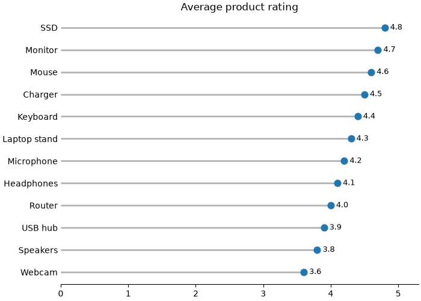

- `ax.hlines(y, xmin, xmax)` — горизонтальні відрізки; для вертикальних — `ax.vlines(x, ymin, ymax)`;
- точки — звичайний `scatter` поверх.

Те саме для вертикального випадку робить `ax.stem(x, y)` — він зручний для дискретних сигналів і послідовностей:

```python
import matplotlib.pyplot as plt
import numpy as np

days = np.arange(1, 31)
rng = np.random.default_rng(11)
# зміна кількості користувачів відносно попереднього дня
change = rng.normal(0, 15, size=30).round()

fig, ax = plt.subplots(figsize=(9, 3.4), layout="constrained")
markers, stems, base = ax.stem(days, change)
stems.set_color("0.6")
base.set_color("black")
ax.set(title="Daily change in active users", xlabel="Day", ylabel="Users")
plt.show()
```

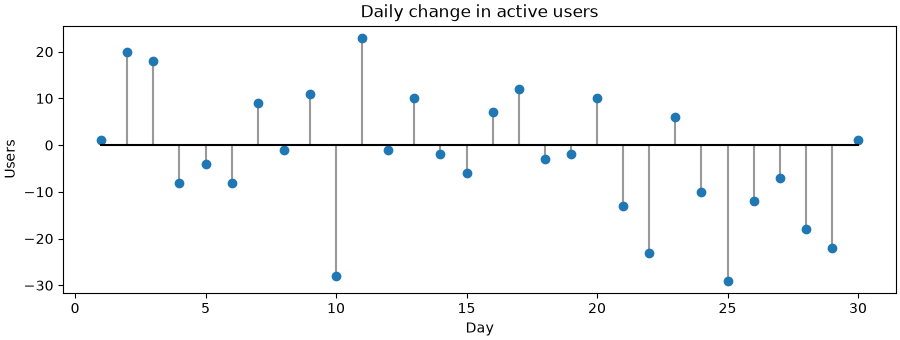

`stem` повертає три частини: маркери, «стебла» і базову лінію — кожну можна стилізувати окремо.

## Приклад: звіт інтернет-магазину

Зберемо графіки лекції в один звіт. Згенеруємо замовлення інтернет-магазину за рік і відповімо на питання:

1. Як змінювалась виручка за місяцями і з яких категорій вона складається?
2. Як відрізняється сума замовлення між категоріями?
3. Через які платформи надходять замовлення?
4. Коли покупці найактивніші?

```python
import matplotlib.pyplot as plt
import numpy as np
import pandas as pd

rng = np.random.default_rng(2025)

# 1. дані: 5000 замовлень за 2025 рік
n = 5000
categories = ["Laptops", "Phones", "Audio", "Accessories"]
base_price = {"Laptops": 32, "Phones": 18, "Audio": 4, "Accessories": 1.2}
df = pd.DataFrame({
    "date": pd.to_datetime("2025-01-01")
            + pd.to_timedelta(rng.integers(0, 365, size=n), unit="D"),
    "category": rng.choice(categories, size=n, p=[0.15, 0.25, 0.25, 0.35]),
    "platform": rng.choice(["Web", "Android", "iOS"], size=n, p=[0.5, 0.3, 0.2]),
    "hour": rng.choice(np.arange(24), size=n,
                       p=np.r_[np.full(8, 0.5), np.full(10, 3), np.full(6, 6)] / 70),
})
df["amount"] = (df["category"].map(base_price)
                * rng.lognormal(0, 0.35, size=n)).round(2)
# грудень: розпродаж, на 40% більше замовлень
december = df.sample(frac=0.04, random_state=1).copy()
december["date"] = pd.to_datetime("2025-12-01") + pd.to_timedelta(
    rng.integers(0, 31, size=len(december)), unit="D")
df = pd.concat([df, december], ignore_index=True)
df["month"] = df["date"].dt.month
df["weekday"] = df["date"].dt.dayofweek

print(f"orders: {len(df)}, revenue: {df['amount'].sum():,.0f} thousand UAH")
print(df.groupby("category")["amount"].median().round(2))

# 2. рисунок
fig, axd = plt.subplot_mosaic([["revenue", "revenue", "platform"],
                               ["box", "heat", "heat"]],
                              figsize=(14, 8), layout="constrained")

# виручка за місяцями, складені стовпчики за категоріями
ax = axd["revenue"]
monthly = df.pivot_table(index="month", columns="category", values="amount",
                         aggfunc="sum")[categories]
bottom = np.zeros(12)
for category in categories:
    ax.bar(monthly.index, monthly[category], bottom=bottom, label=category)
    bottom += monthly[category].to_numpy()
ax.set_xticks(range(1, 13), ["Jan", "Feb", "Mar", "Apr", "May", "Jun",
                             "Jul", "Aug", "Sep", "Oct", "Nov", "Dec"])
ax.set(title="Monthly revenue by category", ylabel="Thousand UAH")
ax.legend(loc="upper left", ncols=4)
ax.spines[["top", "right"]].set_visible(False)

# платформи: частки, горизонтальні стовпчики
ax = axd["platform"]
platform_share = df["platform"].value_counts(normalize=True).sort_values()
bars = ax.barh(platform_share.index, platform_share.to_numpy(), color="0.6")
ax.bar_label(bars, fmt="{:.0%}", padding=3)
ax.set(title="Orders by platform", xlim=(0, 0.6))
ax.xaxis.set_visible(False)
ax.spines[["top", "right", "bottom"]].set_visible(False)

# сума замовлення: boxplot, логарифмічна вісь
ax = axd["box"]
amounts = [df.loc[df["category"] == c, "amount"] for c in categories]
box = ax.boxplot(amounts, tick_labels=categories, patch_artist=True,
                 medianprops={"color": "black"},
                 flierprops={"marker": ".", "alpha": 0.3})
for patch, color in zip(box["boxes"], plt.rcParams["axes.prop_cycle"].by_key()["color"]):
    patch.set_facecolor(color)
    patch.set_alpha(0.7)
ax.set_yscale("log")
ax.set(title="Order amount", ylabel="Thousand UAH (log scale)")
ax.tick_params(axis="x", rotation=20)

# активність: день тижня x година
ax = axd["heat"]
heat = pd.crosstab(df["weekday"], df["hour"])
img = ax.imshow(heat, cmap="YlOrRd", aspect="auto")
fig.colorbar(img, ax=ax, label="Orders")
ax.set_yticks(range(7), ["Mon", "Tue", "Wed", "Thu", "Fri", "Sat", "Sun"])
ax.set_xticks(range(0, 24, 2), [f"{h}:00" for h in range(0, 24, 2)])
ax.set(title="Orders by weekday and hour", xlabel="Hour")
ax.tick_params(length=0)

fig.suptitle("Online store: 2025 report (simulated data)", fontweight="bold")
fig.savefig("store_report.png", dpi=150)
plt.show()
```

```text
orders: 5200, revenue: 58,220 thousand UAH
category
Accessories     1.21
Audio           4.06
Laptops        31.81
Phones         17.87
Name: amount, dtype: float64
```

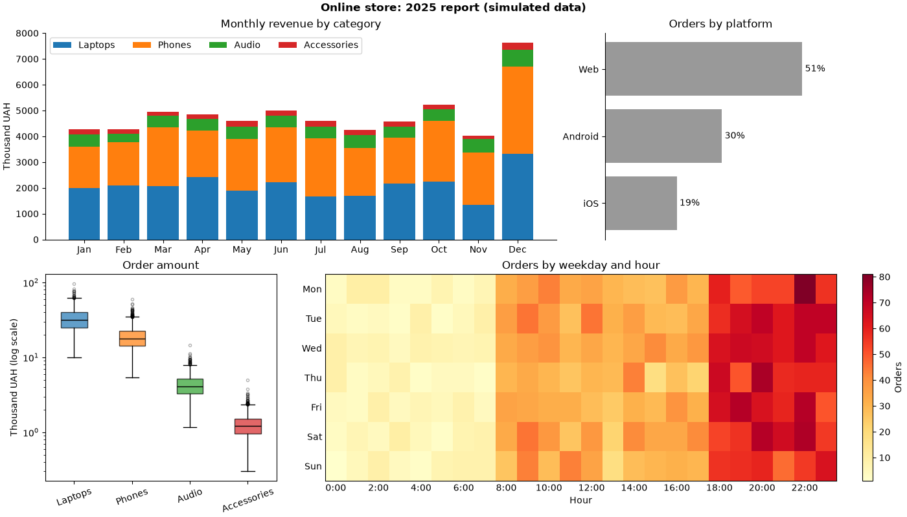

Що видно:

- **виручка** — стабільна протягом року, у грудні сплеск; основна частина — ноутбуки й телефони, хоча аксесуарів продають найбільше штук. Ноутбуки — нижній шар, тому їх легко порівнювати між місяцями;
- **платформи** — половина замовлень з вебу;
- **сума замовлення** — категорії відрізняються на порядки, тому вісь логарифмічна (лекція 37). Без неї ящики Audio та Accessories злилися б в одну лінію біля нуля;
- **активність** — більшість замовлень увечері, 18:00–23:00; уночі майже нічого. Від дня тижня активність майже не залежить.

Що тут використано:

- `subplot_mosaic` — широкий графік зверху і три менші;
- `pivot_table` + `bottom` — складені стовпчики;
- `value_counts(normalize=True)` + `barh` + `bar_label(fmt="{:.0%}")` — частки;
- `boxplot(patch_artist=True)` + `set_yscale("log")` — порівняння розподілів різного масштабу;
- `pd.crosstab` + `imshow` + `colorbar` — теплова карта.

## Типові помилки

**Вісь `bar` не з нуля.** Довжина стовпчика — це значення. Обрізана вісь перетворює різницю в 2% на «удвічі». Для точок, ліній і boxplot нуль не обов'язковий; для стовпчиків — обов'язковий.

**Несортовані категорії.** Якщо в категорій немає власного порядку, сортуйте за значенням — рейтинг читається одразу.

**Сортування впорядкованих категорій.** Місяці, дні тижня, оцінки, вікові групи — у природному порядку.

**Згруповані стовпчики «налазять» один на одного.** Ширина одного стовпчика — `0.8 / n`, зсув — `(i - (n - 1) / 2) * width`.

**Стек без `bottom` (або без накопичення).** Без `bottom` усі набори малюються з нуля і перекривають один одного. `bottom` треба оновлювати після кожного набору: `bottom += values`.

**Порівняння верхніх сегментів стека.** Точно читаються лише нижній сегмент і сума. Для порівняння кожної категорії — згруповані стовпчики або окремі графіки.

**Легенда стека в протилежному порядку.** Перший набір — унизу стека, але вгорі легенди. `handles[::-1], labels[::-1]` або `legend(reverse=True)`.

**Похибки без пояснення.** Стандартне відхилення, стандартна похибка і довірчий інтервал — різні величини. Пишіть, що показують вуса.

**Boxplot для маленьких груп без точок.** Ящик із 8 значень виглядає так само, як із 8000. Додайте точки з jitter і `n=`.

**Boxplot для даних із кількома «горбами».** Ящик їх не покаже. Перевірте гістограмою або violin plot.

**Видалення «викидів» лише тому, що вони за вусами.** Точки за `1.5·IQR` — сигнал перевірити дані, а не помилка.

**`labels=` у `boxplot` у новому matplotlib.** Параметр перейменовано на `tick_labels` (3.9+); `vert=False` замінено на `orientation="horizontal"` (3.10+).

**`pie` з багатьма або близькими частками.** Кути порівнюються погано. 2–4 частини з помітною різницею — максимум; інакше `barh`.

**Відсотки в `pie`, які не складаються в 100%.** `pie` нормує все до цілого. Якщо частини не утворюють ціле, кругова діаграма бреше.

**Теплова карта без чисел і `colorbar`.** Колір неможливо прочитати точно. Додайте `colorbar`, а для невеликих таблиць — числа в клітинках з контрастним кольором тексту.

**Розбіжні дані в послідовній карті.** Кореляції, відхилення — `RdBu_r` з `vmin=-a, vmax=a`.

## Підсумок

- **Вибір графіка:** кількість у категоріях — `bar`/`barh`; кілька показників — згруповані; частини цілого — складені або 100%; склад у часі — `stackplot`; розподіли за групами — `boxplot`/`violinplot`; дві категорії — теплова карта; 2–4 частки — `pie`.
- **`bar`:** нуль на осі значень, сортування за значенням, підсвічування кольором; числові позиції + `set_xticks(x, labels)`; `width`, `align`, `hatch`.
- **`bar_label`:** `fmt="{:.1f}%"`, `labels=[...]`, `padding`, `label_type="center"`.
- **Згруповані:** `width = 0.8 / n`, зсув `(i - (n - 1) / 2) * width`.
- **Складені:** `bottom` (для `barh` — `left`), накопичення `bottom += values`; важливе — внизу; 100% — ділення на суму рядка.
- **Від'ємні:** колір через `np.where`, `axhline(0)`; водоспад — `bottom=np.cumsum(...)` зі зсувом.
- **Похибки:** `yerr`/`xerr`, `capsize`, `error_kw`; завжди пояснюйте, що це.
- **pandas:** `groupby(...).size().unstack()` або `pd.crosstab` → `plot.bar(stacked=..., ax=ax, rot=0)`; `df.boxplot(column=..., by=...)`.
- **`stackplot(x, Y)`** — складені площі для часових рядів.
- **`boxplot`:** медіана, Q1/Q3, IQR, вуса `1.5·IQR`, викиди; `tick_labels`, `orientation`, `showmeans`, `notch`, `whis`, `patch_artist` + `box["boxes"]`.
- **`violinplot`:** форма розподілу; `showmedians`, `quantiles`, підписи через `set_xticks`.
- **Точки з jitter** поверх boxplot + `showfliers=False` + `n=`.
- **`pie`:** `autopct`, `startangle=90`, `counterclock=False`; бублик — `wedgeprops={"width": 0.4}`; частіше краще `barh`.
- **Теплова карта:** `imshow(2D, cmap, aspect="auto")` + `colorbar` + `ax.text(j, i, ...)`; кореляції — `RdBu_r`, `vmin=-1, vmax=1`.
- **Lollipop:** `hlines` + `scatter`; `stem` для послідовностей.

## Корисні посилання

- [matplotlib: `Axes.bar`](https://matplotlib.org/stable/api/_as_gen/matplotlib.axes.Axes.bar.html)
- [matplotlib: `Axes.bar_label`](https://matplotlib.org/stable/api/_as_gen/matplotlib.axes.Axes.bar_label.html)
- [Grouped bar chart with labels (gallery)](https://matplotlib.org/stable/gallery/lines_bars_and_markers/barchart.html)
- [Stacked bar chart (gallery)](https://matplotlib.org/stable/gallery/lines_bars_and_markers/bar_stacked.html)
- [Discrete distribution as horizontal bar chart (gallery)](https://matplotlib.org/stable/gallery/lines_bars_and_markers/horizontal_barchart_distribution.html)
- [matplotlib: `Axes.stackplot`](https://matplotlib.org/stable/api/_as_gen/matplotlib.axes.Axes.stackplot.html)
- [matplotlib: `Axes.boxplot`](https://matplotlib.org/stable/api/_as_gen/matplotlib.axes.Axes.boxplot.html)
- [Box plot vs. violin plot comparison (gallery)](https://matplotlib.org/stable/gallery/statistics/boxplot_vs_violin.html)
- [matplotlib: `Axes.pie`](https://matplotlib.org/stable/api/_as_gen/matplotlib.axes.Axes.pie.html)
- [Creating annotated heatmaps (gallery)](https://matplotlib.org/stable/gallery/images_contours_and_fields/image_annotated_heatmap.html)
- [pandas: Chart visualization](https://pandas.pydata.org/docs/user_guide/visualization.html)
