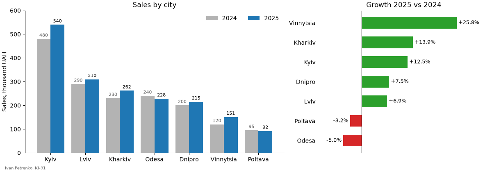
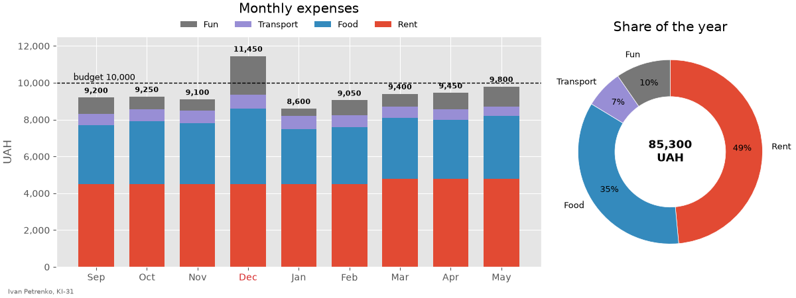
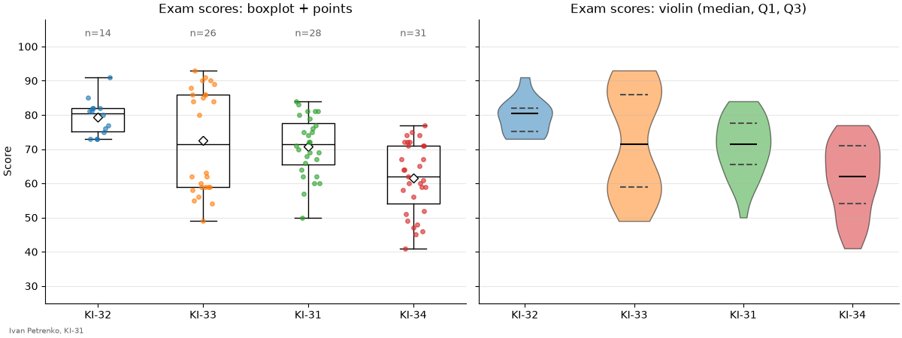
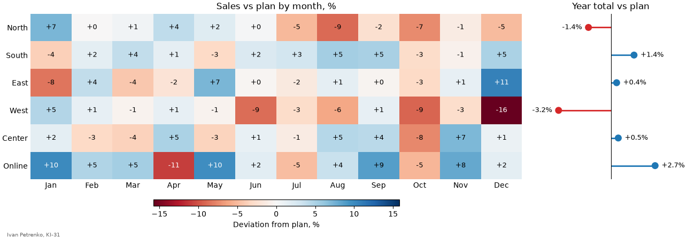
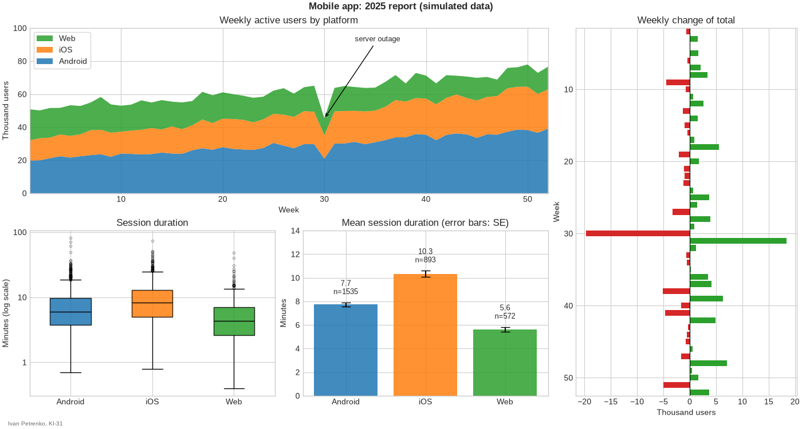

# 42. (П19) Комбіновані графіки і стилі

## Передумови

- Прочитана [Лекція 41 — Стовпчикові діаграми, стеки, boxplots та інші типи графіків у matplotlib](/ua/courses/programming-3sem/module4/41-bar-stack-boxplot-lecture/)
- Повторені стилі та `rcParams` з [Лекції 37](/ua/courses/programming-3sem/module4/37-line-plots-axes-legends-styles-lecture/)
- Встановлені бібліотеки: `pip install matplotlib numpy pandas`

!!! warning "Мова в коді"
    Усі рядкові літерали, заголовки та підписи графіків, імена файлів і змінних — **лише латиницею**. Кирилиця допускається тільки в коментарях.

## Завдання

Для кожного завдання дано картинку та вхідні дані. Потрібно написати код, який малює **такий самий** графік: ті самі типи графіків, порядок категорій, кольори, стиль, осі, підписи, легенди, шкали кольорів і розташування елементів.

- кожне завдання — окремий файл `task_1.py`, `task_2.py`, ...;
- кожен скрипт зберігає графік у файл `task_1.png`, `task_2.png`, ...;
- у лівому нижньому куті кожної фігури — ваше ім'я та група (на зразках — `Ivan Petrenko, KI-31`);
- усі числа в підписах (суми, відсотки, відхилення, `n=`, середні) **обчислюються в коді**, а не вписуються вручну;
- порядок категорій на графіках (сортування) теж отримується в коді, а не переставленням вхідних даних.

## Завдання 1

Розмір фігури: 12 × 4.2, ширина графіків 3 : 2. Ліворуч міста впорядковані за продажами 2025 року, праворуч — за зростанням.



```python
import numpy as np

cities = ["Lviv", "Poltava", "Kyiv", "Odesa", "Dnipro", "Kharkiv", "Vinnytsia"]
# продажі, тис. грн
sales_2024 = np.array([290, 95, 480, 240, 200, 230, 120])
sales_2025 = np.array([310, 92, 540, 228, 215, 262, 151])
```

## Завдання 2

Розмір фігури: 12 × 4.5, ширина графіків 2 : 1. Стиль — `ggplot`. Місяці, у яких витрати перевищили бюджет, підписані червоним.



```python
import numpy as np

months = ["Sep", "Oct", "Nov", "Dec", "Jan", "Feb", "Mar", "Apr", "May"]
# витрати студента, грн
expenses = {
    "Rent": np.array([4500, 4500, 4500, 4500, 4500, 4500, 4800, 4800, 4800]),
    "Food": np.array([3200, 3400, 3300, 4100, 3000, 3100, 3300, 3200, 3400]),
    "Transport": np.array([600, 650, 700, 750, 700, 650, 600, 550, 500]),
    "Fun": np.array([900, 700, 600, 2100, 400, 800, 700, 900, 1100]),
}
budget = 10000
```

## Завдання 3

Розмір фігури: 12 × 4.5. Групи впорядковані за медіаною. Прибрані верхня і права рамки та увімкнена горизонтальна сітка — задайте це один раз через `plt.rcParams`, а не для кожного `Axes` окремо. Ромб — середнє. На violin plot пунктиром — Q1 і Q3.



```python
import numpy as np

rng = np.random.default_rng(42)
groups = ["KI-31", "KI-32", "KI-33", "KI-34"]
scores = [
    rng.normal(71, 11, size=28).clip(0, 100).round(),
    rng.normal(78, 6, size=14).clip(0, 100).round(),
    np.concatenate([rng.normal(58, 6, size=13), rng.normal(87, 4, size=13)]).round(),
    rng.normal(65, 14, size=31).clip(0, 100).round(),
]
```

## Завдання 4

Розмір фігури: 13 × 4.5, ширина графіків 3 : 1. Ліворуч — відхилення факту від плану в кожному місяці, %, шкала кольорів симетрична відносно нуля. Праворуч — відхилення за весь рік, %.



```python
import numpy as np

rng = np.random.default_rng(44)
regions = ["North", "South", "East", "West", "Center", "Online"]
months = ["Jan", "Feb", "Mar", "Apr", "May", "Jun",
          "Jul", "Aug", "Sep", "Oct", "Nov", "Dec"]
# план і факт продажів, тис. грн: рядок - регіон, стовпець - місяць
plan = np.array([120, 90, 100, 80, 150, 60]).reshape(-1, 1) * np.ones(12)
trend = np.array([-0.06, 0.02, 0.0, -0.10, 0.04, 0.03]).reshape(-1, 1) * np.arange(12) / 11
fact = plan * (1 + trend + rng.normal(0, 0.05, size=(6, 12)))
```

## Завдання 5

Розмір фігури: 14 × 7.5. Стиль — `seaborn-v0_8-whitegrid`. Компонування — через `plt.subplot_mosaic`. Праворуч — зміна загальної кількості користувачів відносно попереднього тижня. Вуса на стовпчиках — стандартна похибка середнього.



```python
import numpy as np
import pandas as pd

rng = np.random.default_rng(45)
platforms = ["Android", "iOS", "Web"]
# активні користувачі за тиждень, тис.
weeks = np.arange(1, 53)
users = pd.DataFrame({
    "Android": 20 + 0.35 * weeks + rng.normal(0, 1.2, size=52),
    "iOS": 12 + 0.25 * weeks + rng.normal(0, 0.9, size=52),
    "Web": 18 - 0.12 * weeks + rng.normal(0, 1.0, size=52),
}, index=weeks)
# тиждень 30: збій серверів
users.loc[30] *= 0.7

# 3000 сесій: платформа і тривалість, хв
n = 3000
sessions = pd.DataFrame({
    "platform": rng.choice(platforms, size=n, p=[0.5, 0.3, 0.2]),
})
median_minutes = sessions["platform"].map({"Android": 6, "iOS": 8, "Web": 4})
sessions["minutes"] = (median_minutes * rng.lognormal(0, 0.7, size=n)).round(1)
```
