# 43. (Л) Налаштування кольорів, стилів, шрифтів, сітки, анотацій

## Зміст лекції

1. Оформлення: що головне на графіку
2. Як задати колір
3. Палітри для категорій
4. Колір як акцент
5. Прозорість і порядок шарів: `alpha`, `zorder`
6. Власні колірні карти
7. Нормування кольору: `BoundaryNorm`, `TwoSlopeNorm`, `LogNorm`
8. Стилі ліній і маркерів
9. Що всередині стилю
10. Шрифти: розмір, насиченість, накреслення
11. Сімейство шрифтів і власні шрифти
12. Математичні формули: mathtext
13. Заголовки, підзаголовки, примітки
14. Довгі підписи поділок
15. Сітка: основна і допоміжна
16. Системи координат анотацій
17. Стрілки: `arrowstyle` і `connectionstyle`
18. Текст у рамці: `bbox`
19. Опорні лінії: `axhline`, `axvline`, `axline`
20. Шрифти і текст у збережених файлах
21. Приклад: графік до і після
22. Типові помилки
23. Підсумок

## Оформлення: що головне на графіку

У лекції 37 ми познайомилися зі стилями, `rcParams`, циклом кольорів і простими анотаціями. Сьогодні розберемо ці інструменти глибше: як вибирати кольори, керувати шрифтами, налаштовувати сітку і підписувати важливе на графіку.

Усі ці налаштування служать одній меті — **щоб читач побачив головне першим**. Корисно уявляти графік як кілька шарів за важливістю:

| Шар | Що це | Як оформлювати |
|---|---|---|
| дані | лінії, стовпчики, точки | насичений колір, найтовщі лінії |
| акценти | підписи головного, стрілки, виділені точки | контрастний колір, жирний шрифт |
| контекст | осі, поділки, легенда | нейтральний, темно-сірий |
| допоміжне | сітка, рамка, фонові смуги | світло-сірий, тонкий, позаду даних |

Типова проблема графіка «за замовчуванням» — допоміжні елементи (рамка, сітка, легенда) мають таку саму вагу, як дані. Майже кожен прийом цієї лекції — це спосіб посилити один шар або послабити інший.

## Як задати колір

Параметр `color` (а також `facecolor`, `edgecolor`, `markerfacecolor` тощо) приймає колір у кількох форматах:

```python
import matplotlib.pyplot as plt

colors = [
    ("tab:blue", "Tableau palette"),
    ("crimson", "CSS name"),
    ("#2a9d8f", "hex RGB"),
    ("#2a9d8f80", "hex RGBA, 50% alpha"),
    ((0.9, 0.6, 0.1), "RGB tuple, 0..1"),
    ((0.9, 0.6, 0.1, 0.4), "RGBA tuple"),
    ("0.6", "gray level, 0=black 1=white"),
    ("C3", "4th color of the cycle"),
    ("xkcd:sky blue", "xkcd color survey"),
]

fig, ax = plt.subplots(figsize=(8, 4.2), layout="constrained")
for i, (color, note) in enumerate(colors):
    y = len(colors) - i
    ax.barh(y, 1, color=color, height=0.8)
    ax.text(1.1, y, f"{color!r:<26}{note}", va="center", family="monospace")
ax.set_xlim(0, 4.2)
ax.set_axis_off()
plt.show()
```

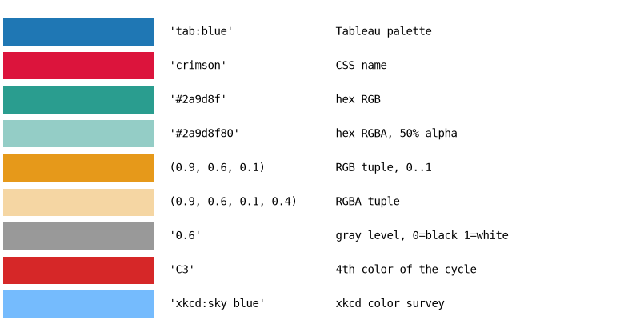

| Формат | Приклад | Коментар |
|---|---|---|
| назва з палітри Tableau | `"tab:blue"`, `"tab:red"` | 10 кольорів циклу за замовчуванням |
| назва CSS | `"crimson"`, `"steelblue"`, `"gold"` | близько 150 назв |
| hex | `"#2a9d8f"`, `"#2a9d8f80"` | як у вебі; дві останні цифри — прозорість |
| кортеж RGB(A) | `(0.9, 0.6, 0.1)` | компоненти від 0 до 1, **не** від 0 до 255 |
| рядок з числом | `"0.6"` | відтінок сірого; саме **рядок**, не число |
| `"CN"` | `"C0"`, `"C1"` | N-й колір поточного циклу кольорів |
| `xkcd:` | `"xkcd:sky blue"` | ~950 назв з опитування xkcd |

Перетворювати кольори між форматами вміє модуль `matplotlib.colors`:

```python
from matplotlib import colors as mcolors

print(mcolors.to_hex("tab:blue"))
print(mcolors.to_rgb("crimson"))
print(mcolors.to_rgba("#2a9d8f", alpha=0.5))
print(mcolors.is_color_like("0.6"), mcolors.is_color_like(0.6))

# кортеж з компонентами 0..255 треба поділити на 255
rgb_255 = (42, 157, 143)
print(mcolors.to_hex([c / 255 for c in rgb_255]))
```

```text
#1f77b4
(0.8627450980392157, 0.0784313725490196, 0.23529411764705882)
(0.16470588235294117, 0.615686274509804, 0.5607843137254902, 0.5)
True False
#2a9d8f
```

`is_color_like(0.6)` повертає `False`: число `0.6` matplotlib не вважає кольором, а рядок `"0.6"` — вважає.

!!! tip "Іменовані кольори в одному місці"
    Якщо графіків у проєкті багато, не розкидайте hex-коди по коду. Заведіть словник `COLORS = {"income": "#2a9d8f", "expense": "#e76f51"}` і беріть кольори з нього — тоді «дохід» буде одного кольору на всіх графіках.

## Палітри для категорій

Для категорій (міста, платформи, групи) потрібні кольори, які **легко розрізнити** і жоден з яких не виглядає «важливішим». Такі набори кольорів називають **якісними палітрами**. Їх можна взяти з колірних карт `tab10`, `Set2`, `Dark2` або задати самостійно.

Кольори якісної карти доступні через атрибут `.colors`, а з неперервної карти (`viridis`) можна взяти `n` рівномірно розподілених кольорів:

```python
import matplotlib as mpl
import matplotlib.pyplot as plt
import numpy as np

# палітра Okabe-Ito: розрізняється людьми з порушенням кольорового зору
okabe_ito = ["#E69F00", "#56B4E9", "#009E73", "#F0E442",
             "#0072B2", "#D55E00", "#CC79A7", "#000000"]

palettes = {
    "tab10": mpl.colormaps["tab10"].colors,
    "Set2": mpl.colormaps["Set2"].colors,
    "Dark2": mpl.colormaps["Dark2"].colors,
    "Okabe-Ito": okabe_ito,
    "viridis, 6 colors": mpl.colormaps["viridis"](np.linspace(0, 1, 6)),
    "Blues, 4 colors": mpl.colormaps["Blues"](np.linspace(0.35, 1, 4)),
}

fig, ax = plt.subplots(figsize=(8, 3.6), layout="constrained")
for row, (name, colors) in enumerate(palettes.items()):
    for col, color in enumerate(colors):
        ax.add_patch(plt.Rectangle((col, -row), 0.9, 0.8, color=color))
    ax.text(-0.3, -row + 0.4, name, ha="right", va="center")
ax.set_xlim(-3.5, 10)
ax.set_ylim(-len(palettes) + 0.8, 0.9)
ax.set_axis_off()
plt.show()
```

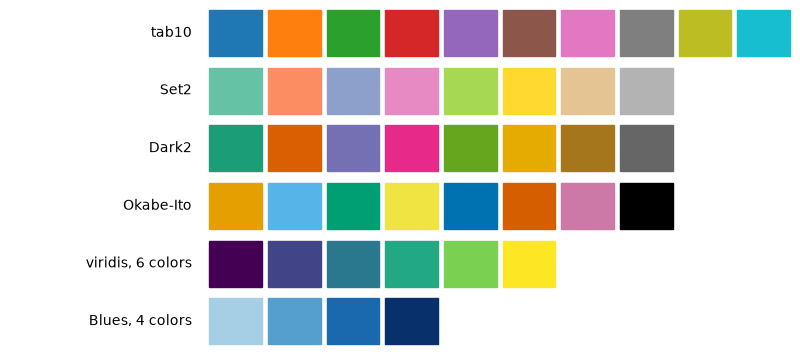

- `mpl.colormaps["tab10"]` — об'єкт колірної карти; `.colors` — список її кольорів (лише для якісних карт);
- неперервну карту можна **викликати** як функцію: `cmap(0.0)` — перший колір, `cmap(1.0)` — останній; `cmap(np.linspace(0, 1, 6))` — 6 кольорів одним масивом;
- `np.linspace(0.35, 1, 4)` для `Blues` — пропускаємо найсвітліші відтінки, бо на білому фоні вони майже невидимі.

Як вибирати:

| Дані | Палітра |
|---|---|
| категорії без порядку, до 6–8 штук | `tab10`, `Set2`, `Dark2`, Okabe-Ito |
| **впорядковані** категорії: «low / medium / high», роки, курси | відтінки однієї карти: `Blues`, `viridis` |
| більше 8 категорій | кольори вже не розрізняються — групуйте дрібні в «Other» або підписуйте прямо |

У matplotlib є готові стилі з палітрами, розрахованими на людей з порушенням кольорового зору: `"tableau-colorblind10"` і `"petroff10"`. Вони змінюють лише цикл кольорів:

```python
import matplotlib.pyplot as plt
import numpy as np

plt.style.use("petroff10")

x = np.linspace(0, 10, 100)
fig, ax = plt.subplots(figsize=(8, 4), layout="constrained")
for k in range(6):
    ax.plot(x, np.sin(x + k * 0.5) + k, label=f"series {k + 1}", linewidth=2)
ax.legend(loc="upper left", bbox_to_anchor=(1, 1), frameon=False)
ax.set_title("petroff10 color cycle")
plt.show()
```

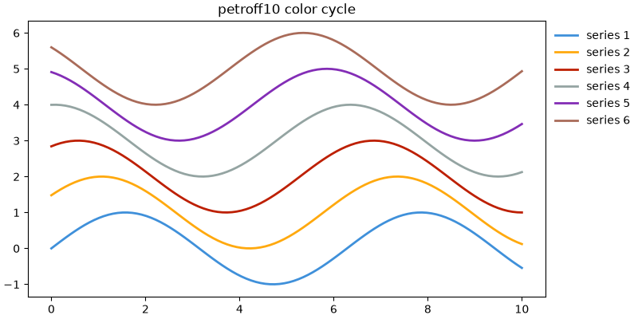

!!! tip "Перевірка без кольору"
    Простий тест: збережіть графік і перегляньте його в режимі відтінків сірого (або роздрукуйте). Якщо лінії злилися — додайте стилі ліній, маркери або прямі підписи (лекція 37).

## Колір як акцент

Найсильніший прийом роботи з кольором — **сірий фон і один яскравий колір**. Читач миттєво бачить, про що графік, і не мусить звіряти кольори з легендою.

```python
import matplotlib.pyplot as plt
import numpy as np

rng = np.random.default_rng(7)
years = np.arange(2015, 2026)
cities = ["Kyiv", "Lviv", "Odesa", "Dnipro", "Kharkiv", "Vinnytsia", "Poltava", "Rivne"]
# індекс вартості житла, 2015 = 100
prices = {
    city: 100 * np.cumprod(1 + rng.normal(0.04, 0.05, size=len(years)))
    for city in cities
}
prices["Lviv"] = 100 * np.cumprod(1 + rng.normal(0.11, 0.03, size=len(years)))
prices["Lviv"][0] = 100

highlight = "Lviv"

fig, ax = plt.subplots(figsize=(8, 4.2), layout="constrained")
for city, values in prices.items():
    if city == highlight:
        continue
    ax.plot(years, values, color="0.75", linewidth=1.2)

values = prices[highlight]
ax.plot(years, values, color="tab:red", linewidth=2.8)
ax.annotate(highlight, xy=(years[-1], values[-1]), xytext=(6, 0),
            textcoords="offset points", va="center",
            color="tab:red", fontweight="bold")
ax.text(years[-1] + 0.2, 125, "other cities", color="0.5", va="center")

ax.spines[["top", "right"]].set_visible(False)
ax.set(title="Housing price index, 2015 = 100", xlabel="Year", ylabel="Index",
       xlim=(years[0], years[-1] + 1.6), xticks=years[::2])
plt.show()
```

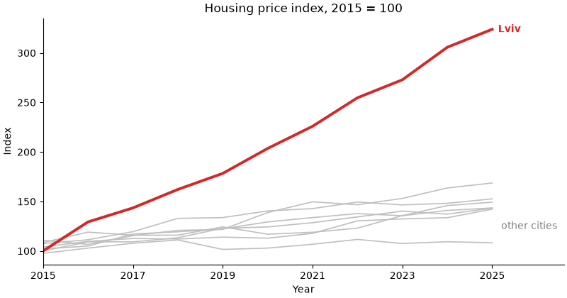

- спочатку малюємо «фонові» лінії сірим, потім — виділену. Те, що намальовано пізніше, опиняється **зверху**;
- замість легенди — прямий підпис виділеної лінії і один підпис «other cities» для всіх сірих;
- для стовпчиків той самий прийом робиться списком кольорів: `color=["tab:red" if c == highlight else "0.75" for c in cities]` (лекція 41).

## Прозорість і порядок шарів: `alpha`, `zorder`

Кожен елемент графіка має **`zorder`** — номер шару. Елементи з більшим `zorder` малюються поверх елементів з меншим. Значення за замовчуванням:

| Елемент | `zorder` |
|---|---|
| стовпчики, `fill_between`, `axvspan`, `scatter` | 1 |
| сітка і поділки осей | 1.5 |
| лінії (`plot`, `axhline`) | 2 |
| текст, `annotate` | 3 |
| легенда | 5 |

Якщо `zorder` однаковий, діє порядок виклику: пізніше — вище.

```python
import matplotlib.pyplot as plt
import numpy as np

rng = np.random.default_rng(3)
x = np.arange(1, 31)
y = 50 + np.cumsum(rng.normal(0, 3, size=30))
i_min = np.argmin(y)

fig, (ax1, ax2) = plt.subplots(1, 2, figsize=(10, 3.8), layout="constrained")

for ax in (ax1, ax2):
    ax.set(xlabel="Day", ylabel="Value")

# ліворуч: усе за замовчуванням
ax1.bar(x, y, color="tab:blue", alpha=0.3)
ax1.plot(x, y, color="tab:blue", marker="o", markersize=4)
ax1.scatter(x[i_min], y[i_min], s=150, color="tab:red")
ax1.grid(True, linewidth=2)
ax1.set_title("Default order")

# праворуч: явні шари
ax2.set_axisbelow(True)
ax2.grid(True, axis="y", color="0.9", linewidth=1)
ax2.bar(x, y, color="tab:blue", alpha=0.3, zorder=1)
ax2.plot(x, y, color="tab:blue", marker="o", markersize=4,
         markerfacecolor="white", zorder=2)
ax2.scatter(x[i_min], y[i_min], s=150, color="tab:red",
            edgecolors="white", linewidths=1.5, zorder=3)
ax2.set_title("Explicit layers")
plt.show()
```

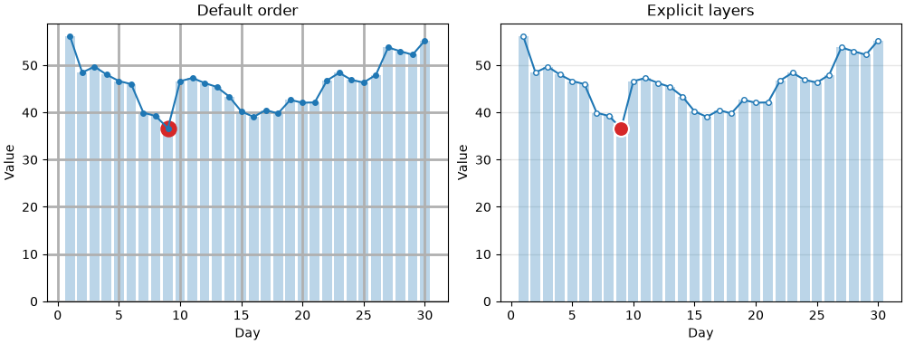

- ліворуч сітка (1.5) лежить **поверх** стовпчиків (1) і перекреслює їх, а лінія (2) проходить **поверх** червоної точки `scatter` (1), хоча точку намальовано пізніше;
- `ax.set_axisbelow(True)` — сітка і поділки під усіма даними (у `rcParams` — `axes.axisbelow`);
- праворуч `zorder` задано явно: стовпчики → лінія → виділена точка;
- `markerfacecolor="white"` — порожні маркери: лінія «проходить» крізь них, але не перекреслює;
- біла обводка (`edgecolors="white"`) відокремлює виділену точку від лінії під нею.

`alpha` — прозорість від 0 (невидимий) до 1 (непрозорий). Вона корисна для перекриття (сотні точок scatter, кілька гістограм поверх), але має ціну: колір напівпрозорого стовпчика залежить від того, що під ним, і його складніше впізнати в легенді. Якщо потрібен лише **світліший** колір без перекриття, краще взяти світліший відтінок непрозорим кольором.

## Власні колірні карти

Колірну карту можна створити з власних кольорів. Є два види:

- `ListedColormap` — **дискретний** набір кольорів: рівно стільки кольорів, скільки передали;
- `LinearSegmentedColormap.from_list` — **неперервний** перехід через задані кольори.

```python
import matplotlib.pyplot as plt
import numpy as np
from matplotlib.colors import LinearSegmentedColormap, ListedColormap

brand = LinearSegmentedColormap.from_list("brand", ["#f1faee", "#2a9d8f", "#264653"])
heat = LinearSegmentedColormap.from_list("heat", ["#2166ac", "white", "#b2182b"])
levels = ListedColormap(["#1a9850", "#fee08b", "#fc8d59", "#d73027"], name="levels")

gradient = np.linspace(0, 1, 256).reshape(1, -1)

fig, axs = plt.subplots(3, 1, figsize=(7, 2.6), layout="constrained")
for ax, cmap in zip(axs, [brand, heat, levels]):
    ax.imshow(gradient, aspect="auto", cmap=cmap)
    ax.set_axis_off()
    ax.text(-0.01, 0.5, f"{type(cmap).__name__}: {cmap.name}",
            transform=ax.transAxes, ha="right", va="center")
plt.show()
```

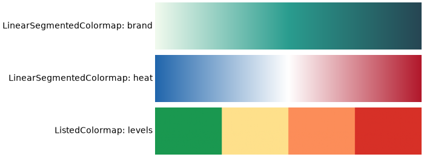

- у `from_list` кольори розташовуються рівномірно: перший — у 0, останній — у 1, середній — у 0.5;
- `heat` з білим посередині — саморобна **розбіжна** карта;
- обернену карту дає метод `.reversed()`, а кількість кольорів неперервної карти можна обмежити `.resampled(5)`.

## Нормування кольору: `BoundaryNorm`, `TwoSlopeNorm`, `LogNorm`

Колір визначається у два кроки: спочатку **нормування** (`norm`) перетворює значення на число від 0 до 1, потім **карта** (`cmap`) перетворює це число на колір. За замовчуванням нормування лінійне: `vmin` → 0, `vmax` → 1. Змінивши `norm`, можна змінити, як значення розподіляються по кольорах.

| `norm` | Що робить | Коли |
|---|---|---|
| `Normalize(vmin, vmax)` | лінійно (за замовчуванням) | більшість випадків |
| `BoundaryNorm(bounds, ncolors)` | значення між межами → один колір | офіційні рівні: якість повітря, оцінки, ризик |
| `TwoSlopeNorm(vcenter=0)` | різні масштаби нижче і вище центру | розбіжна карта для несиметричних даних |
| `LogNorm()` | логарифмічно | значення від одиниць до мільйонів |

### Дискретні рівні: `BoundaryNorm`

Індекс якості повітря (AQI) має офіційні межі: 0–50 — добре, 50–100 — помірно, 100–150 — шкідливо для чутливих, 150+ — шкідливо. Колір має показувати **рівень**, а не точне значення:

```python
import matplotlib.pyplot as plt
import numpy as np
from matplotlib.colors import BoundaryNorm, ListedColormap

rng = np.random.default_rng(11)
days = ["Mon", "Tue", "Wed", "Thu", "Fri", "Sat", "Sun"]
hours = np.arange(24)
# індекс якості повітря: пік у години пік, вихідні чистіші
rush = 70 * np.exp(-((hours - 8) / 2) ** 2) + 100 * np.exp(-((hours - 18) / 2.5) ** 2)
weekday_factor = np.array([1, 1, 1.1, 1, 1.4, 0.6, 0.5]).reshape(-1, 1)
aqi = 30 + weekday_factor * rush + rng.normal(0, 8, size=(7, 24))

bounds = [0, 50, 100, 150, 200]
cmap = ListedColormap(["#1a9850", "#fee08b", "#fc8d59", "#d73027"])
norm = BoundaryNorm(bounds, ncolors=cmap.N)

fig, ax = plt.subplots(figsize=(10, 3.6), layout="constrained")
im = ax.imshow(aqi, cmap=cmap, norm=norm, aspect="auto")
cbar = fig.colorbar(im, ax=ax, ticks=bounds)
cbar.set_label("AQI")
ax.set_yticks(range(7), days)
ax.set_xticks(hours[::2])
ax.set(title="Air quality index by hour", xlabel="Hour")
plt.show()
```

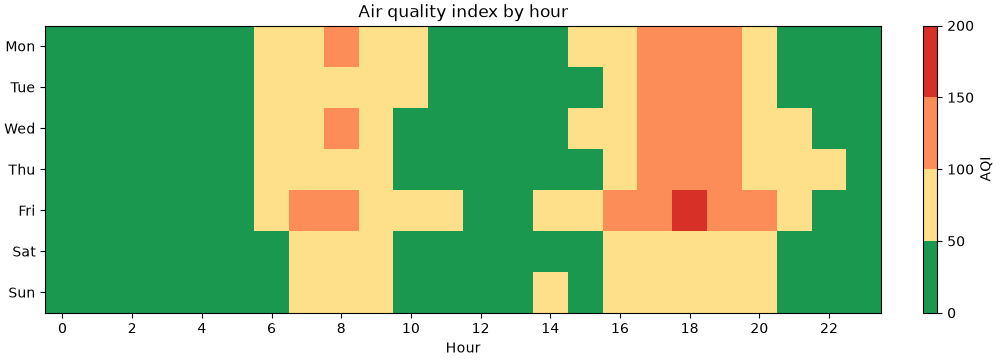

- `ListedColormap` з 4 кольорів і 5 меж: значення в `[0, 50)` отримують перший колір, `[50, 100)` — другий і так далі;
- `ncolors=cmap.N` — кількість кольорів у карті; має відповідати кількості інтервалів;
- `colorbar` сам стає «сходинками», а `ticks=bounds` ставить поділки точно на межах.

Порівняйте з неперервною картою: там 99 і 101 мають майже однаковий колір, хоча належать до різних рівнів.

### Несиметричний центр: `TwoSlopeNorm`

У лекції 39 для розбіжної карти ми задавали симетричні межі `vmin=-a, vmax=a`. Але якщо дані від −10 до +60, симетрична шкала витрачає половину кольорів на значення, яких немає. `TwoSlopeNorm` ставить білий колір у центр, а синю і червону частини розтягує **незалежно**:

```python
import matplotlib.pyplot as plt
import numpy as np
from matplotlib.colors import TwoSlopeNorm

rng = np.random.default_rng(12)
stores = [f"Store {i}" for i in range(1, 9)]
months = ["Jan", "Feb", "Mar", "Apr", "May", "Jun",
          "Jul", "Aug", "Sep", "Oct", "Nov", "Dec"]
# прибуток, тис. грн: більшість місяців прибуткові, кілька збиткових
profit = rng.normal(20, 15, size=(8, 12))
profit[2, :4] -= 30
profit[6, 6:] += 35

norm = TwoSlopeNorm(vmin=profit.min(), vcenter=0, vmax=profit.max())

fig, ax = plt.subplots(figsize=(10, 4), layout="constrained")
im = ax.imshow(profit, cmap="RdBu", norm=norm, aspect="auto")
fig.colorbar(im, ax=ax, label="Profit, thousand UAH")
ax.set_xticks(range(12), months)
ax.set_yticks(range(8), stores)
ax.set_title("Monthly profit by store")
plt.show()
```

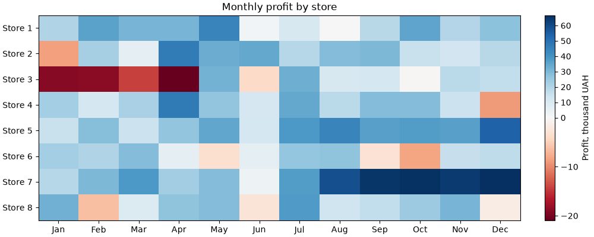

- збиток (від'ємні значення) — червоний, прибуток — синій, нуль — білий;
- шкала `colorbar` нерівномірна: нижня частина коротша за значеннями, але займає половину висоти. Це чесно щодо **знака**, але не щодо **величини**: −20 виглядає так само насичено, як +65. Якщо важлива саме величина, використовуйте симетричні `vmin=-a, vmax=a`.

`LogNorm` використовують так само — `norm=LogNorm(vmin=1, vmax=1e6)`. Він потрібен, коли в даних кілька порядків величини (населення міст, кількість переглядів): з лінійним нормуванням усі значення, крім найбільших, мали б однаковий колір.

## Стилі ліній і маркерів

Крім готових `"-"`, `"--"`, `":"`, `"-."`, штрихи лінії можна задати **кортежем** `(offset, (on, off, on, off, ...))` — довжини штрихів і пропусків у пунктах:

```python
import matplotlib.pyplot as plt
import numpy as np

x = np.linspace(0, 10, 11)

styles = [
    ("'-'", dict(linestyle="-")),
    ("'--'", dict(linestyle="--")),
    ("(0, (1, 1))", dict(linestyle=(0, (1, 1)))),
    ("(0, (8, 2, 1, 2))", dict(linestyle=(0, (8, 2, 1, 2)))),
    ("marker='o', mfc='white'", dict(marker="o", markerfacecolor="white")),
    ("marker='s', markevery=3", dict(marker="s", markevery=3)),
    ("marker='D', ms=8, mec='black'", dict(marker="D", markersize=8, markeredgecolor="black")),
    ("drawstyle='steps-mid'", dict(drawstyle="steps-mid")),
]

fig, ax = plt.subplots(figsize=(8, 4.2), layout="constrained")
for i, (label, kwargs) in enumerate(styles):
    y = len(styles) - i
    ax.plot(x, np.full_like(x, y) + 0.15 * np.sin(x), color="tab:blue",
            linewidth=2, **kwargs)
    ax.text(10.5, y, label, va="center", family="monospace")
ax.set_xlim(-0.5, 18)
ax.set_axis_off()
plt.show()
```

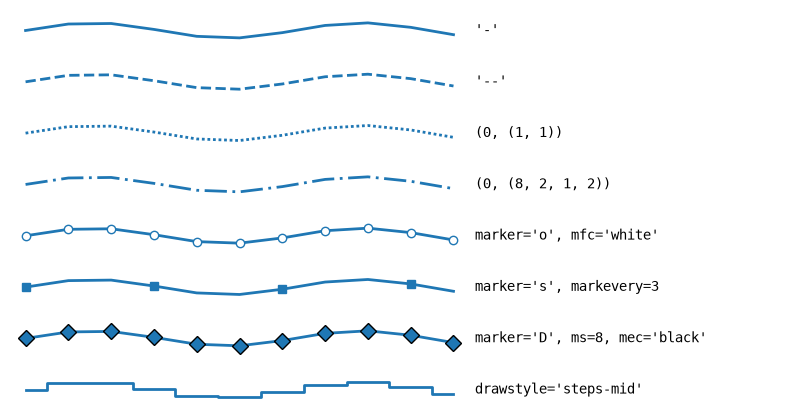

| Параметр | Скорочення | Що задає |
|---|---|---|
| `linestyle` | `ls` | штрихи лінії |
| `linewidth` | `lw` | товщина, пункти |
| `marker` | | форма маркера: `"o"`, `"s"`, `"^"`, `"D"`, `"x"`, `"+"` |
| `markersize` | `ms` | розмір маркера |
| `markerfacecolor` | `mfc` | заливка маркера |
| `markeredgecolor` | `mec` | обводка маркера |
| `markeredgewidth` | `mew` | товщина обводки |
| `markevery` | | маркер на кожній N-й точці — для довгих рядів |
| `drawstyle` | `ds` | `"steps-pre"`, `"steps-mid"`, `"steps-post"` — сходинки |

`markevery` корисний, коли точок сотні: маркер на кожній точці зливається в товсту лінію, а маркер на кожній 20-й допомагає розрізнити лінії на чорно-білому друку.

## Що всередині стилю

Стиль — це словник параметрів `rcParams`. Подивитися, що саме змінює стиль, можна через `plt.style.library`:

```python
import matplotlib.pyplot as plt

for key, value in plt.style.library["ggplot"].items():
    print(f"{key:24} {value}")
```

```text
axes.axisbelow           True
axes.edgecolor           white
axes.facecolor           #E5E5E5
axes.grid                True
axes.labelcolor          #555555
axes.labelsize           large
axes.linewidth           1.0
axes.prop_cycle          cycler('color', ['#E24A33', '#348ABD', '#988ED5', '#777777', '#FBC15E', '#8EBA42', '#FFB5B8'])
axes.titlesize           x-large
figure.edgecolor         0.50
figure.facecolor         white
font.size                10.0
grid.color               white
grid.linestyle           -
patch.antialiased        True
patch.edgecolor          #EEEEEE
patch.facecolor          #348ABD
patch.linewidth          0.5
xtick.color              #555555
xtick.direction          out
ytick.color              #555555
ytick.direction          out
```

Стиль змінює лише **перелічені** параметри — решта лишається як була. Тому стилі можна накладати. Наприклад, стилі `seaborn-v0_8-paper`, `-notebook`, `-talk`, `-poster` не змінюють кольорів і фону, а лише **розміри** шрифтів, ліній і фігури — під статтю, ноутбук, доповідь, плакат:

```python
import matplotlib.pyplot as plt

for context in ["paper", "notebook", "talk", "poster"]:
    params = plt.style.library[f"seaborn-v0_8-{context}"]
    print(f"{context:9} axes.titlesize={params['axes.titlesize']:<5} "
          f"xtick.labelsize={params['xtick.labelsize']:<5} "
          f"lines.linewidth={params['lines.linewidth']}")
```

```text
paper     axes.titlesize=9.6   xtick.labelsize=8.0   lines.linewidth=1.4
notebook  axes.titlesize=12.0  xtick.labelsize=10.0  lines.linewidth=1.75
talk      axes.titlesize=15.6  xtick.labelsize=13.0  lines.linewidth=2.275
poster    axes.titlesize=19.2  xtick.labelsize=16.0  lines.linewidth=2.8
```

Поєднання «оформлення + масштаб» для слайдів:

```python
import matplotlib.pyplot as plt
import numpy as np

x = np.linspace(0, 10, 100)

with plt.style.context(["seaborn-v0_8-whitegrid", "seaborn-v0_8-talk"]):
    fig, ax = plt.subplots(figsize=(8, 4.5), layout="constrained")
    ax.plot(x, np.sin(x), label="sin")
    ax.plot(x, np.cos(x), label="cos")
    ax.set(title="Readable from the back row", xlabel="x")
    ax.legend()

plt.show()
```

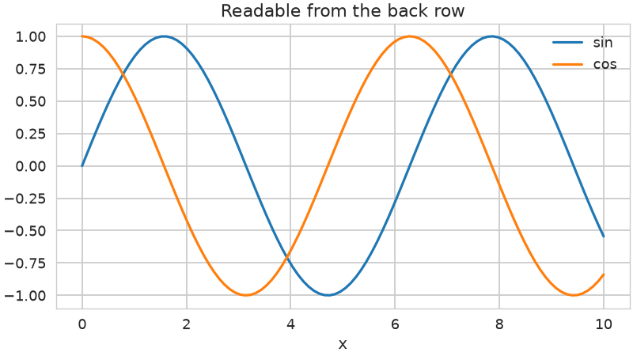

Щоб знайти потрібний ключ `rcParams`, відфільтруйте словник за префіксом:

```python
import matplotlib.pyplot as plt

for key, value in plt.rcParams.items():
    if key.startswith("grid."):
        print(f"{key:22} {value}")
```

```text
grid.alpha             1.0
grid.color             #b0b0b0
grid.linestyle         -
grid.linewidth         0.8
grid.major.alpha       None
grid.major.color       None
grid.major.linestyle   None
grid.major.linewidth   None
grid.minor.alpha       None
grid.minor.color       None
grid.minor.linestyle   None
grid.minor.linewidth   None
```

`None` у `grid.major.*` і `grid.minor.*` означає «взяти загальне значення `grid.*`». Ці ключі з'явилися в matplotlib 3.11 — у старіших версіях їх не буде.

Повний список параметрів з коментарями — у файлі `matplotlibrc`; шлях до нього повертає `matplotlib.matplotlib_fname()`.

## Шрифти: розмір, насиченість, накреслення

Кожен текстовий елемент (`set_title`, `set_xlabel`, `text`, `annotate`, `legend`) приймає параметри шрифту:

| Параметр | Значення |
|---|---|
| `fontsize` (`size`) | число в пунктах або `"xx-small"`, `"small"`, `"medium"`, `"large"`, `"x-large"`, ... |
| `fontweight` (`weight`) | `"light"`, `"normal"`, `"semibold"`, `"bold"` або число 100–900 |
| `fontstyle` (`style`) | `"normal"`, `"italic"` |
| `fontfamily` (`family`) | `"sans-serif"`, `"serif"`, `"monospace"` або назва шрифту |
| `color` | колір тексту |

```python
import matplotlib.pyplot as plt

samples = [
    dict(fontsize="small"),
    dict(fontsize="medium"),
    dict(fontsize="x-large"),
    dict(fontsize=18),
    dict(fontweight="light"),
    dict(fontweight="bold"),
    dict(fontstyle="italic"),
    dict(fontfamily="serif"),
    dict(fontfamily="monospace"),
    dict(color="0.5"),
]

fig, ax = plt.subplots(figsize=(8, 4.6), layout="constrained")
for i, props in enumerate(samples):
    y = 1 - i / len(samples)
    ax.text(0, y, "Sales report 2025", va="top", **props)
    ax.text(0.5, y, str(props), va="top", family="monospace", fontsize=9, color="0.4")
ax.set_axis_off()
plt.show()
```

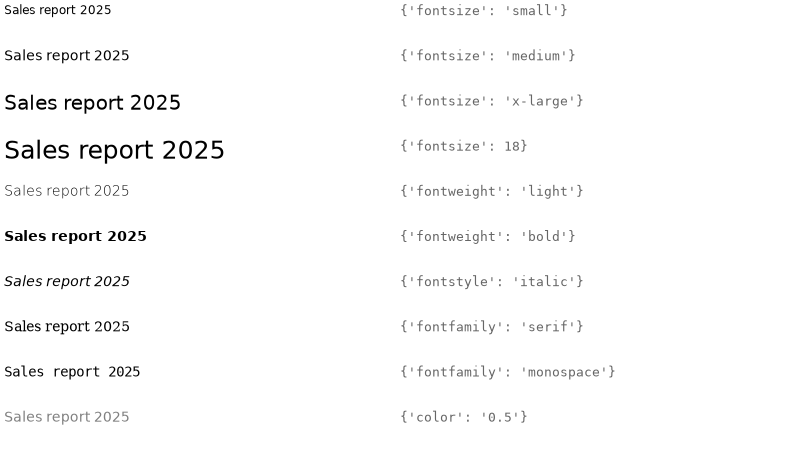

**Відносні** розміри (`"small"`, `"large"`) обчислюються від `rcParams["font.size"]`: `"large"` — це `1.2 × font.size`, `"x-large"` — `1.44 × font.size`. Якщо всі підписи задані відносно, то зміна одного `font.size` пропорційно масштабує весь графік.

Щоб не повторювати ті самі параметри для кожного підпису, їх збирають у словник і розпаковують:

```python
import matplotlib.pyplot as plt

label_font = {"fontsize": 11, "color": "0.3"}
title_font = {"fontsize": 14, "fontweight": "bold", "loc": "left"}

fig, ax = plt.subplots(figsize=(6, 3.5), layout="constrained")
ax.plot([2021, 2022, 2023, 2024, 2025], [12, 15, 14, 19, 23], marker="o")
ax.set_title("Active users, thousands", **title_font)
ax.set_xlabel("Year", **label_font)
ax.set_ylabel("Users", **label_font)
ax.set_xticks([2021, 2022, 2023, 2024, 2025])
plt.show()
```

Розмір і колір **підписів поділок** задаються не в `set_xticks`, а через `tick_params`: `ax.tick_params(axis="both", labelsize=9, labelcolor="0.4")`.

## Сімейство шрифтів і власні шрифти

`fontfamily="sans-serif"` — це не конкретний шрифт, а **сімейство**. Яким шрифтом воно буде намальоване, визначає список `rcParams["font.sans-serif"]`: matplotlib бере перший шрифт зі списку, який є в системі.

```python
import matplotlib.pyplot as plt
from matplotlib import font_manager

print(plt.rcParams["font.family"])
print(plt.rcParams["font.sans-serif"][:4])

# який файл шрифту реально буде використано
print(font_manager.findfont(font_manager.FontProperties(family=["sans-serif"])))

# які шрифти знає matplotlib
names = sorted({f.name for f in font_manager.fontManager.ttflist})
print(len(names), names[:5])
```

```text
['sans-serif']
['DejaVu Sans', 'Bitstream Vera Sans', 'Computer Modern Sans Serif', 'Lucida Grande']
/home/user/env/lib/python3.13/site-packages/matplotlib/mpl-data/fonts/ttf/DejaVuSans.ttf
48 ['C059', 'Caladea', 'Carlito', 'D050000L', 'DejaVu Math TeX Gyre']
```

Вивід залежить від системи: на іншому комп'ютері буде інша кількість шрифтів і інші назви.

Змінити шрифт для всього скрипта — поставити бажаний шрифт **на початок** списку. Інші елементи списку лишаються як запасні, якщо потрібного шрифту немає:

```python
import matplotlib.pyplot as plt

plt.rcParams["font.family"] = "sans-serif"
plt.rcParams["font.sans-serif"] = ["Liberation Sans", "Arial", "DejaVu Sans"]

fig, ax = plt.subplots()
ax.plot([1, 2, 3], [2, 1, 3])
ax.set_title("Liberation Sans if installed, otherwise Arial or DejaVu Sans")
plt.show()
```

Шрифт, якого немає в системі (наприклад, завантажений файл `.ttf` у теці проєкту), реєструється через `fontManager.addfont`. Для прикладу візьмемо один із шрифтів, що постачаються разом з matplotlib:

```python
from pathlib import Path

import matplotlib as mpl
import matplotlib.pyplot as plt
from matplotlib import font_manager

# у реальному проєкті: Path("fonts/MyFont-Regular.ttf")
font_path = Path(mpl.get_data_path()) / "fonts" / "ttf" / "DejaVuSerif.ttf"

font_manager.fontManager.addfont(font_path)
font_name = font_manager.FontProperties(fname=font_path).get_name()
print(font_name)

plt.rcParams["font.family"] = font_name

fig, ax = plt.subplots()
ax.plot([1, 2, 3], [2, 1, 3])
ax.set_title(f"Font: {font_name}")
plt.show()
```

```text
DejaVu Serif
```

- `addfont` додає шрифт до списку відомих matplotlib на час роботи скрипта;
- `FontProperties(fname=...).get_name()` — назва шрифту, записана всередині файлу; саме її, а не ім'я файлу, треба передавати в `font.family`.

!!! warning "Кирилиця і квадратики"
    Не кожен шрифт містить кириличні літери. Якщо шрифт їх не має, matplotlib намалює порожні прямокутники і виведе попередження `Glyph ... missing from font(s)`. Шрифт за замовчуванням `DejaVu Sans` кирилицю підтримує; для інших шрифтів перевіряйте це перед тим, як робити підписи українською у власних звітах.

## Математичні формули: mathtext

Текст між знаками `$...$` matplotlib розбирає як **формулу** у синтаксисі LaTeX. Встановлювати LaTeX для цього не потрібно — matplotlib має вбудований інтерпретатор mathtext:

```python
import matplotlib.pyplot as plt
import numpy as np

x = np.linspace(0, 4, 300)
tau = 1.2

fig, ax = plt.subplots(figsize=(8, 4), layout="constrained")
for f in [1, 2]:
    ax.plot(x, np.exp(-x / tau) * np.sin(2 * np.pi * f * x), label=rf"$f = {f}\,\mathrm{{Hz}}$")

ax.set_title(r"Damped oscillation: $y = e^{-t/\tau}\,\sin(2\pi f t)$, $\tau = 1.2$ s")
ax.set(xlabel=r"$t$, s", ylabel=r"$y$")
ax.text(2.5, 0.6, r"$\sigma^2 = \frac{1}{n}\sum_{i=1}^{n}(x_i - \bar{x})^2$", fontsize=13)
ax.legend()
plt.show()
```

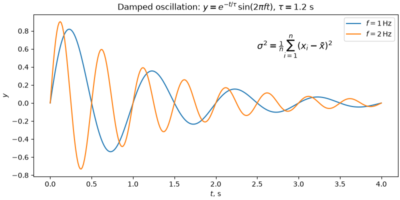

- рядки з формулами пишіть як **raw-рядки** `r"..."`: інакше `\t` у `\tau` Python перетворить на символ табуляції;
- `^` — верхній індекс, `_` — нижній, `{...}` — групування: `e^{-t/\tau}`;
- `\frac{a}{b}`, `\sum`, `\sqrt{x}`, `\bar{x}`, грецькі літери `\alpha`, `\mu`, `\sigma`, `\pi`;
- `\,` — короткий пробіл, `\mathrm{Hz}` — прямий (не курсивний) текст усередині формули;
- в f-рядку `rf"..."` фігурні дужки формули треба подвоювати: `{{Hz}}`, бо одинарні `{}` f-рядок сприймає як підстановку.

Вигляд формул задає `rcParams["mathtext.fontset"]`: `"dejavusans"` (за замовчуванням, як основний текст), `"cm"` (класичний шрифт LaTeX), `"stix"` (схожий на Times). Для повноцінного LaTeX є `rcParams["text.usetex"] = True`, але тоді LaTeX має бути встановлений у системі.

## Заголовки, підзаголовки, примітки

Графік для звіту часто має **заголовок-висновок**, сірий **підзаголовок** з поясненням, що показано, і **примітку** з джерелом даних:

```python
import matplotlib.pyplot as plt
import numpy as np

months = ["Jan", "Feb", "Mar", "Apr", "May", "Jun",
          "Jul", "Aug", "Sep", "Oct", "Nov", "Dec"]
online = np.array([18, 19, 21, 22, 24, 27, 29, 30, 31, 33, 36, 41])

fig, ax = plt.subplots(figsize=(8, 4.4), layout="constrained")
ax.plot(months, online, marker="o", color="tab:blue", linewidth=2.5)

fig.suptitle("Online sales share doubled in a year", x=0.02, ha="left",
             fontsize=15, fontweight="bold")
ax.set_title("Share of online orders, % of all orders, 2025", loc="left",
             color="0.4", fontsize=11, pad=12)
fig.text(0.02, 0.01, "Source: company CRM export, 12 stores", fontsize=8, color="0.5")

ax.spines[["top", "right"]].set_visible(False)
ax.set_ylim(0, 45)
ax.set_ylabel("%")
fig.get_layout_engine().set(h_pad=0.15)
plt.show()
```

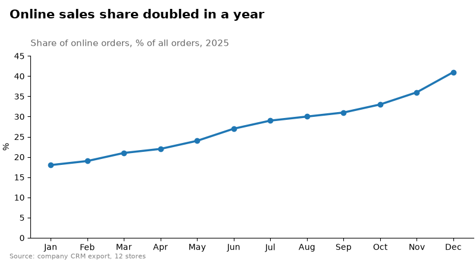

- `fig.suptitle` — заголовок усієї фігури; `x=0.02, ha="left"` вирівнює його ліворуч;
- `ax.set_title(..., loc="left")` — заголовок над `Axes` з лівого краю; `pad` — відступ від рамки в пунктах. Можна навіть мати три заголовки одночасно: `loc="left"`, `"center"`, `"right"`;
- `fig.text(x, y, ...)` — текст у координатах **фігури**: `(0, 0)` — лівий нижній кут, `(1, 1)` — правий верхній;
- `fig.get_layout_engine().set(h_pad=...)` — додатковий вертикальний відступ у `constrained`-компонуванні, щоб примітка не налізала на підпис осі.

Заголовок-висновок («Online sales share doubled in a year») корисніший за заголовок-опис («Online sales by month»): читач одразу знає, що шукати на графіку.

## Довгі підписи поділок

Довгі назви категорій під стовпчиками налізають одна на одну. Поворот на 90° вирішує проблему, але читати збоку незручно. Кращі варіанти:

```python
import matplotlib.pyplot as plt

courses = ["Python Basics", "Data Structures", "Databases and SQL",
           "Web Development", "Machine Learning", "Computer Networks"]
students = [124, 98, 87, 112, 76, 54]

fig, (ax1, ax2) = plt.subplots(1, 2, figsize=(11, 4), layout="constrained")

# поворот на 30 градусів із прив'язкою правого краю до поділки
ax1.bar(courses, students, color="tab:blue")
ax1.set_xticks(range(len(courses)), courses, rotation=30, ha="right",
               rotation_mode="anchor")
ax1.set_title("rotation=30, ha='right'")

# горизонтальні стовпчики: підписи читаються без повороту
ax2.barh(courses, students, color="tab:blue")
ax2.invert_yaxis()
ax2.set_title("barh")
plt.show()
```

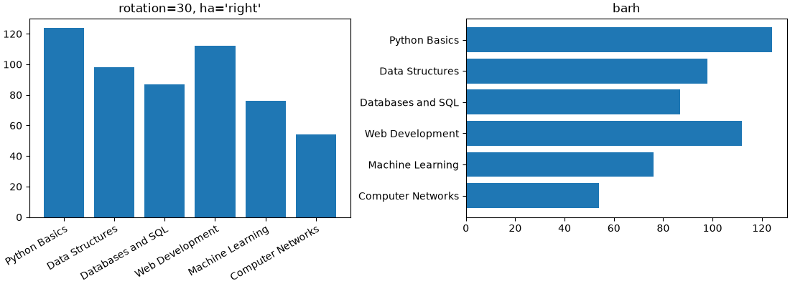

- без `ha="right"` центр повернутого підпису стоїть під поділкою, і підпис «з'їжджає» на сусідній стовпчик;
- `rotation_mode="anchor"` — спочатку вирівнювання, потім поворот навколо точки прив'язки; підпис закінчується точно під своєю поділкою;
- для довгих назв `barh` майже завжди кращий: текст горизонтальний, місця для нього — скільки завгодно.

## Сітка: основна і допоміжна

Сітка допомагає зчитувати значення, але має бути **найслабшим** елементом графіка. Основні налаштування:

| Виклик | Що робить |
|---|---|
| `ax.grid(True)` | сітка за основними поділками обох осей |
| `ax.grid(axis="y")` | лише горизонтальні лінії |
| `ax.grid(which="minor")` | сітка за допоміжними поділками |
| `ax.grid(color=..., linestyle=..., linewidth=..., alpha=...)` | вигляд ліній |
| `ax.minorticks_on()` | увімкнути допоміжні поділки |
| `ax.set_axisbelow(True)` | сітка під даними |

```python
import matplotlib.pyplot as plt
import numpy as np
from matplotlib.ticker import MultipleLocator

rng = np.random.default_rng(5)
t = np.arange(0, 60)
temperature = 20 + 15 * (1 - np.exp(-t / 12)) + rng.normal(0, 0.4, size=60)

fig, (ax1, ax2) = plt.subplots(1, 2, figsize=(11, 4), layout="constrained")

for ax in (ax1, ax2):
    ax.plot(t, temperature, color="tab:red", linewidth=2)
    ax.set(xlabel="Time, min", ylabel="Temperature, C")

ax1.grid(True)
ax1.set_title("ax.grid(True)")

# основні поділки кожні 10 хв і 5 C, допоміжні - кожні 2 хв і 1 C
ax2.xaxis.set_major_locator(MultipleLocator(10))
ax2.xaxis.set_minor_locator(MultipleLocator(2))
ax2.yaxis.set_major_locator(MultipleLocator(5))
ax2.yaxis.set_minor_locator(MultipleLocator(1))
ax2.grid(which="major", color="0.8", linewidth=0.9)
ax2.grid(which="minor", color="0.92", linewidth=0.6)
ax2.tick_params(which="minor", length=2, color="0.6")
ax2.set_axisbelow(True)
ax2.spines[:].set_visible(False)
ax2.set_title("Major + minor grid, no frame")
plt.show()
```

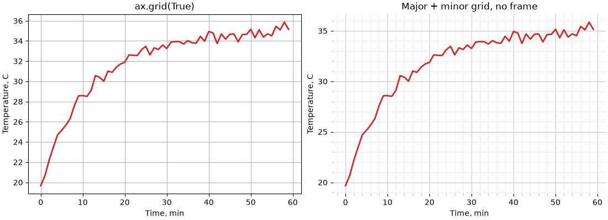

- `MultipleLocator(n)` ставить поділки кратні `n` (локатори — лекція 37); допоміжні поділки задає `set_minor_locator`;
- `grid(which="major")` і `grid(which="minor")` налаштовуються окремо: допоміжна сітка світліша і тонша;
- без рамки (`spines[:].set_visible(False)`) сітка сама задає межі області графіка.

Яку сітку обирати:

| Графік | Сітка |
|---|---|
| вертикальні стовпчики | лише `axis="y"` — порівнюються висоти |
| горизонтальні стовпчики | лише `axis="x"` |
| лінійний графік, де важливі значення | обидві осі, світла |
| є підписи значень (`bar_label`) | сітка не потрібна |
| теплова карта, `imshow` | вимкнути: `ax.grid(False)` |
| логарифмічна вісь | допоміжна сітка (`which="minor"`) показує 2, 3, ..., 9 між степенями 10 |

Для всього скрипта сітку вмикають через `rcParams`: `axes.grid`, `axes.grid.axis` (`"both"`, `"x"`, `"y"`), `axes.grid.which`, `grid.color`, `grid.linewidth`.

## Системи координат анотацій

У лекції 37 ми вказували стрілкою на точку даних через `annotate(text, xy, xytext, arrowprops)`. Параметри `xycoords` і `textcoords` визначають, **в яких одиницях** задані `xy` і `xytext`:

| Значення | Одиниці | Коли |
|---|---|---|
| `"data"` (за замовчуванням) | координати даних | точка на графіку |
| `"axes fraction"` | частки `Axes`: `(0, 0)` — лівий нижній кут, `(1, 1)` — правий верхній | текст у куті графіка, незалежно від даних |
| `"figure fraction"` | частки фігури | текст відносно всієї фігури |
| `"offset points"` | зсув від `xy` у пунктах | підпис поруч із точкою |
| `ax.get_xaxis_transform()` | `x` — дані, `y` — частки `Axes` | підпис вертикальної лінії біля верхнього краю |
| `ax.get_yaxis_transform()` | `x` — частки `Axes`, `y` — дані | підпис горизонтальної лінії біля правого краю |

Останні два варіанти — **змішані** (blended) координати. Вони дуже зручні для подій на часовій осі: дата події відома (`x` у даних), а висота підпису — «біля верху графіка», незалежно від масштабу `y`.

```python
import matplotlib.pyplot as plt
import numpy as np

rng = np.random.default_rng(21)
days = np.arange(1, 91)
visits = 1200 + 6 * days + rng.normal(0, 60, size=90)
visits[30:37] += np.array([900, 700, 450, 300, 180, 90, 40])   # рекламна кампанія
visits[61:64] -= 800                                            # збій сервера

events = {31: "Ad campaign", 62: "Server outage"}

fig, ax = plt.subplots(figsize=(10, 4.2), layout="constrained")
ax.plot(days, visits, color="tab:blue")

for day, label in events.items():
    ax.axvline(day, color="0.5", linestyle="--", linewidth=1)
    # x - дата події, y - 97% висоти Axes
    ax.annotate(label, xy=(day, 0.97), xycoords=ax.get_xaxis_transform(),
                xytext=(4, 0), textcoords="offset points", va="top", color="0.3")

# точка даних і текст поруч зі зсувом
i_min = np.argmin(visits)
ax.annotate(f"min: {visits[i_min]:.0f}", xy=(days[i_min], visits[i_min]),
            xytext=(30, -30), textcoords="offset points", ha="left",
            arrowprops={"arrowstyle": "->"})

# підпис у куті графіка
ax.annotate("Daily visits, 90 days", xy=(0.01, 0.02), xycoords="axes fraction",
            fontsize=9, color="0.5")

ax.set(xlabel="Day", ylabel="Visits", ylim=(0, None))
ax.spines[["top", "right"]].set_visible(False)
plt.show()
```

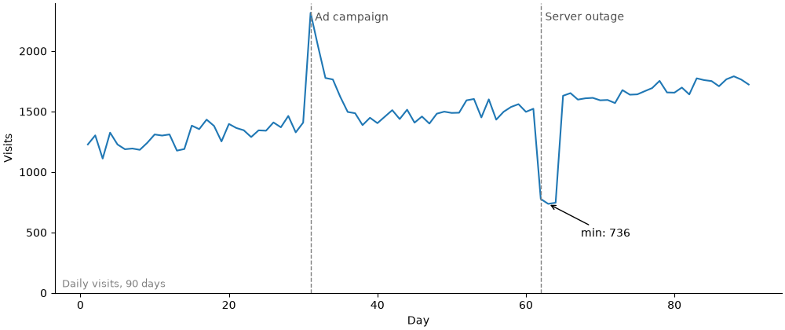

- підписи подій прив'язані до верху графіка: якщо змінити `ylim`, вони не зсунуться і не вийдуть за межі;
- `xytext=(30, -30)` з `textcoords="offset points"` — текст на 30 пунктів правіше і 30 нижче за точку. Зсув у пунктах не залежить від масштабу осей, тому підпис не «відлетить» при зміні даних;
- `xycoords="axes fraction"` — корисно для приміток і позначок `(a)`, `(b)` у кутах підграфіків.

## Стрілки: `arrowstyle` і `connectionstyle`

Словник `arrowprops` керує виглядом стрілки. Два головні ключі: `arrowstyle` — форма наконечника, `connectionstyle` — форма лінії від тексту до точки.

```python
import matplotlib.pyplot as plt

arrowstyles = ["-", "->", "-|>", "<->", "]-", "|-|", "fancy", "wedge"]
connections = ["arc3", "arc3,rad=0.3", "arc3,rad=-0.3",
               "angle3,angleA=0,angleB=90", "angle,angleA=0,angleB=90,rad=5",
               "angle3,angleA=90,angleB=0"]

fig, (ax1, ax2) = plt.subplots(1, 2, figsize=(11, 4.6), layout="constrained")

for i, style in enumerate(arrowstyles):
    y = len(arrowstyles) - i
    ax1.annotate("", xy=(0.95, y), xytext=(0.45, y),
                 arrowprops={"arrowstyle": style, "color": "tab:blue", "lw": 1.5})
    ax1.text(0.4, y, repr(style), ha="right", va="center", family="monospace")
ax1.set(xlim=(0, 1), ylim=(0.3, len(arrowstyles) + 0.7), title="arrowstyle")

for i, conn in enumerate(connections):
    row, col = divmod(i, 2)
    x0, y0 = col * 1.0, -row * 1.0
    ax2.plot(x0 + 0.85, y0 + 0.1, "o", color="tab:red")
    ax2.annotate("", xy=(x0 + 0.85, y0 + 0.1), xytext=(x0 + 0.1, y0 + 0.6),
                 arrowprops={"arrowstyle": "->", "connectionstyle": conn,
                             "color": "tab:blue", "lw": 1.5})
    ax2.text(x0 + 0.05, y0 + 0.78, conn, fontsize=8, family="monospace")
ax2.set(xlim=(0, 2), ylim=(-2.1, 1), title="connectionstyle")

for ax in (ax1, ax2):
    ax.set_xticks([])
    ax.set_yticks([])
plt.show()
```

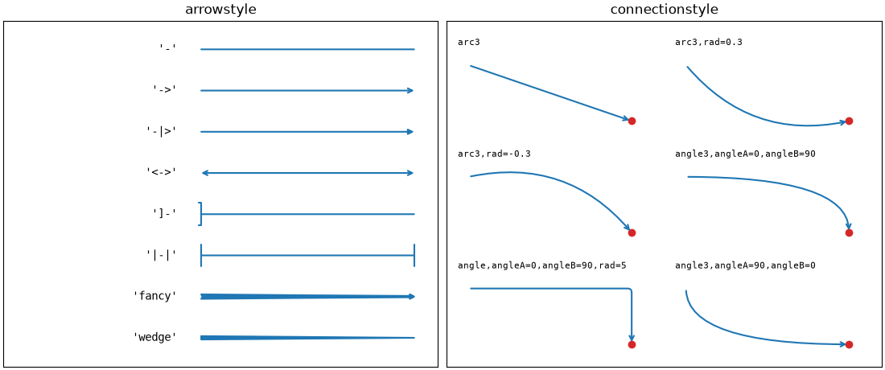

- `annotate("", ...)` з порожнім текстом — просто стрілка від `xytext` до `xy`;
- `"arc3,rad=0.3"` — дуга; знак `rad` задає, в який бік вона вигинається. Дуга корисна, щоб стрілка обійшла лінію графіка, а не перетинала її;
- `"angle,angleA=0,angleB=90"` — ламана з прямим кутом, як у схемах;
- інші ключі `arrowprops`: `color`, `lw` (товщина), `shrinkA` / `shrinkB` — відступ стрілки від тексту і від точки в пунктах.

## Текст у рамці: `bbox`

Параметр `bbox` малює рамку навколо тексту. Рамка з білою заливкою робить текст читабельним, навіть якщо під ним лінії графіка або сітка:

```python
import matplotlib.pyplot as plt
import numpy as np

rng = np.random.default_rng(8)
x = np.linspace(0, 10, 200)
y = np.sin(x) + rng.normal(0, 0.15, size=200)

fig, ax = plt.subplots(figsize=(9, 4), layout="constrained")
ax.plot(x, y, color="tab:blue", alpha=0.7)
ax.grid(True, color="0.85")

boxes = [
    (1.0, "round", {"boxstyle": "round", "fc": "white", "ec": "0.5"}),
    (3.5, "round,pad=0.5", {"boxstyle": "round,pad=0.5", "fc": "#fff3cd", "ec": "#e0a800"}),
    (6.0, "square", {"boxstyle": "square", "fc": "white", "ec": "none", "alpha": 0.85}),
    (8.5, "larrow", {"boxstyle": "larrow", "fc": "tab:red", "ec": "none"}),
]
for xpos, label, props in boxes:
    color = "white" if props["fc"] == "tab:red" else "black"
    # текст прямо на лінії: рамка з заливкою закриває лінію під текстом
    ax.text(xpos, np.sin(xpos), label, ha="center", va="center", bbox=props, color=color)

ax.set_title("Text with bbox")
plt.show()
```

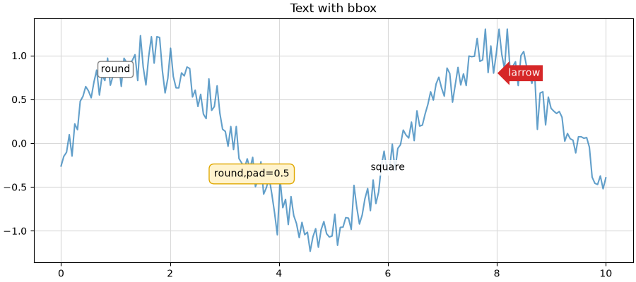

| Ключ `bbox` | Що задає |
|---|---|
| `boxstyle` | форма: `"square"`, `"round"`, `"round4"`, `"sawtooth"`, `"larrow"`, `"rarrow"`; через кому — `pad=0.5` |
| `fc` (`facecolor`) | заливка |
| `ec` (`edgecolor`) | рамка; `"none"` — без рамки |
| `alpha` | прозорість рамки |
| `lw` | товщина рамки |

Для `annotate` рамка задається тим самим `bbox=...`, і стрілка тоді починається від краю рамки.

## Опорні лінії: `axhline`, `axvline`, `axline`

Опорна лінія дає читачеві **точку порівняння**: середнє, план, норму, `y = x`.

| Метод | Лінія |
|---|---|
| `ax.axhline(y)` | горизонтальна на всю ширину |
| `ax.axvline(x)` | вертикальна на всю висоту |
| `ax.axline((x1, y1), (x2, y2))` | нескінченна пряма через дві точки |
| `ax.axline((x1, y1), slope=k)` | нескінченна пряма через точку з нахилом `k` |

Приклад: прогноз і факт. Точки на діагоналі `y = x` — ідеальний прогноз; вище — недооцінка, нижче — переоцінка:

```python
import matplotlib.pyplot as plt
import numpy as np

rng = np.random.default_rng(9)
forecast = rng.uniform(20, 100, size=60)
actual = forecast * rng.normal(1.05, 0.1, size=60)
target = 60

fig, ax = plt.subplots(figsize=(6.5, 5.5), layout="constrained")
ax.scatter(forecast, actual, color="tab:blue", alpha=0.7, edgecolors="white")

ax.axline((0, 0), slope=1, color="0.4", linestyle="--", linewidth=1)
ax.annotate("perfect forecast: y = x", xy=(135, 135), xytext=(0, -14),
            textcoords="offset points", ha="right", rotation=45,
            rotation_mode="anchor", transform_rotates_text=True, color="0.4")

ax.axhline(target, color="tab:red", linewidth=1)
ax.annotate(f"monthly target: {target}", xy=(1, target),
            xycoords=ax.get_yaxis_transform(), xytext=(0, 4),
            textcoords="offset points", ha="right", color="tab:red")

ax.set(xlim=(0, 140), ylim=(0, 140), aspect="equal",
       xlabel="Forecast, thousand UAH", ylabel="Actual, thousand UAH",
       title="Forecast vs actual sales")
plt.show()
```

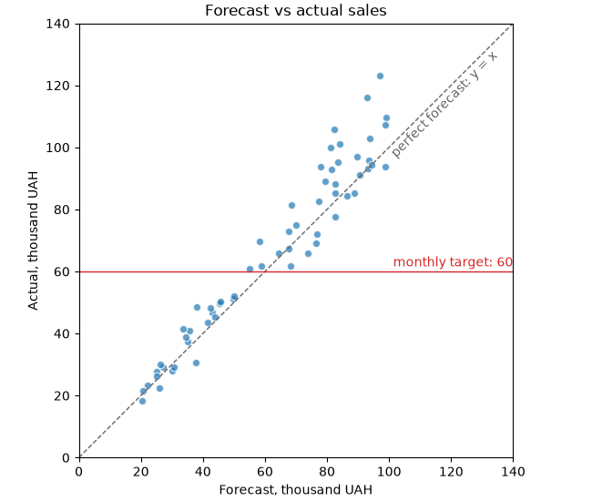

- `axline` не потребує меж: пряма продовжується до країв графіка за будь-яких `xlim` / `ylim`;
- `aspect="equal"` — однаковий масштаб осей, щоб діагональ `y = x` справді йшла під 45°;
- `transform_rotates_text=True` — кут підпису рахується в координатах даних, тому текст лягає паралельно лінії;
- підпис цільового значення прив'язаний до правого краю (`xy=(1, target)` у змішаних координатах) і не залежить від `xlim`.

## Шрифти і текст у збережених файлах

Графіки для звіту зберігають у векторних форматах (`svg`, `pdf`), щоб вони не розмивалися при масштабуванні. Кілька параметрів визначають, як у такий файл потрапляє текст:

| Параметр | Значення | Що дає |
|---|---|---|
| `svg.fonttype` | `"path"` (за замовчуванням) | літери перетворюються на криві: вигляд гарантовано однаковий, але текст не редагується і не шукається |
| `svg.fonttype` | `"none"` | текст лишається текстом: його можна виправити в редакторі, але на іншому комп'ютері без шрифту він виглядатиме інакше |
| `pdf.fonttype` | `42` | шрифт TrueType вбудовується в PDF; цього вимагають деякі видавництва і журнали |

```python
import matplotlib.pyplot as plt

plt.rcParams["svg.fonttype"] = "none"
plt.rcParams["pdf.fonttype"] = 42

fig, ax = plt.subplots(figsize=(6, 3.5), layout="constrained")
ax.bar(["A", "B", "C"], [5, 7, 3], color="tab:blue")
ax.set_title("Editable text in SVG")

fig.savefig("chart.svg")
fig.savefig("chart.pdf")
# прозорий фон - для вставки на кольоровий слайд
fig.savefig("chart.png", dpi=200, transparent=True)
print("saved: chart.svg, chart.pdf, chart.png")
```

```text
saved: chart.svg, chart.pdf, chart.png
```

Розмір шрифту в пунктах — **фізичний** розмір на папері відносно `figsize` у дюймах. Тому для звіту краще одразу задати `figsize` під реальну ширину сторінки (наприклад, 6.5 дюйма для A4 з полями) і `font.size` 9–11, ніж зберегти велику фігуру і потім зменшити картинку: при зменшенні шрифт стане дрібним.

## Приклад: графік до і після

Зберемо прийоми лекції разом. Дані — середній час завантаження сторінки сайту за тиждень для чотирьох регіонів, з ціллю 2 секунди.

Графік «за замовчуванням»:

```python
import matplotlib.pyplot as plt
import numpy as np

rng = np.random.default_rng(42)
days = np.arange(1, 29)
regions = ["Europe", "North America", "Asia", "South America"]
base = {"Europe": 1.4, "North America": 1.6, "Asia": 2.3, "South America": 2.0}
load_time = {r: base[r] + rng.normal(0, 0.12, size=28) for r in regions}
load_time["Asia"][14:] -= np.linspace(0, 0.9, 14)   # з 15-го дня: CDN в Азії

fig, ax = plt.subplots(figsize=(9, 4.5))
for r in regions:
    ax.plot(days, load_time[r], label=r)
ax.axhline(2)
ax.legend()
ax.set_title("Load time")
plt.show()
```

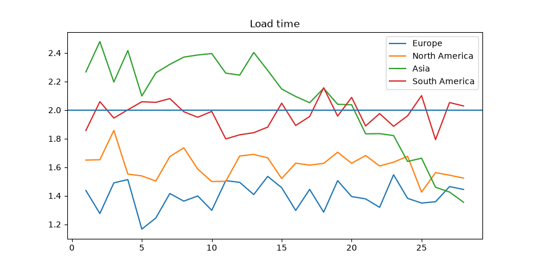

Що тут не так: незрозуміло, про що графік; чотири кольори однакової ваги; легенда перекриває дані; лінія цілі нічим не підписана; не видно, що сталося на 15-й день.

Той самий графік після оформлення:

```python
import matplotlib.pyplot as plt
import numpy as np

rng = np.random.default_rng(42)
days = np.arange(1, 29)
regions = ["Europe", "North America", "Asia", "South America"]
base = {"Europe": 1.4, "North America": 1.6, "Asia": 2.3, "South America": 2.0}
load_time = {r: base[r] + rng.normal(0, 0.12, size=28) for r in regions}
load_time["Asia"][14:] -= np.linspace(0, 0.9, 14)   # з 15-го дня: CDN в Азії

target = 2.0
highlight = "Asia"
accent = "#D55E00"
# вертикальний зсув підписів у пунктах, щоб вони не налізали один на одного
nudge = {"Europe": 0, "North America": 5, "Asia": -5, "South America": 0}

plt.rcParams.update({
    "font.size": 10,
    "axes.spines.top": False,
    "axes.spines.right": False,
    "axes.titlelocation": "left",
    "axes.axisbelow": True,
})

fig, ax = plt.subplots(figsize=(9, 4.5), layout="constrained")

# сітка: лише горизонтальна, світла
ax.grid(axis="y", color="0.9")

# фонові лінії сірим, виділена - акцентним кольором поверх
for r in regions:
    is_main = r == highlight
    ax.plot(days, load_time[r],
            color=accent if is_main else "0.7",
            linewidth=2.6 if is_main else 1.3,
            zorder=3 if is_main else 2)
    ax.annotate(r, xy=(days[-1], load_time[r][-1]), xytext=(6, nudge[r]),
                textcoords="offset points", va="center",
                color=accent if is_main else "0.5",
                fontweight="bold" if is_main else "normal")

# ціль: опорна лінія з підписом біля лівого краю
ax.axhline(target, color="0.3", linestyle="--", linewidth=1)
ax.annotate(f"target {target:.0f} s", xy=(0, target), xycoords=ax.get_yaxis_transform(),
            xytext=(4, 4), textcoords="offset points", color="0.3", fontsize=9,
            bbox={"boxstyle": "square,pad=0.1", "fc": "white", "ec": "none"})

# подія: вертикальна лінія з підписом біля верху
ax.axvline(15, color=accent, linewidth=1, alpha=0.5)
ax.annotate("CDN launched\nin Asia", xy=(15, 0.97), xycoords=ax.get_xaxis_transform(),
            xytext=(6, 0), textcoords="offset points", va="top",
            color=accent, fontsize=9,
            bbox={"boxstyle": "round,pad=0.3", "fc": "white", "ec": "none"})

fig.suptitle("Asia now loads faster than the target", x=0.02, ha="left",
             fontsize=15, fontweight="bold")
ax.set_title("Average page load time by region, seconds, last 28 days",
             color="0.4", fontsize=10.5, pad=10)
ax.set(xlabel="Day", xlim=(1, 28), ylim=(1, 2.8))
ax.tick_params(colors="0.4")
fig.text(0.02, 0.01, "Source: synthetic monitoring, 5-minute checks",
         fontsize=8, color="0.5")
fig.get_layout_engine().set(h_pad=0.12)
plt.show()
```

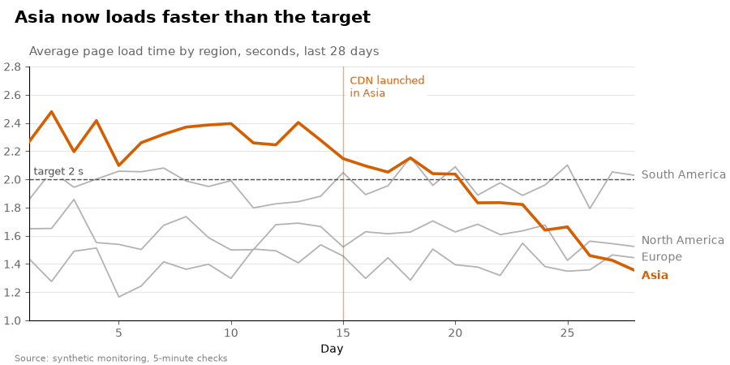

Що змінилося:

| Проблема | Рішення |
|---|---|
| незрозуміло, про що графік | заголовок-висновок + сірий підзаголовок з одиницями |
| усі лінії однакові | сірі фонові лінії, одна акцентна (`zorder=3`) |
| легенда перекриває дані | прямі підписи біля кінців ліній |
| ціль без пояснення | пунктир + підпис у змішаних координатах |
| причина зміни невідома | вертикальна лінія події з підписом у рамці |
| важка рамка і сітка | без верхньої/правої рамки, лише світла горизонтальна сітка під даними |
| немає джерела | примітка `fig.text` у нижньому куті |

Загальні налаштування винесені в `plt.rcParams.update(...)` — у реальному проєкті їх переносять у файл `.mplstyle` (лекція 37), і всі графіки звіту отримують однаковий вигляд.

## Типові помилки

**Веселка кольорів для категорій.** 8 яскравих кольорів однакової ваги — читач не знає, куди дивитися. Виділіть головне одним кольором, решту — сірим.

**Колір — єдина відмінність між лініями.** Для людей з порушенням кольорового зору і на чорно-білому друку лінії зливаються. Додайте стиль лінії, маркер або прямий підпис; використовуйте палітри Okabe-Ito, `tableau-colorblind10`, `petroff10`.

**Різні кольори для однієї сутності на різних графіках.** «Дохід» синій на одному графіку і зелений на іншому. Тримайте кольори у словнику і беріть їх звідти.

**Компоненти RGB від 0 до 255.** `color=(42, 157, 143)` — помилка; matplotlib очікує числа від 0 до 1: `(42/255, 157/255, 143/255)` або hex `"#2a9d8f"`.

**Число замість рядка для сірого.** `color=0.5` — помилка, `color="0.5"` — сірий.

**Неперервна карта для офіційних рівнів.** Якщо в даних є межі (норма, рівні ризику, оцінки), використовуйте `ListedColormap` + `BoundaryNorm`.

**Сітка поверх стовпчиків.** `ax.set_axisbelow(True)` або `rcParams["axes.axisbelow"] = True`.

**Надто помітна сітка.** Сітка — допоміжний шар: світло-сіра (`"0.85"`–`"0.92"`), тонка, лише за потрібною віссю.

**Формули без raw-рядка.** `"$\tau$"` — Python перетворить `\t` на табуляцію. Пишіть `r"$\tau$"`. У f-рядках з формулами — `rf"..."` і подвоєні `{{ }}`.

**Анотації в координатах даних для «службових» підписів.** Підпис події, ліміту, примітка в куті, задані в координатах даних, з'їжджають або зникають при зміні `ylim`. Використовуйте `"axes fraction"`, `get_xaxis_transform()`, `get_yaxis_transform()`.

**Повернуті підписи без `ha="right"`.** Повернутий підпис зміщується на сусідню поділку. `rotation=30, ha="right", rotation_mode="anchor"` або `barh`.

**Шрифт без кирилиці.** У звітах українською — квадратики замість літер. Перевіряйте, що обраний шрифт містить кирилицю.

**Велика фігура, зменшена у звіті.** Шрифт стає нечитабельним. Задавайте `figsize` під реальну ширину сторінки.

## Підсумок

- **Шари важливості:** дані → акценти → контекст → допоміжне. Посилюйте дані, послаблюйте рамку, сітку і легенду.
- **Формати кольору:** `"tab:blue"`, CSS-назви, hex `"#rrggbb[aa]"`, RGB(A) 0..1, `"0.6"` — сірий, `"C0"` — колір циклу; перетворення — `matplotlib.colors.to_hex`, `to_rgba`.
- **Палітри:** `mpl.colormaps["tab10"].colors`; `n` кольорів з неперервної карти — `cmap(np.linspace(0, 1, n))`; доступні палітри — Okabe-Ito, стилі `tableau-colorblind10`, `petroff10`.
- **Акцент:** сірі фонові елементи + один яскравий колір + прямий підпис замість легенди.
- **Шари:** `zorder` (більший — вище), `ax.set_axisbelow(True)`, біла обводка і порожні маркери; `alpha` — для перекриття, а не для «світлішого кольору».
- **Власні карти:** `ListedColormap` — дискретна, `LinearSegmentedColormap.from_list` — неперервна; `.reversed()`, `.resampled(n)`.
- **Нормування:** `BoundaryNorm` — офіційні рівні; `TwoSlopeNorm(vcenter=0)` — несиметричні дані з центром; `LogNorm` — кілька порядків величини.
- **Лінії і маркери:** штрихи `(0, (on, off))`, `mfc`, `mec`, `markevery`, `drawstyle`.
- **Стилі:** `plt.style.library[name]` — що змінює стиль; накладання стилів списком; `seaborn-v0_8-paper/notebook/talk/poster` — масштаб під носій.
- **Шрифти:** `fontsize`, `fontweight`, `fontstyle`, `fontfamily`; відносні розміри від `font.size`; `rcParams["font.sans-serif"]` — список з запасними; `font_manager.fontManager.addfont` — власний `.ttf`; кирилиця має бути в шрифті.
- **Формули:** `r"$...$"`, `^`, `_`, `\frac`, `\sum`, грецькі літери; `mathtext.fontset`.
- **Заголовки:** `fig.suptitle(x=0.02, ha="left")`, `set_title(loc="left", pad=...)`, примітка `fig.text`; заголовок-висновок.
- **Підписи поділок:** `rotation=30, ha="right", rotation_mode="anchor"` або `barh`; `tick_params(labelsize=..., labelcolor=...)`.
- **Сітка:** `grid(axis=..., which=..., color=..., linewidth=...)`, `minorticks_on`, `set_minor_locator`; лише потрібна вісь, світла, під даними.
- **Анотації:** `xycoords` / `textcoords`: `"data"`, `"axes fraction"`, `"offset points"`, змішані `get_xaxis_transform()` / `get_yaxis_transform()`; `arrowstyle`, `connectionstyle`; `bbox` для читабельності.
- **Опорні лінії:** `axhline`, `axvline`, `axline(..., slope=...)` з підписами.
- **Збереження:** `svg.fonttype = "none"` — редагований текст, `pdf.fonttype = 42`, `transparent=True`; `figsize` під реальну ширину сторінки.

## Корисні посилання

- [matplotlib: Specifying colors](https://matplotlib.org/stable/users/explain/colors/colors.html)
- [matplotlib: Choosing Colormaps](https://matplotlib.org/stable/users/explain/colors/colormaps.html)
- [matplotlib: Creating Colormaps](https://matplotlib.org/stable/users/explain/colors/colormap-manipulation.html)
- [matplotlib: Colormap normalization](https://matplotlib.org/stable/users/explain/colors/colormapnorms.html)
- [matplotlib: Style sheets reference (gallery)](https://matplotlib.org/stable/gallery/style_sheets/style_sheets_reference.html)
- [matplotlib: Customizing with style sheets and rcParams](https://matplotlib.org/stable/users/explain/customizing.html)
- [matplotlib: Text properties and layout](https://matplotlib.org/stable/users/explain/text/text_props.html)
- [matplotlib: Fonts in matplotlib](https://matplotlib.org/stable/users/explain/text/fonts.html)
- [matplotlib: Writing mathematical expressions](https://matplotlib.org/stable/users/explain/text/mathtext.html)
- [matplotlib: Annotations](https://matplotlib.org/stable/users/explain/text/annotations.html)
- [matplotlib: Linestyles (gallery)](https://matplotlib.org/stable/gallery/lines_bars_and_markers/linestyles.html)
- [Okabe & Ito: Color Universal Design](https://jfly.uni-koeln.de/color/)
