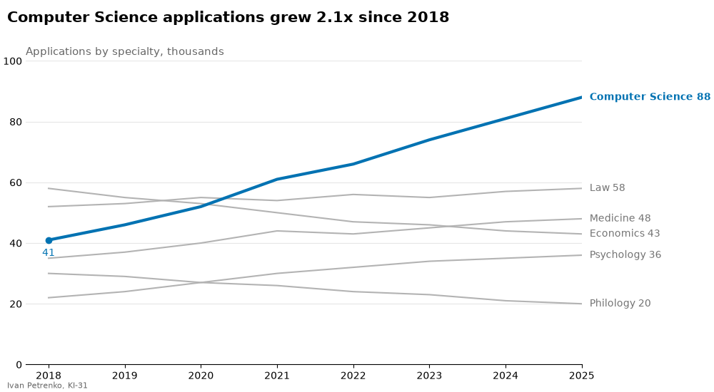
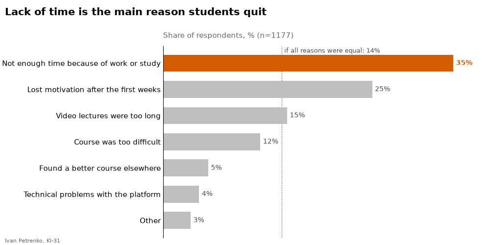
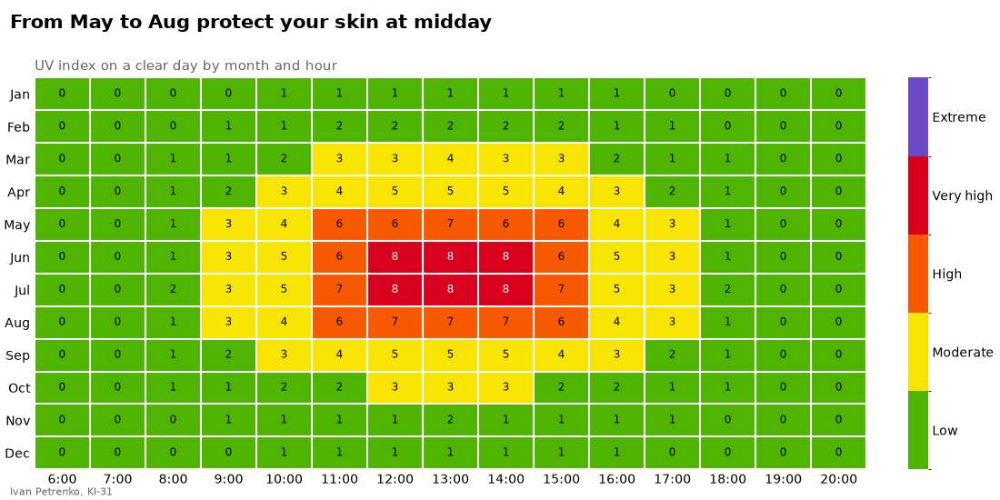
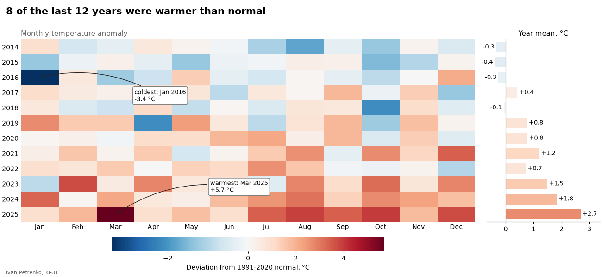
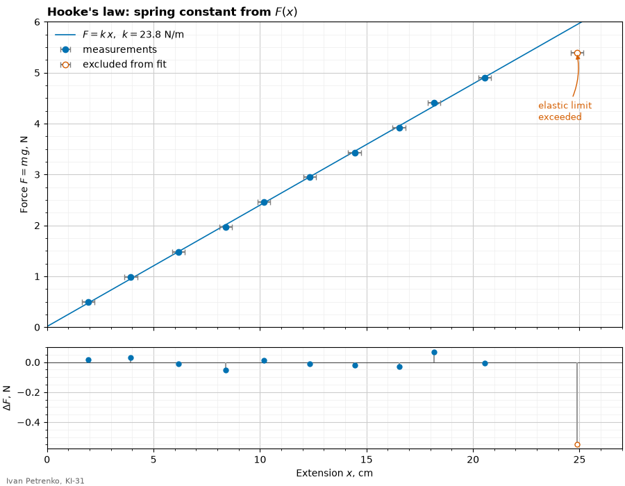
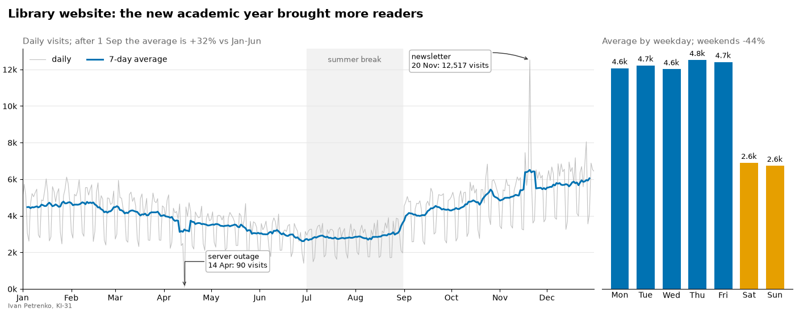

# 44. (П20) Створення інформативних графіків для наборів даних

## Передумови

- Прочитана [Лекція 43 — Налаштування кольорів, стилів, шрифтів, сітки, анотацій](/ua/courses/programming-3sem/module4/43-colors-styles-fonts-grid-annotations-lecture/)
- Встановлені бібліотеки: `pip install matplotlib numpy pandas`

!!! warning "Мова в коді"
    Усі рядкові літерали, заголовки та підписи графіків, імена файлів і змінних — **лише латиницею**. Кирилиця допускається тільки в коментарях.

## Завдання

Для кожного завдання дано картинку та вхідні дані. Потрібно написати код, який малює **такий самий** графік: ті самі кольори, акценти, шрифти (розмір і насиченість), заголовки й підзаголовки, сітку, рамки, підписи, стрілки, рамки навколо тексту, шкали кольорів і розташування елементів.

- кожне завдання — окремий файл `task_1.py`, `task_2.py`, ...;
- кожен скрипт зберігає графік у файл `task_1.png`, `task_2.png`, ...;
- у лівому нижньому куті кожної фігури — ваше ім'я та група (на зразках — `Ivan Petrenko, KI-31`);
- усі числа в заголовках і підписах (відсотки, кратність зростання, `n=`, максимуми, дати подій, коефіцієнти) **обчислюються в коді**, а не вписуються вручну;
- заголовок фігури — висновок з даних; якщо в ньому є число, назва місяця чи кількість — вони теж обчислюються;
- точки для стрілок і підписів (максимум, мінімум, остання точка лінії) знаходяться в коді, а не за координатами з картинки.

## Завдання 1

Розмір фігури: 10 × 5.5. Виділена лінія — колір `#0072B2`, решта — сірі. Легенди немає: назви та останні значення підписані біля кінців ліній. Загальні налаштування рамок задайте один раз через `plt.rcParams`.



```python
import numpy as np

years = np.arange(2018, 2026)
# заяви вступників за спеціальностями, тис.
applications = {
    "Computer Science": np.array([41, 46, 52, 61, 66, 74, 81, 88]),
    "Economics": np.array([58, 55, 53, 50, 47, 46, 44, 43]),
    "Law": np.array([52, 53, 55, 54, 56, 55, 57, 58]),
    "Medicine": np.array([35, 37, 40, 44, 43, 45, 47, 48]),
    "Psychology": np.array([22, 24, 27, 30, 32, 34, 35, 36]),
    "Philology": np.array([30, 29, 27, 26, 24, 23, 21, 20]),
}
highlight = "Computer Science"
```

## Завдання 2

Розмір фігури: 10 × 5. Відповіді впорядковані за часткою, найчастіша — колір `#D55E00` і жирний підпис. Пунктирна лінія — частка, яка була б у кожної відповіді за рівномірного розподілу; її підпис прив'язаний до верху області графіка.



```python
import numpy as np

# опитування: чому студенти покинули онлайн-курс (одна відповідь на людину)
reasons = [
    "Not enough time because of work or study",
    "Course was too difficult",
    "Lost motivation after the first weeks",
    "Video lectures were too long",
    "Found a better course elsewhere",
    "Technical problems with the platform",
    "Other",
]
counts = np.array([412, 138, 297, 176, 64, 51, 39])
```

## Завдання 3

Розмір фігури: 11 × 5.5. Кольори — офіційна шкала УФ-індексу ВООЗ, межі рівнів: 0, 3, 6, 8, 11, 13 (`ListedColormap` + `BoundaryNorm`). На шкалі кольорів — назви рівнів посередині кожного кольору. Білі лінії між клітинками — сітка за допоміжними поділками. Місяці в заголовку — перший і останній місяць, коли максимальний УФ-індекс за день високий або вищий.



```python
import numpy as np

months = ["Jan", "Feb", "Mar", "Apr", "May", "Jun",
          "Jul", "Aug", "Sep", "Oct", "Nov", "Dec"]
hours = np.arange(6, 21)
# УФ-індекс у ясний день: рядок - місяць, стовпець - година
peak = np.array([1.2, 2.0, 3.6, 5.2, 6.8, 7.9, 8.4, 7.2, 5.1, 3.0, 1.5, 0.9])
day_shape = np.clip(np.cos((hours - 13) / 7 * np.pi / 2), 0, None) ** 2
uv = (peak.reshape(-1, 1) * day_shape).round()

level_names = ["Low", "Moderate", "High", "Very high", "Extreme"]
level_colors = ["#4EB400", "#F7E400", "#F85900", "#D8001D", "#6B49C8"]
```

## Завдання 4

Розмір фігури: 13 × 6, ширина графіків 4 : 1. Колірна карта — `RdBu_r` з `TwoSlopeNorm`: нуль — білий, межі — мінімум і максимум даних. Стовпчики праворуч — середнє за рік, пофарбовані тією самою картою і нормуванням. Стрілки вказують на найтепліший і найхолодніший місяць.



```python
import numpy as np

rng = np.random.default_rng(44)
years = np.arange(2014, 2026)
months = ["Jan", "Feb", "Mar", "Apr", "May", "Jun",
          "Jul", "Aug", "Sep", "Oct", "Nov", "Dec"]
# відхилення середньомісячної температури від норми 1991-2020, градуси C
# рядок - рік, стовпець - місяць
trend = np.linspace(-0.7, 1.9, len(years)).reshape(-1, 1)
anomaly = (trend + rng.normal(0, 1.1, size=(len(years), 12))).round(1)
anomaly[2, 0] = -3.4    # холодний січень 2016
```

## Завдання 5

Розмір фігури: 9 × 7, висота графіків 3 : 1. Пряму `F = k x` побудуйте методом найменших квадратів (`np.polyfit`) за всіма точками, **крім останньої**; пряма продовжена на весь графік (`axline`). Нижній графік — залишки: різниця між виміряною силою і значенням на прямій. Формули — через mathtext. Основні поділки — кожні 5 см і 1 Н, допоміжні — кожен 1 см і 0.25 Н; сітка для обох.



```python
import numpy as np

rng = np.random.default_rng(45)
# лабораторна робота: розтягнення пружини під вагою вантажів
mass = np.arange(50, 551, 50) / 1000            # маса вантажу, кг
g = 9.81
force = mass * g                                 # сила, Н
k_true = 24.0                                    # жорсткість пружини, Н/м
x = force / k_true * 100 + rng.normal(0, 0.25, size=mass.size)   # видовження, см
x[-1] += 2.4     # останній вантаж: пружина вийшла за межу пружності
x_err = 0.3      # похибка лінійки, см
```

## Завдання 6

Розмір фігури: 14 × 5.5, ширина графіків 3 : 1. Палітра Okabe-Ito: `#0072B2` — основні дані, `#E69F00` — вихідні. Лінія — ковзне середнє за 7 днів (центроване). Сіра смуга — літні канікули (липень–серпень). Підписи на осі Y — у тисячах. Подія «server outage» — день з мінімумом відвідувань, «newsletter» — з максимумом. Зростання в підзаголовку — середнє з 1 вересня порівняно із середнім за січень–червень; падіння у вихідні — середнє за суботу й неділю порівняно із середнім за будні.



```python
import numpy as np
import pandas as pd

rng = np.random.default_rng(46)
# кількість відвідувачів сайту бібліотеки за день, 2025 рік
dates = pd.date_range("2025-01-01", "2025-12-31", freq="D")
day = np.arange(dates.size)
season = 1 + 0.25 * np.cos(2 * np.pi * (day - 20) / 365)      # влітку менше
weekday_factor = np.where(dates.dayofweek >= 5, 0.55, 1.0)
visits = pd.Series(
    4200 * season * weekday_factor * rng.lognormal(0, 0.08, size=dates.size),
    index=dates,
)
visits["2025-09-01":] *= 1.35                       # новий навчальний рік
visits["2025-04-14"] = 90                           # збій сервера
visits["2025-11-20"] *= 2.0                         # розсилка про нові книги
visits = visits.round()
```
